# 045 视觉输入与增强设计

图像在进入网络之前已经被改变。每一次改变，都需要有明确的坐标、标签和任务假设。

## 1 增强不是一张通用配方

037从风险与正则化介绍了增强，043解释了卷积、坐标与平移条件。本讲进一步追问：程序读到的颜色和方向是否正确？裁剪之后标签还成立吗？归一化的尺度来自哪里？同一随机增强能否重新播放？如果背景变了，模型仍然在看目标吗？

先给出本讲真实实验的一个警告：不增强的小CNN在原相关测试图上达到100%准确率，背景反相关后变成0%。改变训练背景可以修复这份合成问题中的失败；但是把横条旋转成竖条还保留旧标签，会把训练语义弄错。更丰富的增强也没有在所有指标上超过只改背景的方案。

这些结果不构成“某种增强总能提高泛化”的证据。我们的目标是学会检查一条视觉输入管线，写出增强何时成立的条件，并把负面结果和重放参数一起留下。这里不需要GPU、外部图片集或预训练模型。

## 2 从文件到张量：轴、数值和颜色都要核对

一幅图可写成$X[c,r,q]$：通道$c$、行$r$、列$q$。本讲采用CHW，批量再加首轴N得到NCHW。很多图像文件解码为HWC；改变布局要用轴置换，而不是直接reshape。reshape只是重新解释存储顺序，可能把不同像素的通道混在一起。

例如左上像素RGB为$(0.9,0.1,0.2)$，这三个数必须位于同一个空间位置的三个通道。只打印shape为3×H×W仍不足以发现RGB/BGR顺序错误；应当画出图像、检查一个已知像素，必要时分别看各通道。Torchvision官方文档明确区分张量轴布局与dtype对应的数值范围。[S1]

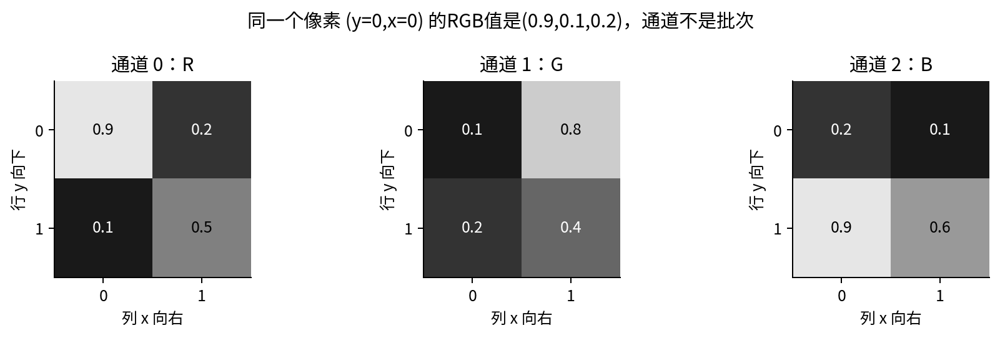

常见8位图像把整数0至255映射成浮点0至1，需要除以255；仅把uint8改成float并不自动缩放。16位科学影像不能不加判断地除以255，原始数值还可能带曝光、物理量或校准含义。灰度复制成三通道并没有增加信息；有透明度的图像还要说明如何与背景合成。

文件方向、EXIF、颜色空间、压缩与解码器也可能改变输入。一个可靠管线应先固定这些约定，再抽样目视。本文代码处理已经解码的数组，不实现EXIF纠正、颜色管理或医学格式读取。不能因为后面的网络可运行，就省略上游数据解释。

主实验是合成单通道传感器强度，给定0.95前景后加高斯噪声，所以少量像素可能超过1；它没有默默裁到[0,1]。图的灰度显示范围固定为0至1，超出者只在显示时使用端点色，真实数值原样进入归一化。这与库中“普通浮点照片期望0至1”的接口约定要区分。

## 3 坐标要分像素索引和几何边缘

行向下、列向右，离散像素索引为$r=0,\ldots,H-1$、$q=0,\ldots,W-1$。水平翻转时，像素列索引变为$q'=W-1-q$。若用连续几何边缘表示边界框，图像范围是$[0,W]\times[0,H]$，翻转对应$x'=W-x$，少了的那个1来自不同坐标定义。

本讲框采用半开XYXY：$(x_{\min},y_{\min},x_{\max},y_{\max})$，宽高为$x_{\max}-x_{\min}$和$y_{\max}-y_{\min}$。它包含左/上边缘对应的像素区间，而不把右/下边缘再算一个像素。不能把这种框公式与包含端点的整数索引框混用。

先裁剪$(t,l,h,w)$，即从行$t$、列$l$开始取高$h$、宽$w$，框坐标先减去$(l,t,l,t)$，再裁到$[0,w]\times[0,h]$。面积为0的框剔除，并保存它原来的索引，以便同步处理类别、实例ID等字段。随后水平翻转框：

$$(x_{\min}',y_{\min}',x_{\max}',y_{\max}')=(w-x_{\max},y_{\min},w-x_{\min},y_{\max}).$$

图像、掩码与框必须应用相同的实际随机参数。分别调用三次随机裁剪，通常会得到三块不同区域；即使每次设同样总种子，也容易因调用顺序改变而错位。

![图2 原图4×6，裁剪top=1、left=2、height=3、width=4，再水平翻转。主框从[1,1,5,3]变成[1,0,4,2]；另一个框被完全裁掉。](figures/02_geometry.png)

该主框原面积8，裁后面积6，保留比例3/4。这个比例是框面积的比例，不一定等于目标真实可见像素比例。分类任务即使没有框，也要判断裁剪是否去掉了决定标签的内容；一个“有病灶”标签不能在病灶被裁掉后不加判断地保留。对具体领域应由任务定义与标注规范决定，而不是默认自然图像习惯适用。

## 4 插值怎样产生新的像素值

缩放并不只是改变shape。输出像素中心要先映射回输入坐标，再根据邻居估计值。本讲的双线性实现固定align_corners=False、半像素映射、边缘夹取、antialias=False。在一条轴上，输出索引$j$映回

$$u=(j+0.5)\frac{H}{H'}-0.5.$$

把$u$夹到$[0,H-1]$，令$u_0=\lfloor u\rfloor,u_1=\min(u_0+1,H-1),\alpha=u-u_0$。横轴同理得$v_0,v_1,\beta$。双线性值为

$$X'(r,c)=(1-\alpha)(1-\beta)X(u_0,v_0)+(1-\alpha)\beta X(u_0,v_1)$$

$$\quad+\alpha(1-\beta)X(u_1,v_0)+\alpha\beta X(u_1,v_1).$$

四个系数非负且和为1。以$\left[\begin{smallmatrix}0&1\\2&3\end{smallmatrix}\right]$缩放到3×3为例，中心映回$(0.5,0.5)$，四个权重均为1/4，所以中心值1.5。最外侧映射坐标为-1/6与7/6，按本约定夹到边缘。

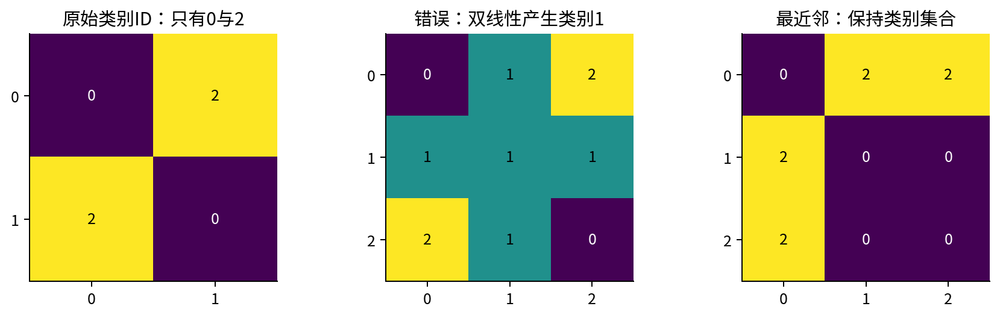

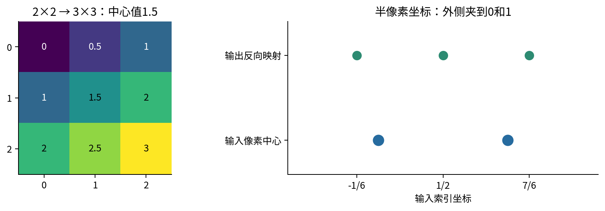

分类ID掩码通常用最近邻；本代码采用nearest-exact的中心取样约定，并与PyTorch逐点核对。若处理概率图，插值可能有意义，但它已经不是离散类别ID。框则应按连续坐标缩放和裁剪，不应该把4个数字当成一张小图做双线性插值。[S2]

降采样会丢失高频信息。双线性只是邻点加权，并不等于对所有缩小比例做了充分低通；是否启用抗混叠需要明确记录。较复杂插值还可能产生超出输入范围的值。更平滑的图也不保证标签保持或科学信息无损。

## 5 归一化的统计量从哪里来

把普通强度转换成浮点后，常用逐通道仿射变换$U=(X-\mu_c)/s_c$。$s_c$必须正且有限。它改变数值尺度，不改变图像的空间坐标。本讲的固定均值/标准差来自未增强的训练像素，之后所有训练方案、验证和测试均复用这组数。

主实验得到$\mu\approx0.481827790907$、$s\approx0.315759422313$，其中标准差使用总体除数而不是样本修正。这里每图尺寸相同，所以按像素平均也使每图权重相同；若图像尺寸不同，按全部像素平均会让大图贡献更多，需要说明究竟想估计什么。

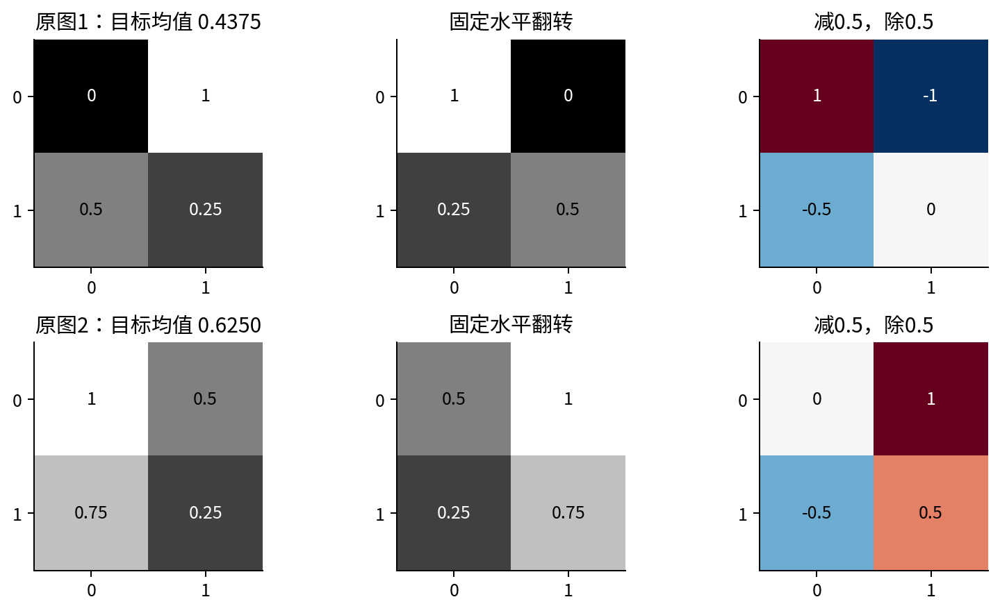

不能为了让测试直方图好看而重新用测试图拟合均值/标准差，也不能把每张图独立归一化与全训练集固定归一化混为一谈。每图减自己的均值会去掉图间平均亮度差，若该差就是科学信号，任务可能被改变。采用预训练权重时还需核对其原来的通道顺序、值域与预处理约定。

验证/测试通常关闭训练随机增强，使用事先固定的确定性处理。若做测试时增强，应单列算法、参数和多次前向预算，冻结聚合规则，不能把结果混作单次普通推理。颜色扰动、裁剪与归一化的顺序也可能不交换：先裁到0至1再归一化，与先归一化再裁到0至1表达的是不同操作。

## 6 一个完整实例：增强也在计算链上

为清楚展示前处理的梯度，本段使用两个2×2灰度数组：

$$X_1=\begin{bmatrix}0&1\\0.5&0.25\end{bmatrix},\qquad X_2=\begin{bmatrix}1&0.5\\0.75&0.25\end{bmatrix}.$$

任务是预测原图空间均值，固定标签$y_1=7/16=0.4375,y_2=5/8=0.625$。每幅图固定水平翻转，再用$\mu=s=0.5$归一化，按行展开得到

$$u_1=(1,-1,-0.5,0),\qquad u_2=(0,1,-0.5,0.5).$$

例如样本1左上原值0翻转到右上，归一化后为-1；右上原值1翻转到左上，归一化后为1。用四权重与一个偏置的仿射头$\widehat y_i=w^\top u_i+b$，初值$w=(0.2,-0.1,0.1,0.3),b=0$。目标是两例平均half-MSE：

$$L=\frac12\sum_{i=1}^2\frac12(\widehat y_i-y_i)^2.$$

外面的1/2来自两样本平均，里面来自平方损失定义。前向分别为

$$\widehat y_1=0.2(1)-0.1(-1)+0.1(-0.5)+0.3(0)=0.25,$$

$$\widehat y_2=0.2(0)-0.1(1)+0.1(-0.5)+0.3(0.5)=0.$$

|样本|预测|标签|残差|单样本half-MSE|
|---|---:|---:|---:|---:|
|1|0.25|0.4375|-0.1875|0.017578125|
|2|0|0.625|-0.625|0.1953125|

相加再平均，$L_0=0.1064453125=109/1024$。这是便于算清楚的回归实例，不是后面CNN分类主实验，也不把均值预测称为复杂研究任务。

## 7 局部导数、全部参数和原始输入

损失对每例预测的导数$g_i=r_i/2$，分别为-0.09375和-0.3125。预测对$w_j$导数为$u_{ij}$，对偏置为1；因此每例参数贡献是$(g_iu_{i1},\ldots,g_iu_{i4},g_i)$。

|来源|$w_0$|$w_1$|$w_2$|$w_3$|$b$|
|---|---:|---:|---:|---:|---:|
|样本1|-0.09375|0.09375|0.046875|0|-0.09375|
|样本2|0|-0.3125|0.15625|-0.15625|-0.3125|
|相加|-0.09375|-0.21875|0.203125|-0.15625|-0.40625|

前处理对输入的链也不能跳过：$\partial\widehat y_i/\partial u_{ij}=w_j$，$\partial u/\partial X_{\rm flipped}=1/s=2$，水平翻转是一个置换，其反向要把每个位置的梯度移回原始坐标。因此原图行优先输入梯度为

$$\nabla_{X_1}L=(0.01875,-0.0375,-0.05625,-0.01875),$$

$$\nabla_{X_2}L=(0.0625,-0.125,-0.1875,-0.0625).$$

这些输入导数把监督标签当作固定常数。虽然我们用均值规则生成标签，做“网络对输入的敏感度”时没有同时让标签随扰动改变；若你研究的是复合生成过程$\ell(f(X),y(X))$，还要加标签路径的导数，那是另一个问题。

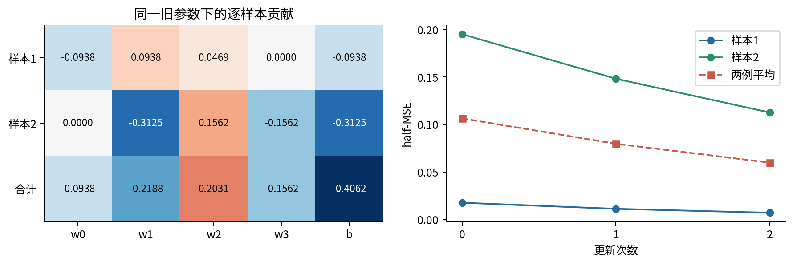

随机增强的采样步骤并不自动成为可训练参数。例如随机决定是否翻转是离散抽样，我们不对这个决定求普通导数。主训练对网络参数求梯度；若另外学习增强策略，需要专门定义目标和估计方法，不能默认autograd替你解决了它。

## 8 同步更新后，重新走完整条管线

学习率固定0.1，五个参数同步更新为

$$w'=(0.209375,-0.078125,0.0796875,0.315625),\qquad b'=0.040625.$$

仍从原始两图出发，使用相同翻转和固定尺度，得到相同$u_1,u_2$，再用新头预测：

$$\widehat y'_1=0.209375+0.078125-0.03984375+0.040625=0.28828125,$$

$$\widehat y'_2=-0.078125-0.03984375+0.1578125+0.040625=0.08046875.$$

新残差为-0.14921875和-0.54453125，单例损失分别0.01113311767578125和0.14825714111328125，平均$L_1=0.07969512939453125$。

再完成第二轮，新的$g$为$(-0.074609375,-0.272265625)$。样本1贡献是$(-0.074609375,0.074609375,0.0373046875,0,-0.074609375)$；样本2为$(0,-0.272265625,0.1361328125,-0.1361328125,-0.272265625)$。

合计$(-0.074609375,-0.19765625,0.1734375,-0.1361328125,-0.346875)$。更新得到$w''=(0.2168359375,-0.058359375,0.06234375,0.32923828125)$、$b''=0.0753125$。第三次预测为0.3193359375和0.150400390625，平均损失0.059801883721351624。精确Fraction账本保存三次状态、每例贡献与原图输入梯度，并用独立PyTorch路径核验。

这里固定变换是为了隔离参数更新。真实随机增强每步可以换参数，所以记录的“当步增强损失”同时受到样本变换和网络参数的影响，不必单调下降。若要画可比较的诊断曲线，另定义固定评估输入，不能把不同随机图像上的损失拼成同一个静态目标。

## 9 标签保持与标签变换

增强通常写成$(X,y)\mapsto(T_\xi X,A_\xi y)$。若$A_\xi y=y$，才叫标签保持；如果目标本身应随变换改变，应当正确计算$A_\xi$，而不是拒绝所有几何增强。

对原图均值回归，水平翻转只置换像素，所以标签不变。对横条/竖条分类，90度旋转互换类别，必须用$y'=1-y$。对检测框、关键点和分割图，标签坐标要同步变化。对带左右语义的类别、文字、重力方向或物理边界，哪怕一个简单翻转也可能改变目标。

裁剪尤其需要检查：它不是可逆置换，可能丢掉全部目标。如果目标是否存在取决于保留内容，就需要重新标注、筛选裁剪，或者给“不足以判断”的情形适当处理，不能只因代码能返回数组就继续训练旧标签。亮度和颜色变化也不是天然安全；量化颜色或绝对信号强度可能正是预测目标的一部分。

数学目标应写成增强后的期望风险：

$$L_{\rm aug}(\theta)=\frac1N\sum_i\mathbb E_{\xi}\left[\ell(f_\theta(P(T_\xi X_i)),A_\xi y_i)\right],$$

其中$P$是确定性预处理。一次随机增强只是这个期望的一个抽样估计；增强分布由我们设计，并不自动等于部署分布。若标签映射错了，我们会精确优化一个错误的目标。相关研究讨论了不恰当不变性约束的限制，本讲不把它当成任意领域增强的许可。[S3]

## 10 可重放的背景实验

主任务分辨8×8灰度图中的竖条（0）与横条（1）。48训练图、48验证图和128测试图分别由种子4501、4502、4503生成，类别各占一半。每条长度4、宽度1，位置与噪声保存在原数据中；前景强度0.95，背景却与标签完全相关：竖条背景0.15，横条背景0.75。加独立标准差0.025的高斯噪声。

这故意构造了一条简单但不可靠的预测途径：只看大面积背景亮暗便能在原相关分布中猜对标签。真实数据也可能包含与目标相关却不稳定的背景或采集信号；这里借用shortcut learning研究的提问方式，但只对本合成生成器作精确解释。[S4]

测试不换形状、位置和噪声，而给同一128幅图重渲染三种视图：原相关背景；反相关背景$1-b$，即竖条0.85、横条0.25；中性背景0.45。注意反相关不是把0.15与0.75原样交换，它按明确公式生成。每组指标来自同一批样本的配对视图，不能当成384幅独立图像。

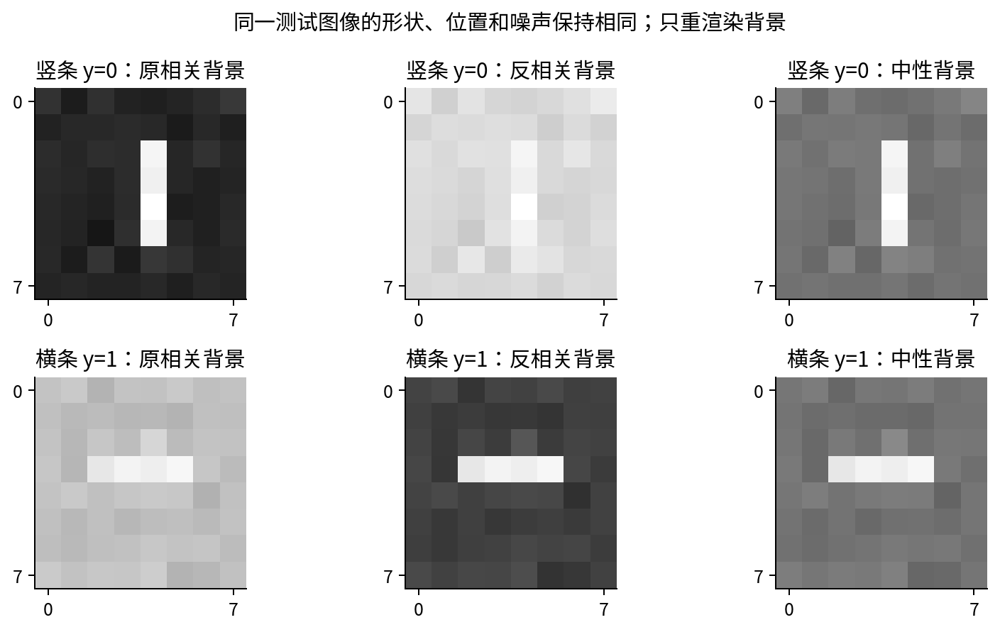

训练增强使用生成器提供的真实前景掩码，只在背景像素上把$b$换成新抽样$b'\sim\operatorname{Uniform}[0.1,0.8]$：$X'=X+(b'-b)(1-M)$。前景与原有噪声都不改变。它使用了训练时已知的合成掩码，是一种拥有额外标注信息的受控干预；不能假定任意真实照片都能免费得到同样准确的前景分离。

反相关竖条背景0.85还略超出训练增强范围上端0.8，因此本例成功也不等于只在增强值域内部插值。我们没有据此声称任意强度外推安全，更没有扩展到真实自然图像。

## 11 四臂、三种子，冻结同一训练预算

四个处理依次是：不增强；只重采背景；重采背景再以概率1/2旋转90度但错误保留旧标签；同样重采和旋转但正确交换标签。后两臂每一步使用完全相同的增强图像，只区别标签更新，因此可以直接检查错标签造成的后果。

每臂3个初始化种子4511、4512、4513，网络参数与初始值在同种子下配对。网络为3×3卷积1到4通道、补边1、ReLU、展平256值、一个线性logit。参数数$4(9+1)+256+1=297$。没有BatchNorm、dropout或预训练，避免混入额外状态。

损失为二分类logit负对数似然，使用稳定形式$\operatorname{softplus}(z)-yz$，对48图取平均。每臂160次全批次SGD更新、学习率0.2，合计12次训练、1920次更新、92160次训练图呈现。这里只匹配网络更新和图呈现预算，不声称各增强的墙钟开销相同。

三份随机计划提前生成，分别保存160×48个新背景值和旋转标志。数据、计划与协议都有摘要。验证集只做相同背景分布的描述性读数，不用于调参；没有学习率搜索、早停、最佳种子选择或看测试后延长训练。若今后开始选择方案，必须建立新的选择/评价边界。

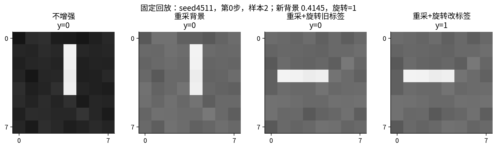

只保存总种子仍可能因调用顺序、库版本或工作进程改变而得到另一组参数。保存实际抽到的参数更便于审计，但也不代替保存变换顺序、插值约定与代码版本。本实验顺序固定为重采背景、可选旋转、固定训练尺度归一化；完整1932个参数状态与每步增强损失均保留。

## 12 结果要同时看成功与代价

下表是3个训练种子的指标均值，不是集成模型。准确率按logit≥0判为类1，NLL直接用logit稳定计算。

|方案|原相关NLL|反相关NLL|中性NLL|反相关准确率|
|---|---:|---:|---:|---:|
|不增强|0.000226|8.193190|0.651420|0%|
|重采背景|0.043014|0.068265|0.001291|100%|
|重采+旋转旧标签|0.630811|0.587661|0.536284|68.75%|
|重采+旋转改标签|0.040019|0.079245|0.001914|100%|

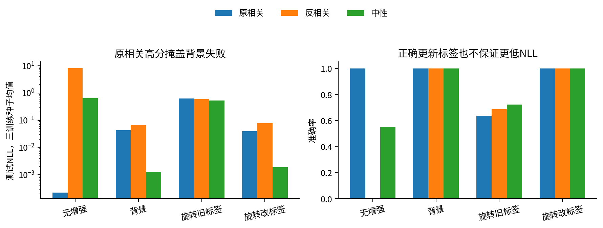

不增强在原相关与验证图上的准确率都是100%，却在反相关测试中完全错误，且错误很自信，所以NLL达到8以上。背景增强在这个问题上避免了该失败，但原相关NLL比无增强高，说明不能只挑一项改善指标。

正确旋转并没有在反相关和中性NLL上胜过只改背景；因此不应把“增加一种合法增强”写成必然增益。错误标签臂也没有刚好降到50%：有限数据与随机优化、方向变换后的空间支持不完全对称等，仍可能留下预测线索。尤其长度4是偶数，旋转会改变条中心相对像素网格的相位；这份生成器不是方向与位置完全均衡的理想分布。我们保留原结果与数据，没有为了让错误臂恰好随机猜测而重抽样本。

错误臂三个种子的原相关准确率约64.06%、40.63%、86.72%，差异很大。报告均值不应掩盖它。训练种子变化只反映固定数据上的算法变动，不等于独立抽了三份现实数据，也不支持普遍显著性结论。

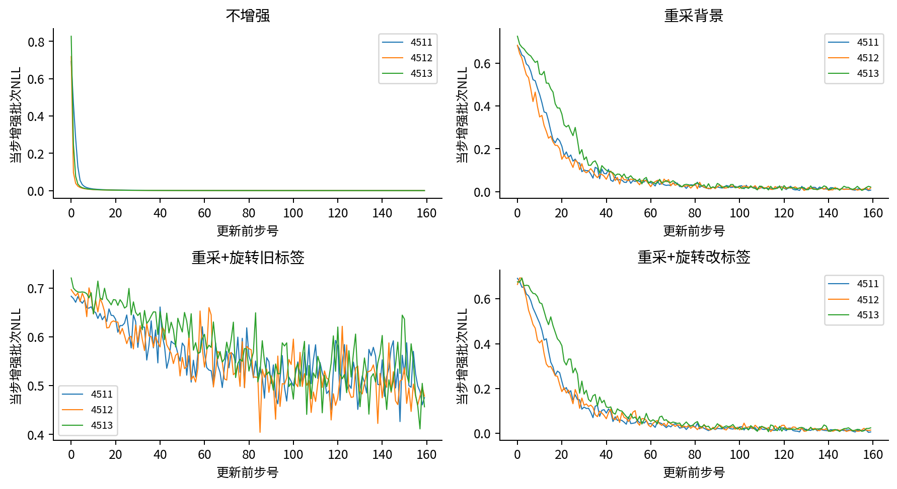

## 13 逐步审计输入管线

第一层检查原始含义：采集单位、颜色或物理通道、坐标方向、值域与数据拆分。第二层检查确定性变换：已知像素、已知框与掩码能否逐项对齐，训练拟合的尺度是否原样应用到测试。第三层检查随机变换：实际参数能否回放，标签应保持还是改变，目标内容被裁掉后怎样处理。

第四层看模型与评价：准确率不变时NLL仍可变化，背景干预与普通测试要分开报告，配对视图不能冒充更多独立样本。若未来做统计区间，应先确定独立图像/采集实体与相关视图的层级；本讲只报告固定描述性结果，没有用窗口或训练种子充当现实样本量。

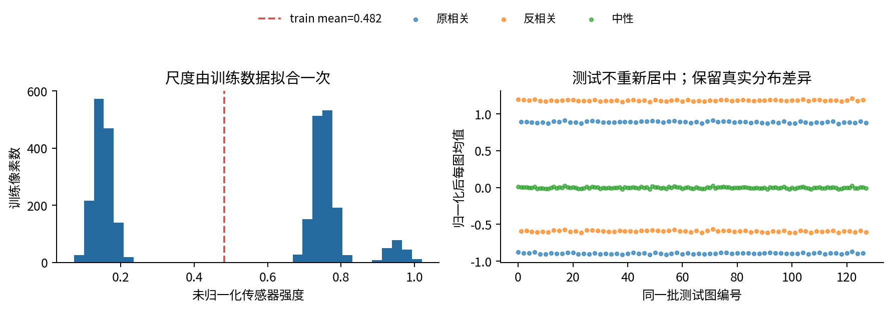

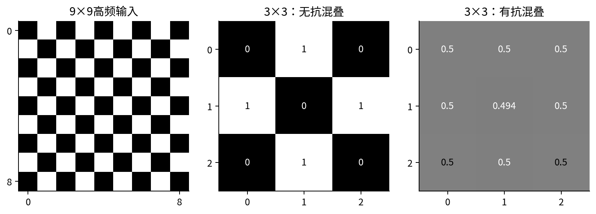

用于医学或科学图像时，可以先提出领域问题：旋转是否改变重力或解剖左右？颜色是否代表定量浓度？裁剪是否改变边界条件？插值是否改变小目标或频谱？这些问题没有通用的“可以”答案，需要数据、标签定义和领域验证。增强不是替代这一步的捷径。

## 14 实现、独立参照与支持范围

代码包含有限实数CHW归一化、半像素双线性缩放、整数ID最近邻、内部裁剪加水平翻转的图/掩码/半开框同步处理。实现拒绝空数组、非有限值、错误维度/通道、非正标准差、越界裁剪、非法框与超过一百万元素的图输出。计算溢出报错；仍受float64舍入和下溢约束。

主实验只接受随课冻结的数据与计划，通过摘要验证后执行；它不是可接收任意不可信图像文件的生产级数据加载器。没有实现一般任意角度旋转、透视变换、颜色空间管理或抗混叠重采样器。抗混叠图使用官方PyTorch作为明确的额外演示，不暗示自写双线性已经支持它。

独立核验包括：双线性与nearest-exact逐点对照官方2.7接口；已知框与变换后掩码像素范围对齐；Fraction账本与框架梯度核验；主网络NumPy滑窗/收缩反传和全部297参数中心差分；固定回放前景保持、两旋转臂同图不同标签；正常与-O执行。正式12次训练在第0、79、159步又检查NumPy与Torch梯度，最大绝对差约$1.94\times10^{-16}$。

完整参数轨迹用无损gzip保存，摘要同时覆盖压缩内容与解压后的原字节。多个输出文件分别原子替换，但不声称整个目录具备跨文件断电事务。Notebook真实重跑全部12次训练，保存实际生成图，而不只展示旧截图；具体核验范围见verification.json。

## 15 练习与下一讲

1. 给出一个HWC直接reshape为CHW而发生通道错位的具体例子。
2. 推导像素翻转$W-1-q$和边缘框翻转$W-x$为何不同。
3. 复算图2主框裁剪、面积保留与水平翻转，解释被丢弃框如何追踪。
4. 手算2×2到3×3的中心插值，以及掩码类别1为什么不合法。
5. 说明固定训练尺度与每图归一化的任务含义差别。
6. 完成手算两样本的全部前向、局部导数、参数贡献与原图输入梯度。
7. 完成第一次同步更新后的前向，再核对第二轮和第三前向。
8. 分别给出标签保持、标签变换和内容丢失三种增强例子。
9. 计算主网络参数量、全部更新数与训练图呈现数。
10. 用背景三视图结果解释为什么普通验证集没有发现失败。
11. 为什么错误旋转臂不是严格50%，而正确旋转也不保证更低NLL？
12. 为一个自己熟悉的科学图像任务写一份增强审计清单与预先冻结的消融计划。

独立实验见lab，完整答案见answers。046将把整图分类推进到框与像素目标；本讲的几何和标签同步是进入结构化预测前必须掌握的基础。

## 一手来源

[S1] [Torchvision transforms官方文档](https://docs.pytorch.org/vision/stable/transforms.html)：输入轴、dtype范围与同时处理图像/框/掩码。动态网页可能比本课运行环境新；本课未安装或调用Torchvision。

[S2] [PyTorch 2.7 interpolate官方文档](https://docs.pytorch.org/docs/2.7/generated/torch.nn.functional.interpolate.html)：插值模式、align_corners、nearest-exact与antialias约定。

[S3] Lee、Hwang、Shin，2020，[Self-supervised Label Augmentation via Input Transformations](https://proceedings.mlr.press/v119/lee20c.html)：关于输入变换与标签/不变性假设的研究背景，本文未复现该方法或其性能结果。

[S4] Geirhos等，[Shortcut Learning in Deep Neural Networks](https://arxiv.org/abs/2004.07780)：背景相关规则可能在改变条件后失效的研究视角。所有本课图像、干预、实验结果和叙事独立制作。
