# 046 检测分割与结构化预测

从“图里有什么”走向“在哪里、占哪些像素”，先把预测对象与评价规则说清楚。

## 1 本讲的位置与目标

先修039、044、045：039解释损失、类失衡与决策阈值；044建立卷积特征与残差路径；045规定CHW图像、半开XYXY边缘坐标，以及几何增强必须同步更新标注。本讲不假设你已经训练过检测器。完成后，应能从标签结构选损失，手算IoU与一次像素模型更新，辨认训练匹配、预测去重和评估匹配的区别，并复查一个包含空目标与重叠目标的小型分割实验。

我们真正训练的是二值语义分割模型。检测部分有原创数值例子、NMS和AP的独立实现，但不把它包装成完整检测器训练，更不声称实现了官方COCO评估器。所有图片、掩码和图示均在本单元原创生成，无模型下载、GPU或付费API要求。

最值得记住的实际结果：全预测背景能得到89.84%的测试像素准确率，前景IoU却是0；一个无需神经网络的3×3均值阈值基线达到0.6207 IoU。小CNN更好一些，但亮背景偏移会使它明显退步。高指标必须连同预测对象、聚合规则和失败样本一起阅读。

## 2 同一张图，四种不同输出

整图分类输出一个类别，或一组是否出现的类别。检测输出可变长集合，每条记录含类别、框和分数；集合没有天然顺序。语义分割输出每个像素的类别，同类的两件物体允许合成同一个前景区域。实例分割还须区分每件物体的掩码，即使它们属于同一类。

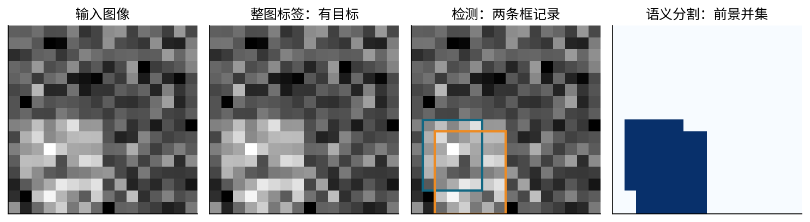

主实验把矩形的并集标成1，背景标成0；两个矩形的交叠处仍是1，不能加成2。这里不存在遮挡后的可见轮廓推断，矩形的并集就是生成器给定的任务。检测记录则可以保留两个重叠框。不能拿分割掩码连通域的数量直接当实例检测数量。

输入数组为$N\times1\times16\times16$，输出logit形状也为$N\times1\times16\times16$。logit是未过sigmoid的实数分数。目标掩码先存为整数0/1，计算BCE时转为同形状浮点张量。不是把$N\times16\times16$无意广播到额外轴上。

多类互斥语义分割常用$N\times C\times H\times W$的logit与$N\times H\times W$的整数类别；每像素softmax后概率之和为1。多标签像素任务允许多个类别同时成立，通常每类单独sigmoid。这两个任务不能只因数组尺寸接近就互换。

## 3 坐标合同：框是边缘，像素是单元

令$x$向右、$y$向下。宽$W$、高$H$图像的边缘范围为$[0,W]\times[0,H]$。框写作$(x_1,y_1,x_2,y_2)$，对应半开区域$[x_1,x_2)\times[y_1,y_2)$，宽$x_2-x_1$、高$y_2-y_1$。像素$(r,c)$的中心是$(c+1/2,r+1/2)$。整数框$[1,2,5,7]$覆盖数组mask[2:7,1:5]，面积为20，不是30。

半开连续边缘公式没有“+1”。若来自另一套含端点整数坐标，必须显式转换；把不同约定混用，小框IoU尤其容易偏离。空目标图使用形状$(0,4)$的空框数组，不用零面积框占位。我们的几何参照允许负坐标以便研究裁剪前几何，但实际合成数据的全部框都在图内；几何计算的合法域与数据集合法域是两层检查。

水平翻转后的边缘为$(W-x_2,y_1,W-x_1,y_2)$，不能只对两个$x$各做$W-x$而不交换左右。图像可用合适的连续插值；类别掩码使用最近邻以保留ID。预测logit是连续量，恢复到原图尺寸时可以插值logit后再阈值化，但插值模式和坐标映射必须固定。045的half-pixel约定在这里继续适用。

## 4 IoU：从交集面积开始逐段推导

两个合法框$A,B$的交叠宽高为

$$w_I=\max\{0,\min(x_{2A},x_{2B})-\max(x_{1A},x_{1B})\},$$

$$h_I=\max\{0,\min(y_{2A},y_{2B})-\max(y_{1A},y_{1B})\}.$$

先求两边缘的较小右界与较大左界，做差；差为负表示没有相交宽度，所以截为0。令$I=w_Ih_I$，$S_A=(x_{2A}-x_{1A})(y_{2A}-y_{1A})$，$S_B$同理。并集不是两面积直接相加，因为交叠被算了两次：

$$U=S_A+S_B-I,\qquad \operatorname{IoU}=I/U.$$

对正面积框，$U>0$。接触但没有正面积交叠时IoU为0；完全相同则为1。$A=[0,0,2,2]$、$B=[1,0,3,2]$的$I=2$、$U=4+4-2=6$，故IoU为$1/3$。这跟两个框中心相距多少不是同一个量。

为了看清分段导数，固定真框$[0,0,2,2]$，预测框为$[s,0,s+2,2]$，只平移、不改面积。令$d=|s|$：当$d<2$，$I=2(2-d)$、$U=8-I=2(2+d)$；当$d\geq2$，$I=0$。于是

$$\operatorname{IoU}(s)=\begin{cases}(2-|s|)/(2+|s|),&|s|<2,\\0,&|s|\geq2.\end{cases}$$

在$0<s<2$的分支，用商法则得到$[-(2+s)-(2-s)]/(2+s)^2=-4/(2+s)^2$；在$-2<s<0$，导数为$4/(2-s)^2$；在$|s|>2$，导数为0。$s=0$与$s=\pm2$左右导数不一致，不能把中心差分平均值称为唯一导数。

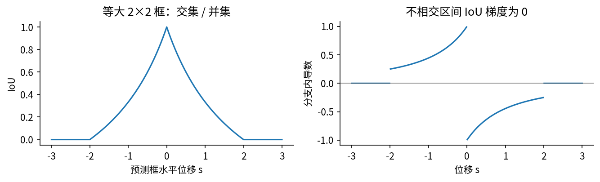

一般框参数$u$在某个固定分支内满足

$$\frac{\partial(I/U)}{\partial u}=\frac{U\,\partial I/\partial u-I\,\partial U/\partial u}{U^2},\quad \partial U=\partial S_A+\partial S_B-\partial I.$$

要继续展开，先确定哪一个边缘被min/max选中。比如$x_{1A}>x_{1B}$且交叠宽度为正，则$\partial w_I/\partial x_{1A}=-1$；反之若左边界由$B$控制，则此导数为0。边界相等处另行处理。自动微分只是采用实现约定，不会消除这些数学分段。

## 5 框回归：为什么用中心偏移与对数尺度

锚框是预测的参考位置。它的中心$(a_x,a_y)$、宽高$(a_w,a_h)$都已知且宽高为正。真框的中心、宽高写作$(g_x,g_y,g_w,g_h)$。一种常见目标编码为

$$t_x^*=(g_x-a_x)/a_w,\quad t_y^*=(g_y-a_y)/a_h,$$

$$t_w^*=\log(g_w/a_w),\quad t_h^*=\log(g_h/a_h).$$

偏移除以锚框尺寸，减少像素尺度对目标数值的直接影响；宽高用对数比值，使放大两倍与缩小两倍对应相反数。解码预测$t$时，$x=a_x+a_wt_x$、$y=a_y+a_ht_y$、$w=a_w\exp(t_w)$、$h=a_h\exp(t_h)$，再取左右边缘$x\mp w/2$。指数保证正尺寸，但大log-scale可能溢出；代码有明确范围限制，不能用无界指数掩盖异常输入。

锚框$[0,0,2,2]$与真框$[1,0,5,2]$分别有中心$(1,1)$与$(3,1)$，宽高$(2,2)$与$(4,2)$。逐项得到目标$(1,0,\log2,0)$。使用`encode_boxes`后再解码应还原真框；这一步比先训练更值得验证。

对一个编码残差$r=t-t^*$，定义$\beta>0$的Smooth L1：

$$\rho_\beta(r)=\begin{cases}r^2/(2\beta),&|r|<\beta,\\|r|-\beta/2,&|r|\geq\beta.\end{cases}$$

$$\rho_\beta'(r)=\begin{cases}r/\beta,&|r|<\beta,\\\operatorname{sign}(r),&|r|\geq\beta.\end{cases}$$

两支在$|r|=\beta$处函数值和一阶导数连续。小残差像平方损失，大残差的单坐标梯度幅度为1。若四坐标取平均，每个导数再除以4；若按正锚框数平均，又需要说明坐标求和还是平均。不能看见相同损失名就假设缩放相同。

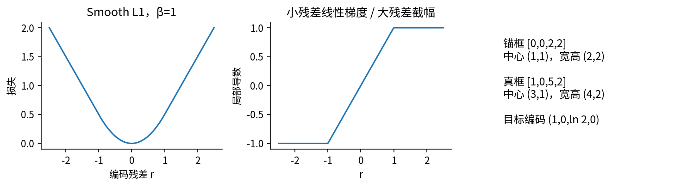

取预测编码$(0.5,0.2,0,0.1)$，$\beta=1$。四残差为$(-0.5,0.2,-\log2,0.1)$，都在二次分支。平均损失为$[0.125+0.02+(\log2)^2/2+0.005]/4=0.0975566$，对预测编码的梯度是$(-0.125,0.05,-0.1732868,0.025)$。学习率0.4同步更新后编码为$(0.55,0.18,0.0693147,0.09)$。

若编码来自$t_w=uh+v$，继续链式求导：$\partial L/\partial u=(\partial L/\partial t_w)h$，$\partial L/\partial v=\partial L/\partial t_w$。若损失直接作用于解码宽度，另有$\partial w/\partial t_w=w$。不要把“编码损失”与“解码坐标损失”混为一条反向路径。以上编码与分类/回归分工可参照[Faster R-CNN原论文§III-A](https://arxiv.org/html/1506.01497v3)；本讲数值例子与实现均为原创。

## 6 三种“匹配”必须分开

训练分配决定哪个预测位置接受哪个监督。有些锚框方案让多个锚框同时对应同一个真物体，并把中间IoU范围设为忽略。这不是评估时一物体只能计一次的规则。不同检测器也可采用集合匹配，不存在一套匹配规则适合所有架构。

推理阶段的非极大值抑制NMS不读取真值。对同一图像、同一类别，先按分数降序保留第一框，再删去与它IoU大于阈值的其他框，重复。我们的函数只处理已经分组好的单类一张图；相等分数保持原输入顺序；IoU恰好等于阈值时保留。这种严格大于的约定见[Torchvision 0.22 NMS文档](https://docs.pytorch.org/vision/0.22/generated/torchvision.ops.nms.html)。官方同时提醒CPU/GPU对同分框的选择可能不同，本讲的稳定规则不代表任意实现都相同。

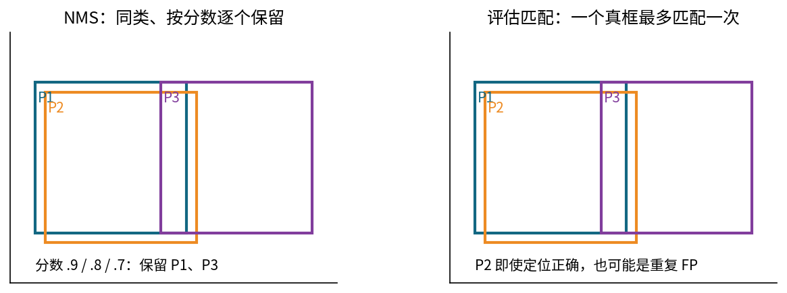

评估匹配在每个IoU门槛下，按预测分数处理当前图像当前类别的预测，找尚未使用的、IoU合格的真框。一旦匹配就记TP，不能再次使用该真框；重复预测计FP。未匹配真框最终是漏检。我们的教学实现选最高IoU，IoU同分选择较早真值；它不处理crowd、ignore、面积分组或maxDets。

例如两张图各一件物体，预测排序是“图A正确框、图A重复框、图B正确框”，TP序列就是$(1,0,1)$，并不是$(1,1,1)$。空图中的每个普通预测都是FP；真值不应被伪造为一个背景框。整个评估集合该类没有任何真值时，AP标为未定义并从类别平均中按声明规则排除，不能偷偷记成100%。

## 7 从Precision、Recall走到AP与mAP

排序前$k$条预测的累计TP为$T_k$、累计FP为$F_k$，总真目标数为$G$。定义$P_k=T_k/(T_k+F_k)$、$R_k=T_k/G$。重复预测增加分母却不增加召回；漏掉的真物体限制最终召回上限。未达到的召回区域必须贡献0。

常见插值包络是$p_\mathrm{interp}(r)=\max_{k:R_k\geq r}P_k$，若没有候选则为0。教学全点AP按每次召回增加的宽度乘上该区间的包络高度。前例的P为$(1,1/2,2/3)$、R为$(1/2,1/2,1)$，故AP为$(1/2)\cdot1+(1/2)\cdot(2/3)=5/6$。

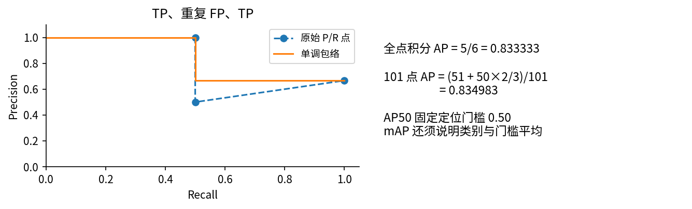

若改在$r=0,0.01,\ldots,1$的101个点平均，前51点为1，后50点为2/3，得到0.834983。AP50指IoU门槛固定0.50时的AP，不是“分数大于0.5的预测准确率”。mAP还必须说明跨哪些类别、哪些IoU门槛平均。目标检测没有一个可随意套用的、计数良好的“真负框全集”，所以也不能拿它与整图分类准确率直接比较。

COCO常用IoU 0.50至0.95、步长0.05，101个召回采样点，并有maxDets、面积、ignore/crowd等规则。需复核官方实现的完整设置；见[COCO官方评估器源码](https://raw.githubusercontent.com/cocodataset/cocoapi/master/PythonAPI/pycocotools/cocoeval.py)。本讲只演示其部分思想，即使101点采样一致，也不称为“COCO mAP复现”。COCO JSON框的常见输入是XYWH，不能将其直接当本讲XYXY。

## 8 从局部特征到密集像素预测

分类头常把空间位置汇总成一个向量；分割头需要保留或恢复空间对应。一个$1\times1$卷积在每个位置混合通道，不把不同位置混在一起。前面的$3\times3$卷积可让该位置读取邻域。下采样扩大某些层的感受野并降低成本，也损失精细位置；上采样不会凭空恢复已经丢失的边界。

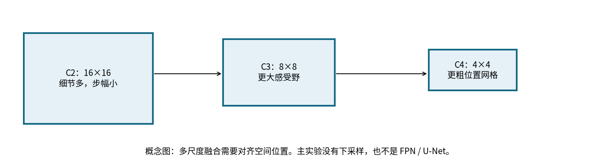

U-Net使用收缩和扩张路径，并将细节特征传入恢复过程；FPN把不同分辨率的特征结合用于多尺度预测。这些是值得进一步阅读的结构思路，不是本讲67参数CNN的别名。[U-Net原论文](https://arxiv.org/abs/1505.04597)、[FPN原论文](https://arxiv.org/abs/1612.03144)

主实验全程保持16×16，不含池化、BN、残差、预训练或复杂解码器。我们把044的局部卷积知识用于密集输出，并刻意减少额外变量。后续研究若加入残差或多尺度，必须单独说明参数量、MAC、训练预算和对齐方式。

## 9 像素BCE：从局部导数到共享梯度

令像素logit为$z$，$p=\sigma(z)=1/(1+e^{-z})$，标签$y\in\{0,1\}$。单像素损失为$\ell=-y\log p-(1-y)\log(1-p)$。先对$p$求导，再乘sigmoid导数：

$$\frac{\partial\ell}{\partial p}=-\frac y p+\frac{1-y}{1-p},\qquad \frac{\partial p}{\partial z}=p(1-p).$$

两项分别相乘得到$-y(1-p)+(1-y)p=p-y$，故$\partial\ell/\partial z=p-y$。若对$M$个有效像素取平均，每条路径是$(p-y)/M$。图像大小不同时，先逐图平均再跨图平均，与把所有像素合并平均通常不是同一个权重分配。

直接先计算极接近0或1的$p$再取对数可能溢出。对二值标签使用稳定形式$\ell=\log(1+e^z)-yz$，其中softplus再用稳定数值实现。独立参照采用`logaddexp`，并与框架在$z=\pm1000$等点核对。不要把已经sigmoid的概率送进BCEWithLogitsLoss。[PyTorch 2.7官方接口](https://docs.pytorch.org/docs/2.7/generated/torch.nn.BCEWithLogitsLoss.html)

设卷积头$z_{ij}=\sum_c v_c h_{cij}+b$，则$\partial L/\partial v_c=\sum_{i,j}(\partial L/\partial z_{ij})h_{cij}$。同一个$v_c$在所有图像与位置共享，梯度必须把全部使用路径相加。某一个像素犯错不意味着可以只更新“属于它”的一份独立卷积参数。

## 10 四个像素、两个参数：一遍不省的训练

使用两张仅有两个位置的灰度图：$A:x=(0,1),y=(0,1)$；$B:x=(1,2),y=(1,0)$。这里数值是教学特征，不限制在真实图像的0到1范围。共享$1\times1$模型$z=wx+b$，初值$w=\log2=0.69314718$、$b=0$。总损失为四个像素BCE的平均，也等于两张图各自像素平均损失再平均。

|像素|x|y|z|p|单像素损失|
|---|---|---|---|---|---|
|A0|0|0|0|1/2|0.69314718|
|A1|1|1|log 2|2/3|0.40546511|
|B0|1|1|log 2|2/3|0.40546511|
|B1|2|0|log 4|4/5|1.60943791|

图A平均为0.54930614，图B平均为1.00745151，总$L=0.7783788273$。最后一个像素虽然更亮，却被指定为背景，使四个监督并非能被亮度完美分离；它会对共享权重产生与两个前景像素相反的压力。

接下来表中$\partial L/\partial p$已经含四像素平均的$1/4$；不能在后面又除一次4。

|像素|∂L/∂p|∂p/∂z|∂L/∂z|∂z/∂w=x|对w的贡献|对b的贡献|
|---|---|---|---|---|---|---|
|A0|1/2|1/4|1/8|0|0|1/8|
|A1|-3/8|2/9|-1/12|1|-1/12|-1/12|
|B0|-3/8|2/9|-1/12|1|-1/12|-1/12|
|B1|5/4|4/25|1/5|2|2/5|1/5|

每行都有$\partial z/\partial b=1$、$\partial z/\partial x=w$。所以输入梯度依次为$(\log2/8,-\log2/12,-\log2/12,\log2/5)$，约$(0.08664340,-0.05776227,-0.05776227,0.13862944)$。这些输入不是可学习参数，不会在本例的SGD中被修改，但反向路径仍可核对。

先在每张图内累加：图A贡献$(\partial L/\partial w,\partial L/\partial b)=(-1/12,1/24)$；图B贡献$(19/60,7/60)$。再跨图相加得到

$$g_w=0-1/12-1/12+2/5=7/30,$$

$$g_b=1/8-1/12-1/12+1/5=19/120.$$

这里的“图A贡献”仍是对总损失的贡献，已经包含平均尺度；不要再与图A单独平均损失的导数混用。

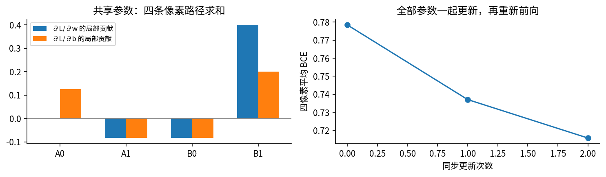

固定学习率$\eta=0.6$，两个参数都用旧参数下计算的梯度同步更新：

$$w'=\log2-0.6(7/30)=0.5531471806,\quad b'=-0.6(19/120)=-0.095.$$

重新前向，四个logit依次为$(-0.095,0.45814718,0.45814718,1.01129436)$。新的概率为$(0.476267846,0.612574544,0.612574544,0.733273381)$，单像素损失为$(0.646774882,0.490084640,0.490084640,1.321531045)$。图A损失反而升到0.568429761，图B降到0.905807843，总损失降到0.737118802。总目标下降不保证每个样本都改善。

第二轮的四个上游梯度为$(0.119066961,-0.096856364,-0.096856364,0.183318345)$。仍乘$x$后累加得$g_w=0.172923963$，直接累加得$g_b=0.108672579$。第二次同步更新得$(w'',b'')=(0.449392803,-0.160203547)$；再前向的概率为$(0.460034553,0.571797638,0.571797638,0.676685714)$，总损失0.715830199。`hand_ledger`保留三轮每条局部导数，测试同时核对框架参数与输入梯度。

## 11 类失衡、Dice与有效像素

主实验只有约9.87%的训练像素是前景。全预测背景的损失和像素准确率可能看起来还可以，但任务要求找前景。一个选项是提高正类损失权重$q$：

$$\ell_q=-qy\log p-(1-y)\log(1-p),$$

$$\frac{\partial\ell_q}{\partial z}=qy(p-1)+(1-y)p.$$

正像素的导数是$q(p-1)$，负像素仍为$p$，不是把所有像素一律乘$q$。本实验只根据训练集计数设$q=n_-/n_+=9.1323438466$，整个实验固定；不在验证或测试集重估。实际传入损失的pos_weight显式继承logit的float64类型；若只写torch.tensor(q)而沿用默认float32，q会先被舍入，后续双精度运算不能恢复原值。真实训练入口回归测试会把默认dtype设为float32，再检查实际q、dtype和第一次参数更新与独立参照一致。loss仍除以总像素数，未改为权重和。因此损失尺度和梯度大小也改变，必须给加权方案相同且明确的学习率搜索预算。

如果真实条件正类概率为$\pi$，最小化理想加权条件风险的解为$p^*=q\pi/(q\pi+1-\pi)$，即赔率扩大$q$倍。所以$p^*\geq1/2$对应$\pi\geq1/(q+1)$，不代表原始分布概率已经校准。039关于权重、校准和阈值的区分仍然成立；实际有限模型不应未经核对就宣称减去$\log q$必定完成校准。

另一个常见重叠目标是soft Dice。令$A=2\sum_i p_i y_i+\epsilon$、$B=\sum_i p_i+\sum_i y_i+\epsilon$，$L_D=1-A/B$，则

$$\frac{\partial L_D}{\partial p_j}=\frac{A-2y_jB}{B^2}.$$

这是对所有选定像素耦合的损失：一个像素改变分母会影响别的位置。它不同于先阈值化后的硬Dice指标。$\epsilon$、按图还是按批聚合、空掩码怎么办都要写清；加平滑常数并不能自动建立正确评价规则。主实验只用BCE及加权BCE，Dice为推导和扩展，不混进已冻结比较。

若标签含ignore区域，应只在有效集合$V$上求和并除以$|V|$。$|V|=0$的批次需显式跳过或按既定规则处理；不能除以0，也不能把ignore ID 255当二值前景。本单元参照仅支持0/1无ignore，并拒绝其他数值，这是接口边界而非实现了所有任务。

## 12 分割评价：先计数，再平均

对阈值后的掩码，$TP$是正确前景像素，$FP$是假前景，$FN$是漏前景，$TN$是正确背景。前景IoU为$TP/(TP+FP+FN)$，像素准确率为$(TP+TN)/(TP+FP+FN+TN)$。硬Dice为$2TP/(2TP+FP+FN)$。对同一非空计数，有Dice$=2\,IoU/(1+IoU)$；它们不是可以任意互换的标尺。

micro前景IoU先跨图累加TP、FP、FN再相除，大区域对结果影响更大。macro逐图IoU先逐图计算再平均，每张图权重相同。我们规定逐图真值与预测都空时IoU为1，只要预测有前景、真值全空，就为0。整个集合前景并集为空时，micro也按1计；这是明确约定，不是$0/0$的数学定义。

两个类别的micro IoU平均，是前景micro IoU与背景micro IoU的算术平均，通常叫两类mIoU；它既不是前景IoU，也不是逐图macro。不存在某一类且所有预测也不存在时，本教学函数该类取1；外部基准可能忽略这一类，不能混报。我们同时记录所有计数，便于换约定后重新汇总。

另报“空图误报率”：有至少一个预测前景像素的空真值图比例。它是按图统计，不是空图的假阳性像素比例；单个散点就能让一张空图计为误报。空图很多时，仅用macro-empty1可能奖励一直输出空，单用micro又不能充分显示每图是否干净，因此同时阅读。

## 13 可重跑的真实固定实验

数据各用独立随机种子：训练64张、验证32张、同分布封存测试48张、背景偏移测试32张。每个拆分按空图、单目标、重叠目标、分离目标循环，四类各占四分之一。框先生成，掩码取并集；图像是随机背景亮度、前景对比度和逐像素噪声叠加后裁到0至1。偏移拆分把背景生成值增加0.16，使用独立图像，并非同一测试图的配对变亮副本。

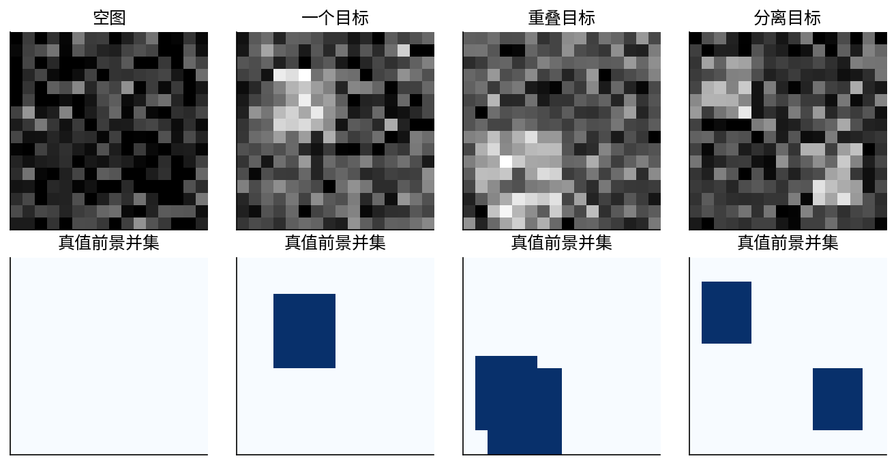

训练方案为：逐像素线性头（2参数）；3×3卷积1到6通道、ReLU、1×1卷积到1通道的CNN（67参数）配普通BCE；完全相同CNN配训练集正类加权BCE。两CNN以同种子获得相同初始化。逐像素模型固定初始化$(0.1,0)$，所以三种子运行完全一致，不能把它们当三份独立随机证据。

每种方案搜索学习率0.1与1.0，每个候选用种子11、23、37，执行100次全批SGD；无动量、调度、权重衰减、增强或早停。每种方案按三种子平均最终验证前景micro IoU选一个学习率，同分取较小者。固定logit≥0的阈值不参与选择。另有CNN普通BCE学习率10的三次预定压力实验，不进入候选选择。总计21次训练、2100次更新，失败不会删除。

这里是更新数与样本暴露数一致，不是FLOP相同：逐像素模型每图约256次乘加，CNN卷积乘加为$16\cdot16(6\cdot9+6)=15360$，另有偏置与激活。不能据此说“同等计算量CNN胜出”。普通和加权CNN则结构与主要计算相同。

强基线包括原始强度阈值、3×3边缘复制padding的均值滤波后阈值，分别搜索0.2至0.8的25个固定候选，只在验证集选择，同分取较小阈值。它们不需要梯度训练，验证搜索次数也与神经模型不相等；如实报告这种成本差异。所有50个分数、全部参数轨迹和验证logit均保留。

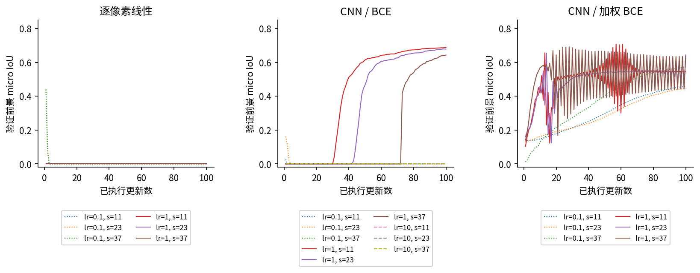

每个候选保存101个参数状态（初值和100次更新后）、每步目标损失与梯度范数、验证损失与IoU，以及最终完整验证logit。选择冻结后，九个模型在所有拆分保存逐像素logit及每图TP/FP/FN/TN。基线保存每像素二值预测。`outputs/arrays.npz`与`outputs/results.json`共同构成完整复查材料。

## 14 真实结果与能够支持的结论

|方案|冻结选择|测试前景micro IoU|偏移前景micro IoU|
|---|---|---|---|
|全背景|无需选择|0.0000|0.0000|
|强度阈值|阈值0.525|0.4893|0.3121|
|3×3均值阈值|阈值0.425|0.6207|0.2269|
|逐像素线性|学习率0.1|0.0000（三次相同）|0.0000（三次相同）|
|CNN / BCE|学习率1.0|0.7004 / 0.6912 / 0.6395|0.3227 / 0.3287 / 0.4008|
|CNN / 加权BCE|学习率1.0|0.5700 / 0.6585 / 0.6546|0.1741 / 0.2059 / 0.2020|

表内三值依次对应种子11、23、37。普通CNN平均测试IoU为0.6770，加权CNN为0.6277，均值阈值为0.6207。加权未在本次协议下胜出，种子11甚至低于非神经基线。三种子只描述初始化敏感性，不足以证明跨任务的统计显著性，也不能当成三份新测试数据。

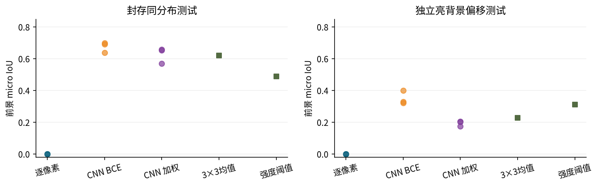

普通CNN的三个种子都在12张空图中的2张产生至少一个假阳性，空图误报率16.67%；加权方案为50.00%、41.67%、41.67%。它提高正类损失代价，可能推动更多位置越过固定阈值。这个结果与039的阈值讨论一致，但不能仅凭相关结果认定唯一机制；要验证阈值效应，应预先增加验证集阈值选择对照，并在新封存数据上评估。

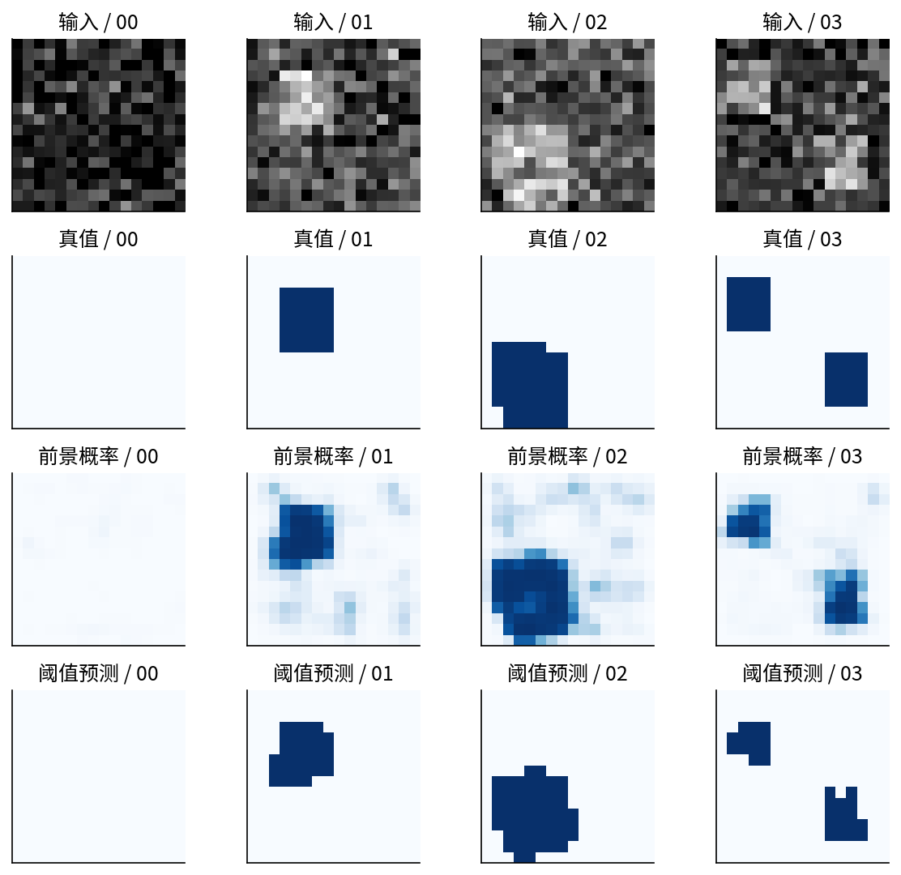

学习率10的压力候选没有出现非有限数，却都在100步末得到验证IoU 0。称其“在固定任务指标上训练失败”有证据；称其“数值发散”没有证据。损失、梯度和参数轨迹允许后续检查激活门、阈值与优化路径，不能因为大步长就先贴上梯度爆炸标签。

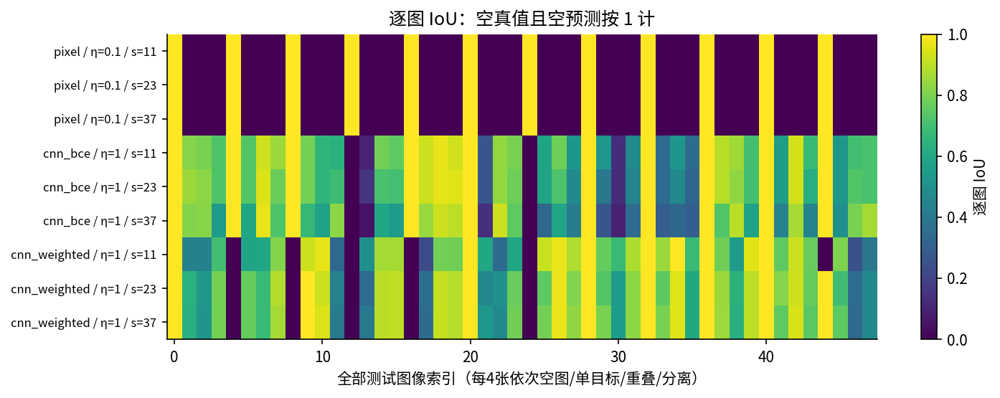

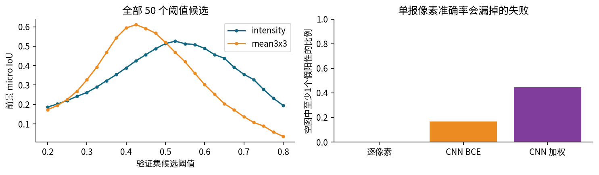

## 15 从复现练习走到研究问题

第一个可检验问题是：普通CNN的优势来自局部平滑，还是可学习的边缘/上下文？3×3均值阈值已经是机制相关的强基线；下一步可预注册一个3×3线性卷积，控制感受野并比较非线性的增量。当前结果没有回答这一点。

第二个问题是：加权BCE劣势有多少来自固定阈值？可以为每个方案配置同样的验证阈值网格，同时记录PR曲线和空图误报，再用新测试拆分评估。不能在本次已经查看过的测试结果上挑一个“修正后阈值”并称其独立测试成绩。

第三个问题是背景偏移。我们知道生成器改变了背景，这是受控变化；但本次不同拆分对象、噪声、尺寸也重新抽样，所以不是逐图因果差值。要做更强的配对研究，应固定掩码、对比度和噪声，只改变背景，然后区分裁剪饱和带来的额外变化。

真正面向自然图像或科学图像时，还要考虑标注者差异、边界歧义、ignore区域、对象层级、稀有尺度、设备或主体拆分、许可与部署代价。不要把这里的原创矩形数据、CPU耗时或0.6770 IoU外推成真实应用性能。

## 16 复查边界与学习检查点

`reference.py`不导入torch，独立计算稳定BCE、全卷积前后向、IoU、Smooth L1、NMS、教学AP和混淆计数。测试对67个CNN参数与24个输入元素做中心有限差分，并与框架全部梯度核对；最大误差约$1.8\times10^{-10}$。另用整数像素单元集合的交并计数验证几何IoU，避免只拿同一公式的两份拷贝互相证明。

数值参照有意限制有限实数、数组不超过200万元素、绝对值不超过一百万；框边长至少为$10^{-6}$以避开下溢，编码结果也须在数值范围内；正类权重在$(0,1000]$，解码对数尺度绝对值不超过20，且解码结果仍需通过框范围检查。它不是高性能生产库、任意维度分割库或官方评测替代品。

练习结束前应能独立解释：为什么像素准确率高而前景IoU为0；为什么重叠目标在语义分割中只有一个前景值；为什么NMS不可用于计算真值匹配；为什么加权概率未必校准；为什么三种子不等于三份测试集；为什么空图约定必须写进报告。完整实验任务见lab，逐题推导与参考输出见answers。
