# 047 视觉Transformer与混合结构

把图像变成token，改变的不只是网络名称，还有连接假设、坐标信息和资源口径。

## 1 先修路线与本讲问题

本讲正式先修043和053。课程编号用于归档，不总是学习顺序；尚未学习注意力的读者，应先按049→052→053建立词元、逐项注意力和Transformer块，再回到047。053还依赖036的归一化。不要仅因047编号在前，就跳过这些数学与状态概念。本讲保留原先修关系，不把一个API调用当作这些知识的替代。

我们回答三个问题：非重叠图像块怎样变成向量？内容相关的全局交互和卷积局部连接有何不同？在完全没有预训练的小数据小预算中，怎样比较CNN、小ViT与混合结构而不夸大结论？

原始ViT工作说明了图像patch和Transformer的组合及大规模训练条件，后续数据高效训练研究又改变了配方和信息来源。[S1,S2] 它们并不意味着任意小模型、任意数据量都拥有同样排名。本讲独立生成8×8条形图，固定18次神经训练，保留小ViT随样本数增加反而下降的结果，也把CPU保存张量量与未测显存清楚分开。

## 2 从二维图到patch矩阵

输入$X\in\mathbb R^{B\times C\times H\times W}$，选择方形patch边长$P$。先假设H和W都能被P整除，token数为$N=(H/P)(W/P)$，每个patch展平后的维度$F=CP^2$。按先行后列的顺序排列patch，每个patch内部再按通道、行、列顺序展平，得到$X_p\in\mathbb R^{B\times N\times F}$。

以B=1、C=1、H=W=8、P=2为例，共16个patch，每个包含4个数。第0个取原图行0至1、列0至1；第1个取行0至1、列2至3；第4个进入下一组行2至3。不能直接reshape成16×4而不先调换空间子轴，那会把跨窗口的连续存储误当作一个patch。

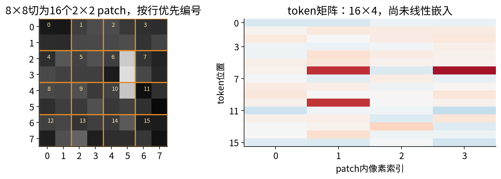

本代码先reshape为$(B,C,H/P,P,W/P,P)$，再把轴置换成$(B,H/P,W/P,C,P,P)$，最后合并两位置轴与三个块内轴。测试另用逐窗口切片构造同一矩阵，并检查unpatchify准确还原输入。

若尺寸不能整除，可以另外设计补边、裁剪或可变长方案，但要把丢失像素、mask和位置规则写清楚。本教学API选择明确拒绝，绝不悄悄丢掉最后一行。模型里的学习位置表固定16个token，因此不自动接受其他分辨率。

## 3 patch嵌入与卷积的精确关系

共享线性嵌入为$E=X_pW_E+\mathbf1b_E^\top$，其中$W_E\in\mathbb R^{F\times D}$，输出$E\in\mathbb R^{B\times N\times D}$。参数数$FD+D$与token个数无关，因为所有patch复用同一个矩阵。

如果$D<F$，它通常是有损压缩：不同像素块可能映到同一向量。即使$D\ge F$也不自动保证可逆，还要看矩阵秩。切patch本身只是重排，线性嵌入才可能丢失信息；应把两步分开。

这个非重叠嵌入可以精确写为核大小P、步幅P的Conv2d：把$W_E^\top$ reshape为$(D,C,P,P)$，偏置保持相同，卷积输出再展平空间轴。测试用多通道非方形输入逐元素核对，误差在浮点容差内。因此“ViT完全不含任何可解释成卷积的计算”并不严谨；一般所谓纯ViT强调后续以注意力块处理token，而不是卷积主干。

patch内部有固定像素布局，patch之间共享投影，非重叠分块还有采样相位。这些都是结构假设。输入只移1像素时，像素会跨越块边界，token通常不只是简单平移或重排。043里关于边界与步幅的提醒仍然适用。

## 4 位置表示让相同内容出现在不同地方

最简单的学习位置表$P_{\rm pos}\in\mathbb R^{1\times N\times D}$按批次广播，初始输入是$Z_0=E+P_{\rm pos}$。这里符号$P_{\rm pos}$代表位置向量，不是patch边长P。某位置参数只由该位置对应的样本/token路径累加梯度，与共享嵌入矩阵的累加轴不同。

没有位置或其他位置相关操作时，自注意力对token排列等变。记置换矩阵为R，则Q、K、V都随Z重排；分数矩阵变为$RSR^\top$，逐行softmax相应重排，最终输出也随R重排。之后若对全部token取均值，表示不变；因此它无法仅凭token在数组里的编号区分上下左右。

加入固定位置表后，只重排patch内容而位置表留在原处，通常改变结果；如果位置表与内容一起重排，那只是重新编号，均值表示仍可相同。我们的独立探针中，无位置等变误差约$4.44\times10^{-16}$，固定位置下均值表示改变约0.701645，一同重排的误差约$2.22\times10^{-16}$。

学习一维位置表并非让二维空间消失，只是把二维坐标通过约定顺序对应到向量。换分辨率常需要重新组织或插值位置表；插值的网格、额外CLS位置和训练条件都要说明。RoPE和其他位置方案见053，这里不把它们当成互相无差别的开关。

## 5 局部、全局和混合连接

卷积的一个局部特征从有限邻域读取信息，深层叠加和下采样扩大感受野；注意力让一个token在一层内访问所有允许的token，但权重由内容决定。理论上允许一条路径，不等于当前参数真的利用了它，也不等于注意力权重提供因果解释。

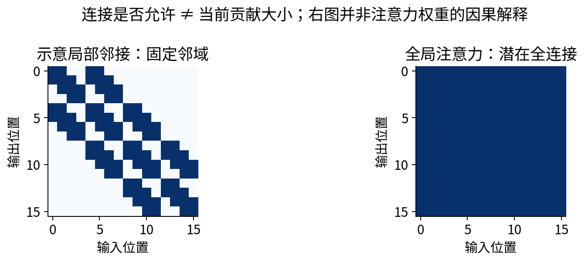

CNN最终经过全局平均也读取全图，不能把CNN概括成“永远看不见远处”。本实验两层3×3卷积的单个末层局部特征包络是5×5，再全局平均；它和在同一层中根据一处内容改变另一处权重的注意力，表达方式不同。

混合结构先用局部卷积提取特征，再把特征图切patch送入注意力。它引入了额外局部非线性、参数和计算，不能只把名字换成Hybrid就认为对照公平。本文混合结构不使用预训练CNN；所有参数从头学习，其额外成本也单列。

## 6 完整实验编码块与shape

本实验ViT采用D=8、2个头，每头$d_h=4$。对$Z\in\mathbb R^{B\times16\times8}$先LayerNorm，再线性产生QKV，拆成$B\times2\times16\times4$。每头计算

$$A=\operatorname{softmax}\left(\frac{QK^\top}{\sqrt4}\right),\qquad O_h=AV.$$

分母为2；softmax沿键位置轴取，使每个查询的一行权重和为1。合头回$B\times16\times8$，经过输出投影后加回Z。第二条残差为

$$Z_1=Z+\operatorname{MSA}(\operatorname{LN}_1(Z)),$$

$$Z_2=Z_1+W_2\operatorname{GELU}(W_1\operatorname{LN}_2(Z_1)+b_1)+b_2.$$

上式为对象级表达；代码线性层采用最后轴右乘转置的批次约定，FFN维度8→16→8。末端再LayerNorm，对16个token取均值，线性映射为两个类别logit。没有CLS token，所以注意力序列长就是16；若加CLS，应把N替换为N+1并补其参数和位置。

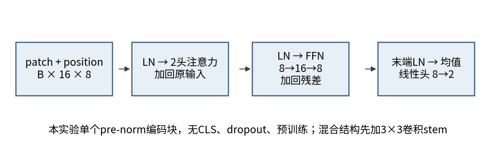

本课使用显式稠密QK转置与softmax，不调用FlashAttention。不同后端可能改变中间张量保存和浮点舍入，因此资源报告只描述这个具体实现。完整块的数学前后向基础见053；本节的shape与独立NumPy全模型参照确保这里实际连接正确。

## 7 两样本微型账本：把patch路径算到底

为逐项展示patch、位置与注意力的共享梯度，另用两个2×2小图，每一行作为一个1×2矩形patch：$X_1$的两行是$(1,0),(0,1)$，$X_2$的两行是$(0,1),(1,1)$，监督标量$y_1=1,y_2=0$。

这段是D=1的注意力回归子模型，不含LN、FFN或残差，不冒充完整ViT。D=1若直接加入普通LayerNorm会消掉该维内容变化，因此明确删去它来观察注意力链。正式训练模型仍使用前节完整D=8结构。

九个可学习参数依次为$\theta=(w_0,w_1,p_0,p_1,q,k,v,o,c)$，初值为$(0.5,-0.25,0,0.25,0.5,0.5,1,1,0)$。先计算两个token的标量嵌入

$$e_{ij}=w_0X_{ij,0}+w_1X_{ij,1}+p_j,$$

再令$Q_{ij}=qe_{ij},K_{ij}=ke_{ij},V_{ij}=ve_{ij}$。分数$S_{iab}=Q_{ia}K_{ib}$，因为$d_h=1$，缩放因子为1。对每行softmax得A，再计算$z_i=A_iV_i$、$m_i=(z_{i0}+z_{i1})/2$，预测$\widehat y_i=om_i+c$。

|样本|两个e|两个Q=K|两个V|
|---|---|---|---|
|1|0.5，0|0.25，0|0.5，0|
|2|-0.25，0.5|-0.125，0.25|-0.25，0.5|

例如样本2第一个嵌入为$0.5(0)-0.25(1)+0=-0.25$，第二个为$0.5(1)-0.25(1)+0.25=0.5$。分数矩阵分别为

$$S_1=\begin{bmatrix}0.0625&0\\0&0\end{bmatrix},\qquad S_2=\begin{bmatrix}0.015625&-0.03125\\-0.03125&0.0625\end{bmatrix}.$$

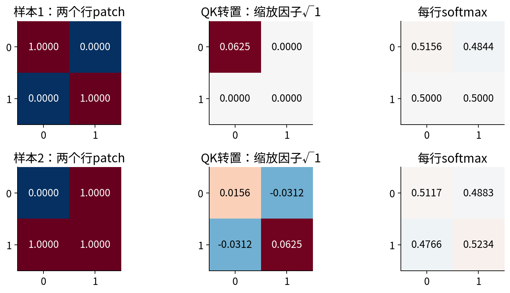

样本1第一行权重$\exp(0.0625)/(\exp(0.0625)+1)\approx0.515619916$，另一项0.484380084；第二行两项均0.5。于是$z_1\approx(0.257809958,0.25)$，$m_1=\widehat y_1\approx0.253904979$。

样本2两行权重约为$(0.511716605,0.488283395)$与$(0.476579651,0.523420349)$，上下文$z_2\approx(0.116212546,0.142565262)$，预测0.129388904。平方损失按两样本平均：

$$L=\frac12\sum_{i=1}^2\frac12(\widehat y_i-y_i)^2.$$

两例残差约-0.746095021与0.129388904，单例half-MSE约0.278328890与0.008370744，平均$L_0\approx0.143349817241$。softmax含指数，这些是float64近似值；后续程序使用完整精度而不是正文截短数。

## 8 反向到注意力每一条边

用上划线表示同一标量L的上游。先有$\bar y_i=(\widehat y_i-y_i)/2$，分别约-0.373047511与0.064694452。输出头局部导数对o为$m_i$、对c为1；均值再给每个上下文$\bar z_{ia}=\bar y_i o/2$。

上下文$z_a=\sum_bA_{ab}V_b$的两条反向是

$$\bar V_b=\sum_aA_{ab}\bar z_a,\qquad\bar A_{ab}=\bar z_aV_b.$$

softmax行内的局部雅可比为$\partial A_{ab}/\partial S_{at}=A_{ab}(\mathbf1[b=t]-A_{at})$。乘上游后可写成

$$\bar S_{ab}=A_{ab}\left(\bar A_{ab}-\sum_tA_{at}\bar A_{at}\right).$$

必须逐行减去加权和；不能只用sigmoid式$A(1-A)$而漏掉别的键。每行$\bar S$之和为0，反映给这一行所有分数加同一个常数不改变softmax。

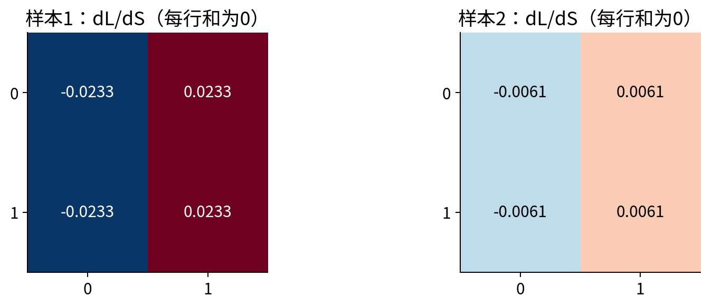

样本1的$\bar S$约为$[[-0.023292715,0.023292715],[-0.023315469,0.023315469]]$；样本2约为$[[-0.006061774,0.006061774],[-0.006051798,0.006051798]]$。

再由$S_{ab}=Q_aK_b$得到$\bar Q=\bar SK$、$\bar K=\bar S^\top Q$。别漏掉同一个嵌入同时走Q、K和V三条路径：

$$\bar e_j=q\bar Q_j+k\bar K_j+v\bar V_j.$$

样本1的$\bar Q\approx(-0.005823179,-0.005828867)$，$\bar K\approx(-0.005823179,0.005823179)$，$\bar V\approx(-0.189437241,-0.183610270)$，相加得到$\bar e\approx(-0.195260419,-0.183613114)$。

样本2对应$\bar Q\approx(0.002273165,0.002269424)$，$\bar K\approx(-0.000755228,0.000755228)$，$\bar V\approx(0.031968642,0.032725810)$，得到$\bar e\approx(0.032727611,0.034238136)$。每个数都来自同一旧参数，不能先改v再算嵌入路径。

## 9 九个共享参数累加与同步更新

参数局部导数给出：$\partial L/\partial q=\sum_{i,j}\bar Q_{ij}e_{ij}$，k和v同理；$\partial L/\partial w_t=\sum_{i,j}\bar e_{ij}X_{ij,t}$，位置$p_j$只对样本求和$\sum_i\bar e_{ij}$；输出o收集$\sum_i\bar y_im_i$，c收集$\sum_i\bar y_i$。原图输入梯度为$\bar X_{ij,t}=\bar e_{ij}w_t$。

这说明同一个patch嵌入权重跨样本和位置共享，位置参数却只跨样本共享。用错归约轴会使shape仍然看似正确而数值错误。

|参数|样本1贡献|样本2贡献|总梯度|同步更新后|
|---|---:|---:|---:|---:|
|$w_0$|-0.195260419|0.034238136|-0.161022284|0.516102228|
|$w_1$|-0.183613114|0.066965747|-0.116647367|-0.238335263|
|$p_0$|-0.195260419|0.032727611|-0.162532808|0.016253281|
|$p_1$|-0.183613114|0.034238136|-0.149374979|0.264937498|
|$q$|-0.002911589|0.000566421|-0.002345169|0.500234517|
|$k$|-0.002911589|0.000566421|-0.002345169|0.500234517|
|$v$|-0.094718620|0.008370744|-0.086347876|1.008634788|
|$o$|-0.094718620|0.008370744|-0.086347876|1.008634788|
|$c$|-0.373047511|0.064694452|-0.308353058|0.030835306|

学习率是0.1，最后一列统一执行旧参数减0.1倍总梯度。q与k初值相同，且标量分数依赖它们的乘积，本例两梯度相同是结构结果；输出中的v与o也存在乘积尺度冗余。不要把这个标量子模型的可辨识性与一般多头网络混为一谈。

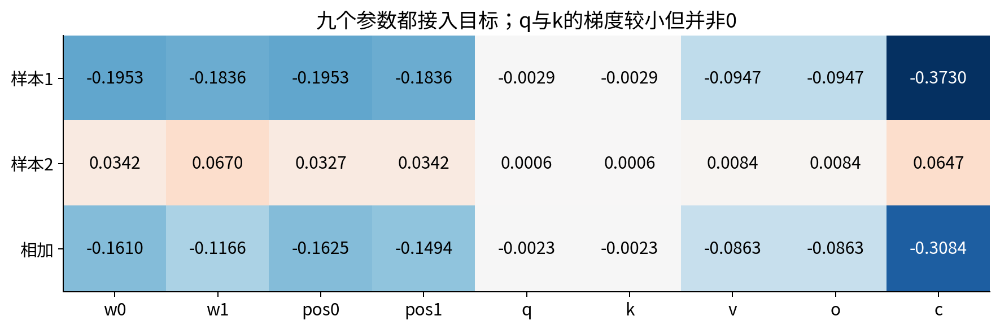

## 10 更新后的下一次完整前向

仍用原来两例和标签，所有嵌入、Q/K/V、分数、权重都重算。以下以9位小数显示，计算使用完整float64。

|样本|两个e|两个Q=K|两个V|
|---|---|---|---|
|1|0.532355509，0.026602235|0.266302601，0.013307356|0.536952286，0.026831939|
|2|-0.222081982，0.542704463|-0.111093073，0.271479505|-0.223999613，0.547390601|

新分数和注意力权重为：

$$S_1'=\begin{bmatrix}0.070917075&0.003543784\\0.003543784&0.000177086\end{bmatrix}.$$

$$A_1'=\begin{bmatrix}0.516836955&0.483163045\\0.500841674&0.499158326\end{bmatrix}.$$

$$S_2'=\begin{bmatrix}0.012341671&-0.030159493\\-0.030159493&0.073701122\end{bmatrix}.$$

$$A_2'=\begin{bmatrix}0.510623692&0.489376308\\0.474058162&0.525941838\end{bmatrix}.$$

|样本|两个上下文z|新预测|新残差|单例损失|
|---|---|---:|---:|---:|
|1|0.290480986，0.282321467|0.319709546|-0.680290454|0.231397551|
|2|0.153500482，0.181706774|0.199886155|0.199886155|0.019977238|

新的平均损失为0.125687394169，低于初始0.143349817241；样本2却从0.008370744升到0.019977238。它们共享参数，一个总目标下降不保证所有样本同时改善。

继续使用相同局部规则，在新参数点得到第二轮贡献与第二次同步更新：

|参数|样本1新贡献|样本2新贡献|新总梯度|第二次更新后|
|---|---:|---:|---:|---:|
|$w_0$|-0.181903273|0.054248729|-0.127654544|0.528867683|
|$w_1$|-0.169675618|0.105391045|-0.064284573|-0.231906806|
|$p_0$|-0.181903273|0.051142316|-0.130760957|0.029329376|
|$p_1$|-0.169675618|0.054248729|-0.115426889|0.276480187|
|$q$|-0.003090317|0.001187221|-0.001903096|0.500424826|
|$k$|-0.003090317|0.001187221|-0.001903096|0.500424826|
|$v$|-0.097418010|0.016750822|-0.080667188|1.016701506|
|$o$|-0.097418010|0.016750822|-0.080667188|1.016701506|
|$c$|-0.340145227|0.099943078|-0.240202149|0.054855521|

第三次前向的两预测为0.371535307377和0.253748587374，两损失为0.197483934937和0.032194172797，平均0.114839053867。全部中间Q/K/V、矩阵上游、输入梯度和三次状态都随results.json保存，不能用上表截短小数作为程序新输入。

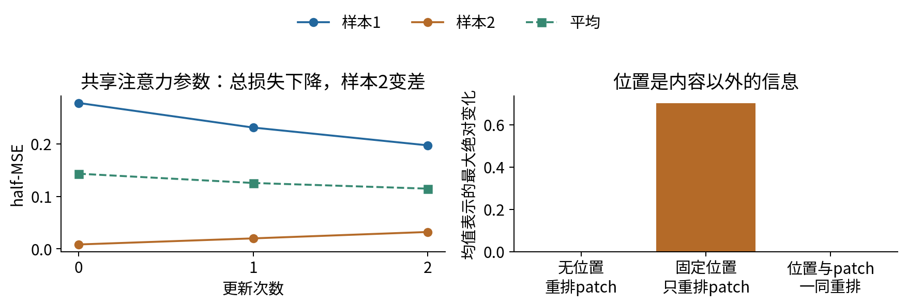

## 11 固定比较：数据、模型与训练预算

主实验独立生成8×8单通道条形图：竖条为0、横条为1，长度3、宽度1，在内部若干位置随机出现，叠加标准差0.16的独立高斯噪声。训练池128图、验证64图、测试256图，生成种子分别4701、4702、4703；每个拆分类别各半，不使用背景与类别相关性。

两种训练规模为训练池的前32图和全部128图，小集合嵌套在大集合内，并非两次独立采样。输入按生成器的强度单位直接使用，不拟合全数据尺度；没有增强、外部图片、预训练、蒸馏教师或付费API。

三个模型的结构如下。

|模型|主体|参数量|
|---|---|---:|
|CNN|3×3卷积1→8、ReLU、3×3卷积8→8、ReLU、全局均值、8→2头|682|
|小ViT|2×2 patch→8维，加16位置，单pre-norm块，末端LN/均值/分类头|802|
|混合|3×3卷积1→4和ReLU，再按2×2特征patch进入同规格Transformer|938|

小ViT比CNN参数更多，混合又更多，没有用不参与预测的虚假参数凑出相同总数。每个训练规模下，三模型各3种子，均200次全批次SGD更新，学习率0.15，无动量、权重衰减、早停或按验证结果调参。18次拟合共3600更新，记录3618个参数状态。

每种架构在同一训练规模下看到相同图数、做相同步数，但参数数、算术量和优化难度不同。因此我们称它为固定更新/图呈现预算的对照，不叫等FLOPs或等墙钟实验。使用同样学习率也不保证各架构都被充分调好；若要比较最佳配置，应为每种架构分配同样明确的调参预算，不能只给一方搜索。

跨32与128的比较还有一个重要限制：全批次每步用的图数增加4倍，累计训练图呈现也增加4倍。32图条件共57600次呈现，128图条件230400次，总288000次。这里观察的是“数据量加全批次暴露量”的联合变化，不是严格固定样本呈现数的数据效率曲线。

验证集只保留最终描述性读数，没有选择模型；测试在每次固定训练结束后评价，所有种子和失败都保留。不同架构下同一个种子不是相同的初始参数向量，因为形状和初始化调用不同；种子主要用于可重复运行和列出配对实验编号。

## 12 实际结果与不利证据

下表是3个独立初始化结果的指标均值，并不是三个网络投票或logit平均的集成。

|训练图数|CNN准确率/NLL|小ViT准确率/NLL|混合准确率/NLL|
|---|---|---|---|
|32|88.80% / 0.687278|63.93% / 0.707461|71.48% / 0.471322|
|128|90.49% / 0.688017|52.73% / 0.717087|90.76% / 0.477665|

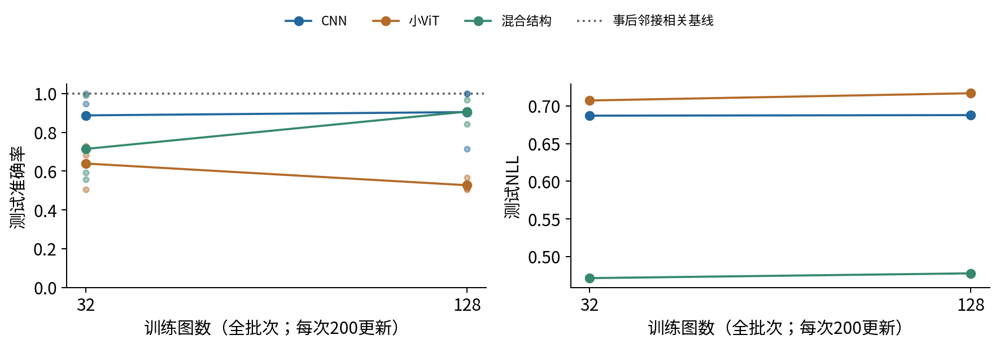

这份小ViT没有展示“更多数据必然更好”的单调曲线。它在128图条件下接近随机猜测，不能据此推广到大规模预训练的ViT，也不能只挑32图结果来遮住失败。数据量、全批次梯度、200步预算与这一固定优化器一起决定实际迭代；要查机制，需要新的受控实验，而不是从一个表自动归因于“注意力天生不适合图像”。

CNN准确率较高却NLL接近$\log2\approx0.693147$，说明多数判别虽方向正确，logit间距仍较小，概率往往接近0.5；它也没有表现出充分优化的高置信拟合。混合模型的准确率和NLL排序还可能不同。评价时必须同时看正确方向与概率损失，不能只挑有利指标。

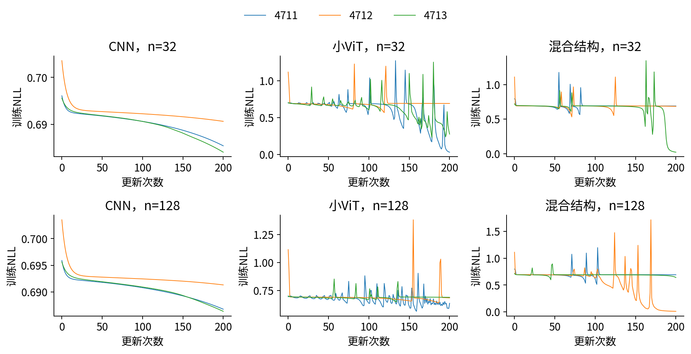

在第一次固定神经结果出来后，我们另加入一个明确标为事后诊断的非学习参照：计算所有水平相邻像素乘积之和减去竖直相邻乘积之和，分数≥0判横条。它利用了已知任务的方向结构，不拟合参数、没有训练更新，阈值固定0。它在本训练、验证和测试数据上均100%正确。

这个参照说明该合成问题存在简单强规则，神经网络的有限预算失败不能归咎于标签本身不可预测。它不是原先冻结的第四个神经处理，也没有用于重选学习率、改变步数或删除任何已有结果。我们重新记录完整轨迹后核对18个模型结果未变。参照分数不是概率logit，所以只报准确率，不套sigmoid编造可比较NLL。

局部邻接方向正是本任务的主要信号，CNN/混合的结构可能更贴合它；这只是提出解释的根据，不是已经排除了初始化、学习率和优化预算的因果证明。若任务依赖远距离关系，或者使用预训练，结论可能完全不同。

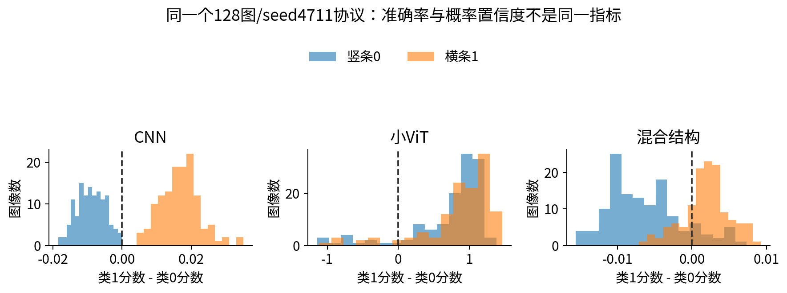

## 13 注意力复杂度与资源口径

单个头的分数矩阵有N×N项。h个头、批次B时，显式保存一份稠密注意力矩阵约需$BhN^2$个元素；float32每元素4字节，float64为8字节。本实验B=32、h=2、N=16、float64时，一份矩阵是$32\cdot2\cdot16^2\cdot8=131072$字节，即128 KiB。

QK转置与AV两次乘法合计量级$O(BN^2D)$；QKV与输出投影是$O(BND^2)$，FFN约为$O(BNDD_{\rm ff})$。因此不能只写“Transformer复杂度是N平方”就忽略维度、投影和前馈。小N时后几项可能很重要。

图像长宽各加倍而P不变，N增为4倍，注意力矩阵元素数增为16倍。固定图像把P减半也会使N增4倍。以224×224、12头、B=1、float32且不含CLS为例，P=16时N=196，一份矩阵约1.759 MiB；P=8时N=784，约28.137 MiB。它只是一个张量的解析容量，不是训练总显存。

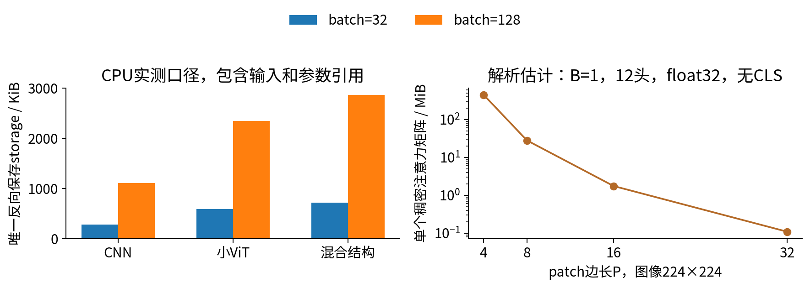

我们用saved_tensors_hooks记录实际前反向为求导保存的Tensor，分别累计逻辑字节数和按底层storage去重后的字节数。后一口径包含被保存引用的输入、参数与中间量，不等于纯激活，也不等于进程RSS或分配器峰值。零探针输入只用于固定shape的资源测量，不作为准确率实验数据。

|批次|CNN唯一保存storage|小ViT唯一保存storage|混合唯一保存storage|
|---|---:|---:|---:|
|32|286664字节|605448字节|737832字节|
|128|1130696字节|2407944字节|2933544字节|

本机torch为CPU版，CUDA不可用，所以peak_vram_bytes明确为null，未测显存，绝不把CPU保存量改名为显存实测。若以后使用GPU，应固定设备、dtype、批次、优化器和模式，预热后重置峰值统计，在前反向前后同步，再读取max_memory_allocated；已驻留参数、梯度、优化器状态和缓存reserved/allocated的区别也要记录。[S4]

FlashAttention等实现可以不显式保存完整注意力矩阵，实际内存因后端而变。本文只对手写稠密注意力给出上述估计和CPU证据，不预测所有加速库的峰值。

## 14 怎样相信代码，又不把检查当理论证明

测试先对patch顺序与往返做独立切片对照，再证明线性patch嵌入与步幅P卷积逐元素一致。自写多头注意力与官方MultiheadAttention在复制同一QKV/输出参数后对齐；完整CNN、ViT、混合的前向另用NumPy窗口、LayerNorm、GELU和矩阵运算重建。

小ViT的全部802个可学习参数都对独立NumPy标量NLL做中心差分，再与PyTorch自动微分对照，覆盖patch、位置、两条残差、两次前置LN、末端LN、FFN和分类头。九参数手算实例另外核对三次状态、全部参数梯度与原始像素梯度。还有softmax行雅可比、位置排列、资源计数、数据重建和拒绝域。

这些证据支持实现符合我们写下的结构，不能把有限测试升级成所有输入的数学证明，也不能保证模型选择合理。核心patch API只支持有限实数、非空NCHW、正整数方形patch、严格整除和最多一百万元素；不支持隐式补边、任意输入分辨率、图像文件解码或自动位置插值。全实验运行域是冻结8×8数据、三固定结构、CPU float64。

原始轨迹、18组最终权重、每图预测、模型协议和环境都保存；gzip记录无损原文摘要。文件逐个原子替换，不声称跨多个输出文件的事务。普通和-O执行、真实新内核Notebook及PDF目视范围另见verification.json。

## 15 练习与研究延伸

1. 手列8×8、2×2、单通道的前5个patch坐标和shape。
2. 推导3通道、P=4、D=12的patch投影参数量，并给出等价Conv2d核形状。
3. 解释切patch与线性嵌入分别什么时候丢信息。
4. 证明无位置注意力的排列等变与均值头不变，区分只重排内容和一同重排位置。
5. 逐样本复算九参数模型的嵌入、QKV、A、损失与各上游。
6. 重建全部九参数贡献，解释位置参数与共享嵌入参数的归约轴。
7. 统一更新后重算下一前向，说明样本2为何变差。
8. 推导三实验模型的参数量，列出匹配和未匹配的预算。
9. 说明32与128的全批次对照为什么不是纯固定呈现次数的数据效率实验。
10. 解释CNN高准确率但NLL接近log2，以及事后强规则基线的证据地位。
11. 计算注意力矩阵容量随分辨率与patch边长的变化，区分CPU保存量和GPU峰值。
12. 为自己的图像任务设计一项局部性/全局交互对照，并写清预训练、调参、数据和资源边界。

完整实验步骤见lab，详解见answers。048视觉项目可以选CNN路线；只有选择ViT或混合注意力时才需要本讲与053。不要把所有架构都堆进一个项目来代替一个清楚的研究问题。

## 一手来源与实际阅读范围

[S1] Dosovitskiy等，[An Image is Worth 16x16 Words](https://arxiv.org/html/2010.11929v2)，读取方法、patch/位置与混合架构段落；本讲模型和图独立构造，未复现其大规模成绩。

[S2] Touvron等，[Training data-efficient image transformers & distillation through attention](https://proceedings.mlr.press/v139/touvron21a.html)，读取原始论文摘要与训练条件，不把蒸馏教师的信息与纯从头学习混同。

[S3] [PyTorch2.7 MultiheadAttention](https://docs.pytorch.org/docs/2.7/generated/torch.nn.MultiheadAttention.html)，核对头维度和接口。本实验复制明确参数后与其结果对照。

[S4] [PyTorch2.7 autograd](https://docs.pytorch.org/docs/2.7/autograd.html)与[max_memory_allocated](https://docs.pytorch.org/docs/2.7/generated/torch.cuda.max_memory_allocated.html)，用于保存张量和GPU资源指标的定义；GPU测量本次未执行。
