# 048 视觉研究项目

本讲把卷积网络、数据增强与实验设计连成一项可复查的研究。我们提出一个具体问题：识别圆盘和圆环时，模型会不会依赖左上角的亮暗角标？仅在训练时随机化角标，能否保住同域表现并改善反相关域？数据、训练、选择、测试和失败解释都围绕这一问题展开。

**本轮结论。** 预先固定的开发集规则选出角标随机化。三种子平均同域准确率与原始 CNN 均为95.83%，反相关域从78.52%变为96.22%。亮度增强反而更差；使用已知角标位置遮蔽，也没有在固定预算下胜出。这些是一个原创合成生成器上的结果，不是现实视觉鲁棒性的证明。

先修022、040、044、045。本讲走从零训练的小型CNN分类路线；不需要检测、分割或Transformer。若改为检测或分割，补046；若改用ViT，补047；使用预训练需补041并增加数据重叠审计。本讲不引入后续053的技术作为隐含前提。

## 1 从实验作业走向研究问题

分类给一整张图一个标签；检测还要定位多个物体；分割要给像素标签。任务不同，输出、标注成本和评价规则也不同。我们选择分类，是为了把有限CPU预算用于验证信息边界与误差机制，而不是同时调试过多模块。

一项研究至少包含一个可被推翻的判断。本项目的判断是：原始CNN可能从角标学到捷径；针对角标相关性的干预比一般亮度增强更有帮助。反例同样有价值：随机化可能破坏训练，或者模型本来就只看形状。方法不赢也不能删掉实验。

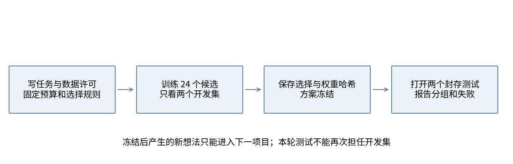

“可复查”意味着别人能找到失败种子、落选候选、每个样本的预测、选择规则和模型权重。只给一个平均值，别人无法判断是方法变化、选种子，还是测试反馈造成的优势。protocol.json在首次训练前写入；每次重现还会先将它复制到输出目录。

## 2 数据卡先于分数

标签0是实心圆盘，标签1是圆环。每张图是1通道20×20像素，像素范围[0,1]。中心位置、半径、形状对比度和背景噪声逐样本随机变化。前景中心坐标在[8.2,11.2]，半径在[3.3,4.7]，圆环内半径为外半径的0.6倍。背景均值0.22，噪声标准差在[0.08,0.18]；形状增加[0.18,0.40]的亮度，最后裁到合法范围。

左上5×5角标亮时约0.82，暗时约0.06，加少量噪声。它不改变类别。训练时角标常与类别一致，测试偏移域却常相反。角标位置是生成器已知信息，使用这一位置属于额外任务知识，必须披露。

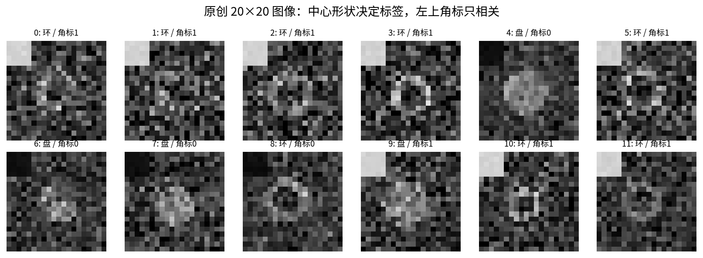

这些数组由本单元generate_data.py原创生成，没有下载图片、人物信息、商标、外部标注或预训练权重。DATA_LICENSE.md给出CC0 1.0数据释放说明；生成代码和本讲材料的范围另在README说明。一手文献的引用不授予复制其图片的许可，本讲所有图均自行绘制。

记录数据来历的目的不是填写形式化表格。现实数据要核对采集目的、主体同意、存储期限、许可的训练与再分发范围、弱标注误差以及删除请求。公开可见不等于许可自由使用。[Datasheets for Datasets](https://arxiv.org/abs/1803.09010)说明了系统记录数据背景的价值，本项目把这一思想落到生成器参数与文件哈希上。

## 3 按基础对象划分再做增强

我们先给五个集合分配不同生成种子和唯一base_id，再生成图像，最后只对训练批次施加增强。五个集合共1280个基础对象，无重复ID，也无完全相同的图像字节。manifest.json记录每个数组与元数据文件的SHA256；逐图哈希提供额外重复检查。

| 集合 | 样本数 | 角标匹配目标概率 | 可以做什么 |
|---|---:|---:|---|
| train | 384 | 0.90 | 梯度更新 |
| dev_iid | 192 | 0.90 | 同域开发评价 |
| dev_shift | 192 | 0.50 | 指定偏移条件下选方案 |
| test_iid | 256 | 0.90 | 冻结后正式评价 |
| test_shift | 256 | 0.10 | 冻结后反相关评价 |

概率不等于样本中的精确比例。例如训练集实际匹配率87.24%，反相关测试实际匹配率11.33%。所有类别均严格各占一半，因此常数分类器为50%。我们没有通过反复生成测试集来挑选“好看的”难度。

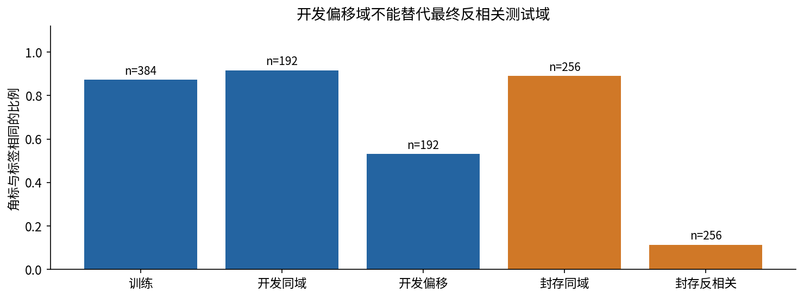

现实对象往往有多个视角、相邻帧或重复病人记录。不能把同一对象的不同增强视图随机分到训练和测试。像素哈希只能发现精确重复，发现不了裁剪、重编码或语义重复。预训练还会扩大数据来源：应检查权重说明、训练语料、可能重叠的基准和许可。拿不到证据时应标为未知，不能宣称“没有泄漏”。本单元从随机初始化训练，避免了预训练重叠这一条路径。

## 4 用两个样本看懂一次学习

主CNN有1066个参数，直接逐项手算会掩盖原理。先用它的微型对应物：一维两个空间位置、一个共享1×1卷积、ReLU、空间平均和一个二分类头。样本A为[0,1]且标签0；B为[1,2]且标签1。它是讲清共享梯度的教学实例，不冒充真实图像主实验。

四个参数依次为$\theta=(w,b,a,c)=(0.5,0.2,0.8,-0.1)$。位置j上的卷积输出$z_j=wx_j+b$，激活$h_j=\max(0,z_j)$，平均$m=(h_1+h_2)/2$，分类logit为$s=am+c$，概率为$p=1/(1+e^{-s})$。logit是未归一化分数，不是概率。

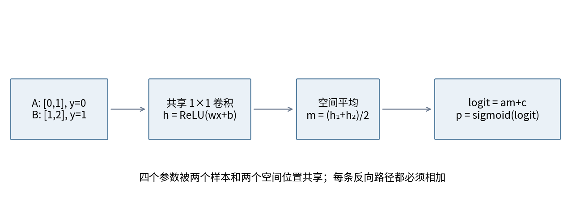

A的卷积输出[0.2,0.7]全部为正，激活不变；平均0.45，logit为0.8×0.45−0.1=0.26，概率0.564636。B的卷积输出[0.7,1.2]，平均0.95，logit0.66，概率0.659260。A希望概率更小，B希望更大。

每样本二元交叉熵为$\ell=-y\log p-(1-y)\log(1-p)$。A的损失0.831573，B为0.416637，批损失$L=(\ell_A+\ell_B)/2=0.624105$。程序使用稳定形式$\max(s,0)-sy+\log(1+e^{-|s|})$，避免先算极端概率后再取log造成数值问题。主实验的两类softmax交叉熵也接受logits，而不是先softmax再传给CrossEntropyLoss。

## 5 局部导数与路径累加

链式法则按实际计算图走。二元交叉熵对logit的导数为$p-y$；批平均再乘1/2。设$g_s=(p-y)/2$，则$g_a=g_sm$，$g_c=g_s$，$g_m=g_sa$。平均池化将$g_m$各分一半，ReLU只保留$z_j>0$的位置。最后$g_w=\sum_j g_{z_j}x_j$，$g_b=\sum_jg_{z_j}$。零点不可导，本实现选ReLU零导数；本例所有z远离0。

A：$g_s=0.282318$；$g_m=0.225855$；两个位置的$g_z$都是0.112927。w的两条贡献分别为0.112927×0与0.112927×1，和为0.112927；b两条贡献之和0.225855。分类头a梯度0.282318×0.45=0.127043，c梯度0.282318。

B：$g_s=-0.170370$；$g_m=-0.136296$；两个位置$g_z=-0.068148$。w的两条贡献为−0.068148×1与−0.068148×2，总和−0.204444；b为−0.136296；a为−0.170370×0.95=−0.161851；c为−0.170370。

| 参数 | A的贡献 已含批平均 | B的贡献 已含批平均 | 批梯度 |
|---|---:|---:|---:|
| w | 0.112927 | −0.204444 | −0.091517 |
| b | 0.225855 | −0.136296 | 0.089559 |
| a | 0.127043 | −0.161851 | −0.034808 |
| c | 0.282318 | −0.170370 | 0.111948 |

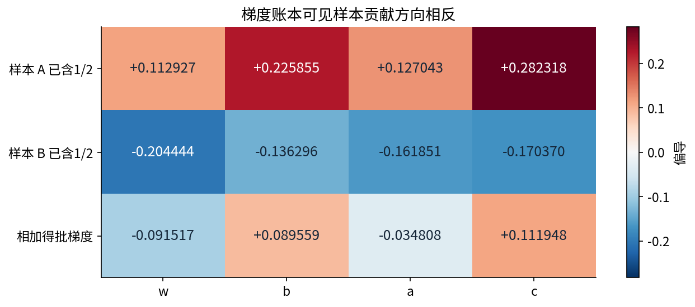

这里没有“每个参数只走一条路径”的规则。卷积核在空间中重复使用，反向时所有使用位置都给同一参数贡献梯度；batch里所有样本再累加。主CNN的反向传播就是这一规则在更多通道、位置和层上的重复应用。

## 6 同步更新后必须重做前向

学习率设为0.2，四个参数都使用旧参数时刻的批梯度同步更新：$\theta_1=\theta_0-0.2\nabla L(\theta_0)$。结果为(0.518303302, 0.182088266, 0.806961630, −0.122389668)。不能先改w，再用改后的w为同一次更新计算a的梯度。

新参数下A的z为[0.182088,0.700392]，m=0.441240，logit=0.233674，p=0.558154，损失0.816794。B的z为[0.700392,1.218695]，m=0.959543，logit=0.651925，p=0.657444，损失0.419396。新批损失0.618095。注意B自己的损失上升了，批平均仍下降；优化目标不是保证每个样本每步都变好。

第二轮完整重算得到梯度(−0.094720,0.086990,−0.041209,0.107799)，同步更新后参数为(0.537247274,0.164690316,0.815203361,−0.143949491)。再次前向，A与B的概率是0.552132、0.656392，批损失0.612127。outputs/results.json保留全部未截断小数和两轮之后的完整账本。

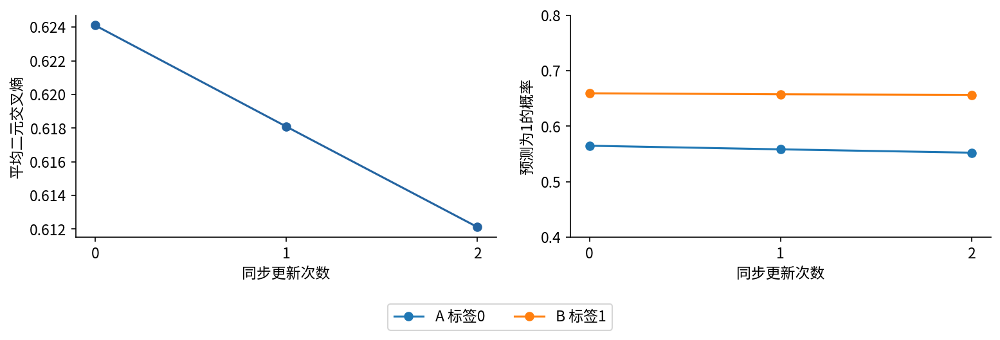

reference.py只用Python数学函数和NumPy实现此账本；test_experiment.py用PyTorch自动微分和四个参数逐个中心有限差分交叉验证。它还用不依赖PyTorch的显式滑窗计算核对主CNN完整前向。独立参照的意义是让两个实现不共享同一段可能出错的代码。

## 7 建立足够强且预算清楚的基线

主网络先做3×3卷积1→8，padding=1，ReLU后2×2平均池化；再做3×3卷积8→8、ReLU、平均池化；将8×5×5展开成200维，线性映射到2个logit。没有BN、dropout、预训练或残差分支。固定小型CNN足以把注意力放在数据与研究设计，而不是再次比较网络深度。

第一层参数8×1×3×3+8=80；第二层8×8×3×3+8=584；分类头200×2+2=402；总计1066。每图卷积与线性层乘加数为28,800+57,600+400=86,800；这里的MAC定义只计权重乘加，不计偏置、ReLU、池化与增强。它不是精确的硬件耗时。

| 方法 | 训练输入 | 评价输入 | 要检验的机制 |
|---|---|---|---|
| plain | 原图 | 原图 | 调参后的强CNN基线 |
| brightness | 每图加Uniform[−0.15,0.15]再裁剪 | 原图 | 一般增强是否足够 |
| random_stamp | 5×5角标独立随机取暗或亮 | 原图 | 削弱角标与标签关联 |
| mask_stamp | 角标固定0.22 | 同样固定0.22 | 完全移除已知角标信息 |

主要消融是random_stamp对plain：在相同学习率0.1和配对seed下，去掉的唯一训练处理就是角标随机化。brightness用于检查一般增强是否有相同收益。mask_stamp是有额外位置知识的机制对照。random_stamp也依赖同一已知位置，但部署时不用遮蔽。二者不是简单“删掉一个模块”的纯因子消融：训练角标分布和推理预处理都有差别，必须按这些实际差异解释结果。

每种方法都用学习率0.03和0.1，种子11/22/33；SGD动量0.9，18个epoch，batch64。384÷64=6步/epoch，即每候选108次更新，每方法648次，全部24个候选2592次。所有方法同一seed初始化完全相同、样本顺序相同；增强随机数发生器独立，不能因多抽一个增强随机数而改变后续样本顺序。等更新、等参数、等搜索候选并不表示增强开销或真实耗时完全相同。

## 8 先定义选法再看曲线

选择分数为每个种子最终epoch的两开发域交叉熵均值，再对三个种子平均。各方法选择分数最小的学习率；完全相同时选更小学习率。全局方案选择同样分数最小的方法，平手按方法字符串顺序。固定最终epoch，不从测试或曲线最低点另选checkpoint，也不挑最佳种子。

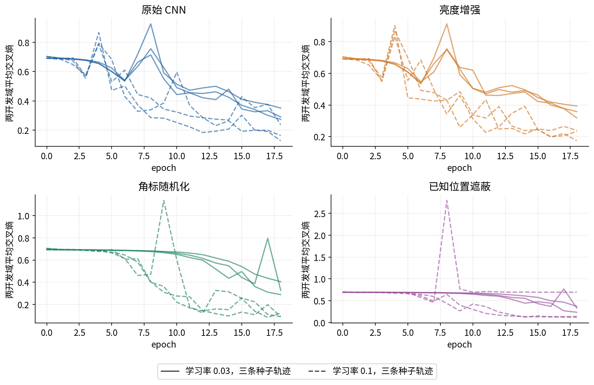

开发分数依次为：plain 0.175403，brightness 0.215458，random_stamp 0.101987，mask_stamp 0.311084。前三者选学习率0.1，遮蔽选0.03。数据和候选确定后，程序写selection-freeze.json，记录选择、协议哈希和所有权重文件哈希，随后才读取两个测试数组。测试文件此前只可用于字节哈希校验，不能参与训练、选择或图像探索。

这是一道可审计的程序信息边界，不是密码学保密。数据文件就在包中，读者可以主动越过它。真正团队项目可让另一人保管标签并记录访问。这里仍保留了首次运行的先后事件；后续正常运行、-O和Notebook重现只能算复现，不能伪装成多次独立封存测试。

准确率给出总体正确比例；交叉熵还惩罚错误置信度。逐类召回检查是否偏向某类；类别×角标四组报告分母和错误率。按预设分组解释测试是评价的一部分，不能据此修改方法后仍继续使用本轮测试来报“最终结果”。

## 9 正式结果与负结果

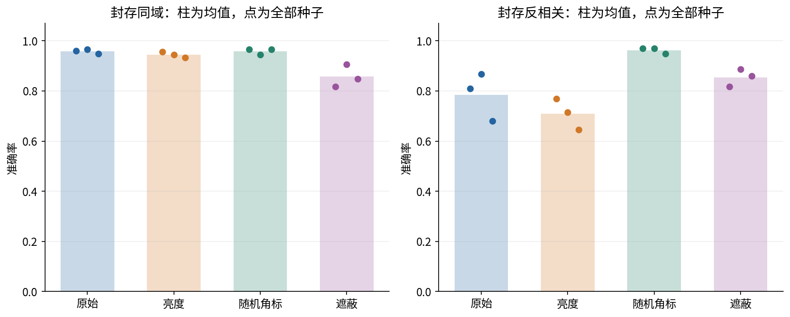

| 方法 | 同域准确率均值 | 反相关准确率均值 | 反相关最差至最好 |
|---|---:|---:|---:|
| 原始 CNN | 95.83% | 78.52% | 67.97%至86.72% |
| 亮度增强 | 94.53% | 70.96% | 64.45%至76.95% |
| 角标随机化 | 95.83% | 96.22% | 94.92%至96.88% |
| 已知位置遮蔽 | 85.68% | 85.42% | 81.64%至88.67% |

同域中，原始CNN明显超过只看角标的89.06%和常数50%，所以它不是一个故意削弱的基线。反相关域角标规则只有11.33%；CNN仍达78.52%，说明它也学到了形状信息。不能因为存在捷径，就宣称网络完全没有学习语义。

相同seed配对，角标随机化相对plain在反相关域的准确率提升为16.02、10.16、26.95个百分点，平均17.71个百分点。其同域平均准确率相同，但平均交叉熵更高：约0.12494对0.10308。不能只说“同域无代价”，因为概率质量的这一指标并未改善。

亮度增强没有去掉角标相关性，在这套固定训练预算下表现更差。遮蔽模型对角标翻转完全不敏感，但准确率不及随机化；对某一干扰不敏感并不等于分类充分正确。我们没有在见到测试后延长遮蔽训练或增加学习率候选。那是合理的新实验，但要新的开发流程和未见测试。

只有三个训练随机种子，且共享同一数据划分。种子散布表示训练随机性，不能把三个种子×256个样本当768个独立对象计算窄置信区间。本讲没有宣称统计显著性；现实论文应预先安排多个对象划分、对象级配对重采样或适当区间估计，并区分数据与训练两类不确定性。

## 10 子群误差与配对干预

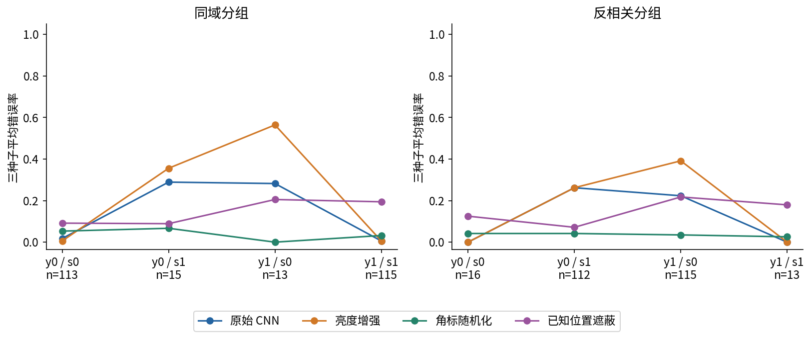

反相关测试的四组分母为16、112、115、13。原始CNN在角标与类别一致的两个小组平均没有错误；在不一致的两个大组平均错误率为26.19%和22.32%。这与依赖角标的假设一致，但观察到组差异本身不能完整证明内部因果机制。

再做预写的配对干预：固定中心图像和标签，只把角标像素按0.88−x翻转，再裁到[0,1]。它不是重新采样一个物体。原始CNN在反相关测试上平均25.78%的预测改变，随机化为2.60%，遮蔽为0%。brightness为34.24%。这是针对生成器已知非语义因素的局部机制证据，不能外推为模型对任意背景都鲁棒。

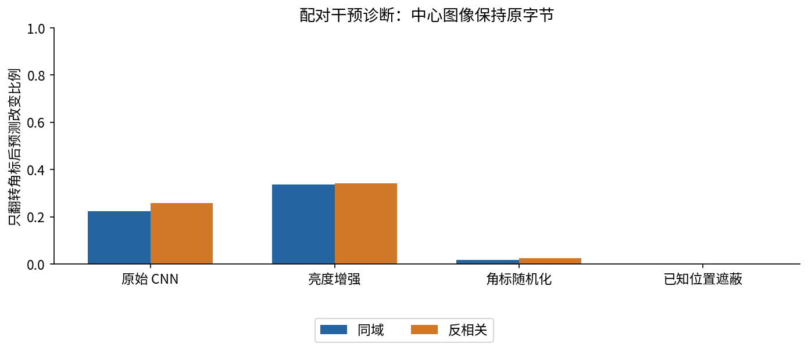

这里的反事实只对合成定义有效。现实世界中某个区域是否与标签无关，需要专业知识和标注审查。若角标遮住病灶、形状或真实文本，删除区域就可能改变任务信息。以测试表现倒推哪些区域“必然无关”，会形成循环论证。

## 11 失败案例保留选择规则

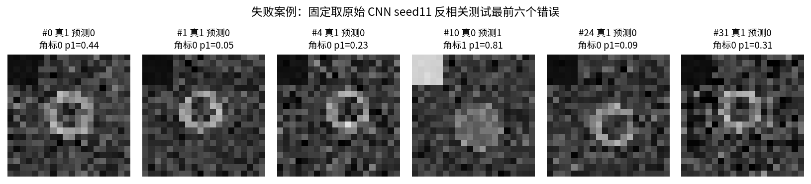

每张错误图同时记录真实标签、预测、角标和p1。检查原图可提出噪声、中心偏移或角标依赖的假设，但不能直接把高置信错误归因于某个因素。outputs/results.json保存所有finalist的全部错误索引、logits与预测，因此读者可以计算其他汇总并明确标为事后探索。

如何写失败分析？先写可观察事实，例如“这个圆环被分为圆盘，角标也指向圆盘”；再写需要验证的解释，例如“可能依赖角标”；最后写区分解释的下一实验，例如保持中心不动翻转角标。不要把第三步的想法当作已经完成的证据。

一个额外风险是测量口径。训练曲线中的train指标是在未增强的完整训练集上用评价预处理计算，不是训练过程中所有增强批loss的平均。对random_stamp而言，两者对应不同输入分布。所有图和JSON沿用这一口径，避免把它们当相同的目标数值。

## 12 从课程项目形成研究交付

最小交付包括：任务与适用范围、数据卡和许可、先修与环境、预写协议、基线和预算、完整候选轨迹、方案冻结记录、正式测试与子群指标、负结果、失败案例以及复现入口。本讲的lab.pdf可脱离讲义独立执行；answers.pdf解答全部练习，Notebook会重新训练而不是仅打印缓存分数。

输入域也属于证据范围。公开入口只支持CPU float32、N×1×20×20、1至10000张、有限[0,1]像素。空批、RGB、错误尺寸、整数像素、NaN和Inf会明确拒绝。扩展到大图、GPU、float16、医疗图像或真实相机，需要新的数值与领域验证，不能把“不报错”当成支持。

本轮脚本在正常与python -O模式验证；Notebook在新的Python进程内创建真实InProcessKernel，按序重新训练并嵌入本轮图像。构建环境不支持socket内核传输，本包不声称测试了外进程socket启动或浏览器Jupyter界面。完整环境版本记录在outputs/environment.json。

阅读[Shortcut Learning](https://arxiv.org/abs/2004.07780)可以把本例放入更广的捷径框架；[WILDS](https://proceedings.mlr.press/v139/koh21a.html)展示真实数据域偏移的评价动机。本讲既没有下载WILDS，也没有复现论文分数。PyTorch的[可复现说明](https://docs.pytorch.org/docs/2.7/notes/randomness.html)强调跨版本、平台和设备完全相同并无保证；本项目的复现结论只覆盖记录的CPU环境。

研究的最后一句应准确而可检验：在固定生成器、固定数据划分、同样CNN和108次更新预算下，训练角标随机化改善了指定反相关域，保留了平均同域准确率，但没有改善同域交叉熵。下一步需要新的分布和独立对象来判断边界，而不是继续用本轮测试选方案。
