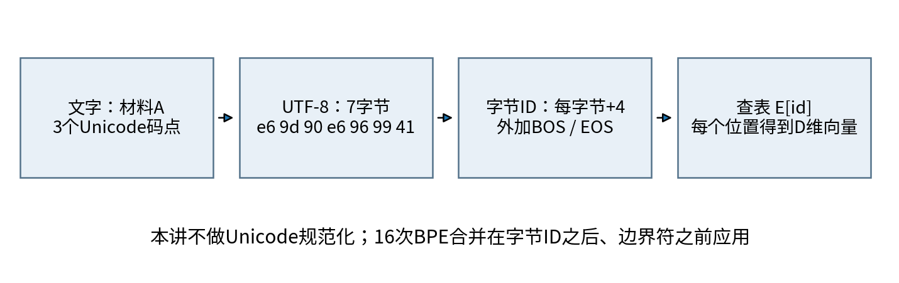
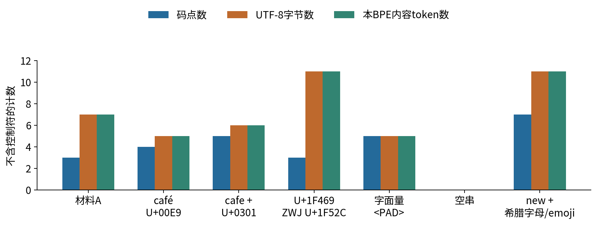
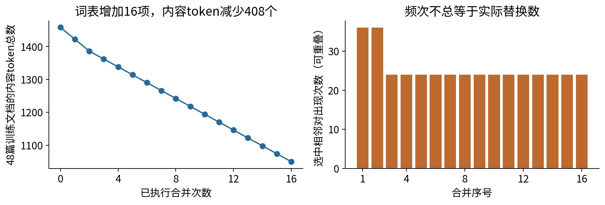
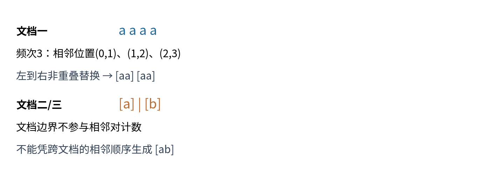
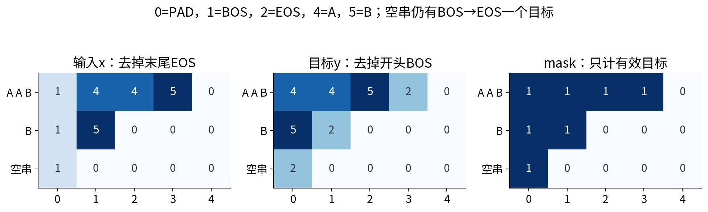
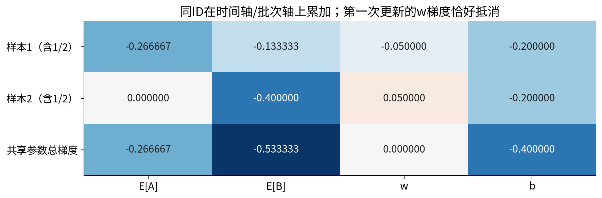
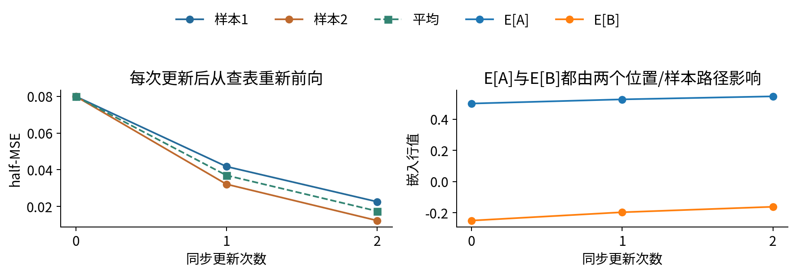
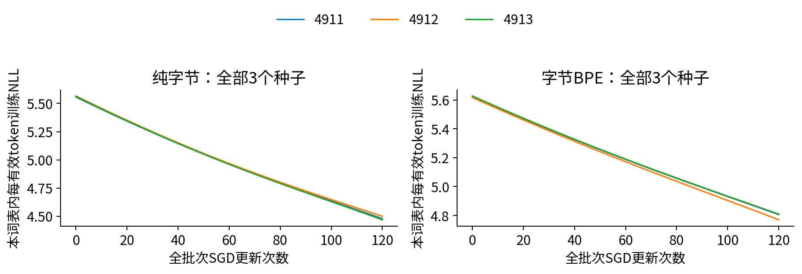
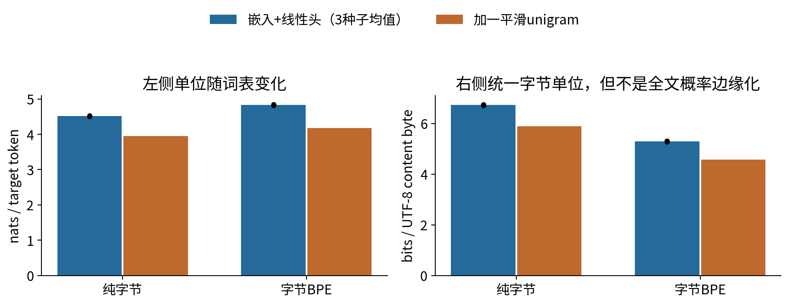
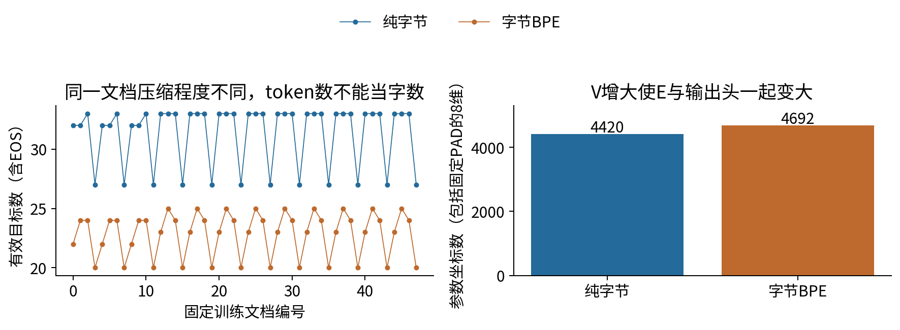

# 049 词元嵌入与序列数据

先确定文字如何变成整数，再讨论整数如何变成可学习向量。token的边界、长度和损失分母，是模型定义的一部分。

## 1 学习路线：从类别索引到序列

正式先修017、024、030：需要能够解释分类概率与交叉熵、共享参数的链式法则，以及一次训练循环中梯度清零、反向和更新的顺序。这里不要求先懂RNN或Transformer；下一讲050才把前文状态引入当前预测。

本讲回答：字符、字节和token有什么不同？词表怎样只从训练集建立？查表为什么能求参数梯度却不对整数ID求普通连续导数？重复词元、padding和文档边界怎样影响梯度？换tokenizer之后，为什么更低的token困惑度不一定代表相同文字更短的编码成本？

交付有两个互补实验。第一个用两条可手算的序列，把嵌入、池化、损失、共享梯度、两次更新和下一次前向完整连起来。第二个用原始合成双语科研短句，训练六个低秩bigram模型，保留其没有超过unigram基线的结果。两个实验都没有使用预训练模型或外部文本。

## 2 字形、码点、字节与token是不同单位

Python字符串中的一个位置通常对应一个Unicode码点，屏幕上的一个可见字符却可能由多个码点组成。预组合的café最后一个码点是U+00E9；分解形式cafe加U+0301有五个码点。它们常显示得近似，但原始UTF-8字节不同。带ZWJ的“女科学家”emoji序列由U+1F469、U+200D、U+1F52C三个码点组成，共11个UTF-8字节；这不意味着用户看见三个独立符号。字素簇与规范化规则分别见Unicode官方UAX29、UAX15。[S1,S2]

本代码明确选择“不规范化”：输入字节必须精确保留。它不实现完整字素分割器，也不把大小写、空白、组合重音自动合并。若研究需要NFC或其他规范化，应把算法和版本加入训练/推理共同协议，并承认原始字节可能不再可逆。不要在训练时规范化、测试时忘记处理。

token是tokenizer输出的离散单元，可以是码点、字节、词或某种子串，不保证是语言学的“词”。同一句话换一个词表，就可能改变token数。中文、英文、数字和emoji也没有统一的“每字几个token”常数。

## 3 词表、ID与控制符契约

词表是ID到内容的映射。ID数值只用来定位行：ID100并不天然比ID50含义大两倍，把ID作为浮点数直接送进线性层会引入任意的顺序假设。只要一致重排词表、嵌入行、输出头列和目标ID，概率及损失应保持不变；测试对这个重新编号性质做了验证。

本讲统一保留PAD=0、BOS=1、EOS=2、UNK=3。PAD用于矩形张量的补齐；BOS提示一篇文档的开始；EOS作为需要预测的结束符；UNK代表某些词表不能区分的未知内容。四者角色不同，不可互换。

纯字节词表包含全部256个单字节，字节值b的ID为b+4，因此总V=260。普通文本字符串“&lt;PAD&gt;”只是一串普通字符，编码后各内容ID至少为4，不会变成控制ID0。本文从外部文本构造控制符的唯一入口是在每篇文档两端显式加BOS、EOS；不解释文字中的特殊拼写。

训练集码点词表示例会把没见过的码点映射成UNK，多个不同字符于是可能变得不可区分。我们的完整字节词表对有效UTF-8字符串不需要UNK兜底，可以精确编码和还原未见字符；但“可编码”不等于“理解其含义”，未训练的字节行也不会凭空获得语义。

## 4 可复现的教学字节BPE

BPE思想可用于学习子词单元，相关原始研究见[S3]；SentencePiece是另一套完整的tokenization系统工作[S4]。下面是明确自定义的教学字节BPE，不声称复现经典按词BPE、SentencePiece、WordPiece或任何现成大模型tokenizer的兼容格式。

先对每篇训练文档分别做UTF-8编码，把每个字节变成ID。每轮统计各文档内部所有相邻ID对的出现次数；只选频次最高者，平局按两个整数ID的字典序取最小者。为该对新增一个ID，然后在每篇文档中从左到右进行非重叠替换。最多16轮；若最高频次小于2就提前停止。控制符在合并学习之后才加入，不参与计数。

以两篇“abab”为例，a=101、b=102。第一轮合并(101,102)，新ID260表示字节ab，每篇变成[260,260]；第二轮合并(260,260)，新ID261表示abab。最终加边界得到[1,261,2]。推理不重新统计：严格按已保存的合并顺序应用同一规则。

“aaaa”中的(a,a)相邻频次为3，实际非重叠替换却只有2次。合并后[aa,aa]仅有一对，频次1，按本协议不再合并。不要用频次直接代替token减少量。平局、重叠替换、空文档和文档边界都是算法必须写清楚的部分。

合并字节片段可能横跨UTF-8码点内部。真实合并表中有十六进制8082、81e7这样的片段，单独不构成合法Unicode文字。调试时应打印hex，解码时先把所有片段拼回字节串再严格UTF-8解码。随机生成的合法ID序列仍可能构成非法UTF-8，此时decode抛出UnicodeDecodeError，不能悄悄用替换符掩盖错误。

词表和合并表只能由训练集确定。validation和test只能调用encode。即使tokenizer不看标签，在测试文本上重新学习频次也使用了测试分布信息。研究时还应按文档来源、实体或时间划分，避免同一文本的近重复泄漏；本数据只是模板化教学语料，精确字符串不重叠并不能证明独立真实语言泛化。

## 5 查表等价于one-hot乘矩阵

嵌入参数表$E\in\mathbb R^{V\times D}$存储V行向量。批次ID张量$X\in\{0,\ldots,V-1\}^{B\times T}$经过查表得到$H\in\mathbb R^{B\times T\times D}$，其中$H_{btd}=E_{X_{bt},d}$。D是我们选择的表示维数，不是文字长度。

令$Q_{btv}=1$当且仅当$X_{bt}=v$，则$H_{btd}=\sum_v Q_{btv}E_{vd}$。数学上相当于one-hot乘E，但实际无需分配巨大的B×T×V数组；整数索引只读取相应行。

![图5 同一行可以在多个位置被读取。两个A不是两套独立参数，都是同一个E[A]。](figures/05_lookup.png)

查表本身是静态映射：相同ID总读到相同向量。上下文相关表示来自随后RNN、卷积或注意力等计算，不能把原始Embedding输出直接称为上下文化语义。随机初始化也不保证余弦相似度已有意义。

ID是离散选择，本文不对ID求普通导数。对参数E的导数完全成立。若上游梯度为$G=\partial L/\partial H$，则

$$\frac{\partial L}{\partial E_{vd}}=\sum_{b,t:X_{bt}=v}G_{btd}.$$

这是scatter-add：按ID把多个位置的贡献加回共享行。NumPy实现用np.add.at，不能用含重复索引的普通高级索引“+=”假定它会完成每次累加。未被读取的行在这个查表目标中得到零数据梯度；若另加权重衰减、共享输出权重或其他目标，它仍可能改变。

## 6 补齐、长度、mask和目标位移

两条内容序列[A,A,B]、[B]加边界后为[1,4,4,5,2]、[1,5,2]。预测下一token时，输入取去掉最后一项的序列，目标取去掉第一项的序列。第一条是BOS→A、A→A、A→B、B→EOS；第二条是BOS→B、B→EOS。EOS是有效目标；不能把它误当padding去掉。

mask的True表示该位置的目标参与损失。本文有效目标总数$M=\sum_{bt}m_{bt}$，目标为$L=\sum_{bt}m_{bt}\ell_{bt}/M$。如果先对每篇文档取平均再对文档取平均，短文档每个token的权重会更大，那是另一种目标。必须在论文与代码中采用同一分母。

E[PAD]=0不足以自动屏蔽padding：经过输出偏置b后，补齐位置仍有非零logit和交叉熵。因此需要同时处理固定padding嵌入和loss mask。PyTorch的padding_idx管理查表参数对应行的梯度；它不是后续网络的通用mask。[S5] 本实验用ignore_index=PAD去掉目标为PAD的位置，且pad_batch保证所有有效目标都不是PAD，所以这与mask公式一致。

固定PAD行不是整个网络“永远不更新ID0相关的一切”。我们的输出头包含V个类别，ID0对应的输出列也参与softmax归一化，其参数会学习压低无效类别概率。没有做输入/输出权重绑定，也没有过滤输出控制类别。BOS作为输入行会学习；EOS在这个bigram输入中不被读取，但作为输出目标仍会训练输出列。

不要把独立文档拼成一条没有边界的长序列，那会新增EOS→BOS或一篇尾部→另一篇开头的训练对。后续若用packed batch，需要明确位置重置、因果mask和状态重置；把padding删掉并不能自动解决跨文档信息流。

## 7 同一数值实例：两条序列前向

现在暂时不用softmax，采用可精确核算的D=1嵌入加masked mean回归。E的六行依次为[0,0.2,0.4,0.3,0.5,-0.25]，A=4、B=5。BOS、EOS、UNK在此池化小例中没有被输入，初值只为保持统一ID约定。线性头w=2、b=0.1，样本目标为y₁=1、y₂=0。有效长度为3和1。

$$a_i=\frac1{n_i}\sum_{t=1}^{n_i}E_{x_{it}},\quad \hat y_i=wa_i+b,\quad \ell_i=\frac12(\hat y_i-y_i)^2,\quad L=\frac{\ell_1+\ell_2}{2}.$$

样本1查出[0.5,0.5,-0.25]，均值a₁=0.25，预测0.6，残差-0.4，单样本half-MSE为0.08。样本2查出[-0.25]，均值-0.25，预测-0.4，残差-0.4，单样本损失也为0.08，因此L=0.08。padding的两个零不进入样本2分母；若除以矩形宽3，预测就错了。

## 8 局部导数、重复行和跨样本累加

从平均损失反向，$\partial L/\partial\hat y_i=(\hat y_i-y_i)/2=-0.2$。局部导数分别为$\partial\hat y_i/\partial w=a_i$、$\partial\hat y_i/\partial b=1$、$\partial\hat y_i/\partial a_i=w$、$\partial a_i/\partial E_{x_{it}}=1/n_i$。先乘完整路径，再按共享参数累加。

样本1每个查表位置贡献$(-0.2)\times2/3=-2/15$。A出现两次，故E[A]得到-4/15；B出现一次，得到-2/15。样本2的B再贡献$(-0.2)\times2=-2/5$，最终E[B]总梯度为-8/15。这里既有同一样本内的重复，也有不同样本之间的共享。

样本1给w的贡献为-0.2×0.25=-0.05，样本2给w贡献为-0.2×(-0.25)=0.05，恰好相消。w梯度为零不等于w没有影响loss，更不等于任意训练步骤都为零。偏置梯度为-0.4。按[E[A],E[B],w,b]顺序，总梯度为[-0.266666667,-0.533333333,0,-0.4]。

## 9 同步更新后完整重算，继续第二步

学习率η=0.1；所有参数使用同一组旧参数下的梯度同步更新。得到E[A]'=79/150=0.526666667，E[B]'=-59/300=-0.196666667，w'=2，b'=0.14。不能先更新E后沿用旧均值去计算w梯度。

新参数下样本1均值257/900=0.285555556，预测32/45=0.711111111，残差-13/45，单样本损失169/4050=0.0417283951。样本2均值-59/300，预测-19/75=-0.253333333，损失361/11250=0.0320888889。新的平均损失3737/101250=0.036908642。

第二步的预测上游分别为-13/90、-19/150。样本1每个查表上游为-13/135，E[A]两次合为-26/135；E[B]再加样本2的-19/75，得到-236/675=-0.349629630。w梯度为(-13/90)(257/900)+(-19/150)(-59/300)=-0.0163358025；b梯度为-61/225=-0.271111111。

再次同步更新得到[E[A]'',E[B]'',w'',b'']=[0.545925926,-0.161703704,2.001633580,0.167111111]。第三次前向的两个均值为0.310049383和-0.161703704，预测0.787716367和-0.156560452，单样本损失0.0225321704和0.0122555876，平均0.0173938790。outputs中的hand以Fraction保存每个中间量的精确分数和十进制；答案给出复核路线。

## 10 从池化小例到真实下一token模型

主实验不池化。每个有效位置独立读取$h_{bt}=E_{x_{bt}}$，输出$z_{bt}=h_{bt}W+b$，其中E为V×8、W为8×V、b为V。对V个logit做softmax，交叉熵目标是该位置的下一个ID。这是共享的低秩bigram分类器：只依赖当前token，不使用更早的历史，没有循环状态、位置向量或注意力。

令$P_{btv}=\operatorname{softmax}(z_{bt})_v$，则完整反向为

$$\Delta_{btv}=\frac{m_{bt}}M(P_{btv}-1[y_{bt}=v]),$$
$$g_W=\sum_{bt}h_{bt}^{\top}\Delta_{bt},\qquad g_b=\sum_{bt}\Delta_{bt},\qquad g_{h,bt}=\Delta_{bt}W^\top.$$

最后按第5节scatter-add回E，并把固定PAD行梯度设为零。所有E/W/b在同一轮更新后再进入下一次前向。NumPy参照独立实现稳定softmax、矩阵缩约和scatter，与真实torch梯度在每个模型第0、59、119次更新前对照；小词表还检查每个非固定参数的中心差分。

稳定NLL应计算“log(sum(exp(z-max(z)))) - (z_target-max(z))”，而不是先算softmax再log，也尽量避免两个很大的近似相等数相减。代码拒绝非有限输入并在溢出时抛错，不把任意极大参数都宣称为可靠支持。所有主训练参数明确float64，ID明确整数；改变默认浮点dtype不应悄悄改变常数精度。

## 11 固定实验协议和保留产物

generate_data.py生成48篇训练、16篇验证、24篇测试；编号分段，测试另含两个未见符号探针。模板形式和材料类别有确定关联，不能把它解释为随机抽样的自然语言数据。原始文本、生成器和SHA均保留。

纯字节V=260，训练集16次BPE合并后V=276。D=8；种子4911、4912、4913；E用标准差0.12的正态初始化、W为0.08、b为零，E[PAD]=0。每个模型120次全批次SGD，学习率0.4，没有动量、weight decay、裁剪、早停或调参。验证集只描述，不选checkpoint；所有六次运行都按终点测试。训练token数分别1506和1098，所以相同更新次数不等于相同token预算。

每次运行保存121个完整E/W/b状态，共726个状态和720次更新；最终六组参数另存以便独立复算每篇测试NLL。数据和结果不是截图中的展示数字，全部可由脚本重新生成。相同固定环境下正常与-O运行的科学结果可逐字节比较；跨版本、硬件的浮点差异需要重新核查，不保证任意后端位级相同。

## 12 token困惑度与每字节成本

单个模型的token困惑度为$\exp(\mathrm{NLL}_{total}/M)$。本次六模型中，纯字节三个种子的平均每token NLL为4.518608、平均困惑度91.714217；BPE分别为4.837269和126.140911。这里“平均困惑度”是先对每个模型取exp再平均，不等于对平均NLL取exp。

不同tokenizer的一个token代表不同字节数，这两个困惑度不能作为统一单位下的直接排名。可补充同一原始测试集的字节口径：

$$\mathrm{bits/byte}=\frac{\sum \mathrm{NLL}_{\text{canonical token path}}}{\ln2\times\text{原始UTF-8内容字节数}}.$$

分子包含每篇EOS的预测成本，分母不含BOS/EOS这些人工控制符；空内容语料的分母为零，代码返回None而非除零。测试内容共730字节，纯字节有754个目标，BPE有554个目标；三种子平均bits/byte为6.733296与5.296167，方向与token困惑度不同。

这个口径仍有边界：它评价确定tokenizer给出的那一条规范编码路径，不对“所有能解码为同一文字的token序列”概率求和；也不计算词表、合并表和模型参数的传输成本，更不是实测压缩文件大小。不同路径可能解码成相同文字，随机路径还可能非法，因此不能直接叫作完整文本分布的perplexity。它提供可解释的统一字节单位，不消除模型、数据和预算差异。

简单基线用训练目标计数加一平滑：$p(v)=(c_v+1)/(M_{train}+V)$，包含EOS且输出空间同为V。其测试bits/byte分别为5.884620和4.574682，都优于对应神经模型。这个固定小预算下，学一个嵌入表和输出头没有自动赢过平滑频率表。我们没有看到这个结果后追加训练或选最好种子；若要研究更长训练，应事先另立协议并保留本次结果。

## 13 词表和序列长度的资源取舍

查表参数VD，线性输出头DV+V，总坐标数17V：纯字节4420，BPE4692，其中8个PAD坐标固定。token变少可能减少中间张量长度，但V变大也扩大softmax和输出头。这里两者都变了，不能把准确率、成本或速度变化全部归因于“子词更好”。

padding使批次宽度取最长序列，真实有效工作量与B×T不同。长度分桶可以减少补齐，但可能改变样本顺序，需记录随机化策略。截断不是无害的尺寸修复：它可能删掉关键上下文或EOS。pad_batch明确不自动截断，pad_to短于最长序列直接拒绝；研究若采用窗口切分，必须定义边界、重叠、label mask和后续状态。

## 14 支持域、失败保护与常见误区

本教学tokenizer每文档至多4096个UTF-8字节；训练文档1至512篇、总字节不超过200000、合并预算0至64。输入必须为合法Unicode字符串，未配对代理码点拒绝。序列ID必须一维整数且范围合法，布尔值不是合法ID。解码可验证字节往返，但任意ID串不保证合法文字。

pad_batch只接受BOS+普通内容+EOS的独立文档，最多512条，补齐宽度至多4097，B×T不超过200000；全空内容文档可用，但空批次拒绝。NumPy参考要求同形B×T整数输入/目标与Bool mask，至少一个有效位置，最多2000000个logit；参数为有限实数并转为float64，溢出明确失败。它是带外部mask的通用目标参考；主训练的更严格文档语义由pad_batch保证。

run先在内存中完成所有训练与序列化，再逐文件原子替换结果；训练或数据校验阶段失败不会写掉旧结果。操作系统级故障发生在多个文件的替换之间，仍可能留下混合版本，所以整包核验要同时核对results中的压缩文件SHA，而不把多文件写入宣称为完整事务。

不要把PAD与UNK混用；不要以为padding_idx等于loss mask；不要只算一次重复ID梯度；不要把token平均和文档平均混用；不要在test上重学词表；不要比较不同tokenizer的token困惑度来宣称同单位胜负；不要把tiny bigram短句实验当成语言理解证据。进入050前，应能不看答案写出查表、mask、scatter和同步更新的完整链。

## 15 原始来源与研究路线

[S1] [Unicode UAX #29: Unicode Text Segmentation](https://www.unicode.org/reports/tr29/)，字素与分段背景。

[S2] [Unicode UAX #15: Unicode Normalization Forms](https://unicode.org/reports/tr15/)，规范化背景。本实现没有调用规范化。

[S3] [Sennrich, Haddow, Birch. Neural Machine Translation of Rare Words with Subword Units, 2016](https://aclanthology.org/P16-1162/)，子词/BPE研究背景；本文字节算法的全部细节以本讲定义为准。

[S4] [Kudo, Richardson. SentencePiece, 2018](https://aclanthology.org/D18-2012/)，独立tokenization系统背景，不是本实验依赖。

[S5] [PyTorch 2.7 Embedding文档](https://docs.pytorch.org/docs/2.7/generated/torch.nn.Embedding.html)，查表shape、padding_idx和梯度选项。本实验dense梯度SGD，不用max_norm、sparse或scale_grad_by_freq。

阅读时把“原文方法”“本文简化”“本文实测”分开记录。下一讲用相同序列边界概念建立RNN与BPTT，再讨论门控和注意力；静态词元嵌入只是输入表示的第一步。
