# DL050 循环网络与时间反向传播

本讲解决一个问题：状态怎样积累历史，长期依赖为何难以训练。RNN 把同一套更新规则反复作用于序列；BPTT 在展开后的计算图上使用链式法则，并把同一参数在所有时刻产生的梯度相加。越长的时间跨度意味着越长的 Jacobian 连乘。截断改变这个梯度，裁剪改变更新向量的大小，两者解决的问题不同。

本讲包含可手算的两条短序列、独立 NumPy 反传、PyTorch 对照和固定协议的延迟实验。目标是让读者能追踪数值、发现实现错误、设计有限结论的研究实验，而非用一个 toy 任务证明模型具备通用记忆。

## 1 先修衔接与阅读路径

原课程先修是 DL027 批次反向传播与损失归约、DL035 激活初始化与信号传播、DL049 词元嵌入与序列数据，未作替换。DL027 提供“共享参数梯度求和、广播反传、mean 分母”；DL035 提供 tanh 饱和、梯度沿层连乘；DL049 提供序列长度、padding、掩码及嵌入查表。本讲把“层”换成时间步，但不同时间步共享参数。

如果暂时忘记导数，把它理解成“输入稍微改一点时，输出改变多少”。串联计算的敏感度相乘；两条路径同时影响一个结果时，贡献相加。矩阵乘法只是一次记录多个输入和输出的敏感度，不引入新的反传原则。

建议先读第 2 至 7 节，拿纸覆盖数值表后重新计算；再读第 8 至 11 节与代码；最后完成独立实验指导 lab.md。答案集中在 answers.md，避免用“对照抄出正确结果”替代诊断能力。PDF 与 Markdown 是同一内容，Notebook 保存实际执行输出。

完成本讲后应能：画共享参数的时间展开图；推导含样本、时间及 mask 的 BPTT；用局部导数和完整数值链校验实现；区分状态值保留、梯度路径保留与跨序列泄漏；用预定多 seed 实验说明延迟、裁剪和截断的局限。

## 2 从逐项输入到可复用状态

### 2.1 为什么要有状态

假设第 1 秒听到“左”或“右”，随后听到一串无关声音，到第 9 秒才回答。只看最后一秒的普通分类器看不到最初的信息。我们引入隐藏状态 h：它是模型内部的一串数，每读一个输入就更新一次，用来压缩已经看到的内容。隐藏状态不是人类意义的记忆，也不自动保存所有过去；有限维状态会丢信息，保存什么由任务与训练共同决定。

一条序列是一个样本，一条序列里的第 t 个位置是一个时间步。batch 内的样本可以同时算，但不共享各自的状态。参数在所有样本与时间步之间共享，状态则各有一份。两个概念必须分开。

### 2.2 统一符号与形状

数学采用单样本列向量，代码按 batch 的行存储。设输入维度 D、隐状态维度 H、时间长度 T、样本数 N。下表的 D 表示输入维度；实验中为避免混淆把“延迟”明确写成 delay。

| 对象 | 数学形状 | 批次代码形状 | 含义 |
|---|---|---|---|
| $x_{it}$ | $D\times1$ | $X:[N,T,D]$ | 样本 i 第 t 步输入 |
| $h_{it},a_{it}$ | $H\times1$ | $[N,T,H]$ | 状态和前激活 |
| $U$ | $H\times D$ | $[H,D]$ | 当前输入到状态 |
| $W$ | $H\times H$ | $[H,H]$ | 旧状态到新状态 |
| $b,v$ | $H\times1$ | $[H]$ | 状态偏置、二分类读出 |
| $c,z_{it}$ | 标量 | $c:[]$，$z:[N,T]$ | 输出偏置和 logit |

每条独立序列从零开始：$h_{i0}=0$。有效位置的递推是

$$a_{it}=Ux_{it}+Wh_{i,t-1}+b,\qquad h_{it}=\tanh(a_{it}).$$

$$z_{it}=v^T h_{it}+c,\qquad p_{it}=\sigma(z_{it})=\frac{1}{1+e^{-z_{it}}}.$$

tanh 对每个分量分别作用，输出介于 −1 与 1。状态可以为负；概率只能介于 0 与 1。logit 是未经 sigmoid 的实数，不是概率。代码里的 X[:,t] @ U.T 对应数学中的 Ux；转置来自样本在行上的存储约定。

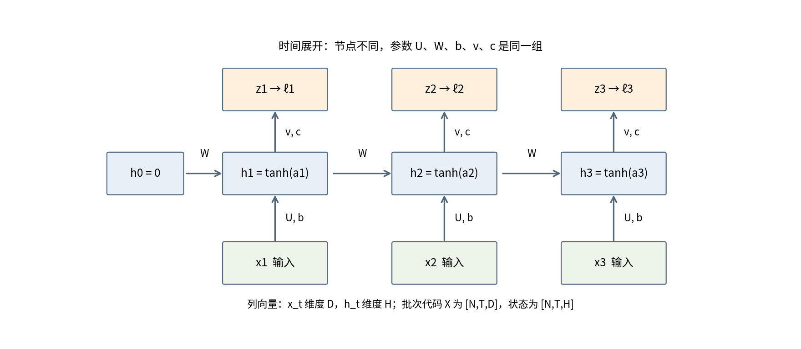

图中“循环”在实际计算时没有神秘的自我依赖：h1 读已知 h0，h2 读已经算完的 h1。展开后就是一个有向无环图。时间长度改变时，参数个数不变；二分类单层模型共有 HD + H² + 2H + 1 个参数。

### 2.3 与上一讲的嵌入连接

若输入是 token ID，先以 DL049 的嵌入表 E 查出向量 $x_{it}=E[q_{it}]$，然后进入 Ux。token ID 本身不参与连续微分。反向时先有 $\partial L/\partial x_{it}=U^T\delta_{it}$，再把相同 token 所有出现位置的梯度累加到 E 对应行。本讲用连续合成输入隔离 RNN 机制，不重新训练词元化，也不改变 DL049 的 PAD=0、BOS=1、EOS=2、UNK=3 约定。

## 3 明确损失和有效位置

对标签 $y\in\{0,1\}$，二元交叉熵可写为

$$\ell(z,y)=\log(1+e^z)-yz.$$

实际使用稳定实现 logaddexp(0,z) 或 binary_cross_entropy_with_logits，不先算概率再取 log，以免较大的正负 logit 造成数值溢出或 log(0)。其关键局部导数是 $\partial\ell/\partial z=p-y$。

设每条序列实际长度为 $L_i$，状态掩码 $m_{it}=1[t\le L_i]$。手算例在所有有效位置预测，损失掩码也取 m：

$$Z=\sum_{i,t}m_{it},\qquad L=\frac{1}{Z}\sum_{i,t}m_{it}\ell(z_{it},y_{it}).$$

每个有效位置占同等权重，所以 e=(p−y)/Z 已经含平均因子；参数梯度之后只求和，不再除 N 或 T。若每条序列先各自平均再对样本平均，长短序列权重不同，是另一个目标。DL027 的归约区别在这里同样成立。

延迟实验只在最后一个有效位置回答，改用损失掩码 $q_{it}=1[t=L_i]$，归约分母变为 N；状态掩码仍然是 m。不能把“哪里计算损失”和“哪里更新状态”混为一谈。中间状态虽然没有直接损失，仍可能通过未来路径接收梯度。

补齐位置采用冻结状态：先算候选 $\tilde h_{it}=\tanh(a_{it})$，再令 $h_{it}=m_{it}\tilde h_{it}+(1-m_{it})h_{i,t-1}$。补齐输入被忽略，补齐位置没有损失，但保存状态的恒等路径存在。只把 PAD 嵌入设为零仍会经过 Wh+b 更新，不能替代状态 mask。

## 4 同一实例的完整前向

### 4.1 两条序列与旧参数

取 D=H=1，令 U=0.4、W=0.6、b=0.1、v=0.7、c=−0.2，两个 h0 都是 0。序列 A 输入 [1,0,−1]、目标 [1,0,1]；序列 B 输入 [−1,0.5]、目标 [0,1]。B 补齐到长度 3 时第三位置只放占位值 0，长度仍为 2。有效位置总数 Z=3+2=5。

A1：a=0.4×1+0.6×0+0.1=0.5，h=tanh(0.5)=0.462117，z=0.7×0.462117−0.2=0.123482，p=0.530831，单位置损失为 0.633311。A2 要使用 A1 的新状态，而不是 h0；B1 必须重新从 h0=0 开始，不能使用 A3。

| 样本时刻 | x | y | a | h | z | p | 单位置损失 |
|---|---|---|---|---|---|---|---|
| A1 | 1.000000 | 1 | 0.500000 | 0.462117 | 0.123482 | 0.530831 | 0.633311 |
| A2 | 0.000000 | 0 | 0.377270 | 0.360335 | 0.052234 | 0.513056 | 0.719605 |
| A3 | -1.000000 | 1 | -0.083799 | -0.083604 | -0.258523 | 0.435727 | 0.830740 |
| B1 | -1.000000 | 0 | -0.300000 | -0.291313 | -0.403919 | 0.400371 | 0.511444 |
| B2 | 0.500000 | 1 | 0.125212 | 0.124562 | -0.112806 | 0.471828 | 0.751140 |

表中数值显示 6 位小数，完整 float64 数值保存于 outputs/hand_calculation.json。运算时不要逐步把中间值舍入到 6 位。B3 的最终状态等于 B2，虽然程序可以算出一个未采用的候选值，但不会产生该位置的损失或参数贡献。

总损失是五个单位置损失相加再除 5：

$$L=\frac{0.633311+0.719605+0.830740+0.511444+0.751140}{5}\approx0.689248.$$

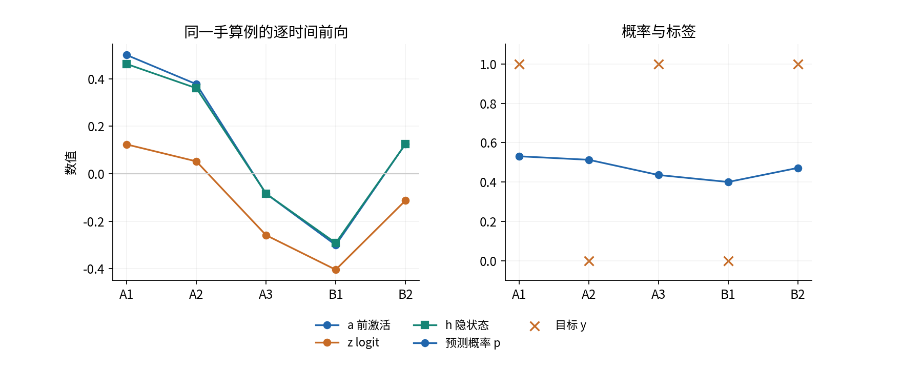

## 5 从局部导数到沿时间反传

### 5.1 先处理一个输出结点

写 $e_{it}=\partial L/\partial z_{it}=m_{it}(p_{it}-y_{it})/Z$。对读出参数，链式法则直接给出

$$\frac{\partial L}{\partial v}=\sum_{i,t}e_{it}h_{it},\qquad \frac{\partial L}{\partial c}=\sum_{i,t}e_{it}.$$

对状态，当前输出带来直接梯度 $ve_{it}$。但 h_t 还影响 h_{t+1}，后者再影响所有未来损失；忽略第二条路径就不再是完整 BPTT。

### 5.2 逆序递推完整梯度

先在没有 padding 的一段内推导。令 $r_{it}=\partial L/\partial h_{it}$、$\delta_{it}=\partial L/\partial a_{it}$。因为 tanh 的局部导数为 $1-h_{it}^2$（逐元素平方），有

$$r_{it}=ve_{it}+W^T\delta_{i,t+1},\qquad \delta_{it}=r_{it}\odot(1-h_{it}^2).$$

序列末尾没有未来路径，取 $\delta_{i,L_i+1}=0$。从最后有效位置向前算，即先算 A3，再算 A2、A1；B 从 B2 开始。符号 $\odot$ 表示对应位置相乘，不是矩阵乘法。

例如 A3：e=(0.435727−1)/5=−0.112855，r=0.7e=−0.078998，δ=r×(1−(−0.083604)²)=−0.078446。A2：直接项 0.7×0.102611=0.071828，未来项 0.6×(−0.078446)=−0.047068，二者相加得到 0.024760，再乘 0.870159，得到 δA2=0.021545。先相加再乘局部导数，不能只对其中一条路径乘导数。

| 位置 | e = (p−y)/5 | 直接 ve | 未来 wδ下一步 | 总 r | 局部 1−h² | δ |
|---|---|---|---|---|---|---|
| A1 | -0.093834 | -0.065684 | 0.012927 | -0.052756 | 0.786448 | -0.041490 |
| A2 | 0.102611 | 0.071828 | -0.047068 | 0.024760 | 0.870159 | 0.021545 |
| A3 | -0.112855 | -0.078998 | 0.000000 | -0.078998 | 0.993010 | -0.078446 |
| B1 | 0.080074 | 0.056052 | -0.043678 | 0.012374 | 0.915137 | 0.011324 |
| B2 | -0.105634 | -0.073944 | 0.000000 | -0.073944 | 0.984484 | -0.072797 |

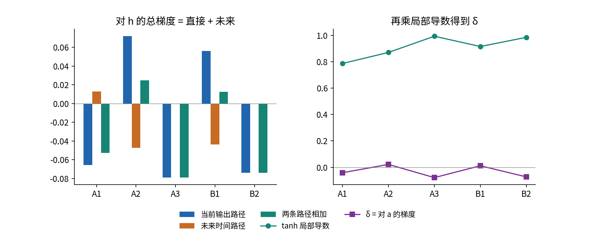

A2 两条路径相反，发生部分抵消。所以“未来路径很大”不保证该位置的总梯度很大。B1 的直接项也与未来项抵消。梯度正负是对损失变化的方向判断，不是“记住”与“忘记”的直接标签。

### 5.3 把递推展开成多条损失路径

对 A1，最终总 δ 由三个损失产生，不只来自 A1 的即时输出：A1 的损失走零条时间边，A2 的损失走一条，A3 的损失走两条。以 A3 的路径为例：

$$\frac{\partial (\ell_{A3}/5)}{\partial a_{A1}}=e_{A3}v(1-h_{A3}^2)W(1-h_{A2}^2)W(1-h_{A1}^2).$$

| 到达 A1 的损失来源 | 对 aA1 的梯度 |
|---|---|
| ℓA1/5 | -0.051657 |
| ℓA2/5 | 0.029493 |
| ℓA3/5 | -0.019326 |
| 三条路径之和 | -0.041490 |

这张表是理解 BPTT 的核心：沿某条路径连续相乘，不同路径相加。代码的逆序递推把相同的尾部计算复用，避免显式枚举所有路径。它不是另一套近似求导方法。

### 5.4 带状态 mask 的严格递推

在补齐位置令候选状态为 $\tilde h_t$。把未来传来的梯度记作 f_t，先 $r_t=ve_t+f_t$，再计算

$$\delta_t=m_t\,r_t\odot(1-\tilde h_t^2).$$

$$f_{t-1}=W^T\delta_t+(1-m_t)r_t.$$

m=1 时恢复通常公式；m=0 时对候选分支的梯度为零，r 沿恒等分支原样传给上一步。手算例的补齐位置没有损失也没有更后面的有效位置，所以实际传回的量也是零。写出恒等分支是为了避免把“冻结状态”误实现成“删除状态及所有梯度”。

## 6 共享参数怎样汇总与更新

### 6.1 每个使用位置都有贡献

对有效位置 a=Ux+Wh前+b，各参数的局部导数分别是输入 x、前一步状态 h前、常数 1。矩阵形式为

$$\nabla_U L=\sum_{i,t}\delta_{it}x_{it}^T,\quad \nabla_W L=\sum_{i,t}\delta_{it}h_{i,t-1}^T,\quad \nabla_b L=\sum_{i,t}\delta_{it}.$$

$$\frac{\partial L}{\partial x_{it}}=U^T\delta_{it},\qquad \frac{\partial L}{\partial h_{i0}}=W^T\delta_{i1}.$$

输出公式见第 5 节。外积 δxᵀ 的形状是 H×D；δh前ᵀ 是 H×H。bias 沿样本和时间相加，不能沿 H 求和。h0 在本讲固定为零，不被更新；若研究中将它设成可学习参数，则必须累加每条独立序列对 h0 的梯度，且仍不能把它与前一条序列末状态混同。

| 位置 | δx 对 U | δh前 对 W | δ 对 b | eh 对 v | e 对 c |
|---|---|---|---|---|---|
| A1 | -0.041490 | -0.000000 | -0.041490 | -0.043362 | -0.093834 |
| A2 | 0.000000 | 0.009956 | 0.021545 | 0.036974 | 0.102611 |
| A3 | 0.078446 | -0.028267 | -0.078446 | 0.009435 | -0.112855 |
| B1 | -0.011324 | 0.000000 | 0.011324 | -0.023327 | 0.080074 |
| B2 | -0.036398 | 0.021207 | -0.072797 | -0.013158 | -0.105634 |
| 总和 | -0.010766 | 0.002896 | -0.159864 | -0.033437 | -0.129637 |

A1 与 B1 的 W 局部贡献是零，因为 h0=0；但 W 的总梯度不为零。U 在 A2 的局部贡献是零，因为 xA2=0；A2 仍有 δ、仍影响 W 和 b。这些零值是检查表，不是可以跳过该时刻反传的理由。

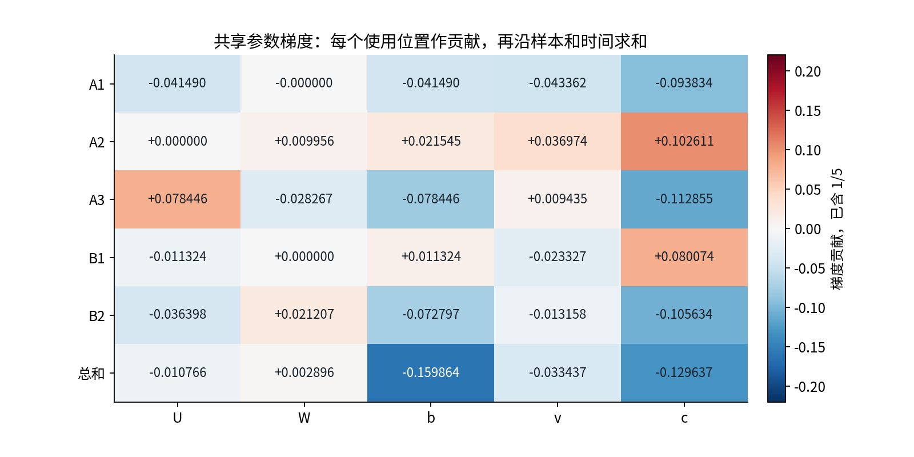

从“复制参数”的角度看，可以临时为每个时刻建立 W1、W2、W3，只在测试中让它们拥有相同数值。独立求出的三个梯度相加，必须等于真正共享 W 的梯度。test_experiment.py 验证了这一等价性。

### 6.2 所有参数同步更新

学习率 η=0.2，普通 SGD 使用 $\theta^{new}=\theta^{old}-\eta\nabla_\theta L$。先用同一组旧参数算完所有梯度，再更新全部参数。不能计算 A3 后立刻修改 W，再用新 W 计算 A2 的梯度，那会把两个不同函数的导数混在一起。

| 参数 | 旧值 | 总梯度 | 学习率 × 梯度 | 新值 |
|---|---|---|---|---|
| U | 0.400000 | -0.010766 | -0.002153 | 0.402153 |
| W | 0.600000 | 0.002896 | 0.000579 | 0.599421 |
| b | 0.100000 | -0.159864 | -0.031973 | 0.131973 |
| v | 0.700000 | -0.033437 | -0.006687 | 0.706687 |
| c | -0.200000 | -0.129637 | -0.025927 | -0.174073 |

### 6.3 新参数必须完成下一次前向

把两个 h0 再次设为零，使用新参数重新计算全部有效位置：

| 位置 | 新 a | 新 h | 新 z | 新 p | 新损失 |
|---|---|---|---|---|---|
| A1 | 0.534126 | 0.488529 | 0.171165 | 0.542687 | 0.611223 |
| A2 | 0.424807 | 0.400972 | 0.109290 | 0.527295 | 0.749284 |
| A3 | -0.029829 | -0.029820 | -0.195146 | 0.451368 | 0.795473 |
| B1 | -0.270180 | -0.263793 | -0.360492 | 0.410841 | 0.529058 |
| B2 | 0.174927 | 0.173164 | -0.051700 | 0.487078 | 0.719331 |

新的五项平均损失为 0.680874，小于旧值 0.689248。个别样本损失增加并不违背总体下降：A2 与 B1 的损失都上升。一次下降也不是 SGD 每一步都下降的保证；学习率大、随机 batch 或非凸曲率都可能导致上升。

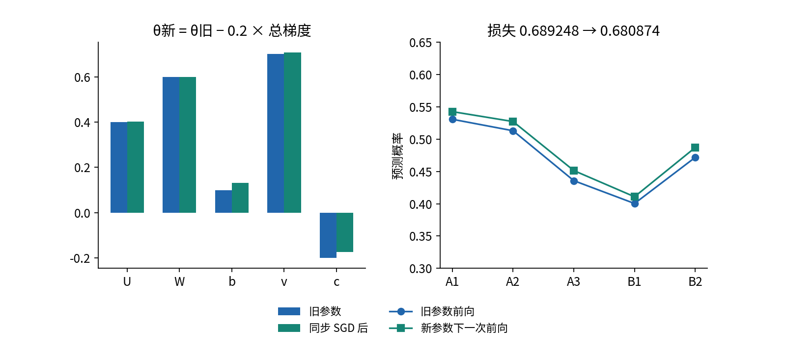

## 7 长期依赖为何产生数值困难

### 7.1 明确 Jacobian 的方向

单步 Jacobian 是“新状态对旧状态”的矩阵：

$$J_t=\frac{\partial h_t}{\partial h_{t-1}}=\operatorname{diag}(1-h_t^2)W.$$

这里采用列向量，不要从使用另一种行向量约定的资料直接抄乘法顺序。远处状态的敏感度是

$$\frac{\partial h_t}{\partial h_k}=J_tJ_{t-1}\cdots J_{k+1}.$$

因此来自时刻 t 的损失传播到 h_k 时，列梯度变为 $J_{k+1}^T\cdots J_t^T\nabla_{h_t}\ell_t$。矩阵一般不能交换乘法次序。BPTT 递推正是在做这些向量与转置 Jacobian 的乘积。

### 7.2 小于 1 的连乘和大于 1 的连乘

若在某条标量方向上，每步局部增益约 0.5，20 步后是 0.5²⁰≈9.54×10⁻⁷；若是 1.5，20 步后约 3325。矩阵版可用谱范数上界：

$$\|J_t\cdots J_{k+1}\|_2\le\prod_{s=k+1}^t\|J_s\|_2.$$

如果所有单步范数都不超过某个 q<1，长路径必然按 q 的幂衰减。这个上界提供充分条件，不意味着任意一次单步范数大于 1 都会爆炸，也不说明每个方向相同。真实网络会随输入改变 h，Jacobian 彼此方向也可能不对齐。

tanh 在 |a| 很大时接近 ±1，局部导数接近零。即使 W 的某个增益大于 1，饱和仍可能压小 J。DL035 的初始化帮助控制初始信号，不能保证训练后所有时间路径都稳定。Pascanu 等的原始研究讨论这些连乘与梯度范数裁剪 [S1]；本讲公式与图为按本课程列向量约定独立推导，不照搬论文另一种状态参数化。

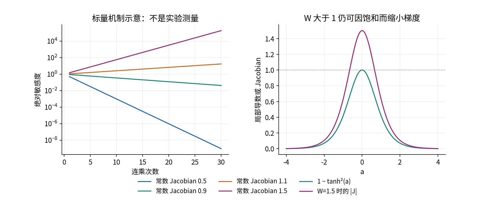

### 7.3 可识别的诊断量与限度

总梯度范数小可能来自长路径衰减，也可能来自损失已经很小、样本抵消或读出 v 很小。应结合每个时间步的输入敏感度、激活饱和程度和训练曲线。总梯度大也不能单凭一个阈值认定数值爆炸，需观察不稳定的跃升和后果。

本实验记录最终 logit 对各时刻输入的 L2 范数，而非只记录损失梯度。这样避免“预测已经正确、交叉熵导数接近零”掩盖状态传递能力。但它仍只是一个固定样本附近的局部敏感度，不是所有序列的记忆容量，也不是因果解释的充分证据。

## 8 截断与裁剪分别改变什么

### 8.1 detach 保留状态值而切断梯度边

完整 BPTT 保留从最终损失回到所有先前计算的路径。固定分块截断在若干边界执行 h=h.detach()。新张量数值相同，但当前图不再追溯其来源。PyTorch 官方文档还说明 detach 结果共享底层存储，不应把它当独立可原地改写的副本 [S3]。

本实现边界在零基下标 4、8、12… 之前，即一基时刻 1–4、5–8、9–12… 分块。只有末端损失的长度 9 序列，其最终块只有第 9 步，反向能覆盖 1 步；长度 25 同理只有第 25 步。K=4 是最大块长，不是保证每个损失都拥有 4 步历史。改变分块相位、加入重叠窗口或中间损失都会改变实验问题。

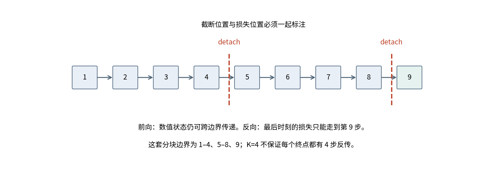

因此被截断的早期输入梯度为精确零，但这不意味着模型完全不能保存早期信息。早期状态的数值仍影响末端；后面时刻学到的共享 W 在下一次前向也会作用于早期时刻。某些任务可在不完整信用分配下被解决。不能把“截断一定学不会长度超过 K 的任务”当定理，也不能把偶然成功当成梯度完整。

本教程保留所有时间步的状态数组便于教学检查，所以当前实现并不证明节省显存。若要实现真正流式省内存，应只保留当前窗口计算图、明确何时 backward 和何时更新，并释放旧窗口输出。本实现一次序列末端损失后才更新参数，不等同于每块立即更新的在线 TBPTT；不要混用名称而省略优化器步时机。

### 8.2 全局范数裁剪

把所有参数梯度展开串成向量 g，阈值 τ>0。理想的全局 L2 裁剪是

$$g_{clip}=g\min\left(1,\frac{\tau}{\|g\|_2}\right).$$

当 g=0 时保留 0。例如 g=(3,4)，范数是 5，τ=2 时变为 (1.2,1.6)，方向不变，范数为 2。逐元素截到 [−2,2] 则得到 (2,2)，它改变方向，且范数大于 2，不是同一种算法。

本代码调用 torch.nn.utils.clip_grad_norm_，它把所有参数视为一个拼接梯度来计算范数，并原地修改梯度 [S2]。2.7.1 实现分母含 10⁻⁶ 的数值稳定项，所以有限精度下结果可略小于理想阈值。测试用相同稳定项核对生产训练一步。先完成所有梯度累加、再裁剪、最后更新，不能每个时间步先裁剪后相加。

裁剪限制单次更新步长，通常用于抑制过大的梯度 [S1]。它不能恢复已经被 detach 删除的路径，也不能把接近零的长路径梯度放大回来。记录裁剪前范数、后范数、实际触发频率；否则“用了裁剪”可能只是一个没有实际生效的配置标签。

### 8.3 状态 reset 与 detach 的区别

reset 把数值设为初始状态，删除之前样本的内容；detach 保留数值，只切梯度。随机打乱的独立训练样本之间应 reset。只有确实连续的同一条流，且 batch 槽位映射保持同一条序列、文档边界明确，才考虑数值状态跨块携带。训练、验证、测试之间必须独立重置；批次换序不应改变同一独立样本的结果。

## 9 延迟任务的固定实验协议

### 9.1 数据与研究问题

每条独立序列第 1 步给出 ±1 符号，之后出现独立均匀干扰，最终一步要求输出该符号对应的二分类标签。输入维度为 3：第一通道是符号或干扰；第二通道仅首步为 1，表示写入；第三通道仅末步为 1，表示读取。delay=2、8、24 时，T 分别为 3、9、25。所有 split 中正负标签各占一半。预测常数类别准确率为 0.5，恒定 logit=0 的 BCE 为 log(2)≈0.693147。

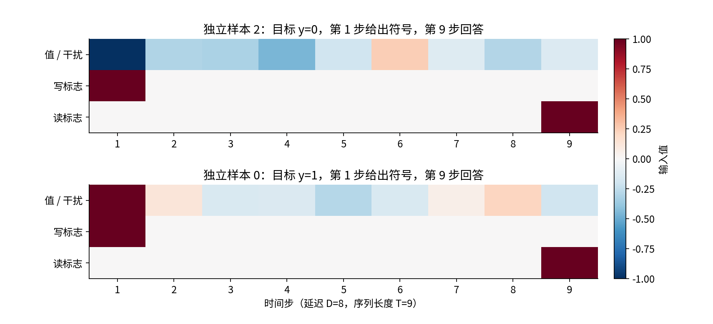

协议在首次训练前写入 protocol.json，运行结果保存其 SHA256。训练 256、验证 128、测试 256 条，生成 seed 分别 5101、5102、5103，按 delay 加偏移后使用独立 RNG。提供原始 NPZ、每个数组的散列和生成器。随机变量层面的独立并不保证有限样本没有偶然相关；我们检查 split 无完全相同的整条序列，不宣称证明了一切无泄漏。

### 9.2 控制变量与全部条件

H=12，float64 CPU，正交 W 初始增益 1.1，U 和 v 用预定尺度高斯初始化。每个条件使用 seeds 7、19、41，同一 seed 的初始参数和数据配对。完整批次 SGD，学习率 0.3、无 momentum，固定 320 步，最终步为唯一汇报 checkpoint。没有根据验证或测试挑选最好 seed。

三个条件是完整 BPTT、不裁剪；完整 BPTT、阈值 0.25 全局裁剪；固定分块 K=4、同样裁剪。delay=2 的序列长度不足 4，代码取 K=T，此时无实际 detach 边界，第三组应与第二组完全相同。这是刻意保留的等价控制，而非三个独立算法在所有长度下都不同。

每一步都对独立序列重置状态。验证只作预定最终读数，不用于调整超参；测试在该次运行训练结束后读一次。完整重现实验会再次计算同一个测试量，不代表重新调参或扩大独立样本数量。所有失败都保留；本次 27 组均完成，但完成不代表学会任务。

### 9.3 资源与公平性

计算成本约随 NT(HD+H²) 增长，读出另需 NTH。完整保存状态需要约 NTH 个浮点数及自动微分中间量。设置 CPU 单线程是为了可复验，不是性能最优基准。当前程序只支持 N≤4096、T≤128、D和H≤64，有限 float64 输入 |x|≤10、参数绝对值≤100；训练步数协议为 320。拒绝超出范围和非有限输入，不承诺任意长序列、GPU、混合精度或极端数值鲁棒性。

本比较固定优化器步数，不是等耗时、等峰值内存比较。实际 wall time 与环境记录在 outputs/environment.json。若研究目标是算力效率，需要独立设计计时、内存、吞吐量协议，不应从这里的准确率直接得出部署推荐。

## 10 完整结果与不符合直觉的结果

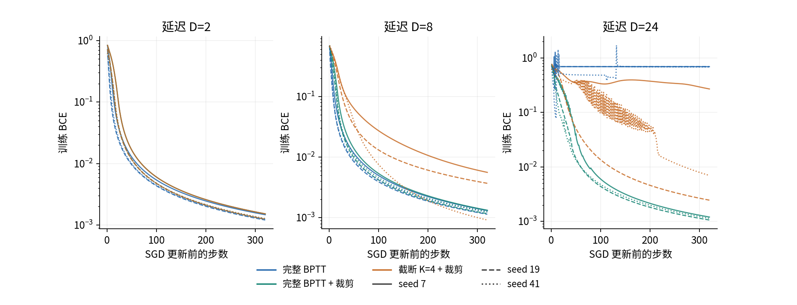

| 延迟 | 条件 | 测试准确率均值 ± SD | 测试 BCE 均值 | 裁剪触发均值 |
|---|---|---|---|---|
| 2 | full | 1.0000 ± 0.0000 | 0.001314 | 0.000% |
| 2 | full_clip | 1.0000 ± 0.0000 | 0.001350 | 5.312% |
| 2 | tbptt4_clip | 1.0000 ± 0.0000 | 0.001350 | 5.312% |
| 8 | full | 1.0000 ± 0.0000 | 0.001234 | 0.000% |
| 8 | full_clip | 1.0000 ± 0.0000 | 0.001254 | 4.688% |
| 8 | tbptt4_clip | 1.0000 ± 0.0000 | 0.004297 | 5.625% |
| 24 | full | 0.5130 ± 0.0283 | 0.695871 | 0.000% |
| 24 | full_clip | 0.9948 ± 0.0090 | 0.020288 | 12.396% |
| 24 | tbptt4_clip | 0.9609 ± 0.0677 | 0.109418 | 13.438% |

SD 为仅 3 个 seed 的样本标准差；它描述本次初始化变动，不是总体置信区间。每个 seed 共享同一份测试样本，不能把 3×256 当独立测试样本。原始每一步损失、裁剪前后范数、全部 split 终点指标、全部训练参数都已保存。

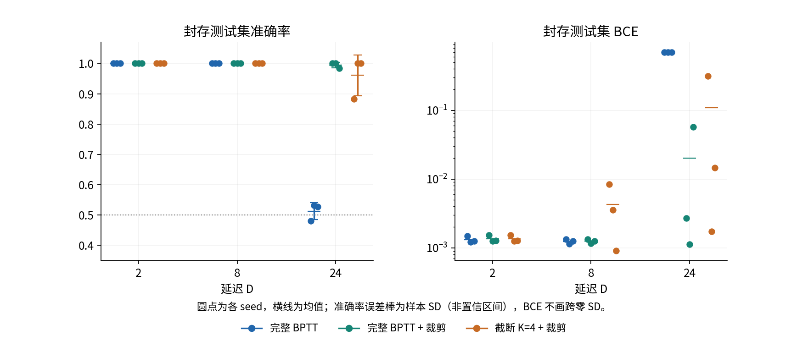

短延迟 2 和 8，所有条件都达到测试准确率 1；这一结果并不能说明梯度方式等价，BCE 和路径结构仍不同。delay=24，不裁剪的三次运行准确率分别 0.480469、0.531250、0.527344，接近常数基线；完整裁剪为 1、1、0.984375。该协议下裁剪改善长延迟训练，但没有覆盖其他阈值、学习率、模型容量或任务，因此不能外推“裁剪总是有效”。

更重要的反例：K=4 的截断组在 delay=24 得到 0.882812、1、1。它没有完整长路径梯度，却不一定失败。首位信息可以通过状态值传到末端，共享参数的末段更新也会改变整个网络的下一次前向。这个结果反驳的是“超过 K 一定不能做对”这种过强说法，不反驳“截断梯度不同于完整梯度”。

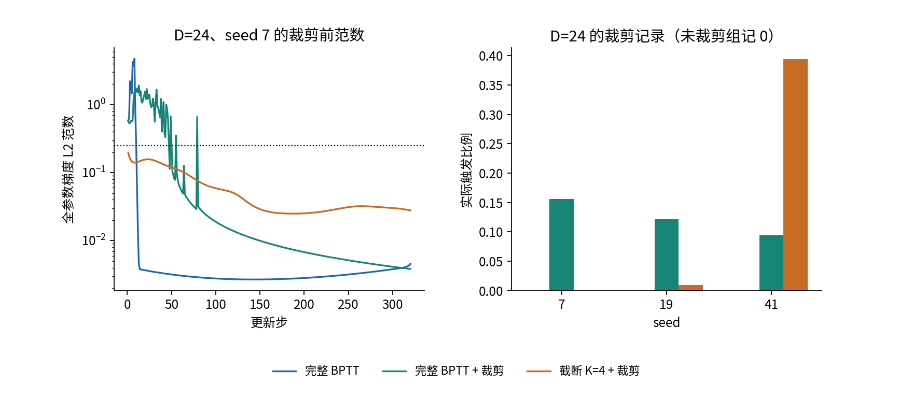

seed 7 的截断长延迟组从未触发 τ=0.25 的裁剪，却取得不完全成功。seed 41 的截断组频繁触发裁剪。单个设置名称不足以解释性能，必须查看实际执行路径与测量值。

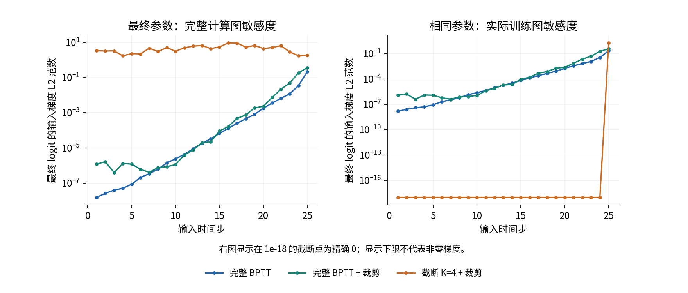

### 10.1 事后反事实检查的身份

在完成预定训练后，我们额外把每个测试样本首位信号翻转，同时翻转标签，保留全部干扰和时序标志；并另做擦除首位信号的检查。这个诊断不是预注册主要结果，未用于调整超参、选择 checkpoint 或剔除运行。它检验模型是否依赖早期信号的行为，比单独的梯度范数多提供一条证据，仍不能证明所有分布上的因果规律。

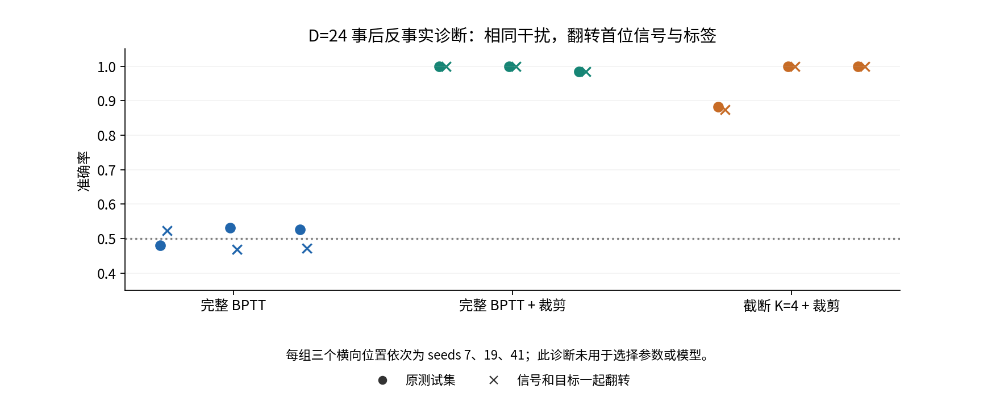

## 11 从教学实现到可审计代码

reference.py 只用 NumPy 显式写出状态、δ、每个样本时刻对每个参数的贡献，以及输入梯度。scalar_fixture_reference 用 Python math 标量循环提供第三条前向计算路线。experiment.py 以 PyTorch 搭建相同计算图并调用 autograd，真实训练入口 step 使用同样的循环与参数结构。没有把一份 autograd 输出改名为“手写参考”。

数值核验分三层：标量手算目标的 NumPy、Python math、PyTorch 前向一致；D=2、H=3 的矩阵情况逐参数及逐输入中心有限差分一致；真实末端损失训练一步的梯度、全局裁剪、同步参数更新和下一次前向与独立 NumPy 参考一致。输入差分包括 PAD 占位，验证其梯度为零。有限差分只能检验选定点的局部导数，不能证明所有输入或训练过程正确。

$$g_j^{FD}=\frac{L(\theta+\epsilon e_j)-L(\theta-\epsilon e_j)}{2\epsilon}.$$

检查采用 ε=10⁻⁴、10⁻⁵、10⁻⁶，设置绝对与相对容差。过大 ε 测的是非局部变化，过小 ε 容易浮点抵消；对接近零梯度只看相对误差会失真。对 detach 后的完整数值函数做通常有限差分，会重新计算边界状态，得到跨边界的数值影响，不能用它要求截断自动微分等于完整梯度。若要检查某一截断块的局部梯度，须把边界状态固定为常量再扰动参数。

公开检查还包含按有效 token 权重汇总逐样本梯度、时间参数解绑定后梯度相加、batch 顺序不变性、padding 无效性、detach 前向值相同而早期梯度为零，以及无效输入拒绝。检查使用显式异常，不用会被 python -O 移除的 assert。正常和 -O 脚本都真实执行，Notebook 在全新实际 IPython 内核中从第一格到最后一格运行；浏览器 Jupyter 界面与 socket 传输未在构建环境测试。

## 12 常见失败与研究边界

| 现象 | 优先检查 | 为什么 |
|---|---|---|
| 梯度比参考多或少 N 倍 | 损失分母及再次 mean | e 已包含归约因子 |
| 短序列预测受 batch 顺序影响 | 是否跨独立序列携带状态 | 参数共享不等于状态共享 |
| padding 改变结果 | 是否只 mask loss 未 freeze state | 零输入仍可通过 W、b 改状态 |
| 只末端损失却在前面手动清零梯度 | 是否误删未来路径 | 无即时损失不代表无总梯度 |
| 截断前后 loss 相同便认定梯度相同 | 检查早期输入梯度 | detach 不改前向值 |
| 执行裁剪后 NaN 仍出现 | 先检查原始 loss、参数、梯度 | 裁剪不能修复非法数值 |
| 两套程序都对却结果不同 | dtype、seed、更新时机、分块相位 | 都属于实验定义 |
| 只有最后一层梯度正常 | 逐时间检查长路径 | 总范数可能掩盖早期消失 |

本实现用一个合并状态偏置 b。PyTorch nn.RNN 的接口中可能分别存输入和循环偏置；复现实装参数时要相加映射，不要直接比较参数个数。官方 v2.7.1 源码记录其更新式与形状 [S4]。我们使用手写循环是为了显露图，不把低效循环当高性能 RNN 实现。

下一讲 DL051 将用门控结构控制保留、遗忘和读出，但本讲不能提前借门控掩盖基础问题。门控也不会给予无限记忆。读研究论文时，先询问任务定义、状态边界、损失归约、截断相位、更新时机、数据独立性和失败 seed，再讨论更复杂的模型名称。

## 13 可靠来源与证据分工

[S1] Pascanu, Mikolov, Bengio. On the difficulty of training recurrent neural networks. ICML 2013, PMLR 28(3):1310–1318。原始研究支持长 Jacobian 连乘的训练困难与梯度范数裁剪动机。https://proceedings.mlr.press/v28/pascanu13.html

[S2] PyTorch 2.7 官方 clip_grad_norm_ 文档。支持全局范数定义、原地修改和非有限值错误选项。https://docs.pytorch.org/docs/2.7/generated/torch.nn.utils.clip_grad_norm_.html

[S3] PyTorch 2.7 官方 Tensor.detach 文档。支持断开计算图、共享存储等语义。https://docs.pytorch.org/docs/2.7/generated/torch.Tensor.detach.html

[S4] PyTorch v2.7.1 官方 rnn.py 源码。用于核对 RNN 更新、形状与双 bias 接口。https://github.com/pytorch/pytorch/blob/v2.7.1/torch/nn/modules/rnn.py

以上来源核验于 2026-10-05。公式按本讲符号独立推导；表格与图来自本包原创代码实际输出。外部论文没有为本教程 27 次 toy 实验背书。更详细的版本边界见 sources.md。
