# 051 门控记忆与编码解码

门控改变信息通过的路径；编码解码把输入序列变成条件生成问题。能在真实前缀下预测，不等于自由生成整条序列成功。

<style>table{break-inside:avoid}.math-display img{display:block;margin:0 auto;vertical-align:baseline!important}</style>

## 1 从050出发：要解决哪两个问题

正式先修050。沿用独立序列h₀=0、批次时间轴、状态冻结mask与loss mask分开的约定。049的PAD0、BOS1、EOS2、UNK3仍保留。本讲不把门控网络当成无需BPTT的新方法：时间展开、共享参数累加、梯度清零和同步更新都继续适用。

050的tanh RNN每步重算一个状态。门控网络增加可学习的保留、写入或暴露比例，使某些梯度路径不必在每一步都穿过同一种非线性。但“多一条路径”不保证任意长度都能记住，也不保证固定小预算里胜过普通RNN。

另一个问题是输入和输出长度、顺序不必对应。我们用一个encoder读完源序列，再以最终状态初始化decoder，逐项生成反序列。原始encoder-decoder与sequence-to-sequence工作见[S1,S2]；本课不是机器翻译复现，不使用注意力、预训练或语言文本。

## 2 GRU的四个量与明确的约定

本讲采用PyTorch GRUCell的reset-after约定，门顺序为r、z、n。[S3] 数学列向量写法是

$$r_t=\sigma(W_{ir}x_t+b_{ir}+W_{hr}h_{t-1}+b_{hr}),$$
$$z_t=\sigma(W_{iz}x_t+b_{iz}+W_{hz}h_{t-1}+b_{hz}),$$
$$q_t=W_{hn}h_{t-1}+b_{hn},\quad n_t=\tanh(W_{in}x_t+b_{in}+r_t\odot q_t),$$
$$h_t=(1-z_t)\odot n_t+z_t\odot h_{t-1}.$$

r是重置门，调制候选状态中的旧状态仿射分支；z在这里是保留旧状态的比例。z接近1偏向保留，接近0偏向采用候选n。某些资料用相反的更新门命名或互换系数，阅读时先看公式，不能只对照字母。

每个门是H维向量，不是一整条序列共用一个开关。sigmoid输出在0至1之间，仍可有连续梯度；不是随机抽签，也不是硬删除。n经过tanh，状态由旧h和n逐坐标混合。当h₀在[-1,1]内时，这个更新让状态仍在该区间内，但有限幅度不等于保留无限信息。

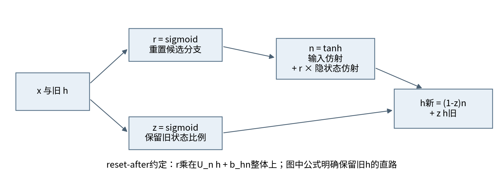

注意$r\odot(Uh+b)$通常不等于$U(r\odot h)+b$。前者先混合隐藏坐标再逐输出坐标重置；后者先重置输入坐标再混合；偏置位置也不同。因此不能把经典论文和某框架的GRU权重仅按名称复制就认定相同。我们的单步前向、输入/状态梯度、全部权重与偏置梯度都与官方GRUCell逐项对照，且另有NumPy参照。

## 3 LSTM为什么分别有c和h

标准无peephole、无projection的LSTM还有独立cell state $c_t$。四条仿射生成输入门i、遗忘门f、候选g和输出门o；i、f、o用sigmoid，g用tanh，然后

$$c_t=f_t\odot c_{t-1}+i_t\odot g_t,\qquad h_t=o_t\odot\tanh(c_t).$$

c保存加性记忆，h是向外暴露并反馈给下一步门控的状态，两者不能混成一个张量。与GRU相比，它显式分开遗忘、写入和输出暴露；二者并不形成对所有任务都成立的优劣顺序。框架的完整状态/shape定义见[S4]。

固定门值的标量演示：旧c=1.2，f=.8，i=.25，g=-.5，o=.6。保留部分.96，写入部分-.125，新c=.835，h=.6×tanh(.835)=.409890985386。这里门值是人为指定的解析例，不是额外训练实验；测试将对应logit/atanh偏置写入LSTMCell，核对状态和直接导数。

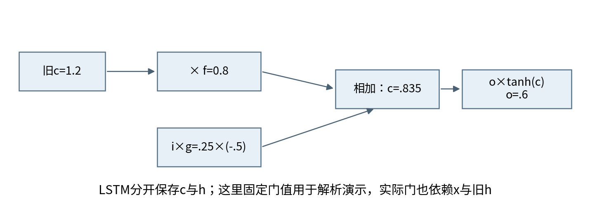

固定各门时，直路上的$\partial c_t/\partial c_{t-1}=f_t$；固定GRU各门与候选时，直路贡献为z。完整循环导数还包含旧状态对门和候选的影响，不能把总Jacobian简单写成diag(f)或diag(z)。门接近1能减少某条路径的衰减，但sigmoid饱和也可能让门参数本身难学。

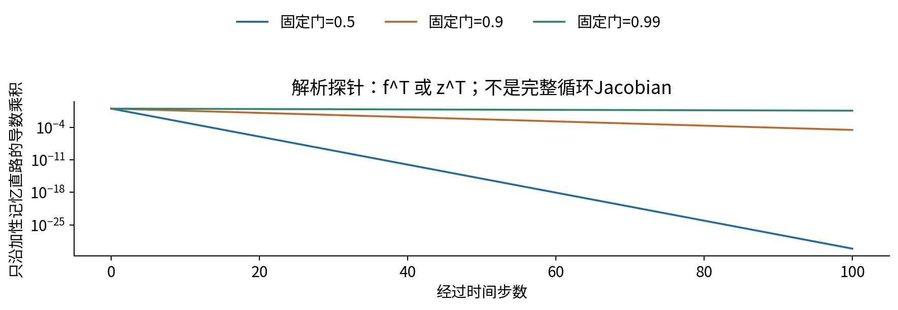

## 4 参数数、shape和实现选择

输入维D、状态维H时，一个GRUCell的输入权重3H×D、循环权重3H×H、两份偏置各3H，总计$3H(D+H+2)$。若数学推导把两份偏置合成一份，参数坐标数会不同；在候选分支中，隐藏偏置还被r乘到，不能总把两个候选偏置合并为一个常数。

无投影LSTMCell对应$4H(D+H+2)$，tanh RNNCell为$H(D+H+2)$。这些公式不含嵌入和输出头，也不含多层、双向、peephole或投影参数。我们的主实验D=8、H=12，encoder和decoder各一个cell，参数互不共享；它们共享V=8的嵌入表E，输出头为12×8加8偏置。

因此RNN总计64+2×264+104=696坐标，GRU为64+2×792+104=1752；其中E[PAD]的8坐标固定。两模型同H、同样本和更新数，但参数量和计算量不同。本实验没有做等参数、等FLOPs或等时间比较，不把“相同hidden size”叫作完全公平。

代码采用批次行向量，仿射写作x@W.T，和上方列向量定义一致。reset-after候选的hidden bias要先加再乘r。实现不调用nn.GRU执行主训练，使用基础矩阵算子显式展开，从而能把每条路径交给NumPy独立复核。

## 5 完整数值实例：两条独立序列

用D=H=1的GRU处理样本1输入[1,-1]、目标0.2，样本2输入[0.5]、目标-0.1。两者各自h₀=0；只在各自最后状态上输出$\hat y=w_oh_T+b_o$，单样本$\ell=\frac12(\hat y-y)^2$，批次L为两者平均。

初始参数按组为：输入权重[.4,-.3,.5]，循环权重[.2,.1,-.4]，输入偏置[.1,-.2,.05]，隐藏偏置[-.05,.1,.02]，输出头[1.2,-.1]。每个三元组顺序都是r、z、n，总共14个参数。输入是实值小例，不在此处额外训练嵌入，以便看清门控链。

样本1第1步：r=σ(.45)=.610639234，z=σ(-.4)=.401312340，q=.02，n=tanh(.55+r×.02)=.509617382，h₁=.305101638。第2步读x=-1，r=.428253678，z=.557373720，q=-.102040655，n=-.457147571，h₂=-.032289894。最后预测-.138747873，残差-.338747873。

样本2从新的h₀=0开始，只读x=.5：r=.562176501，z=.437823499，q=.02，n=.301567960，h₁=.169534421；预测.103441305，残差.203441305。不要把样本1最终h当作样本2初值。平均损失L=.0390346214。

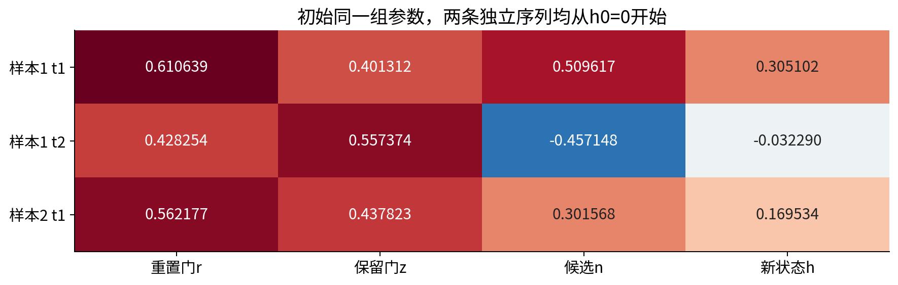

## 6 GRU局部导数：每条路都要算

某时间步已从后续收到$d=\partial L/\partial h_t$。先按乘加结构拆开：$g_n=d\odot(1-z)$、$g_z=d\odot(h_{t-1}-n)$，旧h直路贡献$d\odot z$。通过tanh得$a_n'=g_n\odot(1-n^2)$；通过候选重置乘法得$g_r=a_n'\odot q$。再通过sigmoid：

$$a_r'=g_r\odot r\odot(1-r),\qquad a_z'=g_z\odot z\odot(1-z).$$

输入侧仿射上游是$[a_r',a_z',a_n']$，隐藏侧是$[a_r',a_z',a_n'\odot r]$。分别乘输入或旧状态的转置得到各权重外积；对批次求和得到对应偏置梯度。对旧状态的完整反传为

$$g_{h_{t-1}}=d\odot z+W_{hr}^{\top}a_r'+W_{hz}^{\top}a_z'+W_{hn}^{\top}(a_n'\odot r).$$

对输入的梯度为$W_{ir}^{\top}a_r'+W_{iz}^{\top}a_z'+W_{in}^{\top}a_n'$。所有时间步复用同一组参数，最终要把各时间外积相加，再跨样本相加。没有学习h₀时，传到h₀的梯度只作诊断，不用于更新某个不存在的初始状态参数。

## 7 从最终loss回到每个时间步

预测上游先包括批次平均：样本1为-.338747873/2=-.169373936，样本2为.203441305/2=.101720652。输出权重梯度各为上游乘最终h，偏置梯度为上游本身。再乘wₒ=1.2，最后隐藏状态的上游分别-.203248724和.122064783。

样本1第2步得到$g_n=-.089963226$、$g_z=-.154926179$、$a_n'=-.071162360$、$g_r=.007261454$、$a_r'=.001777985$、$a_z'=-.038221567$。传回h₁的直路为-.113285497，经门和候选的其他路径合计+.008723657，总上游-.104561840。

样本1第1步收到这个总上游，得到$a_r'=-.000220365$、$a_z'=.012802662$、$a_n'=-.046342075$；输入梯度为-.027099982。第2步输入梯度为-.023403516。样本2独立一步得到$a_r'=.000307083$、$a_z'=-.009060399$、$a_n'=.062381250$，输入梯度为.034031578。

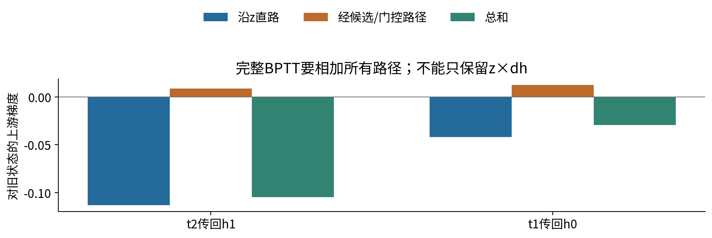

以W_in为例，样本1贡献是第1步(-.046342075)×1加第2步(-.071162360)×(-1)=.024820285；样本2贡献.062381250×.5=.031190625，总计.056010910。W_hn则在样本1第2步得到(a_n' r)h₁=-.009298138，其他位置h₀=0，所以这两个位置的循环权重贡献为零，但循环偏置仍可能有贡献。

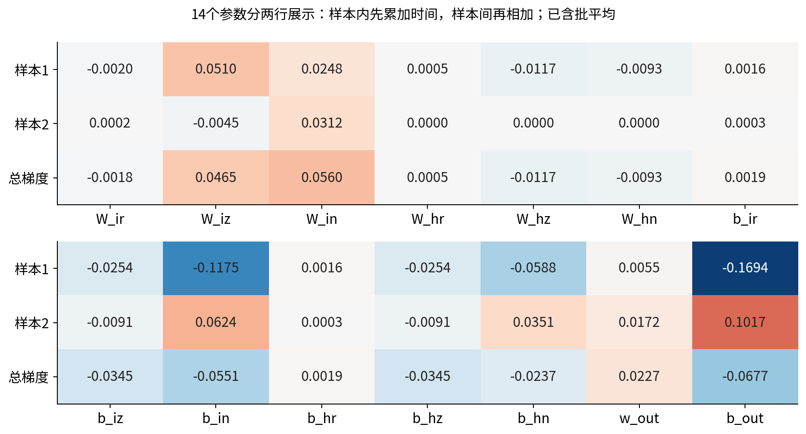

## 8 所有参数同步更新，再做完整下一前向

学习率η=.2。下表给出完整第一组梯度与更新后参数，均由同一组旧参数计算；显示值四舍五入，实际使用float64。

| 参数 | 初值 | 总梯度 | 第一次更新后 |
|---|---:|---:|---:|
| W_ir | 0.400 | -0.001844808 | 0.400368962 |
| W_iz | -0.300 | 0.046494029 | -0.309298806 |
| W_in | 0.500 | 0.056010910 | 0.488797818 |
| W_hr | 0.200 | 0.000542466 | 0.199891507 |
| W_hz | 0.100 | -0.011661463 | 0.102332293 |
| W_hn | -0.400 | -0.009298138 | -0.398140372 |
| b_ir | 0.100 | 0.001864703 | 0.099627059 |
| b_iz | -0.200 | -0.034479305 | -0.193104139 |
| b_in | 0.050 | -0.055123186 | 0.061024637 |
| b_hr | -0.050 | 0.001864703 | -0.050372941 |
| b_hz | 0.100 | -0.034479305 | 0.106895861 |
| b_hn | 0.020 | -0.023704559 | 0.024740912 |
| w_out | 1.200 | 0.022714218 | 1.195457156 |
| b_out | -0.100 | -0.067653284 | -0.086469343 |


更新后必须重置两个h₀并重算全部门。样本1的h₁=.305750839、h₂=-.018914300，预测-.109080579；样本2的h₁=.172960816，预测.120297902。新的平均loss=.0360154925。总loss下降，样本2残差却从.203441305增至.220297902，单样本变差；共享目标没有逐样本单调保证。

第二轮反向的14维总梯度按同样分组为：

```text
g_Wi = [-.001595299, .040595124, .056188990]
g_Wh = [ .000473606,-.010329595,-.008536771]
g_bi = [ .001705772,-.031984986,-.040932764]
g_bh = [ .001705772,-.031984986,-.016318674]
g_head = [.021974474,-.044391338]
```

再同步减去.2倍梯度，得到第二次更新后的参数：

```text
Wi = [ .400688021,-.317417831, .477560020]
Wh = [ .199796786, .104398212,-.396433018]
bi = [ .099285905,-.186707142, .069211190]
bh = [-.050714095, .113292858, .028004647]
head = [1.191062262,-.077591076]
```

第三次完整前向：样本1 h₁=.304707948、h₂=-.008111377，预测-.087252231；样本2 h₁=.174511823，预测.130263371；平均loss=.0338837660。全部三轮的每个门、局部上游、逐时间参数贡献和输入梯度都保留在账本，并用70位Decimal前向、全部参数中心差分和autograd分别复核。

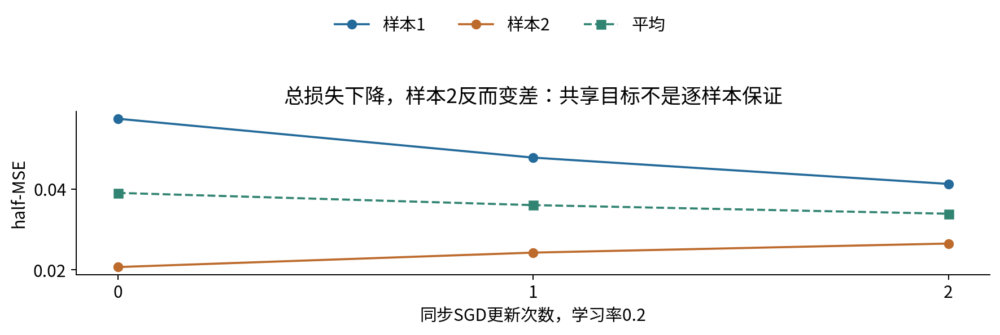

## 9 encoder-decoder：条件生成而非位置一一分类

主实验源内容是四种符号A、B、C、D的短序列，对应ID4..7。encoder依次读取BOS、内容、EOS，在每个独立样本从全零状态开始；只把最后有效状态h传给decoder，不传整个状态列表，也不使用注意力。decoder初始h等于encoder最后h，输入BOS后预测反序列首符号，继续预测其余符号和EOS。

例如输入A B C，目标C B A EOS，teacher forcing输入BOS C B A。输入右移一位，当前目标不能直接作为当前输入，否则发生标签泄漏。训练时每一步都把真实前一个目标喂回去，称为teacher forcing；它是计算条件序列似然的常用方式，不意味着模型推理时会得到真实前缀。

条件序列概率按链式法则分解为$p_\theta(y\mid x)=\prod_{t=1}^{T_y}p_\theta(y_t\mid y_{<t},c(x))$，其中c(x)为encoder终态，y包含末尾EOS。teacher forcing用真实前缀计算这条金标路径的概率；它没有声称推理时也能取得这些真实前缀。

主训练目标是$L=-\sum_{bt}m_{bt}\log p_{bt,y_{bt}}/M$，$M=\sum_{bt}m_{bt}$，包含EOS，不包含PAD。它是token平均，不是先对各序列平均再平均。每步输出logit为$z_{bt}=h_{bt}W_o+b_o$，其上游$g_{z,bt}=m_{bt}(p_{bt}-\operatorname{onehot}(y_{bt}))/M$；先累加输出头梯度，再乘$W_o^\top$进入decoder BPTT。decoder初始h的总梯度继续传到encoder最后有效h，两段查表梯度共同累加回E。

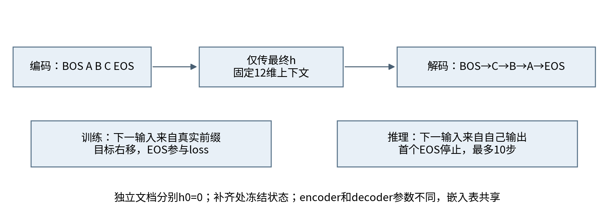

只有固定维h连接两端，输出不同位置的信息需要从这个状态中逐步取出。原文输入与输出位置可能不对齐，下一讲052会让一个位置按内容读取其他位置。不能因为注意力提供更多访问路径，就预先宣布其对本任务一定更好；仍需固定对照。

## 10 mask、EOS与无金标长度的自由生成

批次右补齐时，状态更新采用$h_t=m_t\tilde h_t+(1-m_t)h_{t-1}$。反向也包含无效位置的恒等直路；loss mask只决定哪些目标计分。若只mask loss却让encoder继续处理padding，传给decoder的状态可能已不是原文最终状态。

本实验空内容也有明确语义：encoder读BOS、EOS；decoder读BOS，预测EOS。训练语料没有空内容，但接口及边界测试覆盖它。源内容只接受普通ID4..7，不让调用方偷偷插入PAD或边界控制符。

自由生成从BOS开始，之后输入自己的argmax输出，首个EOS立即终止；最多10个输出，超过则记录未结束，不用真实目标长度帮它停止。没有beam search、长度惩罚或输出类别过滤。若模型输出PAD/BOS/UNK，作为无效控制输出计入错误，而不是静默删除。已结束样本冻结状态，不再给它续写，其他样本继续。

因而评价同时报告：真实前缀下的NLL、token准确率；自由生成在金标位置上的token准确率；整序列exact（含EOS、顺序、长度）；EOS结束率；无效控制符率。自由位置准确率缺失位置算错，额外输出不在其分母内，但会让整序列exact失败，不能仅看前者。

## 11 一个容易被说错的teacher forcing结论

真实前缀下的NLL是合法的gold序列对数似然，不是错误评价。但它不能单独告诉我们greedy解码生成了什么。token准确率也不能直接等同于整条序列成功率；局部错误可能改变后续输入和状态。

更细的事实是：在确定性模型、相同argmax平局规则、相同初始状态、最大步数覆盖金标长度、严格EOS定义下，“teacher-forced所有位置argmax都正确”与“greedy整条序列完全正确”等价。证明用归纳：第一步相同；若此前全部正确，两个过程看到的前缀相同，下一步也相同。因此本次teacher-forced sequence exact与free sequence exact相等，并非漏做自由生成。

这个等价不适用于比较token准确率，也不自动适用于采样、beam、不同截断或输出过滤。自由前缀下错误传播通常值得关注，但也可能偶然让某些后续位置变对；本次RNN种子5113自由位置准确率.832215，反而略高于teacher-forced的.825503。不要把“自由token准确率必然更低”当成定理。

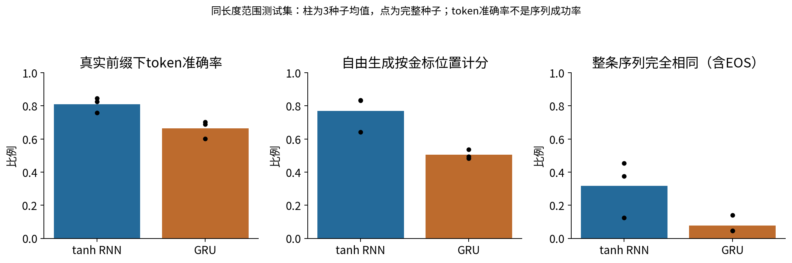

## 12 固定协议：所有模型都保留

从四符号长度2、3、4的全部336种内容序列中固定打乱，取96训练、32验证、64测试；精确源序列不重叠。另从长度5、6中固定取64作长度外推测试。相同符号片段可以重现，这是组合教学任务，不代表自然语言数据独立性。

两架构各用5111、5112、5113三个初始化种子；D=8、H=12，300次全批次SGD，学习率.5，完整全参数梯度L2范数超过1时统一缩放至1。无动量、weight decay、预训练、早停或验证选择。验证集只描述，所有模型都评终点。相同种子不保证不同形状模型的每个随机权重可逐项配对。

每次先用旧参数完整前向、反向，求所有参数的全局范数，再统一clip，最后同步更新并清空梯度。clip不是逐参数限幅，也不是修改隐藏状态。完整1800次更新、1806个参数状态和每次裁剪因子全部保留。NumPy显式BPTT对每次状态转换都能独立复算，不只检查最后loss。

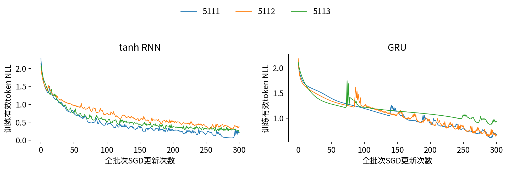

## 13 实测结果与不能推出的结论

同长度范围测试，RNN三个种子平均teacher NLL=.517469、teacher token准确率=.809843、自由位置准确率=.769575、整序列exact=.317708；GRU分别为.816051、.663311、.504474、.078125。固定小预算下GRU没有赢过RNN；不在看到结果后追加GRU训练或只挑最好种子。

预先声明的诊断把训练后encoder上下文置零，再用同一decoder自由生成；RNN各种子exact为0、.015625、0，GRU全0。它说明该干预下性能很低，但不是重新训练的等容量基线，也不能单独解释每个隐藏维的因果含义。已知反转规则的程序当然可以100%正确，那是任务规格的oracle，不是学到该规则的神经对照。

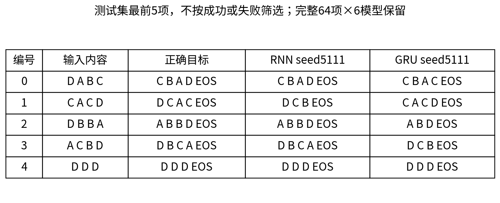

长度5、6外推中，两模型全部六次运行的整序列exact都为0；RNN平均teacher NLL=2.720769，GRU=1.697518。GRU的长序列NLL较好不等于自由生成成功，更不能说明它具有无限记忆。RNN结束率约.994792，仍有未在上限前输出EOS的真实失败；GRU结束率1也没有带来一条完全正确的长输出。

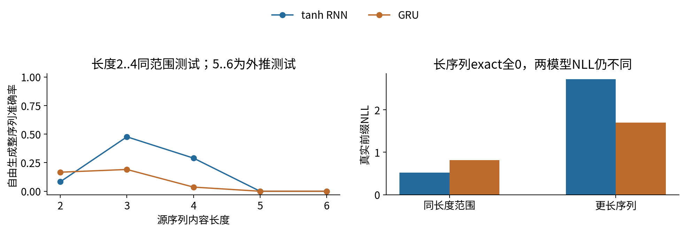

本实验没有分离容量、优化难度、学习率或瓶颈的因果效应，没有等计算预算搜索，也没有测试所有长度。可以提出新协议研究这些因素，但必须和当前结果分开保存。三初始化种子共享同一数据划分，不能当作三个独立真实任务。

## 14 支持域与复现边界

batch接受1至256条普通ID4..7的列表，每条内容长度0至32；补齐额外宽度0至32，不自动截断；布尔值和浮点ID拒绝。greedy步数必须整数1至64。参数键/shape必须完整，D、H范围1至64，实数参数明确CPU/NumPy float64、有限且绝对值不超过1e6，PAD嵌入行必须为零。此上界是教学接口资源与数值契约，不是训练推荐值；超范围明确拒绝。参考反向在溢出时抛错，训练检查loss和梯度有限性。

训练先完成全部计算和序列化，再逐文件原子替换输出。训练或数据SHA检查失败保留旧结果；多文件不是目录事务，结果中的压缩文件SHA用于发现混配。正常与-O及新核Notebook都应核对本固定CPU环境；不承诺任意硬件后端位级相同。

所有门的数学图、NumPy循环、官方cell参照、有限差分和完整结果彼此核对；这些作者检查仍不等于独立审核。读者应先按lab独立实现，再看答案，尤其检查reset位置、两份偏置、padding状态、EOS、自由生成和loss分母。

## 15 原始来源

[S1] [Cho et al. Learning Phrase Representations using RNN Encoder-Decoder, 2014](https://arxiv.org/abs/1406.1078)，门控与encoder-decoder研究背景。本文实现采用明确的PyTorch reset-after约定，不声称权重兼容。

[S2] [Sutskever, Vinyals, Le. Sequence to Sequence Learning with Neural Networks, 2014](https://arxiv.org/abs/1409.3215)，序列条件生成背景。本课不复现其翻译数据、模型规模或成绩。

[S3] [PyTorch 2.7 GRUCell文档](https://docs.pytorch.org/docs/2.7/generated/torch.nn.GRUCell.html)，本课对照的精确r/z/n公式与参数shape。

[S4] [PyTorch 2.7 LSTM文档](https://docs.pytorch.org/docs/2.7/generated/torch.nn.LSTM.html)，标准门、c/h、shape与投影变体的区分。本课LSTM只有给定门值的解析核验，不另训练LSTM主实验。
