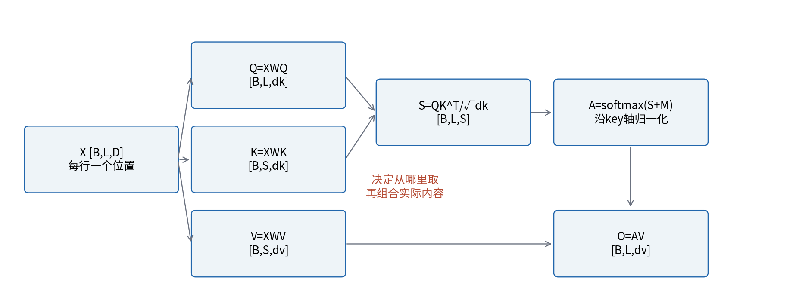
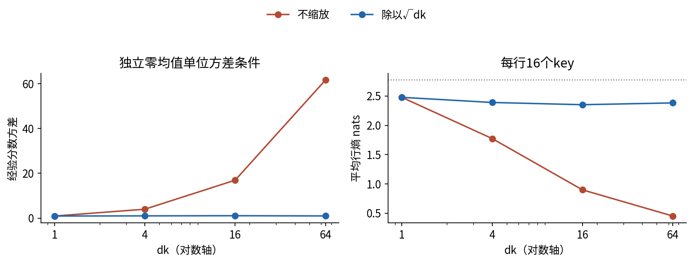
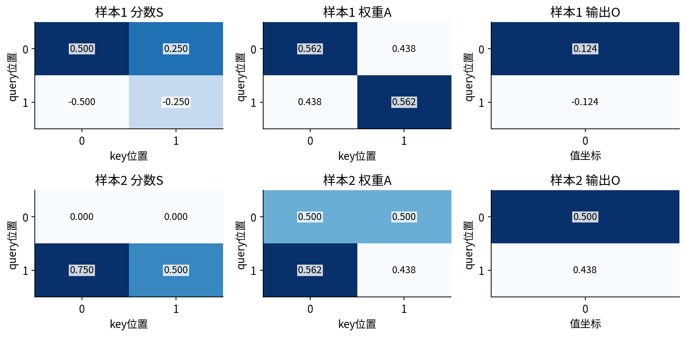
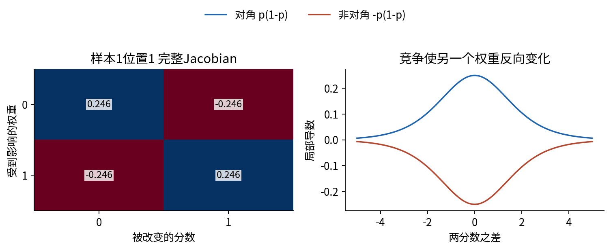
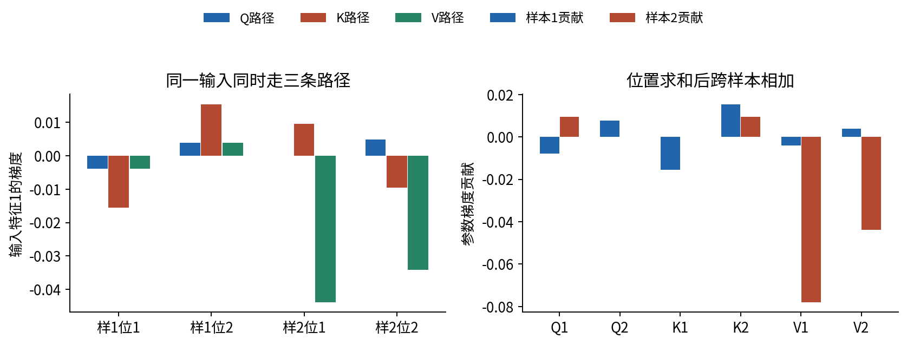
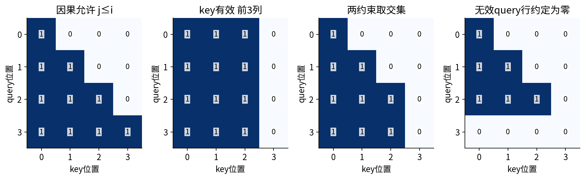
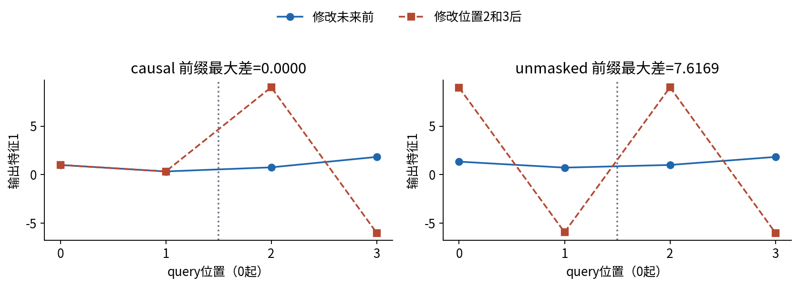
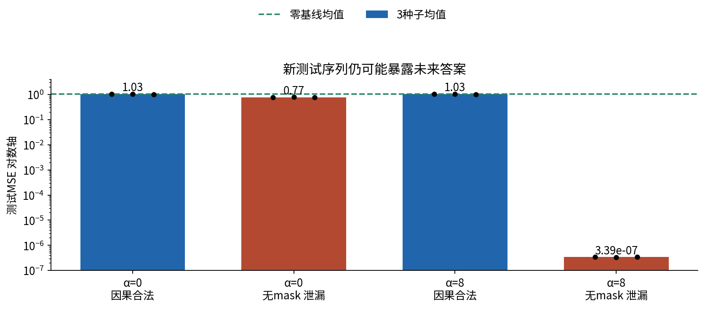
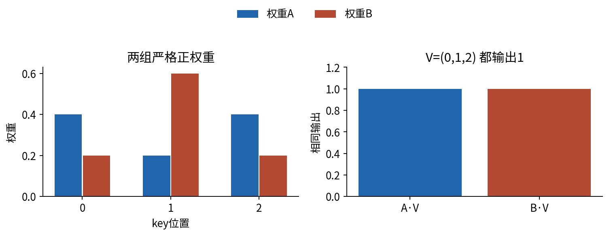

# 注意力的逐项计算

## 第052单元 从加权取值到可验证的信息边界

一个位置怎样根据内容选择其他位置的信息？本讲把选择拆成三个可检查的步骤：计算查询与候选键的匹配分数，把允许候选的分数归一化，再用权重组合它们携带的值。注意力不是硬索引；多个位置可以同时贡献，最后得到向量而不是一个位置编号。

正式先修012、019、049。012提供行存储和向量雅可比积，019提供有限概率分布及支持集，049提供词元、嵌入和补齐。本讲重新说明所有轴，不假设学过RNN、GRU或Transformer。主例是无偏置、单头、自注意力的回归计算器；平方损失让每条导数可手算，不代表注意力只能用于回归。多头、残差与位置编码的完整设计留给后续课程。

学习目标是独立写出前向与反向、解释共享参数如何累加梯度、完成同一参数组的两次更新、区分key与query padding，并通过只修改未来的测试发现信息泄漏。本次证据来自原创合成数据和CPU float64实验，不覆盖自然语言能力、GPU吞吐或长上下文。

## 一 从加权和认识Q K V

三个候选提供值2、4、8。当前查询给出权重0.2、0.3、0.5，输出为0.2×2+0.3×4+0.5×8=5.6。权重非负且和为1，标量输出位于最小值与最大值之间。候选提供向量时，同一权重分别组合所有坐标，输出位于值向量的凸包内；后续投影或残差不一定保留这个性质。

query描述当前用来找信息的特征，key描述候选用于匹配的特征，value是被带走的内容。这些名称是计算角色，不要求每个坐标都能用自然语言解释。内积是对应坐标乘积的和，受方向与长度共同影响；分数大不自动意味着语义相近，训练目标会影响这些表示。

第i个query是行向量$q_i\in\mathbb R^{1\times d_k}$，第j个key是$k_j$，value是$v_j\in\mathbb R^{1\times d_v}$。常用的scaled dot-product形式为：[1]

$$s_{ij}=\frac{\sum_{r=1}^{d_k}q_{ir}k_{jr}}{\sqrt{d_k}},\qquad a_{ij}=\frac{e^{s_{ij}}}{\sum_{u=1}^{S}e^{s_{iu}}},\qquad o_{ic}=\sum_{j=1}^{S}a_{ij}v_{jc}.$$

每次固定query i，只沿key j归一化。不能对整张矩阵做一次softmax。A的每行形式上是离散概率质量，但不是“这个词导致答案的概率”，也没有自动校准保证。V可以有负数，A仍为非负；不要混淆两者。

## 二 先固定形状再写公式

自注意力输入$X\in\mathbb R^{B\times L\times D}$。B是样本数，L是位置数，D是每个位置的特征数。同一X走三个投影：

$$Q=XW_Q,\quad K=XW_K,\quad V=XW_V.$$

$W_Q,W_K$的shape为D×dk，$W_V$为D×dv。最后两轴做矩阵乘法，B轴不混合不同样本。三个投影是同一输入的分支，不是三份独立训练数据；所有样本和位置使用同一参数组。

交叉注意力允许query来自B×L×Dq，key与value来自B×S×Dkv。L与S可以不同，dk和dv也可以不同；必须保证Q、K最后一维相同，K、V位置数相同。

|对象|形状|每个元素描述什么|
|---|---|---|
|Q|B×L×dk|当前query的特征|
|K|B×S×dk|候选匹配特征|
|V|B×S×dv|候选实际内容|
|分数S与权重A|B×L×S|每个query与每个key的关系|
|输出O|B×L×dv|每个query取得的内容|

无mask时，$S=QK^T/\sqrt{d_k}$，$A=\operatorname{softmax}_{\rm key}(S)$，$O=AV$。转置只交换最后两个轴。三维NumPy数组不带轴参数的 `.T` 会翻转B轴，不能用它代替最后两轴交换。代码明确写swapaxes(1,2)或transpose(-1,-2)。

## 三 缩放的动机与隐含前提

暂设所有$q_r,k_r$零均值、单位方差，两组彼此独立，各坐标也独立。那么$E[q_rk_r]=0$，$\operatorname{Var}(q_rk_r)=E[q_r^2]E[k_r^2]=1$。不同坐标的乘积协方差为0，故：

$$\operatorname{Var}\left(\sum_{r=1}^{d_k}q_rk_r\right)=d_k,\qquad \operatorname{Var}\left(\frac{q\cdot k}{\sqrt{d_k}}\right)=1.$$

除以dk会让方差变为1/dk，不是这里保持量级的目标。分数差很大时softmax集中，Jacobian中的$a(1-a)$项变小，分数变化可能难以改变输出。缩放缓和这个初始化量级问题；训练后的特征未必独立或单位方差，所以它不是不饱和的保证，更不是任意模型都提升性能的定理。

固定种子5210，生成256个query，每个对应16个key，比较dk=1、4、16、64。每一维度两种方案复用相同QK。行熵单位为nat，最大值ln16；熵低只表示集中，不表示检索正确。原始统计及每行熵均保留。

稳定softmax先减行最大值m：$e_j=\exp(s_j-m)$，$a_j=e_j/\sum_u e_u$。整行平移同一常数不改变比例。减最大值避免指数溢出，却不能修复内积中已经出现的Inf，也不能为全屏蔽行创造合法分母。

## 四 两份样本的一次完整前向

主例B=2，L=S=2，D=2，dk=dv=1，无mask、无偏置、无dropout。dk=1使手算缩放因子为1；后面的API检验使用dk=2，真实检查sqrt(2)缩放。

$$X_1=\begin{pmatrix}1&0\\0&1\end{pmatrix},\quad X_2=\begin{pmatrix}1&1\\1&0\end{pmatrix},\quad Y_1=\begin{pmatrix}0.25\\-0.25\end{pmatrix},\quad Y_2=\begin{pmatrix}0.5\\0.75\end{pmatrix}.$$

$$W_Q=\begin{pmatrix}0.5\\-0.5\end{pmatrix},\quad W_K=\begin{pmatrix}1\\0.5\end{pmatrix},\quad W_V=\begin{pmatrix}1\\-1\end{pmatrix}.$$

样本1两行是基向量，所以Q₁=(0.5,-0.5)ᵀ、K₁=(1,0.5)ᵀ、V₁=(1,-1)ᵀ。样本2第一行(1,1)同时使用两个参数，故Q₂=(0,0.5)ᵀ、K₂=(1.5,1)ᵀ、V₂=(0,1)ᵀ。这里下标指样本。

样本1第一行分数(0.5,0.25)，第一个权重为$1/(1+e^{-0.25})=0.562176501$。输出为0.562176501×1+0.437823499×(-1)=0.124353002。样本2第一query为0，两个分数都为0，等权输出0.5；这不证明两个词意义相同。

定义四个标量目标的half-MSE：

$$\mathcal L=\frac{1}{2N}\sum_{b=1}^{B}\sum_{i=1}^{L}(o_{bi}-y_{bi})^2,\qquad N=BL=4.$$

误差为(-0.125647,0.125647,0,-0.312177)，总loss=0.016128563。本实现对目标标量元素总数平均；如果dv>1，N还包含输出坐标数。下述每个样本梯度贡献已经包含1/4，合并时只相加，不能再除以batch。

## 五 损失与加权和的每条局部导数

记$G_O=\partial\mathcal L/\partial O$，梯度数组与对象同shape。平方项导数为$\partial[(o-y)^2/(2N)]/\partial o=(o-y)/N$，所以本例GO=(O-Y)/4，shape 2×2×1。对于$o_{ic}=\sum_j a_{ij}v_{jc}$：

$$\frac{\partial o_{ic}}{\partial a_{ij}}=v_{jc},\qquad \frac{\partial o_{ic}}{\partial v_{jc'}}=a_{ij}\mathbf1[c=c'].$$

每个value被所有query复用，必须跨i求和。每个样本的矩阵式是：

$$G_A=G_OV^T\in\mathbb R^{L\times S},\qquad G_V=A^TG_O\in\mathbb R^{S\times d_v}.$$

样本1第一行GO=-0.031411750，故GA=(-0.031411750,+0.031411750)。value1从query1收到0.562176501×(-0.031411750)，从query2收到0.437823499×0.031411750，相加为-0.003906145。只保留当前query的一项会漏掉共享路径。

## 六 softmax的完整Jacobian

固定一行，令$Z=\sum_u e^{s_u}$。分子对$s_k$求导为$\mathbf1[j=k]e^{s_j}$，分母导数为$e^{s_k}$。商法则给出：

$$J_{jk}=\frac{\partial a_j}{\partial s_k}=a_j(\mathbf1[j=k]-a_k),\qquad J=\operatorname{diag}(a)-aa^T.$$

第j行是输出权重j对所有输入分数的偏导，遵循012的布局。对角为$a_j(1-a_j)$，非对角为$-a_ja_k$。增大一个分数时，其他权重通常下降；不能把softmax当成独立sigmoid。J的行和、列和都为0，对应整行平移不改变A。

主例第一行a=(0.562176501,0.437823499)的完整Jacobian：

$$J=\begin{pmatrix}0.246134083&-0.246134083\\-0.246134083&0.246134083\end{pmatrix}.$$

行式VJP为GS=GAJ。第一项=(-0.031411750)×0.246134083+(0.031411750)×(-0.246134083)=-0.015463004，第二项相反。这里漏掉非对角项会少一半，在一般数据上不能靠固定乘2修复。

展开后无需存完整Jacobian：

$$G_{S,ij}=a_{ij}\left(G_{A,ij}-\sum_u a_{iu}G_{A,iu}\right).$$

每行先求一个加权和再逐元素计算。教材保存小Jacobian用于理解，长序列不建议为每行建立S×S的导数矩阵。硬mask是固定离散约束，被排除key的权重及分数梯度均为0；Jacobian在允许支持集上构造，本例不对mask求导。

## 七 从分数回到共享参数与输入

点积局部导数为：

$$\frac{\partial s_{ij}}{\partial q_{ir}}=\frac{k_{jr}}{\sqrt{d_k}},\qquad \frac{\partial s_{ij}}{\partial k_{jr}}=\frac{q_{ir}}{\sqrt{d_k}}.$$

query接触所有key，key也供所有query使用，两个求和轴不同：

$$G_Q=G_SK/\sqrt{d_k},\qquad G_K=G_S^TQ/\sqrt{d_k}.$$

样本1第一query梯度=(-0.015463004)×1+0.015463004×0.5=-0.007731502。第一key梯度跨两个query相加：(-0.015463004)×0.5+(0.015463004)×(-0.5)=-0.015463004。两者即使同shape也不能互换公式。

投影$q_{ir}=\sum_d x_{id}W_{Q,dr}$的局部导数为$\partial q_{ir}/\partial W_{Q,dr}=x_{id}$、$\partial q_{ir}/\partial x_{id}=W_{Q,dr}$。K与V投影完全类同。跨位置、样本累加：

$$G_{W_Q}=\sum_bX_b^TG_{Q,b},\quad G_{W_K}=\sum_bX_b^TG_{K,b},\quad G_{W_V}=\sum_bX_b^TG_{V,b}.$$

单个坐标为$\sum_b\sum_i x_{bid}G_{Q,bir}$。位置的外积$x_{bi}^TG_{Q,bi}$形成D×dk贡献，然后跨位置和样本相加。这里的“时间累加”是位置索引上的参数共享，不要求递归状态。不能先更新样本1，再用新参数计算样本2，把它称为同一批次梯度。

同一X同时产生Q、K、V，故三条输入路径相加：

$$G_{X,b}=G_{Q,b}W_Q^T+G_{K,b}W_K^T+G_{V,b}W_V^T.$$

样本1位置1特征1的三项为-0.003865751、-0.015463004、-0.003906145，总和-0.023234901。如果X来自049的嵌入查表，还要把GX累加到对应词元行，重复词元跨样本也相加。本例X是给定数据，只更新三个W；计算GX是验证路径，不把输入样本当作可训练参数。

交叉注意力中，$G_{X^q}=G_QW_Q^T$，$G_{X^{kv}}=G_KW_K^T+G_VW_V^T$。只有两份输入确实是同一计算节点才继续相加；形状相同不等于是同一变量。稠密注意力核心计算约为$O(BLS(d_k+d_v))$，还要另算投影；L×S分数需要存储。复杂度公式不是实测峰值内存或速度。

## 八 两次同步更新和下一次完整前向

学习率固定0.1，六个参数都从同一旧状态求导，然后一起执行$W^{(t+1)}=W^{(t)}-0.1G_W^{(t)}$。初始聚合梯度为：

$$G_{W_Q}=\begin{pmatrix}0.001873157\\0.007731502\end{pmatrix},\quad G_{W_K}=\begin{pmatrix}-0.015463004\\0.025067664\end{pmatrix},\quad G_{W_V}=\begin{pmatrix}-0.081950271\\-0.039968428\end{pmatrix}.$$

第一步得到WQ=(0.499812684,-0.500773150)ᵀ，WK=(1.001546300,0.497493234)ᵀ，WV=(1.008195027,-0.996003157)ᵀ。必须从头重算Q、K、V、S、A、O，不能复用旧A。下一轮loss=0.015241267，第二次更新后的完整前向loss=0.014489698。正文最后的账本列出三状态全部局部量和梯度。

总loss下降不意味着每项改善。样本2位置1原来恰好输出0.5，第一次更新变成0.510312427，第二次变成0.519726010，反而离目标更远。共享参数优化会折中；本例保留这个无提升项，也不声称所有步长都保证总loss下降。

## 九 mask先定义信息集再写布尔值

对每个query先定义允许key集合$\mathcal A_i$。集合非空时：

$$a_{ij}=\begin{cases}e^{s_{ij}}/\sum_{u\in\mathcal A_i}e^{s_{iu}},&j\in\mathcal A_i,\\0,&j\notin\mathcal A_i.\end{cases}$$

加性mask在允许处加0、禁止处加负无穷，与此定义等价。有限大负数只是近似屏蔽，在极端分数或低精度下可能失效。本课自己函数统一规定allow=True表示允许，调用第三方API时转换。

因果自注意力允许j≤i。当前输入x_i、目标x_{i+1}时，对角线允许，因为x_i已知；允许对角线不等于允许目标。必须同时核对049的输入/目标位移。如果输入已把答案拼到当前位置，下三角mask仍会泄漏。

key padding删除无效候选列；query padding表示某些输出行没有任务含义。key padding不会自动把相应query输出置零：无效query仍能平均有效V。通常既限制key，也在loss中排除无效query。若下一层需确定的无效输出，可显式置零；偏置、残差可能再次带来非零值，mask仍须继续传递。

B×S的key有效性可扩为B×1×S，与1×L×S因果矩阵广播取交集。本教学函数要求传入精确B×L×S bool，避免错误轴广播后还能运行。多头广播与KV缓存不属于本实现的支持范围。

### 全屏蔽行与库实现的不同约定

允许集合为空时分母为0，不存在非负且和为1的权重，本讲不定义该softmax。全负无穷logit减最大值会得到负无穷减负无穷，普通softmax输出NaN。不能静默把NaN换成0来掩盖上游错误。

本课约定：有效query至少有一个key，否则抛ValueError；显式无效query令A、O为零，不计loss，梯度也为零。实现先为无效行临时放一个安全key，避免中间归一化未定义，再将整行A设0。这是声明的无效行约定，不是空集合的数学softmax；其行和为0。输入NaN/Inf一律拒绝，不靠这个约定清洗。

PyTorch 2.7.1+cpu、float64、单头identity投影、无dropout下的本次实测：原始softmax全负无穷为NaN；SDPA全False mask输出零；MHA need_weights=True输出NaN，need_weights=False输出零。它们是当前调用路径的观察，不承诺换版本或设备不变。[2][3] 测试保留四项诊断，不把NaN序列化成合法数值。

|PyTorch 2.7参数|True含义|本课转换|
|---|---|---|
|SDPA attn_mask|允许参与|allow|
|MHA attn_mask|禁止参与|~allow|
|MHA key_padding_mask|忽略该key|~key_valid|

官方2.7文档明确上述bool语义。[2][3] MHA包含额外投影，不能直接拿随机初始化MHA与已投影QKV的SDPA比较；本课先设为单头identity投影。SDPA显式dropout_p=0.0，不假定外层eval会自动关闭传入的非零dropout。因果验证用方形显式下三角mask，不把非方形缓存对齐或is_causal提示当成已验证功能。

## 十 修改未来来检测信息泄漏

固定四位置X，Q=K=V=X。保留位置0、1，只替换位置2、3。预测时点1可用信息没变，严格因果前缀应不变。本次最大绝对差为0；去掉mask后前缀最大差7.616883398，证明输出依赖未来。

通过一个样例不是整个系统绝无泄漏的证明，还需覆盖长度、padding、位置编码、缓存和预处理；失败却是直接反证。先关闭dropout、固定参数与前处理，避免把其他随机变化误当成泄漏。单纯看训练loss或测试loss，不能替代信息边界检查。

## 十一 固定协议的未来预测实验

运行前保存data/protocol.json。每个种子生成128条训练、512条测试序列，每条4个独立标准正态值。位置t=0、1、2预测x[t+1]，合法信息只有x[0]至x[t]。未来独立，所以条件均值为0，零基线总体最优MSE为1。这是可解析的诊断任务，不是自然语言基准。

固定K为四维单位矩阵，query t在坐标t+1放2α。dk=4，除以sqrt(4)=2后，未来目标位置分数为α，其余为0。预先取α∈{0,8}与{因果,无mask}，不根据测试选择。V为序列标量值，注意力输出后只拟合一个系数和截距，用训练384个目标一次最小二乘解出。每配置2个可训练标量。

QK是人为固定的未来选择器，不是训练发现推理能力。α=8无mask可读取目标；因果mask将它排除，剩余分数全0，所以α=0与8的因果模型完全相同。这是预先可推导且实测确认的无提升结果。

|α|约束|三个种子的测试MSE|均值|
|---:|---|---|---:|
|0|合法因果|1.024268、1.050165、1.005111|1.026515|
|8|合法因果|1.024268、1.050165、1.005111|1.026515|
|0|无mask 有泄漏|0.754636、0.799733、0.755939|0.770103|
|8|无mask 有泄漏|3.39285e-7、3.38849e-7、3.39063e-7|3.39065e-7|

零基线三份测试MSE为1.012838、1.043264、0.995612，均值1.017238。合法模型全部没超过零基线：最小二乘拟合了有限样本中的偶然相关。α=0的全序列平均也含未来目标，因此无mask即使分数均匀也不是合法基线。

保留原始值、拟合系数、全部测试预测和逐序列MSE，支持独立重算。三个种子只有描述性均值，没有显著性推断。同条序列三个目标存在共享结构，未来若做bootstrap，应按序列分组，不假设所有目标独立。不得删掉负面结果再宣称注意力优于基线。

## 十二 权重不能直接成为因果解释

A描述本次如何组合当前V，不是输入对最终输出的全部影响。词元还改变Q、K、V，多层、残差也带来其他通路。只读A会遗漏路径；梯度是某点局部敏感度，也不自动具备因果识别的干预假设。已有研究对“注意力即解释”的主张提出实证质疑，但不能把特定模型结果扩大成所有注意力都毫无解释用途。[4]

本课代数反例：V=(0,1,2)ᵀ，A=(0.4,0.2,0.4)，B=(0.2,0.6,0.2)，都合法且输出1。任一严格正权重行取s=ln a即可由softmax实现。这证明仅凭输出不能唯一倒推权重；不证明真实受约束模型随时能自由替换成任意A。

研究解释时先说清解释哪个输出、对谁、在何种干预下。遮盖或替换可能制造分布外输入，也要报告。我们的泄漏实验只验证信息可用性，不是词语语义因果实验。

## 十三 支持域与复现边界

教学函数要求NumPy float64、有限值、非空三维QKV、各轴≤512、输入绝对值≤10000，以及精确B×L×S bool mask。这些是控制教学资源和数值风险的人为边界，不是注意力理论限制。float32混入、空轴、NaN/Inf、错误shape、有效query空支持集都会明确拒绝。

脚本普通与-O模式、独立标量参照、完整Jacobian、14坐标中心差分、两次SGD及mask/未来注入均有真实测试；Notebook在新Python进程的真实IPython进程内核中顺序执行，PNG由当前数值绘制。浏览器UI、socket传输、GPU、半精度、dropout、长上下文与跨平台安装未测。完整Notebook和绘图依赖系统Noto CJK字体，Python环境文件不能保证字体；安装与检查见lab。

实验只有12个两参数最小二乘拟合，另有六参数手算与随机缩放诊断。runtime.json记录实际版本、线程和含写盘耗时，未测峰值内存，不把耗时当速度基准。后续研究先冻结新协议，再改变任务或学习QK，重新检验信息边界。

## 十四 完整逐项数值账本

下面9位小数用于阅读，JSON保留float64精度。t=0、1后更新；t=2为第二次更新后的完整前向，额外计算反向用于复核，不执行第三次更新。所有梯度已含总loss的1/4因子。每个位置的参数贡献是输入行与对应GQ/GK/GV的外积，先跨位置求和再跨样本相加。
<!-- generated-ledger -->

### 状态 0

总loss=0.016128563004。两份样本自身的half-MSE为0.007893584082、0.024363541926，两者平均为总loss。

|参数|第1行|第2行|
|---|---:|---:|
|WQ|0.500000000|-0.500000000|
|WK|1.000000000|0.500000000|
|WV|1.000000000|-1.000000000|

|样本 位置|Q|K|V|O|目标|GO|
|---|---:|---:|---:|---:|---:|---:|
|1 1|0.500000000|1.000000000|1.000000000|0.124353002|0.250000000|-0.031411750|
|1 2|-0.500000000|0.500000000|-1.000000000|-0.124353002|-0.250000000|0.031411750|
|2 1|0.000000000|1.500000000|0.000000000|0.500000000|0.500000000|0.000000000|
|2 2|0.500000000|1.000000000|1.000000000|0.437823499|0.750000000|-0.078044125|

样本1的分数与权重：

$$S_1=\begin{pmatrix}0.500000000&0.250000000\\-0.500000000&-0.250000000\end{pmatrix},\quad A_1=\begin{pmatrix}0.562176501&0.437823499\\0.437823499&0.562176501\end{pmatrix}.$$

该样本两个位置的完整Jacobian：

$$J_1=\begin{pmatrix}0.246134083&-0.246134083\\-0.246134083&0.246134083\end{pmatrix},\quad J_2=\begin{pmatrix}0.246134083&-0.246134083\\-0.246134083&0.246134083\end{pmatrix}.$$

样本2的分数与权重：

$$S_2=\begin{pmatrix}0.000000000&0.000000000\\0.750000000&0.500000000\end{pmatrix},\quad A_2=\begin{pmatrix}0.500000000&0.500000000\\0.562176501&0.437823499\end{pmatrix}.$$

该样本两个位置的完整Jacobian：

$$J_1=\begin{pmatrix}0.250000000&-0.250000000\\-0.250000000&0.250000000\end{pmatrix},\quad J_2=\begin{pmatrix}0.246134083&-0.246134083\\-0.246134083&0.246134083\end{pmatrix}.$$

局部反向。GA和GS每格为一整行两项。

|样本 位置|GA|GS|GQ|GK|GV|
|---|---|---|---:|---:|---:|
|1 1|-0.031411750, 0.031411750|-0.015463004, 0.015463004|-0.007731502|-0.015463004|-0.003906145|
|1 2|0.031411750, -0.031411750|0.015463004, -0.015463004|0.007731502|0.015463004|0.003906145|
|2 1|0.000000000, 0.000000000|0.000000000, 0.000000000|0.000000000|0.009604660|-0.043874573|
|2 2|0.000000000, -0.078044125|0.019209319, -0.019209319|0.009604660|-0.009604660|-0.034169552|

位置已求和的样本贡献与总梯度：

|参数坐标|样本1|样本2|总梯度|
|---|---:|---:|---:|
|WQ[1]|-0.007731502|0.009604660|0.001873157|
|WQ[2]|0.007731502|0.000000000|0.007731502|
|WK[1]|-0.015463004|-0.000000000|-0.015463004|
|WK[2]|0.015463004|0.009604660|0.025067664|
|WV[1]|-0.003906145|-0.078044125|-0.081950271|
|WV[2]|0.003906145|-0.043874573|-0.039968428|

输入两特征的三条路径及总和：

|样本 位置|Q路径|K路径|V路径|GX合计|
|---|---|---|---|---|
|1 1|-0.003865751, 0.003865751|-0.015463004, -0.007731502|-0.003906145, 0.003906145|-0.023234901, 0.000040394|
|1 2|0.003865751, -0.003865751|0.015463004, 0.007731502|0.003906145, -0.003906145|0.023234901, -0.000040394|
|2 1|0.000000000, 0.000000000|0.009604660, 0.004802330|-0.043874573, 0.043874573|-0.034269914, 0.048676903|
|2 2|0.004802330, -0.004802330|-0.009604660, -0.004802330|-0.034169552, 0.034169552|-0.038971882, 0.024564892|

全部梯度完成后，六个坐标同步减去0.1倍总梯度，进入状态1；本状态反向不能混用更新后的参数。

### 状态 1

总loss=0.015241267063。两份样本自身的half-MSE为0.007744794095、0.022737740032，两者平均为总loss。

|参数|第1行|第2行|
|---|---:|---:|
|WQ|0.499812684|-0.500773150|
|WK|1.001546300|0.497493234|
|WV|1.008195027|-0.996003157|

|样本 位置|Q|K|V|O|目标|GO|
|---|---:|---:|---:|---:|---:|---:|
|1 1|0.499812684|1.001546300|1.008195027|0.131662966|0.250000000|-0.029584258|
|1 2|-0.500773150|0.497493234|-0.996003157|-0.119709851|-0.250000000|0.032572537|
|2 1|-0.000960466|1.499039534|0.012191870|0.510312427|0.500000000|0.002578107|
|2 2|0.499812684|1.001546300|1.008195027|0.448595597|0.750000000|-0.075351101|

样本1的分数与权重：

$$S_1=\begin{pmatrix}0.500585545&0.248653428\\-0.501547496&-0.249131254\end{pmatrix},\quad A_1=\begin{pmatrix}0.562652003&0.437347997\\0.437228869&0.562771131\end{pmatrix}.$$

该样本两个位置的完整Jacobian：

$$J_1=\begin{pmatrix}0.246074726&-0.246074726\\-0.246074726&0.246074726\end{pmatrix},\quad J_2=\begin{pmatrix}0.246059785&-0.246059785\\-0.246059785&0.246059785\end{pmatrix}.$$

样本2的分数与权重：

$$S_2=\begin{pmatrix}-0.001439776&-0.000961951\\0.749238973&0.500585545\end{pmatrix},\quad A_2=\begin{pmatrix}0.499880544&0.500119456\\0.561845036&0.438154964\end{pmatrix}.$$

该样本两个位置的完整Jacobian：

$$J_1=\begin{pmatrix}0.249999986&-0.249999986\\-0.249999986&0.249999986\end{pmatrix},\quad J_2=\begin{pmatrix}0.246175192&-0.246175192\\-0.246175192&0.246175192\end{pmatrix}.$$

局部反向。GA和GS每格为一整行两项。

|样本 位置|GA|GS|GQ|GK|GV|
|---|---|---|---:|---:|---:|
|1 1|-0.029826702, 0.029466015|-0.014590439, 0.014590439|-0.007354356|-0.015336521|-0.002403989|
|1 2|0.032839470, -0.032442350|0.016063231, -0.016063231|0.008096721|0.015336521|0.005392267|
|2 1|0.000031432, 0.002599234|-0.000641951, 0.000641951|-0.000319366|0.009234872|-0.041046896|
|2 2|-0.000918671, -0.075968605|0.018475432, -0.018475432|0.009191402|-0.009234872|-0.031726097|

位置已求和的样本贡献与总梯度：

|参数坐标|样本1|样本2|总梯度|
|---|---:|---:|---:|
|WQ[1]|-0.007354356|0.008872036|0.001517681|
|WQ[2]|0.008096721|-0.000319366|0.007777355|
|WK[1]|-0.015336521|-0.000000000|-0.015336521|
|WK[2]|0.015336521|0.009234872|0.024571393|
|WV[1]|-0.002403989|-0.072772994|-0.075176983|
|WV[2]|0.005392267|-0.041046896|-0.035654629|

输入两特征的三条路径及总和：

|样本 位置|Q路径|K路径|V路径|GX合计|
|---|---|---|---|---|
|1 1|-0.003675800, 0.003682864|-0.015360236, -0.007629815|-0.002423689, 0.002394380|-0.021459726, -0.001552571|
|1 2|0.004046844, -0.004054620|0.015360236, 0.007629815|0.005436457, -0.005370715|0.024843537, -0.001795520|
|2 1|-0.000159623, 0.000159930|0.009249152, 0.004594286|-0.041383277, 0.040882838|-0.032293748, 0.045637055|
|2 2|0.004593979, -0.004602808|-0.009249152, -0.004594286|-0.031986094, 0.031599293|-0.036641266, 0.022402199|

全部梯度完成后，六个坐标同步减去0.1倍总梯度，进入状态2；本状态反向不能混用更新后的参数。

### 状态 2

总loss=0.014489698297。两份样本自身的half-MSE为0.007629574296、0.021349822298，两者平均为总loss。

|参数|第1行|第2行|
|---|---:|---:|
|WQ|0.499660916|-0.501550886|
|WK|1.003079953|0.495036094|
|WV|1.015712725|-0.992437694|

|样本 位置|Q|K|V|O|目标|GO|
|---|---:|---:|---:|---:|---:|---:|
|1 1|0.499660916|1.003079953|1.015712725|0.138399612|0.250000000|-0.027900097|
|1 2|-0.501550886|0.495036094|-0.992437694|-0.115598919|-0.250000000|0.033600270|
|2 1|-0.001889969|1.498116047|0.023275031|0.519726010|0.500000000|0.004931503|
|2 2|0.499660916|1.003079953|1.015712725|0.458434958|0.750000000|-0.072891261|

样本1的分数与权重：

$$S_1=\begin{pmatrix}0.501199848&0.247350188\\-0.503095639&-0.248285792\end{pmatrix},\quad A_1=\begin{pmatrix}0.563123805&0.436876195\\0.436639988&0.563360012\end{pmatrix}.$$

该样本两个位置的完整Jacobian：

$$J_1=\begin{pmatrix}0.246015385&-0.246015385\\-0.246015385&0.246015385\end{pmatrix},\quad J_2=\begin{pmatrix}0.245985509&-0.245985509\\-0.245985509&0.245985509\end{pmatrix}.$$

样本2的分数与权重：

$$S_2=\begin{pmatrix}-0.002831394&-0.001895790\\0.748550037&0.501199848\end{pmatrix},\quad A_2=\begin{pmatrix}0.499766099&0.500233901\\0.561524185&0.438475815\end{pmatrix}.$$

该样本两个位置的完整Jacobian：

$$J_1=\begin{pmatrix}0.249999945&-0.249999945\\-0.249999945&0.249999945\end{pmatrix},\quad J_2=\begin{pmatrix}0.246214775&-0.246214775\\-0.246214775&0.246214775\end{pmatrix}.$$

局部反向。GA和GS每格为一整行两项。

|样本 位置|GA|GS|GQ|GK|GV|
|---|---|---|---:|---:|---:|
|1 1|-0.028338484, 0.027689108|-0.013783650, 0.013783650|-0.007002698|-0.015211754|-0.001039987|
|1 2|0.034128222, -0.033346175|0.016597724, -0.016597724|0.008432372|0.015211754|0.006740160|
|2 1|0.000114781, 0.005008990|-0.001223552, 0.001223552|-0.000605702|0.008901866|-0.038465608|
|2 2|-0.001696546, -0.074036581|0.017811185, -0.017811185|0.008817180|-0.008901866|-0.029494150|

位置已求和的样本贡献与总梯度：

|参数坐标|样本1|样本2|总梯度|
|---|---:|---:|---:|
|WQ[1]|-0.007002698|0.008211477|0.001208779|
|WQ[2]|0.008432372|-0.000605702|0.007826669|
|WK[1]|-0.015211754|0.000000000|-0.015211754|
|WK[2]|0.015211754|0.008901866|0.024113620|
|WV[1]|-0.001039987|-0.067959758|-0.068999745|
|WV[2]|0.006740160|-0.038465608|-0.031725447|

输入两特征的三条路径及总和：

|样本 位置|Q路径|K路径|V路径|GX合计|
|---|---|---|---|---|
|1 1|-0.003498975, 0.003512210|-0.015258606, -0.007530367|-0.001056328, 0.001032123|-0.019813909, -0.002986035|
|1 2|0.004213327, -0.004229263|0.015258606, 0.007530367|0.006846067, -0.006689189|0.026317999, -0.003388085|
|2 1|-0.000302646, 0.000303791|0.008929283, 0.004406745|-0.039070007, 0.038174719|-0.030443370, 0.042885255|
|2 2|0.004405600, -0.004422264|-0.008929283, -0.004406745|-0.029957584, 0.029271106|-0.034481267, 0.020442097|

## 一手来源

[1] Vaswani等，Attention Is All You Need，2017。结构与缩放动机。https://arxiv.org/abs/1706.03762

[2] PyTorch 2.7 SDPA官方文档。https://docs.pytorch.org/docs/2.7/generated/torch.nn.functional.scaled_dot_product_attention.html

[3] PyTorch 2.7 MultiheadAttention官方文档。https://docs.pytorch.org/docs/2.7/generated/torch.nn.MultiheadAttention.html

[4] Jain与Wallace，Attention is not Explanation，NAACL 2019。https://aclanthology.org/N19-1357/

2026-10-05核对。全文推导、数值样本、图与数据为原创；全屏蔽行行为来自真实运行。
