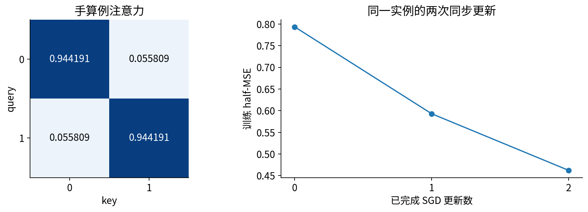

# Transformer块与位置习题解答

## 第053单元 逐步解题与验收解释

本答案可独立阅读。设残差流X的shape为B×L×D，头数H，单头宽度d=D/H，FFN宽度F。本单元自定义allow=True是允许，官方TransformerEncoderLayer的布尔src_mask=True是禁止。默认CPU float64、dropout=0；所有“相等”都允许浮点舍入。

## 一 元素顺序与归一化

练习1：原张量三行分别是0至7、8至15、16至23。头1取得每行后四维，所以三行是4至7、12至15、20至23。头1位置2为[20,21,22,23]。拆头后内存逻辑顺序是头优先；直接reshape会把头0的不同位置误拼为一个位置的特征。先transpose(1,2)，再contiguous().reshape(B,L,D)，即可逐元素恢复。测试故意同时断言正确合头相等、错误合头不等，避免只有单向证据。

练习2：均值2.5，方差(2.25+0.25+0.25+2.25)/4=1.25；LN输出约(-1.341635,-0.447212,0.447212,1.341635)。D-1分母得到5/3，不符合本实现和官方LayerNorm，不能把样本方差估计公式直接搬来。[1]

D=4、F=7时：QKV三个4×4权重加3×4偏置，共60；输出投影16+4=20；第一FFN28+7=35；第二FFN28+4=32；两次LN各4个gamma和4个beta，共16。总数163。固定D，仅改变合法H，不改变这些矩阵参数数目；会改变每头d及注意力分解。实际其他架构如多查询注意力不一定沿用这个计数。

## 二 手算例的完整前向

练习3：输入两行为(1,3)、(2,0)，均值分别2、1，方差都1。取a=1/sqrt(1.00001)，标准化两行为(-a,a)、(a,-a)。Q=K=V，分数对角为sqrt(2)a²≈1.414199420，非对角相反。每行softmax分别为(0.944191290,0.055808710)及其反序。

乘V得到两行(-0.888378139,0.888378139)、(0.888378139,-0.888378139)。加X得到(0.111621861,3.888378139)、(2.888378139,-0.888378139)。第二LN两行约(-0.999998598,0.999998598)及其反号。ReLU后乘0.2I，加回H，最终为(0.111621861,4.088377859)、(3.088377859,-0.888378139)。

## 三 梯度与更新不能省略哪条路径

目标两行为(0,2)、(2,0)，误差为(0.111621861,2.088377859)、(1.088377859,-0.888378139)。四个平方之和除8得到0.793445450。对Y求导后除4，得到(0.027905465,0.522094465)、(0.272094465,-0.222094535)。

设隐藏矩阵U，PyTorch权重以输出坐标为行，因此fc2.weight梯度为GY转置乘U。第一行第一列来自第二位置0.272094465×0.999998598≈0.272094083；第一行第二列来自第一位置0.027905465×0.999998598≈0.027905426。第二行为(-0.222094223,0.522093733)。fc2.bias梯度是两个位置相加，约(0.300000,0.300000)；这是原loss归约的结果，不能再除2。

残差有两条通向H的路径。用g表示Y的梯度，H得到直接的g加上FFN→LN回传的梯度；随后H=X+Attn(LN(X))又让X得到直接路径和注意力路径。LN的均值、方差均依赖所有特征，不能把它当常数缩放。ReLU负激活坐标回传0。

同步SGD学习率0.05，第一步fc2.weight变为约[[0.186395296,-0.001395271],[0.011104711,0.173895313]]。其余所有参数也在同一时刻更新，不能只更新fc2然后声称复现整个账本。随包hand数组含每一步所有参数和梯度，可逐项检查new=old-0.05grad。

第二次前向Y约为(0.140481847,3.816973773)、(2.921902811,-0.756550013)，loss=0.592925194；第二次更新后Y约为(0.148965094,3.612959565)、(2.789286500,-0.671756469)，loss=0.462257387。第一个标量目标0，其绝对误差三次逐步增大。多个误差共享参数，总体改进可以伴随部分误差恶化；不能修改目标或删掉这条记录。

## 反向详解一 从FFN沿归一化返回残差

下面继续同一个实例的完整反向。记F1、F2、Wo分别为PyTorch保存的fc1、fc2、proj权重，形状都是输出×输入。令Z1=LN1(X)，M=AV，H=X+proj(M)，Z2=LN2(H)，R=fc1(Z2)，U=ReLU(R)。每行是一个位置，每列是一个特征。没有省略任何参数支路。

$$G_U=G_YF_2,\quad G_R=G_U\odot\mathbf1[R>0],\quad G_{Z2}=G_RF_1.$$

权重梯度分别为$G_{F2}=G_Y^TU$和$G_{F1}=G_R^TZ2$，偏置是各自上游梯度沿位置求和。把上一页的GY乘0.2I，第一位置GU=(0.005581093,0.104418893)。R第一坐标为负，故GR第一坐标清零；另一位置保留第一坐标。第二LN收到的GZ2就是GR，因为F1=I。

|梯度对象|位置0的两个坐标|位置1的两个坐标|
|---|---|---|
|GU|(0.005581093, 0.104418893)|(0.054418893, -0.044418907)|
|GR和GZ2|(0, 0.104418893)|(0.054418893, 0)|
|LN2回到H|(-7.753e-8, 7.753e-8)|(4.041e-8, -4.041e-8)|
|GH=GY+LN2回传|(0.027905388, 0.522094542)|(0.272094505, -0.222094575)|

对LN输入a，令 $s=\sqrt{v+\epsilon}$、$\hat a=(a-\mu)/s$、$u=g\odot\gamma$；完整反向为 $g_a=[u-\operatorname{mean}(u)-\hat a\operatorname{mean}(u\odot\hat a)]/s$，均值沿特征轴。LN2把a=H、g=GZ2代入此式。这里每行仅二维，标准化向量接近±1，很多方向会被居中和尺度消去，所以回到H的梯度很小；它并非精确零，epsilon仍参与导数。若手算时把±0.999998598硬替为±1，容易误删这条小路径。

LN2的gamma梯度是$\sum_iG_{Z2,i}\odot\widehat H_i$，得到(0.054418817,0.104418747)；beta梯度是$\sum_iG_{Z2,i}$，得到(0.054418893,0.104418893)。所有位置共享同一gamma/beta，不能保留两份独立参数。GH还含直接残差的GY，这使很小的LN支路梯度不意味着整个块的输入梯度也很小。

程序manual_backward用这些显式公式逐项计算，没有调用autograd求导；再把手推结果与真实loss.backward比较。三个参数状态都比较每个参数和X的梯度，最大误差在浮点舍入量级，详见hand内manual_autograd_max。

## 反向详解二 注意力的三条反向支路

输出投影把M映射为$MW_o^T+b_o$，因此$G_M=G_HW_o$、$G_{W_o}=G_H^TM$。当前Wo=I，GM数值等于GH。接着M=AV使值路径与权重路径分叉：

$$G_V=A^TG_M,\quad G_A=G_MV^T,\quad G_S=A\odot[G_A-\operatorname{rowsum}(A\odot G_A)].$$

最后一个rowsum保留单列，再沿行广播。这是softmax完整Jacobian的向量乘法，不能只乘a(1-a)而丢掉非对角项。由于$S=QK^T/\sqrt2$，继续有$G_Q=G_SK/\sqrt2$、$G_K=G_S^TQ/\sqrt2$。

|对象|位置0的行向量|位置1的行向量|
|---|---|---|
|GV|(0.041533267, 0.480562308)|(0.258466626, -0.180562341)|
|GA|(0.494186684, -0.494186684)|(-0.494186609, 0.494186609)|
|GS|(0.052081443, -0.052081443)|(-0.052081435, 0.052081435)|
|GQ|(-0.073653914, 0.073653914)|(0.073653903, -0.073653903)|
|GK|(-0.073653909, 0.073653909)|(0.073653909, -0.073653909)|

例如GV位置0第一坐标由所有query累加，约为0.944191290×0.027905388+0.055808710×0.272094505=0.041533267。GA首行是GM首行点乘每一行V。GS的行和接近0，这是softmax对整行平移不敏感的结果，可作局部检查。

QKV共享Z1。若其三个PyTorch权重分别为Wq、Wk、Wv，则：

$$G_{Z1}=G_QW_q+G_KW_k+G_VW_v.$$

本例三个权重为I，所以直接把上述三条路径相加，得到两行(-0.105774556,0.627870131)、(0.405774437,-0.327870153)。只把值路径GV回传会漏掉“改变查询与匹配方式”的两条路径。

## 反向详解三 汇合到输入与全部参数

LN1接收GZ1，按照同一归一化导数回到X，约为(-3.668168e-6,3.668168e-6)、(3.668168e-6,-3.668168e-6)。再与H=X+proj(M)的直接路径GH相加：

$$G_X=G_H+G_{LN1\rightarrow X}.$$

最终GX两行为(0.027901720,0.522098210)、(0.272098173,-0.222098243)。这完成了从loss到输入的所有连接。LN1的gamma梯度为(0.511546435,0.955735505)，beta梯度为(0.299999882,0.299999978)。二者看起来不小，而回到X的小梯度体现了归一化的几何作用，不能混为一类量。

Q、K、V投影各自的权重梯度是对应上游梯度转置乘Z1，偏置为上游沿位置求和。所有参数梯度如下，每个矩阵以“第一行；第二行”表示，均是PyTorch存储方向；数字显示9位附近，完整精度在JSON。

|参数|权重或gamma梯度|偏置或beta梯度|
|---|---|---|
|fc2|(0.272094083, 0.027905426)；(-0.222094223, 0.522093733)|(0.299999930, 0.299999930)|
|fc1|(0.054418817, -0.054418817)；(-0.104418747, 0.104418747)|(0.054418893, 0.104418893)|
|输出投影|(0.216932274, -0.216932274)；(-0.661121343, 0.661121343)|(0.299999893, 0.299999967)|
|Q投影|(0.147307081, -0.147307081)；(-0.147307081, 0.147307081)|(-1.107e-8, 1.107e-8)|
|K投影|与Q权重梯度相同|(0, 0)，至舍入量级|
|V投影|与输出投影权重梯度相同|(0.299999893, 0.299999967)|
|LN2|(0.054418817, 0.104418747)|(0.054418893, 0.104418893)|
|LN1|(0.511546435, 0.955735505)|(0.299999882, 0.299999978)|

这些相同梯度来自本例的单位矩阵和对称输入，不是一般性质。K偏置在纯点积注意力中给每行分数同一个平移，因此这里梯度接近0。更新仍对所有参数执行，包括数值为0的梯度。第一步、第二步都使用各自前向对应的完整反向链，不复用第一步的A或LN统计。

## 四 对齐和排列的答案

练习4：norm_first不一致时，LN位置不同，函数一般不同，即便参数完全相同也不能通过对齐。应逐一复制QKV、输出投影、两个FFN、两次LN，包括偏置；保持相同eps、激活、数据类型和mask。对输入分别建立独立可求导张量，不能让一个计算图残留梯度污染另一个。

本次6配置最大前向/输入/参数梯度误差总计约1.78e-15，小于2e-10。测试使用标量线性探针而非正好对称的求和，减少某些错误被求和抵消的机会。有限配置不是全域证明，公式推导与定向测试需要共同使用。

练习5：无位置无mask时输出按输入同步重排，最大误差约1.11e-16。固定位置只交换词元时，词元-位置配对改变，差约1.61931。把X+P整体交换则误差约4.44e-16。固定因果mask时，先后关系没有随token身份一起交换，差约0.78972；若mask两轴也按置换重排，误差回到1.11e-16。后者是图的重标号，不是通常从左到右的生成顺序。

严格证明：Q、K、V均变为P乘原值；分数变为PSP转置；softmax逐行同时重排列与行，A变为PAP转置；乘PV得到PAV。LN、FFN逐位置共享，继续保留等变。若有人把“等变”写成“输出不变”，给出两位置输出交换的反例即可纠正。

练习6：修改未来只允许从被修改位置传播到能读它的query。因果前3位置差0，双向差约0.33306。前缀长度3与长度5比较，因果差在舍入量级，双向约0.22877。双向softmax分母新增候选，即使新增value较小，也可能改变权重和输出。错误的跨位置LN把所有位置纳入均值/方差，即便注意力mask正确，早位置也可依赖未来。

key padding屏蔽的是候选列，不保证padding query输出0。query残差仍含输入，FFN仍会计算。因此评估仅选有效query，或明确在块后置零并说明这是额外约定。本单元测试比较未补齐query，不伪造padding query等于零的参考行为。

## 五 RoPE和证据范围

练习7：q=k=(1,0)，旋转后q为(cos p,sin p)，k为(cos t,sin t)。内积cos p cos t+sin p sin t=cos(t-p)。位置(0,1)与(3,4)都得到cos1≈0.540302306；(0,2)得到cos2≈-0.416146837。二维旋转矩阵正交，所以平方范数不变。高维逐对相加保留这个性质。

多频率情形是各对坐标在各自频率下的相对旋转，不要求整个分数随距离单调减少。共同位置平移使每对的角度差不变；若q/k本身随绝对位置或其他上下文改变，不能再把它们当固定内容向量使用同一证明。

## 六 常见错误的最短修复

- 参数数对不上：检查是否算入偏置、两次LN以及是否误把head分开重复计入整个D×D投影。
- 对齐只有1e-3：检查float32和float64是否混用、eps是否一致。不要先改阈值。
- softmax NaN：打印每个query合法key数，找空行。拒绝错误输入比把NaN替换为0更诚实。
- 交换后都相等：检查是否实际同时交换了位置编码；也检查投影是否全零造成退化。
- RoPE点积符号相反：先统一列向量旋转约定与(t-p)方向，再核对相邻坐标配对。
- Run All没有图：确认make_figures实际运行和CJK字体可读；已执行Notebook应该包含真实image/png输出，而不是仅含磁盘路径。

## 七 合格结论与不合格结论

合格：“所列CPU float64配置与参考层对齐；因果干预、排列等变和RoPE代数性质在规定试验中成立。手算例两步总loss下降，但一个坐标误差增加。”

不合格：“Transformer已经理解顺序”“pre-norm一定更好”“RoPE保证任意长上下文”“attention权重就是因果解释”。这些主张都超出了本实验可辨认的对象。

[1] PyTorch2.7 LayerNorm，https://docs.pytorch.org/docs/2.7/generated/torch.nn.LayerNorm.html 。其余概念原始来源：Vaswani et al. 2017，https://arxiv.org/abs/1706.03762 ；Xiong et al. 2020，https://arxiv.org/abs/2002.04745 ；Su et al. 2021，https://arxiv.org/abs/2104.09864 。数字来自随包代码，非论文结果复刻。
