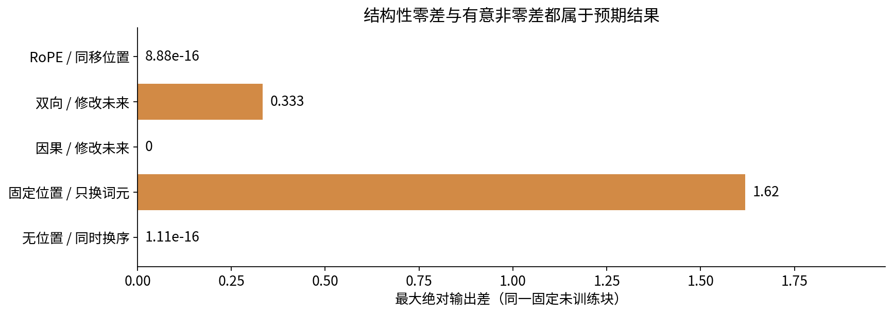

# Transformer块与位置实验

## 第053单元 独立操作手册

本实验从基本矩阵乘法、softmax、逐特征归一化和ReLU搭建一个完整块，再对齐官方参考层。只需读过036中的残差和052中的注意力；本手册仍重新给出轴、目标与验收。实验不需要GPU、付费API、外部模型或下载训练语料。预留约2小时完成阅读和手算，数值程序通常几秒内完成，安装和PDF构建另计。

### 一 安装与目录

建议Python3.12，随包environment.yml锁定主要实验版本。进入本单元目录后执行：

```bash
conda env create -f environment.yml
conda activate dl053
export OMP_NUM_THREADS=1 OPENBLAS_NUM_THREADS=1
python test_experiment.py
python -O test_experiment.py
python experiment.py --output replay
python make_figures.py --results replay/results.json --output replay/figures
jupyter lab experiment.ipynb
```

也可使用已安装Python3.12的venv再pip install -r requirements.txt。实测torch=2.7.1+cpu、numpy=2.3.5、matplotlib=3.10.8、Linux、单线程。requirements中的torch=2.7.1对应同一公开版本；如默认渠道提供GPU轮子，可按PyTorch官方安装页选择CPU轮子。仅CPU路径经过本单元测试。

数值实验不需要中文字体，插图与Notebook显示需要Noto Sans CJK。Debian/Ubuntu可安装fonts-noto-cjk；其他系统从Google Noto官方发行安装，将环境变量DL_CJK_FONT设为实际ttc/otf文件绝对路径。默认寻找/usr/share/fonts/opentype/noto/NotoSansCJK-Regular.ttc。程序在缺字体时明确停止，不用缺字方块凑图。

Notebook首格从当前目录或父目录寻找本单元experiment.py，Run All重算实验、测试和全部7张图，写入notebook_replay，不覆盖随包outputs。重建空Notebook使用create_notebook.py；阅读已执行版本无需运行它。命令python execute_notebook.py experiment.ipynb使用新进程中的in-process内核离线顺序执行，实测覆盖代码与输出，不验证浏览器UI或socket传输。

<div style="break-before:page"></div>

## 二 先手算再运行

### 练习1 元素不能串位

把0至23排成B=1、L=3、D=8。令H=2，写出头1位置2的4个元素，再证明拆头合头恢复原数组。故意省去合头前transpose，写出哪一行错了。不要只看shape。

### 练习2 归一化和参数量

对(1,2,3,4)手算均值、分母D的方差及epsilon=1e-5的LN输出。说明为什么分母D-1会使参考对齐失败。对D=4、H=2、F=7数清所有投影偏置和两次LN参数；头数变化但D固定时，本实现的投影参数总数是否改变？

### 练习3 两位置完整块

使用X的两行为(1,3)、(2,0)。QKV及输出投影为I，FFN为ReLU后乘0.2I，所有偏置0，LN gamma=1、beta=0、epsilon=1e-5。先不看outputs，逐项写出两次LN、分数、softmax、两次残差和最终输出。目标为(0,2)、(2,0)，half-MSE分母为2×4。推导输出梯度和fc2.weight梯度，解释PyTorch权重转置约定。继续沿ReLU、LN2、残差、输出投影、V、softmax、Q/K、LN1回到X，列出两次LN的gamma/beta梯度；用manual_backward核对每条支路。

运行hand_ledger()核对，再做学习率0.05的两次同步SGD。记录每次总loss及第一个标量输出的误差。总体下降时该标量是否一定更接近目标？给出实际数字作为反例。

### 练习4 对齐一个层

阅读reference()里的参数映射。独立检查qkv.weight到self_attn.in_proj_weight、fc1到linear1等映射。把pre改为False但忘记改参考层norm_first，预期输出是否对齐？将错误试验写在新文件或Notebook副本，保留正常版本。

正式验收包含种子5301至5303、pre/post两种、B=2、L=5、D=4、H=2、F=7、因果mask、无dropout。比较前向、输入梯度、每个参数梯度，最大绝对误差应低于2e-10。不能只比较前向，也不能在误差大时简单放宽容差。

<div style="break-before:page"></div>

## 三 用干预回答结构问题

### 练习5 排列和位置

固定置换[2,0,4,1,3]，比较以下情形，并在运行前写下预期：无位置无mask；只交换词元但固定正弦位置；把带位置向量整体交换；固定因果mask；因果mask的行列随词元一起交换。差异接近0时证明的是等变而非不变。

### 练习6 未来与长度

仅修改0起编号3、4位置。比较因果层和双向层前3位置。再分别用长度3和5运行同一前缀，位置编号不重置。记录最大绝对差。将LN的统计轴错误改为位置轴，解释它为什么可能绕开注意力mask泄漏未来；无需把错误实现当成新基线训练。

### 练习7 RoPE

q=k=(1,0)，频率1，分别计算(p,t)=(0,1)、(3,4)、(0,2)的旋转后内积。证明前两组相等，并指出不能据此证明完整模型无限长度有效。使用rotate_pairs检查范数和Q/K共同移动11个位置的内积误差。



### 提交物和标准

提交手算过程、三次完整前向loss、7个练习回答、环境版本、6种参考对齐配置误差以及结构干预结果。保留输出为零和非零的条件，不删除“局部误差上升”。测试在普通Python和-O下都应通过，因为unittest验收不会被优化模式关闭。

数值核心只支持非空B×L×D、CPU float64、有限正常尺度输入、有效query至少一个允许key。支持二维共享或三维逐样本allow。key padding可以屏蔽列，但padding query的残差输出不自动归零，读取或计算loss时必须另用query有效性。FP16、GPU、稀疏注意力、dropout随机对齐、长上下文及任务质量均未测试。

<div style="break-before:page"></div>

## 四 故障定位和可复现范围

- 输出形状正确、值完全不同：先检查合头transpose，再检查Linear权重存储方向、mask真假含义及参考参数是否复制完整。
- 只有post模式错误：把每次LN的位置与公式逐项对照，不要额外添加模型末端LN。
- 前向正确但梯度不同：确保两个独立输入都requires_grad=True，梯度来自相同线性探针，每轮清零旧梯度，比较所有偏置和gamma/beta。
- 出现NaN：检查是否把整行key屏蔽。该实现主动拒绝空支持，不能用nan_to_num把结构错误隐藏成零。
- 延长前缀后输出改变：先确认因果mask、相同前缀、相同位置编号、dropout关闭，再判断是否错误；双向模型变化是预期。
- 字体报错：检查DL_CJK_FONT指向可读字体文件。图形生成器设置单元tmp下的可写缓存；不要依赖只读HOME缓存。

### PDF重建

PDF是独立可读交付物，运行实验无需重建。若修改正文，在单元目录安装build-tools/requirements.txt中的构建依赖；将build-tools/package.json和package-lock.json复制到.build-deps，运行npm ci --prefix .build-deps，再执行python build_pdf.py lecture.md，lab.md和answers.md同理。需要Node、WeasyPrint平台依赖及Noto Serif CJK和Noto Sans CJK字体。构建依赖来自官方发布渠道，未打包node_modules或字体二进制。构建器只处理可信课程源码，不是陌生HTML/TeX安全沙箱。

### 最少应写的结论

“自写块与torch2.7.1参考层在规定6配置下前向及全部梯度对齐；换序、位置和未来干预符合相应计算图预测。该实验验证实现结构，没有比较pre/post任务质量，没有证明长上下文外推。”

所有来源和版本见sources.md及outputs/runtime.json。理论来源为原始Transformer、LayerNorm位置分析、RoFormer论文与PyTorch2.7官方API。合成数据与图允许按DATA_LICENSE.md使用。本实验没有训练集/测试集泛化主张；种子重复用于覆盖初始化，不用于p值检验。
