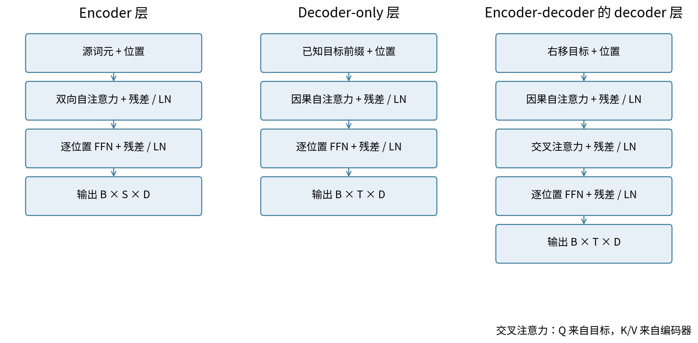
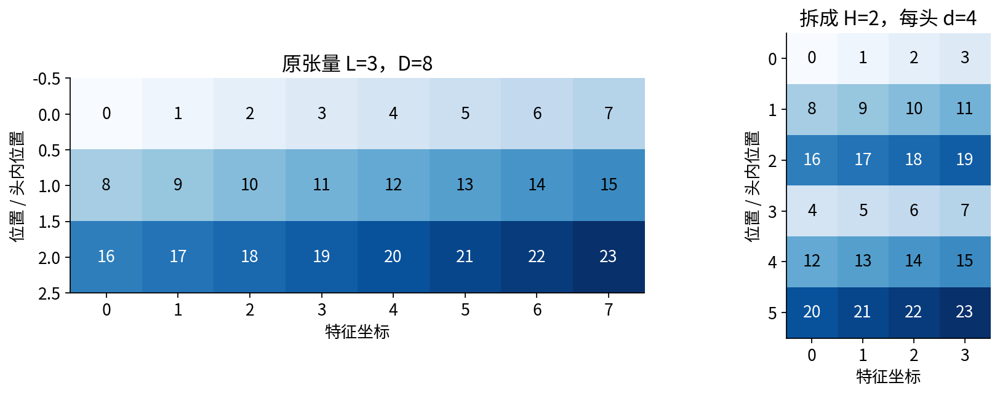
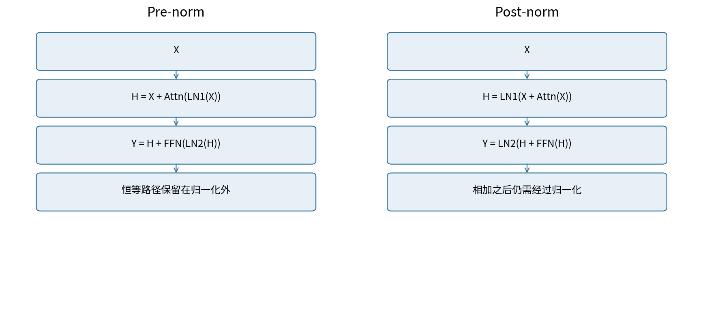
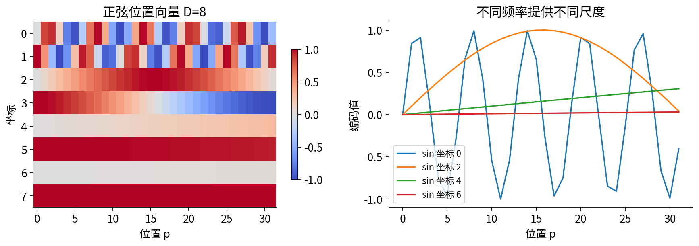
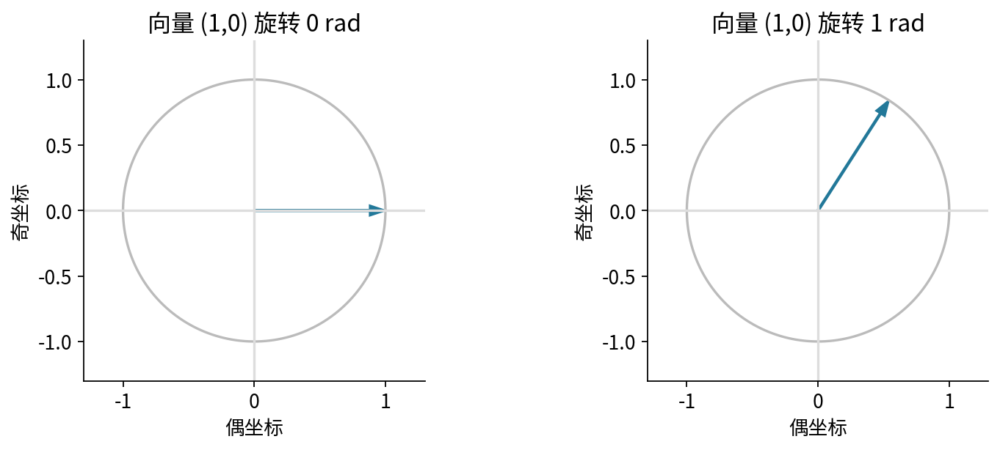

# Transformer块与位置

## 第053单元 从注意力算子到完整信息处理层

注意力负责在位置之间搬运信息；前馈网络负责逐位置变换特征；残差提供保留旧表示的路径；归一化控制每个位置的特征尺度；位置机制让模型区分顺序。这五件事合在一起才构成一个可重复堆叠的Transformer块。本讲的目标是把每个接口、轴和运算顺序写清，再用可复现的数值实验检查它们。

直接先修036、052。036中的残差与归一化只需记住“同形状相加”和“沿指定轴求均值方差”；052中的注意力只需记住QK决定权重、权重乘V。下面重新推导需要的细节。实验只用CPU、float64、无dropout的小型张量，不训练语言能力，也不把一个随机块的结果当成架构优劣。

学完后，应能独立画出多头的拆合轴，算完一个两位置实例，解释pre-norm与post-norm的不同导数路径，与PyTorch参考层对齐前向和全部梯度，并设计“只变未来”“交换词元”“延长序列”等可证伪检查。

编码器通常让一个源位置读取其他源位置。仅解码器模型用因果自注意力读取当前及更早的输入。编码解码模型还让目标位置通过交叉注意力读取源表示。因果可见性的具体起点由输入与标签如何移位决定，第054讲详细构造。

## 一 先把每条轴写在纸上

设输入$X\in\mathbb R^{B\times L\times D}$。B是批大小，L是词元位置数，D是残差流特征宽度。H个头要求本实现中$D=Hd$，其中d是每头宽度。单头宽度、头数和残差宽度是三个不同数字。

三次线性投影可合并为一次大投影。数学使用行向量约定$XW+b$；PyTorch的Linear把权重存成输出×输入，实际计算$XW^T+b$。所以qkv.weight的shape为3D×D，不是D×3D。

$$Q=XW_Q+b_Q,\quad K=XW_K+b_K,\quad V=XW_V+b_V.$$

先得到B×L×D，再reshape为B×L×H×d，再交换中间两轴得到B×H×L×d。每个头独立计算：

$$A_h=\operatorname{softmax}_{j}\left(Q_hK_h^T/\sqrt d+M\right),\qquad O_h=A_hV_h.$$

M在允许位置为0、禁止位置为负无穷。每个query必须至少有一个允许key。本单元自定义allow=True表示允许；PyTorch TransformerEncoderLayer的布尔src_mask=True表示禁止。因此对齐时传入~allow，不能原样传递。[4]

合头时反向交换轴回B×L×H×d，才reshape成B×L×D，再乘输出矩阵$W_O$。少一次transpose不会报维度错误，却会把不同位置的值拼到同一词元上，这是“shape正确但语义错误”的典型故障。

本讲的D=4、H=2、FFN宽度F=7块，QKV合计60个参数，输出投影20个，两个FFN线性层35+32=67个，两次LN各8个，共163个。通式为$4D^2+2DF+9D+F$，包括所有偏置和LN仿射参数；不包括词嵌入、位置和模型末端LN。

## 二 前馈网络和残差到底做什么

对每个位置的行向量h，前馈网络为：

$$\operatorname{FFN}(h)=\operatorname{ReLU}(hW_1+b_1)W_2+b_2.$$

$W_1$为D×F，$W_2$为F×D；ReLU逐坐标取max(0,u)。同一组参数在所有位置复用，但FFN本身不混合位置。没有非线性时，两层矩阵可合并成一个仿射变换，中间宽度就不提供同样的分段非线性表达力。

残差$y=x+f(x)$要求两项的B、L、D一致。对上游梯度g，反向为$g_x=g+J_f^Tg$。第一项是恒等支路，不意味着所有梯度永不消失或爆炸，因为两条支路可能抵消，很多层相乘也仍受数值和优化条件影响。

### LayerNorm沿哪些元素归一化

固定一个样本的一个位置，取D维行向量$x=(x_1,\ldots,x_D)$：

$$\mu=\frac1D\sum_r x_r,\quad v=\frac1D\sum_r(x_r-\mu)^2,\quad \hat x_r=\frac{x_r-\mu}{\sqrt{v+\epsilon}},\quad y_r=\gamma_r\hat x_r+\beta_r.$$

方差分母是D而非D-1。训练与评估都直接使用当前这个位置的特征统计，不维护BatchNorm式移动均值。[5] 同一位置的各坐标通过均值方差耦合；不同位置不在这里求均值。把dim=-1错写成dim=1会跨时间混合，甚至让因果模型在归一化处泄漏未来。

手算$x=(1,2,3,4)$，均值2.5，平方偏差为2.25、0.25、0.25、2.25，方差1.25。设$\gamma=1,\beta=0,\epsilon=10^{-5}$，输出是$(-1.5,-0.5,0.5,1.5)/\sqrt{1.25001}$。常量向量(7,7,7,7)居中后为0，所以输出等于beta。epsilon使分母非零，但不能修复输入本身的NaN。

若上游梯度为g，先令$u=g\odot\gamma$，令$s=\sqrt{v+\epsilon}$。链式法则先经过仿射层，再经过标准化，得到：

$$g_x=\frac{1}{s}\left[u-\operatorname{mean}(u)-\hat x\operatorname{mean}(u\odot\hat x)\right].$$

这里均值仍沿D。$g_\gamma$、$g_\beta$分别对所有样本及位置累加$g\odot\hat x$和g，因为这些参数被复用。实现使用基本张量算子让autograd完成这一链式法则；测试与官方层对齐全部参数梯度，而不是只对齐loss。

## 三 归一化的位置改变了计算图

Pre-norm先规范子层输入，再与原来的残差流相加：

$$H=X+\operatorname{Attn}(\operatorname{LN}_1(X)),\quad Y=H+\operatorname{FFN}(\operatorname{LN}_2(H)).$$

Post-norm先相加，再规范和：

$$H=\operatorname{LN}_1(X+\operatorname{Attn}(X)),\quad Y=\operatorname{LN}_2(H+\operatorname{FFN}(H)).$$

单个pre子层的Jacobian为$I+J_fJ_{LN}$；post子层为$J_{LN}(I+J_f)$，两者一般不相等。归一化位置会影响初始化时梯度量级和优化行为，已有研究讨论其与warm-up的关系。[2] 这不是“pre-norm永远更好”的定理。本实验只核验两种公式都写对，没有比较它们的训练收敛或任务质量。

Dropout在训练时随机丢弃部分子层输出，参考实现还可在注意力权重及FFN中使用它。为了隔离运算顺序，本讲所有dropout=0。将eval()误当成“关闭所有梯度”也不对：eval改变模块行为，no_grad控制是否记录自动微分，两者是独立开关。

PyTorch的参考层显式设置batch_first=True、activation='relu'、norm_first与自写块一致、相同eps和float64；默认值不构成实验协议。复制每个投影、偏置和两次LN参数以后才比较。如果两个层分别随机初始化，差异既包含公式，也包含参数，无法用于证明实现错误。

## 四 一个可以逐项复算的完整块

取B=1、L=2、D=2、H=1、F=2，pre-norm，无mask、无dropout。两位置输入为$(1,3)$、$(2,0)$。Q、K、V及输出投影均为单位矩阵，所有偏置为0；FFN第一矩阵为I、第二矩阵为0.2I；LN的gamma全1、beta全0、epsilon为$10^{-5}$。

第一行均值2、方差1，所以标准化为$(-a,a)$，第二行则为$(a,-a)$，其中$a=1/\sqrt{1.00001}=0.999995000$。Q=K=V=标准化结果。两个行向量的自内积为$2a^2$、交叉内积为$-2a^2$，因此分数矩阵为：

$$S=\begin{pmatrix}1.414199420&-1.414199420\\-1.414199420&1.414199420\end{pmatrix}.$$

首行第一个权重是$1/(1+e^{-2.828398841})=0.944191290$，第二个权重是0.055808710。第一行输出的第一坐标为$0.944191290(-a)+0.055808710(a)=-0.888378139$，第二坐标相反。另一行由对称性反号。

第一次残差相加得到$H_1=(0.111621861,3.888378139)$、$H_2=(2.888378139,-0.888378139)$。第二次LN分别接近(-1,1)、(1,-1)，但不要在代码中直接替换为精确的±1，否则会改变导数。精确绝对值为0.999998598。

FFN的ReLU保留正坐标，所以两行隐藏向量为(0,0.999998598)、(0.999998598,0)。乘0.2I以后是(0,0.199999720)、(0.199999720,0)。第二次残差得到最终输出：

$$Y=\begin{pmatrix}0.111621861&4.088377859\\3.088377859&-0.888378139\end{pmatrix}.$$

这一步清楚表明：注意力权重非负且和为1，并不使整个块的输出被限制在原输入的凸包内。投影、FFN和残差都改变了这种几何约束。完整中间值与所有参数保存在outputs/results.json的hand字段，Notebook重算相同账本。

## 五 从这个前向走到两次参数更新

给同一输入设目标$T_1=(0,2)$、$T_2=(2,0)$，这是为了检查训练路径的人造回归目标，不是语言建模任务。四个标量输出定义half-MSE：

$$\mathcal L=\frac{1}{2N}\sum_{i,r}(Y_{ir}-T_{ir})^2,\quad N=4,\quad G_Y=(Y-T)/4.$$

损失为0.793445450，上游梯度两行为(0.027905465,0.522094465)、(0.272094465,-0.222094535)。第一次残差回传时，同一梯度既进入H的直接路径，又进入FFN，再经LN回到H。不能只沿FFN传播。

设FFN隐藏矩阵为U。数学行向量权重下，$G_{W_2}=U^TG_Y$；PyTorch保存的fc2.weight是其转置，所以它的梯度为$G_Y^TU$：

$$G_{\text{fc2.weight}}=\begin{pmatrix}0.272094083&0.027905426\\-0.222094223&0.522093733\end{pmatrix}.$$

例如右下角只从第一位置贡献$0.522094465\times0.999998598$，因为第二位置U的第二坐标为0。偏置梯度是跨位置求和，而不是再取一次平均；loss中的1/4已经处理过了。fc1经ReLU只保留正激活的梯度；输入恰在0时本实现遵循PyTorch的零导数约定。

全部参数同步作$\theta_{t+1}=\theta_t-0.05G_\theta$。第一步fc2.weight左上角由0.2变为0.186395296；右上角由0变为-0.001395271。不能边更新一个参数边用新参数计算另一个参数的旧梯度。

三次前向的loss依次为0.793445450、0.592925194、0.462257387。每一次都重新计算全部中间值。注意第二个位置的第一输出从3.088378降至2.921903再至2.789287，而第一个位置第一输出从0.111622升至0.140482再至0.148965，离其目标0反而更远。总体损失下降不要求每一个输出误差都下降，这个负面细节应保留。

## 五补一 从FFN沿归一化返回残差

下面继续同一个实例的完整反向。记F1、F2、Wo分别为PyTorch保存的fc1、fc2、proj权重，形状都是输出×输入。令Z1=LN1(X)，M=AV，H=X+proj(M)，Z2=LN2(H)，R=fc1(Z2)，U=ReLU(R)。每行是一个位置，每列是一个特征。没有省略任何参数支路。

$$G_U=G_YF_2,\quad G_R=G_U\odot\mathbf1[R>0],\quad G_{Z2}=G_RF_1.$$

权重梯度分别为$G_{F2}=G_Y^TU$和$G_{F1}=G_R^TZ2$，偏置是各自上游梯度沿位置求和。把上一页的GY乘0.2I，第一位置GU=(0.005581093,0.104418893)。R第一坐标为负，故GR第一坐标清零；另一位置保留第一坐标。第二LN收到的GZ2就是GR，因为F1=I。

|梯度对象|位置0的两个坐标|位置1的两个坐标|
|---|---|---|
|GU|(0.005581093, 0.104418893)|(0.054418893, -0.044418907)|
|GR和GZ2|(0, 0.104418893)|(0.054418893, 0)|
|LN2回到H|(-7.753e-8, 7.753e-8)|(4.041e-8, -4.041e-8)|
|GH=GY+LN2回传|(0.027905388, 0.522094542)|(0.272094505, -0.222094575)|

对LN输入a，令 $s=\sqrt{v+\epsilon}$、$\hat a=(a-\mu)/s$、$u=g\odot\gamma$；完整反向为 $g_a=[u-\operatorname{mean}(u)-\hat a\operatorname{mean}(u\odot\hat a)]/s$，均值沿特征轴。LN2把a=H、g=GZ2代入此式。这里每行仅二维，标准化向量接近±1，很多方向会被居中和尺度消去，所以回到H的梯度很小；它并非精确零，epsilon仍参与导数。若手算时把±0.999998598硬替为±1，容易误删这条小路径。

LN2的gamma梯度是$\sum_iG_{Z2,i}\odot\widehat H_i$，得到(0.054418817,0.104418747)；beta梯度是$\sum_iG_{Z2,i}$，得到(0.054418893,0.104418893)。所有位置共享同一gamma/beta，不能保留两份独立参数。GH还含直接残差的GY，这使很小的LN支路梯度不意味着整个块的输入梯度也很小。

程序manual_backward用这些显式公式逐项计算，没有调用autograd求导；再把手推结果与真实loss.backward比较。三个参数状态都比较每个参数和X的梯度，最大误差在浮点舍入量级，详见hand内manual_autograd_max。

## 五补二 注意力的三条反向支路

输出投影把M映射为$MW_o^T+b_o$，因此$G_M=G_HW_o$、$G_{W_o}=G_H^TM$。当前Wo=I，GM数值等于GH。接着M=AV使值路径与权重路径分叉：

$$G_V=A^TG_M,\quad G_A=G_MV^T,\quad G_S=A\odot[G_A-\operatorname{rowsum}(A\odot G_A)].$$

最后一个rowsum保留单列，再沿行广播。这是softmax完整Jacobian的向量乘法，不能只乘a(1-a)而丢掉非对角项。由于$S=QK^T/\sqrt2$，继续有$G_Q=G_SK/\sqrt2$、$G_K=G_S^TQ/\sqrt2$。

|对象|位置0的行向量|位置1的行向量|
|---|---|---|
|GV|(0.041533267, 0.480562308)|(0.258466626, -0.180562341)|
|GA|(0.494186684, -0.494186684)|(-0.494186609, 0.494186609)|
|GS|(0.052081443, -0.052081443)|(-0.052081435, 0.052081435)|
|GQ|(-0.073653914, 0.073653914)|(0.073653903, -0.073653903)|
|GK|(-0.073653909, 0.073653909)|(0.073653909, -0.073653909)|

例如GV位置0第一坐标由所有query累加，约为0.944191290×0.027905388+0.055808710×0.272094505=0.041533267。GA首行是GM首行点乘每一行V。GS的行和接近0，这是softmax对整行平移不敏感的结果，可作局部检查。

QKV共享Z1。若其三个PyTorch权重分别为Wq、Wk、Wv，则：

$$G_{Z1}=G_QW_q+G_KW_k+G_VW_v.$$

本例三个权重为I，所以直接把上述三条路径相加，得到两行(-0.105774556,0.627870131)、(0.405774437,-0.327870153)。只把值路径GV回传会漏掉“改变查询与匹配方式”的两条路径。

## 五补三 汇合到输入与全部参数

LN1接收GZ1，按照同一归一化导数回到X，约为(-3.668168e-6,3.668168e-6)、(3.668168e-6,-3.668168e-6)。再与H=X+proj(M)的直接路径GH相加：

$$G_X=G_H+G_{LN1\rightarrow X}.$$

最终GX两行为(0.027901720,0.522098210)、(0.272098173,-0.222098243)。这完成了从loss到输入的所有连接。LN1的gamma梯度为(0.511546435,0.955735505)，beta梯度为(0.299999882,0.299999978)。二者看起来不小，而回到X的小梯度体现了归一化的几何作用，不能混为一类量。

Q、K、V投影各自的权重梯度是对应上游梯度转置乘Z1，偏置为上游沿位置求和。所有参数梯度如下，每个矩阵以“第一行；第二行”表示，均是PyTorch存储方向；数字显示9位附近，完整精度在JSON。

|参数|权重或gamma梯度|偏置或beta梯度|
|---|---|---|
|fc2|(0.272094083, 0.027905426)；(-0.222094223, 0.522093733)|(0.299999930, 0.299999930)|
|fc1|(0.054418817, -0.054418817)；(-0.104418747, 0.104418747)|(0.054418893, 0.104418893)|
|输出投影|(0.216932274, -0.216932274)；(-0.661121343, 0.661121343)|(0.299999893, 0.299999967)|
|Q投影|(0.147307081, -0.147307081)；(-0.147307081, 0.147307081)|(-1.107e-8, 1.107e-8)|
|K投影|与Q权重梯度相同|(0, 0)，至舍入量级|
|V投影|与输出投影权重梯度相同|(0.299999893, 0.299999967)|
|LN2|(0.054418817, 0.104418747)|(0.054418893, 0.104418893)|
|LN1|(0.511546435, 0.955735505)|(0.299999882, 0.299999978)|

这些相同梯度来自本例的单位矩阵和对称输入，不是一般性质。K偏置在纯点积注意力中给每行分数同一个平移，因此这里梯度接近0。更新仍对所有参数执行，包括数值为0的梯度。第一步、第二步都使用各自前向对应的完整反向链，不复用第一步的A或LN统计。

## 六 没有位置机制会发生什么

设P是重排位置的置换矩阵。没有位置向量、没有固定方向mask时，线性投影逐位置共享，所以$Q(PX)=PQ(X)$；分数变为$PSP^T$；逐行softmax得到$PAP^T$；乘PV后输出为$PAV$。逐位置LN、FFN和残差都保留这个性质，因此：

$$\operatorname{Block}(PX)=P\operatorname{Block}(X).$$

这叫排列等变，不是排列不变：输出会跟着输入换位置，而非完全不动。对整个序列再做平均池化才可能得到排列不变的摘要。固定因果mask本身有方向信息，任意换序时也必须把mask变成$PMP^T$才保留上面的推导；因此不能笼统说“没有位置编码就完全不知道任何顺序”。

最直接的位置方法是$X_p=E_{token_p}+P_p$。学习式绝对位置使用位置查表，需要对未训练位置单独制定策略。正弦位置使用固定函数：[1]

$$P_{p,2r}=\sin\left(p/10000^{2r/D}\right),\quad P_{p,2r+1}=\cos\left(p/10000^{2r/D}\right).$$

p从0开始，同一对坐标共享频率；不同坐标对有不同频率。D=4、p=0时是(0,1,0,1)，p=1时是(sin1,cos1,sin0.01,cos0.01)。公式能算出更长位置并不代表训练过的模型会在更长上下文保持准确。

只交换词元而保持位置编号不变，就改变了词元与位置的配对，通常破坏上述等变。如果连位置向量一起交换，仍然只是重排同一组带位置的向量，等变性又恢复。两个试验必须区分。

## 七 RoPE的相对位置动机

绝对位置向量加到输入上，让位置参与所有后续投影。另一种思路是直接旋转查询和键，使它们的内积显式依赖位置差。[3] 先看二维列向量上的旋转矩阵：

$$R(\alpha)=\begin{pmatrix}\cos\alpha&-\sin\alpha\\\sin\alpha&\cos\alpha\end{pmatrix}.$$

在位置p把q旋转$R(p\theta)q$，在位置t把k旋转$R(t\theta)k$。因为$R(\alpha)^T=R(-\alpha)$且角度相加：

$$(R(p\theta)q)^T(R(t\theta)k)=q^TR((t-p)\theta)k.$$

所以两位置同时加常数c时，该内积不变。这个推导把内容q、k固定；如果整个网络其他环节也依赖绝对位置，就不能据此宣布完整网络平移不变。本实现对相邻偶奇坐标成对旋转，只旋转Q/K，不旋转V。

手算q=k=(1,0)，theta=1，p=0、t=1时，旋转后的内积为cos1≈0.540302306；若p=3、t=4，仍为cos1。若只把t改为2，则为cos2≈-0.416146837。位置差确实进入分数，但分数可以为负，也不保证随距离单调下降。

RoPE的维度配对顺序必须在Q/K上保持一致。相邻配对和前半后半配对都是可能的实现约定，但不能混用参数及旋转代码。长度外推还涉及频率、训练长度、分布和任务，不能从旋转公式直接推出无限上下文。本讲只验证旋转保范数与同移内积不变，不训练RoPE模型，更不评测其长文本能力。

## 八 用会失败的对照检查结构

运行experiment.py会在种子5301、5302、5303下分别验证pre和post，共6个配置。每个配置使用B=2、L=5、D=4、H=2、F=7的因果层，复制相同参数到官方参考；用固定线性探针形成标量，再比前向、输入梯度、所有参数梯度。最大全部差约$1.78\times10^{-15}$，验收阈值为$2\times10^{-10}$。阈值给浮点舍入留余量，不应按观察值精确相等断言。

无位置、无mask的换序误差约$1.11\times10^{-16}$；只交换词元但固定正弦位置，最大差约1.61931；词元连同位置一起交换，误差回到舍入量级。固定因果mask下任意换序差约0.78972；连mask两轴一起换序，误差又回到舍入量级。

只改变未来第3、4位置（从0计数），因果块前3位置完全不变，双向块最大改变约0.33306。把长度5截为3，因果块前缀误差约$1.11\times10^{-16}$，双向块约0.22877，因为后者的候选集合改变了。以上比较复用相同前缀位置编号和同一模型；重新从0给滑动窗口编码会是另一个实验。

RoPE的Q/K同时移动11个位置，内积最大差约$8.88\times10^{-16}$，范数差约$2.22\times10^{-16}$。这些零差由代数结构支持，不是三种子统计显著性。非零反例依赖指定输入和参数，不要求所有可能权重都非零，例如全零投影会让部分干预无效。

## 九 从通过对齐到可信研究

通过参考对齐，只说明“在这些条件下，实现计算相同函数及导数”；它不证明模型学到了有用规律。通过因果干预，只说明这条信息通道没泄漏；数据构造、目标移位、归一化轴仍可能引入其他泄漏。第054讲会把数据边界也纳入检查。

训练时可以把一段已知文本的全部位置并行计算，同时用mask阻断未来。生成时下一个词元的实际取值尚未知，通常必须先生成它，才能用它继续条件化下一步。这是计算图的依赖关系，不能从“训练没有RNN”推导出任意自回归生成都能一次完成。缓存和具体解码属于后续内容，本讲不实现。

### 初学者应该提交的证据

1. 画出B×L×D到B×H×L×d再合回的轴变化，并用带编号张量证明元素顺序。
2. 写出两种norm顺序的前向和残差Jacobian，说明为何参数相同也通常输出不同。
3. 完整复算手算例，记录三次loss，同时说明局部误差可能上升。
4. 复制参数与参考层对齐前向、输入和参数梯度，保留版本和容差。
5. 给排列、位置、未来和长度各设置一个应为零的条件或明确反例。
6. 把“公式可计算”“实现无泄漏”“任务质量好”“长度外推有效”当作不同主张分别寻找证据。

### 一手资料

[1] Vaswani et al. Attention Is All You Need，2017。原始多头、逐位置FFN、位置编码和encoder-decoder结构。https://arxiv.org/abs/1706.03762

[2] Xiong et al. On Layer Normalization in the Transformer Architecture，2020。归一化位置与初始化梯度的分析。https://arxiv.org/abs/2002.04745

[3] Su et al. RoFormer，2021。旋转位置编码的构造与相对位置关系。https://arxiv.org/abs/2104.09864

[4] PyTorch 2.7 TransformerEncoderLayer。参考层参数和mask接口。https://docs.pytorch.org/docs/2.7/generated/torch.nn.TransformerEncoderLayer.html

[5] PyTorch 2.7 LayerNorm。归一化维度、方差与仿射参数约定。https://docs.pytorch.org/docs/2.7/generated/torch.nn.LayerNorm.html

本讲数字和插图来自随包原创计算。来源支持概念与API定义，未替本实验作有效性背书。源页面核验于2026-10-05；代码实测torch 2.7.1+cpu，而不是网页stable当前指向的更新版本。
