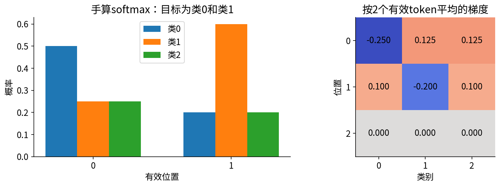

# 预训练目标与数据构造解答

## 第054单元 从数组核对到研究结论

本答案以独立文档的自回归和简化MLM为准。PAD=0、BOS=1、EOS=2、MASK=3，普通词元ID从4开始，IGNORE=-100只用于标签。模型CPU float64、无dropout。所有结果来自原创短文本和未训练探针，不作目标优劣比较。

## 一 预测对与三种mask

练习1：A输入[BOS,蓝,猫]，标签[蓝,猫,EOS]；B输入[BOS,红]，标签[红,EOS]。拼接后输入[BOS,蓝,猫,BOS,红]，标签[蓝,猫,EOS,红,EOS]，segment=[0,0,0,1,1]，position=[0,1,2,0,1]，有效目标5。BOS作起始条件，EOS作为结束事件参加loss；这是本次协议而非所有模型的唯一方案。

第3位置BOS只能读自己，不能读A的三个位置；第4位置红能读BOS和自己。若在数据函数和模型内部各移一次，实际预测对象通常错成下下个token，并丢掉额外边界目标。打印具体pair比讨论“标签左移还是输入右移”的措辞更可靠。

练习2：MLM输入[BOS,MASK,猫,MASK,红,MASK,EOS]，标签[IGNORE,蓝,IGNORE,追,IGNORE,球,IGNORE]。有效数3；attention在合法非padding位置间双向开放，但已被替换的位置不再提供原词元。未选中的猫能作上下文、其输出不计loss、其嵌入可能经其他query的损失收到梯度。这三件事分别由attention、loss和整个计算图决定。

corruption mask控制修改输入，loss mask控制选哪些输出，attention mask控制读取关系。把它们称作同一个“mask”而不指明角色，会掩盖结构错误。

## 二 编码解码的对应答案

练习5：源[蓝,MASK,球]整体进入encoder；目标[猫,追,EOS]对应decoder输入[BOS,猫,追]和相同目标标签。encoder的3×3 self-attention全允许；decoder的3×3 self-attention下三角；cross-attention中每个目标query可读全部3个源key。源不应读取decoder目标。

若decoder input也写[猫,追,EOS]并保留对角可见，当前位置已含要预测的答案；即使改成严格下三角，残差输入仍携带它，不能只靠mask修复。若encoder看到完整原目标，也会把答案经cross-attention送回，改变原定去噪条件。所有输入通道都应接受同样的信息边界审计。

## 三 NLL的完整求导与两次更新

练习3：位置0指数(2,1,1)，总和4，目标概率0.5；位置1指数(1,3,1)，总和5，目标概率0.6。两个loss为ln2=0.693147181及ln(5/3)=0.510825624，总数2，总loss=1.203972804，平均0.601986402。忽略位置无论logits怎样都不增加分母。

由$\ell=\log\sum_j e^{z_j}-z_y$，对$z_k$求导为$e^{z_k}/\sum_j e^{z_j}-\mathbf1[k=y]$。再乘有效mask并除2，得到位置0(-0.25,0.125,0.125)，位置1(0.1,-0.2,0.1)，位置2(0,0,0)。每一行类别梯度之和为0。

若$Z=HW+b$，代入链式法则有$G_W=H^TG_Z$、$G_b=\sum_iG_{Z,i}$、$G_H=G_ZW^T$。例如取两个有效位置的H为二维单位矩阵，则W的两行梯度恰好是上述两行GZ，而共享偏置梯度为(-0.15,-0.075,0.225)。PyTorch权重以输出×输入存储，这个W梯度要转置。不能把不计loss误写成“所有中间梯度都为零”。

为了让两步可手算，实验直接优化独立logits，步长0.2。第一次位置0为(0.743147181,-0.025,-0.025)，位置1为(-0.02,1.138612289,-0.02)。重算目标概率为0.518741216、0.614309848，平均loss0.571802990；新梯度分别为(-0.240629392,0.120314696,0.120314696)、(0.096422538,-0.192845076,0.096422538)。

第二次位置0为(0.791273059,-0.049062939,-0.049062939)，位置1为(-0.039284508,1.177181304,-0.039284508)。目标概率变为0.536730915、0.627923445，平均loss0.543797711。第三个忽略位置的参数与梯度始终不变。这里没有训练共享Transformer，因此不能推断其语言建模能力。

## 四 归约与packing的答案

练习4：正确token平均(0.2+12)/(2+6)=1.525。均值再平均为(0.1+2)/2=1.05，错误地让微批A的每个token获得微批B中每个token的3倍权重。如果有意选择样本等权目标，那是不同目标，需要声明而非称作相同NLL。

梯度累积可先知道窗口总数8，让A的sum_loss/8反向、B的sum_loss/8反向，再step一次；或累加sum梯度后整体除8。每个微批各自除有效数再除微批个数，只有有效数相同才与token平均等价。全IGNORE平均没有定义，本实现抛ValueError，不返回伪造零。

练习6：分块因果mask保证第i位置只能读同segment且不晚于自己的key；重置绝对position保证嵌入与独立样本相同。无dropout、相同参数、逐位置LN和FFN下，可逐层归纳有效隐藏状态相同，输出和总loss也相同。测试用3份不同长度文档比较所有参数梯度，阈值2e-12。

正式6训练文档的有效AR目标数34。padded为6×7共42格，因此padding比例8/42；packed长度34，无额外截断。有效logits最大差约4.44e-16，两个总NLL均93.258353649。不能把这次等价性当成packing一定更快的证明：批形状和注意力矩阵规模也变了，本讲没有测吞吐。

只用全局下三角时，后文可读前文。修改第一文档普通token，后续logits最大变化约0.120594；正确分块下为0。分块但不重置位置时，与padded参考最大差约2.041716。一个是内容通道问题，一个是位置协议问题，分别修复。

补齐query只读自身且不计loss，因此不产生空softmax；合法query不能读补齐key。不应要求padding query一定输出零，因为残差、位置和偏置仍可能非零。本单元只对齐合法query。

## 五 诊断与数据审计的答案

练习7：V=15，复制规则的目标input logit为6，其他14类为-6。错误未移位label下，正确类概率为$1/(1+14e^{-12})$，NLL=$\log(1+14e^{-12})\approx0.000086015$。正确下一词元标签在本语料所有有效位置均不同于当前输入，所以NLL变为$12+\log(1+14e^{-12})\approx12.000086015$。巨大差异完全来自目标定义，不是模型训练进步。

练习8：d08与d00在空白归一化后完全相同。保留d00，移除d08；训练6、验证2、测试2。哈希交集为空只证明本规范化方法下无完全重复，不排除同义改写、模板相近、片段重合或来源依赖。真实任务应根据研究问题按人、文档、时间等分组，再决定近重复处理。

闭合词表在生成前定义，包括PAD、BOS、EOS、MASK和11个普通符号，故没有从验证语料学习合并规则。若改用训练式BPE，应在声明的训练数据上拟合，然后固定分词器编码验证/测试；若使用外部预训练分词器，应报告其来源与版本，并承认外部语料范围可能影响污染评估。

## 六 什么结论符合本次证据

AR平均NLL2.742892754、MLM平均2.603452297不能证明MLM更好。两个目标集合不同（34对10），可见上下文不同，且探针没有训练。AR困惑度exp(2.742892754)=15.531850001仅描述本词表、上下文和EOS规则下的这次AR计算。

跨分词器每token困惑度分母不同；即使数字都叫perplexity，也可能不可直接比较。窗口长短和重复评分也影响口径。先固定评估文本、token定义、条件上下文、特殊符号、有效目标，再讨论指标变化。

通过的检查：标签与边界手算、MLM特殊符号排除、损失和梯度解析值、忽略输出但保留上下文梯度、去重后split隔离、packing前向与全参数梯度等价、两个错误packing对照、错位复制诊断。未测试语义去重、训练收敛、自然语言任务、GPU或分布式系统。

一手资料：BERT https://arxiv.org/abs/1810.04805 ；T5 https://arxiv.org/abs/1910.10683 ；数据去重 https://arxiv.org/abs/2107.06499 ；PyTorch2.7 CrossEntropyLoss https://docs.pytorch.org/docs/2.7/generated/torch.nn.CrossEntropyLoss.html 。本答案的数字由随包代码生成，不是这些论文的实验结果。
