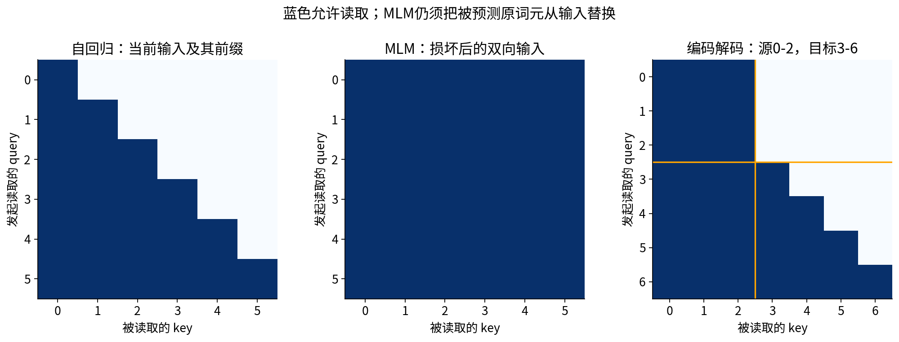
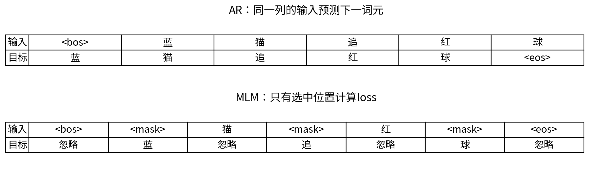
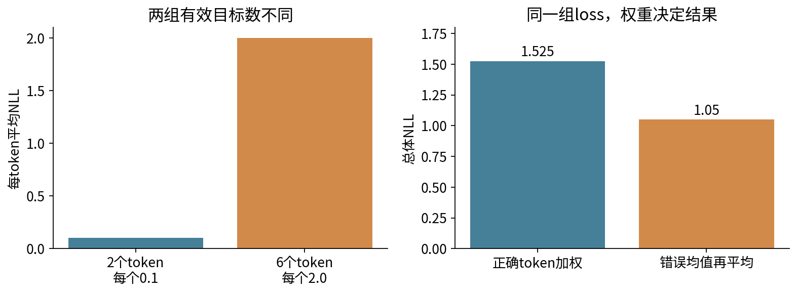
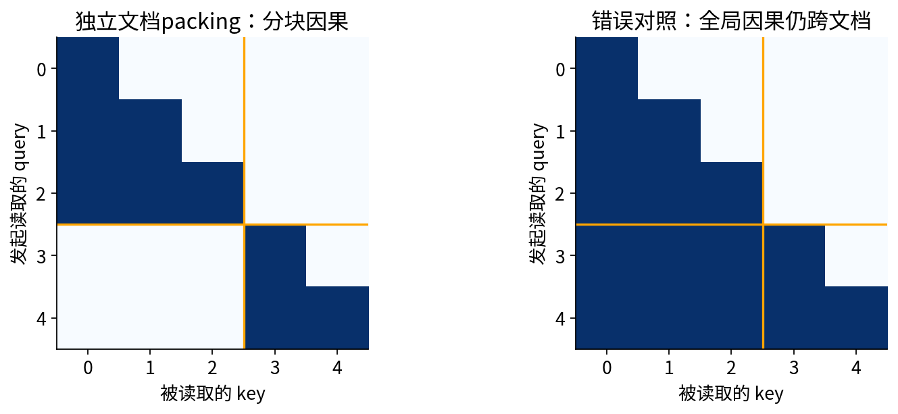
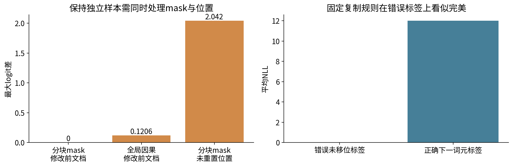

# 预训练目标与数据构造

## 第054单元 让输入 标签和信息边界一致

模型在预测什么，首先由数据构造决定。一个mask写反、一个标签移错、一个文档边界漏掉，都能让漂亮的loss曲线回答错误的问题。本讲把自回归、掩码预测和编码解码目标写成条件概率，再把每个符号落实为输入ID、标签ID、注意力mask、loss mask和有效token计数。

直接先修019、021、053：分别提供条件概率、训练验证分离和Transformer层。本讲仍从条件概率乘法、负对数和数组下标补起。实验语料是作者原创的10份唯一短文档，含一个故意重复的原始版本；中文词元按空格切分。它们只是边界检查数据，不代表中文建模任务，也不支持任务质量排名。

两种目标使用同一组训练文档、同一个词表和同一未训练小Transformer探针。我们检查构造和数值，而不比较“哪种目标更优秀”。编码解码目标有可手算的构造与可见性图，未额外训练第三个模型。

要交付的关键证据不是最低loss，而是：标签确实对应预期条件事件；padding与packing没有改变独立样本的预测；损失按真实有效目标数归约；数据重复没有跨越划分边界。第055讲将在这些前提上训练小型语言模型。

## 一 从条件概率分解到自回归目标

概率乘法公式$P(A,B)=P(A)P(B\mid A)$反复使用，可把序列概率分解成逐词元条件概率。设正文词元为$w_1,\ldots,w_n$，把终止符EOS记为$w_{n+1}$，BOS作为起始条件：

$$p(w_1,\ldots,w_n,EOS\mid BOS)=\prod_{t=1}^{n+1}p(w_t\mid BOS,w_1,\ldots,w_{t-1}).$$

这是一种从左到右的分解，不声称语言在现实世界中按这条因果链产生。对数把乘积变为和，负号使高概率对应低损失。一个输入位置的logits经softmax给出下一目标词元的分布。

以“蓝 猫 追 红 球”为例，我们明确选择输入[BOS,蓝,猫,追,红,球]，标签[蓝,猫,追,红,球,EOS]。同一列是一个预测对。输入第0位置只看到BOS，目标是蓝；输入第4位置看到BOS至红，目标是球。因果mask允许当前输入位置，因为它仍是目标之前的词元。

也可把完整序列[BOS,w1,...,wn,EOS]交给某些模型接口，由内部自动移位；此时外部再次移位就会预测下下个词元。必须读API并打印实际input/label配对，不能仅凭变量名labels推断。我们的代码在数据函数中完成一次移位，损失函数不再移动。

EOS表示终止目标，但它本身没有神奇的信息隔离作用。把EOS或BOS拼进长文本，而允许后文读取前文，就定义了跨文档条件模型。若研究目标是文档独立，必须另外屏蔽跨文档注意力；若明确要连续流目标，则应承认并记录这个不同条件事件。

## 二 掩码预测与编码解码学的条件不同

掩码预测先从正文位置中抽取集合S，生成损坏版本$\widetilde w$，只对S中的原词元求负对数概率：

$$\mathcal L_{MLM}=-\frac1{|S|}\sum_{t\in S}\log p(w_t\mid\widetilde w).$$

注意这里条件是整段损坏输入，不是完整原文。双向可见性允许读取左右两侧未遮盖上下文，目标位置自己的原词元必须按声明策略处理。本单元用简化方案：每个普通token以0.3概率入选，入选者全部换成MASK；若短文档一个都没选中，强制均匀选一个。它不复刻BERT的抽样率和80/10/10替换策略。[1]

一次mask的多个位置共享同一损坏输入，loss是条件预测项的和。它不自动构成完整原文的自回归联合概率；不能直接把exp(MLM loss)当成与AR困惑度同口径的模型优劣指标。重新采样mask还会改变本次被评分目标集合，因此固定评估mask或明确平均协议很重要。

编码解码的目标为给定源s，预测目标序列y：

$$p(y\mid s)=\prod_t p(y_t\mid y_{<t},s).$$

例如源[蓝,MASK,球]、目标[猫,追,EOS]，decoder输入[BOS,猫,追]，标签[猫,追,EOS]。encoder对损坏源双向编码；decoder只能读已知目标前缀，但可通过交叉注意力读全部源。不能把完整未损坏目标也塞入encoder，再声称做了恢复预测。

T5等工作系统研究了去噪与文本到文本训练，包括span corruption等具体方案。[2] 本讲只建立通用条件关系，示例是逐词替换后重建指定目标，不声称完全复现T5的哨兵token方案、语料或实验。结构、目标和数据处理要同时说明，不能只报“用了Transformer”。

## 三 把每个有效词元的损失算清

logits $z\in\mathbb R^V$不是概率。softmax为$p_k=e^{z_k}/\sum_je^{z_j}$；正确类别y的负对数似然为：

$$\ell(z,y)=\log\sum_{j=1}^Ve^{z_j}-z_y.$$

数值实现使用log_softmax，在内部处理减去最大值的稳定计算，不先算很小概率再取log。标签是整数ID，不是one-hot数组；本单元IGNORE=-100仅作为哨兵，不能拿它去词表查嵌入或先执行gather。

手算三个类别。位置0的logits为(ln2,0,0)，指数为(2,1,1)，概率为(0.5,0.25,0.25)，目标0的loss=-ln0.5=0.693147181。位置1的logits为(0,ln3,0)，概率为(0.2,0.6,0.2)，目标1的loss=-ln0.6=0.510825624。位置2无有效目标，logits可为(9,-4,1)，但不参与本次loss。

总NLL=1.203972804，有效目标数N=2，平均NLL=0.601986402。若无类别权重且无label smoothing，逐logit求导为：

$$\frac{\partial\mathcal L}{\partial z_{ik}}=\frac{m_i}{N}(p_{ik}-\mathbf1[k=y_i]),\quad N=\sum_i m_i.$$

所以位置0梯度(-0.25,0.125,0.125)，位置1为(0.1,-0.2,0.1)，位置2全0。每个有效位置的类别梯度和为0，对应整行logits平移不改变概率。mask决定哪些目标参与训练，而不是让模型对它们预测某个“IGNORE类别”。[3]

## 四 从损失梯度到参数更新及正确归约

若输出层是$Z=HW+b$，H为N位置×D特征、W为D×V，则$G_W=H^TG_Z$、$G_b=\sum_iG_{Z,i}$、$G_H=G_ZW^T$。这把token级目标接回053的块反向。PyTorch Linear把W转置保存，权重梯度因此也转置。多个位置共享输出权重，必须累加全部有效位置贡献。

为了独立检查损失，本讲手算例直接把logits当可优化参数，步长0.2。第一次更新位置0变成(ln2+0.05,-0.025,-0.025)，位置1变成(-0.02,ln3+0.04,-0.02)，忽略位置不变。重算目标概率0.518741216和0.614309848，平均loss=0.571802990。再用新的概率计算梯度，第二次更新目标概率0.536730915和0.627923445，平均loss=0.543797711。

这两步是独立logits的教学优化，不是训练Transformer；不能拿它的下降宣称语言模型变强。若logits由共享网络输出，不同位置之间的参数约束可能造成个别loss上升。

### 不等长样本不能随意平均均值

假设微批A有2个有效token，总loss0.2，微批B有6个有效token，总loss12。整体token平均为(0.2+12)/(2+6)=1.525；直接平均两个微批均值则是(0.1+2)/2=1.05。后者赋予每个微批等权，改变了目标。

梯度累积同理：已知本次累积窗口总有效数N时，每个微批使用sum_loss/N反向，再统一step；或先累加sum的梯度，最终除N。不能先除各微批token数再机械除微批个数，除非每批有效数相同。验证集跨批报告时累计sum与count，最后只除一次。

忽略某位置的输出loss只使该位置logits梯度为0。它仍可作为别的query的key/value被读取，因而输入嵌入可能收到梯度。我们的MLM测试明确保留这个区别：未选中的“蓝”作为上下文，其嵌入梯度非零，而该位置logits梯度为0。

## 五 Padding和packing必须保持同一个条件事件

Padding把不同长度文档补到同一L。输入用PAD补齐，标签用IGNORE补齐；合法query只能读取合法key。补齐query若整行全禁，普通softmax会无定义。本实现让补齐query只读自己，且它们不参与loss；有效query永远读不到这些补齐位置。这个数值约定不改变有效输出。

Packing把多个预先构造好的样本放入一条长行，减少补齐空位。本讲不做定长截断，直接拼接所有训练样本，以便检查等价性。例如正文A=[蓝,猫]、B=[红]：

- input=[BOS,蓝,猫,BOS,红]
- label=[蓝,猫,EOS,红,EOS]
- segment=[0,0,0,1,1]
- position=[0,1,2,0,1]

对应允许矩阵为$A_{ij}=\mathbf1[segment_i=segment_j]\mathbf1[j\le i]$。跨样本位置全部禁止。每份文档自己起始位置从0计数，所以与分别运行时的学习式绝对位置向量相同。

若先把原始文档串起来再整体移位，会出现EOS或末词预测下一文档BOS/首词的边界目标，改变训练事件。不要只修loss mask而忘记attention mask：屏蔽边界那一个label不能阻止后文所有query读取前文。

本单元使用学习式绝对位置，因此还必须重置位置编号。RoPE在特定条件下可使整体偏移不改变相对关系，但不能把那个性质套到所有位置机制。某些实际训练方案故意不重置位置或允许跨文档读取，这是另一套协议；本实验只判断它是否与这里的独立样本基准等价。

## 六 数据去重先于信息泄漏检查

原始11条文档中，d00是“蓝 猫 追 红 球”，d08是同样词元但多了空格。先做Unicode NFC及空白归一化，计算UTF-8文本SHA256，d08与d00得到同一个值；保留先出现的d00。唯一文档按预先声明的顺序分为训练6、验证2、测试2。data/corpus.json保留原文、规范化文本、token、split和重复映射。

这里只移除完全一致的规范化文本，没有做语义近重复、句子片段重叠或实体去重。共享“蓝”“猫”等词元本身不是泄漏；同一内容或高度相关副本同时进入训练和评估，会让评估回答比预期更容易的问题。去重研究展示了重复对语言模型评价与记忆的影响，但具体去重策略仍要结合任务。[4]

若真实任务按用户、文章、时间或来源划分，应先定义不可拆分的单位，再把重复或近重复归到同一组。不能为了好看的验证loss，反复更换去重阈值和划分。数据清洗规则可能影响分布，也应保留被移除样本的计数和可解释原因。

本实验的15词元闭合词表在语料生成之前写入代码，包括4个特殊符号及11个普通符号，不是从验证集拟合出的分词器。真实从数据学习的词表、BPE合并规则和归一化参数，应按声明的训练流程构建；如果用预训练分词器，应记下来源、版本、特殊符号与许可。

### 不要混淆三种mask

Attention mask决定中间表示能读取谁；corruption mask决定输入哪些位置被替换；loss mask决定哪些目标被评分。MLM中未选词元通常可作上下文，但其输出不计loss。AR中所有合法预测对都计loss，但未来input仍禁止读取。PAD通常既不能被真实query读取，也不计loss。一个布尔数组无法自动表达全部这些不同语义。

审计顺序应是先打印少量token字符串及ID，再检查输入标签配对、可见性和有效数，最后才看loss曲线。特别是IGNORE=-100应只出现在labels，不能进入Embedding索引。

## 七 本次执行了什么与发现了什么

实验使用两层、D=12、H=3、FFN=24的pre-norm探针，学习式位置表长128，末端LN加词表线性头，float64、dropout=0，固定种子5401。模型未训练。MLM固定种子5410，选中位置的清单完整保留。

6份训练正文长度合计28，AR每份加一个EOS目标，得到34个有效目标；padding后的矩阵有6×7=42格，8个格子不计loss。MLM计入10个被选正文目标，特殊符号和其他位置不计。两种目标来自相同文档，但上下文与目标集合不同。

AR总NLL=93.258353649，平均2.742892754，困惑度exp(mean)=15.531850001；MLM总NLL=26.034522971，平均2.603452297。后者数字较低不说明它学得更好，因为模型未训练，任务本身也不同。

Padding与正确packing的有效logits最大差约4.44e-16，总NLL相差0。独立测试还对齐两种构造下每个参数的梯度，阈值2e-12。这里重复运行不引入dropout，也没有跨位置BatchNorm，因此能期待数值等价。

改变第一份文档的普通token，正确分块mask下后续文档logits不变；只有全局因果mask时最大改变约0.120594。保持分块mask但不重置绝对位置，与逐文档基准最大差约2.041716。这两个故障必须分别测试。

复制诊断给输入词元logit=6、其余=-6。错误使用input作为label时，NLL仅0.000086015；正确移位后约12.000086015。因果mask无法修复同一位置输入中已经出现答案的标签错误。这是一个确定性故障对照，不是实际训练出的模型成绩。

## 八 困惑度和研究结论的边界

在同一token定义、目标集合、上下文窗口及EOS计数规则下，AR平均负对数似然L对应困惑度$PPL=e^L$。对数单位是nat，若使用log2，则应取$2^L$。困惑度可理解为几何平均意义下的有效分支数，不能直接解释为“正确率”。

跨分词器比较时，每token包含的文本量不同，即使同一段原文总编码概率或信息量类似，分母token数也不同。至少统一数据、文本规范化、计数单位和上下文策略；可考虑每字节或每字符信息量，但也须说明特殊符号与编码处理，不能随便把某个token perplexity改名就可比较。

窗口截断也改变条件：同一目标若只可见前8个token，与可见前128个token的预测不是同一条件事件。滑窗评估需避免重复计算重叠目标，且说明是否给每个窗口添加BOS。长文档拆块后首词是否计loss、是否跨块传状态，都必须进入协议。

### 学会之后应该能质疑的主张

“mask没问题所以没有泄漏”不充分，标签和数据副本仍可能泄漏。“loss最低所以目标最好”不充分，目标集合和归约分母可能不同。“加EOS就把文档隔开”不充分，EOS不会强制attention阻断。“被IGNORE的位置不影响训练”不充分，它仍可能提供上下文。

### 一手来源

[1] Devlin et al. BERT，2018。MLM及原始训练策略。https://arxiv.org/abs/1810.04805

[2] Raffel et al. Exploring the Limits of Transfer Learning with a Unified Text-to-Text Transformer，2019。文本到文本与去噪目标。https://arxiv.org/abs/1910.10683

[3] PyTorch2.7 CrossEntropyLoss。logits、ignore_index及归约语义。https://docs.pytorch.org/docs/2.7/generated/torch.nn.CrossEntropyLoss.html

[4] Lee et al. Deduplicating Training Data Makes Language Models Better，2021。数据重复与评价问题。https://arxiv.org/abs/2107.06499

[5] Vaswani et al. Attention Is All You Need，2017。encoder-decoder信息流。https://arxiv.org/abs/1706.03762

所有数字、反例和图为随包原创实验。页面核验于2026-10-05；没有使用真实用户文本、外部训练语料或付费API。
