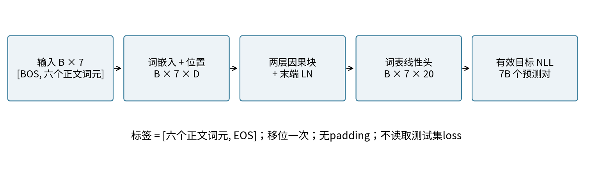
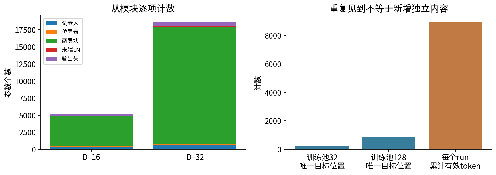
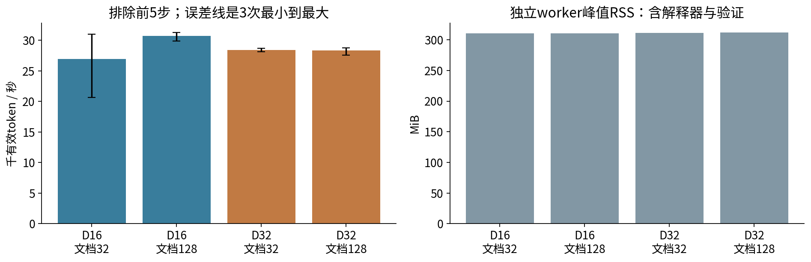
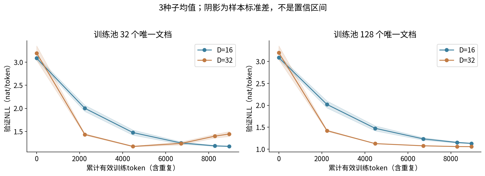
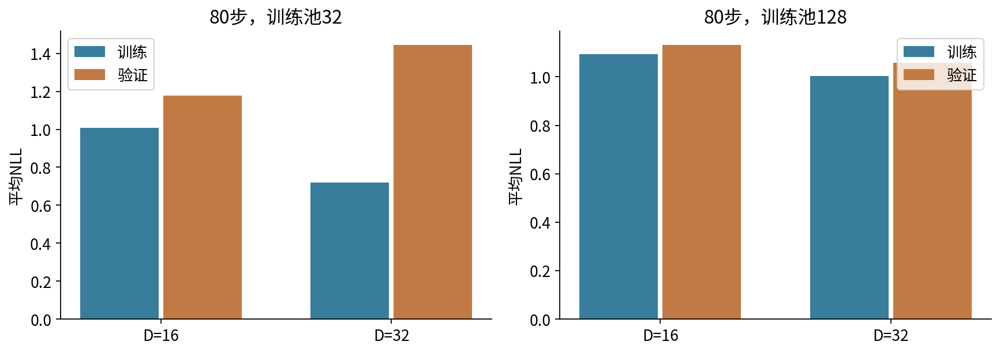
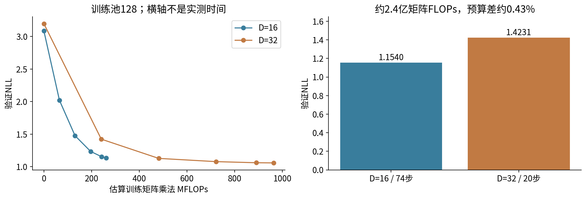
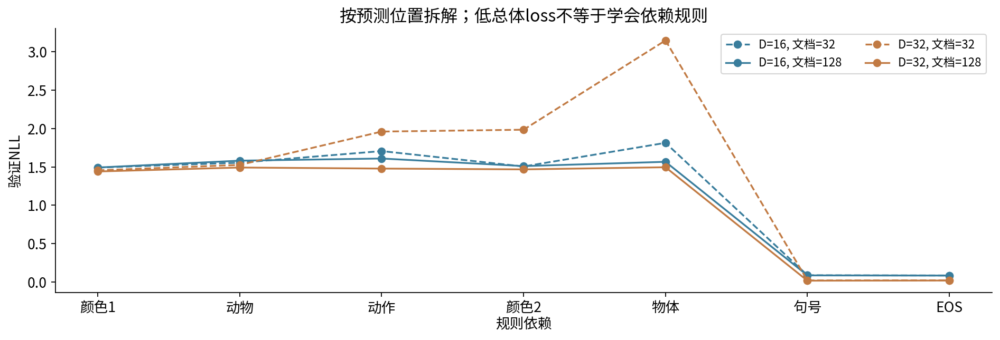

# 小型语言模型训练与规模

## 第055单元 在明确预算内训练和解释一个decoder

本讲真的训练一个小型自回归Transformer，但最重要的结果不是“更大一定更好”。在固定32份训练文档下，把宽度16增至32，使三种子平均训练NLL由1.008降至0.721，验证NLL却由1.178升至1.445。增加模型容量、增加独立数据、重复已有数据和增加计算量，是不同干预，必须分开报告。

目录先修为033至035、054、065。033至035涉及优化与训练稳定性，054提供标签、mask和有效token。为保持本讲独立可学，不要求读者先取得065：本讲第六节直接补齐计时边界、warm-up、吞吐、峰值内存和理论FLOPs的最小测量知识。没学过系统性能分析也能按手册完成。

本实验有12个预先固定配置：宽度16或32，唯一训练文档32或128，初始化种子5501至5503。每个配置80步、批大小16、每样本7个预测目标、CPU float32、单线程。每run最多8960有效训练token，全部配置共107520；不使用付费API、外部模型、网络语料或GPU。

交付物包含每步loss、裁剪前梯度范数、采样文档ID、计时、验证曲线、逐位置loss、参数计数和全部12个无pickle权重文件。结果保留全部配置，不按最低验证值删种子。测试划分只保存，未计算测试loss或用于调参。

## 一 先定义一个真的可审计的任务

词表V=20：PAD、BOS、EOS三个特殊符号；四种颜色、四种动物、四种动作、四种物体，以及句号。每条正文固定六词元：[颜色1,动物,动作,颜色2,物体,句号]。颜色2的类别索引等于(颜色1索引+动物索引+动作索引) mod4，其余四个自由选择各有4种，因此枚举得到$4^4=256$条唯一文本。

这些中文标签只是方便阅读的符号，句子可能不符合真实语义。任务同时包含类别选择、固定标点和一个依赖前三个内容选择的规则。总体loss下降可能主要来自学会固定格式，不能自动解释成掌握规则，更不能说掌握中文。

固定生成种子5500打乱256条，再取128训练、64验证、64测试。小数据池是训练池前32条，大数据池为全部128条。正文及唯一ID随包公开；唯一性按完整文本核对，词元和局部模板当然重合。验证集考察这套合成生成机制下的未见组合，不是不同语言域的泛化。

每条输入[BOS,六正文token]、标签[六正文token,EOS]，shape为B×7。对角可见的下三角mask不会泄漏目标，因为当前位置输入仍是目标之前的词元。独立样本占不同batch行，不需要跨文档packing。没有padding、截断和滑动窗口，因此有效目标数恰好是B×7。

### 比较时固定哪些条件

所有配置固定两层、四头、FFN=2D、pre-norm、ReLU、学习式位置表长7、末端LN、零dropout、不共享输入输出嵌入。AdamW步长0.003，beta为0.9和0.999，weight_decay=0.01，全局梯度裁剪阈值1。为保持教学简洁，衰减施加到所有参数，包括偏置与LN；不声称这是最优训练配方。

每轮将训练池随机排列，无放回取16个，取完再洗牌。数据顺序生成器固定5590，并与模型初始化分开。不同宽度看到相同池内样本顺序；三种子主要测初始化差异，不代表独立数据划分的不确定性。比较不同池大小时，既改变独立样本数，也改变每份样本重复次数，必须同时记录。

## 二 参数量必须按实现逐项数

用P表示参数总数，D表示残差宽度，F=2D为FFN宽度，n=2为层数，V=20，最大位置数Lmax=7。注意不要又用N同时表示参数和token数。一个含偏置的块参数为：

$$P_{block}=4D^2+2DF+9D+F.$$

4D²来自QKV及输出投影；2DF来自两个FFN矩阵；4D个注意力偏置、F+D个FFN偏置和4D个LN仿射参数合成9D+F。固定D时，改变合法头数H不改变这套矩阵参数数目，但会改变每头宽度与注意力分解。

完整模型还有词嵌入VD、位置表LmaxD、末端LN的2D以及不共享输出头DV+V：

$$P=VD+L_{max}D+nP_{block}+2D+DV+V.$$

手算D=16：每块4×256+2×16×32+9×16+32=2224；两块4448。词嵌入320，位置112，末端LN32，输出头340，合计5252。D=32时每块8544，两块17088，其他部分640+224+64+660，合计18676。

float32参数本体每个4字节，所以两模型分别21008和74704字节。这个数字不是峰值训练内存。AdamW还保存一阶、二阶矩，反向保存梯度，计算图还保存激活；解释器、库、分配器、数据和临时张量也占内存。只报模型文件大小会漏掉实际工作集。

如果共享输入嵌入与输出头权重，会少算一个DV矩阵，但共享参数需要真正指向同一Parameter，不能只初始化为相同值。本实验明确不共享，以便独立核对每项计数。

## 三 数据规模与token预算不是同一个数

本讲每步B=16、L=7，没有padding，故$T_{step}=BL=112$有效目标。80步累计$T=8960$；每run见到1280份文档曝光。32份池平均每文档出现40次，128份池平均10次。每次曝光都贡献优化梯度，但不是新增独立文档。

唯一目标位置数是“文档ID与文档内位置”的唯一配对数：小池32×7=224，大池128×7=896。它不是词表大小，也不是不同n-gram数量。相同词元ID可在很多不同上下文中形成不同预测事件。实际顺序和seen集合写入结果，避免用池容量代替实际访问计数。

若有padding或MLM，B×L只是处理位置数，真正有效数要对loss mask求和。若梯度累积g个微批再更新，在无padding的理想情形每次优化step有效token为gBL；多设备还需说明是每设备还是全局总数。054已经推导：不同微批有效数不等时，要按总sum_loss/总有效数缩放，不能机械平均batch mean。

### 本次预算先于结果固定

每run最多80步、8960有效token；全12run最多107520有效token。单worker训练循环在步边界检查180秒上限，父进程对整个worker设置240秒超时。超时属于未完成；步边界触发时写出partial-results.json，进程级超时也不会被标成完成，不自动扩大预算。实际整轮12配置约42秒，但这包括进程启动等外层成本，与训练吞吐的计时边界不同。

验证只在固定0、20、40、60、74、80步进行。74步是预先安排的近似等矩阵计算量比较点，不是看曲线后挑出的最佳步。没有early stopping、学习率搜索或根据验证集换seed。第80步权重均保存；不只保存表现最好的一个。

训练loss记录为更新前当前微批的NLL；最终训练NLL是训练池全部样本重算的平均。这两者不能随意混用。验证是固定64文档的448个有效目标；每个checkpoint都按总token平均，不把7个位置或多个微批再次不等权归约。

## 四 从矩阵乘法估计主要计算量

先声明计数规则：一次乘法加一次加法算2 FLOPs。矩阵A形状m×k、B形状k×n，主乘加约2mkn。忽略偏置、LN、ReLU、softmax、embedding查表和优化器逐元素运算，我们估计一个块前向：

$$C_{block,fwd}\approx8BLD^2+4BLDF+4BL^2D.$$

QKV投影是3个D×D矩阵，合计6BLD²；输出投影2BLD²，合为8BLD²。FFN两次乘法各2BLDF，合4BLDF。QK转置与AV各2BL²D，合4BL²D。H个头、每头d=D/H，求和后Hd=D；本实现显式算完整L×L矩阵，即使因果mask屏蔽未来，也不能假设只付一半乘法代价。

最后词表头再加2BLDV，n层总和为：

$$C_{fwd}\approx n(8BLD^2+4BLDF+4BL^2D)+2BLDV.$$

代入B16、L7、n2、V20：D16前向1089536 FLOPs，D32前向4014080 FLOPs。训练反向通常需对输入和权重各做相近量级乘法，因此这里用$C_{train}\approx3C_{fwd}$作为主矩阵运算估计。它不是实测硬件指令数，也没有算数据读取、内存带宽或全部非矩阵运算。

D16每步约3268608，80步约2.6148864亿；D32每步约12042240，80步约9.633792亿。相同token预算时，大模型的估算训练矩阵计算量约为小模型3.684倍；所以“80步对80步”不是等计算比较。

更粗的$6PT$规则只在参数主导的稠密乘法占主要成本、参数定义一致等条件下有用。嵌入查表、注意力的L²项、输出词表与权重共享都会改变解释。本实验保留展开公式，让读者能指出哪些项被近似掉。序列很长时L²项可能重要，不能拿短序列测量外推长上下文成本。

## 五 从真实loss沿梯度走到AdamW的两步

每个训练微批输出B×7×20 logits，经054的NLL对112个目标平均。对于词表头偏置b的颜色“蓝”坐标3，梯度是所有位置$(p_{i,3}-\mathbf1[y_i=3])/112$之和。这里把共享偏置的一条真实梯度路径拿出来复算；其余网络梯度来自053已展开的块链式法则。

以D16、训练池128、seed5501的实际前两步为例。第一步b初值-0.102765769，原始梯度-0.040450431；从softmax概率与标签直接相减求平均得到-0.040450435，差在float32舍入量级。全部参数梯度拼起来的L2范数为1.103647232，所以要一起缩放，选中坐标裁剪后为-0.036651563。

PyTorch的裁剪比例近似$\min(1,1/(\|g\|_2+10^{-6}))$，所有参数共享这一比例。不能按单个标量自己的绝对值裁剪后声称复现全局梯度裁剪。[3] 记录返回的是裁剪前范数，是否触发裁剪由它与阈值比较。

AdamW先做解耦衰减，再用偏差校正后的矩更新：[2]

$$m_t=0.9m_{t-1}+0.1g_t,\quad v_t=0.999v_{t-1}+0.001g_t^2.$$

$$\widehat m_t=m_t/(1-0.9^t),\quad\widehat v_t=v_t/(1-0.999^t),$$

$$b_t=(1-\eta\lambda)b_{t-1}-\eta\widehat m_t/(\sqrt{\widehat v_t}+10^{-8}).$$

这里eta=0.003、lambda=0.01，g是裁剪后的梯度。第一步m=-0.00366515643，v=1.34333709e-6，更新b=-0.099762686。第二步重新前向得到原始梯度-0.027915739，全局范数1.044882536，裁剪后g=-0.026716603。由旧矩累加得m=-0.00597030111、v=2.05577066e-6，更新b=-0.096820138。

测试从记录中的g、m、v独立复算两步，验证解耦衰减和偏差校正。训练loss、梯度、裁剪、优化器状态、参数变化构成同一条可检查证据链；只看到loss下降不足以证明优化器配置正确。

## 六 不依赖065的测量入门

计时前先问“计了哪段”。本实现每步从取出batch索引开始，到zero_grad、前向、NLL、反向、裁剪和optimizer.step结束。用time.perf_counter的差计算墙钟时间。CPU操作在这个实验中同步执行；若迁移到GPU，异步kernel需要另外用同步或CUDA events制定协议，不能直接照搬CPU计时。

前5个真实更新参与训练和token预算，但从稳态吞吐统计中排除，因为初始化与冷启动可能影响时间。剩余75步有效token=8400，吞吐为8400除以这75步总耗时，而不是逐步吞吐的简单平均。验证、模型构造、文件写入、进程启动不进入该分母；整轮wall_seconds另行记录。

每个配置在新Python子进程中训练，所以Linux resource.getrusage给出的ru_maxrss是该worker的生命周期峰值。Linux返回KiB，本代码乘1024转字节；它包含解释器、库、模型、优化器、训练和验证的峰值，不能只归因于某层激活。[4] 其他平台语义可能不同，本实验只对Linux填写这个数。启动环境也可能改变峰值基线，Notebook重跑与独立命令的RSS不能当成纯模型内存差来比较。

本次12worker峰值约310.3至311.9 MiB，远大于参数本体20.5或73.0 KiB。这并不意味着参数增加没有内存成本，只说明在这么小的模型里固定开销占主导。GPU峰值显存字段为null，原因是CPU-only未测；null不能写成0 MB显存需求。

本次稳态吞吐约2.07万至3.13万有效token/秒。个别更宽配置并没有更慢，共享机器噪声、调度和矩阵尺寸效率都可能影响结果，不能据此作稳定性能排名。硬件为Intel Xeon Platinum8573C，Python3.12.14、torch2.7.1+cpu、numpy2.3.5、单线程。换硬件或负载须重测，理论FLOPs不等于秒数。

## 七 固定token预算下的全部结果

下表为第80步全部12次结果的分组摘要。每格均值来自3个初始化种子，±后是样本标准差，分母n-1；它描述这3次初始化波动，不是95%置信区间，也没覆盖数据划分变化或超参数搜索的不确定性。

|宽度D|唯一训练文档|参数P|训练NLL均值|验证NLL均值 ± 标准差|
|---|---|---|---|---|
|16|32|5252|1.008050|1.177665 ± 0.006952|
|16|128|5252|1.093558|1.132714 ± 0.008226|
|32|32|18676|0.720835|1.445337 ± 0.053665|
|32|128|18676|1.004230|1.058465 ± 0.003327|

同为32文档，大模型训练更贴合已有样本，但验证更差；同为宽度32，把数据池增到128后验证明显改善。这个模式与小池下过拟合相符，但本实验只改变预先固定的池大小，没有用更多随机数据划分建立普适因果量化。

## 七补充 用基线和完整失败记录约束结论

验证差距先于“哪种模型更好”的判断。训练池32、大模型的三种子平均训练NLL为0.720835，验证为1.445337，相差约0.724502；小模型相应差距约0.169615。两种宽度都在同一训练池上优化；较低训练误差不保证未见组合也同样改善。

所有配置都优于20类均匀基线ln20≈2.995732；训练池拟合的加一平滑bigram验证NLL，小池为1.899033、大池为1.482738。这些基线只使用各自训练池计数。超过基线只说明在此指标下有改进，不等于解决所有依赖规则。

Unigram忽略上下文，只计目标词元频率。若类别k在训练标签中出现c(k)次，总目标数为N，加一平滑给出p(k)=[c(k)+1]/[N+V]。Bigram按当前输入a统计下一目标b，p(b|a)=[c(a,b)+1]/[sum_j c(a,j)+V]。V=20与模型头一致，包括未在该条件下出现过的类别；加一平滑让有限训练池中的未见转移仍有非零概率。两个基线都没有读取验证标签来拟合概率。

例如预测第一个颜色时当前输入是BOS。小池32个样本对应32次BOS条件，总分母为32+20=52；某颜色的概率分子是其训练池首位计数加1。验证时只按已经固定的概率查表并取负log，再对448个验证目标平均。把验证频数加入计数会使基线评价发生泄漏。

我们不在看到80步退化后删除该配置，或改报某个较早最优checkpoint。若下一项研究要用early stopping，应另行规定验证选择规则与测试使用方式。这里保留固定预算末点，是为了让负面结果和计算支出对齐；它并不声称每个架构都已经调到最优。

## 八 换成近似等计算预算 结论会变化

大池128下比较D16第74步与D32第20步。展开矩阵公式得到训练计算量分别241876992和240844800 FLOPs，相差约0.43%。这只是近似相同的“矩阵计算量”口径，不是相同实测时间，也不完全相同的全部训练运算。

D16第74步三种子平均验证NLL约1.153986，D32第20步约1.423127。较小模型在这个较紧预算下更好；而第80步对第80步时大模型更好。两个答案并不矛盾，因为比较条件不同。小模型74步见到8288有效token，大模型20步见到2240，优化机会本来就不同。

这仍不足以宣称“最优计算分配已找到”。只比较两个宽度、固定两层、一个步长和两个数据池，没有为每个模型调优。学习率、训练长度、网络深度、数据难度都可能改变前沿。我们能证明的是：必须先指定预算口径，不能把固定token结果冒充固定计算结果。

### 参数 数据和计算三者的约束

在简化稠密近似$C\approx6PT$下，固定C会使可训练token约为$T=C/(6P)$。P加倍可能让可支付T减半；若原模型已经数据不足，继续加大参数就未必合算。真实模型还受注意力长度、词表输出、内存和硬件利用率影响，因此预算规划应保留展开项和实测校准。

反过来，重复已有样本能增加T，却不增加唯一数据覆盖。计算预算和数据预算必须分别定义；不能用“训练了十万token”隐去其中大部分是几十条文档的重复。

## 九 低平均loss仍可能没有学会规则

把验证loss按7个预测位置拆开。D32、128文档的三种子平均中，句号和EOS约0.02以内，而颜色2仍约1.467887。颜色2由前三个选择确定，但模型并未在这个固定训练预算下显示出接近确定预测的表现。平均值下降可以由容易的格式位置驱动。

只在四种颜色中均匀预测的NLL为ln4≈1.386294。当前颜色2 loss甚至略高于这个受限候选基准；这支持“尚未展示学会规则”的谨慎描述，但不能仅凭一个平均loss证明模型内部绝对没有任何规则表示。

原始生成分布如果均匀独立选择四个自由变量，理想模型需要预测四次4选1，其余三次确定，所以平均条件熵为$4\ln4/7\approx0.792168$。这是完整生成分布的理论量，不是本有限验证子集的严格经验下界。训练池只有32条时模型可记忆它们，训练loss低于0.792并不矛盾；有限子集的条件分布和重复权重已经不同。

还要区别表示能力和训练成功：一个架构可以表达某个规则，不代表80个更新会找到它。若要进一步验证，应事先定义规则位置准确率、组合外推集和多数据划分，并控制预算与超参数。这些扩展不属于本单元的已执行证据。

## 十 缩放关系是待检验的经验假设

规模研究常用带不可约项的经验形式描述观察区间内损失，例如：

$$\mathcal L(P,T)=\mathcal L_\infty+aP^{-\alpha}+bT^{-\beta}.$$

这不是普遍数学定律。参数范围、训练充分程度、数据分布、重复率、模型族、分词器和优化方法都影响拟合。Kaplan等和Hoffmann等分别研究了特定实验条件下的规模与计算配置，不能把其指数无条件搬到本课。[1]

若先假设$L_\infty$已知，可对$L-L_\infty$取log，把单变量幂律变成直线形式。但$L_\infty$未知、数据量不足或负差值时，拟合可能不稳。两个宽度点总能被一条直线连接，几乎不能检验曲率、饱和、模型失配或外推误差。本讲明确不拟合幂律指数。

一份更可信的规模研究应覆盖多个规模点与重复种子，对每个点说明训练预算和优化设置；留出至少部分规模点检验预测，报告残差、区间和失败外推。若在多个模型中挑最好结果再拟合，也要披露选择过程与搜索成本。参数越大、模型能力必然怎样这样的远距离外推，在本实验中没有证据。

### 结论应写到哪里为止

“我们在256条合成文法中的固定划分上，训练了12个有预算上限的CPU decoder。固定token下，较大模型在小池出现更低训练loss和更高验证loss；大池下较大模型较好，但近似等矩阵计算量的紧预算比较偏向小模型。逐位置分析显示确定规则尚未学好。结果不能外推前沿模型能力或自然语言任务。”

复現时先跑test_experiment.py和-O版本，再跑完整experiment.py，最后执行Notebook或读取已执行版。npz保存模型state_dict数值，用allow_pickle=False读取；没有保存优化器和随机状态，不声称支持无缝断点续训。精确复现实验应从固定种子和数据重新开始。

## 十一 一手来源和可复现证据

[1] Kaplan et al. Scaling Laws for Neural Language Models，2020，https://arxiv.org/abs/2001.08361 ；Hoffmann et al. Training Compute-Optimal Large Language Models，2022，https://arxiv.org/abs/2203.15556 。支持规模研究的动机与实验性，而非本讲小模型的指数或最优性。

[2] PyTorch2.7 AdamW，https://docs.pytorch.org/docs/2.7/generated/torch.optim.AdamW.html 。核对矩更新、偏差校正和解耦weight decay。两步数字来自实际训练，不是文档中的例子。

[3] PyTorch2.7 clip_grad_norm_，https://docs.pytorch.org/docs/2.7/generated/torch.nn.utils.clip_grad_norm_.html 。核对全局范数、原地缩放和返回裁剪前范数。

[4] Python resource，https://docs.python.org/3/library/resource.html 。系统资源计数接口；本课字节转换只适用于已测试Linux。GPU内存接口可参考PyTorch2.7 max_memory_allocated，https://docs.pytorch.org/docs/2.7/generated/torch.cuda.max_memory_allocated.html ，但本实验没有调用或测量它。

[5] Vaswani et al. Attention Is All You Need，2017，https://arxiv.org/abs/1706.03762 。因果自注意力和Transformer的结构背景。

源码generate_data.py定义语料和划分；experiment.py定义模型、预算、优化、计时和结果；test_experiment.py独立核对参数公式、FLOPs、因果性、标签移位、两步AdamW和12个权重回读；make_figures.py从全部结果重画图。outputs/runs中每个配置有80步记录和weights.npz；outputs/protocol.json在训练前写入，outputs/runtime.json记录实际环境。

讲义、实验、答案均可离线独立阅读。图使用原创合成数据，不含用户私有资料或论文截图。页面核验于2026-10-05。任何真实硬件、真实语料、其他精度或长上下文主张，都需要新的测量或实验，而不是修改这份小规模结论的措辞。
