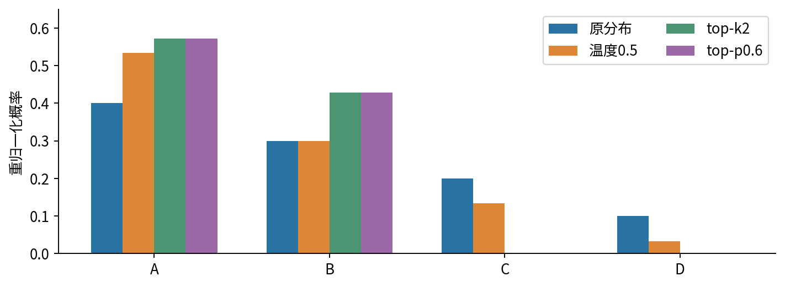
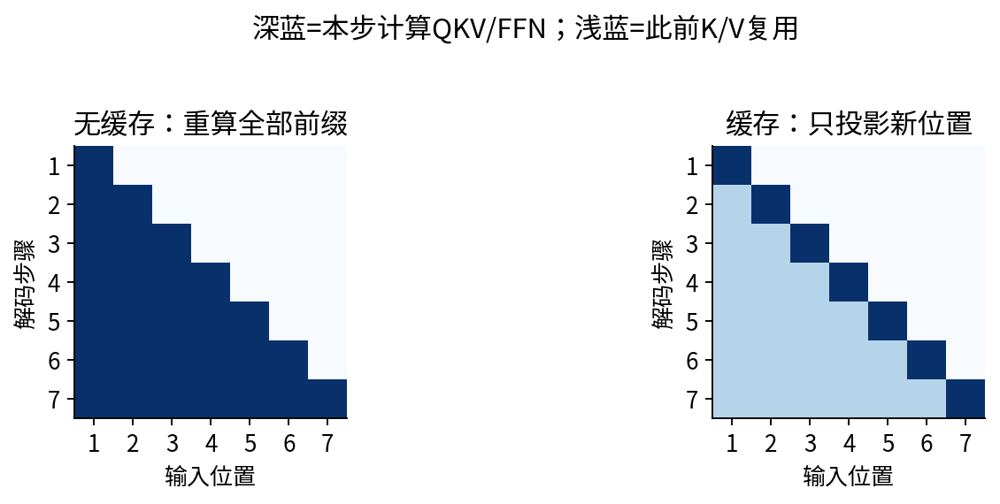
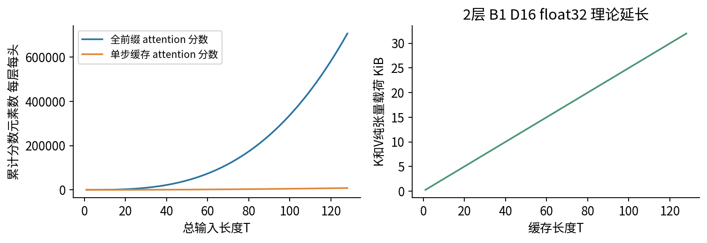
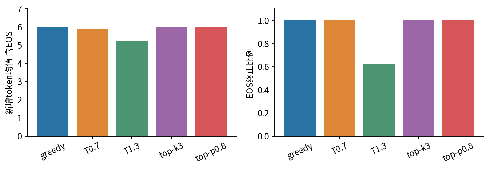
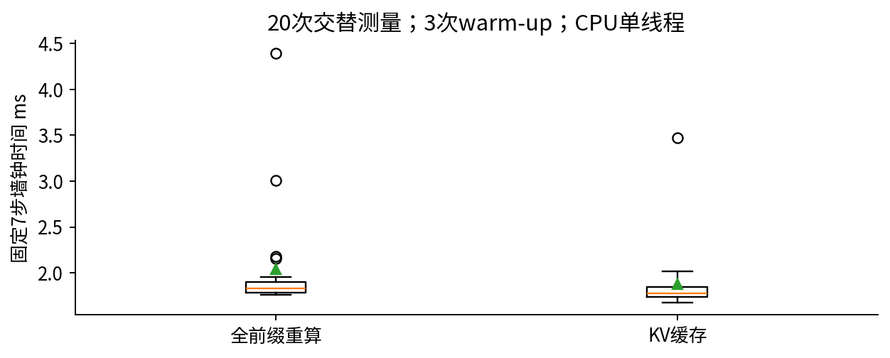

# 生成解码与KV缓存

## 第056单元 同一组权重怎样产生不同输出

训练给我们的是“给定前缀，下一个词元各有多大概率”的模型；生成还需要一条从分布中挑词元、更新前缀和停止的规则。本讲固定一个已训练的小decoder，只改变解码配置，并用逐项计算证明KV缓存没有偷偷换模型。采样的多样性、任务正确率、输出长度和延迟必须分别观察。

目录先修为054。为了独立阅读，这里补齐三件事：logit是softmax之前的实数分数；自回归是把已经输出的词元放回下一步输入；因果mask使过去位置不能读取未来位置。你需要会数组shape、内积和指数函数，不必下载任何大模型，也不用付费API。

实测中，温度1.3的32条生成只有20条以EOS结束，出现8次相邻词元重复；其他四组都没有相邻重复。所有配置的“重复二元组比例”却都是0。这提醒我们：一个看似正常的退化指标，可能根本没测到我们关心的现象。

本课使用055已公开的d16_n128_s5501检查点，选择理由是固定教学基线，未在本课挑最高分模型。权重、词表、数据和来源SHA随包提供，可脱离055目录运行。模型只有7个输入位置，实验结论局限于短合成符号句，不代表自然语言生成质量。

## 一 从模型分布走到一个词元

设词表有V个符号，当前前缀为$x_{1:t}$。模型输出长度V的向量$z$，其中$z_i$可以为负，也不需要加起来等于1。softmax把它变成概率：

$$p_i=\frac{\exp(z_i)}{\sum_{j=1}^{V}\exp(z_j)}.$$

分子非负，分母是所有分子之和，所以概率之和为1。为避免指数溢出，实际实现先减去最大logit；分子分母同乘一个常数，概率不变。本课使用PyTorch的稳定softmax，不手写不稳定的exp比值。

取四个词元A、B、C、D，令logit分别为log0.4、log0.3、log0.2、log0.1。指数还原为0.4、0.3、0.2、0.1，总和为1，便得到这个概率分布。贪心选最大概率的A。按概率采样则仍可能选B、C或D。

可以用累计区间理解采样：A占[0,0.4)，B占[0.4,0.7)，C占[0.7,0.9)，D占[0.9,1)。若均匀随机数是0.65，就落在B区间。代码用torch.multinomial完成等价的类别抽样；固定随机种子只控制本实现的随机序列，不保证跨版本或设备逐位相同。

### 贪心不等于整句最可能

若第一步A概率0.6、B概率0.4；选A后最可能的第二词元条件概率为0.4，选B后则为0.9。贪心的两步联合概率是0.6×0.4=0.24，而另一条路径是0.4×0.9=0.36。局部最大没有保证全局最大。完整序列的概率由各步条件概率连乘：

$$p(x_{1:T})=\prod_{t=1}^{T}p(x_t\mid x_{1:t-1}).$$

比较对数概率时变成逐步log概率相加。直接优化这个分数还会受长度和EOS影响；本课不实现beam search，也不把最高模型概率当成事实正确性。

## 二 温度改变相对偏好而非可靠程度

正温度T把logit除以T，再做softmax：

$$p_i(T)=\frac{\exp(z_i/T)}{\sum_j\exp(z_j/T)}=\frac{p_i(1)^{1/T}}{\sum_jp_j(1)^{1/T}}.$$

第二个等号来自把原softmax的共同分母约掉。因此T=0.5等价于把概率平方再归一化。四项平方为0.16、0.09、0.04、0.01，总和0.30，结果依次为0.533333、0.300000、0.133333、0.033333。最大项变得更突出，但它仍然可能是一个错误答案。

T接近0的正侧极限会集中到最大logit；若存在并列最大，极限不会自然指定某一个词元。代码的贪心是单独分支，argmax按首个最大索引破同分，不允许T=0去除法。T增大使有限logit的分布更平；它不会提供“百分之多少可信”的刻度。

## 三 top-k与top-p究竟保留谁

top-k先按概率降序排列，只保留前k项，剩余概率置零，再把保留项除以它们的和。k=2时保留A、B，总概率0.7；新概率为4/7和3/7。被删去的C、D再也抽不到。这是改变采样分布，而非从原分布无偏抽样。

top-p又称nucleus sampling。排序后寻找最短前缀，使累计概率达到或超过阈值p；包含首次跨过阈值的那一个词元。p=0.6时，单独A只有0.4，不够；加入B达到0.7，于是保留A、B。若错误地只保留“累计概率小于0.6”的项，就会误删B。

代码中的判据是“当前项之前的累计质量小于阈值”，并保证p=1保留全部候选。概率边界附近受浮点舍入影响；遇到同分，本实现稳定排序，按原词元ID顺序取恰好k个。不同库的同分处理和过滤次序可能不同，复现实验应记录具体策略。

如果同时使用温度、top-k、top-p，本实现顺序为：温度缩放，top-k，重新归一化，再在这个剩余分布上做top-p。顺序不同可能得到不同集合。本次正式比较每组只用一种截断，避免把联合效应混成单个因素。

## 四 自回归循环及其停止契约

我们的词表有20项：PAD=0、BOS=1、EOS=2，随后是四种颜色、动物、动作、物体及句号。PAD、BOS可以作为输入符号，但在生成时把它们的logit置为负无穷，使输出概率为0。正常路径至少还有一个有限logit，不能让整行都是负无穷。

一个prompt是[BOS,颜色1]，长度2。先一次性处理这两个词元，取最后位置的logit，产生动物；把动物加入前缀后产生动作，如此继续。注意最后位置的logit预测的是“下一项”，不能把它理解成给当前位置的输入打标签。

每次生成后先检查EOS，再决定是否继续。最多新增6个词元，包含可能的EOS。由于第六次预测只需要长度7的输入，最终返回的序列可以长8；最后输出不需要再次送入模型。合法条件是prompt长度+max_new-1不超过7，而不是简单地限制返回序列长度。

stop_reason明确记录eos或max_new_tokens。达到长度上限不等于自然结束。prompt若已经含EOS，代码拒绝继续；若请求超过位置表容量，也直接报错，不静默裁掉前缀。真实应用还可能有超时、取消、批内不同结束长度等情况，本课只实现单条生成，缓存模块本身支持等长批次。

## 五 为什么过去的K和V可以保留

一个注意力头的query、key和value由对应位置的隐状态投影得到。因果网络中，位置i只依赖1到i的输入；在权重固定、eval模式下，后来增加位置i+1不会改变位置i的隐状态。因此每一层过去位置的K、V也不变，可以原样复用。

第t步只需计算新位置的$q_t,k_t,v_t$，将新K、V接到历史之后：

$$a_t=\operatorname{softmax}\left(\frac{q_tK_{1:t}^{\mathsf{T}}}{\sqrt{d_h}}\right),\qquad h_t=a_tV_{1:t}.$$

这里$q_t$形状为B×H×1×d_h，缓存K、V均为B×H×t×d_h；分数是B×H×1×t，加权和返回B×H×1×d_h。四个头合并后是B×1×D，本实验D=16、H=4、d_h=4。

每层必须分别缓存，因为各层的输入隐状态不同。缓存不是把整段原始token替换为一个向量，也不缓存每个未来query。FFN和LayerNorm逐位置计算，新位置仍要完整通过每一层。

## 六 位置偏移与非方形mask最容易出错

prefill表示第一次处理整个prompt。若prompt长P，位置索引必须是0到P-1。后续输入一个新token时，位置索引是P，而不是又从0开始。缓存长度就是本次位置表的起始偏移；丢失这个偏移会改变模型的含义。

还可以一次送入多个新token，称为chunked decode。若已有P个缓存，当前chunk长C，则分数矩阵是C×(P+C)，不再是方阵。chunk中局部第i行的绝对位置为P+i，只允许访问key索引j不超过P+i：

$$\mathrm{allowed}(i,j)=[j\leq P+i].$$

例如P=3、C=2：第一行允许0、1、2、3，屏蔽4；第二行允许0到4。若机械套用一个C×C三角矩阵，要么shape错误，要么误屏蔽已有历史。本实现按绝对位置生成布尔forbidden矩阵，再用负无穷mask。

验证分三层：完整前向与分块前向logit逐项接近；相同随机种子下采样输出一致；未来token改变不影响过去logit。正式160条生成全部通过，最大绝对logit差为0.000001430511。小误差来自不同矩阵形状下的浮点计算顺序；一般情况下若两个候选极近或随机数恰在边界，小数值差也可能改变采样路径，不能把本次一致推广成所有硬件逐位保证。

## 七 缓存节省什么又消耗什么

标准多头注意力的K和V纯载荷字节数为：

$$M=2nBHTd_hs=2nBTDs.$$

n是层数，B是批大小，T是已缓存输入长度，s是每元素字节数，前面的2是K与V。代入n=2、B=1、T=7、D=16、float32的s=4，得到1792字节。它不包括权重、当前query、attention分数、临时拼接内存、Python对象和内存分配器。动态torch.cat还会复制旧缓存并短暂保留旧新张量；生产级缓存常用预分配等办法减少复制。

若每步都重算长度t的整个前缀，每层每头构造t²个attention分数；生成至总输入长度T，累计为：

$$\sum_{t=1}^{T}t^2=\frac{T(T+1)(2T+1)}{6}.$$

缓存后每步只有一个query读取t个key，累计为T(T+1)/2。于是仅attention分数计算的累积数量级从T³变为T²。投影和FFN的重复位置数则从T(T+1)/2变为T。实际有长prompt时还需单独计一次P²的prefill，再加后续各步读取缓存的成本。

因此“缓存后整段生成是线性时间”不成立：每个新query仍要读越来越长的历史。模型宽度、词表投影、内存带宽、批大小和实现开销也影响时间。多查询或分组查询注意力可减少KV头数，但本代码没有实现这些结构。

## 八 固定协议看真实结果

我们取训练池前4份文档中的颜色前缀，固定8个采样种子5601至5608，比较贪心、T0.7、T1.3、top-k3和top-p0.8。每配置32次，共160次缓存生成，另做160次无缓存对照。它们是四个教学prompt上的重复随机输出，不能当成32个独立自然语言任务。

| 配置 | 平均新增长度 | EOS比例 | 不同组合数 | 相邻重复次数 |
|---|---:|---:|---:|---:|
| 贪心 | 6.000 | 1.000 | 4 | 0 |
| T0.7 | 5.875 | 1.000 | 28 | 0 |
| T1.3 | 5.250 | 0.625 | 32 | 8 |
| top-k3 | 6.000 | 1.000 | 29 | 0 |
| top-p0.8 | 6.000 | 1.000 | 30 | 0 |

“不同组合数”把prompt索引一起计入，每个prompt只有8次机会，跨prompt相同文本不合并。相邻重复计数检查t_i=t_(i+1)；重复二元组比例则是1减去不同二元组数除以全部二元组数。一条“猫 猫 狗”的相邻重复为1，却没有重复出现的二元组，所以后一个指标为0。短序列尤其容易让单个重复指标失去诊断能力。

缓存与无缓存计时必须固定工作量。我们另取一条固定7输入token序列，不抽样、不因EOS停机，先warm-up三次，再交替次序测20轮。无缓存中位数1.832毫秒，缓存1.773毫秒，约1.03倍。这种微小差异会随机器负载变化，不能宣称确定的显著提速；理论减少计算并不保证极短小模型有巨大实际收益。

本讲可以验收的是：你能从logit算出解码分布，明确停止规则，正确维护各层缓存、位置和mask，并用完整输出验证等价性。你还不能根据采样更花样、温度更低或某次延迟更小，就宣称模型更聪明、更可信或系统已经优化完毕。

## 九 用两维数值走完一个缓存步骤

前面的公式看起来像矩阵运算，实际上是在做“对历史信息加权平均”。取一个头，头宽度2，省略批轴。历史有两个key：k1=(1,0)、k2=(0,1)；对应value为v1=(2,0)、v2=(0,2)。新输入得到q3=(1,1)、k3=(1,1)、v3=(2,2)。先不要把这组手造数字当作真实模型权重，它只用于看清一次运算。

新query与三个key的内积分别为1、1、2，除以根号2后约为0.707107、0.707107、1.414214。为稳定softmax，三项一起减去最大值，得到-0.707107、-0.707107、0。指数约为0.493069、0.493069、1，总和1.986138。因此注意力权重约为0.248255、0.248255、0.503490。

按这三个权重对value求加权和：第一坐标为2×0.248255+0+2×0.503490，第二坐标为0+2×0.248255+2×0.503490，均约1.503490。这个结果仍需经过本层输出投影、残差和FFN；不能把它直接当词表概率。

缓存只保存旧k1、k2和v1、v2。没有缓存时会从原输入重算它们；有缓存时直接拿来拼接。只要旧输入、位置、权重和推理规则完全一致，两条路径送进这个加权平均的数值相同。因此等价性来自计算图中哪些量不变，不能靠“结果读起来差不多”判断。

多头不过是同时做几组这样的运算。每个头有自己的投影，得到各自的加权和后再拼接；同一词元在不同头里的向量通常不同。批轴则让多个样本平行计算，本课批量缓存测试使用相同长度，但每个样本的数据彼此独立。

## 十 把缓存当作有条件的中间结果

复用缓存有一个常被忽视的前提：缓存必须属于当前这段历史。即使两份缓存的shape完全一样，只要它们来自不同prompt，也不能互换。形状检查能抓住维度错误，却无法证明语义身份正确。服务系统还需要把请求身份、token前缀、位置策略和模型版本与缓存关联。

如果用户修改了前缀中的某个旧token，这个位置及之后各层隐状态可能变化；继续使用全部旧缓存就会把两个不同计算混在一起。改变模型权重、切换适配器、修改位置编码规则也会使旧缓存失效。本课每次generate都从cache=None开始，因此不同prompt不会共享缓存；没有实现跨请求复用。

推理模式与不求梯度也解决不同问题。model.eval()设置模块推理行为，例如关闭dropout；torch.no_grad()停止构建反向传播图。本模型没有dropout，但仍显式检查eval模式，以免后来扩展网络时错误地缓存带随机性的中间结果。不求梯度本身不会自动让dropout停止。

将实现写成循环不变式会更容易审查：第一次前向处理完整prompt；每次抽样前，当前最后logit对应所有已处理输入；每次缓存长度等于已处理输入长度；若还要继续，下一次只处理刚抽出的token；若抽到EOS或达到输出上限，立即退出，不为最后输出额外调用模型。

这样的约定把“代码能跑”转成“每一步都有明确意义”。在真实系统中，还需处理不同样本的padding、不同终止时间、请求取消、缓存淘汰和内存不足。本实验有意不覆盖这些服务工程问题；从短模型的正确单请求实现走向线上系统，需要另外的协议和压力测试。

## 原始资料与继续阅读

- Holtzman等，The Curious Case of Neural Text Degeneration，ICLR 2020，讨论生成策略与nucleus sampling：[原论文](https://arxiv.org/abs/1904.09751)。
- Hugging Face，How caching works，关于逐层K/V、位置长度和缓存张量的官方说明：[文档](https://huggingface.co/docs/transformers/cache_explanation)。本课自行实现，不依赖Transformers包。
- PyTorch，torch.multinomial，说明按权重抽样的接口：[官方文档](https://docs.pytorch.org/docs/2.7/generated/torch.multinomial.html)。
- 本课数值、代码、图与合成演示独立构造；来源访问核对日期2026-10-06。更详细的适用边界见sources.md。
