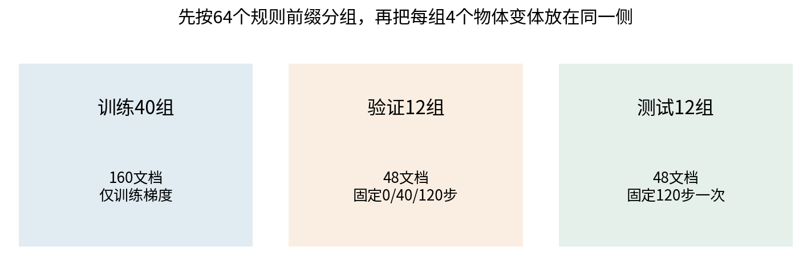
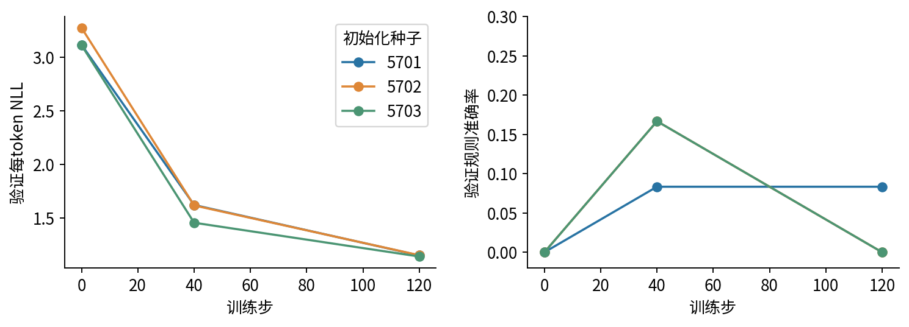
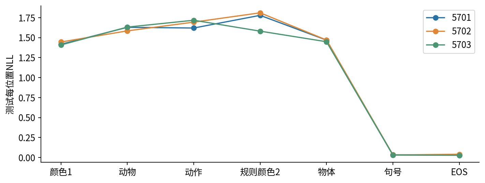
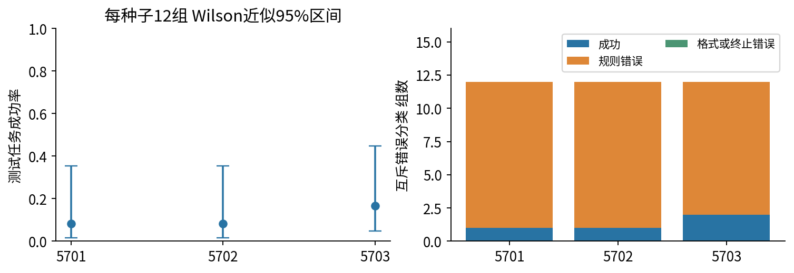

# 语言模型实验与评价

## 第057单元 从零训练路线的证据验收

一个语言模型可以把句号和结束符预测得很好，却没有学会一句话中真正需要推理的规则。本课从随机初始化训练三个小decoder，最后三者在测试集的格式成功率都是100%，规则任务成功却只有1/12、1/12和2/12。我们保留全部失败，把“loss下降”拆成可审计的证据链。

目录先修为022、040、055、056，分别提供指标、不确定性、训练和解码基础。本讲仍从分母、条件概率、测试集和区间的含义开始补齐，读者可以用本单元的代码、原创数据与无pickle权重独立复现。使用CPU，不下载预训练模型，不调用外部裁判或付费API。本单元按原目录的从零训练路线验收；专做适配的路线不在本次实验中混入。

我们需要回答四个不同问题：给定真实前缀时目标token有多大概率；自由生成能否完成指定任务；错误集中在哪些类型；结论在有限样本下有多不稳定。一个分数无法同时回答这四问。

## 一 先确定评价的对象与单位

词表仍有20项，正文固定六token：[颜色1,动物,动作,颜色2,物体,句号]。前三个类别分别以0到3编码，规则颜色2的类别是它们的和mod4。物体有四种可接受选项，与规则颜色无关。句末还要预测EOS。

本课重新生成64个规则前缀组，每组包含四种物体变体，共256份文档。用固定种子5700打乱64组，前40组训练、接着12组验证、最后12组测试。每组的四份文档必须一起移动，所以训练160文档、验证48、测试48。测试时没有在训练中出现过完全相同的规则输入三元组。

“未见组”不表示词元也陌生。颜色、动物、动作与局部组合会共享；污染检查要明确检查到哪一层。程序核对完整token序列交集和前三内容token交集，两者均为0；词表重合是设计的一部分。若真实语料只做大小写、空格去重，也不能据此排除改写、翻译或模板泄漏。

## 二 从概率一步步得到困惑度

教师强制评价把真实前缀喂给模型。令第i个有效目标的预测概率为q_i，负对数似然为负log q_i。使用自然对数时，平均NLL单位可称为nat/token：

$$L=-\frac{1}{N}\sum_{i=1}^{N}\log q_i,\qquad \mathrm{PPL}=\exp(L).$$

若三个目标概率是1/2、1/4、1/8，负log分别0.693147、1.386294、2.079442，和4.158883，均值1.386294，指数为4。等价地，三个概率乘积是1/64，几何平均是1/4，其倒数为4。因此PPL并非概率的算术平均再取倒数，也不是实际候选答案数量。

这个定义要求每个q_i针对同一套tokenization、有效位置与上下文规则。换词表、截断策略或是否计EOS，会改变比较对象。不能把不同分词器下的PPL直接排成模型能力榜。

## 三 loss的分母比表面数值更重要

本实验每份文档提供7个有效目标：六个正文token与EOS。测试48份，所以N=48×7=336。先对所有336项求和，再除336。种子5701的测试sum_nll为382.922974，除336得1.1396517，再取指数得PPL3.125679。

如果两个batch分别有2和1个有效目标，batch平均loss分别1和3，正确总体平均是(2×1+1×3)/3=5/3，不是(1+3)/2=2。只有有效目标数量相同，简单平均batch mean才与token平均相同。padding必须用mask排除，不能让PAD进入分母。

教师强制下每一步都得到真实历史，而自由生成会把自己的错误回填。给定真实颜色1、动物、动作时算出来的概率，不等于从BOS完整生成时的成功率。本课任务评测明确给出[BOS,颜色1,动物,动作]，再贪心生成颜色2、物体、句号和EOS，最多四步，禁止输出PAD/BOS。这个prompt是任务定义，不是为了某个模型临时挑的有利前缀。

### 总体loss会被容易的位置拉低

种子5701的测试位置NLL约为1.4164、1.6289、1.6200、1.7786、1.4687、0.0336、0.0312。最后两项已经很低，规则颜色位置仍很差。七项平均下降，并不要求每一项都达到任务需要的水平。

本实验并没有按最好的验证规则分数挑checkpoint，而是事先固定120步。这不是推荐永远不选模型，而是用一个简单、可审计的协议说明：看完测试以后不能倒回去换seed、换步数，再把同一测试集当第一次验证。

## 四 精确匹配与任务成功是不同判据

精确匹配EM要求输出与参考答案完全一致。若参考只写“蓝 球 。 EOS”，模型输出“蓝 书 。 EOS”会被判0；但在我们的生成机制中，四种物体都有效，所以这不应该是规则任务失败。

本课同时报告三个量：rule_accuracy只看第一输出颜色是否正确；format_rate检查四步输出属于颜色、物体、句号、EOS的指定结构；task_success要求前两者都通过。一次错误只归入success、wrong_rule或format_or_stop_failure之一；优先把不合格式的输出归入格式类，避免重复计算错误总数。

对每个规则前缀，贪心只产生一条续写，而数据有四个物体参考。单参考EM按四份文档分别打分，所以正确且合格式的续写至多命中四份中的一份。即使所有规则全对，这个版本的EM上限也只有25%。这是参考答案设计造成的上限，不是模型必然差。

种子5701成功1个组，对应48份文档中命中1份，故task_success=1/12=8.333%，single_reference_EM=1/48=2.083%。种子5703成功2个组，对应2/12=16.667%和2/48=4.167%。把这两个分母混淆会产生四倍差异。

模型在本测试中format_rate全为1，错误全部是wrong_rule。三种子分别错11、11、10组。这说明格式和规则能力已经分离；不需要再借“文本看起来很像样”给模型加分。

## 五 小样本不确定性要与抽样单位匹配

12个独立规则前缀组提供12个二元任务结果，组内四个物体变体不能当成48次独立规则试验。我们用Wilson近似95%区间描述单种子的成功率，不把点估计当精确常数。令n是组数、k是成功组数、p帽=k/n，z=1.96：

$$c=\frac{\hat{p}+z^2/(2n)}{1+z^2/n}.$$

$$h=\frac{z\sqrt{\hat{p}(1-\hat{p})/n+z^2/(4n^2)}}{1+z^2/n},\qquad [c-h,c+h].$$

k=1、n=12时，p帽=0.083333，z²=3.8416，分母1.320133，中心约0.184375，半宽约0.169511，区间[0.014865,0.353886]。即使观察到0/12，区间上限仍约0.2425；“没看到成功”不等于真实成功率严格为0。

这里区间的解释有条件：把题组看作来自更广泛同类机制的近似独立样本。实际数据是64个有限组合的一次固定随机拆分，严格有限总体推断和模型训练依赖更复杂。因此我们将区间当作透明的近似不确定性描述，不宣称精确覆盖所有现实任务。

三个初始化种子复用了同一批题，不能合并成36道独立新题；种子范围也不能代替数据分布的不确定性。本课只报告逐种子结果及区间，不用显著性语言制造确定性。

## 六 从零训练与一次封存评价的实现

每个模型都从随机初始化开始，种子5701至5703。架构是2层pre-norm decoder、D16、4头、FFN宽32、ReLU、学习式位置表长7、零dropout，词嵌入与输出头不共享。参数共5252。完整源码model.py随包提供。

每个run固定120步、batch16、AdamW学习率0.003、weight_decay0.01，梯度范数裁剪到1。训练批次由独立生成器5790决定，每步对160份训练文档随机排列后取前16份；允许不同步重复抽到同一文档。每run有效训练曝光为120×16×7=13440 token，三run共40320。它不是新增独立token量。

验证在0、40、120步进行；测试只在预定120步模型上打开。各run保存全步loss、梯度范数、样本ID和最终NPZ权重。为了复现可重新训练与重新计算同一测试结果，但如果读者在看过这些结果后改变模型，就必须承认这些测试题已不再对新设计完全未知；新的最终主张需要另一份封存评价。

| 种子 | 测试NLL | PPL | 格式比例 | 任务成功 | 单参考EM |
|---|---:|---:|---:|---:|---:|
| 5701 | 1.139652 | 3.125679 | 1.000 | 1/12 | 1/48 |
| 5702 | 1.153957 | 3.170714 | 1.000 | 1/12 | 1/48 |
| 5703 | 1.120840 | 3.067429 | 1.000 | 2/12 | 2/48 |

仅用训练集拟合、加一平滑的bigram基线测试NLL为1.485876；均匀20词元基线为log20=2.995732。三个神经模型的NLL更低，但规则能力仍弱。因此“击败基线”必须说明击败的是哪个指标和任务。

## 七 人工评价与模型裁判的边界

开放式回答没有唯一精确答案时，可以用人工评价；但评价者需要任务背景、可核实的评分标准和独立作答。对事实性、是否完成请求、表达可读性应分别评分，不能只问“哪个看着更好”。

本课随包给出36条候选的blind_rating_sheet.csv，candidate_id经过固定随机排列，模型种子映射在单独blind_key.json。所有人工分数字段都是空白，本课没有招募评价者，也没有实际人工或模型裁判分数。组织者如果做练习，必须只给评价者题面和评分表，暂时保留映射文件；把两者一起打开就不再盲。

本合成任务能用确定规则自动判定，人工表只用于练习协议：先独立评分，再讨论分歧，保留原始评分及裁定理由。真实语言任务还要检查评价者间一致性、来源可核验性与危险错误。

若使用语言模型作裁判，仍应抽样人工复核、交换候选左右位置、隐藏模型身份、检查长答案偏好与自偏好，并将裁判失误单独记账。裁判说“很好”不是事实核查。本课没有调用裁判服务，不能声称已消除这些偏差。

## 八 长尾失败与可以提交的结论

均值会掩盖稀有且昂贵的错误。真实任务应预先定义有意义的切片，例如长输入、少见术语、信息缺失、相互矛盾证据和必须拒答的情况；报告各切片样本数与失败例，不能只列最成功的prompt。

本课只有12个测试组，不足以对很多切片做稳定比较。正确做法是列出全部错误与题组，不再把数据切成几十个极小格子然后挑故事。outputs/results.json保留每组prompt、生成序列、目标颜色、格式判定和错误类型，也保存逐文档NLL，可从原始记录重算所有汇总。

本课合格结论应类似：在一个固定的合成未见前缀拆分中，三个从零训练小decoder相对均匀和bigram基线降低了token NLL，学会了输出格式，但规则任务成功率仅8.3%到16.7%，区间较宽。我们未评价自然语言事实性、开放对话或跨分布安全性，也没有人工或模型裁判结果。

这样写看似保守，却准确回答了研究问题。科研中的负面结果并不失败；隐瞒它们才会使结果失去可用性。

## 九 逐条追踪一份错误记录

以group42为例，输入token ID为[1,5,9,13]。1是BOS，5减去颜色起始ID3得类别2，9减去动物起始ID7得类别2，13减去动作起始ID11得类别2。规则是(2+2+2)mod4=2，加回颜色起始ID3得到5，也就是绿。

5701模型生成[4,16,19,2]，翻译为蓝、书、句号、EOS。四项格式完全合法，却把绿色预测成蓝色。结果JSON里的format_correct是真，rule_correct是假，两者取与得到task_success假。只有把原始ID、词表、类别编码和规则连接起来，才能知道一个汇总分数究竟在判断什么。

这个错误不靠扩大文本例子就会消失。若只展示“蓝书。”而隐藏题面，读者很可能觉得它像一句合理输出；若只展示整体PPL，又可能觉得模型已经学会句子。评价需要保留题目、正确规则、模型输出和判据四部分，避免结果脱离上下文。

## 十 研究复现与重新选择模型的分界

复现是按已经公开的固定协议重跑，检查相同数据和软件下能否得到相容结果。重新选择是根据看到的结果改变学习率、训练步数、架构或样本。二者都可以有价值，但回答的问题不同；不能把探索过程中反复看过的测试集继续当作未知证据。

假设下一次想比较宽度16与32，可以先在训练/验证内固定比较预算、候选规则和主要指标，再准备另一份未用于决策的最终测试。对这个只有64个组合的玩具问题，剩余组合很少，独立测试空间本来就有限；不应假装无限换seed就能得到无限新任务。也可以明确把研究目标改为这个有限集合上的全枚举行为分析，但那不再是原先的未见题泛化估计。

同样，公开全部错误并不要求你立即修复每个错误。先确定是指标定义、拆分、实现、优化还是任务能力的问题，再提出下一条可证伪假设。代码bug应修复并说明受影响的结果；能力差则应保留，不用偷偷换协议把负面结论消除。

## 原始来源

- Liang等，Holistic Evaluation of Language Models，讨论多维评价与场景：[论文](https://arxiv.org/abs/2211.09110)。
- Lin、Hilton与Evans，TruthfulQA，说明语言模型评价需要单独核对真伪：[论文](https://arxiv.org/abs/2109.07958)。本课没有运行TruthfulQA。
- Zheng等，Judging LLM-as-a-Judge with MT-Bench and Chatbot Arena，研究模型裁判偏差：[论文](https://arxiv.org/abs/2306.05685)。本课没有运行该基准或裁判。
- Wilson，Probable Inference, the Law of Succession, and Statistical Inference，1927：[DOI](https://doi.org/10.1080/01621459.1927.10502953)。原始出版信息；本次出版商全文返回访问限制，未据此声称读过全文。公式另与[NIST官方说明](https://www.itl.nist.gov/div898/handbook/prc/section2/prc241.htm)核对，本课数值独立计算。

来源核对日期2026-10-06。文中所有任务、数据、训练与图表均为本课程原创可复现实验，文献结论没有被当成本实验的测量结果。
