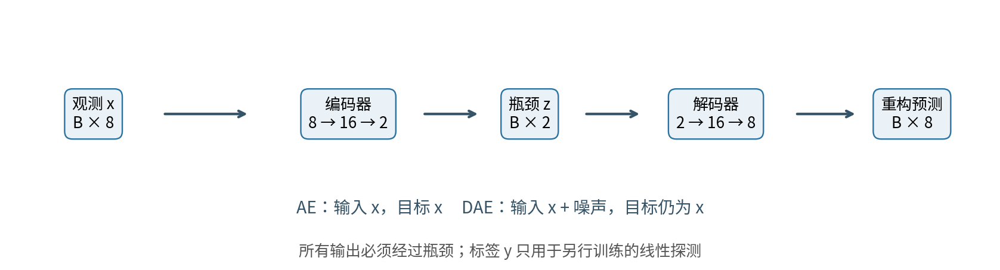
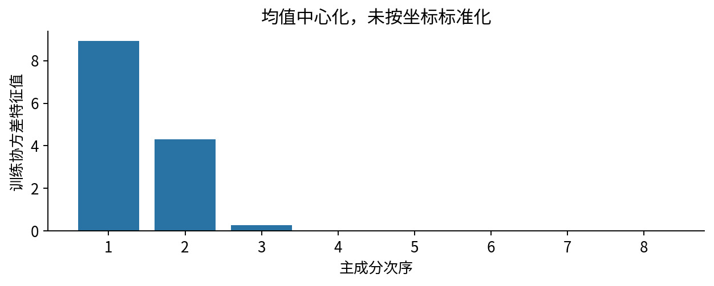
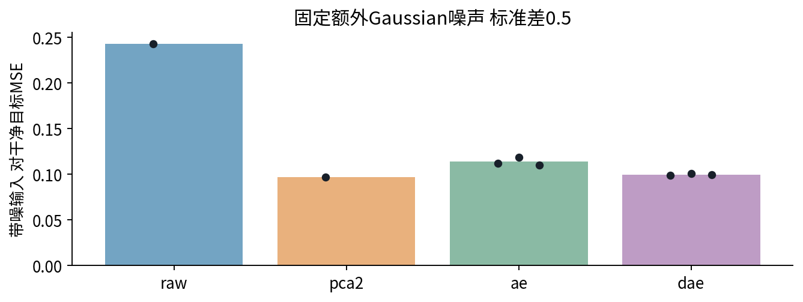
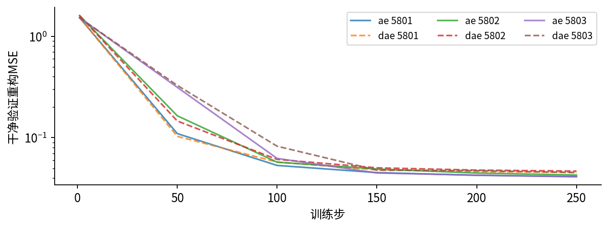
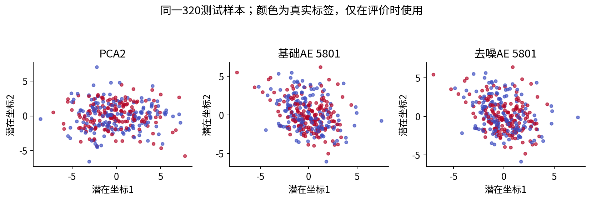
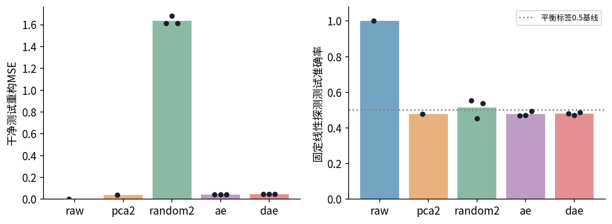

# 自编码器与潜在表示

## 第058单元 重构目标如何塑造表示

自编码器把输入压缩为一组数，再用这些数重建输入。本讲要回答一个具体问题：模型重构得很好，是否就能保留我们真正关心的分类信息？答案取决于数据、损失和限制条件。本单元给出一个可以完整重跑的反例：二维自编码器的测试重构MSE约0.043，但固定线性探测的准确率约48%；原始八维输入的同一探测器达到100%。两种评价问的是不同问题。

### 从零开始需要知道什么

一个样本是一行测量值，特征是这一行的各个坐标，标签是我们另行希望判断的类别。参数是训练时调整的数字；训练集用于调整参数，验证集用于诊断或事先约定的选择，测试集用于最后评价。本讲从这些概念出发，补齐矩阵形状、平均平方误差、链式求导和PCA投影。目录先修为025与037；即使尚不熟悉这两讲，也能先做本文的二维手算，再跟实验手册运行八维例子。

本讲所有数字来自随包原创合成数据。它没有照片、自然语言或现实人群，“语义”在这里仅指人为指定的二分类标签。实验不是证明自编码器普遍无效，而是展示：一个学习目标没有直接要求保留的信息，可能在压缩时丢失。我们不能靠漂亮的二维点图替代这个判断。

### 学习路线与交付证据

先认识编码器和解码器，手算一次前向与反向；再用线性PCA建立可核对的基准；随后区分瓶颈、去噪和稀疏约束；最后比较重构、去噪与冻结表示的下游线性探测。讲义中每个数都能追溯到 outputs/results.json；实验会保存训练轨迹、数据、PCA方向、探测器和六份训练权重。

主实验使用640个无标签训练输入、160个验证输入、320个测试输入；每个神经网络训练250步，每步64例，CPU单线程，三种初始化。探测器只使用训练集前128例的标签。没有外部数据下载、预训练模型或付费接口。完整Notebook会重新训练，不能只依靠已经显示的输出判断完成。

阅读时请反复问三个问题：模型看到了什么？损失奖励了什么？评价检查了什么？自编码器的可靠解释，就建立在这三个边界上。

## 一 编码和解码分别在做什么

设一个输入为向量$x\in\mathbb{R}^{D}$，D是坐标数。编码器$f_\theta$把它变为$z\in\mathbb{R}^{K}$，解码器$g_\phi$把z变回D维重构$\hat{x}$。θ与φ分别表示两部分可训练参数。帽子只表示“模型给出的近似”，不表示真实输入被改变了。

$$z=f_\theta(x),\qquad \hat{x}=g_\phi(z).$$

本实验D=8、K=2。一个批次有B=64行，实际形状依次是64×8、64×16、64×2、64×16、64×8。中间16维是网络隐藏层，2维才是本讲所说的瓶颈。宽隐藏层帮助表示非线性函数；窄瓶颈限制解码器获得输入信息的通道。完整路径没有输入到输出的跳连。

网络在16维层后使用ReLU，即把负数变成0、正数保持不变；瓶颈和输出都不加ReLU。这一点很重要：我们的连续测量可以为负，把输出强行限制在非负数会引入不必要误差。代码中的 Linear(8,16) 表示权重形状16×8，但批数据的乘法实际相当于输入乘权重转置，再给每行加偏置。

### 一个生活类比的边界

可以把z想成对一件物品的简短描述，把解码器想成根据描述复原物品的规则。描述中保留颜色还是形状，取决于“复原得像”的计分方法。若明暗差异占了大多数平方误差，网络可能优先记住照明；人关心的类别却未必由照明决定。类比帮助理解，但网络不是在用语言理解物体，每个潜在坐标也不必对应一个可命名概念。

潜在坐标的数值还不唯一。若z乘一个可逆矩阵A，同时解码器先乘其逆，最终重构可完全不变。因此两个同样好的模型，二维图可能旋转、拉伸或翻转；不能因为第一坐标正负相反，就断言学到了相反的意义。比较表示时应比较适当任务或结构，而非逐坐标强行对齐。

基础概念与欠完备自编码器的讨论可参阅[Deep Learning第14章](https://www.deeplearningbook.org/contents/autoencoders.html)。本讲后续的数值、反例与操作检查均由随包实验独立构造。

## 二 重构损失的每一个除数

本课采用平均平方误差MSE。先逐坐标做“预测减目标”，再平方，最后对所有样本和所有坐标一起平均。对一批B行、每行D维的数据，定义为：

$$L=\frac{1}{BD}\sum_{i=1}^{B}\sum_{j=1}^{D}(\hat{x}_{ij}-x_{ij})^2.$$

“对每行平方和再取平均”会少除一个D，数值是本定义的D倍。两者都能构造训练目标，但学习率、正则系数和报告结果不能不加说明地混用。程序 reconstruction_loss 返回 ((pred-target)**2).mean()，并要求两个非空二维数组形状完全相同，避免把形状错误悄悄广播成另一个任务。这与[PyTorch MSELoss的mean说明](https://docs.pytorch.org/docs/2.14/generated/torch.nn.MSELoss.html)一致。

### 手算一个输入

取$x=(2,-1)$，编码权重$e=(0.5,-0.5)^T$，不设偏置，则$z=xe=2\times0.5+(-1)\times(-0.5)=1.5$。解码权重$d=(1,0)$，因此$\hat{x}=zd=(1.5,0)$。误差为$(-0.5,1)$，平方和为1.25，平均后L=0.625。这里一个样本含两个坐标，不能只除以样本数1。

若所有特征都换了单位，MSE也会改变。米变厘米会把差值放大100倍、平方误差放大10000倍。本实验故意只做均值中心化，不按每列标准差缩放，因为我们要研究“高方差因素占据重构预算”的情形。按坐标标准化不是无害的美化，它相当于改变误差的相对权重，可能改变学到的表示。

### 哪些输入不适合直接用这个损失

实数测量配MSE是本讲的明确假设。二值事件可以考虑与伯努利分布相配的交叉熵；不同变量的范围或噪声不同，也可明确设计加权误差。不能仅因图像像素常被缩到0至1，就把连续像素自动当成严格的伯努利观测。目标函数的选择应由数据与任务解释，而不是复制代码默认值。

重构误差的单位是“输入单位的平方”。本数据是无物理单位的合成数，故这里只比较相同预处理、相同输入空间中的MSE。压缩表示的维度、模型参数和标签预测能力要另外报告，不能用一个loss概括全部价值。

## 三 梯度怎样穿过瓶颈回到编码器

上一节的例子只有四个参数，适合把反向传播写到底。由于L对两个坐标求平均，损失对重构的导数为$(\hat{x}-x)=(-0.5,1)$。一般情形会出现系数2/(BD)；本例B=1、D=2，系数恰好为1。

$$\frac{\partial L}{\partial d_j}=z(\hat{x}_j-x_j).$$

因此解码权重的梯度是$(-0.75,1.5)$。潜在数z影响两个输出，需要把两条路径相加：

$$\frac{\partial L}{\partial z}=\sum_j d_j(\hat{x}_j-x_j)=-0.5.$$

然后z由两个编码权重计算得到，故$\partial L/\partial e_j=x_j(-0.5)$，编码梯度为$(-1,0.5)^T$。瓶颈不是停止梯度的墙，它只是前向信息的低维通道。

### 真正更新一次

为看清算术，暂用学习率0.1的普通梯度下降，而非主实验的Adam。更新规则是“旧参数减学习率乘梯度”。于是$e'=(0.6,-0.55)^T$，$d'=(1.075,-0.15)$。再次前向得到$z'=1.75$，重构$(1.88125,-0.2625)$，新MSE约0.279004。梯度是旧参数处的局部斜率，所有参数应基于同一次旧前向一起更新；不能先更新解码器，再拿新解码器反算旧编码梯度。

实际网络的ReLU还会给每条路径乘上局部导数：输入大于0时为1，小于0时为0；在0点不可导，库采用约定的次梯度。测试里的手算例子没有ReLU，目的是隔离链式法则；它不声称覆盖网络所有分段边界。

主实验每步按固定顺序执行清梯度、前向、计算MSE、反向、optimizer.step。若漏掉清梯度，梯度会跨步累积；若把encoder输出detach后再传给decoder，编码器不会学习。优化器Adam还保存梯度的一阶、二阶统计，因此不能把它的一步更新直接等同于本节的0.1倍梯度。

每步loss只来自当次64例，波动很正常。更稳定的比较是固定验证集上的完整MSE；它在 torch.no_grad() 下计算，防止建立多余的梯度图。本课网络没有dropout或BatchNorm，但仍在最终评价前调用eval，以保持清晰的训练与评价习惯。

## 四 线性特例和PCA的关系

先把所有非线性去掉，并用训练均值中心化输入。若编码矩阵E是D×K，解码矩阵W是K×D，则重构为$XEW$。这个乘积的秩不超过K，意味着重构只能落在至多K维的线性子空间。最小化平方重构误差，本质上是在选一个保留最多总变动的子空间。

对中心化后的训练矩阵做奇异值分解：$X=U\Sigma V^T$。V的前K个列向量记为$V_K$；PCA编码$Z=XV_K$，解码$\hat{X}=ZV_K^T$。NumPy返回的第三项vt已经是$V^T$，所以程序取 vt[:K].T 得到D×K方向矩阵，不能把转置漏掉。[NumPy SVD文档](https://numpy.org/doc/stable/reference/generated/numpy.linalg.svd.html)列出了这些形状。

$$L_{PCA,train}=\frac{\sum_{j>K}s_j^2}{ND}.$$

这里$s_j$是被舍弃的奇异值，N是训练样本数。此式说的是训练集上最优秩K线性重构的误差；测试样本的新波动不受这个最优等式保证。若协方差定义为$X^TX/N$，特征值为$s_j^2/N$，还需要再除以D。若另用N−1估计协方差，必须把相应比例补回来。

### 四个点的可核对例子

输入为(3,0)、(−3,0)、(0,1)、(0,−1)，已经中心化。第一坐标平方和18，第二坐标平方和2，没有交叉项。选K=1时保留横轴，后两个点重构为原点；残差平方和2，除4×2得到MSE=0.25。如果选纵轴，误差变为18/8=2.25。因此PCA选横轴，理由是它带来的误差下降较大，不是横轴在任何外部任务中都更重要。

在线性平方误差、达到全局最优等条件下，自编码器可以得到与PCA相同的主子空间，但其编码坐标未必就是PCA的正交主轴。非线性自编码器、不同损失、未收敛训练或不同约束，都不能直接套用这个等价结论。本实验用非线性AE对照精确SVD求得的PCA，而没有假装神经网络一定收敛到PCA解。

## 五 本实验怎样把标签藏在低方差方向

我们直接生成八维因素，再用同一个正交矩阵混合成观测。这样每个观测坐标都包含多种因素，无法靠“只看第三列”轻易解决。正交变换保持欧氏距离与总平方能量，但会改变各个坐标轴的外观。

两个无关因素分别服从标准差3与2的零均值正态分布。第三个因素为$0.5y+0.08\epsilon$，其中标签$y\in\{-1,1\}$，每个划分内两类平衡，ε是标准正态噪声。其余五个因素的标准差是0.1。前两个因素总体方差约9与4，而第三个约0.2564；第三个虽然能辨别标签，却只占少量总平方能量。

如果二维压缩优先保存前两个大幅变化，MSE会很低，却没有强理由保存第三个因素的符号。PCA正好为这种机制提供清晰基准。训练最优残差MSE是0.038637，测试残差是0.038963；两者接近支持实现合理，但相近本身不是统计证明。

输入先减去全部640个训练输入的均值，验证与测试也只减这个均值。标签只在另一个探测阶段使用；不能按标签重排输入、根据测试表现选择旋转矩阵，或先把标签方向挑出来给AE。固定生成种子5800决定数据和旋转，所有方法共享同一划分。

这个设计是有目的的反例。现实任务中的关键因素未必低方差，重构表示也常能为下游提供帮助。因此正确结论是“重构目标没有普遍的语义保留保证”。若想知道照片分类中是否有效，需要用真实、合规且独立划分的数据重新评价，不能把本讲的48%外推成任何实际系统的准确率。

## 六 瓶颈能限制复制 但不是自动理解

若令编码器和解码器都为恒等函数，输入可以原样输出，MSE严格为0。原始八维基线就是这个参照。它没有压缩，也没有“学会去噪”；带噪输入也会被原样传出。因此评价AE时必须报告瓶颈维度，并检查输出是否绕过瓶颈读取输入。

K小于D时称为欠完备，K大于D时称为过完备，但维度只是约束之一。有限训练样本可以被高容量非线性网络记忆，甚至以某种编号方式编码；低维实数也不是固定比特率的存储文件。二维float32向量占8字节，但若要作为独立压缩系统，还需考虑模型、均值、量化误差、格式开销和解码部署。仅说“8维变2维，压缩四倍”只描述坐标数。

本实验架构的参数数为：(8×16+16)+(16×2+2)+(2×16+16)+(16×8+8)=362。编码器178个，解码器184个。全部参数float32的裸值约1448字节；这不等于训练进程内存，也不等于npz文件大小。Adam状态、梯度和中间激活还要占空间。

### 为什么加入随机编码器

一个随机初始化且冻结的二维编码器可能偶然保留一些标签投影。我们对三种子都保留random2，使用与AE相同的网络形状、相同标签预算和相同探测规则。随机编码器的探测结果是参照点，不代表它已经被重构目标训练过。其解码器同样随机且未训练，所以random2的重构误差不能当成“给定随机表示时最优解码误差”。若要回答后者，应固定编码器另行训练解码器。

### 预处理也是任务定义的一部分

本实验不做输入坐标标准化。若改为逐列除标准差，等价于对原空间误差做非均匀加权，且旋转后的列并不等于原来的独立因素。若直接用已知旋转反变换后把每个因素标准化，更是使用了生成器内部知识。两种干预都可以研究，但需要另立实验、明确目的，不能悄悄修改原基准。

检查复制最可靠的办法是联合看计算图、瓶颈维度、训练与未见输入的误差，以及特定扰动下的行为。单看“训练loss很小”既不能证实理解，也不能证实作弊。

## 七 去噪自编码器把输入和目标分开

基础AE用干净输入预测自身。去噪AE先生成一个受扰输入$\tilde{x}=x+\epsilon$，再用它预测干净x。训练目标变为：

$$L_{DAE}=\mathbb{E}_{x,\epsilon}\left[\frac{1}{D}\|g_\phi(f_\theta(x+\epsilon))-x\|_2^2\right].$$

本实验附加噪声每坐标独立、均值0、标准差0.5。标准差描述扰动幅度，方差为0.25。每步重新抽噪声，目标始终是该训练样本的干净观测x。这里“干净”只是没有额外添加的0.5噪声，它本身仍含生成机制的0.08与0.1随机项，并不是无噪声的理想因素。

如果错把目标也改成$\tilde{x}$，模型是在学习复制受扰输入，没有受到恢复x的直接约束。另一个常见错误是原地修改clean，再拿它当目标；这会让干净副本丢失。代码使用新张量corrupted，不在clean上做加法赋值。

平方误差下，一个预测规则面对不可区分的受扰输入时，倾向于输出可能干净目标的条件平均。因此去噪不保证逐个恢复每次随机扰动，平均结果可能丢掉细节。噪声过小，任务接近复制；噪声过大，关键信息可能被淹没。怎样选择噪声必须依据目标任务和允许的验证过程，不能把0.5当成普适值。

本次去噪目标改善了神经网络对该类噪声的恢复表现，却未明显提升线性探测。PCA2的去噪MSE还略低于DAE，不能隐藏这个基线。训练受扰噪声生成器与模型初始化分开固定；测试噪声来自另一固定种子5891，所有方法共享同一个测试扰动。

[Vincent等人的原论文](https://www.jmlr.org/papers/v11/vincent10a.html)展示了去噪目标与表示学习的联系；本课没有复现该论文的图像数据、逐层预训练或分类结果，只验证这个受控小实验。

## 八 稀疏约束究竟惩罚什么

另一种方法是在重构之外，惩罚编码活动。本讲解释并测试最简单的L1活动惩罚，但不把它混入主实验结果：

$$L_{total}=L_{recon}+\lambda\frac{1}{BK}\sum_{i=1}^{B}\sum_{k=1}^{K}|z_{ik}|.$$

λ控制愿意为小活动付出多少重构代价。这里平均除数是BK，重构项的除数是BD，二者对象不同。例子z=(2,−1)、λ=0.1时，活动惩罚为0.1×(2+1)/2=0.15。若误写成sum，同一批次扩大一倍就会把惩罚相对强度翻倍，实验结论会混入批大小效应。

L1惩罚在非零点的导数只取决于符号：正数被向下推、负数被向上推。在零点可用次梯度。小的平均绝对值不等于许多坐标严格为0；是否出现精确零还取决于激活函数、优化算法和数值精度。评价稀疏性需声明阈值，例如绝对值小于某个ε的比例，不能只展示平均值下降。

### 一个容易漏掉的缩放漏洞

如果编码器输出变成cz，解码器第一层权重相应除以c，某些网络可保持近似同样重构，却把L1活动代价缩小到原来的c倍。若c很小，解码权重会很大。因此“加L1就必然得到可解释稀疏特征”并不成立。设计时可能需要控制解码权重范数、使用明确归一化或其他结构限制；这些不是本主实验已验证的机制。

还应区分活动稀疏和参数稀疏。惩罚z的绝对值是在限制每个输入的响应；惩罚权重绝对值是在限制模型连接，两者不能互换。稀疏也不直接等于独立、解耦或人类可解释。一个非常稀疏的表示仍可能主要编码无关因素。

作为练习，可以在独立实验副本中加入λ网格，但需同时报告重构、活动统计、权重尺度和探测准确率，并只用训练及事先规定的验证信息选择λ。保留λ=0基线。无论观察到改善还是退化，都不能只挑一张好看的潜在空间图发表结论。

## 九 用冻结表示做一个受控线性探测

“表示有用”必须补全为“对什么任务、用多少标签、搭配什么读出器有用”。本课把编码器完全冻结，只训练一个线性评分器来预测二分类标签。它没有能力随意重排弯曲的类别边界；这正好检验标签信息在该表示里是否容易线性读取。

对训练集前128个表示，先计算每个维度的均值μ和标准差σ，再用$(z-\mu)/\sigma$标准化。σ接近0时改用1，避免除0。测试表示只能沿用这些训练统计。这个标准化与AE输入处理不同：它只服务于有标签探测，不能反过来改动编码器。

在标准化表示右边附加一列1，得到矩阵A，最后一个系数是截距。标签是−1与1，用带岭惩罚的最小二乘求解：

$$w=(A^TA+R)^{-1}A^Ty.$$

R在特征对角上为1，截距对角上为0。实现使用np.linalg.solve解线性方程，不显式计算逆矩阵。这个目标是残差平方和加权重平方和；如果改成平均残差，就要相应调整正则系数的解释。预测分数大于等于0判为1，否则判为−1。这里是岭回归式分类探测，不是逻辑回归，也不把分数当概率。

raw用8维原始特征，PCA2、random2、AE和DAE均用2维。维度不等意味着探测器参数也不等，所以raw是信息保留参照，不是同压缩率公平竞赛；二维方法之间才共享相同维数。所有方法共享128个有标签样本、岭系数1、320个测试样本。

探测器准确率低，可能因为信息丢失，也可能因为信息仍在但需要非线性读出、标签太少或正则不适合。因此本次结果只支持“固定协议下难以线性读取标签”。若训练非线性探测器，应作为新实验报告其容量和选择规则，不能把失败的线性结果简单叫“没有任何标签信息”。

标签在图上上色属于事后评价；AE训练阶段不使用标签。若反复看测试标签图后改网络，测试集就参与了设计，应另留最终封存集。

三种初始化共享同一数据划分，不能当成三次独立抽样实验来报告显著性。各个模型在同一320例上预测，也产生相关误差。均值、范围或样本标准差只能描述这三个初始化之间的波动，不涵盖重新采样数据、不同任务或超参数选择的不确定性。本文不给未经设计的显著性星号。

## 十 怎样读训练曲线和潜在空间

本课固定训练250步，最后一步作为结果。验证输入用于记录曲线，不参与梯度；没有根据验证标签选模型，也没有用验证MSE决定提前停止。这里的“验证集”用途比常见调参流程更窄。若以后决定按验证MSE选epoch，要在新协议中写清规则，并对所有方法一致执行。

注意小批训练loss和干净验证MSE未必同向：前者每步样本改变，DAE前者还包含额外噪声，后者却用干净输入。把DAE训练loss直接画在AE验证loss旁并称作泛化差距，会混淆评价对象。正式记录分别命名minibatch_loss和clean_validation_mse。

视觉上两种颜色大幅混杂，与本次线性探测接近0.5一致。但图像有点大小、透明度、坐标范围和重叠遮挡问题，无法精确计算分类边界或误差。二维图已经展示全部瓶颈坐标，也仍只是辅助证据；更高维表示再降到二维绘图时，投影还可能制造或掩盖分离。

## 十一 结果应当怎样准确地说

| 表示 | 维度 | 干净重构MSE | 受扰输入去噪MSE | 线性探测准确率 |
|---|---:|---:|---:|---:|
| raw恒等 | 8 | 0.000000 | 0.243129 | 100.00% |
| PCA2 | 2 | 0.038963 | 0.096840 | 47.81% |
| 随机网络 | 2 | 1.636250 | 1.638542 | 51.46% |
| 基础AE | 2 | 0.042547 | 0.113834 | 47.81% |
| 去噪AE | 2 | 0.046456 | 0.099736 | 48.02% |

后三行是三种初始化均值，并非最佳种子。AE三个正确数为150、151、158；DAE为154、151、156；每次分母都为320。随机网络三个正确数为177、145、172。本次随机表示均值略高于训练后的表示，也不能据此宣称随机网络普遍更好：我们只改变初始化，没有对多划分进行独立研究。

AE的重构损失从约1.5降到约0.043，说明网络学会了这个输入分布的重要变动。它却没有在既定线性评价下保留优于接近机会水平的标签读出能力。DAE对固定附加噪声更稳健，但其干净重构略差，线性探测没有对应的大幅改善。两个目标之间的取舍，必须分别写清。

raw重构0来自定义上的恒等映射，不是训练成功；它在受扰输入下的MSE约0.243接近噪声方差0.25。PCA通过抛弃若干方向同时丢掉一些信号和一些附加噪声，因此去噪误差会小于恒等输出。DAE没有胜过PCA基准，也是应保留的实际结果。

可接受的结论句是：“在这一个高方差干扰主导的合成划分中，二维重构训练没有带来固定线性探测上的标签收益；指定噪声的去噪训练改善了相应恢复指标。”不可写成“自编码器无法学习语义”“去噪一定优于PCA”或“准确率低于50%证明反向规律”。这些句子都超出了证据。

## 十二 可复现实验的边界与检查清单

完整实验有三种子5801、5802、5803，每种子训练AE和DAE，共六个run；每个run有250×64=16000次样本曝光，总96000次。训练池仍然只有640个独立样本，曝光次数不能当成新增数据量。每步重新randperm后取前64例，属于每批内无放回、批与批之间可能重复，并不是遍历完一轮再洗牌。

模型初始化、批次顺序、训练噪声和测试噪声使用分离的随机源。AE和DAE共享同样初始化与每步样本索引，有助于减少比较中的无关变化。设置CPU单线程与确定性算法提高同环境重放的一致性，却不承诺不同库版本、硬件或后端逐比特相同。[PyTorch复现说明](https://docs.pytorch.org/docs/2.14/notes/randomness.html)也区分了这些边界。

### 从文件恢复一次推断

权重采用数值npz文件，可用allow_pickle=False读取；创建同结构Autoencoder，将除input_mean之外的数组加载到state_dict。对新输入先减保存的input_mean，经模型得到中心化重构，若需要原始坐标单位，再加回均值。探测器还需自己的feature mean、scale和weights，不能拿AE的输入均值替代它们。

六份检查点都需要验证，不能只试第一个。测试还检查二维手算的损失与梯度、L1除数、PCA残差、探测标准化没有读入测试样本、运行结果表的行数及权重前向值。测试用显式异常而非只靠assert，Python开启-O优化时也不会取消检查。

### 学完后必须能独立回答

1. 为什么八维输入经过二维瓶颈后，解码输出仍是八维？写出每层批次形状与362个参数的计数。
2. 手算本文二维网络的一次前向、全部梯度及学习率0.1的一步更新。
3. 对四点PCA例子求残差MSE，解释为什么分母是8。
4. 分别定义基础AE和DAE的输入、目标与测试指标，找出复制噪声的错误代码。
5. 计算L1活动惩罚并解释缩放漏洞；提出两个需要同时记录的诊断量。
6. 重建本课线性探测协议，指出用全部测试特征求标准差的泄漏。
7. 用完整三种子结果写不超过200字的结论，明确维度不等、单划分与非线性信息的限制。
8. 设计一个新瓶颈维度实验，写清数据、标签预算、选择规则及停止条件，不在原测试结果上反复挑选。

完整步骤见lab.pdf，逐题推导与评分边界见answers.pdf。来源索引见sources.md。本单元的最后目标是读懂证据，而不是把所有低重构误差都叫作“好的表示”。
