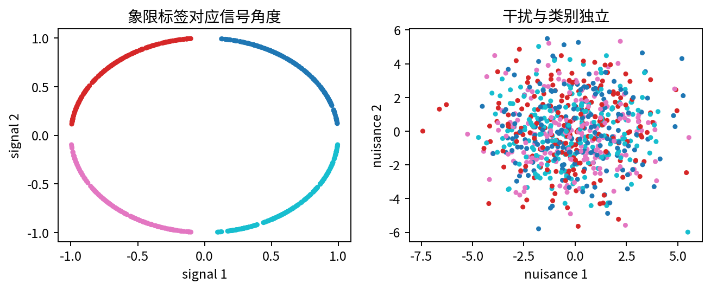
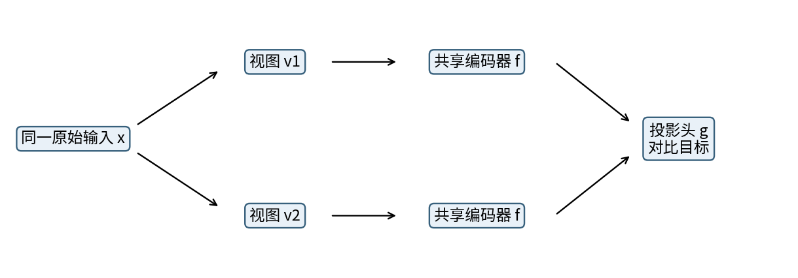
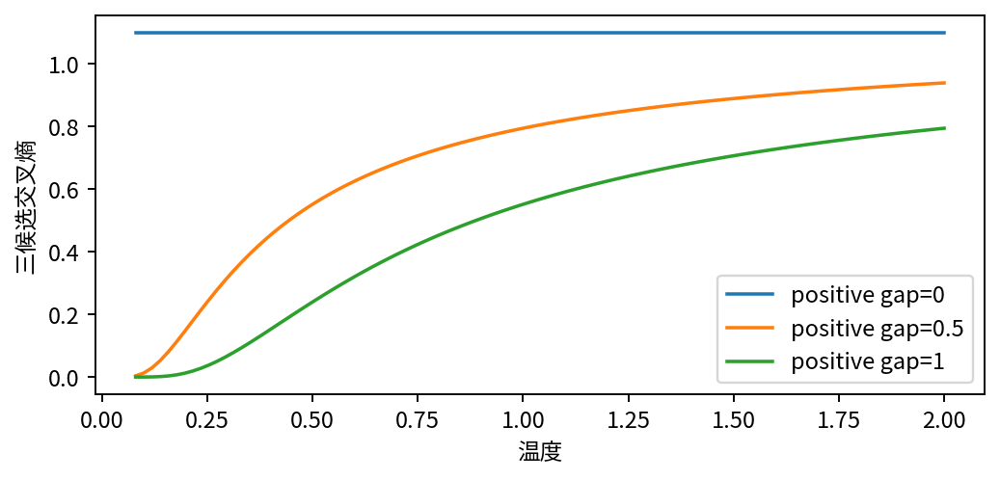
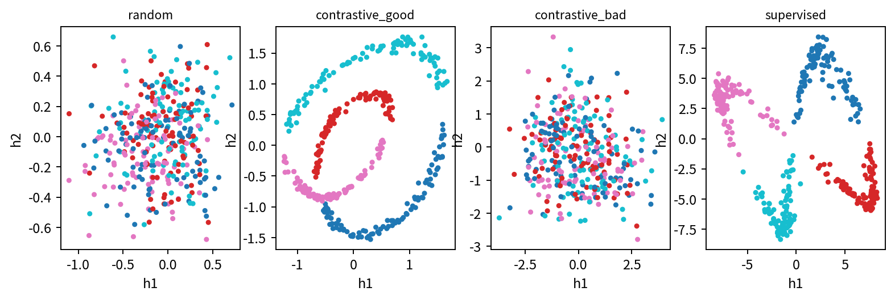
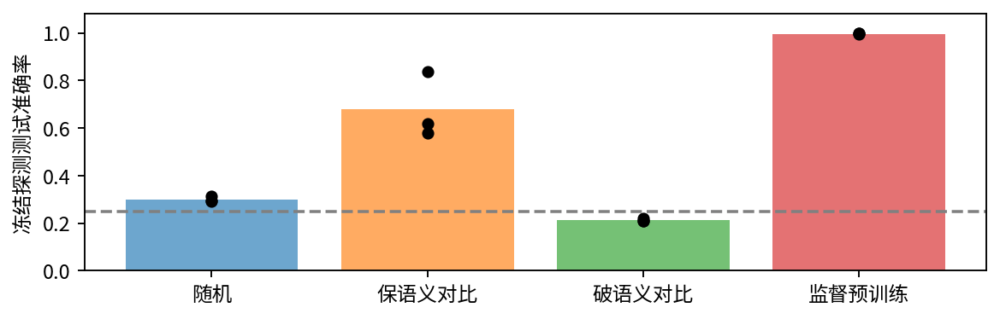
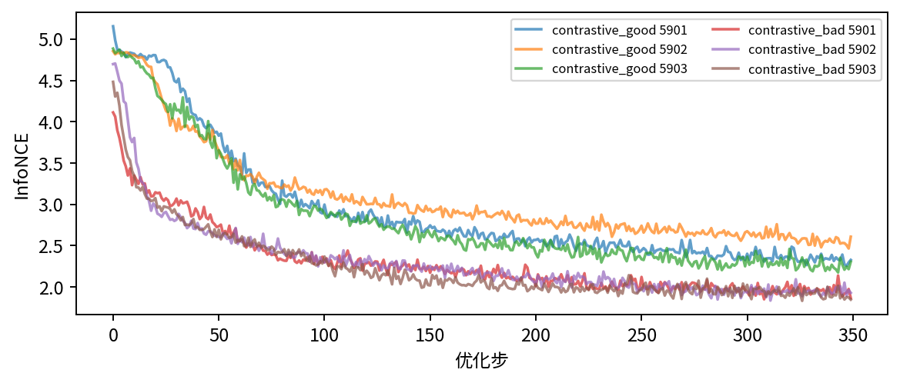

# 自监督与对比学习

## 第059单元 没有人工标签时学习目标从哪里来

假设我们拿到一批测量记录，想让模型分清四种状态，却只有很少的人工标签。记录里既有状态信号，也有与任务无关的干扰。直接拿一个随机神经网络压缩记录，可能把两者混在一起。自监督学习的做法，是先从数据本身构造一个可计算的任务，再检验学到的表示能否帮助下游判断。本讲的核心结论是：构造目标的方式，决定模型被鼓励保留哪些差异；没有人工标签，不等于没有人为假设。

本课用原创八维数据让这个问题可见。四维记录角度，另外四维是独立干扰；类别定义为角度所在的象限。我们给同一条记录生成两个视图，让模型辨认它们来自同一个输入。保留角度、替换干扰的增强，能够帮助模型忽略干扰。反过来保留干扰、打乱角度，即使对比目标可以优化，也可能学到与类别无关的表示。

### 阅读起点与实验边界

输入x是一行数字，标签y是希望预测的类别，编码器f把输入变为向量h，训练损失是用来调整参数的数。批次表示一次一起处理的若干输入，梯度表示损失对参数的局部变化率。先修019、037、041、025涉及这些概念，但本讲会从形状和一个四视图手算例子重新搭桥。

实验比较随机初始化、保语义对比、破语义对比和监督预训练。每种使用同一个8→32→2编码器；训练后的编码器全部冻结，只用训练集前128个标签拟合相同线性探测器。监督预训练额外用了全部768个训练标签，因此是带标签的参考，不能声称与自监督标签预算相同。三个初始化全部报告，不挑最好一次。

这是低维合成机制实验，不是ImageNet复现。数字“语义”仅指人为定义的象限任务。本讲不会用它证明某种增强在真实照片、医疗影像或语言中正确。读完后，你应能解释一个正样本为什么合理，写出每个分母包含谁，并识别一个偷偷微调了编码器的“线性探测”。

## 一 从数据中制造一个可检验的问题

监督任务把输入与人工标签配对。自监督任务则把输入的一部分、变换版本或可推导属性作为目标。例如遮住词语再预测、扰动输入再恢复、辨认两段数据是否来自同一个对象。这些任务都不需要逐例手工标注，但要求不同，因此学到的表示也不应被视为等价。

第058讲的重构任务问“怎样保留足以恢复输入的信息”。本讲的对比任务问“在若干候选中，哪个视图与这个视图配对”。如果输入里的干扰对重构很重要，自编码器可能保留它；如果增强会随机替换干扰，对比任务便难以依赖它。这不是对比学习自动理解了任务，而是训练规则把某种变化定义为无关。

令角度为a。前四维为cos(a)、sin(a)、cos(2a)、sin(2a)，后四维为独立标准正态乘2。类别是a落在哪一个直角区间。每个划分四类平衡，但探测器使用的前128例只按固定随机顺序截取，不按测试结果重新挑选。

训练、验证、测试分别有768、192、384条，生成器只运行一次并保存。三者是独立抽样，不是同一条记录的不同增强。预训练只能看训练输入；线性探测也只能用训练标签。即使完全不读测试标签，拿测试输入参与预训练也改变了评估设定。本课不采用这种传导式设定。

### 停下来想一想

同一张图像左右翻转后，猫的类别往往不变；路标上的左右箭头却可能改变含义。增强是否保语义，取决于下游问题，不取决于它是否常见。本实验明确知道哪些坐标是信号，是为了检验机制。现实任务没有这样的答案提示，需要领域知识、样本审查和消融证据。

## 二 两个视图与两层表示

对每个原始输入x独立抽取两次随机变换，得到v1与v2。它们共享原始输入，但随机噪声不同。编码器f把8维视图变为2维h；投影头g再把h变为8维z。损失施加在归一化后的z上，而下游探测读取h。两条分支使用同一套参数，不能各自训练一个互不相干的编码器。

$$h=f_\theta(v),\qquad z=g_\phi(h),\qquad u=\frac{z}{\|z\|_2}.$$

代码用带小常数保护的F.normalize处理接近零的向量，因此零向量不会产生除零。这个数值保护并不会自动保证表示有用。两层网络的分工也是一种设计：投影头承受对比目标的几何约束，h保留供后续使用的信息。本课仅采用这种结构，并未证明它一定优于无投影头。

保语义增强只给前四维加标准差0.04的小噪声，把后四维重新独立抽样。因为原始角度离象限边界有一定间隔，这些小扰动通常不会造成含义突变；但程序并不把扰动后的向量反解成一个新角度再重贴标签。它把视图视为同一原始样本的观测。破语义增强重新抽取角度而保留原干扰，这时配对关系鼓励忽略任务信号。

对64个原始输入做两次增强得到128个视图。按照先放全部v1、再放全部v2的顺序拼接，编号i的伙伴是(i+64)模128。这个配对索引是目标来源，不来自四类标签。另一个同类别输入在本目标中仍被当成负样本，这一点之后会带来“假负样本”问题。

[SimCLR原论文](https://proceedings.mlr.press/v119/chen20j.html)研究了数据增强和投影头的重要性。本讲借用基本结构，数据、网络规模、探测器和实验数字都是另行设计的，不复制其大规模结论。

## 三 从候选识别写出InfoNCE

先看一个锚点u_i。它有一个正伙伴u_p，其他视图作为候选。我们用内积计算归一化向量的余弦相似度s。相似度越大，两个方向越接近。温度τ是正数，用来缩放分数，再对候选做softmax，把分数变成总和为1的选择概率。

$$P(p\mid i)=\frac{\exp(s_{ip}/\tau)}{\sum_{k\ne i}\exp(s_{ik}/\tau)}.$$

分母排除锚点自己，因为自己与自己必然非常相似；分母必须保留正伙伴，因为它也是候选之一。把正伙伴也删掉会使这个式子不再是所声明的分类概率。B个原始输入产生2B个视图，每个锚点有2B−1个候选，其中1个正样本、2B−2个负样本。

$$\ell_i=-\log P(p\mid i)=-s_{ip}/\tau+\log\sum_{k\ne i}\exp(s_{ik}/\tau).$$

最终对2B个锚点取平均。同一正对会分别以两个方向参与目标；这不是错误重复，而是对称目标的定义。程序先算128×128相似度矩阵，再把对角线设为负无穷，最后直接调用稳定的交叉熵。不要先手算指数再取对数，低温下大指数容易溢出。

### 一个可以独立核对的四视图例子

取两个原始输入，a1=(1,0)、a2=(0,1)，第二视图b1=a1、b2=a2。拼接顺序为a1,a2,b1,b2。对锚点a1，正确伙伴b1的相似度是1，其余两个候选相似度为0。若τ=1，正确概率为e/(e+2)，单个损失为log(e+2)−1，约0.551445。四个锚点完全对称，平均损失也是这个数。

若错误地把自己留在分母，分母会变成2e+2，损失变大；若错误地删掉正伙伴，分母变成2，甚至可能出现负损失。测试文件专门使用这个例子，以检查索引、掩码和归约。能运行并不代表算对，手算例子才给出外部基准。

[对比预测编码论文](https://arxiv.org/abs/1807.03748)给出了InfoNCE相关目标。这里采用双视图批内识别形式，不把任意增强和有限批次的结果直接解释成真实互信息估计。

## 四 温度改变梯度而不是标签

对某个候选相似度s_ik求导，可以得到“预测概率减正确标签”的形式，再除以温度。若k是正伙伴，减去1；否则减去0。因此正伙伴概率还小时，其分数得到向上的推动；具有较大预测概率的负样本受到更强的向下推动。

$$\frac{\partial\ell_i}{\partial s_{ik}}=\frac{P(k\mid i)-\mathbb{1}[k=p]}{\tau}.$$

在上一节τ=1的例子中，正伙伴概率约0.576117，两个负样本概率各约0.211942。对正分数的导数约−0.423883，对每个负分数约0.211942，三项相加为0。softmax只关心相对分数，给所有候选加同一个常数不会改变概率，这也解释了导数和为0。

温度较小时，分数差被放大，分布更尖。若正样本已经明显领先，小温度可能令损失很小；若一个错误负样本更相似，它又可能产生很大的惩罚。不能笼统地说“低温让所有梯度变大”，因为概率项同时变化，链式求导还要通过归一化和神经网络。

计算一个更简单的例子：正负分数差都是0时，三候选概率始终1/3，损失log3，与温度无关。如果正分数比两个负分数高1，则损失为log(1+2exp(−1/τ))。τ从1降到0.5时损失由0.551445降至约0.239545。这里只改变同一组固定分数的读法，没有重新训练网络，不能据此推出某温度会取得更好下游准确率。

代码把τ固定为0.2，三个随机种子共用这个值。我们没有搜索测试集最优温度。若你做扩展实验，应先在训练/验证划分约定搜索规则，再把测试保留到最后；报告的对象也应包括搜索成本。

## 五 坍塌与错误不变性是两回事

如果所有输入都映射为同一个非零向量，那么归一化后所有候选相似度相同。每个锚点正确概率为1/(2B−1)，损失为log(2B−1)。本实验B=64，因此常量表示的基准约4.844187。对比目标通常不奖励这种彻底常量解，因为区分实例可以进一步降低损失。但有限网络、训练动力学和目标设计仍需检查，不能把“有负样本”当成任何训练都安全的保证。

“表示坍塌”还可以是部分维度几乎恒定，而不是所有维度完全相同。检查每维标准差、协方差谱以及下游可用性，比仅看二维散点颜色更可靠。不过这些统计也受坐标尺度影响。本课报告平均维度标准差以识别极端常量，不用它给不同网络排序。

破语义增强可能学到变化很丰富的干扰表示，标准差并不小，分类却接近或低于25%基准。这叫学错了不变性，不等于数值坍塌。模型认真完成了我们布置的实例识别任务，任务本身却删除了下游所需的信息。修复应该从视图规则开始，不能仅仅增加训练步数。

### 假负样本为何让解释更谨慎

同一象限的两个不同原始输入可能对下游类别等价，但实例对比会把它们当负样本推开。这并不必然破坏全部类别结构，也不表示所有同类点必须重合。它说明实例识别和类别识别不是同一个目标。批次增大会带来更多候选，同时也改变优化难度、计算量和潜在假负样本比例。

### 非对比方法并非没有约束

若只最小化两个表示的平方差，常量输出就能把损失降为0。非对比方法必须有其他机制。以[BYOL论文](https://arxiv.org/abs/2006.07733)为例，它结合预测器、停止梯度和缓慢更新的目标网络。这里仅介绍其目标结构，不在本课复现或把“停止梯度”说成独立充分保证。重构、对比、非对比都属于可用思路，适用假设与失败机制各不相同。

## 六 冻结线性探测究竟控制了什么

表示好不好必须相对于一个问题来回答。本课问：少量标签能否通过一个线性读出器从h读出四类标签？h有两维，探测器给每类一个线性分数，然后取最高分。我们使用闭式岭回归拟合一位有效编码的类别矩阵，再把它作为分类分数。这是线性探测，但不是交叉熵逻辑回归，不能与别人的“linear probe”默认协议不加说明地比较。

只用训练前128例估计每个h坐标的均值和标准差，再给所有划分应用同一个变换。常量坐标的缩放设为1以避免除零。补一列1作为截距得到矩阵A，目标矩阵Y每行四列、正确类为1，其余为0。目标是平方误差加权重惩罚，截距不惩罚。

$$W=(A^TA+\Lambda)^{-1}A^TY,\qquad \Lambda=\operatorname{diag}(1,1,0).$$

程序使用线性方程求解而不是显式求逆。正则系数固定为1，编码器输出先在训练子集标准化，尽量避免单纯尺度差支配惩罚。矩阵A为128×3，W为3×4，测试得分为384×4。这个公式是一条完整数据路径，任何一处用错测试均值或标签都会改变含义。

“冻结”有两个层面：不把编码器参数交给探测优化器；不让训练态归一化或其他状态继续变化。本课网络只有Linear和ReLU，仍会调用eval与no_grad，并在拟合探测器前后逐张量检查状态未变。梯度开关不是唯一证明，状态比较才是可检查的证据。

### 为什么监督参考不是公平的无标签胜负赛

随机与两种对比编码器没有用训练标签预训练；监督编码器则用768个标签训练四类头，之后也丢弃该头并用同样128例重新探测。它说明这个架构在有充分监督时能保留什么，不是同标签预算下的公平竞争。若要比较标签效率，应另设只用128标签的监督基准，并保持搜索和数据曝光约束一致。本课没有做这个额外结论。

## 七 沿着证据读实验结果

每次预训练350步、每批64个原始输入，Adam学习率0.003；随机编码器训练0步。保语义和破语义对比都使用128个视图、同一温度、同一编码器和投影头。数据划分固定，初始化种子为5901、5902、5903。不同目标在计算和标签使用上并不完全等价，报告中保留这些区别。

三个随机编码器的测试准确率约29.43%、29.17%、31.51%；保语义对比约61.72%、83.85%、57.81%；破语义对比约21.09%、20.83%、22.14%；监督预训练约99.48%、99.74%、99.74%。保语义对比的波动明显，我们保留它，没有替换成更好看的种子。平均值分别约30.03%、67.80%、21.35%、99.65%。

这些结果支持一个局部结论：在指定合成分布、增强和冻结探测协议下，保留角度的视图明显优于保留干扰的视图，也优于随机低维压缩。它们不支持“对比学习必然接近监督学习”，也不说明低于25%的一次或几次结果具有什么普遍反学习现象。只有三个初始化，数据划分还只有一个。

查看结果时先读protocol.json再读results.json：标签预算、probe前缀、特征维数、正则系数、温度和训练步数都写在协议里。保存权重和探测器使我们能从原始测试数据重新算出384行得分，避免只对一个汇总百分数自我核对。

## 八 损失曲线能回答与不能回答的问题

InfoNCE下降说明锚点辨认配对伙伴的能力按该目标有所改善。它不直接衡量下游类别是否可线性读取。保语义和破语义增强定义了不同的预测任务；即使网络结构相同，两个任务的loss数值也不是统一的“语义质量分数”。

更长训练可能降低目标，也可能强化错误不变性。换更大模型可能更容易记住无关实例细节。增加负样本可能让目标更难，又改变计算预算。面对不佳探测结果，应先把问题分成目标、实现、优化、评价四层：视图是否合理；正负索引和掩码是否正确；梯度是否有限且参数确实更新；探测器是否真正冻结并隔离测试。

### 沿一次训练步检查程序

从训练张量抽64行，分别调用两次augment，再分别经过相同enc和head；拼接、归一化、构造相似度；清空旧梯度；交叉熵反向；优化器更新。顺序中最容易漏掉的细节，是每步清梯度、两次增强独立随机、对角掩码不遮住正伙伴，以及预训练后丢弃投影头。

测试文件包含四视图手算、常量表示基准、温度非法输入、增强的坐标变化、常量特征探测、12份编码器与12份探测器的完整重放。测试不用assert语句承担关键检查，因此python -O不会把验证删掉。Notebook还会真正重新训练所有配置到独立目录，保留随包outputs不变。

### 研究记录该怎样写

一句可信记录应包括“在哪个数据、什么划分、哪种视图、什么标签预算、哪种冻结协议、所有哪些种子”以及限制。仅写“自监督准确率68%”缺少解释对象。若要声称改进，把改变前后的其他设置锁住，并说明搜索了多少方案；如果查看测试后改了设计，必须把它当探索过程，不能再把同一测试当完全未见过的验证。

## 九 练习与下一步判断

先合上答案完成以下问题，再用lab.pdf运行。答案册给出算术、理由和可接受的边界，重点是解释过程而不是背数字。

1. B=64时有多少视图、每个锚点有多少候选、多少负样本？为什么分母排除自己却保留正伙伴？
2. 重做四视图手算，得到τ=1与τ=0.5的损失。把自身也留在分母时会怎样？
3. 对候选softmax推导相似度梯度，并计算τ=1时正伙伴和两个负伙伴的导数。
4. 所有向量相同时，B=3的损失是多少？这能否证明训练永远不坍塌？
5. 破语义增强的表示标准差很大，但探测准确率低，为什么不能简单诊断为常量坍塌？
6. 写出线性探测中A、W、测试分数的形状，并解释正则矩阵最后一个0。
7. 如果用384个测试表示的均值标准化，再只用训练标签拟合，是否仍符合本课协议？
8. 监督预训练为何是有标签参考而不是与对比方法标签预算相同的竞赛？
9. 根据三个种子，报告保语义对比的范围和均值，并说明统计推断的限制。
10. 设计一个只改变增强的扩展实验，提前写清验证规则；不要增加本课没有授权的外部数据下载。

### 读完后应形成的判断习惯

不要先问“自监督是不是比监督更好”。先问学习目标从哪里来，哪些变化被定义为无关，哪些差异被强行区分，评价究竟读出了什么。对比学习提供了一种从未标注输入构造训练信号的办法；增强、负样本与探测协议共同决定它能支持怎样的结论。

本讲的代码只依赖本单元文件。讲义图由make_figures.py从原始数据或明确的解析公式生成；原始输出、权重和探测器都随包提供。完整参考链接、访问日期和用途见sources.md及source-checks.json。接下来的第060讲把目标从“辨认伙伴”改为概率生成模型中的证据下界，你会再次看到目标、假设和评价必须对应起来。
