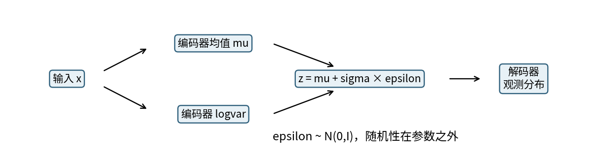
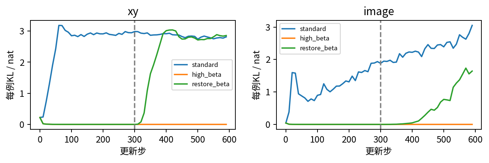
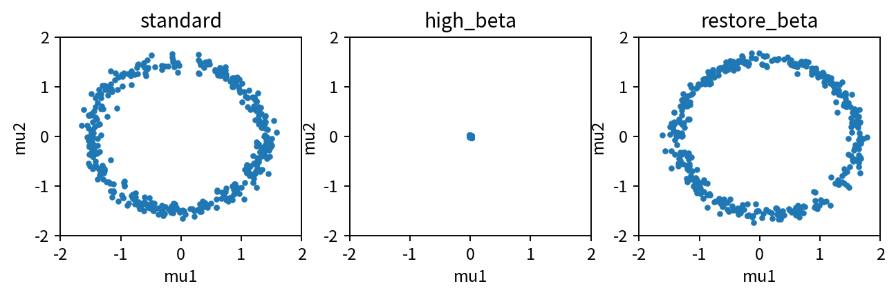
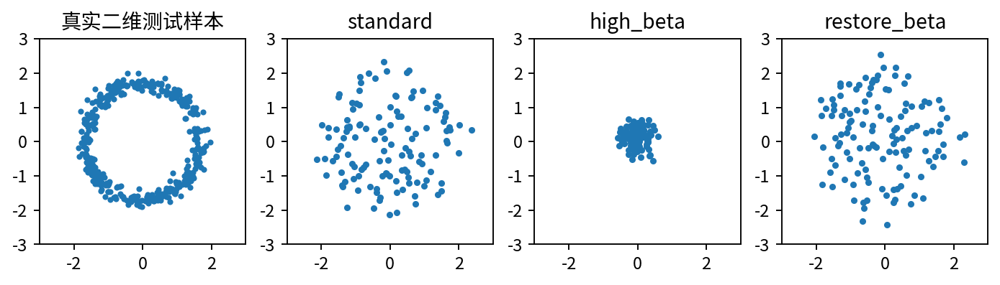
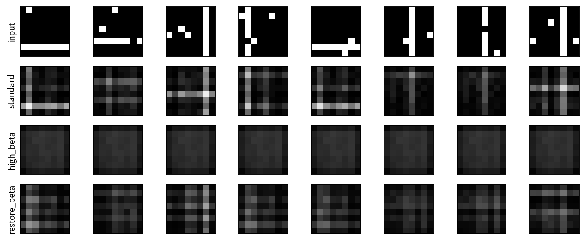
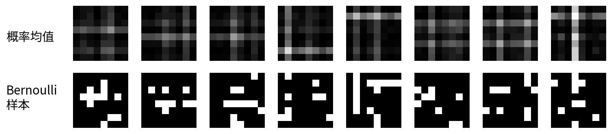

# 变分自编码器与ELBO

## 第060单元 把难算的似然变为可训练目标

如果一张小图像可以由“横线还是竖线、位置、观测噪声”这些隐藏因素生成，我们能否让模型自己学习这些因素，并从随机数产生新图像？普通自编码器可以重构，却没有自动给潜在空间规定一个适合采样的概率分布。变分自编码器VAE把这个问题写成概率模型：先抽潜变量z，再按z生成观测x，同时学习一个从x推断z的近似后验。

本讲的核心结论是：ELBO是对数边缘似然的下界，它把生成模型拟合和近似推断连接起来。我们能优化它，并不表示已经精确算出真实似然；把KL乘上任意权重后，也不能继续把训练目标原样叫作标准ELBO。实验会用二维连续点和8×8二值图像，把这些区别落实到每一个求和与平均。

### 先建立共同语言

随机变量表示一个未知或可重复抽样的量；概率分布描述各取值出现的规律。密度与概率不同：连续密度可以大于1，但一个区间的概率是密度积分。对数似然log p(x)衡量模型给实际观测分配的密度或概率；负对数似然通常作为最小化目标。潜变量是没有直接观测到、却被模型引入来解释x的变量。

目录先修017、019、058覆盖概率、损失与自编码器。这里会补齐贝叶斯关系、期望、KL、对角高斯和链式梯度，再做可手算例子。x是一行D维观测，z是一行K维潜变量；本实验D为2或64，K始终为2。编码器输出的均值和方差都是潜变量分布参数，不是输入图像的均值方差。

我们训练两个数据任务、两个随机种子、三个预声明配置，共12个VAE。标准配置beta=1；高beta=100故意强压潜变量，观察后验坍塌；干预配置先共享相同300步高beta训练，再仅把beta改为1继续300步。所有配置训练600步，最终检查点全部报告，不选择最漂亮的图片。

## 一 生成模型为何让似然难算

先给潜变量一个容易采样的先验p(z)，本讲采用标准正态N(0,I)。解码器把z变成观测分布的参数。例如连续点使用高斯均值，二值图像使用每个像素取1的概率。联合分布由两部分相乘：

$$p_\theta(x,z)=p(z)p_\theta(x\mid z).$$

训练时我们只观察x，没有每条样本对应的真实z。要评价模型给x多少概率，需要把所有可能z的贡献相加；连续z用积分。这个量叫边缘似然：

$$p_\theta(x)=\int p(z)p_\theta(x\mid z)\,dz.$$

即使z只有两维，非线性解码器也常使积分没有简单闭式；高维时直接网格积分更不可行。给每个样本抽一个z得到的p(x|z)不是这个积分的精确值，log也不能随意穿过平均。需要一个同时可计算、可求梯度的替代目标。

贝叶斯公式给出真实后验p(z|x)=p(x,z)/p(x)。它问“已经看到x后，哪些z更有可能生成它”。难点在于分母又出现了刚才难算的p(x)。所以VAE另引入可计算的q_phi(z|x)，由编码器根据x输出其参数，用它近似真实后验。生成模型参数θ和推断模型参数φ要区分，不是同一个概率分布的两个名字。

### 先验与后验的角色

生成新样本时，先从p(z)抽z，再从p_theta(x|z)抽x；不需要编码器。重构已有样本时，先从q_phi(z|x)抽z，再解码；这两条路径回答不同问题。把测试图像编码再解码得到“像”的图，不等于从先验随机采样也会生成好图。

本课的先验固定为二维标准正态。解码器和编码器都是小型全连接网络，没有自回归、跳连或外部预训练模型。这让我们能把问题集中在概率目标，而不是混入一个强大解码器的特殊行为。

## 二 一步一步推导证据下界

先选择一个在相关区域有密度的q(z|x)，把积分写成它下面的期望：p(x)=E_q[p(x,z)/q(z|x)]。对数是凹函数，因此log E[W]不小于E[log W]。这一步是Jensen不等式，不是把期望和对数视为可交换。

$$\log p_\theta(x)\geq E_q[\log p_\theta(x,z)-\log q_\phi(z\mid x)].$$

将联合分布分解为先验与条件分布，得到ELBO，记为L(x)：

$$L(x)=E_q[\log p_\theta(x\mid z)]-D_{KL}(q_\phi(z\mid x)\|p(z)).$$

第一项奖励在后验可能的z上解释x；第二项惩罚每个输入的近似后验偏离先验。KL不是对称距离，它比较的是两个完整分布，不是简单比较两个均值。这里的方向是q到p，颠倒后一般得到不同目标。

还可以直接算出误差间隙。把贝叶斯公式代入q与真实后验的KL，可得：

$$\log p_\theta(x)=L(x)+D_{KL}(q_\phi(z\mid x)\|p_\theta(z\mid x)).$$

KL非负，因此再次证明L是下界；只有q等于真实后验几乎处处时，间隙才为0。编码器选择对角高斯后，即使优化成功，也未必能表示真正多峰或强相关的后验。下界变好既可能因为生成模型更好，也可能因为近似后验更贴近真实后验，不能把二者完全混同。

### 三个经常混淆的数字

log p(x)是精确边缘对数似然；L(x)是期望意义的下界；用有限随机样本估计L是一个随机估计值。某次单样本估计不必低于精确log p(x)，因为“下界”说的是期望目标，不是每次带噪数值都保证满足不等式。本实验用16个固定噪声抽样估计测试重构期望，KL精确计算，明确报告Monte Carlo估计而非精确似然。

[Auto-Encoding Variational Bayes原论文](https://arxiv.org/abs/1312.6114)建立了这一训练框架。本讲的有限维推导和数值实验为独立教学展开，不借用论文的实验效果作为本代码的效果。

## 三 对角高斯KL如何化为简单公式

令近似后验每个潜在坐标独立，均值mu_j、方差sigma_j²；先验每维为均值0、方差1的正态。正态对数密度包含归一化常数、log方差和平方偏差。把log q减log p，再对q取期望，可用E_q[z_j]=mu_j与E_q[z_j²]=mu_j²+sigma_j²消去随机变量。

$$D_{KL}(q\|p)=\frac{1}{2}\sum_{j=1}^{K}(\mu_j^2+\sigma_j^2-1-\log\sigma_j^2).$$

网络输出logvar=log sigma²，方差由exp(logvar)得到，标准差由exp(0.5 logvar)得到。把logvar当log标准差会把指数尺度弄错两倍。代码的KL函数先对K个坐标求和，返回一批每例KL；训练目标再对批次平均。这种顺序让单位保持为nat/例。

### 一个两维手算

取mu=(1,0)，方差=(4,1)，则第一维贡献为0.5(1+4−1−log4)=0.5(4−log4)≈1.306853；第二维贡献0。总KL约1.306853。若mu=(0,0)、方差=(1,1)，q与先验相同，KL为0。方差太小也会被惩罚，因为负log方差趋向很大。

对mu_j求导得mu_j；对logvar_j求导得0.5(exp(logvar_j)−1)。这说明KL单独优化会把均值拉向0、log方差拉向0，也就是方差1。它不是把方差压到0。把“正则让潜在变量没有波动”当解释，会混淆样本间均值变化和后验内部采样方差。

本代码对编码器logvar做−12至12截断，防止极端指数溢出。这是明示的数值限制，会在饱和区域改变梯度；我们不声称它没有影响。实验没有利用后验方差直接作为现实不确定性校准结果，它只是指定概率模型的一部分。

### KL为何不能平均错维度

若K=2，把潜在KL求和误写成全张量平均，会少一个2的因子。若D=64的像素NLL按所有元素平均，而KL按每例求和，则相对权重又差64倍。两种写法可以定义不同目标，但必须相应调整beta并说明，不能混用后还把beta=1叫同一个标准ELBO。

## 四 重参数化把随机性放在参数之外

直接写“从参数化高斯抽样”时，采样操作不容易按普通链式法则对分布参数求导。对连续高斯，可以先抽与参数无关的epsilon，再用确定性变换生成z：

$$\epsilon\sim N(0,I),\qquad z=\mu+\exp(0.5\,\mathrm{logvar})\,\epsilon.$$

现在一次固定epsilon下，解码损失通过z对mu与logvar可微。对mu_j的局部导数是1，对logvar_j是0.5 sigma_j epsilon_j。重复不同epsilon所得到的梯度，在相应可微与交换条件下估计期望目标的梯度。这里不是把随机变量变成常量，而是把抽样源与可训练参数分开。

沿用mu=(1,0)、方差=(4,1)，取epsilon=(0.5,−1)，得到z=(2,−1)。若暂把下游函数设为z1+z2，则对mu的梯度为(1,1)，对logvar的梯度为(0.5,−0.5)。这个小函数不是VAE重构损失，只用于隔离重参数化链式法则；测试会用自动微分核对它。

代码训练每例抽一个epsilon，测试用16次抽样平均重构NLL。训练单样本是低成本随机估计，不等于没有噪声。评估时把epsilon固定为同一生成器序列，有利于比较检查点，但16次仍有Monte Carlo误差，不应显示许多小数就暗示无限精度。

### 离散潜变量不能直接照搬

若z是类别采样，改变类别概率并不能把被抽中的整数当连续函数求导。离散潜变量需要其他估计或松弛，不能把高斯的mu+sigma epsilon公式硬套过去。本实验的x可以是二值像素，但潜变量z仍是连续高斯；“观测离散”和“潜变量离散”是两件事。

## 五 观测模型决定重构项和单位

二维点使用固定sigma=0.25的各向同性高斯观测模型，解码器输出二维均值m(z)。每例负对数似然包含平方误差除2sigma²，以及D个归一化常数：

$$-\log p(x\mid z)=\sum_{j=1}^{D}\left[\frac{(x_j-m_j)^2}{2\sigma^2}+\log\sigma+\frac{1}{2}\log(2\pi)\right].$$

固定sigma时，最小化这个NLL与最小化平方误差有相同最优均值，但数值、单位和与KL的相对权重不同。丢掉常数可以训练均值，却不能再把结果当完整NLL报告。sigma变为可训练参数时，log sigma也参与优化，更不能删除。

当D=2、sigma=1、预测正好等于观测时，NLL为log(2π)≈1.837877。sigma=0.25时，完美均值对应的密度可大于1，因此NLL可以为负；负值并不自动表示bug。连续密度依赖坐标单位，换单位会改变NLL常数，比较必须保持观测尺度一致。

8×8图像则是真正的二值随机观测。生成数据时先选横线或竖线与位置，线上取1概率0.95，背景取1概率0.03，再进行伯努利抽样。解码器输出64个logit，经sigmoid得到概率。每例像素负对数似然为：

$$-\log p(x\mid z)=-\sum_{j=1}^{64}[x_j\log p_j+(1-x_j)\log(1-p_j)].$$

程序直接用binary_cross_entropy_with_logits以提高数值稳定性，对64像素求和后再对样本平均。零logit对应每像素概率0.5，64像素每例NLL为64 log2≈44.361420。不能把普通灰度照片缩到0至1后就宣称它严格服从伯努利；本课刻意生成二值数据，使观测假设清楚。

所有对数是自然对数，NLL与KL的单位都是nat/例。二维连续NLL和64维二值NLL不能直接比谁更“容易”，因为观测空间、维度和概率基准不同。我们只在同一个任务内比较预声明配置。

## 六 后验坍塌是怎样被观察的

如果q(z|x)几乎等于先验且不随x变化，z便难以传递输入特有的信息。解码器可能只学到平均分布，而不利用潜变量解释每个输入。这个现象常被称为后验坍塌。注意此时z本身仍会按标准正态随机波动，坍塌的不是“所有抽样z都等于0”，而是推断分布失去对x的依赖。

本课用beta加权KL构造训练目标NLL+beta KL。beta=1是标准负ELBO；beta=100强烈鼓励后验贴近先验，是明确人为施加的压力测试。我们不把这种诱发结果说成任意VAE都会自然坍塌。原始真实ELBO仍按NLL+KL评估，与训练时加权目标分开。

我们用三类证据一起判断：每例KL是否很小；不同输入的后验均值方差是否很小；把输入与其后验均值的配对打乱后，解码NLL是否变化很小。第三项是确定性均值解码的诊断，不是完整MC ELBO，报告名称为shuffle_nll_delta。

二维高beta两个种子的KL约0.000196与0.000105 nat/例；图像约0.00000763与0.00000742。相应后验均值在输入之间几乎不变。打乱配对的额外NLL也接近0，说明解码结果几乎不依赖哪个输入对应哪个mu。相反标准配置在两个任务中KL约2.75至2.82，打乱配对会明显恶化重构。

## 七 只改变一个因素做干预

restore_beta与high_beta在前300步使用同一随机种子、相同初始化、相同批次与噪声，目标也相同。第300步开始，restore_beta仅把beta改为1，继续保留优化器状态、模型和随机数序列。测试逐项比较前30个每10步记录，要求完全相同。这证明干预之前不是另训练一个碰巧更好的模型。

二维restore_beta两个种子的KL回升到约2.8316与2.8259，负ELBO约2.9158与2.9259；high_beta负ELBO约22.1078与22.0849。标准beta1全程训练的负ELBO约2.8141与2.8053。恢复beta显著重新启用潜变量，但不表示它优于从头标准训练。

图像restore_beta的负ELBO约23.3749与23.0835，优于high_beta的约25.8531与25.8219，但仍差于标准配置约20.6330与19.9724。只给300步恢复、且从近坍塌状态出发，结果没有完全赶上标准训练。这一差异本身值得保留，不能只挑二维成功图宣布“彻底解决”。

### 为什么不是另一种热身实验

KL热身常从小权重逐渐升到1，本课则先用大权重诱发压力，再改回1。它测试“减少过强KL惩罚能否恢复信息”，不等于验证所有KL热身方案。程序没有改变解码器架构、加入额外标签或按测试结果挑恢复时点，因果解释限于这一个预声明干预。

这仍不是严格的总体因果估计：只有两个种子、一个固定数据划分和一个beta压力值。观察到恢复说明这种人为压力是可逆的一部分，不说明自然发生的所有坍塌都由同一原因造成。

## 八 重构均值与生成样本不要混为一谈

图像解码器输出的是每个像素的伯努利概率。把这些概率排成8×8灰度图得到的是条件均值，可以有0.2、0.7等灰度；真正的观测样本要再逐像素进行伯努利抽样，因此只有0和1。均值模糊与样本噪点可能同时出现，它们描述的是同一模型的不同对象。

重构图固定使用测试集前8个样本，展示种子6001，不挑最好图。注意这与下游选择无关：没有根据这些图重新调整超参数。均值重构本身也不是训练时随机后验样本的完整过程，所以不能拿图像像素差直接替代评估JSON里的期望NLL。

程序保存所有模型的后验均值、log方差、每例NLL与KL、均值解码、先验生成均值和真正观测样本。这样既能重画图，也能检查模型是否只生成平均图像。对于连续点，真正生成样本同样要在解码均值之外再加sigma=0.25的观测噪声；本课图01遵循这条路径。

### 评价的限制

本讲不使用“看起来像”作为唯一生成质量指标，也不引入小样本不可靠的大型图像指标。重点是目标算术、重构与KL分解、潜变量利用和可复现干预。两个模型的ELBO差异还包含变分后验质量的差异，不能自动当作精确似然的同等差异。

## 九 实现中每个求和都要有名字

编码器的输入是B×D，隐藏层B×32，mu与logvar都是B×2；epsilon形状必须相同，禁止依赖广播凑出结果。解码器把B×2变回B×D。重构NLL对D求和，KL对K求和，二者都是长度B的向量，然后相加再取批平均。

代码保留了高斯归一化常数，因此二维标准配置出现略负的平均重构NLL是允许的。输出negative_elbo总按beta1计算，即使模型是beta100训练出来的；这样比较的是同一个概率模型形式的下界估计，而不是把不同权重目标直接放在同一列。

测试先核对KL手算、重参数化梯度、高斯常数和伯努利求和；再拒绝空矩阵、形状不匹配、无效sigma和越界二值目标；最后要求12个检查点齐全，并在全部384个测试样本上重放16次噪声评估。还检查干预前轨迹一致，防止比较了两个不同前缀。

Notebook在新目录完整训练12次，每次600步，随后运行相同检查并比较结果。训练是CPU单线程，权重保存为普通数值npz，不需要加载任意pickle对象。普通与python -O测试都执行实际判断，不依赖会被优化删除的assert语句。

这些指标不是普遍阈值定理。小KL是否足以说明任务失败，取决于任务和观测尺度；某些数据确实不需很多潜在信息。本课用明示的结构数据和共同变动的多项诊断，而不是只看一个阈值命名现象。

### 从异常现象倒推错误

若KL变成明显负数，先核对公式和logvar含义；浮点舍入造成的极小负数应与真实错误区分。若改batch大小导致总loss成比例变化，检查是否忘了最后批平均。若换D后KL突然毫无作用，检查重构项是像素和还是像素平均。若采样图只有灰度而教材声称二值样本，检查是否只展示sigmoid均值。

这些检查不是形式要求。概率模型的解释恰恰藏在归约、尺度和随机路径里。目标写对、代码跑通、图片好看是三件不同的事，必须通过彼此独立的证据连接起来。

## 十 练习与完整判断

1. 从联合分布写出边缘似然，并说明为什么编码器q不能直接替代真实后验p。
2. 用Jensen不等式推导ELBO，再用KL恒等式解释下界间隙。
3. mu=(1,0)、方差=(4,1)时，逐维计算对标准正态的KL；mu=0、方差1时怎样？
4. epsilon=(0.5,−1)时手算z，并对z1+z2求mu和logvar梯度。
5. D=2、sigma=1且预测完全正确时，高斯NLL是多少？连续NLL为何可为负？
6. 64个零logit的二值像素NLL是多少？若改成像素平均，怎样影响与KL的权重关系？
7. NLL+100KL是否等于标准负ELBO？如何共同比较不同beta训练出的模型？
8. 解释高beta后验坍塌为何不等于每次z采样都为0，并列出本实验三项诊断。
9. restore_beta控制了哪些因素？为什么图像恢复没有赶上标准模型也必须报告？
10. 区分后验均值重构、从先验得到的解码均值、真正观测样本与MC负ELBO。

这些题目的详细算术见answers.pdf，复现步骤见lab.pdf。完成后你应该能用一句明确的话描述实验：“在指定观测模型和nat/例归约下，我们训练并估计负ELBO，同时用KL、后验均值变化和配对打乱测试检查潜变量利用。”这比简单写“VAE loss下降”提供了更多可核对信息。

若未来要评价新数据生成分布，可另设计覆盖度、校准或独立任务指标，并保留采样预算与模型选择规则。那是新的研究问题，不能从本课几个8×8图像直接推断真实图像生成能力。

本课没有声称精确边缘似然、现实图像能力或对所有后验坍塌的通用治疗。它提供一个能从公式追到代码再追到保存样本的完整起点。第061讲将转向另一种生成学习信号：让一个判别器与生成器交替竞争，你会看到“训练目标下降”与“生成分布改善”再次需要分开判断。
