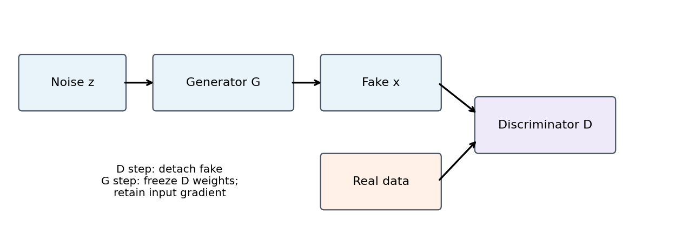
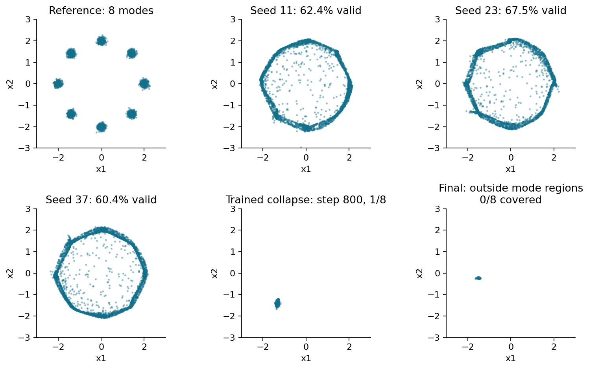
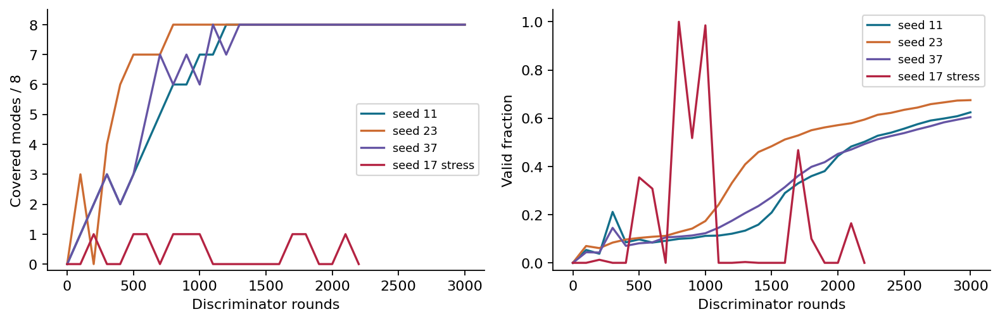
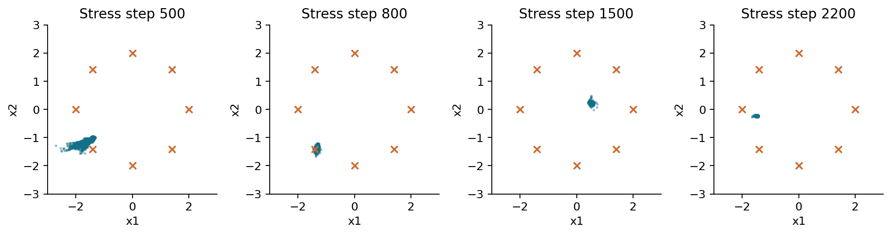
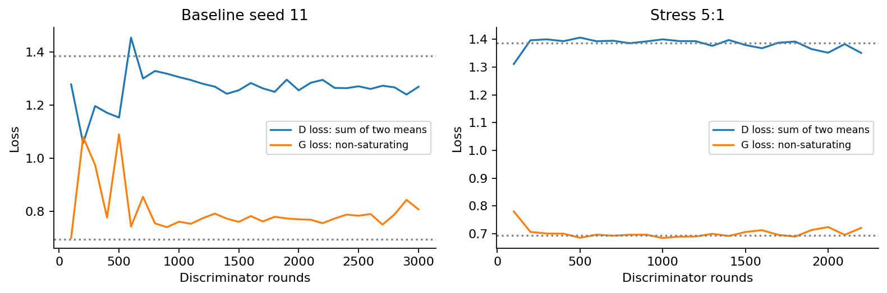

# 对抗生成与博弈训练

## 第061单元 判别器怎样推动一个分布改变

给定一些二维点，我们希望程序能够继续产生“来自同一种规律”的新点。只记住训练样本再随机抽一个，能够给出很像的数据，却没有说明模型学会了怎样在样本之间分配概率。本讲研究另一种路线：生成器把容易抽取的随机数变成数据，判别器不断寻找生成样本与真实样本的差别，生成器再沿着这个差别调整自己。

这是一项分布学习任务。分类器常问“这个点属于哪一类”，生成器则问“应该在哪里放多少概率”。本课的真实分布由圆周上的八个小点团组成。若模型只学会其中一个团，每个生成点都可能十分逼真，但整体分布仍然严重错误。这个简单例子让“质量”和“多样性”的区别直接可见。

目录先修是019、032、030。本讲会重新解释期望、二元交叉熵、梯度与交替更新，不要求先读原论文。阅读目标有四个：写出双方的优化方向；独立推导理想判别器；知道理论中的分布距离为什么不能当作实际训练的单调进度条；用三种初始化和一次真实训练失败建立诊断证据。

随包实验使用原创合成数据、CPU单线程和小型全连接网络。基准三个种子均训练3000轮；压力实验训练2200轮，每轮更新一次判别器、五次生成器。压力实验保留随机输入、完整网络与正常反向传播，没有把输出强制设置为同一个点。另设一个“所有样本等于同一中心”的人为负对照，只用来检查评价器，绝不把它冒充训练中产生的坍塌。

本讲数字来自 outputs/results.json，图来自保存的真实采样与训练轨迹。科学解释需要同时查看过程、最终模型和失败快照。一个中途快照可以说明某种现象确实发生过，不能替代最终结果，也不能隐瞒模型后来是否恢复或进一步恶化。

<div style="break-before:page"></div>

## 一 从随机数到生成分布

设输入噪声为二维向量z，其两个坐标独立服从均值0、方差1的正态分布。生成器是带参数θ的函数，输出同样是二维点：

$$z\sim\mathcal{N}(0,I),\qquad x_{\mathrm{fake}}=G_\theta(z).$$

“生成分布”不是另一个存储概率表的对象。它是反复抽z、运行同一个G后，输出点在空间中出现的频率规律，记为$p_g$。G若把许多不同z映到相近位置，那个区域会获得很高概率；若没有任何z映到某一区域，那里就几乎不会出现生成点。改变θ，便改变了概率质量在数据空间的分配。

实际网络路径为2→64→64→2，中间使用斜率0.2的LeakyReLU。最后一层不限制坐标正负，因为我们的八个中心横跨四个象限。判别器路径为2→64→64→1，最后输出实数s，叫作logit。概率值由Sigmoid转换，$D(x)=1/(1+e^{-s(x)})$。代码直接对logit计算稳定损失，画图和报告均值时才显式取Sigmoid。



判别器标签不是真实数据中的八个团编号。真实点统一标1，生成点统一标0。训练GAN时从未给模型八个中心的标签；这些中心只用于生成教学数据与独立评价。若把中心标签用于损失，就换成了另一个带监督信息的任务。

连续映射还有一个值得保留的直觉：当输入噪声空间连通，普通连续网络往往会在不同输出团之间留下稀少的连接区域。本实验可以看到一些“桥状点”。它们可能来自有限训练和映射几何，不是把它们从图中裁掉就能消失的错误。我们对所有4096个输出计算有效比例，避免只展示最漂亮的一部分。

<div style="break-before:page"></div>

## 二 双方究竟在优化什么

判别器应给真实点高概率，给生成点低概率。对一个真实点，损失为$-\log D(x)$；对一个生成点，损失为$-\log(1-D(G(z)))$。本实验将两组各自的均值相加，不再除以2：

$$L_D=-\mathbb{E}_{x\sim p_{\mathrm{data}}}\log D(x)-\mathbb{E}_{z\sim p_z}\log(1-D(G(z))).$$

期望可以先理解为“对大量样本取平均”。程序每轮只用128个真实点和128个新噪声，因此得到的是带随机误差的估计。两项均值相加时，完全无法区分且输出都为0.5的判别器损失为$2\log 2\approx1.3863$。若把两组拼接后直接取一次均值，数值会变为0.6931，不能据此说后一种写法训练得更好。

经典最小最大目标写成：

$$\min_G\max_D V(D,G),\qquad V=-L_D.$$

这里max_D表示判别器提高正确分类的对数得分；min_G表示生成器使这个得分下降。代码的优化器通常统一执行“减去梯度”，所以判别器最小化负号后的损失，而不是把max原样传给优化器。最常见的符号错误就是两方都最小化同一个V，结果判别器被训练成主动犯错。

手算一个批次：若两个真实点的概率为0.8、0.6，两个生成点为0.2、0.4，两组损失相同，均为$-(\log0.8+\log0.6)/2\approx0.3670$，总损失约0.7340。这说明当前判别器能较好地区分这一批样本，并不说明生成器有多样性。把所有生成样本聚到一处，判别器也许更容易识别，损失反而更低。

“博弈”意味着一方改变后，另一方的目标地形也会改变。普通监督学习可以把数据和标签视为固定，而GAN的假样本分布随训练移动。因此不应期待某个loss一路下降，并把振荡直接等同于程序错误。是否有错误，要结合更新方向、梯度隔离和分布证据判断。

<div style="break-before:page"></div>

## 三 理想判别器的逐点推导

现在暂时固定生成器，假设可以对每个位置独立选择判别概率，且真实分布和生成分布相对于同一参考测度具有密度。记某一点的两个密度为a和b。该点对目标的贡献是：

$$f(d)=a\log d+b\log(1-d),\qquad 0<d<1.$$

a与b表示概率密度，不是神经网络给出的分类概率。为了最大化f，对d求导，令其为0：

$$f'(d)=\frac{a}{d}-\frac{b}{1-d}=0.$$

把分母移过去，得到$a(1-d)=bd$，再整理为$a=(a+b)d$，所以只要$a+b>0$，最优值为：

$$D^*(x)=\frac{p_{\mathrm{data}}(x)}{p_{\mathrm{data}}(x)+p_g(x)}.$$

当a、b都大于0时，二阶导为$-a/d^2-b/(1-d)^2<0$，说明这是严格极大值。若a>0、b=0，最佳值在边界d=1；若a=0、b>0，则d=0。若a=b=0，该位置对目标没有贡献，判别器取任何值都不影响目标，因此不能说它在那里也被唯一确定为0.5。

例如某一区域真实密度为0.3，生成密度为0.1，理想判别概率是0.75。直觉是：在真实与生成来源先验各半时，这里更常出现真实点。若采样来源比例不是各半，或者给真假损失不同权重，分子与分母中要加入相应先验或权重；当前公式不能直接照搬。

理想判别器的结论依赖很强的假设：密度可比较，判别函数容量足够，期望而非有限批次被正确优化，并且G在这一步保持固定。一个只有两层64维隐藏单元的网络、每轮仅更新一次、在有限样本上训练，通常不满足这些条件。推导告诉我们最理想的学习信号是什么，不是证明当前网络每轮真的获得了它。

这条逐点最优化与经典GAN理论对应，原始出处可查看[Goodfellow等，2014，第四节](https://arxiv.org/html/1406.2661v1)。本讲手算例与边界检查用于把条件说清楚。

<div style="break-before:page"></div>

## 四 分布距离的联系与适用边界

把理想判别器代回V。记p为真实密度、q为生成密度，并令$m=(p+q)/2$。先把分母p+q写成2m，就得到：

$$V(D^*,G)=\int p\log\frac{p}{2m}+\int q\log\frac{q}{2m}.$$

每个积分中的log可以拆成两项。由于p、q各自积分为1，两次$-\log2$合起来是$-\log4$。余下两项正是相对熵KL：

$$V(D^*,G)=-\log4+\mathrm{KL}(p\Vert m)+\mathrm{KL}(q\Vert m).$$

$$\mathrm{JS}(p\Vert q)=\frac{1}{2}\mathrm{KL}(p\Vert m)+\frac{1}{2}\mathrm{KL}(q\Vert m).$$

因此理想目标为$-\log4+2\mathrm{JS}(p\Vert q)$。KL通常不对称，JS通过共同的中间分布得到对称量。这里使用自然对数，单位可称为nat。JS≥0，并在p、q几乎处处相等时为0，于是理论最优目标是$-\log4$，且在有概率质量的区域判别器不能区分来源。

做一个离散两格例子：真实分布p=(1/2,1/2)，生成分布q=(1,0)，m=(3/4,1/4)。第一项KL为$\frac{1}{2}\log(2/3)+\frac{1}{2}\log2\approx0.14384$；第二项为$\log(4/3)\approx0.28768$。所以JS≈0.21576，理想V≈−0.95477，比完全匹配时的−1.38629更大。生成器最小化V，理想上希望补回缺失的第二格。

但“理想目标等于JS”并不等于“用小网络交替训练就在单调降低JS”。实际D未必最优；实际G只能表达特定函数族；有限批次带来噪声；优化器可能在相互追逐；本实验生成器还使用下一节的非饱和替代目标。对这些情形，不能拿公式当收敛保证。

此外，对支撑几乎不重叠的两个分布，理想分类器可能极易区分。分布距离虽有定义，它怎样通过有限网络的输入梯度传给G，仍是另一个问题。理论上存在一个全局最佳分布，和实际算法能从当前初始化走到那里，是不同层次的陈述。

<div style="break-before:page"></div>

## 五 为什么改用非饱和生成器损失

经典极小极大生成器只关心V中的假样本项，即最小化$\log(1-D(G(z)))$。若判别器已把假样本概率压到接近0，这个目标经过Sigmoid后的梯度可能很弱。为看清原因，暂时把生成样本处的logit记为s，概率记为d=Sigmoid(s)。

利用$d'(s)=d(1-d)$，有：

$$\frac{\partial\log(1-d)}{\partial s}=-d.$$

若d=0.01，导数只有−0.01。最小化该目标仍希望增大s，但推动力可能很小。本实验改用非饱和目标：

$$L_G=-\mathbb{E}_z\log D(G(z)).$$

$$\frac{\partial[-\log d]}{\partial s}=d-1.$$

同样在d=0.01时，导数为−0.99，比前者大得多。两者都鼓励判别器给生成样本更高概率，但它们的数值和优化路径不同。非饱和目标不能直接放进上一节的公式后仍声称严格最小化那个JS表达式。

这也不是“生成器梯度永不消失”的保证。完整链式求导仍要乘判别器对输入的导数，以及生成器输出对参数的导数。如果判别器在相关区域近乎平坦，或者生成器内部梯度很差，即使logit上的导数较大，参数更新也可能缺乏有效方向。

代码用softplus避免先计算极端Sigmoid再取log。定义$\mathrm{softplus}(s)=\log(1+e^s)$，则真实标签1的损失是softplus(−s)，假标签0的损失是softplus(s)。PyTorch对该函数采用稳定计算，避免直接指数溢出。它与二元交叉熵logit形式对应；可核对[官方BCEWithLogitsLoss文档](https://docs.pytorch.org/docs/2.14/generated/torch.nn.BCEWithLogitsLoss.html)。

当d=0.5时，非饱和生成器损失为log2≈0.6931。但实际D很弱时，G即使完全没学好，也可能得到接近这个值。因此0.6931是特定理想平衡下的参考数，不是“训练通过”的验收线。本实验压力训练末尾就展示了接近0.5的判别概率并不充分。

<div style="break-before:page"></div>

## 六 一轮交替更新中的三条梯度边界

一轮训练不是对两个优化器同时执行一次任意backward。本实验先抽真实批次和噪声，产生假样本，更新判别器；再抽新的噪声，固定判别器参数，更新生成器。由于判别器已发生变化，第二步应重新前向，而不是盲目复用第一步的计算图。

判别器阶段把G(z)执行detach。这样损失仍能更新D，却不沿着假样本路径计算G的梯度。仅仅“不调用生成器优化器step”也可不改变G，但会白算梯度，还可能让旧梯度与下一阶段混合。把边界明确写出来更容易审查。

生成器阶段恰好相反：不能detach生成点，也不能把整个判别器前向包在no_grad里。我们只让D的参数暂时requires_grad=False，仍保留从D的输出经过输入x回到G的计算链。冻结参数是“不更新尺子的刻度”，不是“不允许利用尺子判断向哪个方向移动”。

每次更新前清空对应优化器的梯度。本代码使用zero_grad(set_to_none=True)，然后前向、backward、step。完成生成器更新后恢复D参数的requires_grad。这里网络没有BatchNorm和Dropout；若换成有状态层，仅冻结梯度不一定冻结运行统计，需要另外管理train/eval状态。

```python
fake = generator(z).detach()
loss_d = softplus(-discriminator(real)).mean()
loss_d += softplus(discriminator(fake)).mean()
# 只更新判别器

# 下一阶段：冻结判别器参数，但保留输入导数
loss_g = softplus(-discriminator(generator(new_z))).mean()
# 只更新生成器
```

这段代码展示依赖关系，完整可运行实现见experiment.py。测试文件会在D步骤前后比较G参数和梯度，再在G步骤前后比较D参数并确认G确实改变。测试关注可观察行为，不只搜索代码中有没有“detach”这个词。正常Python和python -O都运行同一组unittest；输入验证使用显式异常，不依赖会被优化模式移除的assert语句。

学习率、每轮更新次数、Adam的动量参数共同控制双方追逐速度。本课基准双方学习率均为0.0002，每轮1:1；压力实验G为0.002、D为0.0001，每轮5:1。这是公开施加的优化失衡，目的是稳定展示失败机制，并非伪装成默认配置的普遍结果。

<div style="break-before:page"></div>

## 七 模式、覆盖与质量要分别测量

“模式”在一般分布里需要严谨定义，本课使用已知的八个高斯团作为教学上的八种模式。中心半径为2，相邻夹角45度，每个团每坐标标准差0.08。训练集有4096个点，数据种子610；另生成4096个参考点，种子611。模型只从固定训练集抽样，参考集不参与参数更新。

对每个生成点，先找最近中心，再计算距离。距离不超过0.35才称为有效点。一个模式只有收到至少全部4096个生成样本的1%才算被覆盖，注意分母是全部样本，而不是有效样本。阈值以外的点仍留在总数中，不能被筛掉后重新宣布“百分之百质量”。

我们同时报告三个量。覆盖数在0至8之间，反映有多少团获得足量样本；有效比例反映有多少输出真正靠近任一团；有效样本内部的最大模式占比反映概率是否集中。条件熵是补充指标，八团均匀时为log8≈2.0794，单团时为0，但必须与有效比例一起看。

一个反例说明为什么单独看覆盖度不足：模型可以把每团1%的样本放对，剩余92%放在圆心，仍达到8/8覆盖。另一个反例说明有效比例不足：所有点都在同一真实中心，有效比例100%，覆盖却只有1/8。第三个反例说明条件熵不足：只有很少点有效，只要这些少量点均匀分散，条件熵也会显得很好。



这些指标利用了合成数据中心这一特权信息，不能原样移植到未知真实图像。对真实任务，覆盖、重复、条件一致性和领域有效性需要重新定义。二维实验的价值是把问题拆得清楚，而不是用一个小分数代替所有生成模型评价。

<div style="break-before:page"></div>

## 八 三个种子告诉了我们多少

相同训练数据、结构和超参数下，种子11、23、37改变参数初始化、批次抽取和训练噪声。每个模型都完整训练3000轮，没有依据参考集分数挑选最好种子。评估噪声使用独立随机数发生器，固定4096个z供同一运行的各个快照比较，因此保存图不会悄悄改变后续训练随机序列。

三个基准最终都覆盖八个模式，但有效比例并不是100%。请把下图与outputs/results.json一起阅读：图中团之间的连接点、团边缘的离群点都计入分母。达到“8个团都见过”只是最低限度的分布覆盖，并不代表每个团的形状和概率都准确。



报告多个种子是为了看见初始化和随机训练带来的变化。三个种子仍不足以证明稳定收敛，也不足以估计所有配置上的失败概率。这里不提供看似精确的总体置信区间，因为样本量过小，且种子只是预先指定的一小组。对比较改进方法的正式研究，应预先约定更多种子、预算、选模规则与评价指标。

还有两种随机性不要混淆。更换训练种子会改变学出的模型；固定模型后重新抽4096个z，会改变评价样本的有限样本波动。若覆盖阈值恰好附近有模式，两者都可能改变覆盖数。诊断应先固定评估噪声比较训练轨迹，再用独立评估噪声检查结论是否对抽样稳健。

训练时间只是本机CPU记录，不是跨设备性能承诺。完整实验保存每轮阶段性指标、最终G/D权重和快照样本。要复算某一张图，可以直接读保存数据；要验证方法真的可训练，应从空进程执行Notebook，重新走训练流程。两种验证回答不同问题，本包都支持。

<div style="break-before:page"></div>

## 九 一次真实坍塌怎样被诊断

压力运行没有删掉噪声输入，没有把网络权重手工置零，也没有在采样后复制某个点。它只是让G相对D更新得更快。由保存轨迹可见，很多噪声映到了非常小的输出区域，而其余真实模式长期缺席。第800轮的快照在有效比例接近1的同时仅覆盖一个模式，有效样本几乎全部落在同一团。这是实际优化产生的模式坍塌证据。

诊断快照不是最终模型。选择规则公开为：从第min(500,总轮数/2)轮开始，在有效比例至少0.5的已记录快照中，优先选择覆盖最少、再选择最大模式占比最高者；若没有满足条件的快照则使用最终快照。本运行规则选到800轮。每100轮的完整轨迹均保留，读者可以判断这种选择突出了哪种现象。



最终2200轮的有效比例为0，覆盖也为0，不能再简单说“最终模型学会了一个真实模式”。更准确的描述是：输出仍高度集中，但集中区域已偏离所有模式。训练中先出现过近乎纯单模式输出，后来又出现偏离有效模式区域的集中输出。这里的模式区域专指距离团中心不超过0.35的评价邻域；高斯混合在整个二维平面都有非零密度。二者都是失败，但失败的位置和证据不同。

诊断先排除评价器错误：参考数据覆盖8/8，人为常数负对照覆盖1/8；再核对训练边界测试，确认G与D各自能更新且无意外detach；接着查看输出方差与轨迹，确认随机z虽不同，输出却缺乏多样性；最后比较公开的更新比率与学习率。此时“优化失衡与有限判别反馈共同伴随坍塌”是受证据支持的解释。

不能仅凭一组实验断言哪一个超参数是唯一原因，因为压力配置同时改变了G学习率、D学习率和更新次数。要作因果归因，需要一次只改变一个因素的对照。本课已提供可修改实现，实验手册要求学生设计这样的后续研究，但不会把尚未执行的对照写成结论。

<div style="break-before:page"></div>

## 十 为什么判别损失会给出错觉

压力运行最后判别器对真实与生成样本的平均概率都接近0.5，生成器损失也靠近log2。若只看这两个数，很容易误以为双方达到理想平衡；但采样图和覆盖指标直接否定这一结论。判别器可能跟不上快速移动的生成器，也可能受有限容量、优化过程和当前数据区域限制。



理论上的命题是：在理想条件下，当生成分布匹配真实分布时，最优判别器无法区分。它不允许倒过来推理成：只要某个有限判别器无法区分，两个分布就一定匹配。一个永远输出0.5的常数分类器也无法区分，但显然不能证明任何生成器都正确。这是逻辑上把充分条件误当成必要充分条件的问题。

平均概率也会隐藏结构。如果一半真实点得0.9、一半得0.1，平均仍然是0.5。诊断要看分布、按模式的行为或更丰富的统计。损失包含对数，平均概率相同也不保证平均对数相同。先平均再取log，与先取log再平均不是同一运算。

损失仍然有价值：NaN可以提示数值故障；异常跳变可帮助定位学习率或梯度问题；长期无法更新可能暴露计算图断开。问题不在于“损失不能看”，而在于“损失不能单独回答生成质量”。每个指标都需要与它实际测量的对象对应。

在本课中，证据层级依次是输入与代码是否可信、更新是否正确、采样分布是什么、最后才是训练数字怎样解释。若先给低loss贴上“成功”标签，再挑支持它的图，就会把评估变成确认偏误。完整输出与固定评价规则能减少这种风险，但不能自动替代批判性判断。

<div style="break-before:page"></div>

## 十一 从小实验迁移到更大的问题

本讲只教基础GAN。它没有实现梯度惩罚、谱归一化、Wasserstein目标、条件生成或图像卷积结构。读到这些扩展时，应先问它们改变了哪一部分：判别器函数约束、双方目标、优化节奏、数据条件，还是评价方式。不要把不同方法中的损失符号和理论结论拼在一起使用。

如果要改进当前实验，一个合理顺序是先确保梯度隔离和数值稳定，再用一次一个因素的对照检查学习率与更新比，最后才扩大模型或改目标。改变训练轮数时，要继续报告计算预算；改变样本分布或评价半径时，要重算参考结果。只增加训练时间未必修复一个相互追逐的系统。

生成器也可能记忆训练集。我们的二维连续数据允许较容易地比较最近邻，但“生成点不与训练点完全相同”不足以证明没有记忆。真实图像或文本中的隐私、版权与重复风险需要另外审查。生成能力和安全可用性不是同一个指标，教学数据也不应被误当作现实部署证据。

### 本讲可核对的结论

第一，判别器为生成器提供可微的输入方向，生成器参数更新经链式法则把这条方向变为输出分布的变化。第二，理想判别器与JS联系需要固定G、充分函数容量和精确期望优化等条件。第三，实际非饱和训练与理想极小极大目标并不完全相同。第四，模式覆盖、有效比例和概率平衡要同时检查。第五，压力运行中的单模式快照来自真实训练；人为常数负对照只验证评价器。

### 自测与阅读

试着不用看答案解释：为什么D步骤detach假样本，而G步骤不能detach？为什么D=0.5不足以证明成功？八个模式都出现过，为何仍可能有92%的点无效？如果改变真假来源先验，理想判别公式怎样变？实验手册给出可运行任务，详细答案同时给出推导与拒绝错误结论的理由。

原始论文：[Generative Adversarial Nets，2014](https://arxiv.org/html/1406.2661v1)。实现语义：[PyTorch BCEWithLogitsLoss](https://docs.pytorch.org/docs/2.14/generated/torch.nn.BCEWithLogitsLoss.html)与[可复现性说明](https://docs.pytorch.org/docs/2.14/notes/randomness.html)。这些是概念与API出处；本包数据、图、训练数值和教材解释均为本次独立制作。跨版本或跨硬件重跑可有数值差异，应重新记录环境与结果，而不是要求浮点结果永远逐位一致。
