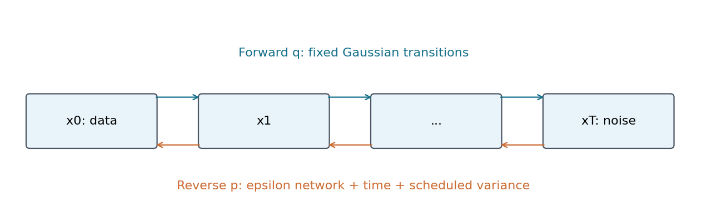
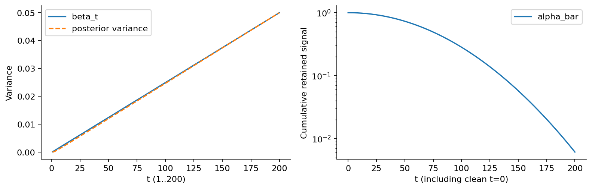
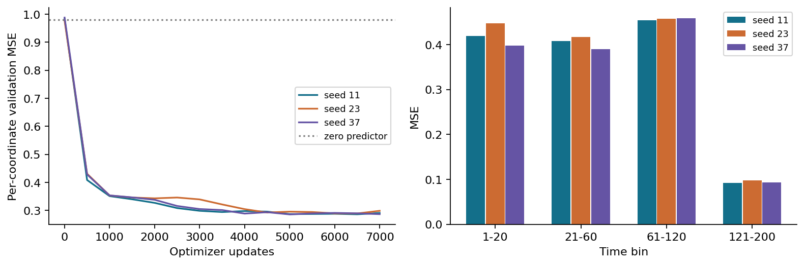
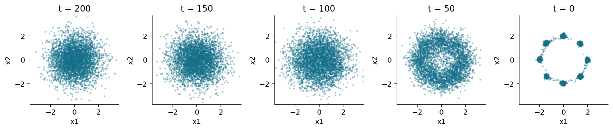
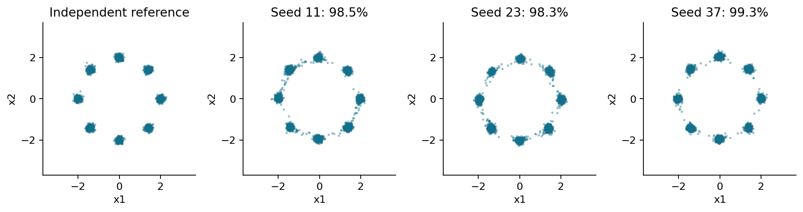

# 离散扩散与去噪学习

## 第062单元 从可计算的加噪到学出的反向生成

把一张清楚的图逐渐加上噪声，最终会很难看出原来的内容。反过来，能否训练一个程序，把噪声逐步变成有结构的数据？扩散模型给出的路线是：先规定一个容易计算的破坏过程，再学习与之对应的反向条件分布。本讲从二维点开始，不要求读者先做完整VAE，也不把复杂图像系统作为理解概率公式的前提。

标题中的“离散”指时间编号t取0、1、2直到T，并不表示状态是离散符号。本讲每个状态x都是二维实数向量，属于连续状态空间。把时间离散的高斯扩散，与词元取有限类别的离散状态扩散混为一谈，会造成目标函数和转移概率上的根本错误。

目录先修017、018、019、030、032、035提供概率、期望、梯度与网络基础。本讲仍会补齐三个连接环节：马尔可夫链怎样分解联合概率；已知原始点时怎样计算一个高斯后验；为什么变分下界中的KL能变成加权噪声预测误差。每一步都给出条件与端点，避免只记住一条采样公式。

实验证据是一个真正训练的DDPM：八个二维高斯团、200个离散加噪步、三种初始化、每种7000次参数更新。三个种子最终均覆盖8个模式，有效比例分别约98.46%、98.34%、99.27%。这些结果来自本包运行，不是把真实点加噪后再用已知原始点恢复，也不是直接从真实数据分布抽样冒充生成。

网络输入只有当前噪声点和时间编号，输出二维噪声预测。训练时才有原始x0与我们主动抽出的ε作为监督；采样从标准正态开始，不访问任何真实训练点。本包提供完整数据、检查点、训练轨迹、顺序执行Notebook、公式测试与图。结论限定在这个小型合成任务，不声称这些参数能直接生成高质量真实图像。

<div style="break-before:page"></div>

## 一 先读懂马尔可夫分解

把$x_0,x_1,\ldots,x_T$看成同一个样本在不同噪声程度下的状态。一般的条件概率链式法则会让每一步依赖所有过去状态。马尔可夫假设将这种依赖简化为：给定紧邻的上一步后，更早的状态不再提供额外信息。因此前向条件联合分布写成：

$$q(x_{1:T}\mid x_0)=\prod_{t=1}^{T}q(x_t\mid x_{t-1}).$$

符号q专门表示我们规定的前向过程；它不含待训练的网络参数。乘积表示先从x0抽x1，再从x1抽x2，依次继续。它不是把T个独立样本相乘，因为每个条件均值都依赖上一步。完整联合分布还要乘数据分布q(x0)。

我们采用如下转移：

$$q(x_t\mid x_{t-1})=\mathcal{N}(\sqrt{\alpha_t}x_{t-1},\beta_t I),\qquad \alpha_t=1-\beta_t.$$

βt在0与1之间，是本步加入噪声的方差；其平方根才是乘在标准正态随机数前的标准差。I是单位矩阵，表示各坐标噪声独立且方差相同。实现一小步相当于$x_t=\sqrt{\alpha_t}x_{t-1}+\sqrt{\beta_t}\epsilon_t$，其中εt在不同步之间独立。

为什么还要缩小旧信号？如果只不断加噪，整体方差会一路增加。乘sqrt(αt)可以在输入已是标准正态时保持标准正态的方差：αt+βt=1。对我们的八团数据，初始方差并非1，因此中间和最终分布不一定精确标准正态；不过信号衰减后会越来越接近它。



反向过程同样写成链，但方向从T到0：

$$p_\theta(x_{0:T})=p(x_T)\prod_{t=1}^{T}p_\theta(x_{t-1}\mid x_t).$$

下标θ提醒我们，反向转移含有需要训练的参数。马尔可夫结构让长联合分布可分解，但不自动告诉我们这些反向条件是什么。

<div style="break-before:page"></div>

## 二 高斯分布与条件信息

二维各向同性高斯可以用均值向量μ和一个标量方差v描述，协方差是vI。均值决定点云中心，方差决定每个坐标的扩散程度。若ε服从标准正态，μ+sqrt(v)ε便具有这个分布。请特别区分v与sqrt(v)，把方差直接当标准差会让噪声强度平方地偏离设计。

条件分布表示“已知一些量之后，剩余不确定性怎样分配”。例如已知原始x0和当前xt时，对上一步xt−1的推断，比仅知道xt时容易得多。因为x0提供了这条噪声链从哪里出发的信息。训练时我们有这种额外信息，可以构造解析目标；采样时没有x0，必须让网络从大量训练经验中学到平均意义上的反向规律。

这两个分布一定要区分：

$$q(x_{t-1}\mid x_t,x_0),\qquad q(x_{t-1}\mid x_t).$$

前者在本讲线性高斯前向链中可精确写为高斯；后者需要对未知x0的条件分布积分，通常可能是混合分布，并不一般精确高斯。DDPM用高斯形式近似可学习的反向转移，是建模选择。较小步长可以帮助这个近似合理，但“所有反向条件本来都是高斯”是错误理由。

一个一维类比：原始数据可能来自−2或+2附近，重噪声后的同一个xt可能由两边都产生。仅看xt无法唯一知道起点；给定起点后，剩余中间状态的推断就简单得多。网络不需要神奇地恢复这一次随机扰动的全部历史，而是在有限信息下预测对训练目标最合适的统计量。

这种信息差也解释了为何噪声预测MSE不必降到0。不同x0与ε组合可能产生同一个xt；若网络只看xt和t，最佳平方误差预测是ε的条件期望。它不一定等于训练例中实际抽到的ε。不可约的不确定性与程序错误是两回事，不能把非零损失一律解释为模型没学会。

<div style="break-before:page"></div>

## 三 前向闭式怎样从两步推出来

把第一步代入第二步：

$$x_2=\sqrt{\alpha_2\alpha_1}x_0+\sqrt{\alpha_2\beta_1}\epsilon_1+\sqrt{\beta_2}\epsilon_2.$$

ε1和ε2独立、均值为0，因此后两项之和仍是高斯，方差为α2β1+β2。利用$\beta_1=1-\alpha_1$、$\beta_2=1-\alpha_2$，可化为$1-\alpha_1\alpha_2$。这里方差相加的前提是独立；如果把每步噪声都错误复用为同一个ε，交叉协方差不为0，公式就不成立。

定义累计信号保留量：

$$\bar\alpha_t=\prod_{s=1}^{t}\alpha_s,\qquad \bar\alpha_0=1.$$

通过归纳，每一步均值乘sqrt(αt)，方差按αt乘上一步方差再加βt，得到：

$$q(x_t\mid x_0)=\mathcal{N}(\sqrt{\bar\alpha_t}x_0,(1-\bar\alpha_t)I).$$

于是训练可以直接抽一个标准正态ε，计算：

$$x_t=\sqrt{\bar\alpha_t}x_0+\sqrt{1-\bar\alpha_t}\epsilon.$$

这个ε代表前t步累积噪声归一化后的整体扰动，不是单独第t步的εt。闭式抽样与逐步抽样在给定x0后的边缘分布相同，通常不会逐样本相等。若要得到一条联合一致的前向轨迹，应按链逐步抽样；若只训练随机时间的一步任务，直接闭式抽样即可。

手算β1=0.1、β2=0.2，则α1=0.9、α2=0.8、barα2=0.72。给定x0=2，一维x2均值是2sqrt(0.72)≈1.6971，方差0.28。取整体ε=−1，得到x2≈1.1679。这是一次抽样值，不是均值，也不是原始信号减去0.28。

在t=0处，barα0=1，闭式返回x0且噪声项系数为0。程序明确允许q_sample使用t=0，用来检查这个恒等端点；训练则只抽1至T，反向均值也只接受1至T，因为它在t=0有除以sqrt(1−barα0)的非法项。

<div style="break-before:page"></div>

## 四 日程不只是长度为T的一串数字

本实验T=200，β从0.0001线性增加到0.05。为了让数学下标与数组一致，数组长度是201，索引0专作占位：β0=0、α0=1、barα0=1。真正的加噪步是1至200，真正的反向循环是200、199直到1，输出x0后立即停止。

很多实现把β1存在数组索引0，这也完全可行，但不能把两种约定混写。例如在当前代码中torch.randint(1,201,...)会生成1至200；如果误写randint(0,200)，便同时纳入不该训练的t=0并漏掉T。错误往往不导致立刻崩溃，却悄悄改变整个任务。



终点barαT约0.006，sqrt(barαT)仍非0，因此q(xT|x0)并非精确N(0,I)。我们选择标准正态作为采样先验，是在终点信号足够弱时的近似。检查终点必须看累计乘积和数据尺度；只说“加了200步，所以已经纯噪声”没有数学保证。

一个常见错误是把原论文1000步的线性β末值0.02照搬到200步，却不检查累计信号。缩短T后噪声未必足够抹去数据结构。本实验选0.05是二维教学中的明确配置，不是通用于图像的推荐值，也不是原论文完全复刻。

日程还决定不同时间的学习难度。在小t处噪声轻微，预测噪声可能需要区分数据自身的局部变化；在大t处xt本身接近噪声，预测整体ε可能反而较容易。不能想当然认为时间越大，噪声MSE一定越大。后面的分时间区间统计能检验这个直觉。

数据尺度同样重要。本课八团半径为2、团内标准差0.08，没有额外归一化。若坐标整体乘100却保持日程不变，终点的残余信号也放大100倍，标准正态先验近似会恶化。预处理、日程和先验必须一起说明。

<div style="break-before:page"></div>

## 五 已知x0的后验：完成平方

设t≥2，把待推断的上一步记为y=xt−1。由贝叶斯规则与马尔可夫性质，忽略不含y的归一化常数后：

$$q(y\mid x_t,x_0)\propto q(x_t\mid y)q(y\mid x_0).$$

第一项均值为$\sqrt{\alpha_t}y$、方差$\beta_t$；第二项均值为$\sqrt{\bar\alpha_{t-1}}x_0$、方差$1-\bar\alpha_{t-1}$。把两个高斯的负对数相加，y的二次项系数（精度）为：

$$A=\frac{\alpha_t}{\beta_t}+\frac{1}{1-\bar\alpha_{t-1}}=\frac{1-\bar\alpha_t}{\beta_t(1-\bar\alpha_{t-1})}.$$

精度的倒数就是后验方差。线性项系数为$h=\sqrt{\alpha_t}x_t/\beta_t+\sqrt{\bar\alpha_{t-1}}x_0/(1-\bar\alpha_{t-1})$。将二次式写成$A\|y-h/A\|^2$加常数，可读出后验均值h/A：

$$\tilde\beta_t=\frac{1-\bar\alpha_{t-1}}{1-\bar\alpha_t}\beta_t.$$

$$\tilde\mu_t=\frac{\sqrt{\bar\alpha_{t-1}}\beta_t}{1-\bar\alpha_t}x_0+\frac{\sqrt{\alpha_t}(1-\bar\alpha_{t-1})}{1-\bar\alpha_t}x_t.$$

这不是神经网络近似，而是已知x0后的解析结果。它为训练提供一个可计算的目标分布。注意均值中的两个系数一般不恰好相加为1，不能不加说明地把它叫作普通的凸加权平均。

仍用β1=0.1、β2=0.2，barα1=0.9、barα2=0.72，得到tildeβ2=0.2×0.1/0.28≈0.0714286。x0的系数约0.677631，x2的系数约0.319438。若x0=2、x2=1，则后验均值约1.67470。

t=1是特别边界：给定x0后，要推断的x0已经被知道，后验退化为点质量，tildeβ1=0。均值公式形式上返回x0，但不能把这个零方差后验与普通非退化高斯一起机械代入含log方差的KL公式。变分分解把这一端点作为重构项单独处理，正是下一节要解释的事。

<div style="break-before:page"></div>

## 六 为什么需要变分下界

反向模型定义联合分布后，数据的边缘密度需要把所有潜在中间状态积分掉：

$$p_\theta(x_0)=\int p_\theta(x_{0:T})\,dx_{1:T}.$$

对一个有200步神经网络转移的模型，这个积分通常很难直接求。训练时我们有已知的前向分布q(x1:T|x0)，可以在积分中乘除同一个q，把边缘密度写成一个期望。再利用log的凹性，也就是Jensen不等式，得到：

$$\log p_\theta(x_0)\geq\mathbb{E}_q\left[\log p_\theta(x_{0:T})-\log q(x_{1:T}\mid x_0)\right].$$

右边叫证据下界ELBO。它是对log密度的下界；取负号后就变成负log密度的上界。符号容易记反：如果我们的损失L是负ELBO，那么$-\log p_\theta(x_0)\leq L$。最小化上界是一条可计算的训练路线，但上界不一定等于真实负对数似然。

这个差距可精确写成前向条件q与模型真实后验$p_\theta(x_{1:T}\mid x_0)$之间的KL。KL非负，因此不等式方向成立；只有两者一致时差距为0。这里q不是另一个本课要训练的编码器，而是预先固定的噪声链，所以不需要先实现VAE实验才能理解推导。

KL的含义是比较两个分布。它在两个分布一致时为0，通常不对称；不是比较两个样本点的欧氏距离。后面之所以出现平方误差，是因为特定高斯分布的KL能够化简，而不是任何KL都天然等于MSE。

在计算机里训练时，我们用随机x0、随机t、随机ε估计期望。即使公式定义了一个严格上界，单个随机批次的数值也不一定处处大于每个样本的真实负对数密度；上界关系是完整期望和正确目标下的数学陈述。进一步换成无权重噪声MSE后，更不能拿日志数字直接当似然上界。

<div style="break-before:page"></div>

## 七 把长链下界拆成三类项

为了把ELBO变成容易训练的表达式，先把前向联合分布反向分解。给定x0时，有：

$$q(x_{1:T}\mid x_0)=q(x_T\mid x_0)\prod_{t=2}^{T}q(x_{t-1}\mid x_t,x_0).$$

将这个式子和模型联合分解同时代入负ELBO，按log项分组，得到三部分。第一部分是终点前向分布与采样先验的KL：

$$L_T=\mathrm{KL}(q(x_T\mid x_0)\Vert p(x_T)).$$

第二部分对t=2至T逐项比较已知x0的后验与模型反向转移：

$$L_{t-1}=\mathbb{E}_{q(x_t\mid x_0)}\mathrm{KL}(q(x_{t-1}\mid x_t,x_0)\Vert p_\theta(x_{t-1}\mid x_t)).$$

第三部分是t=1端点的重构负log密度：

$$L_0=-\mathbb{E}_{q(x_1\mid x_0)}\log p_\theta(x_0\mid x_1).$$

三类相加，再对数据x0取期望，便是负ELBO。记号Lt−1表示与从t退到t−1的转移有关，名字里出现t−1不意味着代码应该把时间输入也减1。网络在预测这一步时看到的是xt和t。

固定日程与标准正态先验后，LT不含θ，因此优化网络参数时可以忽略它；“可以忽略梯度”不代表其值为0，也不代表先验近似完美。本包不报告完整似然，便不必把它与端点常数混进训练日志。若要报告ELBO，应把所有项按定义完整计算。

对于连续二维数据，本讲理论端点可选择正方差高斯$p_\theta(x_0\mid x_1)=\mathcal{N}(\mu_\theta,\beta_1I)$，于是L0是含归一化常数的连续密度损失。它不同于真实图像整数像素的离散概率解码器。离散像素要考虑概率质量和量化区间，不能把连续密度数值原样称为每个像素的概率。

这套分解与[DDPM原论文第二、三节](https://arxiv.org/html/2006.11239v2)对应。本讲后续明确区分理论密度、简化训练目标和最后一步不加噪的展示采样，不把三者偷偷当成同一件事。

<div style="break-before:page"></div>

## 八 高斯KL怎样变成均值误差

设已知x0的后验是N(tildeμ,tildeβI)，模型反向转移是N(μθ,σt²I)，维度为d。当t≥2且两个方差都正时，高斯KL为：

$$\frac{1}{2}\left[d\left(\frac{\tilde\beta_t}{\sigma_t^2}-1+\log\frac{\sigma_t^2}{\tilde\beta_t}\right)+\frac{\|\tilde\mu_t-\mu_\theta\|^2}{\sigma_t^2}\right].$$

若σt²固定，不依赖θ，第一部分是与网络参数无关的常数。网络需要最小化的是均值差平方，权重为1/(2σt²)。若进一步σt²=tildeβt，方差那一整块恰好为0；若选择βt，它通常不为0，但仍是固定日程下的常数。

本实验对t≥2选择σt²=tildeβt。方差越小，同样的均值误差在KL里代价越大，这符合直觉：一个窄分布对中心错位更加敏感。但我们实际训练还会采用去掉时间权重的简化目标，因此不能仅凭“固定后验方差”就说日志等于高斯KL。

手算一维同方差例子：两个高斯方差都是0.25，均值相差0.2，KL等于0.2²/(2×0.25)=0.08。若方差改成0.01而均值差仍为0.2，KL变为2。相同欧氏误差在不同噪声尺度上的概率意义完全不同。

若方差也由神经网络预测，原先被称为“常数”的项就可能依赖θ，不能删掉再沿用同样推导。本课不训练方差，也不引入学习方差的扩展模型。代码、数学和报告必须对这个选择保持一致。

t=1不能把tildeβ1=0放进上述公式，因为那是退化点质量而非普通连续高斯密度。理论上端点用L0处理，程序上采样末步也单独分支。许多“loss突然变NaN”的问题，根源不是学习率，而是在端点把log0或除以0带进了本不适用的公式。

<div style="break-before:page"></div>

## 九 从均值预测改写为噪声预测

由前向闭式可以把原始点解出来：

$$x_0=\frac{x_t-\sqrt{1-\bar\alpha_t}\epsilon}{\sqrt{\bar\alpha_t}}.$$

把它代入后验均值公式，合并xt的系数后得到：

$$\tilde\mu_t=\frac{1}{\sqrt{\alpha_t}}\left(x_t-\frac{\beta_t}{\sqrt{1-\bar\alpha_t}}\epsilon\right).$$

训练时ε已知，但采样时未知。于是定义网络εθ(xt,t)，用它替换ε，便得到模型反向均值μθ。网络输出不是新的样本，也不是方差，而是与状态同维的噪声估计。每次采样时，先算均值，再按选定方差加入新的反向随机噪声。

两个均值的差只剩噪声预测误差乘一个确定系数。代入上一节均值KL项，可得t≥2时：

$$L_{t-1}=w_t\mathbb{E}\|\epsilon-\epsilon_\theta(x_t,t)\|^2+C_t,$$

$$w_t=\frac{\beta_t^2}{2\sigma_t^2\alpha_t(1-\bar\alpha_t)}.$$

这里Ct与θ无关，wt通常随时间变化。实验使用的简化目标不带wt，且对两个坐标取平均：

$$L_{\mathrm{simple}}=\mathbb{E}_{t,x_0,\epsilon}\frac{1}{d}\|\epsilon-\epsilon_\theta(x_t,t)\|^2.$$

t在1至T均匀抽取，d=2。平方和与坐标均值差一个常数2；KL时间权重的变化则不是单一常数能够消除。若精确估计各时间KL总和，还要考虑随机抽时间后的求和缩放，例如均匀抽取时乘相应项数。省略这些细节便不能声称计算了精确ELBO。

因此本实验日志是噪声预测MSE，不是精确负log似然，也不是完整ELBO。它是基于高斯推导启发的重加权训练代理目标。这个目标可以生成很好的样本，但样本质量与密度估计仍应分别评价。推导关系解释了为什么预测噪声有用，并不赋予任意MSE“精确似然”的名称。

<div style="break-before:page"></div>

## 十 时间嵌入让同一网络知道噪声程度

相同坐标xt在不同t下有不同含义。t很小时，它可能已接近一个真实团；t很大时，它可能主要是高斯噪声。若不给网络时间信息，网络必须用同一映射应对相互冲突的条件任务。时间不是训练迭代次数，而是一个样本在噪声链中的位置。

本实验将u=t/T与六组正弦余弦拼接，频率为1、2、4、8、16、32，角度为πfu。时间向量共13维，再与二维xt拼接为15维输入。网络采用15→96→96→96→2和SiLU激活。所有t共享同一组参数，而不是训练200个独立网络。

一轮训练包含六步：从固定4096个训练点里抽256行；为每行独立抽t；独立抽同形状ε；通过闭式得到xt；用网络预测ε；对全部行与坐标求平均平方误差并更新一次参数。训练无需显式走完200步前向链，这正是闭式的计算价值。

```python
t = torch.randint(1, T + 1, (batch_size,))
eps = torch.randn_like(x0)
xt = q_sample(x0, t, eps, schedule)
pred = epsilon_model(xt, t)
loss = ((pred - eps) ** 2).mean()
```

验证集2048行使用独立数据种子621；时间和噪声使用固定种子622，因此跨训练阶段的验证MSE可比较。我们不依据验证结果挑选最佳检查点，三个种子都用7000步最终模型。固定验证随机数减少曲线噪声，但正式评估时仍应意识到它只是一组有限样本。



零预测器始终输出0，对标准正态噪声每坐标的期望MSE是1。实际验证噪声是有限样本，因此基线不会恰好等于1。训练后的整体验证MSE约0.29，明显低于零预测基线，但不能据此宣布已经知道了精确数据似然或保证所有模式概率一致。

<div style="break-before:page"></div>

## 十一 真正采样时不能偷看原始点

采样先抽$x_T\sim\mathcal{N}(0,I)$，然后从t=T倒数到1。每步把xt与t送进网络，得到ε预测并构造μθ。对t>1，再加入标准差sqrt(tildeβt)乘新的独立标准正态z：

$$x_{t-1}=\mu_\theta(x_t,t)+\sqrt{\tilde\beta_t}z,\qquad t>1.$$

最后t=1，本实验默认返回μθ(x1,1)，不再注入随机噪声。这与常见DDPM展示采样约定一致。它不是从前面选定的正方差端点密度N(μθ,β1I)精确抽样；为使区别可检查，代码提供terminal_noise=True，末步加入sqrt(β1)z，并另存对应样本与指标。



这里涉及三个不同的“噪声”。训练监督ε是闭式前向累计噪声；网络输出εθ是对它的估计；反向每步抽的z是新随机变量。把训练例中已知ε直接带到采样，或在生成时使用真实x0计算后验均值，都属于把答案泄露给模型，不能称为真正生成。

同样不能每一步重新抽一个xT，否则上一轮反向计算的结果被丢弃，链便断了。正确做法是把新xt−1作为下一步网络输入，直到得到x0。代码保存若干中间状态帮助检查这个依赖；不同t的子图展示的是同一批样本的推进。

我们的所有反向网络调用严格使用t=200至1，无t=0调用。训练网络也从不接收t=0，因此最后多调用一次不仅数学公式非法，还超出了训练时间范围。边界测试会用记录时间的虚拟模型核对这个调用序列，防止看似不起眼的range写错。

<div style="break-before:page"></div>

## 十二 从二维结果得出有限结论

评价规则与第061单元保持同样直观含义：点到最近真实中心距离≤0.35视为有效；每个模式收到至少全部4096个生成样本的1%才算覆盖。中心只用于评价，不用于网络训练损失或采样。三种种子都达到8/8覆盖，有效比例接近99%，但模式占比仍有差别。



种子11有效比例0.9846，种子23为0.9834，种子37为0.9927。最高条件模式占比依次约0.1349、0.1661、0.1481，而理想均匀八团为0.125。有限生成样本会带来统计波动，网络也可能存在分配偏差；仅凭视觉接近不能宣布概率完全正确。

当前DDPM在这套数据上比第061单元的基础GAN有更高有效比例，但这不是公平算法排行榜。两课模型结构、更新次数、采样成本和优化选择不同。GAN通常一次前向即可产生点，本DDPM需要200次网络调用；它使用了更多训练步骤与不同训练目标。比较方法需要约定共同预算和多套配置，不能凭一个教学配置断言普遍优劣。

这次实验没有计算似然、FID或图像感知质量，也没有测试条件生成、文字提示或分类器引导。二维高斯团没有真实图像中的纹理、语义与版权问题。课程下一步可以迁移到小图像，但迁移前应保留这里已经建立的数学与边界检查，而不是只复制一个更大的网络。

采样随机种子与训练种子分开记录。相同模型换采样种子会改变点云，但不改变参数；换训练种子会改变模型本身。若要估计评价不确定性，可以固定检查点反复采样，再在多个训练种子之间比较，两层变异不应混为一个标准差。

<div style="break-before:page"></div>

## 十三 错误检查表与下一步

第一类错误来自索引。确认数组位置0代表干净端点，训练t只在1至T，反向循环包含T与1且不调用0。第二类来自方差。β、1−barα与tildeβ分别代表单步前向、累计前向和已知x0后的后验方差，不能互换；采样乘的是其平方根。第三类来自条件信息。训练可用x0与ε，采样只能用xt、t和网络。

第四类来自目标解释。简单噪声MSE省略时间权重、端点密度和先验项，不能直接叫精确似然。第五类来自过度评价。低MSE、高覆盖或漂亮图各自只测量一部分现象，要同时检查概率分配、样本质量、计算预算与随机性。

本包单元测试包含闭式与逐步前向的矩比较、后验均值两种表达式的一致性、噪声误差与KL均值项的等价性、t=0恒等、t=1零后验方差、反向时间序列、非法索引与不匹配形状。正常与-O模式都运行，以确认输入检查不会随着assert被移除而消失。测试是公式到代码的连接，不应只是检查文件是否存在。

### 本讲的核心链条

从马尔可夫结构出发，固定高斯前向转移；由独立噪声的线性组合推得任意时间闭式；在知道x0时通过完成平方求后验；用Jensen得到可训练的变分界；把中间高斯KL化为均值差；再用前向闭式把均值差改写为噪声误差。实际训练选择简化无权重MSE，实际采样明确处理末步边界。每个箭头都带条件，不能跨过条件直接套用结果。

### 主要来源与原创范围

[Ho、Jain、Abbeel，Denoising Diffusion Probabilistic Models](https://arxiv.org/html/2006.11239v2)给出本讲采用的离散时间框架、噪声参数化和简化目标。[Sohl-Dickstein等，2015](https://arxiv.org/abs/1503.03585)是前向破坏与反向建模路线的重要早期来源。本包的二维数据、网络尺寸、200步日程、训练输出、数值例子、图与练习均独立制作，不复制论文图像或宣称复现其图像基准成绩。

完成实验后，你应能不用背诵地回答：为何训练无需走完前向链？为何给定x0的后验高斯不意味着真实反向条件总是高斯？为何t=1不能套普通KL？为何一个0.29的训练指标不能当作数据的负log似然？这些问题比记住某个采样器名字更能检验理解。
