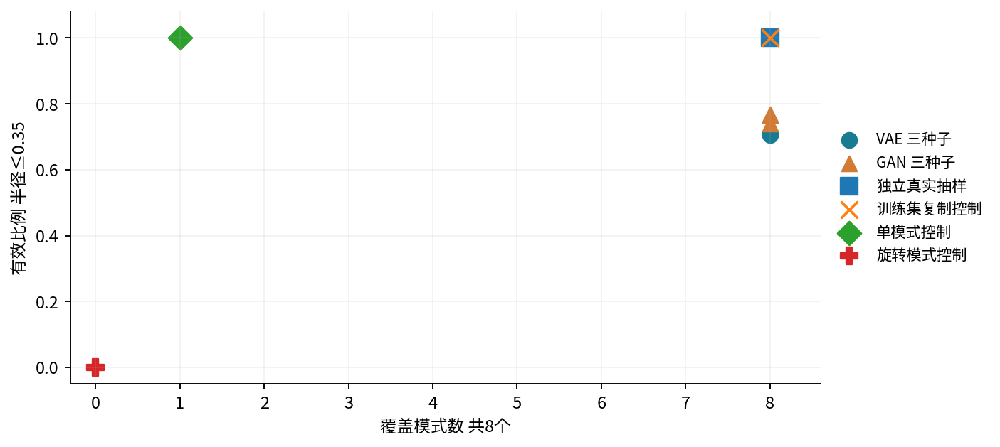
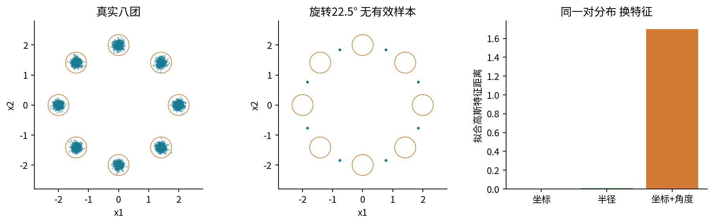
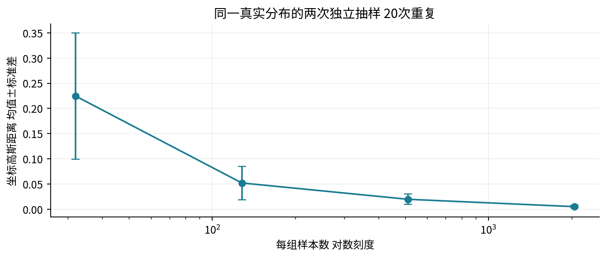
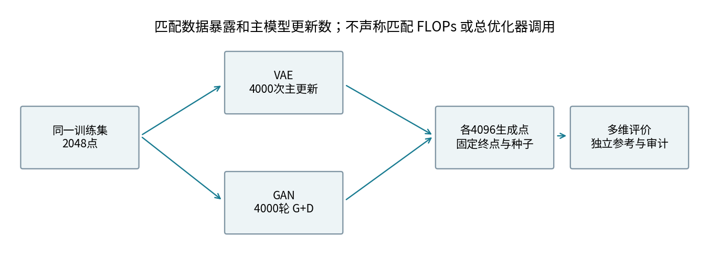
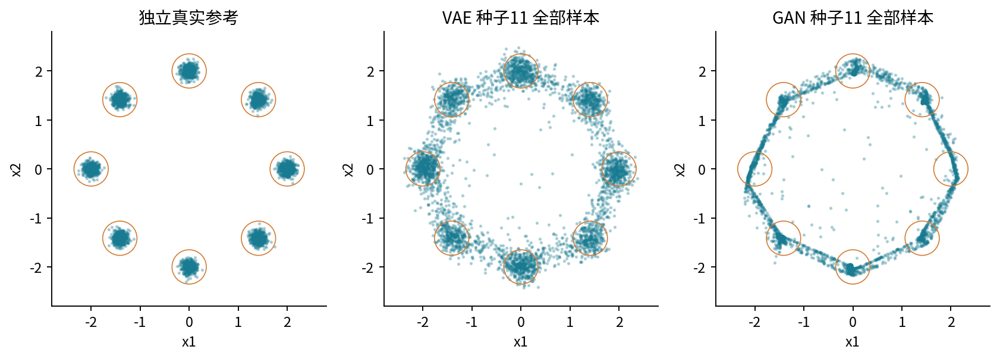
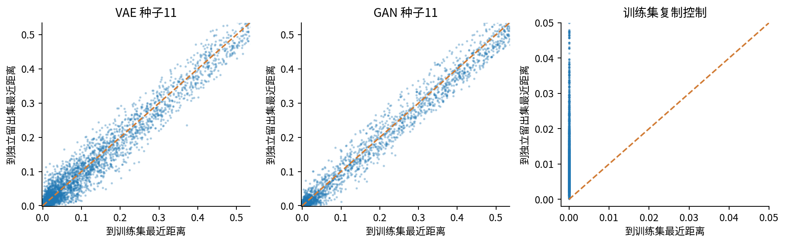

# 生成模型评价与风险

## 第063单元 把好看的样本变成可检验的证据

假设两位同学各训练了一个生成器。甲展示九张非常漂亮的图，乙展示九张略模糊但内容各异的图。谁的模型更好？这个问题还没有可检验的答案。我们不知道图是不是挑过，没看到的样本是什么样，模型是否只会少数几种内容，也不知道漂亮的图是否直接来自训练集。评价首先是把“好”拆成不同问题，再让每个问题对应一份可以复查的证据。

本讲区分五件事：质量回答“单个输出是否落在合理区域”；覆盖回答“真实分布的重要部分是否被遗漏”；多样性回答“输出之间是否变化以及变化是否有意义”；条件一致性回答“输出是否满足用户给的条件”；记忆审计回答“模型是否异常依赖或复现训练内容”。这些问题相关，却不能互相代替。一个复制器可以拥有很高的质量和覆盖，同时没有我们期待的独立生成能力。

目录先修为022、019、030。本讲只实际比较VAE和GAN，因此补充这两类模型的必要接口与目标，不要求先学完对比学习或扩散。实验对象是原创二维八团数据；简单几何让我们知道质量和覆盖的参照答案，适合暴露指标盲点。它不能模拟自然图像的全部语义，也不提供现实隐私保证。

本包确实训练了六个网络：VAE和GAN各三个种子、各4000个主模型更新。VAE有效比例约70.5%至71.1%，GAN约74.0%至76.7%，两类都覆盖8团；但只使用坐标均值和协方差的距离反而偏好VAE。这种冲突不是需要掩盖的异常，而是本讲最重要的学习材料。

读完后，你应能独立写出公平协议，解释似然与样本指标的区别，手算一维高斯距离，识别特征和样本量导致的排序变化，实施大小匹配的近邻检查，并写出不超出证据的模型结论。所有数据、权重、完整输出、实验代码和已执行Notebook均在本单元内。

## 一 从总体问题走到样本估计

生成器通常先抽一个简单随机变量z，再输出x。z可能是二维标准正态；x可能是二维点、图像或文字。反复改变z得到一批输出，这批输出的频率规律定义了模型分布。训练数据也只是某个未知真实分布的一批有限样本。评价比较的是两种分布，但我们实际拿到的往往只有两个有限集合。

记真实分布为P，模型分布为Q，真实参考点为r1到rn，生成点为g1到gm。即使Q恰好等于P，两次独立抽样的样本均值通常也不同。因此“指标不为0”可能同时含有模型差异和抽样误差。反过来，某个指标为0也只表示它看见的部分相同，不保证两个分布完全相同。

本课八个中心均匀放在半径2的圆上。先等概率抽一个中心，再加标准差0.08的二维高斯噪声。每个点都带一个生成时的模式标签，但训练网络只接收坐标，不接收标签。中心与标签由评价器使用，是这个合成任务特有的额外知识。

$$c_k=2(\cos(k\pi/4),\sin(k\pi/4)),\qquad k=0,\ldots,7.$$

训练集2048点来自固定种子630；近邻留出集2048点来自独立种子631；特征距离参考集4096点来自种子632。另取种子633的4096点作真实抽样控制。四组用途不同，不能把“参考”误当成模型可读取的训练数据。

这里独立指随机生成过程使用不同随机流；二维连续噪声并不使每组都拥有完全不同的语义模式。它们本来就应该包含相同的八个模式。数据不重合与分布不重叠是两个概念：公平评价要求训练与留出样本来源独立，通常希望它们属于同一个目标分布。

思考一个边界：若将参考点整体乘100，而生成点不变，距离会变大，但模型本身没有改变。这暴露了预处理不是无关细节。单位、坐标缩放、图像尺寸、裁剪方式和特征提取步骤必须写进协议，不能藏在实现里。

## 二 质量和覆盖必须分开计算

在这个已知几何的任务中，我们把到最近中心不超过0.35的点称为有效点。这个阈值是评价定义，既不是神经网络学出的判别器，也不等于概率密度大于某个通用阈值。真实高斯分布具有无限尾部，因此真实抽样也可能偶尔落在有效域外。

$$v_i=\mathbf{1}\{\min_k\|g_i-c_k\|_2\leq 0.35\},\qquad \widehat Q=\frac{1}{m}\sum_{i=1}^{m}v_i.$$

粗体1是指示函数：括号内条件成立时取1，否则取0。先找每个生成点的最近中心，再判断是否有效。质量估计是所有有效点的数量除以全部生成点数。不要先删除离群点再报告质量，那会把失败样本从分母中消失。

覆盖还要计数。记nk为落在第k团有效域的点数。如果nk至少占全部生成点的1%，就认为第k团被覆盖。4096个点时，计数必须至少41，因为40/4096小于0.01。

$$\widehat C=\sum_{k=0}^{7}\mathbf{1}\{n_k/m\geq 0.01\}.$$

为什么不用“至少出现一个点”？一个几乎放弃某个模式的生成器偶尔碰到它，不代表有实用的覆盖。为什么仍用全部点作分母？若先只保留有效点，100万个离群点加8个恰在各中心的点就会被看成模式均衡。分母决定了我们真正测量的问题。

质量与覆盖不是文献中某一精确率召回率算法的复刻。本课利用已知中心定义了透明的教学代理指标。自然图像没有这样的中心真值，需要更复杂的特征和邻域假设；报告时应写明指标名字与定义，不能仅借用听起来熟悉的缩写。

## 三 多样性不等于到处散开

一个生成器输出全屏白噪声时，几乎不会重复同一张图，像素距离也可能很大。但这并不意味着它掌握了目标分布的多样性。有效的变化必须落在任务要求的合理范围中。相反，一个生成器在每个模式附近都输出一点细微抖动，团内差异很小，却可能覆盖了所有重要类别。

本课先统计有效点的模式分布，再用熵描述它们是否偏向少数团。令p̃k为第k团有效计数除以有效总数。这里的分母故意与覆盖不同，因为这个指标只回答“已经有效的点怎样分配”。报告时必须与质量并列，防止读者把条件分布当整体性能。

$$H=-\sum_{k:\tilde p_k>0}\tilde p_k\log\tilde p_k.$$

八团完全均匀时H=log8≈2.0794 nats；只有一团时H=0。若没有任何有效点，代码返回0作为约定，并同时保留有效比例0；不能把这个0解释为“有效点全在同一团”，因为有效点根本不存在。

手算四团例子：有效点比例为1/2、1/4、1/4、0，则H=−(1/2)log(1/2)−2(1/4)log(1/4)≈1.0397。它低于均匀四团的log4≈1.3863。这个数字告诉我们模式分配不均匀，却不告诉我们每团内部的形状是否正确。

还可以比较团内方差。假如每团都只输出中心，模式熵满分，团内方差却为0；真实每坐标方差是0.08平方。生成器可能学会“类别清单”，没有学会类内变化。我们的单模式和旋转控制专门揭示一部分盲点，不能代替一套完整的分布检验。

一个好的样本展示应同时包含固定随机样本网格、预先定义的失败案例、整体计数和明确选择规则。把最漂亮的16个样本与随机抽取的16个样本混在同一行而不标注，会让定性证据失去可比性。教学图里采用固定种子并展示全部二维点，读者可以直接从保存数组重新作图。

## 四 似然回答的问题与样本质量不同

概率模型对一个观察x给出pθ(x)。离散情况下它是概率质量；连续情况下它是概率密度。密度可以超过1，数值会随测量单位改变。不能因为某个二维点的高斯密度为2，就说模型给出了不合法的概率。真正的概率是对一个区域积分后的结果。

负对数似然为−log pθ(x)。在独立留出数据上平均，是检查模型给真实观察分配多少概率的一种方式。它不等于“挑一个生成点看起来多好”。模型可能对常见背景统计分配很多概率，却没有学会人关注的语义；另一模型可能产生少数漂亮输出，却漏掉大片真实分布。

VAE还存在推断近似。引入编码分布qφ(z|x)，有下界关系：

$$\log p_\theta(x)\geq \mathbb{E}_{q_\phi(z\mid x)}\log p_\theta(x\mid z)-D_{KL}(q_\phi(z\mid x)\|p(z)).$$

右边叫ELBO。它由重建对数概率与KL组成，和真实对数似然之间还有近似后验到真实后验的KL差距。有限次Monte Carlo进一步引入估计误差。因此一个VAE的负ELBO、另一个模型的精确负对数似然、GAN的判别器损失，不能直接排成同一张“越小越好”的总榜。

本课VAE取二维标准正态先验，编码器输出均值与对数方差，解码器给二维高斯的均值，观测标准差固定为0.15。每样本目标为高斯NLL加标准正态KL，先按坐标求和，再按批次平均。生成时先抽z，再给解码均值加0.15倍标准正态噪声。只画解码均值相当于改变了被评价的分布。

GAN则把z直接变成一个点，判别器给“像训练数据”的logit。生成器使用非饱和目标softplus(−D(G(z)))；判别器比较真实与生成点。判别器不断变化，其损失不是统一校准的图像质量单位。代码用稳定的softplus，不把sigmoid后的概率再取log，以减少数值溢出风险。

## 五 从一维推导高斯特征距离

特征评价先用一个映射φ把样本变成向量，再比较真实和生成特征。图像中φ可能是某个固定网络；本课用坐标、半径，以及加入角度信息的显式特征。映射必须固定，不能分别为两类模型挑有利的版本。

先看一维高斯X=μr+σrZ与Y=μg+σgZ，共用标准正态Z。它们的平方距离期望为：

$$\mathbb{E}(X-Y)^2=(\mu_r-\mu_g)^2+(\sigma_r-\sigma_g)^2.$$

展开平方后，交叉项含E[Z]=0，噪声平方项含E[Z²]=1。这种单调耦合在一维高斯间给出最优平方搬运代价。注意比较的是标准差，不是方差的平方差。若真实均值0、标准差1，生成均值1、标准差2，距离是1²+1²=2。

多维时均值项仍是向量平方距离；协方差部分要考虑方向。对两个协方差矩阵Cr和Cg，可写为：

$$D=\|\mu_r-\mu_g\|_2^2+\mathrm{tr}(C_r+C_g-2(C_r^{1/2}C_gC_r^{1/2})^{1/2}).$$

tr表示对角元素之和，矩阵平方根S满足SS=C。这里不是逐元素开平方，也不能总把协方差当成互相可交换的数。代码先对称化矩阵，再用特征值分解构造半正定平方根，夹去浮点误差级别的微小负值；若出现明显负特征值则报错。

二维对角例子中，Cr=diag(1,4)、Cg=diag(4,1)，两均值分别(0,0)与(1,0)。两个坐标的标准差差分别为−1与1，因此总距离是均值项1加协方差项1+1，得到3。你可以不用任何神经网络验证这个数。

FID使用特定图像Inception特征与高斯拟合。本实验没有Inception模型，故严格称为“拟合高斯特征距离”，不称FID分数。公式形式相似并不使指标可跨特征、跨尺度、跨数据集比较。坐标乘10时，同一坐标距离会乘100。

## 六 均值与协方差相同仍然可以完全错位

把八个中心绕原点旋转22.5度，新点恰好位于相邻真实中心之间。每个新点到最近真实中心约0.7804，大于0.35，因此它们全都无效。可它们的均值仍是0，两个坐标方差仍相等，坐标交叉协方差仍是0。仅看前两阶矩，这个错误分布几乎与真实八团相同。

更强的理想版本是不加团内噪声：原始八中心与旋转八中心的均值、样本协方差完全一致，坐标高斯距离在浮点误差内为0。单元测试直接构造这个反例。距离为0的证明只约束“拟合出的两个高斯”，没有证明原始八点分布相同。

本课增加φ(x)=(x1,x2,r,cos4a,sin4a)，r为半径，a为极角。四倍角的选择不是任意的：原八中心的cos4a在+1与−1之间交替，sin4a约为0；旋转22.5度使角色变化。均值或协方差因此能看到坐标矩遗漏的角度结构。

但这不是发现了万能特征。选择这些特征依赖我们知道任务有八团；对于别的分布，它们也可能失灵。增加特征维数还改变了量纲与权重，数值更大不自动表示指标“更正确”。本课将三种映射并列，目的是证明评价结论依赖评价器看见什么。

在图像中，同样的问题会以更隐蔽的形式出现：特征可能对颜色、纹理、几何或某些语义更敏感。不同预训练数据和输入变换会改变它的盲点。报告不能只写“使用标准指标”，而应提供特征模型版本、层、预处理和参考集合，让他人重建同一个测量过程。

## 七 样本量怎样改变分数

设从同一个分布独立抽两组样本。总体距离为0，但有限样本均值的差通常非0。假设每组n个点，单坐标总体方差为σ²，则两组均值差的方差为2σ²/n。均值差平方的期望也是这个值，因为均值差的总体均值为0。

$$\mathbb{E}(\bar X-\bar Y)^2=\frac{2\sigma^2}{n}.$$

这个小推导已经说明：即使协方差完全已知，代入样本均值仍会带来正偏差。协方差的估计和矩阵平方根又增加非线性影响。使用n−1分母得到无偏样本协方差，并不使整个高斯距离估计无偏。

实际20次重复中，每组32、128、512、2048个点的坐标距离均值分别约0.2246、0.0521、0.0197、0.0051。它们来自独立真实抽样，与VAE或GAN训练无关。样本越多，本例分数整体越靠近0；不能据此宣称任意模型与任意参考下都严格单调。

另一个问题是覆盖的有限样本漏检。若一个模式真实概率为p，独立抽m次完全没看见它的概率是(1−p)的m次方。当p=0.01、m=100时，漏检概率约0.366。仅仅“没有在展示样本中见到”还不足以证明模型概率严格为0。我们的覆盖还要求最低频率，因此其波动不仅来自完全没见到，也来自计数跨阈值。

公平做法是固定真实和生成样本数、给出随机种子、重复估计或至少报告波动；比较模型时使用同一参考集以减少无关变化。固定参考集不能消除它本身的估计误差。三个训练种子反映优化随机性，20次评价抽样反映测量随机性，二者不可混称为20次独立模型复现。

## 八 公平协议先于排名

本课比较两个完整可运行的教学实现，不能把它包装成“VAE与GAN谁普遍更强”。公平首先要说明匹配了哪些资源，再说明没有匹配什么。没有一条单独的匹配规则能自动消除架构、优化、超参数搜索和计算成本之间的差异。

两者读取同一2048点训练集，每轮抽128个真实点，都执行4000次主生成模型参数更新，最后用固定采样种子产生4096点。VAE训练整个编码器与解码器；GAN每轮还训练判别器一次。两者均不读取留出集来挑选检查点，不展示最佳种子作为总体结论。

VAE有9094个参数；GAN生成器4482个、判别器4417个。总参数量接近仍不代表FLOPs相等，因为一次前向和反向经过的网络不同。优化器学习率也不同：VAE为0.001，GAN的两部分均为0.0002。它们是预先固定的教学配置，不是用相同搜索预算找到的最优实现。

为什么不简单强迫所有超参数相同？不同目标的梯度尺度和优化性质不同，机械相同可能使其中一类明显欠训练。真正的大型比较通常需要声明各家族调参预算、验证集选择规则、最终测试冻结和计算成本。本课资源较小，选择完整公开配置并把结论限制在这些配置。

时间也要正确解释。outputs中记录各次训练经过的墙钟秒数，供估算复跑成本；并发负载、CPU版本和库版本会影响它们，不能视作稳定速度排行榜。可复现不是承诺所有机器逐位相同，而是提供足够信息让读者重建实验、识别变化来源并复核主要结论。

## 九 读懂这次实际比较

下表每行都来自保存的完整结果。质量越高越好；坐标高斯距离越低越好；覆盖最大为8。所有行均使用4096个生成点与同一4096点参考集，保留VAE观测噪声。

| 模型 | 种子 | 有效比例 | 覆盖 | 坐标高斯距离 |
|---|---:|---:|---:|---:|
| VAE | 11 | 0.7107 | 8 | 0.00794 |
| VAE | 23 | 0.7065 | 8 | 0.00741 |
| VAE | 37 | 0.7046 | 8 | 0.01082 |
| GAN | 11 | 0.7402 | 8 | 0.01784 |
| GAN | 23 | 0.7654 | 8 | 0.01322 |
| GAN | 37 | 0.7673 | 8 | 0.01632 |

若只读最后一列，会偏好VAE；若读有效比例，则本次三个GAN种子都更高。两者可以同时为真。坐标高斯距离受均值、总体尺度和方向影响，并不直接统计点是否落在八个窄团里。VAE可能更好地匹配整体一二阶矩，同时让更多样本落在团间或团外。

换成加入角度的特征，本例GAN距离约0.120至0.160，VAE约0.162至0.186，排序与有效比例更一致。这种一致性支持“坐标特征漏看了一些结构”的解释，但仍不证明新特征可用于所有数据，也不能把数值差直接翻译成用户满意度差。

本例正确的结论是：在公开的二维数据、架构、预算与固定终点下，GAN在该有效域指标上更高，二者覆盖相同，坐标矩距离给出不同排序。错误结论包括“GAN全面胜出”“VAE更会记忆”“FID已经被证明无用”。评价需要保留冲突，而不是用一个总分把冲突藏起来。

## 十 最近邻审计怎样避免自欺

一个输出离训练点很近，可能是复制，也可能只是训练数据在这个区域很密。八个小团有大量相近点，真实独立样本也会靠近训练集。要解释“近”，必须问：它相对于同样大小、同分布的独立留出集有多近？

对生成点g，分别计算到训练集合T和留出集合H的最近欧氏距离：

$$d_T(g)=\min_{x\in T}\|g-x\|_2,\qquad d_H(g)=\min_{x\in H}\|g-x\|_2.$$

本课两集合都含2048点。若训练参考有十万个点，而留出参考只有一百个，训练近邻通常更近，即使模型没有记忆。这是集合大小造成的机会差异。还应保持预处理一致，并检查重复数据是否跨集合出现。

代码另外记录容差10的−7次方以内的精确训练匹配率。复制控制从训练数组抽行，其匹配率为1；六个网络的本次4096点匹配率均为0。独立真实抽样控制的训练更近比例约0.507，接近对称直觉；实际GAN和VAE不同程度偏向留出集，这也可能反映局部密度和数据集随机差异。

最近邻没有报警不等于隐私安全证明。生成器可能在罕见输入、特定条件或更多抽样下泄漏；欧氏距离可能漏掉变换后的副本；部分记忆可能只保留片段而非整例。本课只进行公开合成数据上的检出能力演示，没有实施成员推断、秘密提取或真实个人数据风险测量。

实现按256个查询点分块，避免构造过大的距离张量。分块改变内存使用，不改变数学定义。单元测试验证自我最近距离为0、复制控制可检出以及参考大小不匹配时明确报错；报错使用异常，因此Python优化模式也不会关闭它们。

## 十一 条件一致性需要另一份协议

本课VAE和GAN都是无条件生成器。它们没有接收“生成第三团”这样的请求，因而不能声称测试了条件一致性。一个模型不支持的功能应标记为不适用，而不是用总体覆盖间接替代。若未来加入条件y，就应分别评价每个条件下的分布Q(x|y)。

假设条件是八团编号。最直接的条件一致率，是输出最近有效中心的编号是否等于输入y；离群点应计为失败。还要按条件分层报告，因为总体准确率可能被常见条件支配。每个条件抽相同数量和按真实频率抽样回答不同问题，不能悄悄互换。

如果评价器是另一个分类网络，结果同时依赖评价器本身。它可能把不自然的点判断为正确类别，也可能系统性误判某些条件。先检查评价器在独立真实数据上的混淆矩阵，再研究它对离群样本是否稳健。高分类一致率只证明通过了这个评价器，不证明满足所有人类要求。

文字条件更复杂。提示“两个红色方块和一个蓝色圆”至少含数量、颜色、形状和关系四类要求。整体图文相似度可能被某一显著词主导，未必检查了全部约束。应把可观察条件拆开、记录失败类型，必要时做盲评，并预先规定评价标准。

也要区分训练中出现的组合与新组合。如果每个属性分别见过，但某个组合未见过，测试的是组合泛化；如果某属性本身也未见过，则问题不同。拆分方式决定你能作出的研究结论。不能在结果出来后，把“困难条件”从平均值中移走。

可以给本课设计一个纸面扩展：每团生成512点，记录条件一致率、每团团内距离、每团精确训练匹配率，以及固定随机展示。真正实施前还需训练条件模型并保存其输入条件。本包没有伪造这些结果；把尚未测量的项目明确留白，比给出没有对应实验的完整评分更诚实。

## 十二 从评价风险到使用边界

生成模型风险不是一个抽象的“危险分数”。至少要区分数据来源风险、输出可靠性风险、泄漏风险和部署场景风险。它们对应不同证据，也有不同的可缓解方式。一个模型在二维几何上合格，不会自动获得真实内容的授权或事实正确性。

数据来源要追问训练材料能否使用、是否含敏感内容、是否出现跨集合副本。输出可靠性要追问任务中什么错误代价高：创意草图中的形状变化，与科学图像中的结构变化，可能有完全不同的影响。对需要事实准确的用途，“看起来真实”尤其不能替代核验。

泄漏评价应记录威胁模型：谁能访问生成器，能否自选条件，可以抽多少次，能否读取权重，什么内容算泄漏。没有这些边界，“我们没有看到复制”很容易被误解为无限强的保证。本课只检查固定随机种子下的无条件4096点输出，且所有点均是原创合成数据。

研究中应避免两种极端。一种是因为有几个漂亮输出就忽略失败；另一种是因为任何测试都不可能证明绝对安全，就认为测试没有价值。透明、可重复的局部检查仍能发现实际错误，例如参考重叠、复制、模式遗漏或分母写错，只是结论必须与检查覆盖面匹配。

我们对复制控制有很强的局部证据：它确实从训练数组抽行，所有查询的训练最近距离为0；这个行为由构造和检测共同支持。对神经网络则只能说“在本次条件和容差下没有精确副本检出”。二者不能用相同语气表达。

若要把实验迁移到真实图像，先固定合法数据来源与拆分，明确图像处理和特征版本，再决定质量、覆盖、条件一致与记忆审计的指标。增加人类盲评时应记录抽样和标注流程。最后才谈排行榜。评价协议不是训练结束后的装饰，而是决定训练结果能支持哪些行动的研究设计。

## 十三 把测量接回可复跑代码

experiment.py把任务拆成数据生成、模型训练、模型采样、指标与审计四层。训练函数只接收训练坐标；采样函数只接收模型、家族、随机种子和数量；评价器在模型输出之后读取参考数据。这种接口划分能减少“无意用真实点改善生成”的可能，也让每部分可以单独测试。

VAE检查点保存整个编码器与解码器，GAN保存生成器和判别器。复生采样只需要生成部分，但保留辅助网络有助于核查实际训练。torch.load使用weights_only=True加载自己信任来源的文件；陌生检查点仍应谨慎处理。重新生成样本后用逐元素比较，而不只比较均值或图形外观。

Notebook在新Python进程内按顺序执行全部代码单元，真实重训六个网络，把结果另存notebook_outputs。图像以PNG数据嵌入Notebook，因此脱离当前运行内核也能看到结果。这里验证的是顺序执行与保存输出，没有声称测试浏览器Jupyter界面的全部行为。

20项单元测试覆盖随机数据可复现、覆盖分母、质量边界、距离恒等与平移缩放、矩阵平方根、旋转盲点、近邻检出、VAE梯度、真实短训练和检查点采样。普通模式与−O模式均运行。测试通过并不说明指标没有盲点；旋转盲点测试本身就是验证“这个指标确实有已知限制”。

本讲建立的工作顺序是：先写问题和定义，再冻结数据与选择规则，执行训练，保留完整样本，检查估计误差和控制分布，最后写带范围的结论。下一讲只选VAE一个家族，围绕一个可证伪干预完成项目；不把学完全部生成模型当成开题条件。

## 一手来源与阅读范围

VAE概率接口参考Kingma与Welling的[Auto-Encoding Variational Bayes](https://arxiv.org/html/1312.6114v11)；GAN目标参考Goodfellow等的[Generative Adversarial Nets](https://arxiv.org/html/1406.2661v1)。高斯特征评价背景见[TTUR与FID论文](https://arxiv.org/abs/1706.08500)，质量覆盖拆分动机见[Precision and Recall for Distributions](https://arxiv.org/abs/1806.00035)，有限样本偏差见[Effectively Unbiased FID](https://arxiv.org/abs/1911.07023)。本文几何反例、代码、所有数值与图均为原创实验，不是上述论文的基准复刻；更详细核验记录见sources.md。
