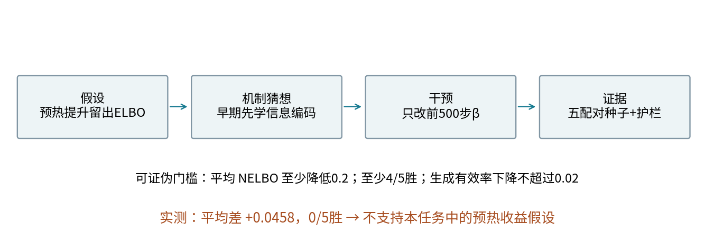
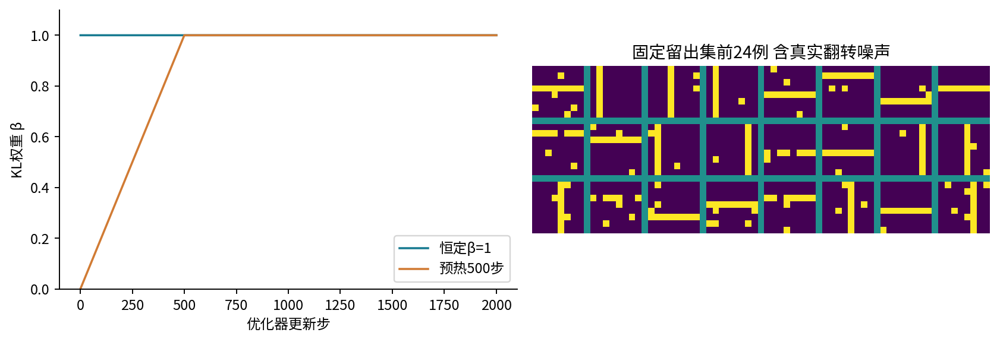
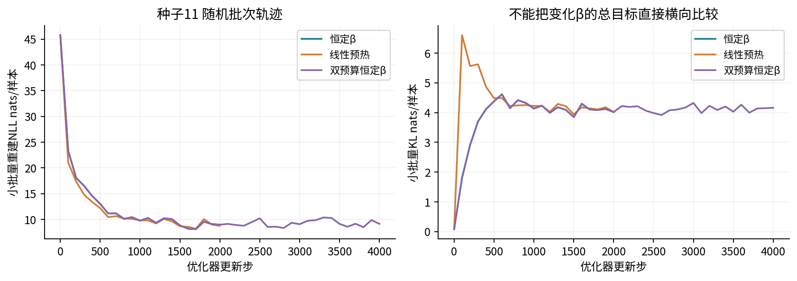
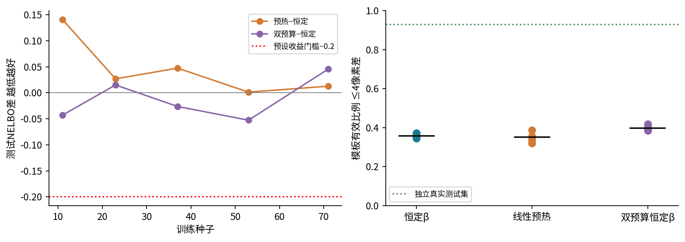
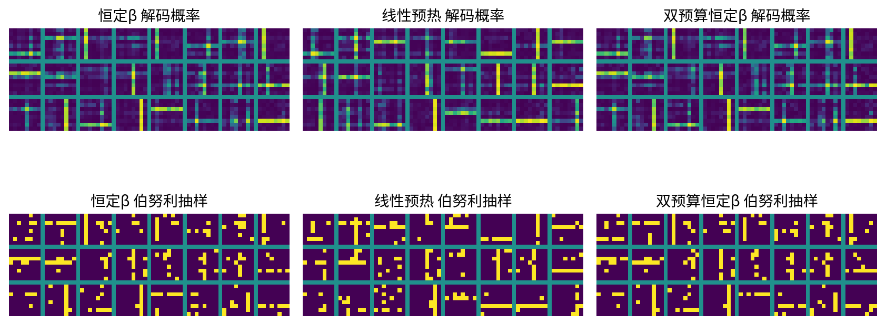
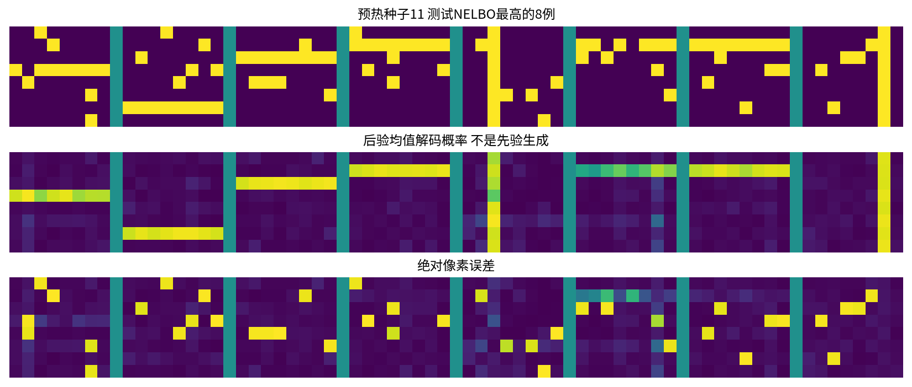

# 表示或生成研究项目

## 第064单元 用一个可证伪的VAE假设完成研究

本讲完成一个范围清楚的研究项目：在同一小型VAE、同一训练数据和同样2000次更新下，前500步逐渐增大KL权重，是否能改善留出数据的负ELBO，同时不明显损害生成样本质量？问题故意很窄。你不需要先掌握所有生成家族，才能对这个问题给出有价值的答案。

目录先修为022、040、058；本项目选择VAE，因此衔接060所需的概率目标与重参数化，不要求059、061或062。我们会重新推导目标，并提供本单元自包含实现。跨家族比较需要另外处理063的公平评价问题，但本讲主要比较同一家族中的单一训练干预。

研究不以“预热一定有用”为结尾要求。实际五个配对种子中，预热的测试负ELBO都未低于恒定β基线，平均差约+0.0458 nats/样本；预先设定的收益门槛为至少降低0.2，故本次不支持收益假设。这个结果并没有破坏项目，它让我们知道某种常见训练技巧在何种具体条件下没有显示预期收益。

实验同时包含一个不使用潜变量的独立像素基线，以及更新数加倍的恒定β对照。所有神经网络确实训练；所有固定终点、逐例测试分数、失败样本索引、权重、概率图与实际二值抽样均保存。我们不通过换种子、改阈值或只画漂亮样本把负结果变成正结果。

你将学会把直觉写成可证伪命题，从机制猜想到控制变量，连接概率目标、损失实现、验证设计与有边界结论。重点不是追求新的模型名称，而是完成一条可信的证据链：别人拿到这个文件夹后，可以知道问题是什么、模型如何训练、每个数如何产生，以及它不能说明什么。

## 一 把兴趣改写成研究假设

“我想研究VAE”太宽，无法决定实验何时结束。“我想让样本更漂亮”又缺少明确测量。一个可执行的假设至少包含对象、干预、比较对象、结果指标和成功门槛。本项目对象是8×8二值条纹图；干预是前500步线性KL预热；比较对象是同预算恒定β=1；主结果是固定留出集负ELBO。

预先规定的主张有三个联合条件：预热减去恒定基线的五种子平均负ELBO差不高于−0.2 nats；至少4/5种子为负；生成模板有效比例的平均下降不超过0.02。前两项要求收益有大小也有跨种子一致性，最后一项是质量护栏。三个条件全部满足才支持这次假设。

0.2不是自然界规定的常数，而是本次教学项目明确选择的实际收益门槛。预先声明的价值在于避免看完结果再把门槛改成0.001。换任务可以选择别的门槛，但应在独立评估之前说明理由，或清楚标记为事后探索。

“可证伪”不意味着一个实验能决定训练技巧在所有场景中的真伪。我们检验的是给定数据、架构、日程和预算下的具体预测。失败可能说明技巧无益，也可能说明作用机制在这里不是瓶颈，或者预算已足够让基线追上。后面用潜变量诊断与双预算对照缩小解释范围。

研究开始前还应写出停止规则。本包固定训练15个模型、评价预定终点并完成失败检查后停止，不追加种子直到出现理想结果。新的日程或架构属于下一次实验，应重新规定比较和数据使用方式，而不是不断修改本次假设的含义。

## 二 数据让假设可以看见

我们生成12种基础模板：第2至第7行中的一条水平亮线，或第2至第7列中的一条垂直亮线（对应Python数组索引1至6）。每张8×8图有64个二值像素。基础模板包含8个亮像素；最外侧的行与列不作为线的位置，避免对称展示的边界混淆。

真正的观察不是干净模板。亮线像素以0.95概率为1，背景像素以0.03概率为1；各像素在给定模板后独立抽样。因此图像会缺少少量线像素，也会出现背景噪点。这个设计让模型既要学习全局“横或竖、位置在哪”，也要容纳随机观察噪声。

$$p(x_j=1\mid y)=0.03+0.92\,t_{y,j}.$$

ty,j是模板y的第j像素，取0或1。若模板像素是1，概率为0.95；若为0，概率为0.03。它与把连续图像加高斯噪声再截断不同，模型选择伯努利观察分布正是为了匹配这种二值数据。

训练1024张、验证256张、测试512张分别用独立种子640、641、642生成。离散分布中不同独立样本可能恰好相同；独立生成不是承诺像素数组绝无重复。这里测试的是同一模板分布下的泛化，不是新模板或新领域泛化。

验证集用于观察固定终点，没有据它挑选超参数或检查点。测试集只用于本次已固定协议的最终报告。所有方案共用同一拆分，因此配对差更容易解释；但五个训练种子并不等于五个独立数据集，这一点将限制我们的不确定性陈述。

## 三 用潜变量表达共同结构

一张图中同一条横线上的像素往往一起亮。若给每个像素单独学一个概率，能学到“中间区域常亮”，却无法表达“这一张选择第三行，另一张选择第六列”的共同变化。潜变量z提供一个共享原因，让64个像素通过同一隐藏表示产生相关性。

生成模型先抽四维标准正态z，再经过解码器输出64个logit。logit不是概率，经过sigmoid后才得到每个像素的伯努利参数。给定z时假设像素条件独立；把z积分掉后，像素一般不独立，因为它们共同依赖同一个z。

$$p_\theta(x,z)=p(z)\prod_{j=1}^{64}p_\theta(x_j\mid z),\qquad p(z)=\mathcal{N}(0,I).$$

“条件独立”经常被误读成“生成图像中像素没有联系”。可以用简单例子澄清：先用一个公平硬币选择横线或竖线，再在该模板内独立加噪。给定模板时噪声独立，但不知道模板时，像素之间明显相关。本实验就是这种结构的神经参数化近似。

编码器走相反方向，输入64维图像，输出四维均值μ和四维对数方差lv，定义近似后验qφ(z|x)。它不是生成时必须有的入口，而是训练时帮助推断哪些潜变量能够解释这张图。真正先验生成不读取真实图像，也不先对某张训练图编码。

本课架构是64→48→四维参数的编码器，四维→48→64的解码器，隐藏层使用Tanh。均值与对数方差是两个输出头。对数方差截在−12至8之间，避免极端数值；这是一项公开的实现选择，并不改变我们要解释的基本概率对象。

把μ送进解码器可得到“后验均值解码图”，适合检查重建，但它既不是对所有后验z解码的平均，也不是先验生成图。神经网络非线性意味着decoder(E[z])通常不等于E[decoder(z)]。本包会明确标注这两类图，不用重建图冒充生成能力。

## 四 变分下界从哪里来

训练希望让真实图像有较高边缘概率pθ(x)，但它需要积分所有可能的z。直接计算这个四维积分也并不因维度小就自动容易，因为解码器是非线性网络。引入一个可抽样、可计算密度的qφ(z|x)，可以构造可训练的下界。

先将边缘概率写成q下的期望，再用log的凹性：

$$\log p_\theta(x)=\log\mathbb{E}_{q_\phi(z\mid x)}\frac{p_\theta(x,z)}{q_\phi(z\mid x)}\geq\mathbb{E}_q\log\frac{p_\theta(x,z)}{q_\phi(z\mid x)}.$$

将联合分布拆成p(z)pθ(x|z)，就得到重建对数概率减去近似后验到先验的KL。取负号后，训练最小化的负ELBO为：

$$\mathcal{J}=\mathbb{E}_q[-\log p_\theta(x\mid z)]+D_{KL}(q_\phi(z\mid x)\|p(z)).$$

第一项让抽到的潜变量能解释观察，第二项限制编码分布偏离先验的程度。它们不是两个任意拼接的惩罚项；当权重β=1时，这个组合来自明确的边缘概率下界。把β改成其他数，得到相关的加权训练目标，但一般不再是原模型的标准ELBO。

更精确的恒等式是log pθ(x)=ELBO+KL(qφ(z|x)||pθ(z|x))。右边最后一项是到真实后验的距离，与训练目标里“到先验”的KL不同。混淆这两个KL，会误以为KL越小就一定推断越准确。真实后验通常依赖x，先验不依赖x。

本课用一次后验抽样估计每个训练例的重建期望，KL解析计算。评价使用32次抽样平均以减少噪声。ELBO的下界关系适用于精确期望；有限Monte Carlo估计会围绕它波动，单次估计不是保证逐例成立的确定性上界证书。报告中称其为“估计负ELBO”，不把它写成精确负对数似然。

## 五 伯努利重建和高斯KL逐项推导

对于一个二值像素x，模型预测概率π，伯努利质量为π的x次方乘(1−π)的(1−x)次方。取负对数后得到二元交叉熵：

$$\ell(x,\pi)=-x\log\pi-(1-x)\log(1-\pi).$$

若模型认为亮的概率0.8，真实像素为1时损失−log0.8≈0.2231；真实像素为0时损失−log0.2≈1.6094。错误而自信的预测受到更大惩罚。64像素的条件NLL是64项之和，因为条件联合概率是乘积。

令logit为a，π=sigmoid(a)。同一损失可稳定写为softplus(a)−xa。代码调用binary_cross_entropy_with_logits，内部处理极大正负logit，避免先算sigmoid得到0或1后再取log导致无穷大。

对一个潜变量坐标，q为N(μ,σ²)，先验为N(0,1)。将两者log密度相减并在q下取期望，利用E[z²]=μ²+σ²和E[(z−μ)²]=σ²，可得：

$$D_{KL}=\frac{1}{2}(\mu^2+\sigma^2-1-\log\sigma^2).$$

四维对角高斯的KL按坐标求和，令lv=logσ²后变为：

$$D_{KL}=\frac{1}{2}\sum_{k=1}^{4}(\mu_k^2+e^{lv_k}-1-lv_k).$$

μ=0、lv=0时KL=0；四个μ均为1、lv仍为0时，每维贡献1/2，总计2 nats。这个手算直接成为单元测试。若logit全为0，则每像素预测0.5，一张图重建NLL必为64log2≈44.3614，与图有多少亮点无关。

注意缩放：本课先对64像素求和，再对批次平均；KL也先对4个潜维求和，再对批次平均。若重建项改成所有像素平均而KL仍按样本求和，KL相对权重会放大64倍。很多“预热有用”的表面发现，实际只是修正了不一致的归约单位。

## 六 重参数化与训练日程

从qφ(z|x)直接抽样似乎会让梯度被随机操作截断。重参数化把参数依赖移到一个可微变换里：先抽与参数无关的标准正态ε，再计算z=μ+exp(lv/2)ε。固定这次ε时，z对μ和lv有普通导数，反向传播就可以经过编码器。

$$\frac{\partial z_k}{\partial\mu_k}=1,\qquad \frac{\partial z_k}{\partial lv_k}=\frac{1}{2}e^{lv_k/2}\epsilon_k.$$

这不是消除随机性，而是换一种表达同样的随机变量，让梯度估计可用。训练时每批都重新抽ε；测试为比较方案采用固定共享随机流，减少评价噪声差异。固定评价随机流不会使32次抽样成为精确积分，只是让比较更可复核。

预热干预只改变训练目标中的KL系数：

$$\mathcal{J}_t=\mathrm{NLL}+\beta_t\mathrm{KL},\qquad\beta_t=\min(1,t/500).$$

第1步β为0.002，第100步0.2，第500步达到1，以后维持1。程序从t=1计数，没有声称第一步β精确等于0。恒定基线全程β=1；双预算对照同样全程β=1，只多训练2000步。

为什么有人会尝试预热？训练早期编码器可能尚未学会有用结构，强KL约束可能让它靠近不含输入信息的先验。减小早期KL权重，可能帮助网络先学会用潜变量表达观察，再逐渐约束到可先验抽样的空间。这是机制猜想，不是任何架构都必然获益的定理。

如果基线已经充分使用四个潜变量，或者简单数据很快学会，预热可能没有可解决的瓶颈。甚至早期学到的表示会让后期调整更难。因此我们既要看主指标，也要看KL、活跃维度与打乱编码诊断，而不能只画一条总损失曲线。

## 七 强基线和控制变量怎样落地

强基线不是故意训练得差以突出新方法。恒定β基线使用相同架构、Adam学习率0.003、批量64和2000次更新，能够明显利用潜变量且达到较低测试负ELBO。它与预热共享初始化种子、训练批次索引流与重参数化噪声流；主要差别只有前500步的β。

配对设计的意义是减少无关随机变化。对于种子11，两个方案从相同权重开始、看相同顺序的小批次、使用相同ε；训练路径在梯度受β影响后分开。若让它们从完全不同初始化开始，观察差异会更难归因于日程。相同种子本身还不够，随机数调用次序也必须一致。

第三个方案把恒定β更新数加倍到4000。它不是与预热同预算的主要竞争者，而是计算量对照：如果简单增加训练已经能解释收益，就应优先考虑这个替代解释。代码测试验证短恒定训练与长恒定训练的相同更新前缀完全一致。

另有独立像素基线：只从训练集估计每个位置的亮点频率，假设64个像素完全独立，然后计算测试NLL。它不含潜变量、不需要神经网络，给出“仅学习像素边际”的参照。数值约25.8346 nats/图，显著高于VAE约14.1的估计负ELBO，说明潜变量模型已学到相当多共同结构。

不能把非神经基线较弱误称为预热的胜利，因为恒定VAE也同样远好于它。研究干预需要超过有竞争力的同类基线；简单基线的作用是验证任务和表示学习确实带来结构收益。不同层次的比较对象回答不同问题，不能在论文叙述中偷换。

所有方案固定终点，没有早停或根据测试挑最佳epoch。验证集只保留独立诊断。学习率没有大规模搜索，因此这里的“强”是相对于这个小任务中已学会有用表示的基线，不能宣称它是所有可能VAE实现的最优版本。

## 八 把训练曲线当诊断而非裁判

训练日志每100步记录当前随机批次的重建NLL、KL、β与总目标。这些值不是整个训练集的精确平均，也不是测试指标。它们有批次噪声，局部上升并不一定表示优化发散。看图前先明确每条曲线取自哪些样本、使用什么归约和哪个β。

如果把预热前100步的NLL+0.2KL与恒定β的NLL+KL直接比较，会奖励前者使用较小系数，即使两个模型的NLL与KL完全相同。主评价必须把所有模型放到共同目标上；本课在测试时统一β=1，报告NLL、KL和二者之和。

观察潜变量是否被忽略时，KL接近0只是一个线索。KL也会因观察噪声、目标权重和架构而变化；较大的KL不自动代表有用信息。我们另测每个μ坐标在测试样本间的方差，大于0.01称该维活跃，这是诊断阈值而非信息论定义。

打乱编码诊断更直接一些：先用μ(x)重建x，再把这批μ在样本之间反转配对，比较像素MSE。若解码器确实使用输入相关信息，错误配对通常使重建更差。本课三方案平均打乱MSE增量都约0.19，且所有测试模型均有4个活跃维度；恒定基线没有明显“完全不使用z”的迹象。

这些证据支持“本任务中潜变量完全塌缩不是主要瓶颈”的解释，但并不构成完整因果证明。活跃坐标可以包含冗余信息，打乱诊断也依赖选定的重建方式。机制分析应使用多个互补观察，不把某个阈值一过就写成机制已经被证明。

## 九 用配对差读主结果

下面给出五个种子的完整测试估计。所有测试重建期望均用32次后验抽样，评价随机种子6499。NELBO越低越好，预热减去恒定基线为正，表示预热在该数值上较差。

| 种子 | 恒定β 2000步 | 预热 2000步 | 双预算恒定β | 预热差 |
|---|---:|---:|---:|---:|
| 11 | 14.1404 | 14.2813 | 14.0974 | +0.1409 |
| 23 | 14.1293 | 14.1561 | 14.1442 | +0.0268 |
| 37 | 14.0713 | 14.1186 | 14.0449 | +0.0473 |
| 53 | 14.1524 | 14.1536 | 14.0997 | +0.0012 |
| 71 | 14.1084 | 14.1210 | 14.1540 | +0.0126 |

平均恒定负ELBO约14.1203，预热14.1661，双预算14.1080。预热平均差+0.0458，五个种子均未胜出；预定“至少降低0.2且4/5胜”的条件未满足。不要把+0.0458四舍五入为0后说“完全一样”，也不要把五个同号估计当成普遍劣势的证明。

质量护栏的平均差约−0.0070，没有超过允许下降0.02的幅度。护栏通过不代表主假设通过，它只是排除一种明显代价。本次主指标条件已失败，所以整体不支持假设。联合判据不应在结果出来后改成“任意一个条件通过即可”。

双预算平均负ELBO比恒定基线低约0.0123，但五个种子并非都改善。它提高了本课生成模板有效率均值，却没有在估计负ELBO上显示大幅稳定收益。研究报告应分别叙述这些现象，不能把不同指标中的最好结果拼成一个不存在的全能方案。

## 十 不确定性有好几层

把每个种子的配对差记为δs，平均值为δ̄。五个差的样本标准差约0.0559，均值标准误约0.0250。在把这些训练种子近似看成独立同分布重复的假设下，可以用自由度4的t系数2.776构造近似区间。

$$\bar\delta\pm2.776\frac{s_\delta}{\sqrt{5}}\approx[-0.0236,0.1152].$$

这个区间描述固定数据拆分、固定模型与固定评价随机流下的训练种子变异。它没有包括新数据集、新模板、不同架构或新评价抽样的全部不确定性。区间跨0，所以不应把它当成强证据宣称预热严格更差；但它也没有显示接近−0.2的预期收益。

五个种子很少，t近似不是魔法。差值分布是否接近正态难以判断，也无法可靠估计罕见失败。我们保留原始五个数，比只给一个均值和星号更透明。配对设计改善效率，不会把样本量5变成50。

测试512张也有数据抽样误差。对同一模型，可以按测试例成对重抽样得到一个条件于模型的bootstrap区间，但那不包含重新训练的变化。反过来，只在种子间计算标准误不包含新测试集的变化。报告应说清随机重复发生在哪一层，不能把两种区间混称为“整体可信度”。

还有Monte Carlo误差。每张图用32个后验样本估计重建NLL，差值很小时可以增加到128或512次并保持模型固定，检查结论是否稳定。这是测量核验，不是新训练。若据此修改模型或日程，则应重新建立验证与测试流程，避免把本份测试集变成开发工具。

本课没有为了得到显著性而继续增加种子。固定规则结束后，结论是“未支持具体收益假设”，不是“证明世界上所有预热都无效”。有边界的否定结果仍能帮助下一次研究把资源放在更可能的瓶颈上。

## 十一 看先验生成而不偷换成重建

生成时只抽z∼N(0,I)，解码器输出像素概率，再独立伯努利抽样成为二值图。概率图往往更平滑、结构更容易辨认，但它不是该概率模型的一次离散观察。用概率图宣称生成质量时，必须说明评价对象发生了什么变化。

本课模板有效率定义为：二值输出到12个干净模板的最小Hamming距离不超过4。Hamming距离就是不同像素的数量。这个代理指标可以看懂，但不是精确的生成似然，也不是语义完整质量。真实数据因为有随机翻转，有效率约0.9297而不是1。

三方案五种子有效率均值分别约0.3578、0.3508、0.3982，明显低于独立真实参考。尽管它们的重建和负ELBO已优于独立像素基线，先验生成仍有较大差距。这提醒我们，学会压缩观察、在留出数据上有较好变分目标，与所有先验样本都漂亮之间仍有距离。

可能原因包括先验与聚合后验的匹配不充分、简单连续潜空间对离散模板混合的表达限制、网络容量或训练不足。当前结果本身不能区分它们。提出解释后，应再设计能区分解释的干预，而不是把某个听起来合理的机制写成已知事实。

覆盖指标要求某模板的有效样本至少占全部输出1%。多数模型覆盖12类，某些为11；这只说明至少达到粗阈值，不说明各模板概率均衡，更不说明类内噪声正确。生成评价沿用上一讲的原则：把质量、覆盖与概率目标并列，避免单一数值替代完整问题。

## 十二 用失败样本缩小解释范围

平均数会隐藏模型在哪些图上最差。我们按每个测试例的估计负ELBO排序，保存最高12例的索引，并固定展示其中8例。排序规则在代码中明确，不由作者凭外观挑选。完整逐例NLL、KL与重建数组也保留，让读者能更换诊断视角而不丢失原证据。

观察有多余背景噪点或线条缺口的图时，不应立即把全部高损失归为模型“坏”。某些观察本来就罕见，正确概率模型也应给较低概率。要区分不可约随机性与建模错误，可以对照数据生成规则，查看模型是否遗漏整体方向、位置，还是主要在不可预测的噪点上付出损失。

先验生成失败与重建失败也不同。重建失败给定了一张真实图，考验编码和条件解释；先验失败没有输入图，考验潜空间整体分布是否适合采样。一个模型可以重建很好却先验生成较弱。本包分别保存mean_reconstruction和samples，不允许把两类证据混写成同一种“输出图”。

失败索引已经依据测试结果产生。它们适合解释当前报告，但如果现在据此增加网络层、调整β，再用同一测试集宣称独立改善，就会逐渐把测试集变成训练设计的一部分。下一轮可以把当前发现写成新假设，用验证数据开发，再准备新的独立测试采样。

对于公开合成数据，我们能够重新抽测试集；真实研究可能没有这个便利，因此更应提前珍惜留出数据。研究严谨不等于永远不能看失败例，而是如实说明什么时候看过、随后修改了什么，以及最终哪一份数据仍承担独立验证角色。

## 十三 工程证据和研究边界

代码的每一层都对应一个研究对象。make_data规定可复现观察过程；terms实现有单位的目标；beta_at规定干预；train控制随机流；evaluate在统一β=1下评价；sample_model负责先验生成；sample_metrics只做明确的模板代理测量。接口越清楚，越容易找到结论与实现不一致的地方。

20项测试覆盖数据形状、模板、日程端点、伯努利NLL、解析KL、坐标求和、无效输入、梯度、评价可重复、检查点复生、恒定训练前缀一致与预热确实改变参数。普通和−O模式都执行，输入检查通过ValueError而不是可被优化删除的assert。完整Notebook还实际重训15个模型。

每个检查点保存权重、方案、种子、更新数与采样种子，复生1024个二值样本和概率时逐元素一致。Notebook嵌入配对图、真实采样图和失败图。其执行器在新进程使用in-process IPython内核；验证了顺序运行，不宣称测试浏览器Jupyter界面。跨库版本与设备的位级一致性仍无普遍保证。

本课最终结论有三个层次。观测层：预热平均NELBO差+0.0458，0/5胜，护栏平均差−0.0070。判据层：预设联合假设未获支持。解释层：基线已使用全部四个潜维，完全后验塌缩可能不是本任务主要瓶颈；这是与诊断一致的解释，仍需进一步机制实验。

不支持本次假设，不表示KL预热在自然语言自回归解码器或更深模型中无效。本课只有一个二值合成分布、一个数据拆分和小型前馈VAE。最有价值的下一步不是宣布普遍定律，而是选择能区分“机制不需要”与“日程不合适”的新实验，并重新冻结评价规则。

## 一手来源与延伸

VAE和重参数化的概率基础见Kingma与Welling的[Auto-Encoding Variational Bayes](https://arxiv.org/html/1312.6114v11)。KL权重训练日程的研究背景见[Generating Sentences from a Continuous Space](https://arxiv.org/abs/1511.06349)和[Cyclical Annealing Schedule](https://arxiv.org/abs/1903.10145)。本课只测试一次线性预热，未实现周期退火，也未复刻语言模型实验。原创数据、代码、失败检查和全部测量来自本包实际运行。
