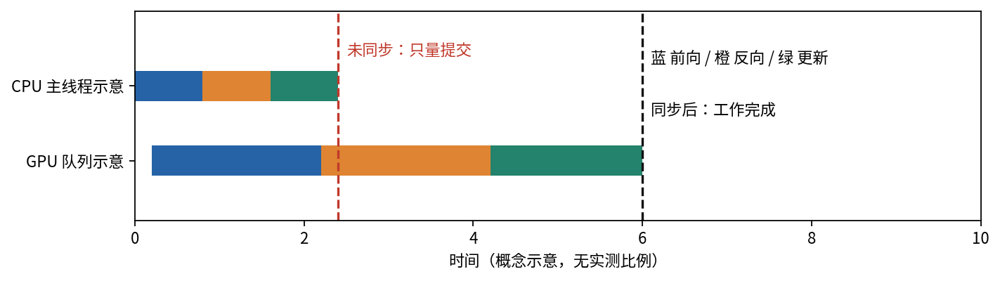
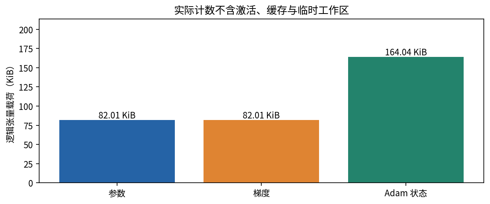
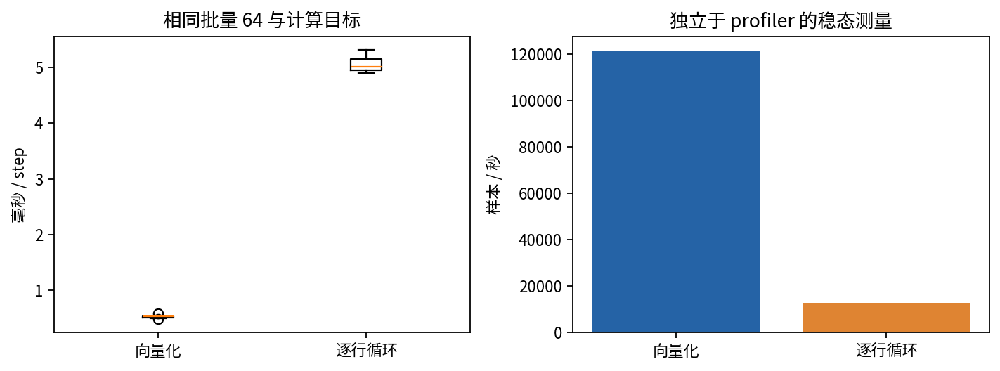
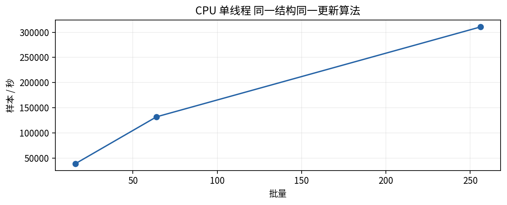
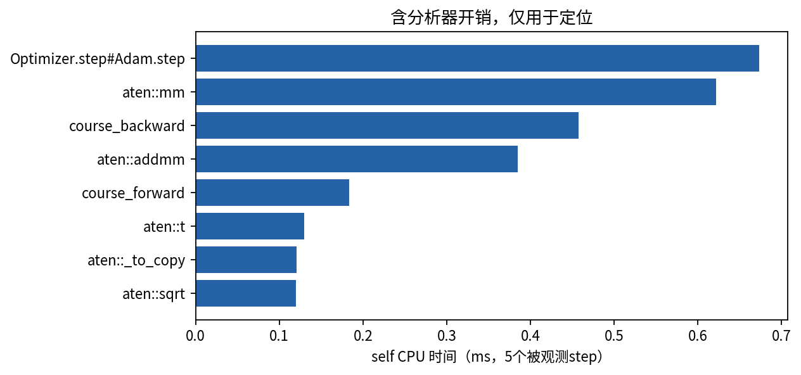
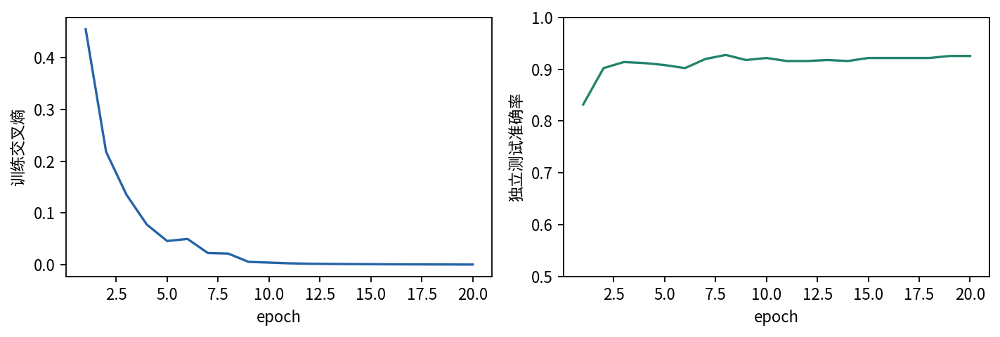

# DL065 设备显存与性能测量

一段训练程序没有报错，只说明它能执行。想回答“换成另一种实现是否更快”“模型为什么放不进显存”，还需要先说清楚测量的对象、边界与单位。本讲从一个真正训练的三层感知机出发，把数学工作量、张量占用、计时和分析器证据接起来。最终你应能写出一份别人可以反驳、也可以复核的性能报告。

先修030与031中的模型、反向传播和优化器已经足够。没有GPU也能完成本讲：提供的记录来自CPU单线程，GPU峰值显存字段明确为空。CPU逻辑张量字节不冒充显存，也不冒充进程峰值内存。我们会解释GPU测量方法，但不会把未运行的GPU代码写成实测结论。

## 1 先确定你正在让哪件事变快

想象一间工厂：原料运送、生产线加工、包装和质检都要花时间。只测生产线并没有错，但必须说明卡车和质检不在计时范围内。训练也一样。读取文件、增强数据、搬到设备、清梯度、前向、计算损失、反向、优化器更新、日志和保存权重，是不同的环节。

如果关心“从原始文件到训练完成要多久”，应报告端到端墙钟时间；如果关心“模型计算是否受Python循环拖慢”，可以把数据预先放到设备，只比较计算段。本讲选择后者。每个被计时的step包含清梯度、前向、按批平均交叉熵、反向和Adam更新，不含数据读取、主机到GPU传输和文件保存。计时之外另有一份真实训练结果，以证明我们没有只测一个脱离学习目标的空循环。

**预测问题。** 把批量从64变成256后，每步时间增加一倍。程序是变快还是变慢？如果只看step延迟，它变慢；如果看每秒处理的样本数，它可能提高一倍。改变批量还可能改变优化轨迹，因此处理吞吐的改善不能直接写成“更快达到同样精度”。

设一个测量块包含 $K$ 次更新、每次 $B$ 个样本，完成整个块用了 $t$ 秒。两个常见指标为

$$
T_{\mathrm{step}}=\frac{t}{K},\qquad Q=\frac{BK}{t}=\frac{B}{T_{\mathrm{step}}}.
$$

本讲统一把吞吐记为样本/秒，延迟记为毫秒/step。字节、KiB和MiB是存储单位；1 KiB等于1024字节，1 MiB等于1048576字节。不要把MB的十进制单位与MiB混在同一张表里。

## 2 CPU提交结束不等于GPU已经完成

在CPU上，一次普通张量计算返回时通常已经完成相应CPU计算，使用高分辨率墙钟包住连续若干步是合理起点。GPU操作通常异步提交：Python把工作加入队列后就可以返回，真正执行稍后才完成。一个没有同步的短计时区间可能主要量到提交工作的成本。[1]



要测完整GPU工作，墙钟起点之前先等待上一次工作完成，计时区间末尾再等待当前工作完成。否则，前一段的工作可能算进这一段，或这一段的工作滑到下一段。CUDA事件也可用于测某个设备流上的时间，但要理解事件所在的流，并等待事件真正记录完成。多流、多设备的端到端问题还需要更仔细地定义依赖。

```python
# 仅说明测量边界；本课交付的性能结果来自CPU。
torch.cuda.synchronize(device)
t0 = time.perf_counter()
for _ in range(K):
    step(model, optimizer, x, y)
torch.cuda.synchronize(device)
seconds_per_step = (time.perf_counter() - t0) / K
```

同步也有代价。如果实际生产流程允许重叠搬运与计算，而你在每个小操作后都同步，就会人为破坏重叠。为了测稳态整体吞吐，本讲只在一组step前后同步；为了定位某一算子，则使用分析器并单独报告它的观测开销。

## 3 从一个权重矩阵开始计算存储

一个形状为 $d_{\mathrm{in}}\times d_{\mathrm{out}}$ 的线性层有两类参数：矩阵权重与偏置向量。包含偏置时，参数数目为

$$
P=d_{\mathrm{in}}d_{\mathrm{out}}+d_{\mathrm{out}}.
$$

32维输入经过128、128两个隐藏层，最后输出2个类别。三个线性层分别有4224、16512和258个参数，总数20994。ReLU没有可训练参数。这里数的是元素，不是字节；FP32每个元素4字节，所以参数载荷为83976字节，约82.01 KiB。

为什么参数小，训练却可能占很多内存？反向传播一般需要参数梯度；Adam还保留一阶与二阶矩状态。仅在所有这些张量都用FP32、不考虑别的对象时，主要持久载荷约为

$$
M_{\mathrm{persistent}}\approx 4P+4P+4P+4P=16P\quad\mathrm{bytes}.
$$

这只是特定实现下的粗算，不能当成“所有Adam训练都恰好16P”。步数标量、混合精度主参数、参数分片、优化器实现、梯度是否存在，都可能改变它。本课实际遍历优化器state里的张量计算字节，包含每个参数张量对应的步数标量。

**手算。** 一个1000到100的线性层有100100个参数。FP32参数400400字节，参数加梯度800800字节；再加两个同形FP32动量状态，主要合计1601600字节，约1.527 MiB。这个数字依然没有输入、激活和临时缓冲。



## 4 生命周期决定峰值，而不仅是总和

反向传播要知道某些中间值。例如ReLU的反向需要区分正负输入区域；矩阵乘法的权重梯度依赖其输入。前向时保存的这些信息称为用于反向的中间张量。它们往往随批量、序列长度、空间分辨率增长，未必随参数数量增长。

把训练占用拆开可以得到一张有用但不严格可加的地图：参数、梯度、优化器状态、保存激活、临时工作区、输入输出以及运行时和分配器开销。之所以不能随手相加，是因为不同对象的生存期不同。一个临时缓冲释放后，另一算子可以复用那块存储；另一方面，同一个存储的两个view也不能重复计数为两次实际分配。

设每个对象在时间 $t$ 是否仍占用存储用指示量 $I_j(t)$ 表示，那么理想化活动载荷峰值为

$$
M_{\mathrm{peak}}=\max_t\sum_j I_j(t)M_j.
$$

先把每个对象历史上最大值相加，通常不等于这个量。计算图被Python列表意外保留，还可能使本该释放的张量持续存活。常见例子是把带梯度的loss直接追加进日志列表；记录标量时应有意识地detach，避免把整条图当成历史记录。

本课的memory_ledger故意返回“逻辑张量载荷”，不声称处理共享存储。当前网络没有权重共享，因此参数、梯度、状态的计数具有明确含义；把这个小函数搬到带共享参数或view状态的复杂模型之前，必须重新审查计数规则。

## 5 分配给张量的显存与保留的显存

GPU分配器可能把不再由活动张量使用的块保留起来，以便后续重用。于是“已分配给张量”的计数与“分配器保留”的计数不同。外部设备监控还可能包含CUDA上下文及其他库的占用。它们回答不同的问题，数值不完全相等不一定是错误。[1]

若要报告一个稳态step的峰值，应先初始化模型和优化器状态、进行warmup、同步，再重置峰值统计，运行目标step后同步并读取。重置峰值统计只是改变计数器，不会释放当前仍活着的张量。因此测得的是从该点开始的进程分配器峰值，仍包含之前创建但尚未释放的对象。

本讲CUDA分支同时提供peak_allocated_bytes与peak_reserved_bytes，并说明作用域。在当前CPU验证中，这些字段为null。不能把null换成0；0表示测得没有占用，而null表示没有可用的这项测量。CPU的操作系统驻留集RSS也不能被改名为显存。

## 6 为什么要预热并重复测量

第一次step可能创建优化器状态、初始化线程池、加载库或选择后端实现。即使没有这些，缓存状态、其他进程竞争、调度和频率变化也会影响短时间测量。固定随机种子能控制数据与初始化，不能固定操作系统给你分配的时间片。

本课每种实现单独创建相同初始化的模型、相同数据与Adam。先单独记录这个测量实例的第一步，然后做5次预热，再做7个测量块，每块10个step。每个块的总时间除以10得到一个观测值。用中位数概括典型块，四分位数描述观测波动，完整7个值保存在JSON。

这里“第一步”是新建该模型与优化器后的第一步，不等于全新操作系统进程的冷启动。该Python进程已经导入库并做过其他工作。报告这一点可以避免把一个方便测量的代理量夸大成完整启动成本。

对正态性未知的7个块，不要随手把中位数加减标准差叫成95%置信区间。重复块也可能相关。本课图中的箱线图是描述性分布，不是跨机器性能保证；再次运行应该预期数值改变。

## 7 一个可检验的优化是去掉逐行Python循环

原始实现对批中的每一行分别调用模型，然后把logits拼接起来。向量化实现一次调用模型处理整个二维张量。两者使用同样的32到128到128到2结构、ReLU、平均交叉熵和Adam。没有Dropout和BatchNorm，因而逐行与整批前向在数学上对应相同函数。

对于矩阵输入 $X\in\mathbb{R}^{B\times d}$，线性层计算

$$
Z=XW^{\mathsf{T}}+\mathbf{1}b^{\mathsf{T}}.
$$

这正是把每行的线性运算组织成一次批量矩阵运算。数值加法顺序可能不同，浮点结果不必逐位一致，所以测试比较容差，而不是要求字节完全相同。我们在更新之前比较梯度，更新之后比较参数，确保“快”没有来自漏算样本或改变loss归约。



优化的解释是减少Python与调度重复开销，并让后端执行较大的矩阵运算。它不是“所有向量化一定更快”的定理。极大批量会增加激活内存，小矩阵与大矩阵可能选用不同内核，特殊稀疏计算也可能有不同结构。只应把结论限定到被测实现与配置。

## 8 批量扫描怎样读

本讲再测批量16、64、256。扫描保持层宽、数据规则、优化器、单线程设置和计时边界一致，但每次使用对应数量的固定驻留样本。这个实验用来研究处理能力随批量的变化；它没有比较“相同训练样本总数后谁更准”。



层宽为128、批量为64的隐藏激活含8192个FP32元素，单份约32 KiB。把批量变为256，这一份变为128 KiB，参数数量却完全不变。这个小算例已经解释了为什么只用参数个数预测最大可用批量会失败。

如果吞吐先上升后趋于平缓，你可以提出后端利用率改善后遇到计算或带宽瓶颈的假设，但单条曲线不能区分两者。下一步要结合算子时间、数据搬运、设备利用率和改变层宽等干预来判别。性能分析同样需要“假设、测量、干预、再测”的证据链。

## 9 分析器定位问题但会改变被测程序

torch.profiler记录算子、调用数、CPU时间、可选设备时间、形状和内存事件。[2] 本讲在独立的5个step上开启CPU活动、形状和内存记录，把表格与结构化记录保存。没有把分析器的时间当成前面稳态基准时间。

self time表示这个事件自身的时间，total time包含嵌套子事件。若把每个父子算子的total time全加起来，同一段工作会被重复计入。记录内存的事件也有类似陷阱：某算子的self memory可以为负，因为释放发生在它身上；这些事件归属值不是训练进程的峰值。



本次记录的主要条目包括具体矩阵运算与课程标记范围。真正有用的问题是：最高条目能否对应到可改变的代码？如果优化器更新占比较高，可以控制总参数量并比较实现；如果大量小算子调用占据时间，可以检查是否存在不必要循环。不要因为一个名字排第一就立刻删除它，因为它可能是学习目标必需的工作。

分析器还会提示在开始记录之前分配的内存无法完整追踪其分配来源。本讲预热发生在记录之前，因此不把这份事件表用于宣称完整内存生命周期已经捕获。该限制保留在实验解释中。

## 10 加速结论必须同时保住学习结果

真实训练集包含1024个32维高斯输入，标签由前四维和一个双线性交互项生成。测试集512个样本用不同随机种子独立产生。我们用批量64训练20个epoch，共320次Adam更新。固定初始化种子11，不使用GPU，不下载外部数据。



交付记录最终测试准确率0.92578125，等于512个测试例中474个预测正确。这个结果不是对任意数据的准确率保证；合成规则和数据规模是实验的一部分。保存的trained_model.pt包含真正训练后的state_dict，可以重新加载并计算同一测试准确率。

速度与准确率是两条证据：单步梯度与参数测试核对两个实现的计算一致性；真实训练曲线核对程序的学习过程。若以后加入随机增强、Dropout或BatchNorm，必须重新论证比较是否仍然公平，不能沿用当前的无条件等价结论。

## 11 用Amdahl定律给期待设一个上限

假设原程序时间中有比例 $f$ 可以加速，且这一部分加速到原来的 $s$ 倍，其他部分不变，则整体加速比为

$$
S=\frac{1}{(1-f)+f/s}.
$$

如果矩阵计算占40%，即便让它无限快，整体最多加速到 $1/0.6\approx1.67$ 倍。若只把这40%加速4倍，总体为 $1/(0.6+0.1)\approx1.43$ 倍。这个公式假设各部分没有因优化而改变比例或发生新的重叠，适合做第一轮估算，而非替代实测。

这也解释为什么一份报告必须说明端到端边界。某个内核快10倍，而真实程序只快5%，可能完全一致：该内核原本只占很少时间。相反，端到端更慢也可能来自额外拷贝、数据转换或同步，不能只展示局部最好看的数字。

## 12 形成一份可复核的报告

合格的结论至少写出硬件或可用设备类型、软件版本、线程、dtype、批量、模型结构、优化器、计时边界、预热、重复数、统计量、学习指标和限制。附上完整观测值，使读者能判断你有没有挑最小的一次时间。

本讲的保守结论是：在记录的CPU单线程环境和驻留数据条件下，向量化与逐行循环的目标经测试一致；两者的实测时间保存在outputs/results.json。参数载荷83976字节，反向后同形梯度也为83976字节，实际Adam张量状态167976字节，合计335928字节。这不包含激活和工作区，因此不能被写成总训练内存。

再做任何优化前，先写一句可被检验的预测，例如“减少同一批内的Python模型调用数，应该在保持单步梯度的容差一致时提高驻留数据吞吐”。如果结果不支持预测，就记录失败，不要偷偷换批量、线程或精度来保住结论。下一讲会把数值精度与激活重计算也纳入这个框架。

## 自测与参考

1. 为什么GPU代码返回后，墙钟可能还没有覆盖真正的执行时间？
2. 为什么训练前的Adam状态字节可能为0，第一步后才出现？
3. 相同参数量的两个任务，峰值内存为什么可能相差很大？
4. 给定64个样本、10个step共0.02秒，计算每步延迟与吞吐。
5. 解释“这个方法让算子快4倍，因此训练快4倍”缺少什么条件。
6. 为本课批量扫描补一个“到达同样验证误差所需时间”的实验方案。

[1] PyTorch 2.14 CUDA semantics，异步执行与内存管理：https://docs.pytorch.org/docs/2.14/notes/cuda.html

[2] PyTorch 2.14 Profiler，记录选项与开销：https://docs.pytorch.org/docs/2.14/profiler.html

[3] PyTorch 2.14 Benchmark utilities，重复测量与测量对象：https://docs.pytorch.org/docs/2.14/benchmark_utils.html

正文中的小模型、计算示例、图与测量为本课程原创实验。一手来源核验日期与使用范围见sources.md；本讲不引用未经运行的硬件性能数字。
