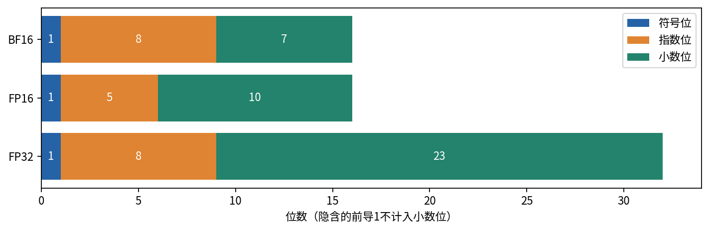
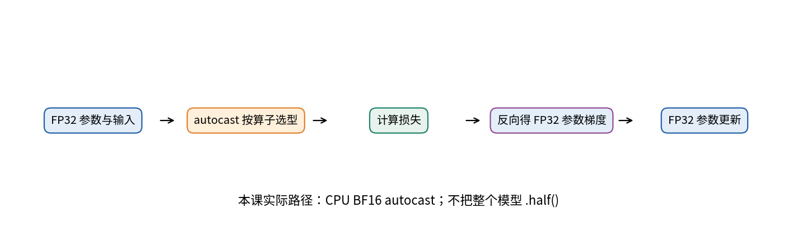
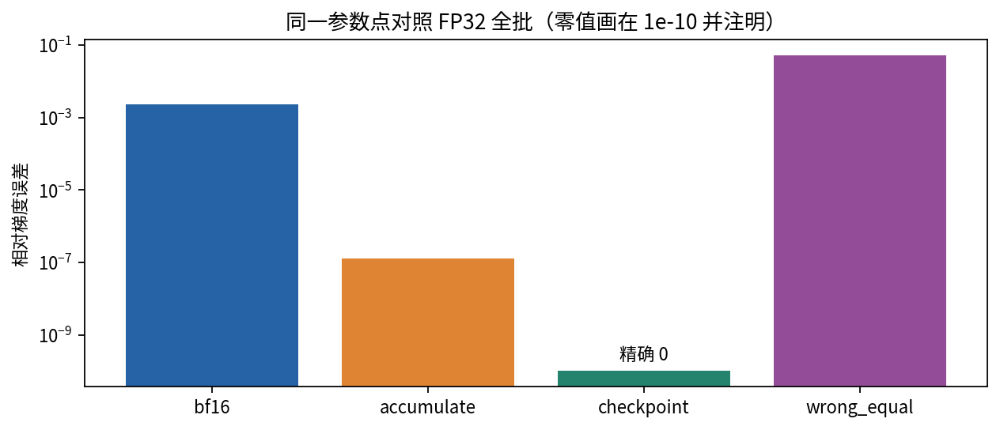
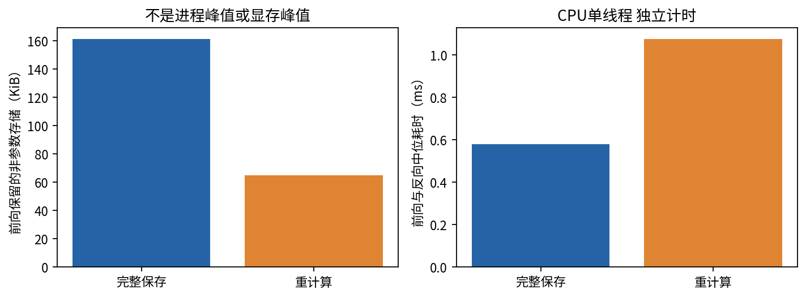
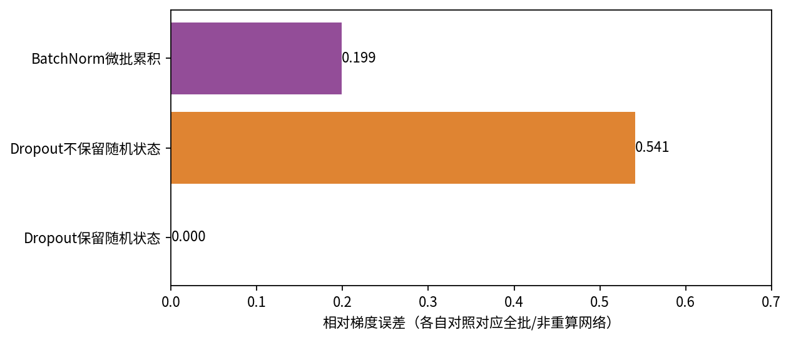
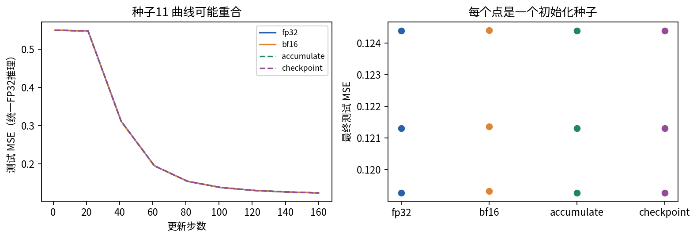

# DL066 混合精度与激活重计算

假如模型已经能正确训练，却放不下想要的批量，常见的下一步是降低部分计算精度、把大批拆成微批，或者不保存全部中间激活而在反向时重算。它们都可能帮助训练，但改变的东西不同：数值表示、梯度归约、计算图的保存方式，不能被当成一个“省显存开关”。

本讲先从数的表示开始，再用同一个小网络逐项加入策略。你会看到一个有效的累积实现、一个看似合理却错误的等权累积、BatchNorm的反例、Dropout随机状态的反例，以及真实训练与保存张量的测量。当前环境只有CPU，实际验证的是CPU BF16 autocast与CPU重计算；没有虚构CUDA FP16加速或显存节省结果。

先修014、034和065。若“梯度”还不熟，可暂时把它看成每个参数应如何微调的局部方向；本讲用直接比较这些方向来判断一个节省策略是否保持了目标，而不只检查loss是否还会下降。

## 1 存储位数同时影响范围和分辨率

浮点数把一个实数近似表示成符号、有效数字与二的幂。可以把指数理解为尺子的缩放档位，把有效数字理解为当前档位上的刻度。指数位多，能够覆盖更大的数量级；有效数字位多，同一数量级上能区分更接近的数。

对于普通规范化二进制数，可以写成

$$
x=(-1)^s(1.f)_2\,2^{e-\mathrm{bias}}.
$$

其中 $s$ 是符号位，$f$ 是存储的小数部分，$e$ 是指数编码。零、次正规数、无穷大和NaN有特殊编码，不能把上式直接套在全部比特模式上。这里的“精度”不是模型预测精度，而是数值表示能力。



FP32使用1个符号位、8个指数位和23个小数位；FP16是1、5、10；BF16是1、8、7。规范化值还有隐含的前导1，所以有效二进制位数比图中小数位多1。BF16具有接近FP32的指数范围，却比FP16更粗的局部分辨率；“同样16位”不代表具有相同数值行为。

## 2 三个小数值足以看出风险

在1附近，FP16相邻可表示数的间隔约为 $2^{-10}=0.0009765625$，BF16约为 $2^{-7}=0.0078125$，FP32约为 $2^{-23}$。把 $1+2^{-10}$ 转成BF16会回到1，而FP16可以区分它。一个很小的参数更新若小于当前格式的刻度，就可能在写回时消失。

另一方面，FP16最大有限值是65504，70000转成FP16会成为无穷大；BF16可以表示这个数量级，但会舍入到较粗的近似值。极小的 $10^{-8}$ 直接转FP16会变成0，因为它小于最小正次正规值约 $2^{-24}$ 的一半；BF16可以保留接近这一数量级的值。

这些不是对某个神经网络的猜测。本课casting记录实际把四个数转为三种dtype的结果。通过torch.finfo可以检查格式属性。[1] 注意finfo.tiny表示最小正规正数，不是包括次正规数后的最小正数。不能把tiny误当成“更小的一律等于0”。

**思考。** 若梯度本来是0，放大它还是0；若梯度原本非零，但已经在低精度中舍入成0，再放大也不能恢复信息。稳定数值路径的关键是尽量在信息丢失之前采取措施。

## 3 autocast不是把所有张量都变成半精度

某些矩阵计算适合低精度，某些归约或数值敏感算子需要更高精度。autocast根据设备、算子与输入选择执行dtype。它不要求把整个模型和所有输入提前调用half，也不承诺每个算子都以同一种低精度执行。[2]

本课参数保持FP32。CPU autocast以BF16作为低精度目标，前向和损失在该上下文内执行，反向在上下文外调用。参数本身仍是FP32，累积在这些参数上的梯度也是FP32；中间计算实际采用哪些精度由算子策略决定。这个结构在测试中有明确检查。



```python
optimizer.zero_grad(set_to_none=True)
with torch.autocast('cpu', dtype=torch.bfloat16):
    prediction = model(x)
    loss = torch.nn.functional.mse_loss(prediction, y)
loss.backward()
optimizer.step()
```

混合精度可能减少某些激活与计算成本，但参数和优化器状态并不会因此全部减半。若某种硬件没有合适的低精度支持，类型转换甚至可能使程序更慢。所以本讲把“梯度/结果误差”和“速度/内存测量”分开，不从位数直接推导加速倍数。

## 4 loss scaling为什么有用又有什么边界

令损失为 $L(\theta)$，用常数 $S>0$ 乘它。精确算术下，链式法则给出

$$
\nabla_\theta(SL)=S\nabla_\theta L.
$$

因此反向后把梯度除以同一个 $S$，理论上回到原方向。好处在于：低精度中间梯度在反向过程中先处于较大数量级，减少下溢机会。它不能修复前向已经产生的无穷大，也不能保证所有计算稳定。[3]

本课用一个标量演示顺序：$g=10^{-8}$，$S=65536$。直接转FP16得到0；先乘S、转FP16、转回FP32再除S，可以保留接近原值的非零数。先把g舍入成0，再乘S再除S，则仍然是0。代码把这三条路径都保存了。它只是算术演示，不是实际CUDA GradScaler运行。

动态GradScaler会检测非有限梯度，必要时跳过更新并调整尺度。若先裁剪被放大的梯度而不解除缩放，原本的裁剪阈值就失去含义。常见顺序是缩放loss、反向、在本次有效批所有梯度累积结束后unscale、按需裁剪、step、update。不能在同一个有效批中途改变scale，再把不同尺度的梯度直接加到一起。[4]

当前实际训练采用CPU BF16，不需要为演示强行加入CUDA FP16路径。BF16的指数范围通常使loss scaling不如FP16那样必要，但不能由此断言BF16不会溢出、不会出现NaN或不会损害训练。

## 5 梯度累积先从目标的分母推导

显存只能装下小批时，可以让多个微批依次前向与反向，把梯度累积起来，最后只更新一次。关键是这些微批的损失如何归约。设完整有效批含 $N$ 个样本，第 $k$ 个微批有 $n_k$ 个，自己的平均损失为

$$
L_k=\frac{1}{n_k}\sum_{i\in B_k}\ell_i,\qquad N=\sum_k n_k.
$$

完整目标是

$$
L=\frac{1}{N}\sum_i\ell_i=\sum_k\frac{n_k}{N}L_k.
$$

对两边求梯度，得到正确累积权重也是 $n_k/N$。只有微批大小相同，才可以把每个微批平均loss简单除以微批数。最后一个微批较短、有效token数量不同或样本有权重时，要重新用真实归约单位推导。

**手算两微批。** 第一个微批2个样本，平均梯度为1；第二个6个样本，平均梯度为3。完整平均梯度是 $(2\times1+6\times3)/8=2.5$。简单把两个平均值再平均得到2，错误地把第一个微批的每个样本赋予了更大权重。

本课128个例子分为31、47、50，每个MSE均值乘对应大小除128。因为每个样本只有一个输出，这个样本数也是误差元素数；若输出维度或有效掩码不同，就不能不加说明地照搬这个分母。

## 6 累积不是多次小批更新

正确累积只在整个有效批开始时清梯度，依次反向，最后做一次optimizer.step。每个微批应在同一个参数点上计算梯度。如果每个微批都更新，后面的梯度就对应变化后的参数，目标不再等价。

即使权重和更新时机都正确，完整大批与微批累积也并不普遍相同。BatchNorm的均值方差依赖当前微批；Dropout和数据增强引入随机性；浮点归约顺序改变也会产生舍入差。正确的结论是：在样本可分损失、相同参数、相同随机行为且无跨样本操作等条件下，它们对应相同数学目标，数值上仍需容差检查。

本课主要网络用四个64到64的Linear加Tanh，最后64到1输出，不含BatchNorm和Dropout。这样先验证理想条件，再单独加它们作为反例。否则你无法判断差异来自归约错误还是网络本来就跨样本耦合。



## 7 什么是激活重计算

反向需要中间激活。最直接的方式是在前向保存它们，反向时取出。另一种方式只保存一段计算的输入与必要信息，反向到来时重新执行这段前向，重新得到所需激活。它用额外计算交换保存空间，常称activation checkpointing。[5]

这里的checkpoint是计算图中的重算边界，和把训练权重保存为pt文件的“checkpoint文件”是两个相关但不同的用法。本课两者都有：Net.forward可以重算body，outputs里的pt则是训练结束后的可加载权重。

假设线性链有L层，每层激活大小近似为A，忽略参数、输入和工作区。全部保存大致需要LA。若按每k层一段划分，可以粗略把峰值激活写成边界保存与当前重算段之和：

$$
M_{\mathrm{act}}\approx\left(\frac{L}{k}+k\right)A.
$$

把k看成连续量，导数为 $-L/k^2+1$，在 $k\approx\sqrt{L}$ 取得平衡。这个模型解释了分段重算的动机，不是对任意网络的精确保证；分支、长短不一的层、算子工作区与框架实现都会改变实际峰值。

例如L=16时，完整保存约16A，取k=4的粗模型为8A。代价是某些前向再次执行。若原来的前向耗时F、反向耗时B，增加约一遍前向的理想估算为 $(2F+B)/(F+B)$。当B约等于2F时，约为4/3；实际Python、调度、提前停止重算等会改变比例。

## 8 让重算执行同一个函数

本课调用checkpoint时显式设置use_reentrant=False。它重算body，最后的输出head不在重算区间中。新版PyTorch的不同checkpoint实现具有不同限制，不要把网上的旧示例不加审查地拼接进当前模型。[6]

若这段函数在前向和反向重算之间变了行为，梯度可能错误。全局变量、训练状态、外部计数器、移动到新设备、随机数消耗等都值得审查。对于Dropout，如果重算抽到另一张mask，反向面对的就不是原先那一次前向函数。

默认保存随机状态旨在让常见情形下重算与原路径保持一致。本课固定torch.manual_seed，比较保留与不保留随机状态两种重算。这里涉及CPU随机数，结果清楚；多设备或在函数内迁移到新设备的复杂情况不在本实验验证范围。



## 9 如何测量保存的东西而不夸大结论

saved_tensors_hooks可以观察自动微分保存给反向用的张量。本课在前向范围内安装hook，排除参数存储，按底层storage地址去重，再求存储字节；反向在hook范围外执行。这样避免把同一块存储的多个view重复记成多个分配。

这个量包括输入、目标和其他被保存的非参数存储。它不是操作系统RSS，不是PyTorch分配器峰值，也不是GPU显存峰值。重算时临时创建的张量、优化器状态和框架开销不会被这个前向快照完整描述。我们专门把字段命名为saved_nonparameter_unique_storage_bytes。

实际完整前向保留164864字节，重计算保留66560字节，下降约59.63%。只能说“这个定义下的保留载荷减少”，不能说“整次训练内存减少59.63%”。独立的CPU前向加反向中位时间约0.579毫秒和1.074毫秒，本次重算约慢1.85倍。计时没有包括优化器更新，也不应被宣传成GPU性能。

## 10 三个反例比一句警告更有用

第一，31、47、50微批错误地等权平均，单步梯度相对误差约0.05168；正确加权约 $1.27\times10^{-7}$。这个误差来自目标权重变化，不能用“浮点误差”敷衍。

第二，加入BatchNorm后，即使微批按真实大小正确加权，累积梯度与完整大批梯度的相对误差约0.1986。原因是网络函数随批统计改变，而非loss的分母写错。改用不依赖同批其他样本的归一化方案或固定统计，可能得到另一个可比较实验，但那是新的模型设定。

第三，Dropout重算保留随机状态时，本次梯度与非重算路径完全一致；关闭保留后，相对误差约0.5413。测试不仅确认正确分支通过，还要求错误分支确实出现显著差异，避免一个没有触发随机性的“假反例”。



相对梯度误差定义为

$$
E_g=\frac{\|g_{\mathrm{method}}-g_{\mathrm{reference}}\|_2}{\max(\|g_{\mathrm{reference}}\|_2,10^{-12})}.
$$

分母下限避免参考梯度接近0时除零，但也改变了那一区域的解释。因此同时保存最大绝对误差更稳妥。一个相对误差很大但两边梯度都接近0的例子，和方向真实改变的例子需要区别分析。

## 11 真正训练后结果如何

输入为64维标准高斯，目标是 $y=\sin x_1+0.3x_2-0.2x_3$。训练集128个样本，独立测试集256个样本；测试集没有用于挑选超参数。三个初始化种子11、23、37，每种都训练FP32整批、CPU BF16、正确微批累积和重计算四种模式，全部做160次SGD更新，学习率0.06。

为公平比较最终模型，四种方法都用FP32推理计算同一测试MSE。这样不把“训练精度差异”与“评价时又用另一种精度”的影响混在一起。每次权重真实保存，曲线记录起始、每20步与最终点。



种子11的FP32与重计算测试MSE均约0.124388，正确累积约0.124388，BF16约0.124405。种子23约0.121315对0.121365，种子37约0.119268对0.119318。这个小问题支持“此次BF16路径的结果差异较小”，不能外推到深网络、大尺度训练或别的损失。

没有把误差设为0的BF16强行判成失败，也没有因为最终误差相近就认为所有中间梯度完全一致。单步核对定位数值变化，完整训练观察它在指定预算内的后果，两者都必要。

## 12 逐项加入策略而不是一次全开

实用顺序是先得到FP32正确基线，确认梯度、学习曲线和checkpoint复核；再只开autocast，检查有限值与误差；再加入累积并从分母推导权重；最后加入重计算，检查随机状态与保存量。每一步只改变一个机制，失败更容易定位。

如果把半精度、累积、重算、分布式和新优化器一起打开，最终loss变成NaN时很难知道原因。日志应记录有效批大小、微批大小、更新次数、精度策略、随机状态和测量边界；恢复训练还要考虑优化器、调度器与scaler状态，不能只恢复模型权重就声称是严格续训。

本课12份权重用于最终推理复核，不包含完整优化器/RNG恢复包，因此不声称支持逐步完全一致的中途断点续训。下一讲会把“分母与同一个目标”的思想扩展到多个rank之间的梯度平均。

## 自测与一手来源

1. 为什么BF16范围较大却未必比FP16更能区分1附近的小变化？
2. 将微批大小2和6的平均梯度1与3正确组合，为什么不能简单平均？
3. 若所有微批都在同一参数点反向，BatchNorm为什么仍可能不等价？
4. 重算保存载荷减少是否等于峰值显存按同一比例下降？
5. 为什么缩放loss应发生在梯度丢失之前？
6. 给出一个重算函数前后行为可能不一致的例子。

[1] PyTorch Type Info：https://docs.pytorch.org/docs/2.14/type_info.html

[2] PyTorch AMP：https://docs.pytorch.org/docs/2.14/amp.html

[3] Micikevicius等，Mixed Precision Training，ICLR 2018：https://arxiv.org/abs/1710.03740

[4] PyTorch AMP examples：https://docs.pytorch.org/docs/2.14/notes/amp_examples.html

[5] Chen等，Training Deep Nets with Sublinear Memory Cost，2016：https://arxiv.org/abs/1604.06174

[6] PyTorch activation checkpointing：https://docs.pytorch.org/docs/2.14/checkpoint.html

位数、归约推导与实验均在本课重新展开；没有直接复制来源图。实际运行边界、来源核验和完整结果均随文件提供。
