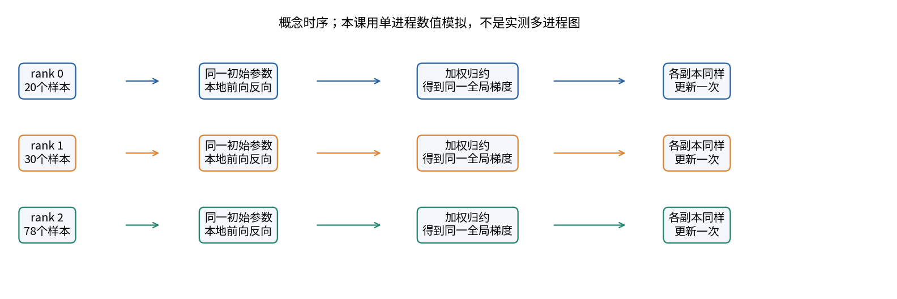
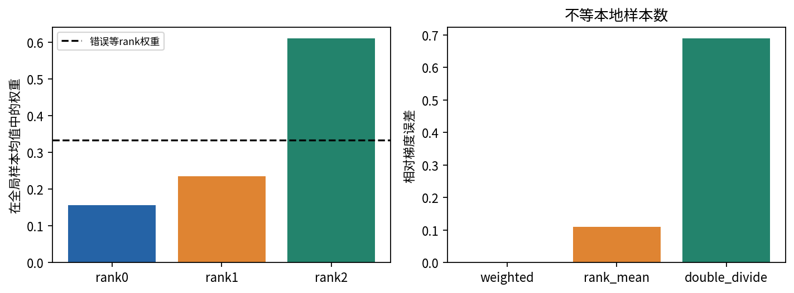
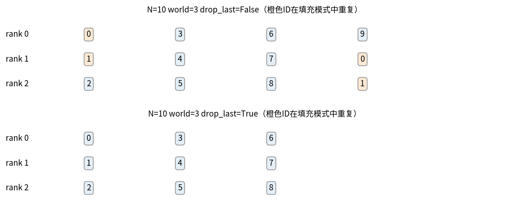
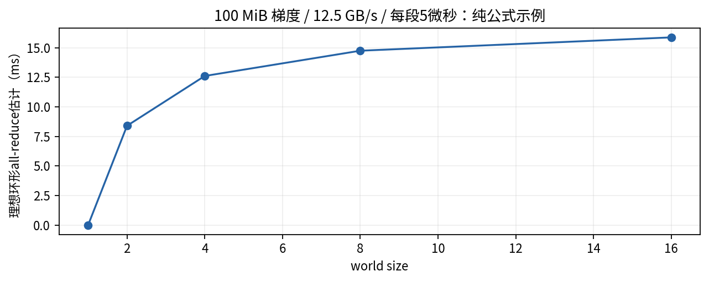
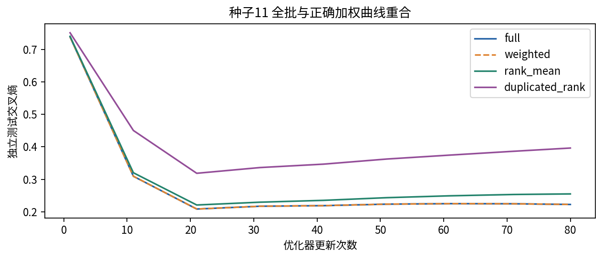
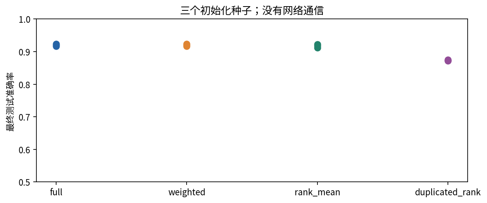

# DL067 分布式训练的基本语义

把训练分给多台设备之前，首先要回答一个比“能启动几张卡”更基础的问题：每个设备处理不同数据以后，所有参数究竟在优化哪个共同目标？只要loss的分母、采样方式或更新时机错了，多设备程序完全可能正常运行，却悄悄学了另一个问题。

本讲先不用网络。我们在一个CPU进程中建立多个模型副本，逐个计算它们的本地梯度，再按明确规则组合，与直接处理完整批的结果比较。这样可以把数学语义与通信系统的复杂性分开。交付中没有真实进程组、all-reduce或多GPU运行，通信图的时间是带假设的公式示例，不是集群性能测试。

先修018、030和066。你需要知道平均值、梯度、一次优化器更新以及微批累积。读完后，应能推导等长与不等长rank的权重，解释DistributedSampler的填充，指出什么时候“平均各rank的平均loss”不等于全局平均loss，并为真实分布式实验写出正确核对计划。

## 1 rank只是参与者编号

在常见数据并行中，每个进程持有一份相同模型，处理一部分数据。rank是进程编号，world size是参与进程数；local rank常表示一个节点内的编号。它们不是样本编号，也不意味着参数天然不同。

一次同步更新的理想流程是：从相同参数出发，每个rank读取本地数据，完成前向和反向，将梯度归约为共同结果，各rank用相同优化器状态与规则更新一次。若所有副本初值、平均梯度和优化器状态一致，更新后的参数也一致。

不要把“每个rank最后参数一致”误当成“目标正确”。所有rank也可能一致地使用了错误权重，或者一致地重复训练同一批数据。正确性需要同时核对目标、数据覆盖、归约与更新，而不是只做一次参数广播。

## 2 从一个全局平均目标出发

设这一有效批包含N个样本，样本损失为 $\ell_i(\theta)$。目标为

$$
L(\theta)=\frac{1}{N}\sum_{i=1}^{N}\ell_i(\theta).
$$

将样本分给R个rank，第r个有 $n_r$ 个样本，局部均值为

$$
L_r(\theta)=\frac{1}{n_r}\sum_{i\in B_r}\ell_i(\theta),\qquad N=\sum_{r=1}^{R}n_r.
$$

同066一样，把全局和分组，可得

$$
L=\sum_{r=1}^{R}\frac{n_r}{N}L_r,\qquad g=\sum_{r=1}^{R}\frac{n_r}{N}g_r.
$$

这里 $g_r=\nabla_\theta L_r$。公式不需要高深的通信知识，只用求和与求导的线性性。它明确告诉我们：全局样本均值需要按样本数加权本地梯度，而不是无条件把每个rank当作同等权重的观测。

## 3 等长本地批为什么可以直接平均

若所有本地样本数都是b，则 $N=Rb$，每个rank权重 $b/(Rb)=1/R$。因此各rank先算局部平均loss，再对梯度求rank平均，就等于全局样本平均。

PyTorch常规DistributedDataParallel在反向时对相应梯度进行跨进程平均，并把平均结果写回参数grad；各进程的优化器随后使用这些梯度。[1] 所以在通常等长本地批、局部loss已取均值的情形，不应因为“用了R张卡”再把loss除以R一次。那会把正确梯度额外缩小R倍。

**手算。** 两个rank各有2个样本。本地梯度分别为2和6，正确全局梯度是4。若先把本地loss各除2，再让DDP求平均，得到2，恰好小一半。学习率加倍在简单SGD某一步也许能补偿幅度，却不能作为任意优化器、裁剪与正则项下的通用修复方法。

底层all-reduce可以执行求和；框架的DDP语义可能还包含除以world size。写报告要区别“通信原语执行SUM”和“用户最终看到的梯度是平均”。自定义通信hook或特殊join行为可能改变默认假设，不能在不了解实现时叠加除法。[2]

## 4 不等长本地批的正确缩放

如果DDP最终平均R份梯度，而你想要全局样本均值，可以让每个rank反向的本地目标乘

$$
\widetilde{L}_r=\frac{R n_r}{N}L_r.
$$

之后DDP的平均给出

$$
\frac{1}{R}\sum_r\nabla\widetilde{L}_r=\sum_r\frac{n_r}{N}g_r=g.
$$

另一种思路是每个rank计算局部loss总和，归约梯度总和后除以全局N。两种方式都需要知道实际归约语义，不能同时使用“局部均值修正”和“全局再除N”而重复归一化。

本课模拟直接用 $n_r/N$ 加权本地梯度，等价于想要的最终结果；它没有在内部调用DDP。因此不要把simulate_step当成真实DDP训练脚本。它是用于核对框架实现应得到什么答案的参考。

三个rank分别20、30、78个例子，总数128。正确权重约0.15625、0.234375、0.609375。若各给1/3，第一个rank每个样本权重会被放大，第三个rank每个样本权重会被缩小。这是改变数据分布权重，不只是一个整体常数倍。

## 5 有效token数量比批里几行更重要

设每个rank都装64条序列，但rank0共有640个有效token，rank1只有160个。如果目标是每个token等权的平均loss，两个rank的有效计数不同，直接平均各自的token均值仍然错误。若目标是每条序列等权，则要先在序列内平均，再在序列间平均；这又是另一种合法目标。

本课用掩码模拟这个问题：两个rank各64行，rank0有64个有效例子，rank1只有7个，其余权重0。全局有效计数71。按有效计数加权与直接对71个有效例子计算的梯度一致；简单rank平均出现明显偏差。

若某个rank这一轮没有有效元素，其局部贡献应为0，同时真实系统仍可能需要参与相应集体通信，避免其他rank永远等待。全局有效计数也为0时，不应做除零或伪造平均值，而应有全局一致的跳过策略。本课模拟允许局部零计数，但明确拒绝全局零计数。

这类问题常隐藏在padding、过滤、样本权重和不均匀最后一批里。写出分子与分母，比记忆一段“loss除累积次数”的代码更可靠。

## 6 有效批量与更新次数

若R个rank、每个微批b个样本、累积A次后同步更新，在各微批大小相同且样本互不重复时，有效批量为

$$
B_{\mathrm{effective}}=R b A.
$$

例如4个rank，每rank每次16个样本，累积3次，则一次更新覆盖192个样本。若最后一个微批变小或采样器填充了重复例子，192只是处理的行数，不一定是192个不同样本；实际目标仍由每个贡献项的权重决定。

提高world size但保持本地批量，会提高有效批量。即使每个epoch处理的数据相同，更新次数可能下降，优化轨迹发生变化。学习率随批量线性放大是一种可研究的经验策略，不是由梯度平均公式自动推出的定理。

梯度累积时可以选择前几次不通信、最后一次同步，以减少通信频率。但真实DDP的no_sync使用有上下文范围要求，通常前向也要处于该范围；这里不提供未经执行的完整分布式模板，而是给出应核对的数学参考与官方入口。[2]

## 7 采样器为什么会重复或者丢弃数据

数据并行需要让不同rank知道本轮读哪些样本。DistributedSampler可以根据world size、rank、shuffle与drop_last生成本地索引。数据集长度不能整除world size时，它可以补齐到可均分长度，或丢弃尾部以便均分。[3]

设N=10，R=3，不打乱。drop_last=False时总长度补成12，前面的0和1被再次使用。rank0得到0、3、6、9，rank1得到1、4、7、0，rank2得到2、5、8、1。每个rank4条，看似均匀，实际0和1出现两次。

drop_last=True时，各rank3条，总计9条，样本9被丢弃。不打乱时同一个尾部可能持续被忽略；打乱可以改变被丢弃的位置，但也要每个epoch调用set_epoch，否则不同epoch可能重复相同的排列。

填充和丢弃都不是“天然错误”，它们是为了步数对齐采用的不同策略。训练中应说明目标分布与重复权重；评估时尤其小心：重复测试例会改变指标权重。计算全局准确率应归约正确数与有效样本数，必要时按唯一ID去重或使用不填充评估划分，而不能盲目平均各rank准确率。

## 8 all-reduce究竟做了什么

all-reduce把所有参与者的数值按某个结合操作归约，并让每个参与者都得到结果。对于长度P的梯度向量，它不会自动知道哪一维对应哪个参数，也不会知道loss原来按样本还是token归约。参数顺序、shape、dtype与集体调用顺序一致，是系统正常配合的重要条件。

本课用Python按参数位置组合副本梯度，保持共同参数起点。真正的DDP会把梯度组织成bucket，并可能在反向过程中让通信与剩余计算重叠。[1] 这意味着一份实际性能图不能简单把所有算子total时间与通信时间相加：它们可能重叠。

若一个rank进入某个collective，另一个因条件分支跳过，程序可能等待。若不同rank模型结构或参数注册顺序不同，错误可能更早出现或产生不匹配。模拟能检查数学权重，却无法验证这些运行时行为。因此本课不把“模拟正确”写成“多进程训练已经验证”。

## 9 一个通信量的纸笔模型

为建立量级感，可以考虑理想环形all-reduce。设每个rank的梯度载荷M字节，R个rank，每段通信启动延迟为alpha，带宽为beta字节/秒。一个简化的无重叠估算是

$$
T_{\mathrm{ring}}\approx 2(R-1)\alpha+\frac{2(R-1)}{R}\frac{M}{\beta}.
$$

这里前项来自多轮启动，后项来自每rank约 $2(R-1)M/R$ 的传输量。它忽略拓扑、拥塞、协议、分桶、算法选择、并发和计算重叠。它只用来说明“更多rank不意味着通信自动变少”。

取M=100 MiB，R=4，alpha=5微秒，beta=12.5 GB/s。注意MiB与GB/s采用不同进制：M等于104857600字节，beta等于12500000000字节/秒。每rank传输约157286400字节，带宽项约12.5829毫秒，加30微秒启动项，约12.6129毫秒。

R=1时没有跨rank通信，这个模型输出0；实际单机仍有计算和软件开销，不能因此说整个step耗时为0。真实实验应测完整吞吐与重叠效果，不能用这张曲线替代集群基准。

## 10 数据并行与其他并行策略

数据并行给每个rank完整模型、不同数据，主要同步梯度。模型太大时，即使每rank批量很小，完整参数和优化器状态也可能装不下。这时需要理解另外两类思想。

参数或状态分片把某些参数、梯度或优化器状态分散存放，按计算需要聚合或交换，目标是减少每rank冗余存储。张量并行把同一层的矩阵计算拆到多个设备；流水线并行把不同层放在不同阶段，让微批沿阶段流动。它们通信内容、调度约束和失败模式不同。

这些策略可以组合，但不能都用“DDP”笼统代称。普通数据并行不保证模型本身能放进单卡；分片也不意味着没有通信；流水线还有气泡与微批调度的问题。本讲只建立区分，不实现分片或模型并行。

## 11 三种子真实训练的数值证据

这里“真实训练”是CPU上真实执行前向、反向与更新，区别于仅手写几个梯度数字；“分布式”部分仍是单进程模拟。输入5维，隐藏层12个Tanh单元，输出2类，FP64用于把舍入差压低，让语义错误更明显。

训练集128例、独立测试512例，局部分割20、30、78。每个初始化种子11、23、37运行四组：完整批基线、正确加权模拟、错误rank平均、三个rank重复使用最前20例。各组80次带动量SGD更新，学习率0.15、动量0.8。

单步正确加权相对梯度误差约 $3.53\times10^{-16}$，最大绝对误差约 $8.33\times10^{-17}$。错误rank均值相对误差约0.1096。先错误rank平均再额外除world size的double_divide更差，约0.6886；因为这里本地批不等长，这一条同时包含两种错误，不应用它来单独估计额外除法的影响。

对于64与7有效计数的掩码对照，正确加权最大梯度误差约 $1.11\times10^{-16}$，错误rank平均约0.07391。这个实验说明即使本地行数相同，只要有效计数不同，仍需从目标分母出发。

80步后完整批与正确加权的参数最大差在约 $6\times10^{-16}$ 以下，测试准确率分别为0.916016、0.919922、0.923828，二者一致。重复rank只使用20例，准确率约0.871094、0.873047、0.875。这个小任务上重复数据的损害可见，但“重复数据一定让每个任务降低多少”并非本讲结论。

## 12 从模拟走向真实系统的核对表

真实多进程实验应先用极小数据，让每个rank打印或保存样本ID、有效计数、一次更新前后的参数摘要与全局指标。与本讲参考单步梯度比较后，再扩大数据和模型。不要一开始就用大规模运行的最终loss作为唯一正确性证据。

需要额外验证的系统问题包括初始化与设备绑定、进程组后端、各rank集体调用顺序、异常传播、最后一批、采样器epoch、恢复状态、主rank保存与日志聚合。只能在所有参与rank达到同样约定的完成点后宣称一次训练成功。

性能报告另起一条证据链：真实硬件、网络拓扑、软件版本、world size、本地批量、累积次数、精度、预热、同步边界、总样本吞吐，以及固定全局批的强扩展或固定本地批的弱扩展定义。没有真实网络测量，就不报告通信加速比。

本讲最后的核心原则可以压缩为一句话：先定义分子、分母和样本覆盖，再决定在哪个位置求和、平均和更新。分布式框架负责协作执行，但不会替你定义正确的研究目标。

## 自测与一手来源

1. 为什么等长本地批平均梯度正确，不等长时却未必正确？
2. DDP已做平均，局部loss再除world size会有什么结果？
3. 每rank同样64行，为什么有效token均值仍可能需要不等权？
4. N=10、world=3时，填充与丢弃分别改变了什么？
5. 模拟梯度正确，为什么仍不能宣称多进程无死锁或网络加速？
6. 普通数据并行能否解决单个模型参数放不进一台设备的问题？

[1] PyTorch Distributed Data Parallel design：https://docs.pytorch.org/docs/2.14/notes/ddp.html

[2] PyTorch DistributedDataParallel API：https://docs.pytorch.org/docs/2.14/generated/torch.nn.parallel.DistributedDataParallel.html

[3] PyTorch data与DistributedSampler：https://docs.pytorch.org/docs/2.14/data.html

所有图、数值模拟、模型训练与纸笔示例为本课原创。框架语义按上述一手文档核验；没有把框架说明当成当前实验已经执行的证明。
