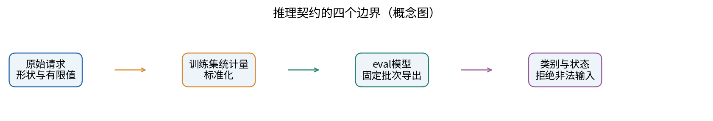
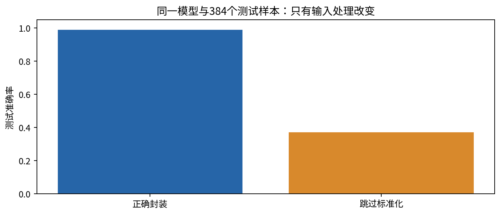
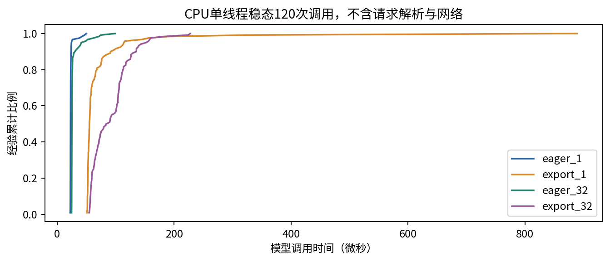
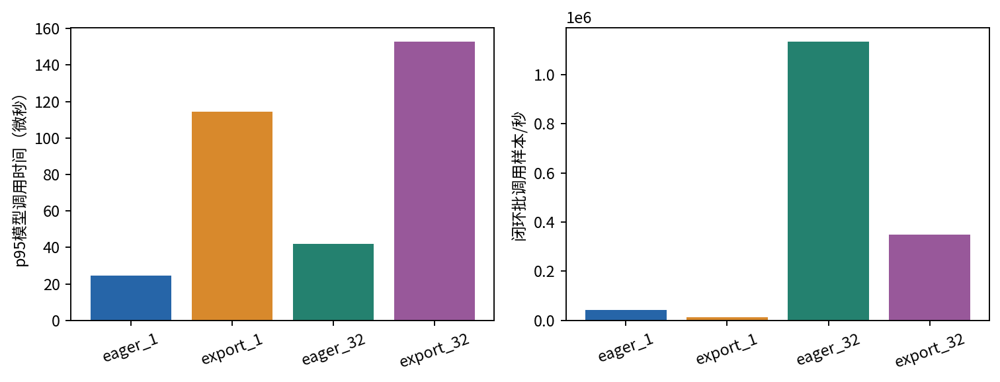
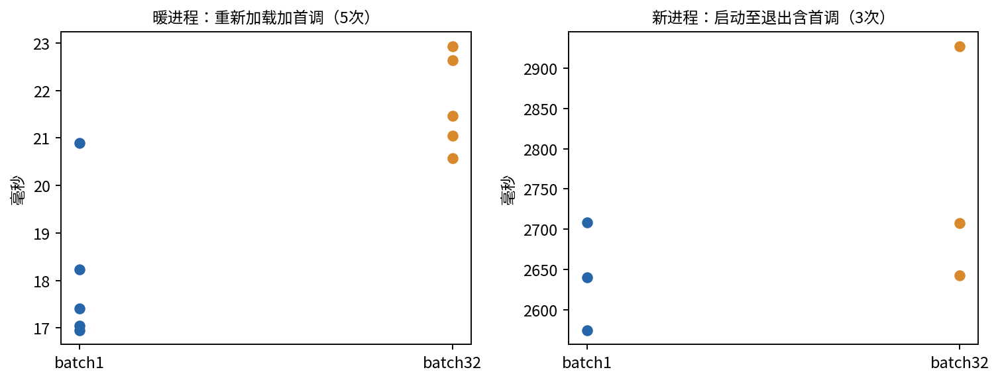
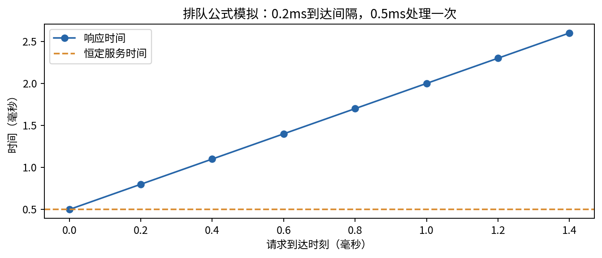

# 第068讲 推理导出与服务评价

一个模型在测试集上得到好分数以后，还要经过另一次审查：应用传进来的数字，是否仍然具有训练时的含义？一次请求出错时，系统会明确说“无法处理”，还是悄悄给出一个看似正常的类别？本讲把训练完成的小模型变成一个可检查的推理对象，再分别检查数值、输入、延迟和失败行为。最终目标不是写出“已经部署”四个字，而是说明哪一段链路经过了怎样的验证。

先修是021的评价边界、039的质量指标和065的计算效率。本讲继续使用CPU，模型只有四维输入与三类输出，因此可以逐样本检查全部测试集。我们确实训练网络、保存权重、导出并重新加载两份计算图，也实际测量调用时间。但这里没有启动网络服务器，没有真实流量、并发调度或GPU。所有计时结论都限定在本次本地实验。

## 一 从一个形状正确的错误开始

设传感器提供四个数。训练程序先把它们减去均值、除以标准差，再传入网络。上线程序的作者看见网络第一层需要四个数，于是直接传入原始读数。张量维度仍然正确，程序没有异常，softmax概率也仍然加起来等于一。错误藏在数值的含义，而不是数据类型里。

本课构造的原始特征有不同单位和偏移。第一维围绕8波动，第二维围绕-4波动，尺度分别约3和0.3。标签由标准化前的潜在变量生成。训练统计量只用前768个样本估计，384个测试样本不会参与均值或标准差计算。输入合同因此不只是“长度为4的向量”，还包括列顺序、单位、缺失值约定以及统计量版本。



对一个输入$x$，完整预测可以写成：

$$f(x)=h_\theta(g(x)),\qquad g_j(x)=\frac{x_j-\mu_j}{s_j}.$$

这里$g$是预处理，$h_\theta$是神经网络，$\mu_j$和$s_j$是训练集统计量。把同一个$h_\theta$接到不同的$g$后面，已经不是同一个预测函数。文件名和模型版本相同并不能改变这一点。

手算一维例子：训练均值为8，标准差为3，原始输入11应变成$(11-8)/3=1$。如果首层该维权重为2、偏置为-1，正确的局部线性结果是1；跳过标准化得到21。后面即使还有非线性，也没有理由自动恢复正确单位。另一个常见错误是交换列顺序：数字本身合法，却让体积进入温度的权重位置。

本课将均值与尺度注册成buffer，而不是普通Python变量。buffer随state_dict保存，也会进入导出状态；它不接受梯度更新。这个设计把“参数”和“非训练状态”一起封装，但不会代替外部的数据字典。若上游把摄氏度换成华氏度，图本身无法知道输入语义已经变化。



## 二 eval与inference模式解决不同问题

训练时的Dropout会随机屏蔽隐藏单元；推理时通常关闭随机屏蔽。BatchNorm训练时使用当前批次统计量，并更新运行均值和方差；eval状态一般使用已保存的运行统计量。调用model.eval()负责切换这些模块的行为。它本质上设置模块的training状态，并不会自动关闭梯度记录。[1]

torch.inference_mode()控制自动微分相关的记录与额外开销，适合确定不再进行反向传播的路径。它不会替你调用eval。把一个仍在train状态的网络放进inference_mode，Dropout仍可随机变化，BatchNorm也仍可更新状态。两者应按目标同时配置。[2]

本课在网络副本上保持train状态，对同一批32个样本连续预测两次。尽管两次都位于inference_mode，最大logit差仍约8.21。随后切换eval，同一模型同一输入重复调用才稳定。这里用副本做失败实验，避免把BatchNorm的运行统计量污染到已经导出的正式模型。

下面几行的顺序有实际意义：

```python
model.load_state_dict(trusted_state)
model.eval()
with torch.inference_mode():
    logits = model(raw_features)
```

第一行恢复权重及buffer；第二行确定推理行为；第三行声明此处不构建反向图。若只写其中某一行，得到的承诺并不等价。对于蒙特卡洛Dropout等刻意保留随机性的研究，应明确说明随机推理协议，并为它单独设计统计评价，不能与本课的确定性推理混写。

## 三 导出的是受约束的程序

训练脚本依赖Python类定义、优化器和数据加载器。导出试图把执行需要的张量运算和状态整理成可保存的计算图。它有助于后续部署工具读取计算，但“能导出”与“在所有后端都能运行”是两件事。算子支持、动态形状、版本兼容性和精度都可能限制可用范围。

本课实际调用torch.export.export，再用torch.export.save写出.pt2文件，用torch.export.load重新读取。为了让契约明确，分别导出batch1与batch32两份静态图。第一份只接受形状[1,4]，第二份只接受[32,4]。这不是动态批次导出；把[2,4]送入batch1图应触发形状检查，而不是依赖偶然可用的执行结果。

静态形状不是缺点的同义词。如果线上请求总是单样本，一份单样本契约可能更容易测试。若任务需要变化的批次，可以学习动态维度声明，但必须扩展边界测试：最小批次、最大批次、特殊值1、空批次是否允许，以及输出与输入的对应关系。不同部署系统对这些条件的支持不能由本课实验推断。

本课使用重新加载后的图模块执行推理，没有运行AOT编译，没有转换到ONNX，也没有启动专用推理服务器。因此我们称它为“实际导出与重载检查”，不把图解释执行称为已经获得编译加速。

## 四 一致性测试从数字开始

首先确定参考对象：eval状态的原始模型在完整测试批次上的logits。然后让导出图按它允许的批次大小遍历全部384个测试样本，保持样本顺序，拼回结果。比较有三个层次：形状与有限值是否正确，连续数值误差是否在容差内，最后才是类别是否相同。

$$e_{\max}=\max_{i,k}|z^{\mathrm{export}}_{ik}-z^{\mathrm{ref}}_{ik}|.$$

此处$i$表示样本，$k$表示类别。单看argmax一致会漏掉很多问题。例如参考logits为[10,0]，错误logits为[0.01,0]，类别同为0，但置信度已发生巨大变化。校准、阈值与下游决策都可能受影响。

常用混合容差逐元素要求：

$$|a-b|\leq\mathrm{atol}+\mathrm{rtol}|b|.$$

参考值接近零时，绝对容差更有意义；参考值很大时，相对容差更能表示量级。容差要依据精度类型和业务允许误差事先选择，不能看到差异后无限放宽。类别边界附近，即使很小的logit误差也可能改变argmax，需要单独查看这些样本。

本次batch32导出与参考最大绝对误差为0；batch1为约$3.81\times10^{-6}$，两者的384个argmax均无不一致。batch1与完整批次的矩阵乘法执行路径可能采用不同累加顺序，因此非零浮点差不必然是导出错误。我们报告具体差异，既不要求所有平台逐位一致，也不把“很小”当作免检理由。

## 五 延迟分位数为什么比一个平均值更具体

一次调用的耗时记为$t_i$。平均延迟是这些观测的算术平均；p95描述经验分布中约95%的调用不超过的时间。小模型常有少数调度抖动，平均值会把它们与常见情况混合。报告p50、p95、p99并保留原始样本，别人才能重新选择分位数定义并检查异常。

本课采用NumPy的linear分位数。将$n$个值升序排列，用零起始位置$h=(n-1)q$插值。若五次耗时为1、2、3、4、100毫秒，p95的位置是3.8，因此为$4+0.8(100-4)=80.8$毫秒。它不是必须恰好等于某个观测值。另一种nearest-rank定义可能给100毫秒，所以方法必须随结果一起记录。



实验固定单线程，先预热30次，再用perf_counter_ns测120次同步CPU调用。输入已在内存中，计时区间没有包含请求解析、JSON序列化、网络传输或排队。对这么小的模型，Python调度和计时本身都占一定比例。这组数据适合练习测量协议，不适合作为生产服务容量承诺。

若换成GPU，CPU函数返回可能仅意味着工作已入队。没有正确同步的计时会低估真实完成时间。但同步也会改变流水线效率，因此“单次同步延迟”和“持续异步吞吐”应分别设计实验。本课不提供GPU实测数字，也不将CPU结果按硬件参数缩放成GPU预测。

## 六 批处理改变分母，也可能增加等待

批次大小为$B$，一次批调用耗时为$T_B$。闭环、连续执行、输入预先就绪时，可以估计：

$$Q_B=\frac{B}{T_B}.$$

当$T_B$以秒为单位时，$Q_B$的单位是样本/秒。它不是“请求/秒”，除非一个请求恰好一个样本且其他成本可忽略。批次变大可能提高矩阵计算效率，也可能增加每个请求等待凑批的时间。



假设单样本调用耗时0.2毫秒，32样本批调用耗时1毫秒。前者闭环吞吐为5000样本/秒，后者为32000样本/秒。但一个请求若为了凑齐32个样本等待了20毫秒，它的响应时间仍可能更长。这些数字只是手算例子，不是图4的测量值。

真实服务需要规定负载生成方式：闭环客户端收到响应才发下一个请求，会在服务变慢时自动降低施压；开放式到达过程则可能持续积累队列。只报一个“压测QPS”，却不说明并发数、到达率、超时和失败计数，无法解释延迟结果。

## 七 冷加载和排队各自测什么

本课先做五次“加载文件加第一次调用”的计时。每次重新读取导出资产并构建模块，但Python进程已经启动，PyTorch已经导入，操作系统也可能缓存文件。因此它是暖进程中的重新加载实验，不是完整进程冷启动。接着我们确实为每种批次启动三次全新Python子进程，重新导入PyTorch、加载图和完成首次推理。父进程记录从启动到退出的墙钟时间，子进程另记导入开始到首次推理完成的时间。操作系统文件缓存没有强制清空；这仍不是容器镜像拉取或网络服务就绪测试。部署系统若关心容器拉起，应另外分阶段测量。



为了把模型时间与响应时间区分开，我们另外建立一个明确标注的队列模拟。设请求到达时刻为$a_i$，每次服务耗时为$s_i$，单服务器完成时刻满足：

$$f_i=\max(a_i,f_{i-1})+s_i,\qquad r_i=f_i-a_i.$$

若请求每0.2毫秒到达一个，每次处理需要0.5毫秒，前三个到达时刻为0、0.2、0.4，完成时刻为0.5、1.0、1.5。响应时间依次为0.5、0.8、1.1毫秒。模型服务耗时没有变化，但排队让用户等待越来越久。



无限队列不是可靠服务策略。实际系统还需要队列容量、超时、背压或拒绝请求，以及事先批准的回退方案。如果没有经过验证的备选模型，明确返回暂不可用通常比伪造一个默认类别更诚实。回退成功率和回退后的质量也必须进入评价。

## 八 把失败路径写进合同

本课入口只接受float32、形状[1,4]、全部有限的输入。非法形状、NaN、Inf或float64会返回rejected，prediction为None。这个选择有意严格，便于初学者观察合同。真实产品也可以选择受控类型转换，但必须声明转换规则、范围检查和溢出行为。

可恢复的模型执行异常与非法请求不是一类问题。非法请求通常要求调用者修正数据；模型服务暂不可用则需要重试或切换已验证版本。本课实现输入拒绝、非有限输出检查以及后端RuntimeError或ValueError的暂不可用返回；测试用故意抛错的模型验证这条降级路径。没有备用模型时不编造类别。它没有覆盖网络故障、磁盘损坏、超时取消或并发竞争。

一个有价值的验收表应覆盖正常样本、边界样本、非法输入和重载后样本。质量门槛、数值容差与时间门槛应分别设置。准确率通过不意味着延迟通过，延迟通过不意味着失败路径可接受。上线前还要确认指标是否按完整请求总数统计，不能悄悄丢掉超时样本后再报告漂亮的p99。

## 九 本次证据支持的结论

我们验证了这个特定四维分类模型的标准化buffer随权重与导出图一起保存；两种固定批次导出均完成重载；全部384个测试样本的类别保持一致；错误预处理和错误训练状态都能被对照实验显式暴露。我们还保存了逐次模型调用延迟、暖进程重新加载、全新Python进程启动计时，以及与实测严格分开的队列模拟。

这些证据不能证明任何输入下数值一致，不能证明分布外安全，不能保证生产尾延迟，也不能证明导出一定加速。下一讲将问另一个问题：一年以后，我们怎样确定拿到的仍然是这份数据、配置、权重和实验记录？

## 练习

1. 解释为什么形状正确不能保证预处理正确，并手算本讲11变1的标准化例子。
2. model.eval()与inference_mode各改变什么？如何构造只使用后者仍随机的反例？
3. 对[1,2,3,4,100]计算平均值、linear p50和p95，说明分位数定义的重要性。
4. 单样本0.2毫秒、32样本1毫秒时分别计算吞吐；加入20毫秒凑批等待后，第一条请求等待多久？
5. 按图6的递推计算第八个请求的响应时间。
6. 修改实验让batch1图接收batch2；记录失败，并区分合同错误与数值误差。
7. 写一份真实网络服务实验计划，明确本课缺少的负载、端到端延迟和失败评价。

## 主要来源

[1] PyTorch Module API，eval/train与模块状态：https://docs.pytorch.org/docs/2.14/generated/torch.nn.Module.html

[2] PyTorch inference_mode API，自动微分控制与模块评估状态的区别：https://docs.pytorch.org/docs/2.14/generated/torch.autograd.grad_mode.inference_mode.html

[3] PyTorch官方保存与加载教程，包含torch.export保存和读取示例：https://docs.pytorch.org/tutorials/beginner/saving_loading_models.html

[4] NumPy quantile官方文档，分位数方法：https://numpy.org/doc/stable/reference/generated/numpy.quantile.html

来源提供接口与定义；本课数据、计时、图和教学算例为独立实验生成。具体核验记录见source-checks.json。
