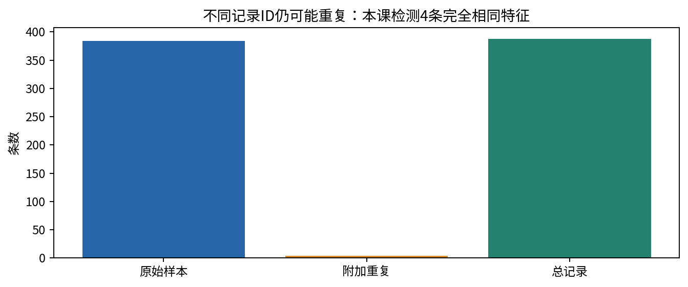
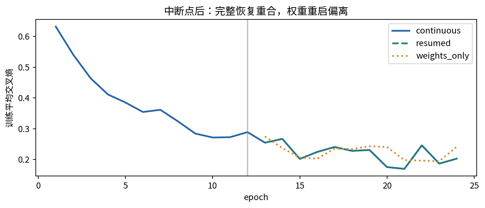
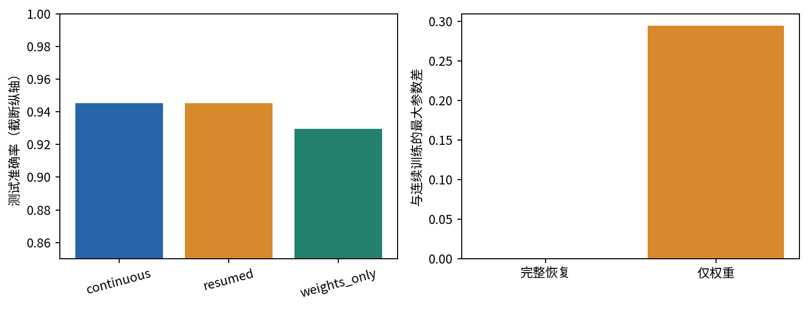
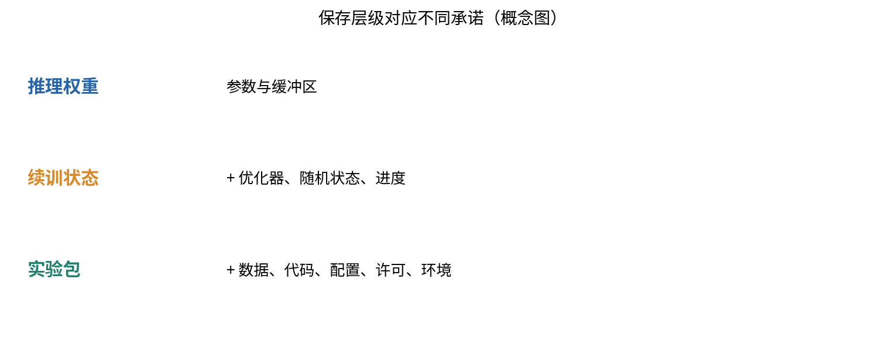

# 第069讲 数据模型与实验资产管理

一年后，一份图仍然保存在报告里，生成图的代码却已经修改，数据文件名仍叫data.csv，模型目录里有final、final2和final_best。此时即使记得随机种子，也未必能解释图中的数字。本讲学习把实验组织为一组彼此可追溯的资产：数据有来源，代码有版本，配置有边界，权重有状态，结果能指回产生它的过程。

先修006的最小复跑记录、030的训练循环和021的可信评价。我们会实际训练一个带Dropout的小网络，在第12轮保存完整状态，再分别连续训练、完整恢复和只恢复权重。三个分支可以帮助我们区分推理模型、续训检查点和完整实验包。所有数据均为本课自行生成的合成数值，没有真实个人记录，也不依赖外部数据仓库。

## 一 先问要恢复哪一种能力

“模型已经保存”是一句含糊的话。若目标只是对输入做预测，网络参数、buffer和预处理说明可能足够。若目标是从训练中间继续走同一条轨迹，优化器历史、随机状态、数据顺序和进度也不可缺。若目标是让另一位读者解释结论，还要补上数据、代码、配置、指标定义、失败记录和适用边界。

因此资产管理不是尽可能多地保存文件，而是让保存内容与承诺对应。一个仅含state_dict的文件可以是合格推理权重，但不能因此称作严格续训检查点。一个能成功加载的检查点，也不能证明数据来源合法或实验拆分正确。

本课把一轮训练的状态抽象为$S_t$，下一轮更新写成：

$$S_{t+1}=F(S_t,D,C,E).$$

$D$是数据与顺序，$C$是配置和算法代码，$E$是执行环境。若你只保留$S_t$的一部分，再调用同名训练函数，实际输入已经不同。文件名相同不能使$F$恢复原样；“我没有改模型结构”也不能排除优化器和随机性的变化。

## 二 数据资产首先要能解释来源

数据说明应回答：每一行是什么对象，标签怎样得到，收集或生成时有哪些规则，允许用于什么用途。字段名称、类型、单位、缺失值和时间含义都属于数据本身的解释。许可证和使用限制应独立记录，不能把“可以下载”当成“可以重新发布”。数据说明文献把这些问题组织为可复查的文档框架。[1]

本课的x有384行、6列，由固定NumPy生成器产生。标签为非线性规则$x_0x_1+0.7x_2-0.3x_3>0$的真假。前256行训练，后128行测试；这是固定生成过程下的简单拆分，不代表真实世界的时间或实体独立性。数据说明明确这是教学分布，不包含人群属性，也不支持现实应用效果结论。

真实数据若含同一病人、设备、账户或地点的多条记录，随机拆行可能让同一实体同时出现在训练与测试。此时需要先定义实体标识或时间边界，再拆分。即使没有实体ID，也应考虑图像近重复、文本模板和同源文件的泄漏风险。数据量很大不能自动抵消这些问题。

## 三 去重键与样本单位必须一致

记录ID相异不等于信息相异。两个文件可以保存相同的特征内容；同一张图片也可以缩放后换一个名字。本课演示最简单的情况：复制前4行特征到末尾，使388条记录只有384个不同的特征字节序列。

使用row.tobytes()建立集合，适合说明内容键与记录ID的区别。但这种键依赖dtype、列顺序、端序和浮点表示。数值上相近的两行不一定有相同字节；缺失值的不同编码也可能妨碍比较。更复杂的去重需要规范化、阈值、人工抽查和误删成本，不应悄悄把所有相似样本合并。

另一个重要选择是是否把标签纳入键。若两行特征相同、标签不同，它们可能是标签冲突，也可能是任务本身允许随机结果。直接保留一条会丢掉这一信息。正确做法是先记录冲突，再根据任务定义决定处理。本课复制的4条原始记录没有标签冲突；这个干净例子不免除真实项目中的审查。

## 四 内容哈希提供哪一种证据

哈希函数把任意长度字节映射为固定长度摘要。本课使用SHA256，对保存到磁盘的实际字节计算十六进制摘要。重新读取文件后摘要相同，可以在受信清单前提下提供很强的字节完整性证据。它不说明文件是谁制作的、制作是否有授权，也不证明程序没有逻辑错误。[2]

$$h=H(b_1,b_2,\ldots,b_n).$$

这里$b_i$是文件字节。实验把一个字节翻转后重新计算摘要，验证它与清单不一致。我们不损坏公开保存的数据文件，而是在内存中进行修改。这个对照检查的是“变化是否被发现”，不是对密码学抗碰撞性的数学证明。

文本换行、JSON缩进和ZIP内部元数据都可能改变字节哈希，而不改变数学内容。因此需要区分字节相同与语义相同。若目标是确认下载未损坏，字节哈希最直接；若目标是比较两组张量是否数值一致，还需明确dtype、形状、容差与排列方式。不能用某一个摘要代替所有比较。

本课asset_manifest.json列出数据、配置和四个检查点的摘要。它有意不包含自己，避免自引用；results.json也不属于这个最小核心资产清单。完整课程包另有文件级打包清单。每一种清单都应说明覆盖范围，而不是笼统写“所有内容已校验”。

## 五 资产图比一个大压缩包更有解释力

假设某个结果依赖数据D1、配置C1、代码K1和权重W1。把它们放进同一个ZIP只是建立了共同容器，还没有说明哪个结果使用了哪个权重，也没有说明是否混入旧输出。依赖图需要把关系说清楚。

本课的config.json记录种子、数据量、轮数、批次大小和学习率。data.npz保存真实数组及拆分索引。resume_epoch12.pt依赖数据和配置；continuous_epoch24.pt与resumed_epoch24.pt都从第12轮状态延伸，但执行路径不同。results.json记录两条路径的差异和限制。

如果你修改了学习率，最好产生新配置和新运行目录，而不是覆盖旧结果后保留原来的结论。运行标识可以由时间和配置摘要构成，但标识本身不替代完整配置。代码版本也要关联到运行；若运行后又编辑代码，记录当前Git提交未必能准确描述先前执行内容。

本课保留experiment.py作为完整入口，并将运行结果、环境与构建说明一起交付。它没有依赖远程实验追踪服务。规模增加以后可以使用数据库或对象存储，但基本问题仍然一样：对象身份、依赖关系、访问权限、保留期限和变更历史。

## 六 为什么Adam状态也属于训练状态

普通梯度下降的更新依赖当前参数与梯度；Adam还维护梯度的一阶和二阶移动统计量。简化写为：

$$m_t=\beta_1m_{t-1}+(1-\beta_1)g_t,$$

$$v_t=\beta_2v_{t-1}+(1-\beta_2)g_t^2.$$

实际更新还要处理偏差校正和稳定项。恢复参数却把$m_t$、$v_t$及步数重置，相当于换了一段优化过程。即使学习率与数据完全一样，下一步也可能不同。

用更简单的动量例子手算：更新规则$v_{t+1}=0.9v_t+g_t$，$\theta_{t+1}=\theta_t-0.1v_{t+1}$。在中断点$\theta_t=1$、$v_t=2$、新梯度$g_t=0.5$时，完整恢复得到$v_{t+1}=2.3$，参数0.77；只恢复参数并把速度清零，则速度0.5、参数0.95。0.18的差异不是随机数造成的，而是丢失优化器历史。

学习率调度器、混合精度缩放器和梯度累计进度也可能属于状态。本课不使用这些机制，所以不在检查点里虚构对应字段。但若把本课模板搬到复杂训练中，必须重新枚举状态，而不是机械复制一个字典。

## 七 随机种子与随机状态并不相同

种子决定随机数序列的起点，状态表示当前已经走到哪里。训练12轮以后，Dropout已消费许多随机数。再次manual_seed(69)会回到序列开头，而不是跳到第13轮应该使用的位置。数据打乱也类似。

本课用两个随机来源：PyTorch全局CPU随机状态负责参数初始化和Dropout；一个独立torch.Generator负责每轮randperm。完整检查点分别保存torch.get_rng_state()和order_generator.get_state()。恢复时先创建模型和优化器、加载参数，再把随机状态设回检查点。顺序很重要，因为创建模型本身会消费随机数。

随机状态之外还有数据加载工作进程、库内随机源、设备和非确定性算子。本课固定单线程CPU并启用确定性算法，验证范围很窄。官方说明也明确提醒，相同种子并不保证跨版本、平台或CPU/GPU逐位一致。[3]

## 八 一个容易忽略的浅拷贝错误

state_dict返回的张量通常仍与模型参数共享存储。如果把best_state = model.state_dict()保存在变量里，继续训练后，这个“最佳模型”可能随当前模型一起变化。最终加载它时，你以为恢复的是早期最优状态，实际拿到的仍可能是后来的权重。

本课snapshot对整个状态字典做deepcopy，再交给torch.save。这让内存快照与继续训练分离。另一个可靠做法是立刻把所需状态写入独立文件。无论采用哪种方式，都应通过一个小测试确认保存后的对象不会被后续更新悄悄改变。

读取本课检查点时使用torch.load(..., weights_only=True)，内容仅包含张量和基本容器。这个选项减少不必要的对象反序列化，但仍应该只加载可信来源资产。完整性与可信来源不同，前面的哈希检查不能替代来源判断。

## 九 三条训练路径的实测对照

实验网络为6维输入、24个隐藏单元、ReLU、Dropout0.3和二分类输出。Adam学习率0.01，每轮把256个训练样本打乱为8个批次，共24轮。第12轮保存完整状态。第一条路径直接继续；第二条读取全部状态继续；第三条只恢复权重，从新的优化器与随机序列继续。

本次完整恢复的最大参数差和逐轮训练损失最大差都是0。连续与恢复模型的测试交叉熵同为0.1543545，准确率同为0.9453125。仅恢复权重的最终最大参数差约0.294915，交叉熵0.1720797，准确率0.9296875。

不能从单次对照推断“只恢复权重永远更差”。它可能在某个例子上得到更高测试分数，但仍然不是完整状态续训。这里的主问题是过程一致性，不是通过换一个恢复策略争取最高分。把验证目标混成分数比较，会掩盖状态丢失本身。

## 十 可复跑与确定性应分层报告

最低层是程序能在说明的环境中运行。更高一层是输出指标在预先声明容差内一致。再高一层是相同环境下张量逐位一致。跨硬件、跨依赖版本逐位一致是更强承诺，通常需要额外设计与实测，不能靠“设过seed”自动获得。

本课确实验证同环境CPU连续与中断恢复的逐位参数一致，但未验证跨GPU、跨平台或未来版本。独立QA重跑可以补充新进程证据；这仍不等于已经覆盖所有未来环境。README应写清已测试版本，requirements用于控制主要Python依赖，系统库、硬件与线程数则另行记录。

## 十一 模型卡是边界说明而非宣传页

一个简明模型卡至少说明模型的目的、输入输出、训练数据、评价条件、指标、已知失败和不适用场景。它也应告诉读者哪些问题没有评估。模型卡文献强调这种结构化报告有助于理解系统性能与使用范围。[4]

本课模型卡可以写：“原创合成二分类教学模型；输入6个标准正态生成特征；在固定128例测试集上准确率94.53%；仅验证CPU同环境复跑；未评估真实人群、传感器数据、分布偏移或安全关键应用。”这个结论不华丽，却与证据严格对应。

数据和模型的许可分别记录。代码可公开，不代表所用数据必然可公开；模型可下载，也不代表能用于任意商业或敏感用途。本课不包含第三方数据或预训练权重，因此许可范围容易说明。遇到真实项目时，应核对实际权利和协议；没有明确依据时，不要替权利人创造授权。

## 十二 从本课迁移到自己的项目

先选一张最重要的结果图，倒推它需要的数据、配置、代码和模型。确认每一项都能找到，且版本没有歧义。然后选择一个中断点，实际做一次恢复实验。最后让另一位读者从空目录按照README运行。发现缺少依赖或隐含路径时，补充环境与入口，而不是要求对方复制你的整个电脑。

下一讲会将这些资产用于论文复现。可追溯的代码还不是充分的科学证据；它必须对应清楚的主张、合适的基线、受控消融和谨慎的研究表达。

## 练习

1. 分别列出推理、续训和复现实验所需资产，并说明三者为什么不能互相替代。
2. 手算动量例子中完整恢复与清零速度后的下一步参数。
3. 解释为什么重新设置种子不等于恢复随机状态，写出本课两个随机源。
4. 修改数据文件一个字节，比较哈希。哈希相同能否证明许可证允许发布？
5. 两行特征相同、标签不同，为什么不应直接删去其中一行？
6. 用checkpoint重算三条路径测试指标，并说明为何权重重启即使更准也不是严格续训。
7. 写出一份包含已验证与未验证边界的模型卡。

## 主要来源

[1] Gebru等，Datasheets for Datasets：https://arxiv.org/abs/1803.09010

[2] Python hashlib官方文档：https://docs.python.org/3/library/hashlib.html

[3] PyTorch Reproducibility：https://docs.pytorch.org/docs/2.14/notes/randomness.html

[4] Mitchell等，Model Cards for Model Reporting：https://arxiv.org/abs/1810.03993

[5] PyTorch保存与加载教程：https://docs.pytorch.org/tutorials/beginner/saving_loading_models.html

数学算例、状态恢复实验与图均为本课独立生成。文献说明文档与接口原则，并不是本课合成任务性能的证据。
