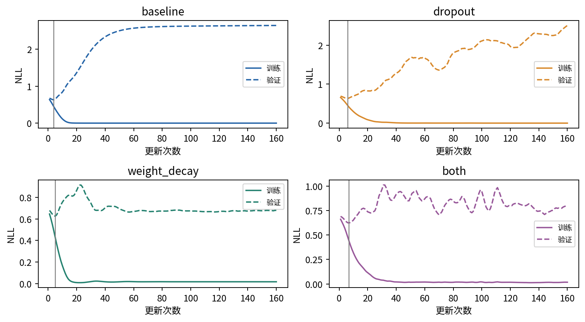
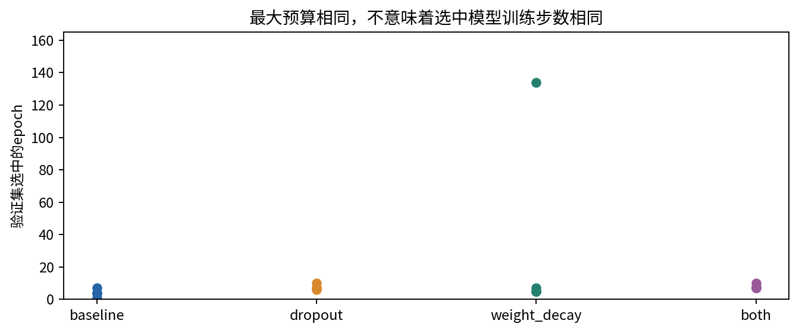
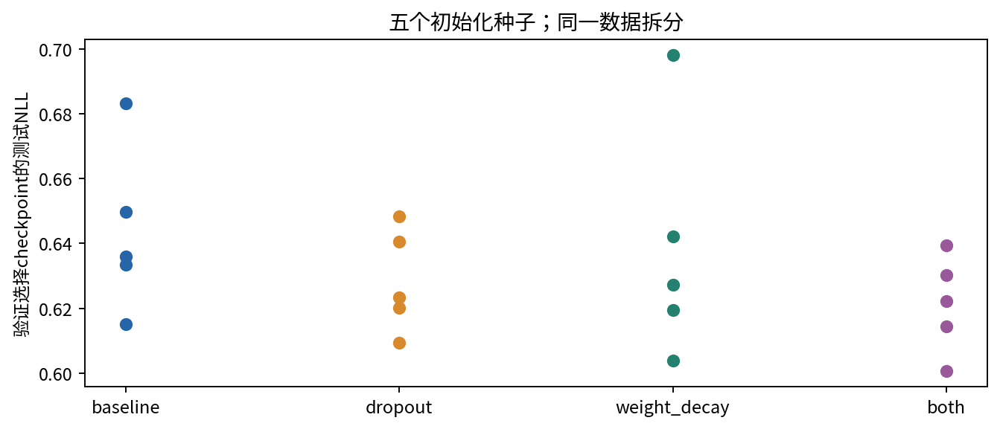
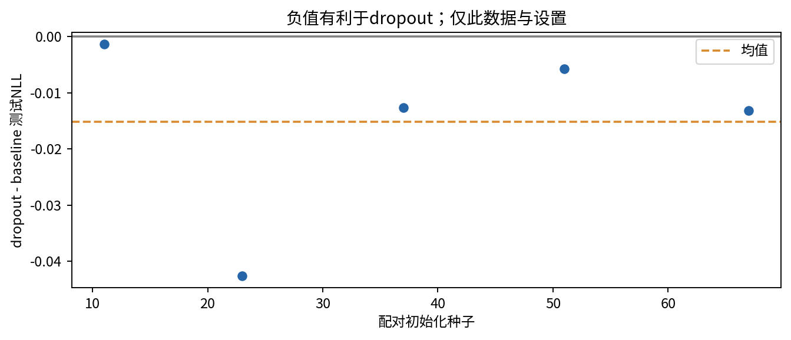

# 第070讲 论文复现消融与研究表达

复现一篇论文时，最容易开始的是照着图搭网络，最容易遗漏的是论文究竟声称解决了什么问题。一份结构相似的模型在另一组数据上获得一个数字，并不自动构成对原论文的检验。本讲把阅读、实现、比较和写作连起来：先明确主张，再定义可观测量，最后用受控实验说明支持了什么、没有支持什么。

先修022的比较实验与不确定性、040的训练诊断和069的资产追溯。本讲选择2014年的Dropout论文作为原始来源，但只做小规模机制复现。我们用自生成的20维二分类数据、两层MLP和五个初始化种子，实际运行20次训练，保留全部轨迹与验证集选择的权重。我们不复现论文中的视觉、语音、文档或生物信息基准分数，也不把小实验的结果当成原论文整体真假的裁决。

## 一 把一句主张拆成可检查的问题

论文提出的Dropout方法在训练时随机移除部分单元，以缓解过拟合，并报告多个任务上的改善。[1] 这句话里至少包含方法操作、预期机制和经验结果三个层次。实现随机屏蔽只能检查操作层；观察训练与测试误差变化涉及经验层；证明改善确由减少特定共适应机制引起，则需要额外证据。

先把宽泛问题改写成一个本课能回答的问题：“在固定合成数据、固定网络宽度、固定Adam学习率与160步预算下，加入0.4的Dropout后，验证选择模型的测试NLL如何变化？”这里每个限制都很重要。没有数据与预算的限定，“Dropout有没有用”就难以形成一个有限实验能回答的问题。

本课把主要指标预先设为配对测试NLL差，负值表示Dropout更好。准确率和Brier分数作为次要指标；它们有不同含义，不应在结果出来后挑一个最漂亮的改称主要指标。计划写入plan.json，并在训练前计算摘要。这个文件证明运行遵循一个固定计划，但本地文件没有不可篡改时间戳，因此不能声称具有外部预注册平台的时间证明。

## 二 原论文与缩规模实验之间有哪些差异

本课用832个合成样本，其中128训练、192验证、512测试。每个样本20个特征，标签依赖前四个特征的非线性组合与额外随机扰动，其余特征提供无关变化。训练样本少而网络较宽，容易出现过拟合，适合观察正则化与选择策略。

原论文覆盖的真实任务、数据规模、网络类型、优化方案与调参预算都不同。本课没有复制这些条件。因此较准确的名称是“Dropout操作与有限任务效果的机制尺度复现”。如果你写成“成功复现原论文全部结论”，读者会误以为原始基准、超参数和评价协议都经过了验证。

缩规模的价值并不低。它让每个输入、每个更新和每个结果都能被初学者检查，也让失败对照很便宜。代价是外推范围变小。科学表达的关键不是把实验做得听起来很大，而是让问题规模与证据规模相符。

## 三 从随机掩码推导inverted Dropout

设隐藏单元激活为$h$，丢弃概率为$p$，保留指示变量$m$服从参数$1-p$的伯努利分布。本课使用PyTorch的inverted Dropout：

$$\widetilde h=\frac{mh}{1-p}.$$

条件在固定$h$上，$E[m]=1-p$，所以：

$$E[\widetilde h\mid h]=h.$$

这说明训练时缩放保持每个激活的一阶期望。但它不说明整个非线性网络的期望输出等于无Dropout网络输出，因为一般$E[f(X)]\neq f(E[X])$。把这个局部等式当成全网络精确模型平均，是一个常见的推理跳步。

再算方差。因为$m^2=m$，有$E[\widetilde h^2\mid h]=h^2/(1-p)$，因此：

$$\operatorname{Var}(\widetilde h\mid h)=\frac{p}{1-p}h^2.$$

若$h=2$、$p=0.5$，输出以相同概率为0或4，均值2、方差4。若$p=0.4$，保留时激活乘$1/0.6$；推理eval时Dropout变为恒等映射，不再重复乘0.6。本课严格遵循这个接口语义。[2]

为什么噪声有时能改善泛化？一种直觉是单元不能总依赖固定同伴，模型需要对随机缺失更稳定。不过这个直觉不是对每个任务的保证。丢弃率过大可能损害容量或优化，训练预算不足也可能让有噪声模型收敛更慢。

## 四 一个公平基线需要同样认真

若新方法调了十次学习率，而基线只随便跑一次，即使模型结构只差一个模块，比较也可能不公平。基线应拥有清楚的训练协议、合理实现和可见预算。没有必要替每个小作业进行庞大搜索，但至少要说明“没有搜索”以及这种限制。

本课四个模式是：baseline，无Dropout、无权重衰减；dropout，丢弃率0.4；weight_decay，Adam权重衰减0.01；both，同时开启两项。模型都是20→64→64→2，激活ReLU，学习率0.01，全批128个训练样本，每次最多160个更新。没有数据增强，没有学习率调度，也没有超参数搜索。

同一个种子下，四种模式从完全相同的线性层参数开始。Dropout模块自身没有可训练参数，因此改变p不会改变模型参数数量。测试代码逐张量检查匹配初始化，避免把初始模型差异混进处理效应。

“同一个种子”仍不意味着每条路径消费相同随机数。Dropout分支会额外生成掩码。这里使用全批训练，没有随机样本顺序，因而控制更容易。如果改成小批次，应使用独立数据顺序生成器，防止Dropout的随机消费间接改变后续样本排列。

## 五 验证集选择是算法的一部分

训练过程中每一步都计算验证NLL，并保存最小值对应的参数。测试集只在选择完成后用于评价，不参与选择epoch。若两个验证值完全相同，代码使用严格小于，保留较早的检查点。

这意味着实验比较的对象不是“第160步模型”，而是“160步最大预算内按验证NLL选择的模型”。两者是不同算法。用哪一种没有唯一答案，但必须在实验前说明。若论文采用固定最后一步，而复现代码采用早停，两者结果差异不能全部归因于网络本身。

为了保留完整证据，我们仍训练到160步并记录所有曲线，即使最优验证点很早出现。全部20个分支具有相同最大更新预算，但最终被选中模型经历的更新次数可以不同。报告总预算与选择规则，比只报告“训练160轮”更准确。

## 六 为什么要保留多个种子的全部结果

一次运行同时包含方法影响和初始化偶然性。只挑最佳种子会使结果偏乐观，也让读者不知道其他运行发生了什么。本课固定五个种子11、23、37、51、67，全部报告，不根据测试结果补跑或删除。

准确率是每个样本是否分类正确的均值，NLL还考虑赋给真实类别的概率。对于二分类，真实类别为1时预测概率0.51和0.99都算正确，但NLL分别约0.673和0.010。反过来，极高置信错误会受到较大NLL惩罚。因此两个方法在准确率与NLL上排序不同并不矛盾。

Brier分数在本课采用二分类正类概率定义，即$(p_1-y)^2$的样本均值。它不是把两个类别的平方误差再相加的版本；后者在二分类时会大两倍。指标名称相同仍可能有约定差异，公式应写出来。

固定结果的平均测试NLL为：baseline 0.643447，dropout 0.628336，weight_decay 0.638200，both 0.621386。平均准确率分别为61.45%、65.08%、67.23%、65.55%。权重衰减在准确率上最高，组合在NLL上最低，正好说明不能把不同指标混成一个无条件“最好”。

## 七 用配对差减少无关波动

相同种子的两个方法共享初始化，因此可以先计算种子内差异，再研究这些差异的分布。设第$s$个种子的Dropout测试NLL为$L_{s,D}$，基线为$L_{s,B}$：

$$d_s=L_{s,D}-L_{s,B},\qquad \bar d=\frac{1}{S}\sum_{s=1}^S d_s.$$

配对差的样本方差为：

$$s_d^2=\frac{1}{S-1}\sum_{s=1}^S(d_s-\bar d)^2.$$

均值标准误为$s_d/\sqrt{S}$。本课用自由度$S-1$的t分位数形成一个近似95%区间：

$$\bar d\;\pm\;t_{0.975,S-1}\frac{s_d}{\sqrt{S}}.$$

这个区间依赖把不同初始化看作独立重复等假设，样本只有5个时估计不稳定。它只反映固定数据集上的初始化变化，不包含换数据、换任务、超参数搜索或部署分布的不确定性。

本次五个配对差约为-0.001345、-0.042604、-0.012639、-0.005790、-0.013177，均值-0.015111，样本标准差0.016141，标准误0.007218。自由度4的t分位数约2.776，得到区间[-0.035153,0.004931]。

诚实结论是：“在这组固定设置中，五次运行Dropout的测试NLL均低于配对基线，平均改善约0.0151；五种子近似t区间跨零，数据与预算范围也很窄。”不能写“证明Dropout无效”，也不应写“证明任何任务都有效”。不同统计程序可能给出不同摘要，应事先选择并解释，不要事后挑最有利检验。

## 八 消融实验不仅是关掉一个开关

消融通常用来检查某个组成部分是否对结果有贡献。但如果关掉模块同时改变参数量、训练预算、输入分布或选择规则，观察到的差异就不再对应单一因素。本课采用2×2设计，使两个正则化因素的开关都被明确列出。

用$L_{00}$表示均不启用，$L_{10}$仅Dropout，$L_{01}$仅权重衰减，$L_{11}$两者都有。若两项对NLL的影响可以简单相加，应满足：

$$I=L_{11}-L_{10}-L_{01}+L_{00}=0.$$

$I$是本课定义的交互对比，不是一个自动具有因果意义的万能统计量。它的解释仍依赖固定条件与比较设计。负值表示组合NLL低于简单相加所预测的值，正值则相反。

手算例子：四个NLL为0.8、0.7、0.75、0.6，交互为$0.6-0.7-0.75+0.8=-0.05$。不能把组合相对基线的0.2改善全归给Dropout，也不能说两项贡献分别等于组合效果的一半。

![图6 五个种子的交互对比有正有负。平均约-0.001703，近似95%区间[-0.018700,0.015295]，不足以支持强交互结论。](figures/05_interaction.png)

本课没有额外搜索最佳丢弃率或衰减强度。0.4与0.01只是固定教学设置。这避免把搜索预算混进比较，但也限制了对各方法最优能力的判断。下一步若研究超参数，应为每种方法预先分配同等搜索预算，并把选择过程留在验证集。

## 九 复现差异应该怎样排查

假如你的结果与原文不同，先确认任务和协议是否一致。标签定义、数据拆分、预处理和指标约定的差异，往往比某个层的实现细节更根本。其次检查训练预算、学习率、初始化、选择规则和评价模式，再看硬件与依赖导致的数值变化。

可以把差异写成一个表：原文是什么，本实现是什么，为什么改动，可能影响哪一项主张。资源不足的缩规模变更应明确承认。若你只有小数据、短训练，并不能仅凭分数较低判定论文错误；相反，即使分数相近，也不能忽略协议不同。

真正的“主张被反驳”需要在足够贴近主张条件、实现经过审查、替代解释得到控制的情况下形成证据。本课不进行这个级别的裁决。它练习的是把一项方法从文字转化为可核验程序，并诚实报告有限范围内的效果。

## 十 负结果与不确定结果怎样写

负结果可以是预先提出的改善没有出现，也可以是改善小于有意义阈值。不确定结果则可能只是样本和预算不足，无法区分若干解释。“未发现明显改善”与“证明没有任何改善”之间有很大差别。

本课一个有价值的不确定发现是，Dropout平均NLL较低，但五种子区间仍跨零。另一个发现是指标排序不一致，不能写一个总冠军结论。把这些信息保留，会比只贴组合方法最低的均值更有教学与研究价值。

一个合格的结果段落可以这样组织：先写具体设置和主要指标，再给均值、离散程度与全部运行数，接着说明预设主张是否得到有限支持，最后写替代解释与外推边界。统计区间是帮助描述证据的工具，不是研究结论的自动裁判。

## 十一 从结果文件写到可审查报告

本课outputs包含原始数据、训练前计划、20个验证选择检查点和所有160步曲线。Notebook重新训练全部分支，并逐个加载权重重算测试NLL。这样读者不必相信图中的点是手填的，也可以独立检查选中epoch是否真对应验证最小值。

预算是20次训练，每次160次全批更新，共3200次更新，处理409600个训练样本呈现次数。它不是409600个不同样本；实际训练集只有128个样本。训练计时约3.15秒是本次小CPU任务的观察值，不含依赖安装、Notebook构建、PDF渲染和文献阅读，重跑时间会随机器变化。

复现清单建议记录模型、假设、数据、拆分、超参数、运行次数、结果变异和计算环境。[3] 这些项目的意义在于让另一位读者能够查错。完成清单并不自动保证论文结论正确，仍需判断实验是否真正对准了主张。

## 十二 本课结论与下一步

我们完成了Dropout操作层的实现核验、五种子2×2对照、验证选择、全部checkpoint重载和限制报告。实验提供了一个可复跑的小范围观察：在这组数据和预算下，Dropout平均NLL较低，但不确定性与指标差异仍值得保留。

下一讲讨论分布外鲁棒性与不确定性。即使同分布测试改善真实存在，也不能自动推到新分布；研究表达中的边界，将在模型面对变化时变得更重要。

## 练习

1. 将“某方法提高泛化能力”改写为本课可检验的有限问题。
2. 推导inverted Dropout的条件均值与方差，计算h=2、p=0.5的数值。
3. 解释匹配初始化与独立样本排列生成器的作用。
4. 用五个配对差重算均值、标准差、标准误和t区间。
5. 对0.8、0.7、0.75、0.6手算交互，说明它不能分配全部改进功劳。
6. 检查每个保存checkpoint是否真对应验证最小点；能否使用测试集挑更晚的epoch？
7. 写一段包含不确定结果的结论，并列出三个不能外推的范围。

## 主要来源

[1] Srivastava等，Dropout A Simple Way to Prevent Neural Networks from Overfitting，JMLR 2014：https://jmlr.org/papers/v15/srivastava14a.html

[2] PyTorch Dropout官方接口：https://docs.pytorch.org/docs/2.14/generated/torch.nn.Dropout.html

[3] The Machine Learning Reproducibility Checklist v2.0：https://www.cs.mcgill.ca/~jpineau/ReproducibilityChecklist.pdf

[4] PyTorch Reproducibility：https://docs.pytorch.org/docs/2.14/notes/randomness.html

全部图、合成数据、统计计算与训练结果为本课原创实验；没有复制原论文图表或基准分数。
