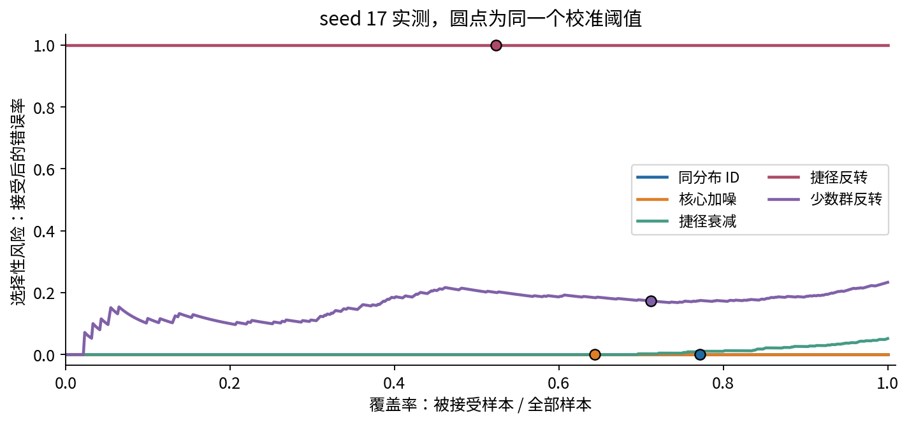

# DL071 实验 从自信预测到拒答审查

本实验的交付物不是一个更高准确率，而是一份能说明模型在哪里答错、在哪里拒答、哪些风险尚未验证的审查记录。全部数据离线生成，CPU运行，无需GPU、账号或下载数据。建议先读讲义第1、5、6节，再顺序完成下列任务。默认约数秒训练，实际时间以你的机器记录为准。

## 1 建立干净环境

在本单元目录创建独立Python环境，安装requirements.txt；若使用Anaconda，可用environment.yml建立环境。讲义PDF已提供，阅读它不需要安装PDF构建依赖。

```bash
python -m pip install -r requirements.txt
python -m unittest -v test_experiment.py
python -O -m unittest -v test_experiment.py
python experiment.py --output my_run
```

前两次测试各包含16项。不要在测试失败时只删除检查继续训练。my_run保存自己的数据、三份权重、逐例预测、校准搜索和results.json；课程提供的outputs保持不变。完整默认实验为三个初始化种子，每个220次全批更新。

## 2 在看输出前写出预期

打开experiment.py，寻找generate与shift_domains。手写每个域改了哪一列、变换强度、标签为何不变、哪些样本共享原始身份。预测五域中哪一个更容易暴露捷径依赖。不要事后删除“没有明显效果”的域。

训练、校准与测试分别为800、400和600条样本，生成种子901、902、903；扰动种子904。模型种子为17、29、43。区分“造数据的随机性”和“训练初始化的随机性”，检查函数调用没有把test_y传给fit或calibrate。

任务A：把五种测试列成协议清单，并标出你认为不能代表的现实情况。至少写出两个，例如真实相机传感器变化和输入语义改变。该任务防止把一个便宜的合成试验泛化为所有部署环境。

## 3 手算拒答指标

输入四条预测概率：[0.9,0.1]、[0.2,0.8]、[0.7,0.3]、[0.4,0.6]，真实标签为0、0、0、1。

任务B：分别对阈值0.75、0、1计算接受数、接受后的错误数、覆盖率和风险。解释“接受且答错占全部样本的比例”与风险的区别。然后调用selective复核。阈值1时应返回未定义风险，而不是0。

任务C：制造两个相同置信度0.8的样本，一个对、一个错。运行risk_coverage，检查是否出现覆盖率0.5的点；解释为什么单一阈值不能只接受其中一个。

## 4 检查真实温度与边界解

阅读results.json中每个run的temperature、threshold、calibration_search.on_boundary。绘制候选温度对校准NLL的曲线，并在图注中注明数据来源。温度搜索不接触测试标签；测试域的可靠性图只用于报告。

任务D：用logit [2,0]手算T=1和T=2的概率，分别假定真实类0和1，计算四个NLL。再回答：为什么温度可以不改变准确率，却改变NLL？为什么原域NLL改善不能修复捷径反转？本课出现边界解后没有扩大搜索，保留了预定实验的范围。

## 5 逐域逐群核对分母

任务E：先只读seed17的selective字段，用errors_accepted/accepted重算risk，用accepted/n重算coverage。对shortcut_fade，写明全量错误率仍可计算，但接受后风险没有定义。对subgroup_flip，分别报告g=0与g=1的样本数、接受数和错误数。

把两组错误数相加再除以两组接受数之和，核对总体风险。不要简单平均两个群体的风险。报告表应保留计数，而不是只留下四舍五入百分比。



## 6 重载一份真正训练的权重

下面代码只接受你自己生成或来自可信课程来源的checkpoint。不要用不可信pickle文件测试。

```python
from pathlib import Path
import numpy as np
import torch
from experiment import model, logits, softmax, selective

torch.set_num_threads(1)
root = Path("my_run")
ck = torch.load(root / "model_seed17.pt", weights_only=True)
m = model()
m.load_state_dict(ck["state_dict"])
data = np.load(root / "data.npz")
p = softmax(logits(m, data["shortcut_flip_x"]), ck["temperature"])
print(selective(p, data["test_y"], ck["threshold"]))
```

任务F：核对结果与保存记录一致；从confident_wrong_examples取第0条，打印输入、真实类、预测类和概率。说明这条记录能展示什么、不能证明什么。权重保存了推理所需参数和温度阈值，没有保存精确恢复训练所需的全部状态。

## 7 故意制造三个错误然后修好

任务G1：在你自己的副本中把风险分母改为len(y)，观察手算测试失败。任务G2：把空接受风险写成0，观察空集测试失败。任务G3：在阈值比较中把大于等于改为严格大于，观察边界测试失败。每次只改一个地方，记录失败测试、错误原因、修复方式。

不要为了让测试变绿而改预期答案；先回到指标定义。运行python -O再次检查，确认检查不是依赖裸assert才有效。

## 8 Notebook与图的复查

```bash
python create_notebook.py
python execute_notebook.py experiment.ipynb
python make_figures.py
```

Notebook在新Python进程内启动实际IPython内核，按顺序重新训练到notebook_outputs，并内嵌结果图。它不覆盖outputs。提供的执行器不使用外进程socket通信，验证范围不包括浏览器Jupyter界面。make_figures.py从教材固定outputs生成六张图，因此自己的扩展实验不能偷偷替换教材图的统计。

任务H：检查所有代码单元有连续执行序号、没有error输出、图确实含image/png。把Notebook运行指标与outputs比较时排除耗时字段；同环境下确定性的预测和损失应匹配，跨平台差异要保留版本信息。

## 9 提交一页结论

必须包含预定协议、一个正确的手算、五域计数表、一个子群对照、一个置信但错误实例以及两条限制。最后用三种状态写结论：“已在此实验验证”“仅由机制解释支持”“尚未验证”。

评分重点：指标与信息边界40%，代码和权重复核25%，曲线与子群解释20%，诚实的限制15%。只交一个准确率或一张漂亮图不算完成。可选扩展是增加一种事先说明的扰动并用全新测试种子复核；不要将探索后的新结果混写进原预定实验。
