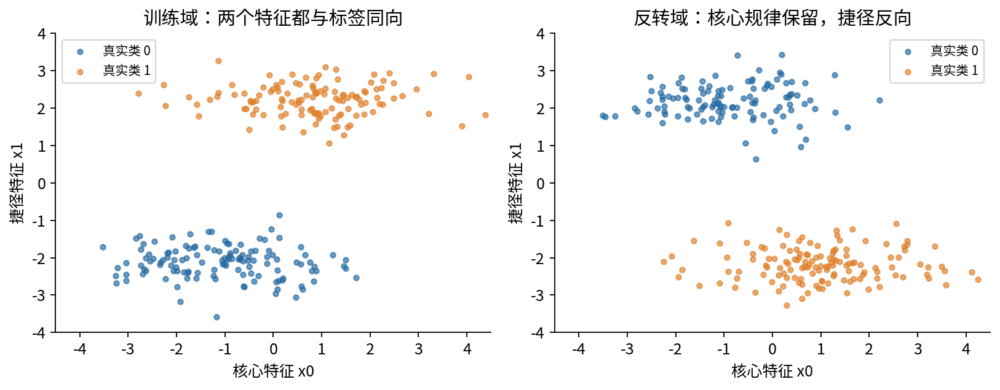
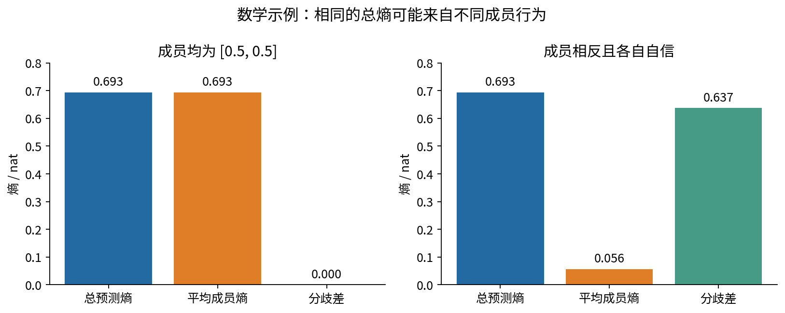
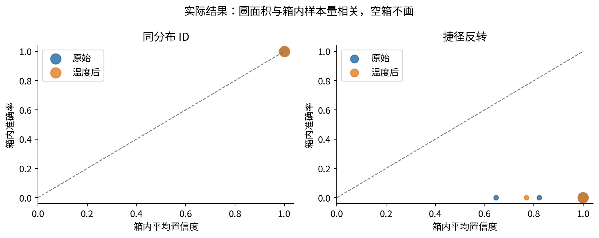
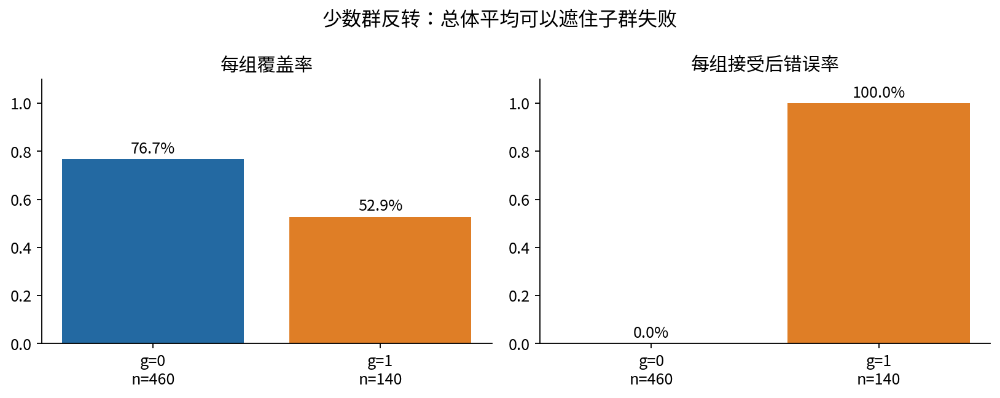
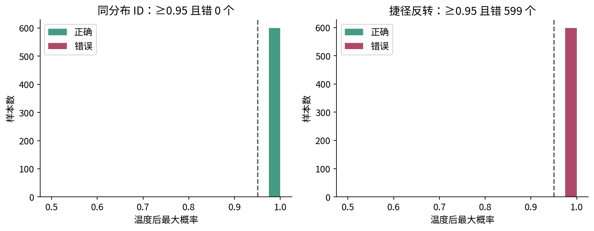

# DL071 分布外鲁棒性与不确定性

模型什么时候应承认不知道，测试之外又能信任多少？这不是在准确率后面再加一个“置信度”数字就能回答的问题。一个网络可能在训练来源相近的图片上全部预测正确，也可能在背景关系反转后，仍以接近1的概率全部预测错误。我们要学习的，是把这种失败变成可以检查的实验，而不是寻找一个永远可靠的分数。

本讲从概率、条件平均和简单二分类出发，建立分布漂移、两类不确定性、校准、拒答、风险覆盖曲线与子群审查。配套实验真实训练三个小型PyTorch网络，测试五种事先写明的合成环境，并保存所有预测与权重。先修022和039；部署压力测试可回看068，容量与泛化理论可回看038。本讲的有限实验不构成现实系统安全认证。

## 1 先问清楚什么发生了变化

用 $P(X,Y)$ 表示训练来源中输入X与标签Y的联合分布，用 $Q(X,Y)$ 表示使用时的分布。分布外问题的核心是P与Q不同，而训练损失低只告诉我们模型在P的有限样本上做得怎样。Q可以离P很近，也可以改变最重要的预测关系。

有三种常见描述。协变量漂移假设输入分布改变而给定输入后的标签规律不变，即 $P(Y\mid X)=Q(Y\mid X)$；标签漂移假设类别比例改变而类条件输入分布不变；概念漂移则允许给定输入后的标签规律改变。这些是分析假设，不是见到“相机变了”就自动成立的分类。即使现实标签含义没有变，观测输入丢失信息之后，条件标签概率也可能改变。

本课以两个可观测特征造一个例子。真实标签y取0或1，写 $s=2y-1$，于是s取负1或正1。训练数据为

$$
x_0=s+\epsilon_0,\qquad x_1=2.2s+\epsilon_1.
$$

其中核心特征噪声标准差为1.15，捷径特征噪声标准差为0.45。x₀较难用，x₁非常容易用。测试时把x₁乘以负1，标签不变，核心特征不变。模型若主要学到“x₁为正就预测1”，自然会翻车。这里有意改变联合关系，不把它错误地宣称为满足条件不变假设的纯协变量漂移。

这也解释了“背景只是无关细节”为何需要证据。对人来说无关的背景，可能恰好是训练集中最容易预测标签的变量。模型优化的是损失，不会自行接受研究者对“应该学什么”的期望。

## 2 自然扰动与攻击不能混着报告

自然扰动通常来自明确的数据生成过程，例如噪声、亮度、设备、地理位置或时间变化。对抗扰动则包含一个有目标的选择过程：攻击者利用模型反馈，在约束范围内寻找更容易导致错误的输入。两者都可能暴露脆弱性，但通过随机噪声测试不代表通过攻击测试，攻击成功也不说明每个自然样本都会失败。

若讨论攻击，至少说明攻击者能看到什么、允许改动哪里、改动预算多大、攻击目标是什么。若讨论自然压力测试，说明变换强度、标签为何仍有效、变换是否符合使用场景。本课只执行合成自然／机制压力变换，没有梯度攻击、真实传感器或真实用户。对代码里的noise一词不要做出超出范围的解释。

预定测试包括同分布、给x₀再加标准差1.8的高斯噪声、把x₁衰减到0.1倍、把x₁整体反转，以及只反转预先生成的g=1子群。g约占25%，不送入模型。五域都由同一批600个测试样本变换，因此可以逐例比较，但不能把它们当作3000个独立测试样本。

## 3 两类不确定性首先是解释问题的语言

数据不确定性常指给定已观察特征后仍存在的结果变化。例如仅凭模糊图像无法判定物体，它可能来自测量噪声、标签噪声或缺失关键变量。模型不确定性常指有限数据、参数或模型选择带来的未知。例如训练集没有覆盖某个区域，多种与已知数据相容的模型在该区域意见不同。

“数据不确定性不可消除”要加条件：在当前观测方式与任务定义下，单纯增加同类数据可能不能消除它；更好的测量或新特征可能减少它。“模型不确定性可以靠更多数据减少”同样不是对任意错误数据的承诺。错误模型族、训练偏差和共同捷径会让更多相似数据继续强化错误。

分类分布p的熵为

$$
H(p)=-\sum_{k=1}^{K}p_k\log p_k.
$$

采用自然对数时单位为nat。二分类p为[0.5,0.5]时，熵为 $\log 2\approx0.6931$；p为[0.99,0.01]时，熵约0.0560。熵衡量预测分布有多分散，不是“这次一定错的概率”。一个错得极其自信的模型也有很低的熵。

若有M个成员模型，先平均概率而不是平均类别编号：

$$
\bar p=\frac{1}{M}\sum_{m=1}^{M}p^{(m)},\qquad D=H(\bar p)-\frac{1}{M}\sum_{m=1}^{M}H(p^{(m)}).
$$

熵的凹性使D非负。所有成员都输出[0.5,0.5]时，总熵高而D为0；两个成员分别输出[0.99,0.01]和[0.01,0.99]时，总熵同样高，但D约0.6371。后者记录成员分歧。这种分解在合适概率模型下可有进一步解释；本课的独立初始化网络不是严格后验样本，所以把D称为分歧指标，不把它当作经过认证的模型不确定性。

## 4 softmax为什么可以非常自信地犯错

logit是模型最后一层输出的实数。softmax只把这组实数归一化为总和为1的数：

$$
p_k=\frac{\exp(z_k)}{\sum_j\exp(z_j)}.
$$

它没有一项检查“此输入像不像训练数据”。对二分类logit [2,0]，第一类概率为 $e^2/(e^2+1)=0.8808$。把两项都乘5，变为[10,0]，第一类概率约0.99995，预测类别没有改变。若真实标签为第二类，放大logit只是让错误更自信。

“概率和为1”是代数性质；“所有声称0.9的预测中约90%正确”是涉及实际标签的统计性质，后者叫校准。一个模型可以分类很好而校准不好，也可以整体校准尚可但无法有效区分谁会错。

校准也有评估粒度。只看最大概率是否对应总体正确率，叫常见的top-label校准检查；它没有自动证明每个类别、每个子群或每种环境都校准。把所有人混在一起的平均正确率，可能掩盖某一子群的系统性失效。

## 5 从分箱图到温度缩放

把置信度c分成若干箱。每个非空箱记录样本数n、平均置信度和实际正确率。例如10个预测都约0.8，其中6个正确，这个箱的置信度与准确率差约0.2。常见ECE把各箱绝对差按样本占比加权：

$$
\operatorname{ECE}=\sum_{b=1}^{B}\frac{n_b}{N}\left|\operatorname{acc}(b)-\operatorname{conf}(b)\right|.
$$

ECE依赖分箱方式，小样本箱不稳定，也可能隐藏箱内部或子群差异。报告ECE时要说明箱数，并同时看负对数似然NLL、错误率和图。本课用10个等宽箱，空箱不画，图中面积提示样本量。

温度缩放用一个正数T除以logit，再求softmax：

$$
p_k(T)=\frac{\exp(z_k/T)}{\sum_j\exp(z_j/T)}.
$$

T大于1通常让分布更平，T小于1让分布更尖。因为除以同一个正数不改变logit大小顺序，预测类别不变。用[2,0]手算，T=2时第一类概率变成0.7311；若真实标签为第一类，NLL从约0.1269上升到0.3133；若真实标签为第二类，NLL从2.1269下降到1.3133。让错误预测不要那么自信可能改善平均NLL，但也会同时影响正确预测。

T应在独立校准数据上最小化NLL。本课预先规定81个候选，范围0.5到5，按对数等距排列。三个种子都选中T=0.5这一边界，因为该合成校准集几乎可完美分离。边界解提示最优值受搜索范围约束，不代表发现了普遍最优温度；我们保留这个事实，没有根据测试表现更改搜索区间。

温度缩放是已有方法，其有效性和局限应参考原始研究。[1] 针对分布变化的系统评估提醒我们，原来源上的后处理校准不能自动迁移到新来源。[2] 本课的反例是独立的小型机制演示，不是重现那些大型基准。

## 6 拒答需要两个数而不是一个漂亮准确率

令预测类别为 $\hat y_i$，置信度为 $c_i$，阈值为tau。接受指示量为

$$
a_i=\mathbf{1}\{c_i\geq\tau\},\qquad e_i=\mathbf{1}\{\hat y_i\ne y_i\}.
$$

覆盖率是被接受的比例；选择性风险是在被接受的样本中犯错的比例：

$$
\widehat C=\frac{1}{N}\sum_i a_i,\qquad \widehat R=\frac{\sum_i a_i e_i}{\sum_i a_i}.
$$

风险的分母是接受数，不是总样本数。总量分母对应的是“全部到达请求中，被系统接受且答错的比例”，它等于 $\widehat C\widehat R$，是另一个问题。分母为零时，本课输出null，表示风险未定义；不能把全拒答写成风险0并宣称完美模型。

**逐项手算。** 六条预测的置信度从高到低为0.99、0.95、0.90、0.80、0.70、0.60，错误指示量为0、1、0、0、1、1。阈值0.90接受前三条，覆盖率3/6，风险1/3。阈值0.80接受前四条，覆盖率4/6，风险1/4。阈值0.99只接受一条，风险0。风险不必随着阈值变化单调；本例从前三条扩到前四条时，新增的是正确样本，风险反而下降。

阈值怎么选也属于实验的一部分。本课只在400条校准样本上求置信度的20%分位数，以目标覆盖约80%；相同置信度一并接受，因此实际覆盖可能高于目标。这个规则没有用风险约束，也不保证测试覆盖等于80%。把它叫“80%覆盖目标”可以，把它叫“错误率控制”不可以。

## 7 风险覆盖曲线怎样画才不误导

从高到低扫描阈值，计算每个可实现阈值的覆盖率和风险，得到风险覆盖曲线。理想情形下，先接受的样本比较可靠，低覆盖位置的风险较低；若错误样本恰好最自信，曲线会很糟。曲线提供排序能力的描述，不会修复预测本身。

置信度有并列时，单一阈值不能接受其中一半。因此代码只在每个并列组的末尾取点。若按任意行顺序一个个放进来，就可能画出实际阈值不能实现的漂亮线段。测试标签可用于事后画评估曲线，但不能再从这条测试曲线挑一个“最好”的部署阈值并报告同一测试集的无偏结果。

选择性分类原始研究讨论了风险与覆盖之间的权衡以及有假设条件的控制方法。[3] 本课只实现预定覆盖分位数规则，未实现那篇研究中的统计保证。读论文时应把同名目标、具体算法和保证成立的条件分开。

## 8 拒答并非没有代价

假设错误回答损失为1、正确回答为0、拒答固定代价为c，并暂时忽略后续人工处理错误。总体期望代价可写为

$$
L_{\rm system}=C R+(1-C)c.
$$

覆盖50%、风险1%、拒答代价0.2时，代价为0.5×0.01+0.5×0.2=0.105。另一系统覆盖90%、风险5%时，代价为0.9×0.05+0.1×0.2=0.065。第二个系统接受后错误率更高，却在这个明确代价模型下总代价更低。不能不谈转人工容量和拒答成本，就把更低风险当作唯一目标。

若已知某个输入的真实条件错误概率r，接受与拒答分别付出r和c，所以r小于等于c时接受更便宜。然而最大softmax概率通常不是经过验证的1-r，更不能在分布漂移后直接使用这个决策推导。现实还可能存在不同类型错误的不同损失，以及拒答后无法获得帮助的群体差异。

## 9 子群报告要同时保留分子与分母

总体错误率是按群体大小加权的平均，总体选择性风险则按每组的接受数加权，二者权重不同。本课少数群反转环境中，g=0有460个测试样本，g=1有140个。seed17在g=0接受353个且全对，在g=1接受74个且全错。

总体接受后风险为74/(353+74)=17.33%，不是两个群体风险0%与100%的简单平均50%。少数群覆盖为74/140=52.86%，多数群为353/460=76.74%。系统既更少服务少数群，又在接受他们时全部错误。只看“总体接受后约82.7%准确”会漏掉问题。

子群可以是事先知道的设备类型、时段或环境，也可以是具有明确合理性的审计切片。涉及现实人群时，要考虑采集合法性、测量误差与隐私。本课g只是随机合成标记，不代表真实人口群体，也没有进行现实公平性结论推断。

事后发现新切片并非不允许，但必须标记为探索性。先搜成百上千个切片，再只报告最坏一个，和事先指定切片的证据含义不同。新的重要发现应在新数据上复核。

## 10 实际结果及一个可追踪的错误

以下均为seed17，固定校准阈值约0.9999999811。如此接近1的阈值来自极容易的校准域，不是手工挑选的通用阈值。

| 预定环境 | 全量错误率 | 接受数 / 600 | 覆盖率 | 接受后风险 |
|---|---:|---:|---:|---:|
| 同分布 | 0.00% | 463 | 77.17% | 0.00% |
| 核心加噪 | 0.00% | 386 | 64.33% | 0.00% |
| 捷径衰减 | 5.17% | 0 | 0.00% | 未定义 |
| 捷径反转 | 100.00% | 314 | 52.33% | 100.00% |
| 少数群反转 | 23.33% | 427 | 71.17% | 17.33% |

捷径反转域第0个样本的输入约为[1.86734, -2.45439]，真实标签为1，模型预测0，温度后置信度约0.9999999873。核心特征为正，但网络遵循了更容易的捷径。600个反转样本中有599个达到“最大概率至少0.95且预测错误”的事先定义。我们展示这个例子用于解释机制；代表性结论仍依赖全部样本统计。

温度缩放后的反转域NLL约17.4520，原始NLL约8.7272。它在原域校准目标上改善，并不意味着每个域都改善。三个成员概率平均后，反转域错误率仍为100%，平均分歧只有约0.000163 nat。成员意见一致可能来自共同错误。

## 11 零错误和有限样本的正确读法

同分布接受463个样本且零错误，不等于总体风险严格为零。把测试样本近似视为独立同分布、阈值已在独立校准集固定后，二项比例的Wilson区间可以提供一个描述性不确定范围。记观察错误比例为r，接受数为n，取z=1.96：

$$
\operatorname{center}=\frac{r+z^2/(2n)}{1+z^2/n}.
$$

$$
\operatorname{radius}=\frac{z\sqrt{r(1-r)/n+z^2/(4n^2)}}{1+z^2/n}.
$$

零错误时上端仍大于零。本课463个接受样本的上端约0.823%。这是该采样假设下的近似区间，不是未来任意漂移下的保证；五个相关域、多个子群和反复试验也没有自动得到同时覆盖校正。若阈值在同一个测试集上被反复调整，原本独立的评估解释就失效。

三次初始化也不等于三份独立现实世界数据。本课固定训练、校准和测试集，三个种子只改变模型初始化。它们有助于发现训练偶然性，却不能覆盖换数据、换人群、换时间的变化。PyTorch官方文档还提醒，固定随机种子不保证跨版本、设备、平台逐位一致。[4]

## 12 从代码走回研究判断

experiment.py按照数据生成、模型拟合、校准、封存测试评估的顺序运行。fit接收训练数据，calibrate只接收校准logit和标签，selective才接收测试预测和测试标签。这个函数接口设计帮助我们检查信息边界，不能替代对调用处的审查。

测试特别检查了风险分母、并列置信度、空接受集、概率合法性、变换不修改原数据、子群变换范围、熵分解以及权重重载。普通模式和优化模式都使用unittest方法检查，不依赖可能被python -O移除的裸assert。完整训练权重保存在outputs，但只支持推理重载；没有优化器和随机数状态，因此不声称能够精确断点续训。[5]

本讲得到的合理结论是：在指定合成机制下，模型与同源校准、简单集成都可能共同依赖捷径，拒答排序也可能失败。下一步若要改善，应提出可检验的机制假设，例如改变训练中捷径与标签的关系，并以预定基线、消融和预算审查它。072将给出一个独立可运行的研究项目示范。

## 13 自查与继续阅读

读完后请不看答案说明：为什么概率归一化不等于校准；为什么目标80%校准覆盖没有保证测试覆盖；为什么少数群的风险不能直接等权平均；为什么零错误不能写成零风险保证；为什么三个成员一致也可能一起错。若其中任何一步无法用具体分子分母解释，先回到第6节手算，再运行Notebook。

参考来源的适用范围和核对日期见sources.md与source-checks.json。所有推导算例、合成数据、图和实验代码均为本课独立制作。

1. Guo等，On Calibration of Modern Neural Networks，ICML 2017。https://proceedings.mlr.press/v70/guo17a.html
2. Ovadia等，Can you trust your model's uncertainty，NeurIPS 2019。https://proceedings.neurips.cc/paper/2019/hash/8558cb408c1d76621371888657d2eb1d-Abstract.html
3. Geifman与El-Yaniv，Selective Classification for Deep Neural Networks，2017。https://arxiv.org/abs/1705.08500
4. PyTorch 2.14，Reproducibility。https://docs.pytorch.org/docs/2.14/notes/randomness.html
5. PyTorch，Saving and Loading Models。https://docs.pytorch.org/tutorials/beginner/saving_loading_models.html
