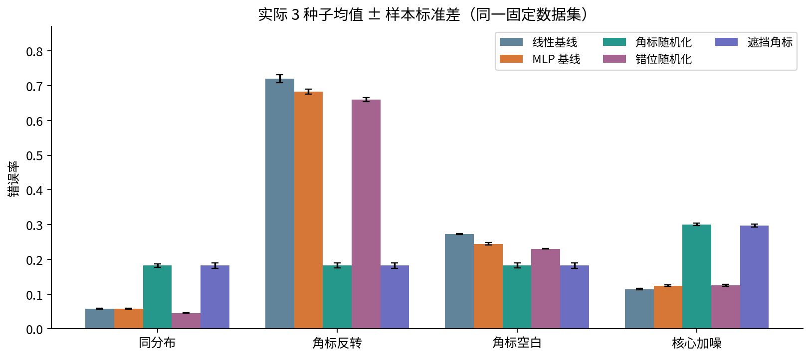

# DL072 实验 提交一个可被审查的研究项目

本实验提供一个完整可重跑的研究起点，同时要求你自己解释证据。最终提交应包含研究问题、相关工作、推导、代码、基线与消融、全量结果、预算和限制。只交“模型运行了”或“准确率提高了”不算完成。

## 1 先审查计划再运行

阅读research_plan.json，暂时不要先看results.json。用自己的话写出主指标和预期方向；解释什么结果会推翻“有针对性的角标干预比一般噪声更重要”这一机制假设。

任务A：画出训练800、验证240、测试600的数据流。验证只定拒答阈值，不选模型；测试只做报告。写出五个方法各自改变了什么。检查遮挡方法在推理时也遮挡，而随机化方法推理时不再随机。

## 2 创建独立环境并测试

在本单元目录运行。首次安装可能联网，实际训练和数据生成均离线。你可以用独立Anaconda环境，或者现有干净Python环境。

```bash
python -m pip install -r requirements.txt
python -m unittest -v test_experiment.py
python -O -m unittest -v test_experiment.py
python experiment.py --output my_project
```

测试各17项，完整运行包含五方法×三种子。不要把--steps改成其他值后仍直接对照默认160步的报告；如果改了，必须把它标为新实验。my_project另存结果，避免覆盖教材固定outputs。

## 3 从像素理解方法

任务B：取同一测试样本，画出id、flip、blank三种输入，确认中心像素一致。再用transform画出随机角标与错位随机化输入，说明为什么它们没有改变标签的定义。检查transform不修改原张量。

任务C：手算参数数。线性模型为144→2，MLP为144→32→2，每层包含偏置。解释为什么相同步数不是相同算力。读budget中的training_tensor_bytes，指出为什么它不能代表峰值内存。

## 4 推导自己的训练目标

任务D：把普通经验风险和角标随机化的期望风险写出来。假设某个样本在正、负角标下损失分别0.2和1.0，两种角标等概率，计算期望；解释每步单次抽样如何近似该目标。

阅读fit中训练循环的每一行，标出清空梯度、增强、前向、交叉熵、反向、优化器更新。交叉熵输入为logit，不要提前softmax。增强的随机发生器由模型种子加1000初始化，标签没有传入增强函数。

## 5 重新计算所有主结果

任务E：从my_project/results.json读取全部15次运行。先按种子打印原始MLP和角标随机化的反转错误数；错误数除以600得到错误率，然后在每个种子内部求差。重算平均差与分母为2的样本标准差。

接着报告所有方法在四域上的平均错误率与标准差，禁止只挑最佳种子。对角标随机化，再计算同分布错误率代价和核心加噪域代价。报告“个百分点”时，明确用的是错误率绝对差乘100。



## 6 复核所有权重

```python
from pathlib import Path
import numpy as np
import torch
from experiment import network, predict, metrics

torch.set_num_threads(1)
root = Path("my_project")
data = np.load(root / "data.npz")
for path in sorted(root.glob("*_seed*.pt")):
    ck = torch.load(path, weights_only=True)
    m = network(ck["variant"])
    m.load_state_dict(ck["state_dict"])
    p = predict(m, data["flip_x"], ck["variant"])
    print(path.name, metrics(p, data["test_y"])["error"])
```

任务F：将每个打印值与保存记录核对，不能只抽查一份。只能加载可信文件。解释为什么保存了state_dict仍不等于保存了完整续训状态。

## 7 故障植入与代码审查

任务G1：在自己的副本中删除推理时mask_corner的遮挡，说明哪项测试应该失败以及为什么它已变成另一个方法。任务G2：把标准差的ddof从1改成0，重算并解释错误条含义变化。任务G3：把错位随机化误改到左上角，解释这会使哪一个消融失去意义。

修复后重新执行普通和-O测试。一个测试通过并不证明研究无误；它只能证明被检查的契约。例如形状正确不能排除测试集泄漏，因此还要阅读数据流。

## 8 执行Notebook并检查图像输出

```bash
python create_notebook.py
python execute_notebook.py experiment.ipynb
python make_figures.py
```

Notebook在新Python进程内实际顺序执行所有代码单元，重新训练15个模型到notebook_outputs，内嵌运行结果图。执行器使用IPython进程内内核，验证不覆盖浏览器Jupyter或外进程通信。make_figures.py专门读取固定outputs，重建讲义六图。

任务H：检查Notebook没有错误输出，每个代码单元有连续序号，至少两张图包含image/png数据。比较Notebook重跑与固定结果时只比较确定性字段，计时字段另行记录。

## 9 写报告并进行一次对抗性审查

提交1500字左右的短报告，结构可参考project_report.md，但必须用自己的语言解释至少一个反对自己主张的结果。报告应包含：一个可推翻问题；一段相关工作与区别；两个训练目标；完整结果；配对多种子统计；算力和内存口径；三条限制；一个下一步最有价值的实验。

找同学或自己扮演审查者，回答四问：有没有测试信息泄漏；收益是否由一般噪声解释；简单遮挡是否同样有效；去掉角标后原域代价是否合理。记录一个你因审查而收窄的结论。

评分建议：协议与信息边界25%，实现与复现25%，基线消融和统计25%，限制与审查25%。不要求发表级创新；要求结论与证据相称。

## 10 可选扩展只改一个因素

选择角标相关率、角标位置、核心噪声之一，先写新假设和新协议，再使用新数据种子。保留原结果作为已完成阶段，不把探索改动藏进原计划。扩展未运行时写“待验证”，不要把可能性填成结论。
