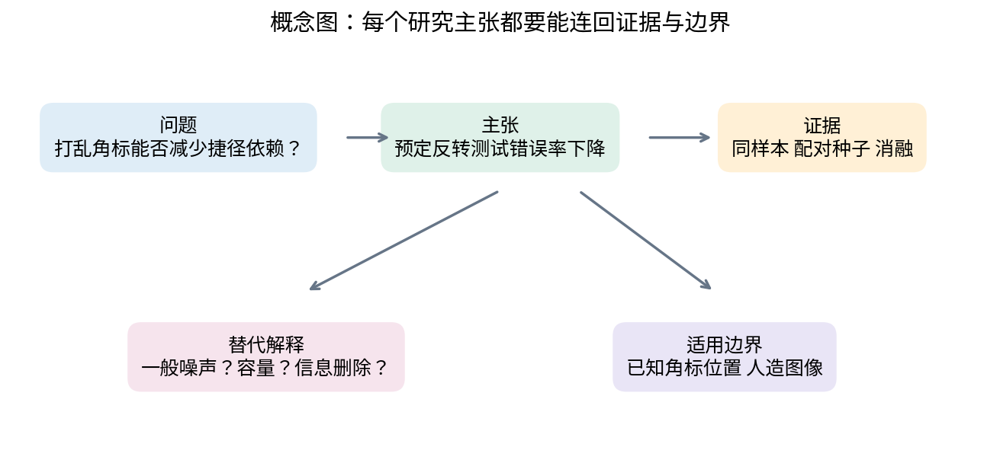
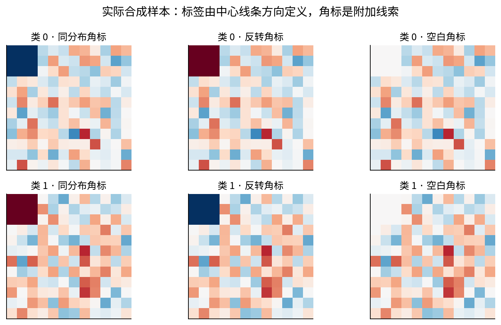
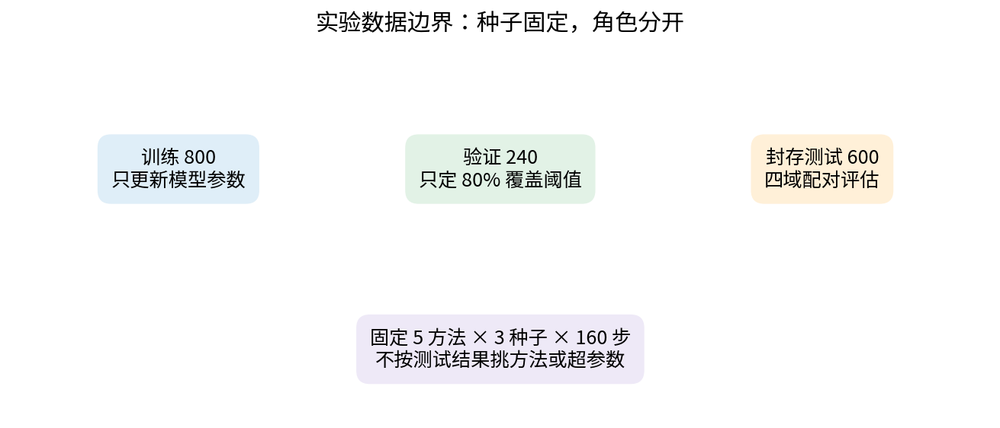
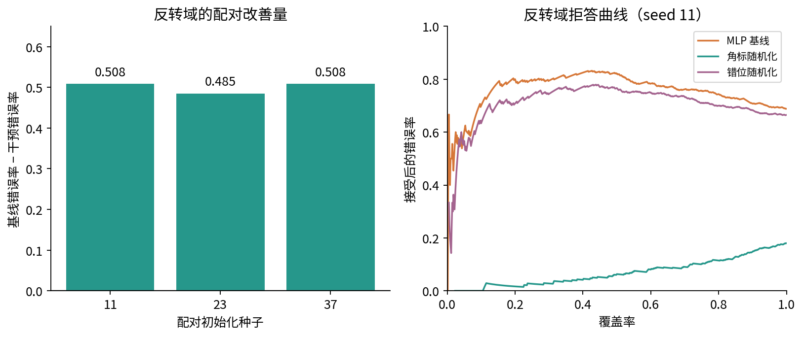
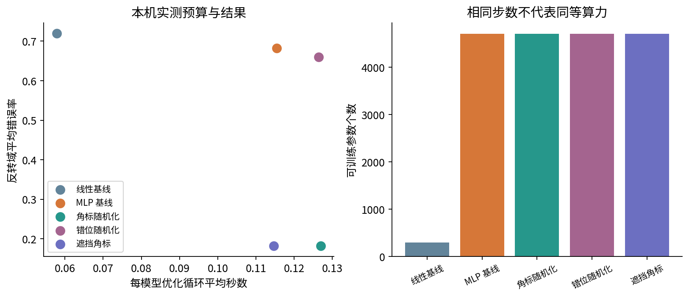

# DL072 独立研究项目与审查

一个研究结论要能被别人批评、重跑和继续推进。运行成功只证明程序走到了末尾；漂亮的图只证明有人把数字画了出来。研究还需要说明：问题是什么，比较是否公平，证据支持到哪一步，什么替代解释尚未排除，以及别人拿到文件后如何核对。

本讲围绕一个完整的小型项目展开：训练时随机化图像角标，能否减少分类模型在角标关系反转时的错误？你会得到独立可运行的数据生成、五种方法、三个种子、真实PyTorch训练权重、逐例预测和预算记录。先修042、070、071；只选择一条小型监督视觉路线，不要求同时完成序列、生成或所有高级分支。本项目是研究训练样例，不声称方法新颖或达到发表标准。

## 1 将兴趣缩小成可以被推翻的问题

“让模型更鲁棒”是方向，不是足够清楚的问题。先固定任务：输入12×12单通道图像，判断中心的弱线条是横向还是纵向。然后写出现象：训练图像左上角有一个与标签约95%一致的明暗角标，网络可能依靠角标。最后提出干预：训练时把角标替换成与标签独立的随机明暗块。

本项目的主问题是：在相同原始训练样本、相同MLP结构和相同更新步数下，该干预能否降低预定“角标反转”测试域的平均错误率？主要指标是这个测试域的全量错误率；同分布错误率、核心加噪错误率、拒答曲线和训练成本是必须同时报告的辅助指标。

这一写法允许失败。如果随机化没有改善，假设未得到支持；如果改善巨大但原域表现明显变差，结论必须包含代价；如果无关位置随机化同样改善，就需要重新思考机制。研究问题不应写成一个无论发生什么都能圆回去的口号。

## 2 一份协议至少固定什么

本课的协议文件research_plan.json在默认脚本的设计中明确列出任务、数据角色、方法、种子、主指标、辅助指标和限制。它是可核对的实验计划，不是有第三方时间戳的正式预注册。不要把“文件里写了预定”夸大成外部机构已经审查。

训练800条、验证240条、测试600条，分别使用生成种子4001、4002、4003；附加测试噪声用4004。训练种子11、23、37只控制初始化和训练增强序列。所有方法看到相同的基础训练样本；所有测试域由同一测试集配对变换。

五种方法在看测试结果前写入VARIANTS：线性模型、原始MLP、角标随机化MLP、错位随机化MLP、遮挡角标MLP。四个测试域为同分布、角标反转、角标空白、核心加噪。所有训练使用160次全批Adam更新，学习率0.006，weight decay为0.0001。没有超参数搜索、早停或根据测试结果选出的最好种子。

正式项目若确需选超参数，应把搜索空间、搜索预算、选择指标与验证数据写明，并把搜索中失败和未入选运行纳入成本。不能仅报告最终最佳运行所用的几秒钟，让读者误以为那就是整个研究预算。

## 3 先讲清数据生成机制

每张图像先填入标准差0.60的独立高斯噪声。类别0在中心画长度7、增量0.85的水平线，类别1画同样长度和强度的垂直线；线所在行或列在5、6、7中随机选择。这使形状信号可学习但不完美，中心位置变化也使记忆某一个像素不够可靠。

然后把左上3×3像素写为正2.2或负2.2。95%概率下，类别1得到正角标、类别0得到负角标；另外5%反过来。这个角标比弱线条更容易利用。它不是自然照片、个人信息或外部数据库，不需要在线下载。

测试反转把原角标乘负1，所以角标与真实类的典型关系相反；空白域把角标设为0；核心加噪域只在3到9的中心区域追加标准差0.9的噪声，保留角标。这三个变换检验不同问题：依赖关系翻转、依赖线索缺失、核心信号变差。不能把三者压成一个含糊的“鲁棒性平均分”后丢掉差异。

数据生成器使我们知道角标不是目标定义的一部分。现实任务未必有这种知识：角标也可能编码真正有用信息。已知干扰位置是一种强先验，本项目结论的边界必须承认它。

## 4 相关工作要建立联系而不是堆标题

捷径学习研究讨论模型如何利用训练环境中容易获得、却在不同环境下失效的规律。[1] 本项目借用这一问题视角，以合成角标让规律可控；没有重现原文所有任务，也没有提出新的捷径识别算法。

不确定性与分布变化研究提示，原域上的概率行为不能自动延续到偏移域。[2] 因此本项目不只报原域准确率，还复用071的覆盖与风险检查。选择性预测在这里是诊断辅助，不是主要训练方法，也不提供任意分布外保证。

研究报告规范强调主张、限制、实验细节、统计变异、算力与许可等可核查信息。[3] 我们据此组织交付，但清单全部填写“有”不代表研究结论必然正确。审查仍要实际检查公式、数据与反例。

合格的相关工作段应有三个部分：前人研究了什么、自己采用什么、自己没有证明什么。本课的原创内容是教学实验与解释，不把使用已有思想包装为方法创新。更大型的毕业项目还需要检索与当前具体问题最接近的基线，而不是只引用领域综述。

## 5 从经验风险到训练干预

设一张输入图像x可分为中心内容c与角标a，标签为y。普通经验风险最小化用给定训练数据优化

$$
\widehat L_{\rm ERM}(\theta)=\frac{1}{n}\sum_{i=1}^{n}\ell(f_\theta(c_i,a_i),y_i).
$$

由于训练中的a与y高度相关，利用角标可以很快降低这个目标。目标没有显式规定“优先看中心线条”。

角标随机化从与y独立的Q中抽取新角标u，优化

$$
\widehat L_{\rm random}(\theta)=\frac{1}{n}\sum_{i=1}^{n}\mathbb{E}_{u\sim Q}\left[\ell(f_\theta(c_i,u),y_i)\right].
$$

本课每步给每个样本抽一次正负角标，用单次Monte Carlo样本近似期望。在抽样独立、可交换求导等通常条件下，这个随机损失梯度在期望上对应上式梯度。它仍有有限训练、有限容量和优化误差；“目标平均后不鼓励依赖a”不等于有限网络已经严格不依赖a。

**两种角标手算。** 假设只有正角标与负角标，各概率1/2，同一样本在两种角标下损失为0.2和1.0，期望损失为0.6。每一步只抽一个角标时，本次可能观察0.2也可能1.0；很多步平均才趋向0.6。每个样本永远固定一次随机角标，与每步重抽不是同一个有限训练流程。

增强函数transform的签名没有y参数，帮助检查随机角标是否与标签独立。没有y参数本身不能证明整个程序无泄漏；还需检查上游是否用标签构造了其他输入。这里训练标签仍用于交叉熵，这是正常监督学习；关键是增强不偷偷把标签重新编码到角标。

## 6 一个机制假设需要多种对照

线性模型把144个像素直接映射为两个logit，含290个参数，是简单基线。原始MLP用144→32→2与Tanh，含4706个参数，是干预的直接基线。线性比较回答“复杂网络是否必要”，但参数量不同，不能单独隔离随机化的作用。

角标随机化与原始MLP保持结构相同，只改变训练时左上角输入。错位随机化在右下3×3做同样幅度和同样次数的随机替换，保留左上捷径。这是位置特异性消融：如果普通噪声增强本身就解释了全部收益，错位随机化也应有相近效果。

遮挡角标方法在训练与推理时都把左上角设为0，结构仍是相同MLP。它提供一个使用已知干扰位置的强对照。如果随机化和简单遮挡效果相近，就应承认结果可能主要来自去掉角标信息，而不是发现了更精巧的泛化机制。不能只保留比自己差的对照。

遮挡方法的推理预处理是方法定义的一部分。若训练时遮挡而推理忘记遮挡，就是实现了另一个方法。反过来，角标随机化只在训练时随机，推理保持输入原样；这个区别在tests中有专门检查。

## 7 信息边界必须体现在调用顺序

训练集用于参数更新，验证集只用于固定目标覆盖80%的置信度阈值；测试标签只进入最后评估。由于没有做超参数选择，本项目验证集不负责挑选学习率、模型或训练步数。所有方法都保留，无论谁在测试上最好。

一个容易犯的错误是看到反转域表现后，把160步改成300步，再仍把同一测试集称为封存测试。你可以做探索性改动，但必须更新研究状态，最好另取新测试种子确认。写作时的透明披露比假装没有探索更重要。

另一种错误是先看全部数据做标准化，再切分。本课不做任何数据驱动标准化，像素的数值范围来自生成规则；如果扩展到真实数据，应只在训练数据拟合均值、方差和特征选择，再应用到其他分区。

## 8 配对比较与三个种子的含义

对每个种子s，记原始MLP反转域错误率为Aₛ，角标随机化错误率为Bₛ。定义改善量

$$
D_s=A_s-B_s,\qquad \bar D=\frac{1}{S}\sum_s D_s.
$$

正数意味着随机化错误率更低。先按同一个种子相减，再报告差值，可以保留配对结构；这里同结构MLP从相同种子的相同初始权重出发，基础数据也相同。增强序列是干预的一部分，并不要求不同方法看到完全相同的随机输入。

三个差值实际为0.508333、0.485000、0.508333，平均0.500556。样本标准差为

$$
s_D=\sqrt{\frac{1}{S-1}\sum_s(D_s-\bar D)^2}\approx0.013472.
$$

0.500556对应50.0556个百分点，而不是“提升50.0556%准确率”的模糊说法。三个种子太少，而且共用同一数据集；标准差描述初始化及增强随机性的变化，不是人口总体风险的置信区间，也不是对任意真实任务的显著性保证。

若要研究换训练样本的稳定性，需要外层重采样或新的独立数据集；若要研究逐样本配对差异，可以考虑合适的配对统计程序，并明确样本依赖与多重比较。本课不为了增加统计术语而在三次运行上包装强显著性结论。

## 9 实际结果保留收益也保留代价

下表为3个种子的平均错误率，所有值都可从outputs/results.json重算。图中的误差条为样本标准差，分母是S−1。

| 方法 | 同分布 | 角标反转 | 角标空白 | 核心加噪 |
|---|---:|---:|---:|---:|
| 线性基线 | 5.78% | 72.00% | 27.33% | 11.44% |
| 原始MLP | 5.78% | 68.28% | 24.44% | 12.44% |
| 角标随机化 | 18.22% | 18.22% | 18.22% | 30.06% |
| 错位随机化 | 4.56% | 65.94% | 23.06% | 12.50% |
| 遮挡角标 | 18.22% | 18.22% | 18.22% | 29.72% |

角标随机化将预定主指标从68.28%错误率降到18.22%，平均改善50.06个百分点。与此同时，同分布错误率从5.78%升到18.22%，增加12.44个百分点；核心加噪域从12.44%升到30.06%，增加17.61个百分点。原因并不神秘：去掉容易的角标后，模型更依赖本来就有噪声的中心信号，中心进一步损坏时表现会下降。

错位随机化在反转域仍有65.94%错误，支持“针对已知捷径的位置干预”比一般噪声解释更符合这些结果。但遮挡角标与随机化的平均错误率相近，削弱了随机化具有独特优势的说法。相同均值也不代表逐样本预测、NLL或每个种子的表现完全相同；完整记录保留了这些差异。

## 10 拒答分析是辅助证据

每个模型在验证集上独立确定80%目标覆盖阈值，然后固定阈值评估每个测试域。这里使用原始softmax概率，没有另做温度缩放。报告风险时仍以接受数为分母，接受数为0时输出null；规则与071相同。

在反转域，原始MLP可能把角标诱导的错误排在高置信度区域，拒答不一定有效。角标随机化若改善排序，风险覆盖曲线会显示出来；但不能从这张测试曲线重新挑部署阈值，再把同一曲线当作独立验证。

本项目没有实现有风险上界保证的选择性分类算法，也没有测试未知角标位置、未知新类别或蓄意攻击。用“不确定性分析已完成”概括一条曲线会掩盖这些空白；报告应写清具体检查了什么。

## 11 预算是一种方法属性

本次默认结果共训练15个模型，每个160次更新，总计2400次优化器更新，处理192万条训练样本呈现。此处“呈现”允许同一训练例多次重复，不是192万条独立数据。

线性模型参数数为 $144\times2+2=290$。MLP第一层为 $144\times32+32=4640$，第二层为 $32\times2+2=66$，合计4706。相同步数与相同样本数并不代表相同FLOPs；线性模型更便宜，增强还有额外输入处理开销。

训练图像张量占800×1×12×12×4=460800字节，标签再占6400字节，共467200字节。这只是两个训练张量的字节数，不是进程峰值内存；PyTorch、优化器、梯度、临时张量和保存数据都需要更多空间。没有测量峰值内存就不能拿这个数字冒充它。

outputs记录各模型优化循环秒数、总进程实验用时、checkpoint字节数及总训练时间。图里的时间是同一CPU环境本次实测，可能受缓存、负载和首次初始化影响。依赖安装、PDF制作和Notebook再训练不包含在该实验计时中；Notebook是额外一次完整重跑，必须如实区分。

## 12 可重跑交付需要哪些证据

独立重跑意味着把本单元目录单独取出，依照requirements或environment建立环境，不需要前一课的隐藏状态即可生成结果。脚本导入不依赖其他unit；Notebook也从当前目录导入自己的experiment.py。

代码注释解释张量形状、增强的位置、标签隔离和方法差异。17项测试覆盖数据形状、固定随机源、变换范围、不修改原输入、增强保留核心、推理遮挡、参数数、指标分母、并列置信度、真实训练和权重重载。普通与python -O均通过，防止只靠可被优化移除的断言维持检查。

每个模型保存真实state_dict、方法名、种子、步数、阈值和输入尺寸。全部15个checkpoint保存后立即重载，测试预测最大差为0。只加载可信文件，并使用weights_only=True。[4] 文件不含优化器和完整随机状态，因此仅声称推理复核，不声称精确中途恢复训练。

可复现也要写环境边界。固定种子、单线程CPU与确定性选项帮助同环境复核；PyTorch官方文档明确不保证不同版本、平台和设备完全一致。[5] 重跑出现不同末位数时，先检查版本与算法，而不是立即把研究判为无效，或反过来无条件忽略大差异。

## 13 把结果写成可以审查的短报告

一个合格报告先用一句话给出带边界的发现：“在已知角标位置的合成线条任务上，训练角标随机化降低了预定反转域的错误率，同时牺牲原域和核心噪声域表现；简单遮挡达到相近均值。”这句话同时说明了任务、主要证据和限制。

随后依次交代研究问题与机制假设、相关工作和区别、数据生成与分区、训练目标和实现、五方法三种子协议、全量结果与选择性诊断、预算、替代解释与未来工作。推导应只推到支持实际方法的程度；不要添加与实现没有关系的大定理撑篇幅。

区分三个状态。已验证：本生成器、本方法配置、本测试域的数字；机制上得到支持：干预目标位置比同幅度错位干预更重要；待验证：真实图像、未知捷径位置、其他噪声强度和模型族。没有开展的实验不能用“预计有效”替代结果，也不应藏进脚注。

随附project_report.md给出完整简短报告范例，research_plan.json给出协议，outputs提供原始证据。它们不是要求你照抄的论文模板，而是帮助审查者逐项追踪主张的工作材料。

## 14 审查者应该提出的尖锐问题

第一，角标随机化获得的收益是不是因为用了更多训练步？本课相同步数，可以排除这一具体差异，但不等于等算力。第二，是不是随便加噪都有效？错位消融不支持这个简单解释，但还未覆盖所有增强方式。第三，是不是直接把角标删掉就行？遮挡基线提示确实值得这样解释。

第四，你是不是按测试结果挑了最好方法、最好种子或最好噪声强度？本课固定报告全部协议配置；扩展作业必须记录每次改动。第五，为什么原域变差？因为角标在原域真实地提供强预测信号，去掉它会丢失原域有用信息；鲁棒性的价值取决于未来环境与错误代价，不是一个无条件单调的目标。

第六，为什么这个项目有教学意义但未必有发表价值？它展示了明确机制、可重跑实现和诚实审查，方法和现象本身已有相关工作，且数据和任务很小。科研训练的进步可以是把一个结论做实，不必伪造创新性。

## 15 下一步只推进最关键的不确定性

如果你的目标是真实图像，需要先找到合法可用数据与具体场景，不能把合成结论直接搬过去。如果目标是机制研究，可以事先选择一个新角标位置或一个新相关强度，保留已写好的基线和指标，用新测试集确认。如果目标是部署，应接回068的压力测试、资源与监控问题。

一次只回答一个明确的新问题，并预先写明什么结果会让自己改变判断。这比同时增加十个模型、十种任务，却无法解释任何一个差异更有研究价值。

1. Geirhos等，Shortcut Learning in Deep Neural Networks，2020。https://arxiv.org/abs/2004.07780
2. Ovadia等，Can you trust your model's uncertainty，2019。https://proceedings.neurips.cc/paper/2019/hash/8558cb408c1d76621371888657d2eb1d-Abstract.html
3. NeurIPS，Paper Checklist。https://neurips.cc/public/guides/PaperChecklist
4. PyTorch，Saving and Loading Models。https://docs.pytorch.org/tutorials/beginner/saving_loading_models.html
5. PyTorch 2.14，Reproducibility。https://docs.pytorch.org/docs/2.14/notes/randomness.html
