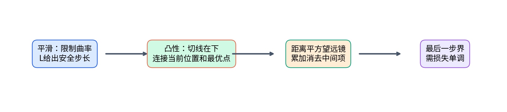
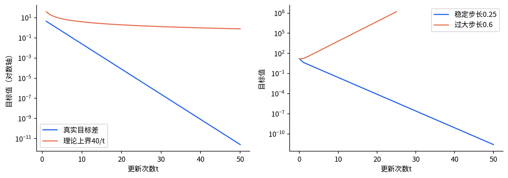
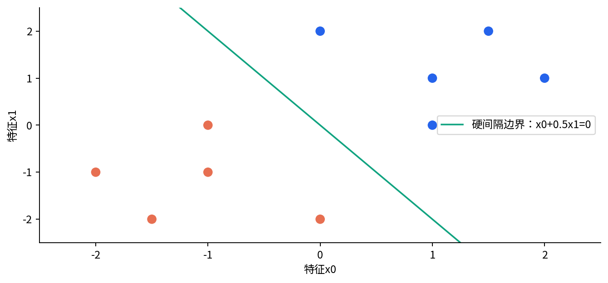
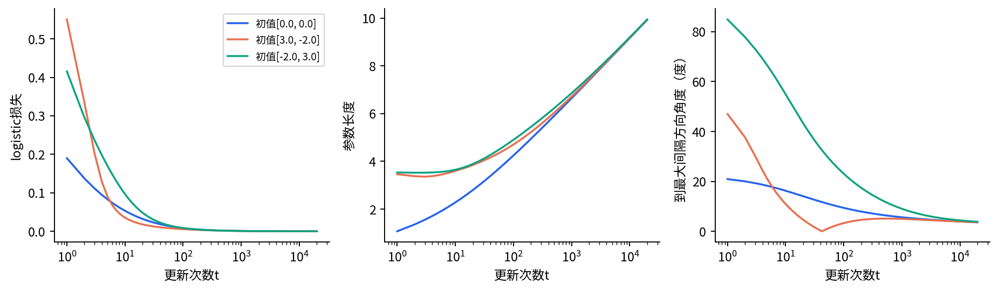
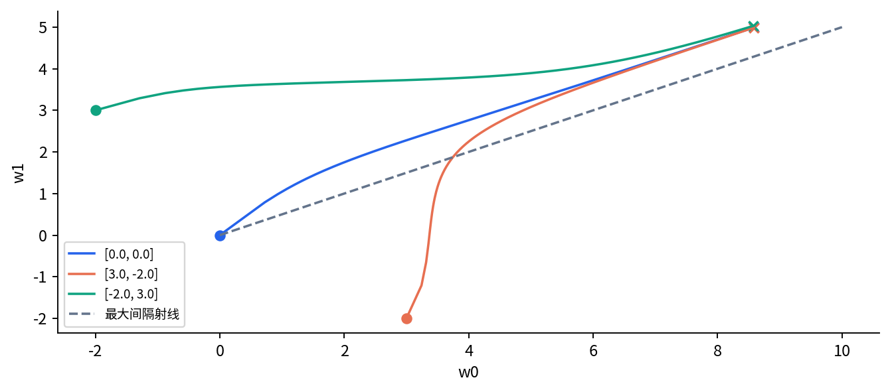

# DL073 优化收敛与隐式偏置

发行序号073对应原大纲 **T1**，原编号和先修关系保持不变。先修为[015](../015/README.md)、[032](../032/README.md)、[034](../034/README.md)、[038](../038/README.md)。下面仍从坐标、坡度和平均数开始，逐段搭出证明，不把“进阶”理解为跳过解释。

一台模型训练得越来越准，有两件事可能同时发生：损失下降，参数却越走越远。第一次遇到时，这很像程序出了错。其实“目标值趋近最小值”“参数趋近一个有限向量”“分类方向趋近某个方向”是三个不同问题。本讲先在有有限最优点的凸二次函数上证明下降界，再换到没有有限最优点的可分logistic问题，观察算法如何在许多分类解之间偏好一种方向。

学习目标：能指出一个收敛证明每一步用了什么条件；能手算安全与不安全步长；能解释分类错误率为零后为什么仍会训练；能把线性模型结论与有限宽深网的未解决问题分开。

## 1 从一个旋钮到一组参数

参数向量w就是把多个可调旋钮排成一列。例如w=(w₀,w₁)有两个旋钮，函数f(w)给每种设置一个损失值。向量长度用欧氏范数表示：把各坐标平方、相加、开平方，记作 $\|w\|=\sqrt{w_0^2+w_1^2}$。点积 $u^Tv=u_0v_0+u_1v_1$ 把两组坐标逐项相乘再相加；上标T表示把列转成行，目的是让乘法形状匹配，不是新的物理量。

一维导数回答“旋钮小动一点，损失大约变化多少”。多个旋钮对应梯度 $g=\nabla f(w)$，其中第j项就是只动第j个旋钮时的变化率。对足够小的改变量d，有 $f(w+d)\approx f(w)+g^Td$。选择d沿负梯度，局部的一阶变化便为负。梯度下降把这个直觉写成一条反复执行的规则：

$$w_{t+1}=w_t-\eta\nabla f(w_t).$$

注意：向量的坐标在代码里写w[0]、w[1]，下文数学中的w₀、w₁在二维坐标示例中表示坐标；带时间下标的w_t表示整个第t步向量。两种下标须按对象区分。t是已经执行的更新次数，初始向量也常记作w₀；eta是正步长，它决定走多远。负梯度给方向，eta给距离。知道下坡方向并不等于可以任意大步走，弯曲地形上跨得太远可能跳过谷底并登上另一侧。

我们的第一座“山谷”是 $f(w)=(w_0^2+4w_1^2)/2$。梯度是(w₀,4w₁)，第二个方向弯得更急。初值(4,2)的损失为16；若eta=1/4，一次更新到(3,0)，损失为4.5。这是后面全部符号的可手算锚点。

## 2 两个假设各负责什么

**凸性**说沿任意两点连线走，函数不会高于端点损失的线性插值。对可微函数，一个等价表达是切平面在函数下方：

$$f(v)\geq f(w)+\nabla f(w)^T(v-w).$$

它不是说函数必须长得像圆碗；平底、不同方向曲率不同的谷地也可能凸。它使当前位置的梯度与全局最优点连上关系。把v设成某个有限最优点w*，移项便有 $f(w)-f(w^*)\leq \nabla f(w)^T(w-w^*)$。

**L平滑**说梯度变化不会比参数变化快得无上限：$\|\nabla f(u)-\nabla f(v)\|\leq L\|u-v\|$。L是对曲率的全局上限。沿w到v的一条直线积分梯度，并用这个上限控制余项，可以得到下降引理：

$$f(v)\leq f(w)+\nabla f(w)^T(v-w)+\frac{L}{2}\|v-w\|^2.$$

这里最后一项是“一阶直线近似可能低估多少”的保险。我们的二次函数梯度为(w₀,4w₁)，所以可取L=4。矩阵语言写作f(w)=wᵀQw/2，Q是对角线为1、4的矩阵；最大特征值4就是最陡方向的曲率。特征值可先理解为沿某些特殊方向，矩阵只伸缩不转向时的伸缩倍数。

条件清单：本节证明针对可微、凸、全局L平滑的目标，假设有限最优点w*存在，使用精确全梯度且eta=1/L。删掉任何一项，都要重新检查证明；不能只保留最终公式。

## 3 把下降变成可累计的进展

把更新规则代入下降引理。改变量为负eta倍梯度，所以线性项为 $-\eta\|g_t\|^2$，曲率项为 $L\eta^2\|g_t\|^2/2$。二者合并，得到

$$f(w_{t+1})\leq f(w_t)-\eta(1-L\eta/2)\|g_t\|^2.$$

当eta=1/L时，右侧减少 $\|g_t\|^2/(2L)$，因此损失不增。单调不增只说每步方向对了，还没说要走多久。我们还要拿“离最优点的距离平方”作储蓄账本。展开更新后的平方：

$$\|w_{t+1}-w^*\|^2=\|w_t-w^*\|^2-2\eta g_t^T(w_t-w^*)+\eta^2\|g_t\|^2.$$

这只是(a-b)²的多维版本。把它移项，得到点积与平方梯度的组合，恰好能与前一式配对。凸性先把f(wₜ)-f(w*)换成点积上界，再用下降式，便得到

$$f(w_{t+1})-f(w^*)\leq\frac{\|w_t-w^*\|^2-\|w_{t+1}-w^*\|^2}{2\eta}.$$

请停下来对齐两边：左边是第t+1步的目标差，右边是从t到t+1减少的距离平方。这不是说距离本身等于损失，而是每次目标差都能由这本账支付。

把上式对t=0到T-1求和，中间的距离项一正一负抵消，叫望远镜求和。末尾距离平方非负，可以丢掉以获得更松的上界。再因目标差单调不增，最后一步不会超过这T项的平均：

$$f(w_T)-f(w^*)\leq\frac{1}{T}\sum_{t=0}^{T-1}[f(w_{t+1})-f(w^*)]\leq\frac{L\|w_0-w^*\|^2}{2T}.$$

这就是O(1/T)上界。“O”描述最多按某种速度缩小的数量级，隐藏固定常数；它不声称实际曲线恰好等于1/T。本例D²=4²+2²=20，所以界为40/T。T=1时真实差4.5，小于界40；T=10时界4，但实际早已更低。一个有效界允许保守。

## 4 让正确条件和失败条件同时出现

实验第一部分真实执行50步eta=0.25的梯度下降。每一步检查实测目标值是否小于40/t；最大“实测减上界”为负0.8，最末目标约为 $2.57\times10^{-12}$。第二部分预先固定eta=0.6，运行25步，最终损失约为 $1.62\times10^8$。这条失败轨迹也随包保存。

为什么会爆？第二坐标每次乘以 $1-4\eta$。eta=0.25时该因子为0，一步到该方向最优点；eta=0.6时因子为负1.4，符号交替而绝对值越来越大。对于这座二次谷，0<eta<2/L才能让最陡方向收缩。证明选1/L是方便稳妥的充分条件，不是宣称所有目标都只有这个可用步长。

“界没有被违背”不是实验重新证明了定理；有限50步只能检查实现与这个实例是否一致。定理给任意符合条件的T，程序只给实际算过的T。数值浮点还会引入舍入误差，因此测试使用合理容差，不要求代数恒等式逐比特成立。

## 5 随机梯度多了什么债务

全梯度使用全部样本。随机梯度gₜ通常只用随机小批次。如果给定过去历史时它满足条件无偏性 $\mathbb{E}[g_t\mid w_t]=\nabla f(w_t)$，那么平均方向是对的；若二阶矩还满足 $\mathbb{E}[\|g_t\|^2\mid w_t]\leq G^2$，便能控制随机步子的平方代价。期望符号E表示对随机抽样的所有可能结果取概率加权平均，不是保证每次运行都一样。

用同一个距离展开式，先对随机性取期望，再用凸性，常步长下得到平均迭代点的典型界：

$$\mathbb{E}[f(\bar w_T)]-f(w^*)\leq\frac{D^2}{2\eta T}+\frac{\eta G^2}{2},\qquad \bar w_T=\frac{1}{T}\sum_{t=0}^{T-1}w_t.$$

第一项随训练变长而下降，第二项是常步长噪声代价。eta太小进展慢，太大噪声项大；取eta=D/(G√T)可平衡两项，得到DG/√T。这里用了有界二阶矩等额外条件；必要时需限定可行域并使用投影。平均点的结论不能不经推导替换成最后一点，也不能把期望界写成每条随机轨迹的必然界。

本讲没有运行SGD实验，这一节是条件化推导补充。真实深网中梯度可能有偏、批次有关联，曲率与噪声还会随参数改变。说“SGD通常有效”与写出一个适用定理是两种不同证据。

## 6 损失没有有限最小点时，训练还在追什么

现在切换到二分类。每条样本x是二维特征，标签y取正1或负1。模型分数为wᵀx，符号给类别。带符号分数 $m_i=y_iw^Tx_i$ 叫函数间隔：正数表示分类正确，越大通常越有把握。logistic平均损失为

$$\ell(w)=\frac{1}{n}\sum_{i=1}^n\log(1+\exp(-y_iw^Tx_i)).$$

若某个方向把所有样本分对，而且所有间隔严格为正，数据叫线性可分。沿这个方向把w放大c倍，所有间隔同时放大，损失不断接近0；但有限参数下每一项都严格为正。损失的下确界是0，通常没有有限w能达到它。于是第3节需要的有限w*不存在，不能把其参数收敛账本直接搬过来。

导数可以逐层拆开：令m=ywᵀx，外层log(1+exp(-m))对m的导数是负1/(1+exp(m))，m对w的导数是yx。相乘再平均得

$$\nabla\ell(w)=-\frac{1}{n}\sum_i\frac{y_ix_i}{1+\exp(y_iw^Tx_i)}.$$

分得很有把握的样本分母大，贡献小；靠边界的样本贡献较大。随着训练继续，靠边界的点逐渐支配方向变化。这是理解最大间隔方向的动态心智模型，不是完整渐近证明。

代码用logaddexp计算log(1+exp(·))，用稳定expit计算sigmoid，避免大指数溢出。数值稳定只保证公式实现可靠，不会把无限大的最优范数变成有限值。

## 7 最大间隔从两条约束手算出来

分类边界不因w整体乘正数而改变，因此要讨论方向，不能拿可任意放大的函数间隔作比较。几何间隔把它除以参数长度：$\gamma(w)=\min_i y_iw^Tx_i/\|w\|$。它等于样本到过原点分界线的最小带符号距离。

硬间隔问题固定函数间隔至少为1，再最小化长度：$\min_w\|w\|^2/2$，条件是每个 $y_iw^Tx_i\geq1$。本例正类含(1,0)、(0,2)、(1,1)、(2,1)、(1.5,2)，负类是它们的镜像。前两个样本要求w₀≥1、w₁≥0.5，所以任何可行向量长度至少√1.25。w=(1,0.5)也满足剩余条件，因此它就是最小长度解；最大几何间隔为1/√1.25≈0.894427。这里不依赖优化器求近似参考。

在线性可分、齐次线性预测器、无显式正则的logistic损失以及合适步长等条件下，已有研究证明梯度下降方向趋近硬间隔方向。[Soudry等，2018](https://jmlr.org/papers/v19/18-188.html) 本课只陈述这个有条件结果并复现实例，没有证明论文全部渐近结论，更没有把它推广到任意深网、Adam或加入偏置后的其他参数化。

## 8 训练误差为零以后，方向仍很慢地改变

实验计算全局平滑上界 $L=\lambda_{\max}(X^TX/n)/4\approx0.759423$，固定eta=1/L≈1.316789。矩阵X的每一行是一条输入；XᵀX/n描述输入的二阶尺度；logistic的标量二阶导数不超过1/4，因而得到这个保守曲率上界。

三种初值分别为(0,0)、(3,-2)、(-2,3)，每种训练20,000次。不加L2惩罚，不截断范数，不用验证集挑停止点。零向量没有方向，数据文件把t=0的角度和几何间隔存为NaN，图从t=1画起；NaN在这里表示未定义，不是训练错误。

| 初值 | 第10步角度 | 第20000步角度 | 最终参数长度 | 最终几何间隔 |
|---|---:|---:|---:|---:|
| (0,0) | 16.246° | 3.619° | 9.928 | 0.86442 |
| (3,-2) | 10.929° | 3.594° | 9.932 | 0.86463 |
| (-2,3) | 54.884° | 3.831° | 9.945 | 0.86255 |

三次最终分类错误率都为0，损失约4.6至4.7乘10的负5次方，但离理论方向仍有约3.6度。方向与范数的变化不能用“准确率已不变”概括；更低logistic损失也不能自动解释为对未知测试分布更好。

## 9 初学者常问的四个问题

**没有显式正则化，为什么还有偏好？** 目标可能允许很多预测器或趋近极限的路径。参数化、初值、更新方向与步长共同规定了搜索过程，它们会优先到达某些解。这种由训练过程引入的选解倾向叫隐式偏置，未必总能改善实际泛化。

**范数一直增加是不是过拟合？** 范数增长首先是本目标的几何性质。是否过拟合要看独立测试风险怎样变；本课没有随机现实测试数据，所以不能只凭范数作结论。

**把特征单位改了会怎样？** 将某列从米变成厘米，会改变欧氏几何与梯度尺度。最大间隔依赖所用坐标中的长度定义。数据标准化也可能改变隐式偏置，不是完全中性的外观整理。

**深网也有损失下降，所以能照搬这个定理吗？** 一般有限宽网络对参数不凸；有ReLU时还涉及不可微点；对称性、多个层之间的缩放和参数空间路径更复杂。深网中有特定假设下的理论，但必须重新写清网络、宽度、初始化、损失和步长。本讲不能提供一个包办深网训练的结论。

## 10 用一个可反驳的陈述结束实验

合格的报告可以写：“对本课固定10点齐次可分线性数据，三种预定初值的20,000步全梯度下降，方向角相对第10步均下降，最终仍非零；对给定凸二次目标，前50步都满足所推上界。”它同时给出范围、预算、比较点与局限。

不合格的报告是“证明所有神经网络会找到最好泛化解”。本实验既没有深网，也没有测试分布，更没有证明所有算法选择相同方向。配套实验要求你改坏一个条件，先写预测，再运行并解释失败发生在证明的哪一行。

教材级凸优化和SGD背景可参照[Understanding Machine Learning，第12–14章](https://www.cs.huji.ac.il/~shais/UnderstandingMachineLearning/understanding-machine-learning-theory-algorithms.pdf)。本讲推导、图、数据和代码为原创教学材料，外部资料仅链接，不随仓库分发。
