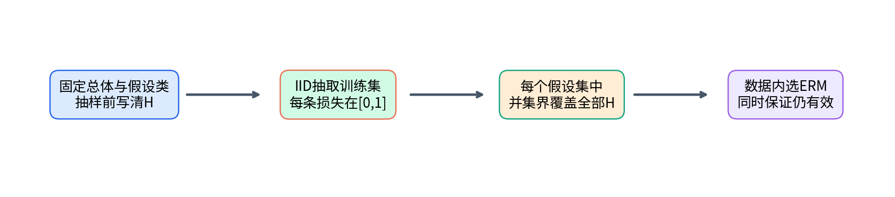
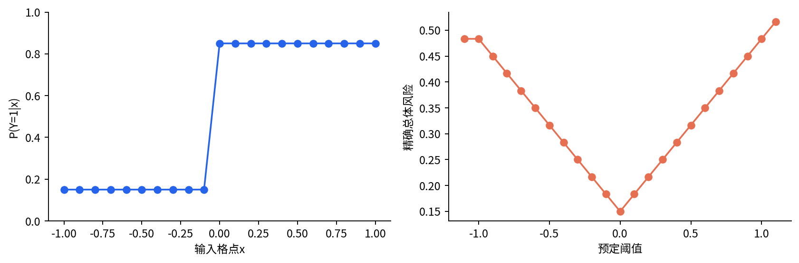
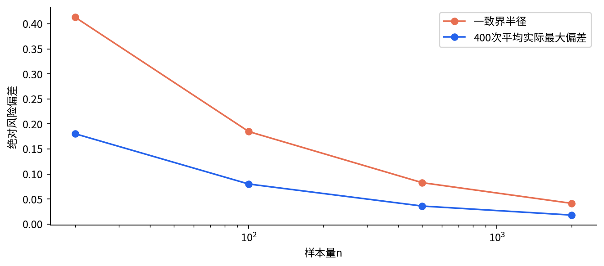
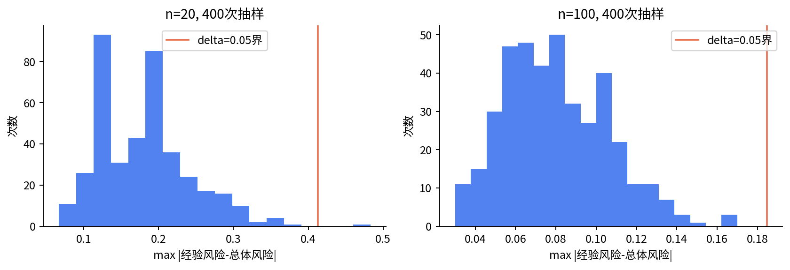
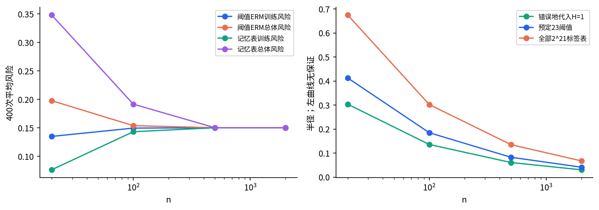

# DL074 统计学习与泛化界

发行序号074对应原大纲 **T2**。先修为[018](../018/README.md)、[020](../020/README.md)、[022](../022/README.md)、[038](../038/README.md)；本讲从重复抽样、0/1损失和有限列表重新建立语言，不默认已经熟悉概率证明。原catalog编号和依赖保持不变。

假设你准备了23条分类规则，拿100条样本比较，挑出错得最少的一条。被选中的训练错误率很低，这给未来表现多少保证？这里有一个容易忽略的区别：在看数据之前写定的一条规则，与看完同一批数据后从许多规则中选出的赢家，并不是同一个统计问题。本讲把选择过程算进界里，再亲手测量这个保证到底有多保守。

目标：推导有限预定假设类的双侧一致收敛界；解释样本量、候选数和失败概率的作用；用完整已知总体计算真实风险；识别数据依赖选择何时超出了证明覆盖的集合。

## 1 先把一个错误拆成四个对象

输入X表示一次待分类对象的特征，标签Y表示正确答案。大写表示还没抽到的随机量，小写xᵢ、yᵢ表示实际第i条观察。预测规则h把输入映射为类别0或1。0/1损失写成 $\ell(h(x),y)=\mathbf{1}\{h(x)\ne y\}$，大括号内条件成立时指示量为1，否则为0。因此一次损失不是“概率”，而是一次是否犯错的记录。

总体风险 $R(h)=\mathbb{E}[\ell(h(X),Y)]$ 是对数据来源的所有可能样本取平均；它是未来同来源错误率的理想对象。训练经验风险为

$$\widehat R_S(h)=\frac{1}{n}\sum_{i=1}^n\ell(h(x_i),y_i).$$

S代表本次训练样本集合，n是条数。固定h以后，R(h)是由总体决定的常数，经验风险会随抽到的S变化。即使同一规则没有任何训练，换一批样本，经验风险也会不同；泛化差不只来自“模型太复杂”，还包含普通抽样波动。

假设类H是抽样前允许选择的规则集合。大小M=|H|表示候选数；本课使用23个预定阈值候选，其中两个在离散输入域上给出完全相同函数，实际不同预测函数有22个。用23作并集计数是有效的保守上界，不把重复候选误称为不同函数。

## 2 什么叫独立同分布，为什么证明需要它

独立指一条样本的随机结果不会改变另一条的条件分布；同分布指各条来自同一个总体规律。我们写S由P独立同分布抽取，简称IID。明天的风险也按同一P定义。重复病人、同一视频拆成许多相邻帧或随时间改变的来源，通常不自动满足这个假设。

实验总体刻意简单：输入从-1到1的21个等间隔格点中等概率选择。x<0时Y为1的概率是0.15，x≥0时概率是0.85。标签每次独立抽取，同一个x可以出现相反标签。这种噪声提醒我们：即使规则完全符合主要规律，也不可能把总体风险降到0。

阈值规则为 $h_a(x)=\mathbf{1}\{x\geq a\}$，预先把a从-1.1到1.1取23个等间隔值。它们不是从本次训练样本的最优位置重新生成的。输入格点、条件概率、候选表与随机种子都随包提供，没有外部下载或真实业务字段。

对任意规则，我们能直接计算总体风险：若在某格点预测1，错率为1-p；预测0，错率为p，再对21点平均。这是**精确总体求和**，不是用一个很大的测试集假装真值。实际应用常不知道P，本课知道它是因为我们自己定义了合成世界。

## 3 从一个固定规则的波动开始

对一个抽样前固定的h，把第i条0/1损失叫Zᵢ。它们独立、处于[0,1]，期望为R(h)。Hoeffding不等式给出

$$\Pr\{|\widehat R_S(h)-R(h)|>\epsilon\}\leq2\exp(-2n\epsilon^2).$$

左边问：“重复抽n条样本，有多大比例的样本集合会使经验风险偏离真实风险超过epsilon？”不是问给定这批已经观察到的数据以后，R(h)这个固定数有多少后验概率落在区间内。Pr表示概率，epsilon是允许偏差，指数exp用自然底数e。

为什么会出现n乘epsilon平方？独立平均让正负误差抵消，大偏差需要许多随机损失同时朝一侧偏。更精确地，可用指数放大坏事件，再以期望约束它。若s>0，Markov不等式给出

$$\Pr\{\sum_i(Z_i-\mathbb{E} Z_i)\geq n\epsilon\}\leq e^{-sn\epsilon}\prod_i\mathbb{E}[e^{s(Z_i-\mathbb{E} Z_i)}].$$

乘积来自独立性。对[0,1]内变量，Hoeffding引理把每个因子限制在exp(s²/8)以内。于是右边不超过exp(-sn epsilon+ns²/8)。把s选为4epsilon，指数变为-2n epsilon²。负向偏差对-Zᵢ重复同样论证，再把两个尾部概率相加，得到前面的2。

这里将Hoeffding引理作为有界随机量的基础引理使用，而不是声称一页内证明了全部概率工具。它可由指数函数的凸性把区间内部的值控制到端点混合，再对数化后限制二阶导数得到。理解作用比背术语更重要：没有有界性或替代尾部条件，exp(s²/8)这一步就没有依据。

## 4 为什么选了赢家以后，单条规则的界不够

设23条规则都各有小概率幸运地低估真实风险。挑训练错误最少的规则，会更容易挑到其中幸运的一条。即使每条规则单独“多数时候可靠”，至少一条不可靠的概率会随选择范围增大。我们要控制的事件改成：存在某个h∈H，其偏差超过epsilon。

并集界说任意事件的并发生概率至多是各概率之和；不要求不同规则的错误事件相互独立。把M条规则的Hoeffding上界相加得

$$\Pr\{\max_{h\in H}|\widehat R_S(h)-R(h)|>\epsilon\}\leq2M\exp(-2n\epsilon^2).$$

令右侧等于允许失败概率delta，取自然对数并移项：log(2M)-2n epsilon²=log(delta)。解出半径

$$\epsilon(n,M,\delta)=\sqrt{\frac{\log(2M/\delta)}{2n}}.$$

因此至少以1-delta的抽样概率，同一个样本集合上**全部**候选的经验风险与总体风险都在这个半径内。这叫一致收敛：同一个好事件同时覆盖整张候选清单，所以在清单里按经验风险选赢家也仍被覆盖。

保证的对象是“抽到一个对所有预定候选都可靠的样本集合”。它不是每个候选分别抽一份数据，也不是对一个任意数据依赖新模型都套M=1。

## 5 从一致偏差推到ERM的超额风险

ERM是经验风险最小化的英文简称：在H里选训练错误最小的规则，记作h帽。另设h*是在同一个H里总体风险最小的规则。h*对学习者未知；合成实验可以算出它，但选择时仍只能使用训练经验风险。

在一致好事件上，先把选中规则的总体风险换成经验风险加epsilon，再利用h帽的最小性，最后把h*的经验风险换回总体风险加epsilon：

$$R(\hat h)\leq\widehat R_S(\hat h)+\epsilon\leq\widehat R_S(h^*)+\epsilon\leq R(h^*)+2\epsilon.$$

所以超额风险最多2epsilon。两份epsilon来自不同规则的经验与总体转换，不能因为“不喜欢太松”就删掉一个。这个比较只针对H内最优规则；若真实规律根本不在H附近，还会有模型类表达不足的代价。

本例最好阈值遵循x≥0预测1，总体错误率0.15。即使无限数据，独立标签噪声仍使这条规则错15%。经验风险最小不意味着训练误差总为0；当n很小时，训练误差低于0.15也不神奇，它可能只是抽样和选择的共同产物。

## 6 手算一次保证，判断它究竟说了什么

取M=23、delta=0.05、n=100，有2M/delta=920，log920≈6.82437，因此epsilon=√(6.82437/200)≈0.184721。若某次ERM训练风险为0.12，一致事件上总体风险不超过0.304721，下界则为max(0,0.12-0.184721)=0。

为什么下界要截到0，上界可截到1？因为风险本来就在[0,1]；这是结合已知范围改进展示，不是重新证明了更紧的统计半径。我们在结果文件保留原始半径，即使它大于1也不悄悄改掉，方便读者看清界的宽松程度。

若要求epsilon≤0.05，需 $n\geq\log(2M/\delta)/(2\times0.05^2)$，本例向上取整为1365。这是足够样本量，不是实际达到某准确率的最小样本量。M扩大10倍时只把log项增加log10；delta缩小10倍也增加log10。它们对半径的作用是对数级，而n放在分母并经开平方。

## 7 把保证与400次真实抽样放在一起

实验固定四种n：20、100、500、2000，每种各抽400份训练样本。每份都计算所有候选经验风险、最大绝对偏差、ERM索引及其精确总体风险。所有重复保留在outputs/trials.npz，汇总只取预定平均，没有删除异常抽样。

| n | 一致半径 | 平均最大偏差 | ERM平均训练风险 | ERM平均总体风险 | 超界次数/400 |
|---:|---:|---:|---:|---:|---:|
| 20 | 0.41305 | 0.18029 | 0.13475 | 0.19758 | 1 |
| 100 | 0.18472 | 0.07989 | 0.14935 | 0.15367 | 0 |
| 500 | 0.08261 | 0.03589 | 0.15000 | 0.15000 | 0 |
| 2000 | 0.04130 | 0.01785 | 0.15008 | 0.15000 | 0 |

n=20时有一次超出epsilon，这是delta=0.05允许失败概率的框架中完全可能的结果，不应因“定理不准”而删去。0次超界也不能推出真实超界概率为0。400次是对重复抽样的有限观察，定理的概率界并不需要每400次都恰好少于20次失败。

随着n增加，平均最大偏差大体缩小，ERM总体风险靠近0.15。不能从这张表反向声称每个问题都只需500样本：这里仅21个输入格点、极简单阈值类和固定噪声，现实高维任务与漂移不在这个实验范围。

## 8 数据依赖选择：问题在哪里，怎样修复

在训练样本里为每个格点多数表决，未见格点默认预测0，得到一张记忆表。训练完毕后只留下这一张表，再说“我的H里只有它，所以M=1”，是常见错误：表本身由同一批标签选择，固定h的集中步骤已经失去前提。

可以怎样修复？一种办法在抽样前把21个格点上全部二进制标签表都列作候选，大小为2²¹。无论训练得到哪张表，它都包含在这个固定集合内，于是原证明可用，只是半径更大。n=20时该半径约0.67537，明显宽于23阈值的0.41305。一个更大的可选择世界需要付出更大保证代价。

另一办法用独立数据评价最终确定的表。条件于全部训练过程，最终规则对于新评价集已经固定，可以用单规则界控制独立评价误差。若再拿这份评价集反复挑模型，它便不再只是一次独立最终评价；须把选择步骤纳入新的分析。

本实验n=20时，记忆表平均训练风险0.07613，低于阈值ERM的0.13475，但总体风险0.34817，高于阈值ERM的0.19758。更会记住有限样本并不等于更接近主要规律。n很大时记忆表也可以学准每个格点的多数类别，本课并不把“记忆”当永久失败的标签。

## 9 上界很松，并不等于理论没有用途

该界用最坏范围[0,1]，没有利用23候选之间相似性、局部噪声结构或哪一条规则最终被选中。并集相加又可能重复覆盖同一坏事件。因此它通常保守，这不构成计算错误。它依然清楚显示样本量、选择规模与失败概率之间的关系，并让不合法的后见选择无处藏身。

函数类复杂度不总是简单数候选。无限阈值类无法直接代入无限M；可以考虑样本上能产生多少不同标签模式，进一步发展VC维或Rademacher复杂度等工具。数据依赖界也不是禁词：它们可以利用观察到的复杂度，但必须用专门证明解释为何数据使用仍受控，不能仅仅把事后挑出的集合叫固定集合。

深网权重连续，理论上有无限多参数取值；实际浮点格式有限，也不意味着枚举所有比特字符串就会得到有用保证。参数计数、范数、边际、稳定性和先验结构会进入不同分析。某个松界不能预测实际分数，也不能凭它大于1就断言所有理论都无用。

## 10 读论文时先找保证所处的层次

一份理论陈述应回答：随机性来自训练样本、初始化还是测试抽样？损失是否有界？候选类是否预定？结论控制一个规则、全部规则、算法平均行为还是特定数据依赖过程？概率是期望、至少1-delta的事件，还是某种后验概率？这些问题决定公式是否能放到你的研究里。

本讲可交付结论为：“在固定离散总体、IID抽样与预定23阈值候选下，我们推导并逐次检查了有限类一致界；400次有限重复表现保守，同时保留一次超界。记忆表若事后按M=1处理，未被同一证明覆盖。”这句话比“理论与实验一致，因此模型可靠”给出了更多可审查信息。

有限类一致收敛的原理背景参见[Understanding Machine Learning，第4章](https://www.cs.huji.ac.il/~shais/UnderstandingMachineLearning/understanding-machine-learning-theory-algorithms.pdf)。集中不等式的原始出处为Hoeffding（1963）；随附sources.md记录已核对的书目信息与链接。正文推导、实验数据和图均为原创教学组织，没有复制外部教材图。

## 11 再做一个两规则世界：亲眼看见赢家偏差

为了把抽象的M变成可数事件，暂时另造一个极小数学示例。输入没有信息，Y以一半概率取0或1；只有两条候选h₀恒预测0、h₁恒预测1。两者真实风险都为1/2。只抽n=2条样本，四种等概率标签序列是00、01、10、11。

序列00时，ERM选h₀，训练风险0；11时选h₁，训练风险0；01或10时两规则训练风险都为1/2，按事先约定选择h₀。因此赢家的平均训练风险为(0+1/2+1/2+0)/4=1/4，而赢家无论选谁，真实风险始终1/2。平均训练乐观偏差为1/4，完全由抽样后选择造成，并没有使用复杂神经网络。

若在抽样前就固定只用h₀，它的四种经验风险是0、1/2、1/2、1，平均恰好1/2。把两份列表并排，会看到选择过程把训练错误大的候选排掉，留下的训练误差分布被向下拉。这就是为什么“我最后只用了一个模型”不能消除之前比较多个模型的代价。

同一例子还能帮助区分有偏估计与每次必然低估。赢家平均训练误差较低，并不意味着任意数据生成问题的每次赢家训练误差都低于真实风险。界提供的是对整个抽样事件的控制，不把平均倾向误写成逐次排序规律。

## 12 把一条定理翻译成实验审查表

假设实际研究中试了不同网络深度、不同随机种子、不同训练轮数和多个预处理版本。若这些选择全部根据同一个验证集，验证集已经参与选择。某个固定有限列表可以用并集思路作保守处理，但要在选择前定义列表；若不断看结果再生成新候选，简单的固定M计数未必描述了完整流程。

训练算法本身依赖训练样本并不是一致收敛分析禁止的事。关键是所有可能输出是否落在抽样前界定的H里。H可以很大，甚至后续用更精细复杂度控制；错误发生在只保留数据已经替你筛选出来的很小部分，却假装这一小部分早就固定。

一个实用做法是给数据角色分配明确名字：训练集用于拟合参数，验证集用于预定选择过程，最终测试集在模型和分析规则冻结后只用来评价。这样并不自动解决现实漂移，但会减少同一证据被反复使用的问题。若研究需要反复查看测试结果，就应坦承它已变成开发数据，并重新取得独立评价或采用适用的自适应分析方法。

“有95%保证”还需要写全事件：对从同一总体IID抽取的n条训练样本，以至少95%的概率，预定类所有规则的经验与总体风险差不超过epsilon。少写其中任何一段，读者都可能误以为是单条预测正确率、部署安全率或分布外风险保证。把定理完整翻译成一句中文，是本讲与计算半径同样重要的学习成果。
