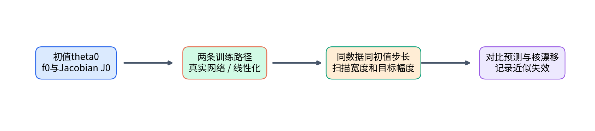
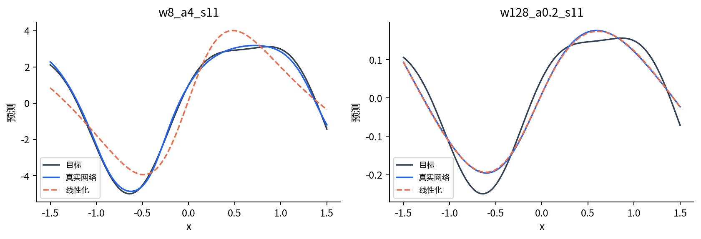
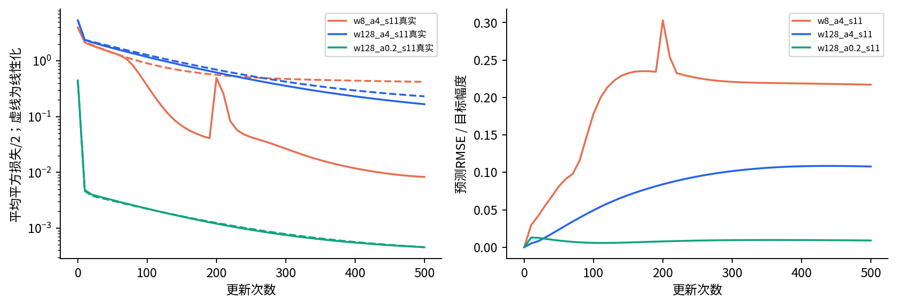
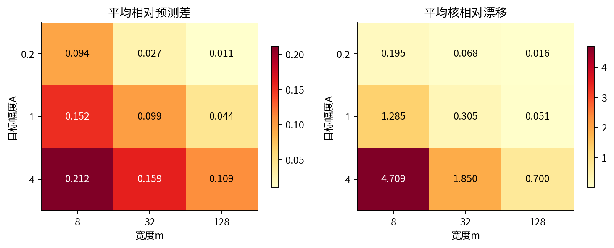
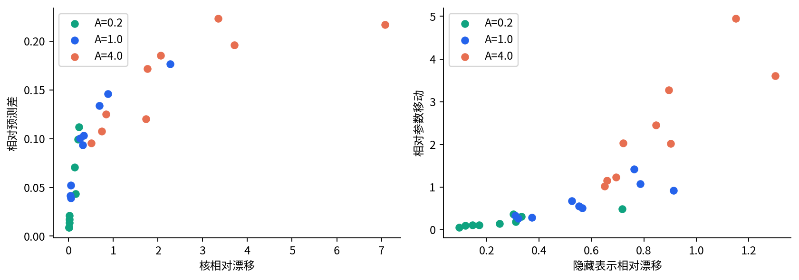

# DL075 宽网络核视角与特征学习

发行序号075对应原大纲 **T3**。先修为[013](../013/README.md)、[015](../015/README.md)、[027](../027/README.md)、[038](../038/README.md)，原catalog编号和依赖不变。我们仍从“一个参数小动一点，输出怎样变化”出发，再建立Jacobian、核与宽度极限的语言，不默认读者已经熟悉这些词。

有时神经网络可以被一个更简单的模型准确模仿：先在初始化处测出每个参数对输出的影响，以后把这些影响固定，只学习它们的线性组合。这个替代模型仍可能对输入画出很弯的曲线，却对参数增量是线性的。它为什么有用，什么时候会失效？本讲用同一初值、同一数据和同一步长，同时训练真实网络与这个替代模型，再扫描宽度和目标幅度。

学习目标：能写出一阶参数线性化与NTK的有限矩阵形式；能区别输入非线性与参数线性；能用真实轨迹、核漂移和表示变化判断近似；能解释有限宽实验为何不能直接证明无限宽定理。

## 1 从一次轻推开始理解线性化

一维函数在点theta₀附近，可以用切线近似：f(theta₀+d)≈f(theta₀)+f′(theta₀)d。导数只在起点测一次，后续让d变化而斜率保持不动。真实曲线弯起来以后，切线就可能逐渐偏离；局部近似的“局部”指改变量足够小，不是说函数本来就线性。

网络有很多参数，把它们排成向量theta。一个输入x的输出为f_theta(x)，其参数梯度包含每个旋钮的局部影响。初值theta₀处的一阶参数线性化定义为

$$f_{\rm lin}(x;d)=f_{\theta_0}(x)+\nabla_\theta f_{\theta_0}(x)^T d,\qquad d=\theta-\theta_0.$$

我们会把d当作一个独立可训练向量。这里的theta只是解释增量的记号，线性化模型的d并不被强制等于真实网络训练时的参数变化；两条路径分别更新，它们会逐渐分开。

“对参数线性”不等于“对输入是一条直线”。例如固定函数sin(x)与cos(x)，模型d₁sin(x)+d₂cos(x)对d线性，对x却是弯曲的。同样，初始化处的梯度特征可以是复杂的输入函数；冻结它们仍能拟合非线性关系。

## 2 一张表把所有局部影响排整齐

设训练样本有n条、参数有p个。把第i个样本输出对第j个参数的偏导放在第i行第j列，得到n×p的Jacobian矩阵J。行对应样本，列对应参数旋钮；它告诉我们“哪一次参数改动会共同影响哪些样本”。

如果n=2、p=2，且J的两行分别为(1,0)与(1,2)。改变量d=(0.1,-0.2)，两条输出近似变化分别为0.1和0.1-0.4=-0.3。这个例子不需要掌握抽象矩阵论，只需逐行点积。

初始化处的J叫J₀。线性化模型在训练集上的输出向量为 $f_{\rm lin}=f_0+J_0d$，形状依次是n维、n×p乘p维，最终仍是n维。

## 3 核是样本之间通过参数相遇的方式

两个输入的参数梯度做点积，得到有限网络的神经切线核：

$$K_\theta(x,x')=\nabla_\theta f_\theta(x)^T\nabla_\theta f_\theta(x').$$

直觉上，若两条样本依赖相似参数方向，改善一条时往往也会影响另一条；点积刻画这种局部耦合。这里不把K当概率，数值不必落在[0,1]，非对角项也可能为负。它是关于“参数怎样共同改变输出”的相似性度量。

对全部训练点成对计算得到Gram矩阵K=JJᵀ，形状n×n。前面两行梯度(1,0)、(1,2)给出K两行(1,1)、(1,5)。对任意n维向量v，

$$v^TKv=v^TJJ^Tv=\|J^Tv\|^2\geq0.$$

这种所有二次型非负的性质叫半正定。它意味着所有特征值非负，允许某些方向的特征值为0；半正定不等于严格正定。若某些样本的梯度行重复，Gram可能没有满秩。实验用小容差判断，因为浮点运算可能给出接近0的微小负数。

核方法可以不用显式更新p个参数，而直接通过n×n矩阵更新输出。但这是一种计算和分析视角，不保证更省内存：n非常大时，存n²项反而昂贵。本课n=24，矩阵很小，所以每一步都能检查。

## 4 从平方损失推到固定核动力学

目标为平均平方损失的一半：$L=\|f-y\|^2/(2n)$。f是训练输出向量，y是真值，残差r=f-y。“一半”用于抵消平方求导的2；“平均”除n，使样本量变化时梯度尺度可比较。

对线性化模型，参数梯度为 $\nabla_d L=J_0^T(f_{\rm lin}-y)/n$。梯度下降一步是d新=d旧-eta J₀ᵀr/n。把它再乘J₀带回输出，得到精确递推：

$$f_{{\rm lin},t+1}=f_{{\rm lin},t}-\frac{\eta}{n} K_0(f_{{\rm lin},t}-y),\qquad K_0=J_0J_0^T.$$

这里对线性化模型是**精确等式**，不是再次近似。真正的非线性网络每次更新后J会改变，而且有限步的输出变化还带有高阶余项；直接写f新=f旧-eta K_t r/n只能作为一阶近似。连续时间梯度流中则可由链式法则得到相应微分等式，不能把连续时间等式无缝换成任意有限步长的离散等式。

如果r沿K₀/n的一个特征向量方向，该分量每步乘以1-eta lambda。只要0<eta<2/lambda_max，所有正特征值方向都收缩；零特征值方向不被这个核学到。大特征值方向通常更快，小特征值方向更慢，这也解释为何固定预算下仍会有残差。

## 5 选择一个能完整手写的真实网络

本课使用一层隐藏单元的tanh网络，宽度m是隐藏单元个数。输入x与输出都是标量：

$$f_\theta(x)=\frac{1}{\sqrt{m}}\sum_{j=1}^m a_j\tanh(w_jx+b_j).$$

a是输出权重，w是输入权重，b是隐藏偏置。theta按[a的m项、w的m项、b的m项]排列，共3m项。tanh把实数平滑压到-1至1之间，导数为1-tanh²。所有a、w、b都训练，不是只训练最后一层。

初始化a和w独立取标准正态，b取标准差0.3的正态。标准正态是均值0、标准差1的钟形分布；随机种子固定为11、23、37。系数1/√m防止许多随机项相加后的典型输出尺度随m随意膨胀。换成1/m或去掉缩放，就改变了参数化与梯度尺度，不能继续假设相同步长与宽度结论。

令hⱼ=tanh(wⱼx+bⱼ)，逐项应用链式法则：

$$\frac{\partial f}{\partial a_j}=\frac{h_j}{\sqrt{m}},\qquad \frac{\partial f}{\partial w_j}=\frac{a_j(1-h_j^2)x}{\sqrt{m}},\qquad \frac{\partial f}{\partial b_j}=\frac{a_j(1-h_j^2)}{\sqrt{m}}.$$

从右往左看，改变w先改变w x+b，再通过tanh改变h，最后乘a并汇入输出。这三组偏导沿参数列拼起来，就是代码forward_jacobian返回的J。有限差分测试逐坐标轻推参数，独立验证这些导数，不调用PyTorch自动求导来掩盖推导过程。

## 6 宽度与训练幅度需要同时检查

数据由 $g(x)=\sin(2.4x)+0.25\cos(5x)$ 原创生成。24个训练x均匀放在[-1.5,1.5]，另有151点插值网格。目标设为A g(x)，宽度m取8、32、128，幅度A取0.2、1、4，配三种初始化，共27个预定配置。

这里A是目标振幅，**不等于参数移动大小**。初始化输出f₀一般不为0，所以A变小不一定使每个初值的目标残差变小。我们不拿“幅度小”代替真正测量，而同时记录相对参数移动、隐藏表示漂移、核漂移和预测差。目标幅度只是受控干预变量。

每个配置执行500次全批更新。步长固定为eta=0.3/lambda_max(K₀/n)，同一配置的真实网络和线性化网络共用。它满足固定核的稳定条件；真实网络的核会变，所以不提供全程非线性稳定保证。不同宽度使用各自初始谱尺度，是控制初始梯度尺度的约定，不是所有配置都用了同一个绝对eta。

每个配置保留完整初始化、最终真实参数、线性增量与每10步轨迹。实验输出NPZ中的每个网格预测都能从保存参数重新计算。训练点与插值网格均固定无噪声，本实验不是IID泛化估计，也没有测试区间外外推。

## 7 一个“近似好不好”需要哪些尺子

预测差取151点网格上的真实与线性化输出RMSE，再除以A，便于不同目标幅度比较。RMSE是先平方误差、取平均、再开方，因此单位与输出相同。除A后无量纲，但A很小时相同绝对差会放大，所以保留原始两组预测；绝对预测差可由相对差乘A或两组数组重算，不能只挑有利尺度。

核相对漂移定义为 $\|K_t-K_0\|_F/\|K_0\|_F$。下标F是Frobenius范数：矩阵各元素平方、相加、开根号。它量化训练点上的耦合关系改变多少，未直接说明未见输入上的核是否也稳定。

隐藏表示H由每条样本每个隐藏单元的激活组成，形状n×m。表示相对漂移为 $\|H_t-H_0\|_F/\|H_0\|_F$。参数相对移动为 $\|\theta_t-\theta_0\|/\|\theta_0\|$。这三把尺子不同：参数变动不一定同样影响输出，表示变化不一定同样影响Gram，核变化也不必单调对应预测差。

这里所有分母都由实际初始化决定且在实验中非零。若另换初始化使某分母为零，必须定义替代尺度或标成未定义，不能随意除以一个极小常数再宣称数值可靠。

## 8 真实扫描结果支持到哪里

下表每格是预定三种种子的平均相对预测差，不是选择最好一次。行改变目标幅度，列改变宽度：

| A | m=8 | m=32 | m=128 |
|---:|---:|---:|---:|
| 0.2 | 0.09410 | 0.02721 | 0.01061 |
| 1 | 0.15215 | 0.09912 | 0.04428 |
| 4 | 0.21214 | 0.15932 | 0.10944 |

在这个预定扫描里，宽度增加时三种幅度的平均预测差都下降，但没有降到严格零。A=4时m=128仍有约0.10944的相对预测差。不能只展示m=128、A=0.2的小差异，便宣布所有网络都等于核方法。

核平均相对漂移在A=0.2行依次为0.19455、0.06778、0.01618；A=4行依次为4.70939、1.85049、0.70015。值大于1不违背定义：它表示变化的矩阵长度超过初始矩阵长度。A=4、m=8的真实训练损失均值约0.01992，线性化约0.42684，说明在此配置中改变特征与非线性路径确实带来不同拟合行为；这不自动等于现实泛化提升。

三次初始化太少，无法精确描述所有随机初始化分布；同一宽度内幅度比较使用相同初值，是配对控制；不同宽度虽用相同种子标签，但参数维数不同，不是相同网络的简单扩展。本讲不为这个小型扫描计算“总体显著性”来制造过强外推。

## 9 什么叫特征学习，不能从哪里偷换结论

固定核模型的“特征”是初始化处的参数梯度函数，它可以非常丰富，但训练时不改变。真实网络的隐藏表示和Jacobian会随参数更新而改变，模型可能调整如何表示输入，这通常被称为特征学习。

本课确实测得H和K的变化，也测得真实与线性化路径不同。它支持“固定初始化特征不足以精确描述本次全过程”的机制结论。但仅见核漂移还不能证明模型学到了有语义、可迁移或更公平的特征；要证明这些主张，需要额外任务、对照与独立评价。

更进一步，可以冻结隐藏层只训练a，与完整网络和J₀线性化形成三方比较。不过“只训a”的随机特征核只含对a的导数，与训练全部参数的NTK不同。这个扩展在本发行实验中未运行，不能把两种固定特征模型混写成一个。

## 10 无限宽是带条件的极限，不是形容词

Jacot等提出NTK视角，在特定网络、参数化、初始化与宽度极限条件下研究训练中的核与收敛。[原论文](https://arxiv.org/abs/1806.07572) Lee等进一步研究参数一阶线性化如何描述宽网络的训练动力学。[原论文](https://arxiv.org/abs/1902.06720) 这些工作给出分析入口，并不意味着只要日常语言称网络“大”，所有真实训练便自动处在相同极限。

至少需要问：哪个宽度趋于无穷？深度是否固定？权重按什么尺度初始化？学习率随宽度怎样变化？先让宽度趋于无穷还是先训练无限长？目标与训练幅度是否固定？有限步长与连续时间如何对应？更换这些约定可能得到不同极限机制。

关于惰性训练，缩放选择也很重要，并非只有“参数数量多”这一原因。[Chizat等的原始研究](https://arxiv.org/abs/1812.07956) 本课没有重新实现该文全部缩放实验，而是在明确参数化下用目标幅度和实际漂移观察局部近似的边界。

## 11 带着预测去做下一次实验

若真实与线性化路径已经显著分开，可以先缩小学习率并增加步数，区分离散步长误差与表示持续变化；也可以保持预算，换更宽网络看平均差是否缩小。每次只改变一个因素，保存全部结果，避免把计算更多误当纯宽度效应。

合格报告会写：“在固定24点、tanh、1/√m参数化和500步谱归一学习率下，三种子平均预测差随本扫描宽度增加而减小；较大目标幅度仍出现明显核漂移，固定初始核不能精确描述全过程。”它没有声称证明无限宽极限，没有把训练拟合等同泛化，也没有把可见表示变化当作已解释的语义机制。

## 12 在两个输出上手算一轮核更新

继续使用J两行(1,0)、(1,2)的小例子。设初始输出f₀=(0,0)，目标y=(1,-1)，样本数n=2，步长eta=0.1。残差r=(-1,1)。先走参数空间：Jᵀr=(0,2)，所以d新=-0.1乘(0,2)/2=(0,-0.1)。再换回输出空间，Jd新=(0,-0.2)。

现在完全绕过参数做同一步：K两行为(1,1)、(1,5)，Kr=(0,4)，输出新=f₀-0.1(0,4)/2=(0,-0.2)。两条计算路径完全一致，说明固定核递推并不是神秘的新训练算法，它只是同一次线性参数更新在输出坐标里的写法。

初始损失为(1²+1²)/(2乘2)=0.5。更新后残差为(-1,0.8)，损失为(1+0.64)/4=0.41。第一条输出本轮没有改变，并不说明它永远不可学：两个样本梯度有耦合，后续残差变化会改变更新方向。一次梯度为零与整个方向处于永久零特征值空间是不同概念。

K的特征值为3加减√5，因此K/n的最大特征值为(3+√5)/2≈2.618。eta=0.1小于2/2.618≈0.764，满足这个固定核的稳定区间。若学习率错误地按K而不是K/n的谱尺度定义，步长单位就差了样本数n；代码中记录loss='mean squared error / 2'正是为让这种尺度可追溯。

## 13 一阶余项与“靠近初始化”的尺度

光滑函数的Taylor余项可以沿参数增量d展开。若沿相关路径输出的二阶变化率受到常数B控制，某个输入处的一阶近似误差可被B||d||²/2这类量控制。它解释为何步子缩半时局部余项常约缩至四分之一，也解释为什么测试里会比较0.01和0.005两种扰动。

但参数维数增大时，“每个坐标只动一点”与“整个向量长度很小”不是同一件事。p个坐标各移动c，总长度是√p乘|c|。宽网络的理论通常利用参数化、随机性和集体平均等结构，而非简单要求所有参数欧氏距离都无限小。用相对参数移动、核漂移与函数差互相印证，比只盯一项更稳妥。

反方向也要小心：存在参数对称性时，参数可以明显改变而函数几乎不变。隐藏单元重新排序，同时重排相应a、w、b，就给出完全相同的函数，却可能改变参数向量的表面距离。当前实验沿连续训练路径逐帧比较同编号单元，避免人为换序；它仍不能把参数距离当作函数距离的同义词。

要说“核视角忽略了什么”，最具体的回答是：冻结J₀会忽略训练中局部影响函数如何被重新组织，以及因此改变的样本耦合。如果任务需要学习新的表示，这可能重要；若当前尺度下J变化很小，固定核可能已经很好。选择分析工具应由测量和条件驱动，而不是先把网络贴成“核”或“非核”再挑图证明。
