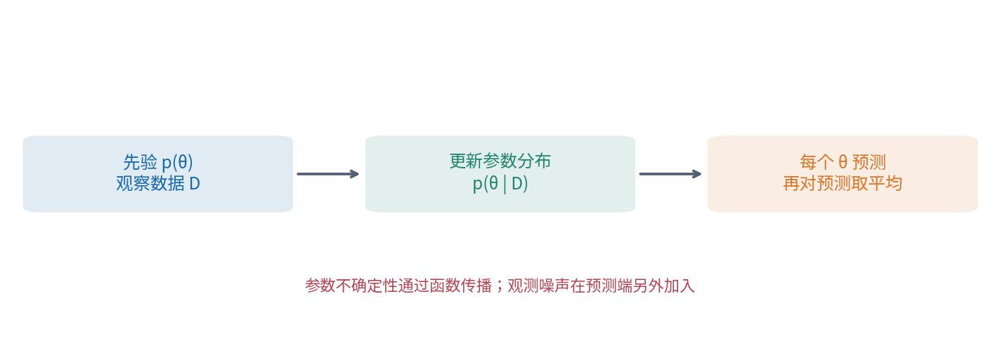
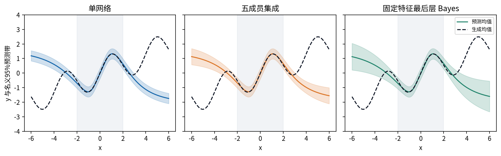
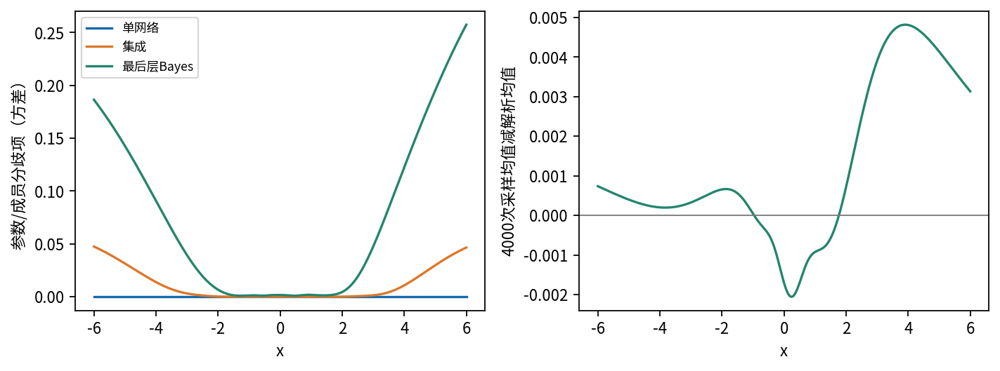
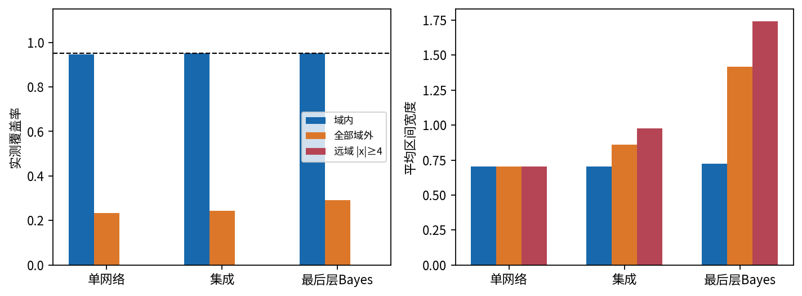
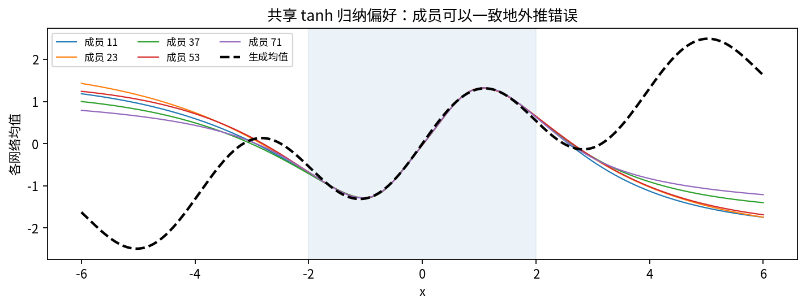

# DL076 贝叶斯深度学习与模型集合

**发行序号 076 对应原大纲 T4。** 原编号 T4 及先修 017、019、060、071 均保留；这是“理论与可信解释”分支的第四讲，不把分支改成所有学习者都必须线性完成的课程。本讲从一个问题开始：模型给出 2.1 时，我们还应该知道什么？

## 1 一个预测数字背后有两类未知

设 x 是输入，例如本课无单位的一维位置；y 是一次观测结果。真实机制为“平滑均值加测量噪声”。即使知道正确均值，同一个 x 再测一次也会得到不同 y。这是观测随机性，常叫偶然不确定性。另一类未知来自我们只有有限数据，不知道应选哪组网络权重，称参数或认知不确定性。两者的划分依赖所选模型，并非自然界已经贴好的绝对标签。

先用通俗情景区分：量具读数每次抖动，与没有在新区间测量过，是不同的问题。增加同一点的重复观测能更准地估计均值；预测下一次原始读数时，仪器本身的抖动仍存在。如果遗漏某个重要变量，一部分本可解释的变化也会被模型当成“噪声”。因此本讲的噪声与参数分解始终附着于一个明确的生成假设。

<strong>关键问题：</strong>“网络分歧很小”只说明你选的网络彼此相近，不能证明它们接近现实。 后面会看到五个独立训练网络在远域一起犯错。我们的目标是理解这个过程，而不是保证某一种方法永远有最高分。

## 2 从概率乘法走到预测积分

θ（theta）表示网络全部参数的集合；D 表示训练输入与结果的集合。p(θ) 是看到本次数据前的先验密度，p(D|θ) 是给定参数时产生这些数据的似然。竖线“|”读作“在给定……条件下”。先验不是训练准确率，似然也不是参数为真的概率；它们回答不同问题。

由联合概率的两种分解得到 Bayes 公式：

$$p(\theta\mid D)=\frac{p(D\mid\theta)p(\theta)}{p(D)}.$$

分母 p(D) 把所有可能参数的“似然乘先验”加总，使后验总质量为 1。连续参数要用积分，直观上就是把参数空间切成很多很小的格子，累加每格的概率贡献。后验不是一个最优参数点，而是许多参数的相对可信程度。

如果用后验来预测新观测 y*，必须把“参数可能是什么”也平均进去：

$$p(y_*\mid x_*,D)=\int p(y_*\mid x_*,\theta)p(\theta\mid D)\,d\theta.$$

星号只表示新样本。这个式子先让每组参数给出新观测的分布，再按后验权重混合。网络是非线性的，所以一般不能把参数先平均后送进网络来替代。两组参数各有一半概率、预测分别为 1 和 3 时，预测均值为 2；但平均参数的网络未必输出 2。

### 不会积分也可以理解 Monte Carlo

从后验抽 S 组参数，每组独立地给出一个预测，把这些预测分布等权平均，就是 Monte Carlo 近似。S 是正整数样本数，不是训练轮次。

$$p(y_*\mid x_*,D)\approx\frac{1}{S}\sum_{s=1}^{S}p(y_*\mid x_*,\theta_s).$$

这一步只减少对给定分布做数值平均的误差。若抽样来自错误的近似后验 q，增加 S 会更准确地平均 q，仍不会把 q 变成真实后验。先分清“分布近似误差”和“有限抽样误差”，再讨论计算预算。

## 3 预测方差为何是两项相加

均值是位置，方差是平方偏离的平均。标准差是方差的平方根，因此与 y 有相同单位。对于给定参数 θ，本课假设 y 的均值为 fθ(x)，噪声方差为 σ²；σ=0.18。对参数也平均后，全方差公式为：

$$\operatorname{Var}(y_*\mid x_*,D)=\mathbb{E}_{\theta}[\operatorname{Var}(y_*\mid x_*,\theta)]+\operatorname{Var}_{\theta}[f_\theta(x_*)].$$

第一项是每个参数模型自身的观测方差的平均；第二项是不同参数预测均值的分歧。推导只需在 y 减总均值中加上再减去条件均值：平方展开后，交叉项条件期望为零；剩下“模型内”和“模型间”两部分。独立同方差噪声下第一项就是 σ²。

手算：两个等权成员预测 1 和 3，各自观测方差 0.04。总均值 2，均值分歧为 ((1−2)²+(3−2)²)/2=1，总方差 1.04。这里分母用 2，因为我们在精确计算一个“两成员等权混合”的方差；不是用两个样本去估计未知总体方差。代码中的 `member.var(0)` 因此使用总体归一化。

![图2 训练只有 [-2,2] 内的100次观测。外侧曲线是合成世界已知均值，只用于评估，拟合函数看不到它。](figures/02_data_support.png)

**预测区间与均值区间不同。** 下一次 y 的区间要包含观测噪声；潜在均值 f(x) 的区间不加这项。若把后者拿去检查 y 的覆盖，往往显得过窄。单网络没有参数分布时仍可给出由假定 σ 决定的观测区间，但这没有表达参数未知。

## 4 三条近似路线各自省略了什么

**变分近似。** 选容易计算的分布族 qφ(θ)，例如各权重独立的高斯，用参数 φ 调节它。常见目标是最大化“q 下的平均对数似然减去 q 与先验的 KL 距离”。KL 是比较两个分布的非对称量；目标与逼近后验有关，但可表示的相关结构受分布族限制。只用独立高斯，可能遗漏强相关方向或多个模式。正文不假设你已会变分推导，060 提供继续学习入口。

**局部 Laplace 近似。** 找到后验密度的局部最高点，将负对数后验在其附近写成二次曲面，用该曲面的弯曲程度定义高斯。高曲率方向表示离开一点就显著变差，所以高斯较窄；低曲率方向允许更大变化。曲率矩阵叫 Hessian（海森矩阵），元素是对参数两次求导。对一般网络，局部高斯可能漏掉别处的模式。

**独立训练集成。** 从不同初始化训练多个网络，保留所有成员，预测时混合。它能表达优化路径造成的函数差异，却没有自动按 Bayes 后验的概率抽样。成员数量再多，也可能共享结构、训练数据和目标中的错误假设。我们引用 Deep Ensembles 的方法思想[1]，不声称复现其完整异方差训练方法或实验规模。

本讲用可精确核查的最后层模型展示 Laplace 思想。先真正训练一个 1→16→1 的 tanh 网络，然后固定隐藏特征，只给线性输出层放高斯先验。在这个“把特征当作给定”的工作模型中，负对数后验本来就是二次式，所以 Laplace 高斯恰好精确。**对整个深度网络，它仍是一种只保留最后层不确定性的近似。**

更细的边界是：隐藏特征已经使用相同 y 拟合过，随后被当作固定量。我们没有对特征选择过程条件化，也没有积分特征估计的不确定性。因此不能把这叫作严格的全流程 Bayes 后验，不能把“给定工作模型精确”偷换成“现实不确定性精确”。[2] 提供更一般的 Laplace 讨论；[3] 的 MC dropout 属于另一类近似，本实验没有实现它。

校准是预测分布与实际频率的关系；近似后验质量是近似与目标后验的关系。两者相关但不等同：模型错设时，精确 Bayes 也可能在真实世界失准。反过来，对一个域做经验校准也不能说明参数后验已经正确。071的校准与拒答概念在这里获得了具体反例。

## 5 最后层公式：从一个标量走到一张矩阵

隐藏单元 h_j(x)=tanh(w_j x+b_j)。tanh 是把任意实数压到 −1 与 1 之间的平滑函数；远离零时逐渐饱和。将16个隐藏输出与常数1排成长度17的列向量 φ(x)，输出就是 φ(x) 与17个最后层系数 β 的逐项乘积之和。常数1对应输出偏置。

把100个训练样本的特征转置后逐行排列，得到矩阵 Φ，形状100×17。矩阵只是有规则的数表；Φβ 代表同时计算100个预测。上标 T 是转置，把行列互换。I 是17×17单位矩阵，对角线为1，其余为0。取先验 β∼N(0,α⁻¹I)，α=1，是先验精度，越大表示越紧。

高斯观测噪声下，忽略与 β 无关的常数，负对数后验为：

$$J(\beta)=\frac{1}{2\sigma^2}\|y-\Phi\beta\|^2+\frac{\alpha}{2}\|\beta\|^2.$$

双竖线平方表示把向量每项平方后相加。第一项惩罚预测与观测的差，第二项对应高斯先验。令导数为零可得后验均值 m 与协方差 C：

$$H=\alpha I+\Phi^T\Phi/\sigma^2,\qquad Hm=\Phi^Ty/\sigma^2,\qquad C=H^{-1}.$$

H 就是二次式的曲率矩阵。代码用 `solve` 解线性方程，而不先显式求逆再乘数据；求 C 时也是求解 HC=I。新样本的预测均值为 $\phi(x_*)^T m$，参数方差为 $\phi(x_*)^T C\phi(x_*)$，再加 σ²才是新观测的总方差。协方差的非对角元素保留输出系数之间的相关性，因此不同特征可能相互补偿。

若只有常数特征、两个观测 y=(1,3)、σ²=1、α=1，那么 H=3，m=4/3，C=1/3。没有数据时 m=0、C=1；加入数据后均值移动且方差缩小。这就是复杂矩阵公式在一维里的可手算版本。

## 6 实验如何做到比较明确

训练 x 在 [−2,2] 均匀抽取100点；真实均值为 sin(1.6x)+0.3x，再加标准差0.18的高斯噪声。生成种子7601同时定义一个601点的 [−6,6] 评价网格及独立观测噪声。网格固定覆盖不同区域，并不是来自未知真实业务分布的随机代表样本。

五个成员使用种子11、23、37、53、71，各训练2200次全批Adam更新。单模型直接使用第一个成员，不挑最好成员。集成使用全部五个；最后层 Bayes 使用第一个成员的隐藏特征。所有设置事先固定，没有验证集选参，也没有用测试标签调整区间。集成总训练成本是五个成员，不能说三者训练预算相同。

对高斯模型，均值左右1.96个标准差给出名义约95%的中心区间。最后层工作模型与单模型是高斯；集成则使用矩匹配高斯作共同诊断。评估的 `gaussian_nll` 也是该高斯近似的负对数密度，不能冒称精确混合似然。密度可大于1，因此连续变量的 NLL 可以为负，不代表概率超过1。

RMSE 是误差平方平均的平方根；覆盖率是测试 y 落在区间内的比例；宽度是区间上限减下限。只报覆盖会奖励无限宽区间，只报宽度会奖励过度自信，两者需一起看。全部输出逐点保存，读者可以改变评价区域，而不是只能相信一个汇总数。

## 7 读真实结果：近似准确不等于校准良好

4000次采样的预测均值与解析均值最大绝对差约0.00482，权重保存再加载预测差为0。它们分别支持 Monte Carlo 实现与文件重载正确，范围很具体。即便这些检查完美，依然可能发生系统性外推错误。

| 方法 | 域内 RMSE | 域内覆盖 | 域外覆盖 | 远域覆盖 |
|---|---:|---:|---:|---:|
| 单网络 | 0.1836 | 94.53% | 23.25% | 0.00% |
| 五成员集成 | 0.1832 | 95.02% | 24.50% | 0.00% |
| 最后层 Bayes | 0.1840 | 95.02% | 29.25% | 0.00% |

域内定义为 |x|≤2，域外为 |x|>2，远域为 |x|≥4。远域是域外子集，不能当独立数据再求平均。一次有限网格上95%左右的覆盖，不证明每个 x 的条件覆盖，也不是任意未来分布的保证。

## 8 为什么大家能一起错，以及怎样继续研究

tanh 在远处趋近 ±1，所以固定宽度网络会越来越像一条常数。训练区间内的数据没有强制它学到区间外的正弦和趋势。五个初始化可以找到相近的区间内拟合，又沿相近结构一起外推。最后层 Bayes 允许输出权重变化，但固定的饱和特征本身不会突然获得新形状；这解释了“区间变宽仍不够”的机制。

<strong>一个可检查的主张：</strong>在这份固定合成数据与模型设置下，三种方法域内表现接近，而三者的远域名义95%区间均出现严重欠覆盖。该结果是一个反例，不是集成或Bayes方法的普遍排名。

初学者常问：“高不确定性时拒答，不就安全了吗？”只有当选取的不确定性在目标场景可靠地排列错误风险，拒答才可能有效。这里远域的共同偏差未充分进入分歧项，阈值可能保留错误样本；而无意义的宽分布也可能让系统拒绝大量本来可答的问题。必须独立报告覆盖、拒答后风险、保留比例和域移条件。

另一个问题是：“σ 已知是否不公平？”是一个刻意简化：我们把噪声估计误差排除，以便聚焦参数与结构未知。真实数据通常不知道 σ，需要训练或估计，并检查异方差、重尾与错误标签。即使本课知道正确噪声，仍发生域外失败，说明失败不只来自噪声估计。

继续实验时每次只改变一个因素：增加集成成员、改变先验精度、把训练支持扩展到 [−4,4]、给网络加入线性跳连。新的测试结果必须标记为探索，不能悄悄替换本课固定报告。至少写出主张、替代解释、预算变化和失败边界；不要根据一张漂亮曲线宣布获得了全网络后验。

本讲的三个阅读锚点是[1]深度集成、[2]Laplace近似、[3]dropout的Bayes近似。已核对原出版页面，完整链接与使用范围在 [sources.md](sources.md)。纸笔练习、逐步命令、源码入口和参考答案分别见 [lab.md](lab.md)、[experiment.py](experiment.py)、[answers.md](answers.md)。
