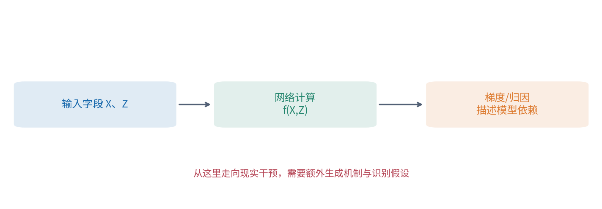
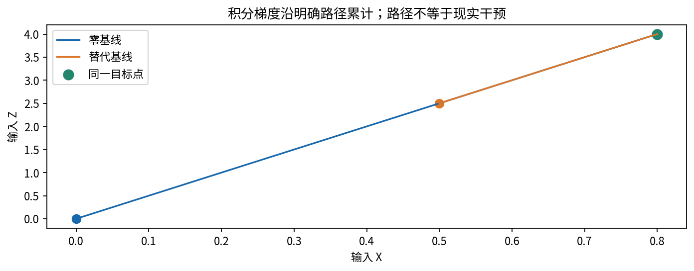
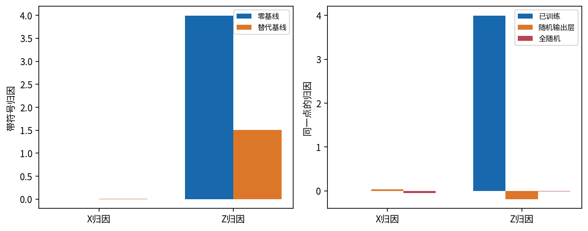
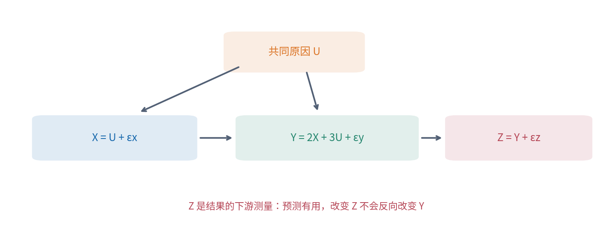
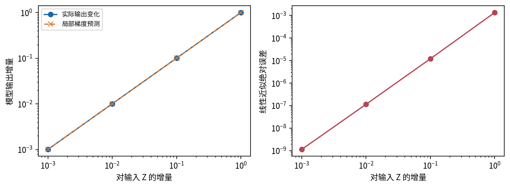
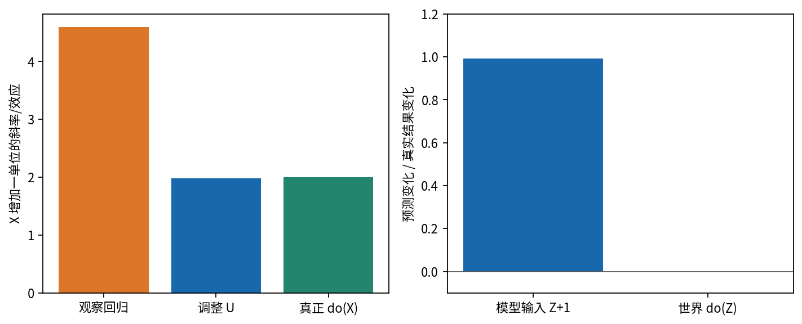

# DL077 可解释性与因果主张

**发行序号 077 对应原大纲 T5。** 保留原先修 011、022、071；本讲不修改 catalog 编号。我们将一个容易混淆的问题拆开：某字段影响模型输出，是否意味着改变该字段会改变真实结果？回答通常需要两套不同的证据。

## 1 先写清解释对象

设一个已训练函数 f 接收两个数字 X 和 Z，输出对 Y 的预测。归因方法把输出或输出变化分配到输入字段，帮助检查模型使用了什么线索。因果问题则询问在现实生成过程中实施干预，Y 会怎样变化。前者研究已经写好的计算程序，后者研究世界的生成机制。

例如 Z 是事后仪表对 Y 的精确测量，模型自然会依赖 Z。把屏幕显示值改掉会改变模型读到的输入，却不会回到过去改变 Y。预测上的重要性和可操控的原因在这里明显分叉。本课不是部署建议；若实际任务要求在 Y 发生前预测，使用事后 Z 会造成不可用信息或目标泄漏。

<strong>本讲中心边界：</strong>梯度、积分梯度、注意力权重或热力图都不能仅凭自身证明世界中的因果效应。 好看的图只是表达形式。我们会在小网络里用参数随机化、输入扰动和已知机制干预分别检验不同主张。

初学者无需先掌握矩阵微积分。下面从“轻轻改动一个输入”的斜率出发，再用一条路径把斜率累积起来；最后进入能手算的四条生成方程。完整实验仅用 NumPy，没有下载数据或调用外部模型。

## 2 梯度：把很小的改动传播到输出

导数表示输入发生极小改变时，输出变化与输入变化的比值。对于有多个输入的函数，偏导数 ∂f/∂x_j 指只动第 j 个字段，其他输入暂时固定。把各偏导数排成向量就是梯度。梯度的单位是“输出单位除以该输入单位”，因此不同尺度的原始梯度不能直接当无量纲重要性比较。

对足够小的改动 δ，可以使用局部一阶近似：

$$f(x+\delta)-f(x)\approx\sum_j\frac{\partial f(x)}{\partial x_j}\delta_j.$$

这不是全局等式。输入改动越大、路径上曲率越强，误差通常越明显。在饱和区域，某点梯度可以接近零，即使从远处移动到这里时输出已经发生很大变化。因此“此点不敏感”和“这个字段从未重要”不是同一命题。

### 把小网络的链式法则写出来

本实验使用2→12→1网络。输入 x 有两个元素，隐藏单元 j 先算 a_j=w₁ⱼx₁+w₂ⱼx₂+b_j，再算 h_j=tanh(a_j)，输出 f=Σ_j v_j h_j+c。w 是输入权重，b 是隐藏偏置，v 是输出权重，c 是输出偏置。求导时 c 不随输入变化而消失。

$$\frac{\partial f}{\partial x_i}=\sum_{j=1}^{12}v_j(1-h_j^2)w_{ij}.$$

因果顺序是：改动 x_i，先经 w_ij 改变 a_j；tanh 的斜率是1−h_j²；最后乘输出权重 v_j，再把12条路径相加。这就是代码 `((1-h*h)*v) @ w.T` 的逐项含义。`@` 表示按行列求乘积和，T 把原来的2×12权重表转成12×2。

实际梯度必须核对。测试把每个输入分别加减10⁻⁶，用 `(f(x+ε)-f(x-ε))/(2ε)` 作中央差分，与解析结果比较。差分也受舍入与步长影响，所以使用合理容差，不要求所有浮点数字逐位相等。

## 3 积分梯度：给“相对哪个起点”一个明确答案

普通梯度只描述当前位置的斜率。若希望解释“为何从参考输入 b 的输出变成当前 x 的输出”，就需要路径。积分梯度 IG 选择直线路径 b+α(x−b)，α 从0走到1，把每个字段沿途的偏导数平均，再乘该字段总位移：

$$\operatorname{IG}_i(x;b)=(x_i-b_i)\int_0^1\frac{\partial f(b+\alpha(x-b))}{\partial x_i}\,d\alpha.$$

b 是基线，分号表示我们特别强调它是解释设计的一部分。积分可看作沿途许多小段贡献之和。代码把路径分成512段，在每段中点算梯度，再平均；这叫中点数值积分，并不是调用一个神秘解释服务。[1]

由链式法则，沿路径对 α 求导得到各字段贡献之和；再对0到1积分，有：

$$\sum_i\operatorname{IG}_i(x;b)=f(x)-f(b).$$

这是完整性性质：归因总和解释相对于基线的输出差。它不保证每一项是唯一正确的现实原因，也不保证路径上的组合是现实可发生状态。实际数值积分只有近似完整性，所以脚本保存 `completeness_error`。

手算一个线性例子：f(x₁,x₂)=2x₁+3x₂，x=(1,2)，b=(0,0)。路径上梯度处处是(2,3)，IG=(2,6)，总和8等于输出差。把基线改为(1,0)，第一字段从未移动，归因变为(0,6)。这不是算法出错，而是解释问题已经变了。

## 4 一张归因图需要哪些反驳机会

**参数随机化检查。** 如果解释被宣称反映已学习的模型行为，就把已训练参数逐步替换为随机参数，观察解释是否变化。本实验先只随机输出层，再随机全部网络；输入、基线和解释算法保持一致。若所谓解释几乎不变，它可能主要反映输入结构、绘图规则或方法固有偏好。[2]

变化本身也不是万能通行证。随机化后归因变化，只支持“解释依赖这些参数”的有限结论，不能证明它忠实捕捉了所有模型机制，更不能证明因果。本实验报告80个固定探测样本归因矩阵的相对 L2 变化和带符号余弦，不把绝对值热图相似当唯一指标。

L2 长度是各项平方和的平方根。相对变化把“随机化后减原归因”的长度除以原归因长度；大于1表示变化幅度超过原始总长度。带符号余弦是两组数的点积除以各自长度乘积，范围−1到1；负数可能表示方向相反。绘图若只看绝对值，会隐藏这类符号变化。

**输入扰动检查。** 对 Z 依次增加0.001、0.01、0.1、1.0，其他模型输入保持不变，比较实际输出增量与梯度预测。小步一致验证局部导数，大步误差反映曲率；本次模型在该路径上仍接近线性，不应为了讲故事虚构大幅失效。

**基线与尺度检查。** 单位从米换成厘米，梯度数值会缩小100倍，但真实函数依赖可以完全不变。比较前应统一单位或明确使用“单位变化”的定义。基线也应记录选择理由与可行性；全零只是一个可复算的起点，未必代表“没有信息”。

## 5 用已知世界理解干预、混杂与识别

我们构造四个外生随机量：U 是共同原因；εx、εy、εz 是互相独立、也与 U 独立的高斯噪声，标准差分别为0.4、0.2、0.08；U 标准差为1。外生表示在这张机制图中不由其他变量计算出来。生成过程按下面顺序执行：

$$X=U+\varepsilon_x,\qquad Y=2X+3U+\varepsilon_y,\qquad Z=Y+\varepsilon_z.$$

U 同时影响 X 和 Y，所以观察到 X 大的人也往往 U 大。即使不改变 X，仅共同原因的变化也会导致 X、Y 一起变化。这叫混杂。Z 在 Y 之后生成，是结果的精确代理；它帮助预测已经发生的 Y，却没有进入 Y 的生成方程。

`do(X=x)` 表示替换 X 原来的方程，直接设为 x；U、εy 等保持各自原有分布，随后按新 X 重新计算 Y 和 Z。与观察 `X=x` 不同，观察会偏向某些 U，而干预切断 U→X 的生成关系。Pearl 的结构模型语言用于表达这种区别。[3]

本世界中把 X 从−0.5改为0.5，保持同一个 U 和噪声，Y 的差严格为2。若只改变 Z，Y 方程完全没变，所以效应严格为0。实验把这些成对结果保存，允许逐例核查。这里结论成立的依据是我们知道并控制生成机制；并不是网络的低测试误差赋予了因果识别能力。

现实里通常不能直接看到所有机制。要从观察数据识别效应，需要额外假设，如正确的时间顺序、适当测量的混杂变量、无未控制共同原因、一致性和足够的处理取值覆盖。假设不足时，更多数据或更复杂网络未必解决识别问题。

## 6 观察回归为何把2看成约4.59

协方差描述两个变量是否一起偏离均值；方差是变量与自身的协方差。带截距的一元最小二乘斜率等于 Cov(X,Y)/Var(X)。代入已知结构 Y=2X+3U+εy，并利用独立噪声，可得总体斜率：

$$\frac{\operatorname{Cov}(X,Y)}{\operatorname{Var}(X)}=2+3\frac{\operatorname{Cov}(X,U)}{\operatorname{Var}(X)}=2+\frac{3}{1+0.4^2}\approx4.586.$$

这里 Cov(X,U)=1，因为 X=U+独立噪声；Var(X)=1+0.16。额外的约2.586来自共同原因的观察关联，不能算作改变 X 的效果。实际400个测试样本的一元斜率约4.593，接近这个总体推导；差别来自有限样本。

把 U 作为调整变量，与 X 一起回归 Y，估得 X 斜率约1.984，接近结构系数2。这是因为我们特意知道 U 是正确共同原因且模型线性。不是“控制越多越好”：控制下游变量、碰撞点或错误测量可能改变目标或引入偏差。Z 在结果之后，尤其不应被不加思考地当作估计 X 总效应的调整变量。

再问一个常见问题：“保持其他字段不变，不就是控制实验吗？”在函数里固定另一个坐标，是一个定义明确的模型查询；但世界里的其他变量可能是被干预变量的后果。do(X) 后 Z 应随 Y 重新生成，不能一边改变 X、一边强行把原 Z 保持不变，然后宣称这是同一个自然干预。

反事实进一步询问“对这个相同个体，如果当时改变 X 会怎样”。本课保留同一外生噪声做成对计算，这是在已知结构模型中的反事实耦合；现实里对个体噪声的推断可能不唯一，平均干预效应可识别也不代表每个个体反事实都可识别。

## 7 从训练、测试到因果反例的真实证据

训练集600条，数据种子7701；独立测试400条，种子7702。网络训练1800次全批Adam更新，初始化种子17；参数随机化种子77。没有测试集选模型或挑查询点，教学查询固定为(X,Z)=(0.8,4.0)。网络只读 X、Z，U 只用于验证已知机制和调整回归。

| 检查对象 | 本次结果 | 支持的有限结论 |
|---|---:|---|
| 测试 RMSE | 0.0889 | 网络精确读取了事后代理 |
| 查询点对 X 的梯度 | 0.0142 | 模型局部对 X 不敏感 |
| 查询点对 Z 的梯度 | 1.0076 | 模型局部强依赖 Z |
| 零基线 IG 完整性误差 | 约2.21×10⁻⁸ | 数值积分与输出差吻合 |
| 随机输出层归因相对变化 | 1.0379 | 归因依赖已训练输出层 |
| 全随机网络归因相对变化 | 1.0110 | 归因依赖已训练参数 |

完整性误差和梯度差分是计算验证；低 RMSE 是预测验证；因果效果来自结构干预验证。把三类验证放在同一表里不应抹掉它们的证据范围。没有真实业务数据，所以这些数字不能外推为某个行业系统的可靠性。

值得注意的是，按机制同时更新 X、Y、Z 后，模型对 X 的成对干预输入响应约1.961，接近真实效应2。这个吻合来自新输入带入了结果的下游代理，并不能证明模型学会了 X→Y 的机制。如果推理时不能获得干预后的 Z，这个路径就不可用。

## 8 如何写出不越界的解释报告

一份可信报告先写查询：解释哪个模型、哪个输出、哪个样本、相对什么基线。然后写方法及数值精度：解析梯度如何检查，积分分多少段，随机化替换哪些层，用什么相似度，扰动是否处于合理范围。最后再说明该证据支持何种主张，而非用“可解释”一词替代所有细节。

<strong>可接受结论：</strong>在固定合成模型和查询点上，网络主要依赖下游代理 Z；积分梯度随参数和基线改变；但生成机制中干预 Z 对 Y 没有效果。因此本例的归因重要性不等同于世界因果效应。

不接受的跳跃包括：“热图最亮的像素是现实原因”“注意力大证明这个词导致结果”“随机化通过所以解释完全正确”“控制了很多变量所以没有混杂”。这些语句都缺少从模型计算走向现实机制的桥梁。可以把归因用于排查捷径、提出假设和设计后续实验，但新的因果主张仍需独立证据。

### 预设疑问与下一步

**归因没有因果保证，那还有什么用？** 它可以发现模型依赖了不可用字段、提示单位错误、比较不同基线、检查梯度实现。本课恰恰用归因发现网络依赖事后代理，再用机制解释为何这不构成可操控原因。把用途写准确比把方法一概否定更有帮助。

**如果移除 Z，X 的归因就能当因果效应吗？** 不能。模型可能用 X 预测混杂造成的关系，学得约4.59的观察斜率，而干预效应是2。删除明显代理解决一个信息边界问题，却不自动消除 U 的混杂。

**能否从这400条数据证明真实图？** 本讲的图由生成程序给定，不是从400条样本中发现的。现实中多个因果模型可能具有相同观察分布。识别关注在明确假设下，目标效应是否由可观察分布唯一确定；估计关注有限样本里怎么算得准，两者顺序不能颠倒。

建议完成 [lab.md](lab.md) 的手算、改基线和机制改写后，再看 [answers.md](answers.md)。原论文入口与核对范围见 [sources.md](sources.md)。本讲完成 T1-T5 发行批次的最后一讲；这里不新增后续分支或学习排期。
