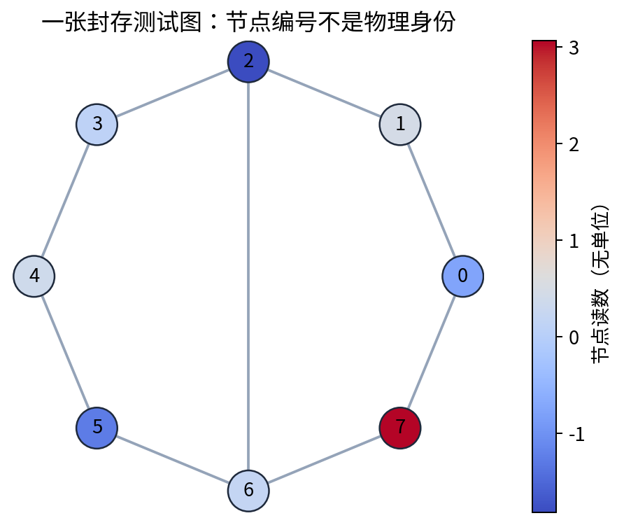
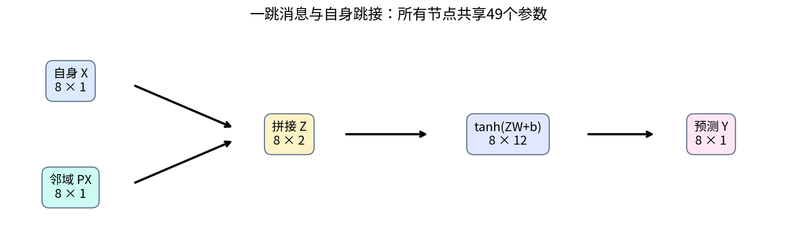
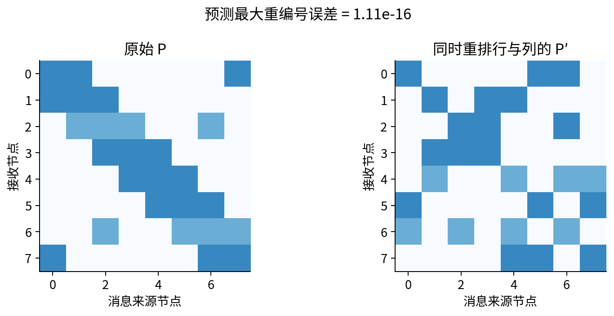
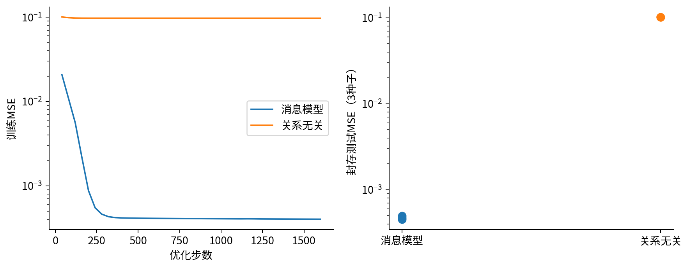
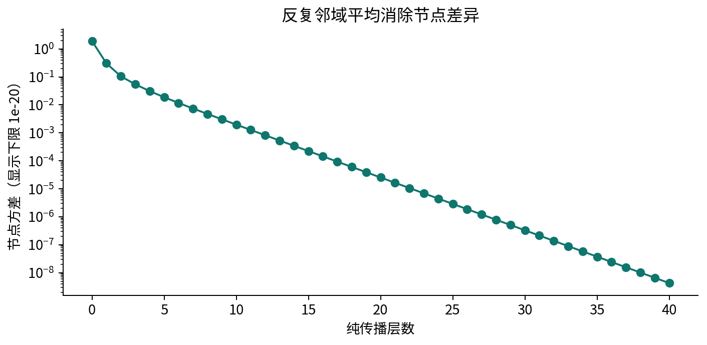
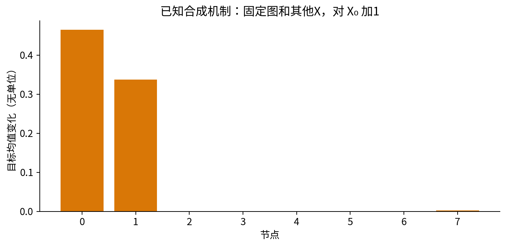

# DL078 图神经网络与关系数据

发行序号078对应原大纲 **S1**，原先修 **009、030** 保持不变。图注意力是可选扩展，进入时另补052。本讲不把“知道节点之间有关系”直接当成“知道因果关系”。我们先建立可以手算的图计算，再训练一个小模型，最后检验它在陌生图、重编号和多层传播下究竟做了什么。

## 1 为什么一张普通数据表不够

假设八个水箱各有一个当前读数，管道把部分水箱连接起来。下一时刻的读数不仅与自身有关，还与相邻水箱有关。如果只把八个读数按行送入同一个普通网络，每一行只能看到自身。把整个表拼接成一个长向量虽然能表达相互作用，却会让“第3行”获得固定身份：交换行号可能改变预测，换成九个水箱也不能直接沿用输入形状。

图把“有什么”与“谁和谁相连”分开。一个图写作 G=(V,E)，V是节点集合，E是边集合。节点可以是水箱、原子、论文或传感器，边可以是管道、化学键或引用。现实含义必须由数据提供者说明；画上一条边本身不保证信息真的沿它传播。尤其在社交网络中，连接可能来自相似选择、共同环境或平台推荐，不能自动解读成一种可操控的影响。

本实验使用无向、无权、没有原始自环的八节点图。无向表示i连j时j也连i；无权表示所有存在的边先赋值1；原始自环不存在表示没有人为记录“节点连自己”，但模型会为计算加上自环。每张图是一个独立实验样本，有自己的八个读数。我们用150张不同图，而不是把一张图的150个节点混在一起。

## 2 从连接清单到可以相乘的矩阵

邻接矩阵A有n行n列。A的第i行第j列为1，表示节点i接收节点j的信息；无向图中A等于自己的转置。节点特征矩阵X有n行d列，行是节点，列是测量字段。本课d=1，所以X只是竖着摆的八个数字。矩阵乘法AX的第i行，把相邻节点的特征加起来。

直接相加有一个问题：度数多的节点，即使邻居平均读数相同，也会得到更大的数。为实现平均，先把单位矩阵I加到A上，把自身也当成一个信息来源，再用每行总和除该行。记B=A+I，D的对角元素为B各行之和，其余为零。

$$P=D^{-1}(A+I),\qquad M=PX.$$

P每行加起来为1，所以PX是包括自身在内的邻域平均。矩阵右上标−1在这里不是给每个元素求倒数；D是对角矩阵，它的逆恰好在对角线上放度数倒数。没有任何边的孤立节点加了自环后仍有行和1，输出是自身，避免了除零。

### 三节点纸笔计算

设节点0连1，节点1连2，读数依次为1、2、4。加上自环后，节点0看到1和2，均值1.5；节点1看到1、2、4，均值7/3；节点2看到2和4，均值3。因此PX=(1.5,7/3,3)。如果不加自环，两个端点只看到中间节点，都会得到2，而中间节点得到2.5。两种定义都可以成立，但它们实现了不同的计算，不能混着报告。

常见GCN使用对称归一化 S=D^(−1/2)(A+I)D^(−1/2)，一层写成H'=σ(SHW)。这是一个重要参考架构[1]。本实验为了让“平均”可手算，明确选择行归一化P，并保留自身特征的独立通路。我们没有声称逐行复刻文献中的GCN。

## 3 消息传递：先收集，再合并，再更新

消息传递的通用思路是：每条边产生消息，每个接收节点把消息合并，然后更新自己的表示。合并通常用求和、平均或最大值，因为这些运算不依赖邻居列表的排列。若简单按邻居编号串接，模型可能学到没有实际含义的顺序。

本课把过程收缩为一层，仍然包含真正可学习的非线性网络。先构造Z=[X,PX]，Z有n行2列，第一列自身读数，第二列邻域平均。接着使用共享的2→12→1网络：

$$H=\tanh(ZW+b),\qquad \widehat Y=Hv+c.$$

W有2行12列，b有12项，v有12行1列，c为一个数字。偏置b加到每个节点的一行；这叫广播，但数学上只是重复加同一组数。所有节点使用同一组W、b、v、c，参数数目与节点数无关。本模型共49个参数：24个输入权重、12个隐藏偏置、12个输出权重和1个输出偏置。

tanh把实数压缩到−1与1之间，让网络可表达非线性响应。若去掉tanh，不管叠多少纯线性特征变换，组合仍是线性映射，无法表达本课饱和式的生成响应。这里的非线性也不自动赋予机制意义；它只是学习函数族的一部分。

### 节点任务与整图任务

本实验每个节点都有一个目标，所以输出为n×1，是节点回归。若要预测整张图的总能量或是否含某种结构，需要把节点表示汇成一个图表示。求和池化 h_G=Σ_i h_i 对节点排列不变；平均池化再除以n，削弱了图大小信息。总量任务通常不能盲目用平均，强度任务也不能盲目用求和。池化是任务假设，不只是压缩维度的技巧。

## 4 置换等变：重编号后结果应该跟着走

“等变”在这里表示：先重编号再预测，等于先预测再把结果按同样方式重编号。设Π是置换矩阵，即每行每列只有一个1，其余为0。它不创造新读数，只改变行的顺序。正确的图重编号必须同时变换邻接的行和列：

$$X'=\Pi X,\qquad A'=\Pi A\Pi^T.$$

由于自环和度数也同样重排，可以得到P'=ΠPΠ^T。于是P'X'=ΠPΠ^TΠX=ΠPX。关键一步是Π^TΠ=I：先按某排列移动，再按逆排列移动，会回到原位置。Z的行被同样重排，右乘共享W不会混淆行，逐元素tanh也不改变这个结论，因此：

$$f(\Pi A\Pi^T,\Pi X)=\Pi f(A,X).$$

这是架构的代数性质，不需要训练成功才成立。数值程序受浮点求和顺序影响，只能用容差检验。实验对一个封存测试图固定重排[3,7,1,0,6,4,2,5]，最大误差约1.11×10⁻¹⁶。有限次测试不能替代证明，但能发现实现中只重排行、漏重排邻接列等常见错误。

如果先对节点结果求和池化，Π只交换加数顺序，因此图输出不变。这就是不变与等变的关系：节点输出跟着重排，图输出保持相同。不要把“不变”当成所有输出都应该不动。

## 5 一个可以核查真值的实验世界

每张图先连成环，保证连通，再随机加入额外无向边。节点读数X独立取标准正态随机数。目标通过下面的已知公式生成：

$$Y_i=\tanh(0.7X_i+1.1(PX)_i)+\epsilon_i,\qquad \epsilon_i\sim N(0,0.02^2).$$

所有量无单位，噪声是独立测量扰动。这个世界被刻意设计成邻域信息有用，所以它适合验证程序会不会使用图，不适合证明图网络普遍优于普通网络。数据种子78固定了150张图及其读数、噪声。编号0–99的100张图训练，100–124的25张验证，125–149的25张封存测试。没有一张图同时出现在两个分区。

关系无关基线也输入两列、使用相同49个参数，但把第二列换成X，即Z_blind=[X,X]。它获得相同训练步数和优化器，只是看不到邻域。这样，性能差异主要回答本合成任务中“提供关系信息是否有帮助”。它并不是世界上最强的关系无关学习器；实验也未比较图模型家族的绝对排名。

### 为什么不能把节点随便混着拆

同图节点共享边结构；消息传递时，训练节点可能接收测试节点的特征。若部署目标本来就是在一张已知图上补标签，这种传导设定可以合法，但必须声明可见信息。若目标是陌生分子或陌生网络，则要整图拆分。标签、由标签计算的边权以及发生在预测时点之后的信息都不能偷偷进入构图过程。仅仅把标签数组分开，并不能自动堵住边里的泄漏。

## 6 损失、反向传播与真正的训练

对N个节点响应，均方误差是 L=(1/N)Σ_i(ŷ_i−y_i)²。误差平方让正负误差都产生代价，也更重惩罚大误差。设E=Ŷ−Y，则输出处的梯度为G=2E/N。它描述每个预测值轻轻增加时损失怎样变化。

沿计算路径向后，输出层权重梯度为H^T G；隐藏层激活梯度为Gv^T。tanh的导数是1−H²，因此预激活处梯度Q=(Gv^T)⊙(1−H²)。最后输入权重梯度是Z^TQ，隐藏偏置梯度是把Q沿节点求和。

$$\nabla_W L=Z^TQ,\qquad \nabla_v L=H^TG.$$

⊙表示逐元素相乘。程序的loss_grad逐项实现这些公式，不依赖隐藏的自动求导。测试对全部49个参数逐个加减10⁻⁶，比较中央差分和解析梯度。通过梯度检查仅说明局部算式一致，不保证训练数据、拆分或研究主张正确。

优化使用1600步全批量Adam，学习率0.015，动量系数0.9与0.999，小常数10⁻⁸。Adam保存梯度的一阶与平方的滑动平均，再做早期偏差修正。为了集中学习图结构，本课不重新证明Adam收敛；读者可以把它理解成有方向记忆和尺度调整的更新规则。三个初始化种子0、1、2全部运行，不能只保留最好的一次。验证集只用于报告，没有用测试集调参或挑种子。

实测图模型测试MSE均值约0.000474，关系无关基线约0.102243。噪声方差是0.0004，但有限测试样本上的噪声误差会波动，不能要求模型恰好达到0.0004。参数和误差都写入outputs，讲义中的数字可以由源码重建。

## 7 多次传播为何会把节点“磨平”

先暂时移走可学习权重与非线性，只研究H^(l+1)=PH^l。每步是邻域平均，局部差异被反复混合。对连通、含正自环的本实验无向图，随机游走矩阵会逐步把各节点特征推向同一个加权平均；这个平均按节点度数加权，通常不等于最初的普通算术平均。

例如两节点互连且都有自环，P所有元素为1/2，一次平均就把(1,3)变为(2,2)。节点信息仍存在于共同的2里面，但“谁是1、谁是3”的差异已经无法恢复。这正是过平滑直观：最终很难根据这些表示区分节点。

实验对一个测试图连续做40次P乘法，记录每层节点方差。方差越小，节点表示越接近。这个探针只研究纯传播，不是训练了40层深网；不能从它推出所有深层GNN必然失败。残差、归一化、异配图、可学习算子和非线性都会改变行为。过平滑与过挤压也不是同一问题：后者涉及大量远处信息压进固定维度表示的瓶颈。

## 8 从关联到干预，还缺了什么

模型把邻域读数视为有用特征，只能说明预测依赖。要说“提高节点0读数会改变邻居的结果”，需要生成机制、时间顺序和干预定义。在本合成世界里，我们确实公开了目标公式，因此可以固定图、其他X和噪声，把X₀加1，再由公式计算响应变化。

这项干预会影响节点0的自身项，以及P第0列非零节点的邻域项。程序保存的是无噪声均值变化，避免把重新抽一次噪声误当干预效应。它仍只是一个人为模型世界的机制演示。现实数据中，X₀可能只是未观测变量的代理，或者边本身会随干预变化，固定P未必合理。

如果科学任务涉及时间，应写成X(t+Δt)=F(X(t),G,U(t))，明确驱动U、时间步长与观测过程，而不只把静态图上的相关性包装成动力规律。下一讲讨论旋转等变，080讨论数值积分与梯度；它们分别约束空间表达与时间计算，不能相互替代。

## 9 独立完成后应该能解释的事情

你应该能够手算一次邻域平均，指出每个数组的形状，证明重编号等变，并解释求和池化的不变性。你还应该能说清楚：这次实验的分区单位是图；关系无关基线参数数目相同；过平滑图研究纯传播；因果干预来自已声明的合成方程，而不是从漂亮的节点图上读出来。

进入真实研究前，先写数据卡：节点和边是什么、构图发生在什么时候、缺失边怎样处理、标签是否参与构图、一个部署样本是否是新图、图大小和度分布是否变化。若这些问题没有答案，换更复杂的GNN通常不会让结论更可信。

## 10 参考与适用范围

[1] Kipf与Welling，Semi-Supervised Classification with Graph Convolutional Networks，ICLR 2017。https://arxiv.org/abs/1609.02907 。用于定位对称归一化GCN；本课行平均与跳接模型、推导、数据及图示为原创教学构造，不是论文复现实验。

所有训练在CPU上完成，安装后不需要网络、账户、付费API或外部数据。实现使用NumPy显式梯度；Notebook执行是实际顺序运行的Python内核，网页交互界面不属于验证范围。详细运行记录见verification.json；实验题与答案独立提供。
