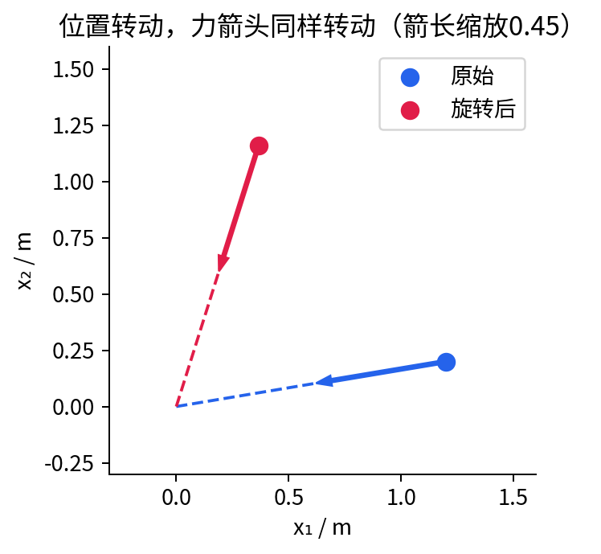
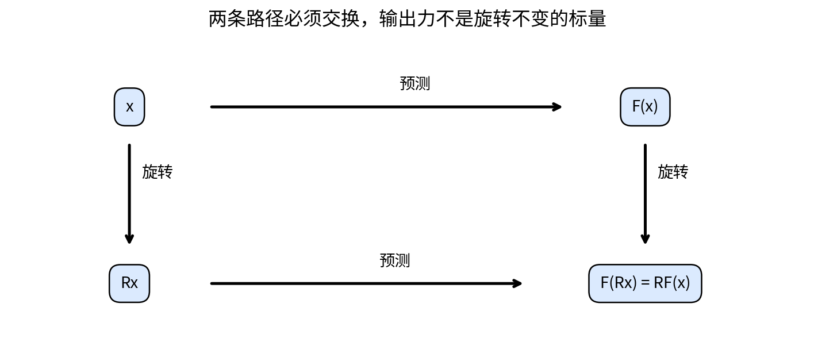
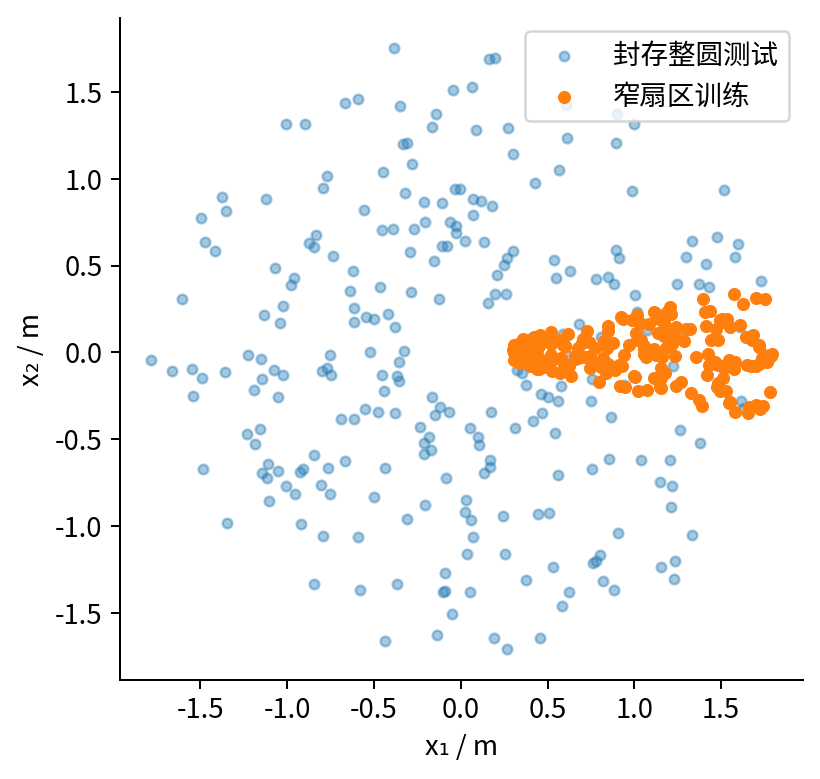
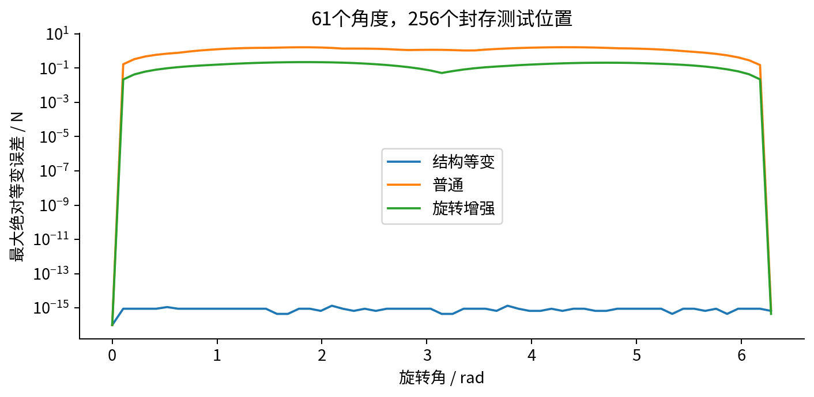
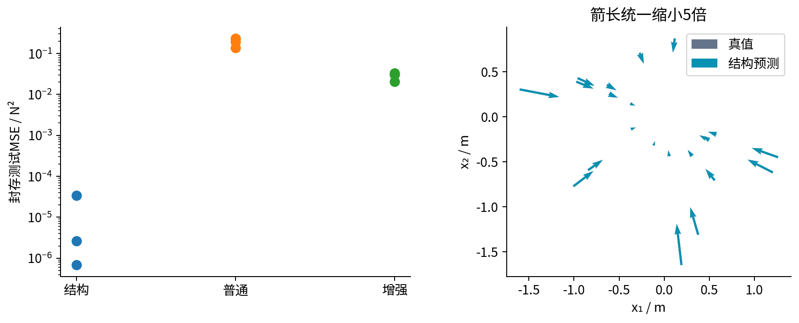
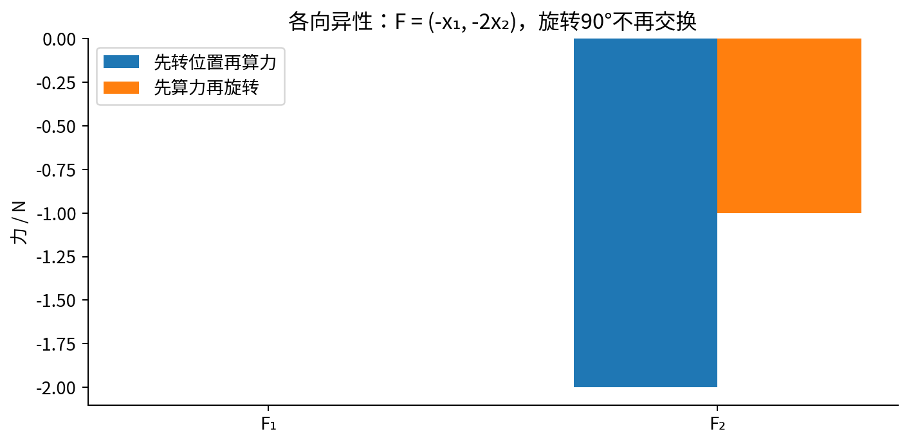

# DL079 对称性几何与等变网络

发行序号079对应原大纲 **S2**。先修 **008、013、043、S1** 原样保留，S1的发行材料在078。本讲从“转动一张坐标纸，力箭头该如何转动”开始，逐步建立群、作用、不变、等变与一个可训练网络；不要求先学高级表示论。

## 1 先决定什么可以变化，什么必须保持

桌面上有一个固定中心，一个粒子偏离中心后受到回复力。把整套实验和坐标轴一起旋转，若环境各方向相同，力的方向应该跟着旋转，大小不变。若桌面某个方向更硬，或者存在固定向下的重力，只旋转粒子而不旋转环境就不再是同一个物理问题。

这一区别决定能不能把对称性写进模型。对称性不是“让图片看起来差不多”的口号，而是输入、输出和背景变量之间的一项明确约定。对标量能量，旋转后数值可能不变；对向量力，两个坐标分量会变化；对张量应力，变换规则又不同。把所有输出都训练成不变，会让向量模型丢失方向。

本实验只研究二维各向同性中心力。输入x=(x₁,x₂)是相对于中心的位置，单位米；输出F=(F₁,F₂)是力，单位牛顿。中心固定在原点，角度使用弧度。我们训练三种模型：结构等变网络、普通坐标网络、随机旋转增强的普通网络，再到整圆方向测试。

## 2 旋转矩阵到底做了什么

二维逆时针旋转角θ的矩阵作用，可以写成下面两个分量：

$$x_1'=\cos\theta\,x_1-\sin\theta\,x_2,\qquad x_2'=\sin\theta\,x_1+\cos\theta\,x_2.$$

为避免读者被矩阵记法挡住，也可以直接写两个分量：x'₁=cosθ·x₁−sinθ·x₂，x'₂=sinθ·x₁+cosθ·x₂。θ=π/2时，(1,0)变成(0,1)，(0,1)变成(−1,0)。θ不是角度制的90，而是弧度制的π/2；代码传90会得到另一个旋转。

旋转保持长度，因为R的转置乘R等于单位矩阵。逐项展开也能看到：两个新分量平方相加，交叉项相互抵消，剩下(cos²θ+sin²θ)(x₁²+x₂²)。这给出我们之后构造不变特征的关键原料：r²=x₁²+x₂²。

本课程数组按行存样本，所以每一行是一个位置。数学写列向量Rx，代码必须写x @ R.T；漏掉转置会变成反方向旋转。有时这种错误在长度测试里看不出来，因为正反旋转都保持长度。因此测试同时检查方向、群组合和预测交换关系。

## 3 群与作用：把可组合的变换说清楚

群可以先理解为一套能组合、能撤销的变换。二维旋转满足四件事：两个旋转组合仍是旋转；三个旋转如何加括号不改变最终结果；旋转0角度是什么也不做；每个θ都能用−θ撤销。组合公式R_αR_β=R_(α+β)把这些直观变成代数。

“作用”说明这些变换怎样操作某个对象。对位置向量作用是x→Rx，对标量能量则可能保持不变。给定输入作用ρ_in与输出作用ρ_out，等变的定义是：

$$f(\rho_{\rm in}(g)x)=\rho_{\rm out}(g)f(x).$$

这里g是一项变换，不是训练参数。对本课力场，输入与输出都乘同一旋转矩阵，因此f(Rx)=Rf(x)。不变是特殊情况，输出作用是什么也不做，即f(Rx)=f(x)。一个模型可以对节点重编号等变、对旋转等变、对某个最终标量读出不变，这些描述并不矛盾。

结构约束与数据增强也不同。增强把若干变换后的样本加入训练，让损失鼓励模型遵守规则；结构约束则使任意参数取值都满足代数规则。有限增强可能学得很好，但不会凭训练数据自动得到对所有角度的严格保证。

## 4 从距离不变，构造力的等变

用r²=x₁²+x₂²做输入，训练一个输出单个数字的网络gθ(r²)。因为旋转不改变r²，这个数字不会随方向改变。再乘原来的向量x，得到：

$$F_\theta(x)=-g_\theta(\|x\|^2)x.$$

负号表示当g为正时力朝向中心；网络本身没有强制g为正，因此这个物理性质需要额外检验或参数化。本课训练目标会鼓励其在训练半径范围内为正，但不声称对所有半径都有正性保证。

证明等变只需两步。第一，||Rx||²=||x||²；第二，标量乘法与矩阵乘法可以交换。因此：

$$F_\theta(Rx)=-g_\theta(\|x\|^2)Rx=RF_\theta(x).$$

这对任意θ参数都成立，不依赖优化器、不依赖训练轮数。反射矩阵Q也满足Q^TQ=I，所以这个构造实际上对二维正交变换，包括镜面反射，也等变。我们不能把它称为只使用旋转而保留手性信息的通用模型；距离特征对反射不敏感，可能遗漏区分镜像所需的信息。

gθ是1→16→1的tanh网络。其输入维数是1，因为半径平方是一个数字；输出也是1，是向量的缩放系数。普通基线则是2→16→2网络，直接由坐标预测两个分量。两者参数数目分别49和82，因此本比较没有参数量完全匹配。结构模型的优势同时依赖正确的归纳约束与更小搜索空间，不可简单归为“相同容量架构获胜”。

### 从单粒子推广到关系层

对多个粒子，可用r_ij=x_j−x_i表示相对位移，用||r_ij||²与标量节点属性产生系数a_ij，再求Σ_j a_ij r_ij。若系数只依赖旋转不变的量，每一项都随旋转而变，求和仍等变。若同时平移所有粒子，相对位移不变，因此这个向量更新对平移不变；将它加回x_i，更新后的坐标对平移等变。EGNN是相关原始研究入口[1]，本课只实现单中心的最小特例，不宣称完整复现其架构。

## 5 平移、坐标原点和单位不能混在一起

力场围绕中心c时，应输入相对位置x−c。整体平移a后，粒子和中心都加a，相对位置保持不变，力也保持不变。如果只把粒子平移而不移动中心，距离变了，力应当变化。所谓“平移不变”必须说清楚到底变换哪些对象。

实验把测试位置和中心同时平移(2,−1)米，再相减，误差约8.9×10⁻¹⁶牛顿。这是相对坐标数值检查，不是对任意未知外场的证明。若存在重力方向g，还应把g作为输入并规定它怎样变换；否则硬编码各向同性可能把真实信号删除。

单位同样重要。真实生成系数为0.7 N/m与0.25 N/m³，而r²单位是m²，所以g(r²)单位为N/m，再乘位置米才得到牛顿。把米换成厘米而不转换系数，将使r²扩大一万倍，输出完全变样。旋转是保持单位和长度的坐标变换，单位缩放不是本实验已证明的对称性。

## 6 明确实验分布，才能理解结果

合成真值为：

$$F(x)=-(0.7+0.25\|x\|^2)x.$$

位置半径均匀取0.3至1.8米。训练192个位置，方向只在−0.22至0.22弧度的窄扇区内；验证96个和测试256个位置覆盖−π至π。所有集合独立生成，数据种子分别79、791、790。目标没有加噪声，目的是隔离几何约束与方向外推，不是模拟完整仪器误差。

三种模型都训练1600步Adam，学习率0.01，隐藏宽度16，使用三个初始化种子。普通网络只看窄扇区，增强网络在每一步对整个训练批次采一个随机角度，同时旋转输入和目标。为什么同时转目标？因为力是向量；只转输入而保持目标不动，会教出错误物理规则。

增强模型接触了更多方向，这是其方法的一部分，也意味着三个模型的“信息暴露”不相同。我们匹配优化步数与原始样本数，但没有声称计算成本、参数量与增强样本多样性全部匹配。验证集只报告误差，不用测试集挑种子；三种子都保留。

## 7 网络梯度不是凭感觉写出来

普通网络写作H=tanh(XW+b)、O=Hv+c，MSE对O的梯度为2(O−Y)/(2N)，因为每个样本有两个坐标分量，平均是对全部2N个数字。若错除以N，梯度会放大两倍，相同学习率已不是同一训练协议。

等变模型先得到每个样本的标量o，再预测−ox。对第i个样本，输出力的两个分量都依赖同一个o_i。因此标量梯度必须把两条路径相加：

$$\frac{\partial L}{\partial o_i}=-\sum_{j=1}^{2}\frac{\partial L}{\partial F_{ij}}x_{ij}.$$

然后再通过输出层、tanh和输入层反传。代码loss_grad先计算输出力的误差，再在等变分支执行沿坐标求和，后续梯度形式与普通MLP相同。测试对两类网络的全部参数逐项中央差分，检查符号、归约和广播。只检查训练损失下降不够，错误梯度也可能碰巧下降。

在原点x=0，等变网络输出必为0，且这个样本对g参数不提供梯度，因为任何g乘0都一样。这是模型结构带来的可识别性事实，不是浮点故障。如果你的任务在原点有非零恒力，当前架构根本不适用。

## 8 等变误差与预测误差是两个指标

预测误差比较Fθ(x)与真值F(x)。等变误差比较Fθ(Rx)与RFθ(x)，不需要真实标签。两者回答不同问题：一个错误但各向同性的力场可以完美等变；一个在有限测试点上准确的网络也可能在未测角度违反对称性。

本课扫描61个角度，使用最大绝对分量误差，单位牛顿。seed0结构模型的最大误差约1.33×10⁻¹⁵，处于浮点舍入量级；普通模型约1.67，增强模型约0.225。有限扫描不是全空间证明，结构模型的普遍结论来自上面的代数，扫描用于验实现。

三种子测试MSE均值约为：结构等变1.25×10⁻⁵ N²，普通0.188 N²，增强0.0280 N²。结构模型不同初始化仍有性能波动，说明“架构保证对称”与“优化一定到最优”不是一回事。增强确有改善，也未达到这次结构模型水平；这些结论限定于当前真值、扇区、步数与网络宽度。

## 9 一项必须主动构造的反例

把真实机制换成F(x)=(-x₁,-2x₂)，表示两个方向刚度不同。取x=(1,0)，其力为(−1,0)。旋转90度后位置为(0,1)，真实力是(0,−2)；但先预测再旋转只得到(0,−1)。两者不等，说明这个任务没有我们强加的旋转对称性。

实验在测试位置上计算这个交换误差，最大约1.78牛顿。即使增加数据，也不能让一个严格各向同性的结构在整个平面上精确表达各向异性目标。正确选择可能是把刚度矩阵K作为输入，并在旋转时同时变换K→RKR^T；也可能明确承认实验室方向有物理意义，使用不强制旋转对称的模型。

等变也不是守恒的同义词。一般等变向量场未必满足能量守恒、牛顿第三定律或辛结构。本课径向且只依赖半径的静态场可以写出势能，但这来自具体形式，不能推广到所有等变网络。若用学到的力推进时间，还要检查积分方法、时间步长和长期能量漂移，这正是下一讲的主题。

## 10 从最小模型走向可审查的研究

先画出输入输出的几何类型：标量、向量还是更高阶张量；再列变换对象，包括外场、中心、单位与边界；写出任务真的应满足的交换关系，然后设计一个反例挑战它。实现后既做代数证明，也做随机变换数值检查，并把预测误差和对称误差分开报告。

若研究分子，还需确认镜像、手性、周期边界和原子类型的处理。若研究卫星图像，地理方向、太阳方向和传感器投影可能破坏简单旋转假设。高级表示论可以提供系统工具，但不能替代这些领域判断。

[1] Satorras、Hoogeboom与Welling，E(n) Equivariant Graph Neural Networks，ICML 2021。https://proceedings.mlr.press/v139/satorras21a.html 。用于相关研究定位；本课独立推导并实现单中心径向特例，没有复制论文图或性能数据。

本讲数据与图示原创。全部计算在CPU NumPy中完成，不需付费API或外部服务。运行、测试、Notebook和PDF检查的具体证据见verification.json。
