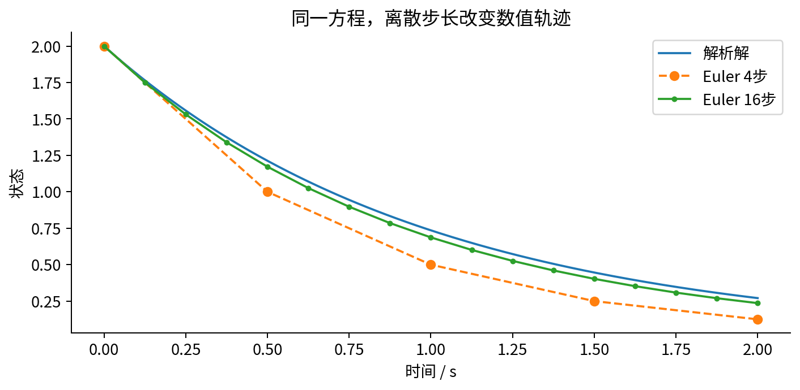
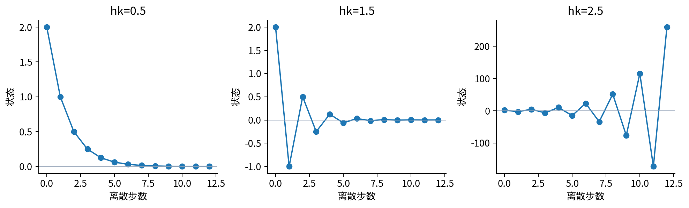
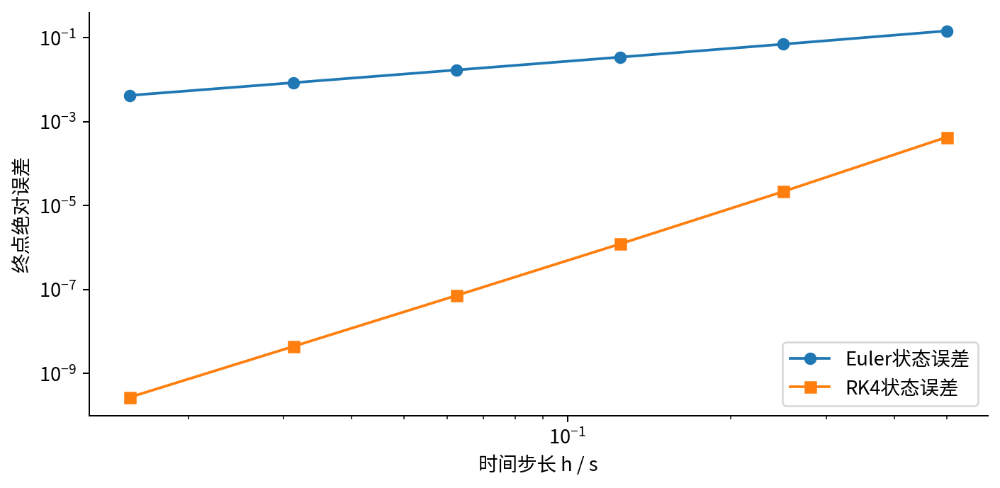
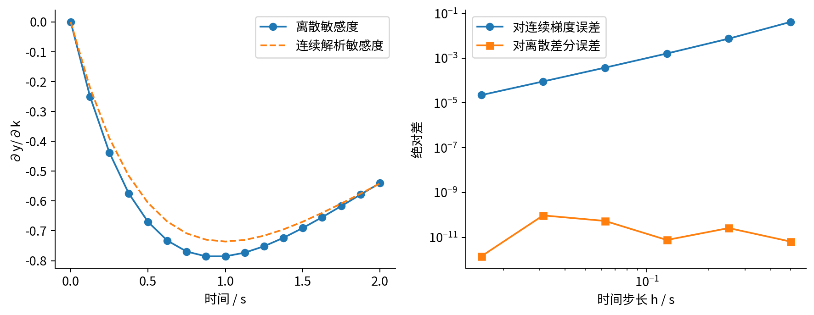
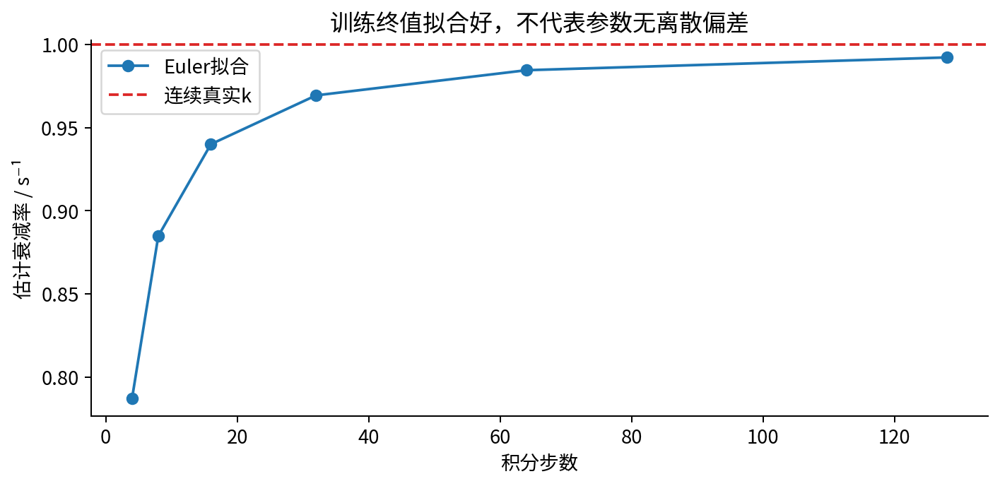
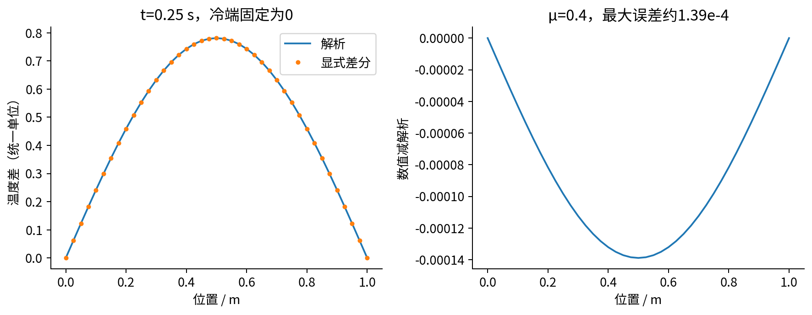

# DL080 微分方程与可微模拟基础

发行序号080对应原大纲 **S3**。原先修 **010、011、015、029** 保留。本讲不要求先学完图网络或几何网络：科学机器学习可以直接沿S3进入S5。我们从一瓶物质随时间衰减开始，依次建立方程、初值、离散步长、稳定性、参数梯度与一个PDE例子。

## 1 方程描述的是变化规律，不是一张答案表

设y(t)是时刻t的物质量或浓度。导数dy/dt表示时间极小变化时状态改变的速率。最简单的衰减模型认为速率与当前状态成正比，且方向为减少：

$$\frac{dy}{dt}=-ky,\qquad y(0)=y_0.$$

t以秒计，k以每秒计，y使用统一的状态单位。右边−ky的单位是状态单位每秒，与左边一致。k≥0；若k=0，状态保持不变；若k>0，当前量越大，绝对减少速率越快。初值y₀告诉我们开始时有多少，没有它，同一条速率规律对应无数条不同轨迹。

这是常微分方程ODE，因为未知函数只依赖一个自变量时间。把右端写成f(t,y,θ)便得到更一般形式，θ可以是物理系数，也可以是网络参数。所谓神经ODE只是用网络表达其中某个向量场，不会让初值、数值稳定性和观测模型自动消失。相关原始研究可见[1]；本讲首先用能解析求解的方程验证基本算式。

### 解析解从哪里来

当y>0时，两边除以y，得到dy/y=−kdt；从初始时刻积分到t，得到ln y−ln y₀=−kt，因此y(t)=y₀e^(−kt)。也可直接把这个函数代回方程核验：导数为−ky₀e^(−kt)，恰好等于−ky(t)，且t=0时等于y₀。这种“代回再查初值”的习惯比记公式更重要。

本课固定k=1 s⁻¹、y₀=2、终点T=2秒，所以真实终值约0.2706705665。解析式只对当前模型成立，不能因为它拟合一条曲线，就断言现实一定只有一种衰减机制。

## 2 Euler方法：把瞬时速度当成一小段平均速度

计算机不能存连续时间上无穷多个值。把0到T分成n段，每段h=T/n。在第j步，用当前位置的速度f(t_j,y_j)近似整段平均速度，再走h秒：

$$y_{j+1}=y_j+h f(t_j,y_j)= (1-hk)y_j.$$

这就是前向Euler。算法每一步只用已知状态，不解隐式方程。n=4时h=0.5，倍乘因子为0.5，状态依次为2、1、0.5、0.25、0.125。真实终值约0.27067，所以四步结果衰减过快。误差来自用起点斜率覆盖整段，而真实衰减过程中斜率的绝对值不断减小。

局部截断误差考察“从精确起点走一步”与精确终点的差。Taylor展开有y(t+h)=y(t)+hy'(t)+h²y''(ξ)/2，所以Euler一步误差通常是h²量级。固定总时间要走大约1/h步，在适当光滑与稳定条件下，累积的全局误差通常是h量级。局部二阶和全局一阶不矛盾，因为累计步数也随h变化。

代码每次都先用旧y_j更新状态和敏感度。若先覆写y_j，再在梯度递推里误用新值，会得到另一套离散系统。实验保存完整轨迹，让每一步都能检查。

## 3 稳定、准确与保持物理范围是三件事

衰减方程解析解应趋近零。但Euler的状态每步乘1−hk。要让幅度随步数减小，必须满足：

$$|1-hk|<1,\qquad 0<hk<2.$$

若hk=0.5，倍乘因子为0.5，单调衰减。若hk=1.5，倍乘因子为−0.5，符号来回变化而幅度衰减。后者在绝对稳定意义上稳定，却产生负浓度，不符合许多物理任务。要保持非负初值不变号，还需0≤hk≤1。若hk=2.5，倍乘因子−1.5，状态一边变号一边放大，完全违背真实衰减。

因此“没有爆炸”不是“足够准确”，也不是“保持物理可行”。更小步长往往有帮助，但增加计算量。刚性系统可能同时含非常快和慢的时间尺度，使显式法为稳定被迫取远小于主要变化尺度的步长；这时可考虑隐式法，而不是盲目加深神经网络。

## 4 传统高阶方法必须成为对照

经典四阶Runge–Kutta，简称RK4，在一步里测四个斜率：起点a，中点预测b，再用b构造中点c，最后用c构造终点d；用(a+2b+2c+d)/6加权平均。对一般f，写成：

$$a=f(t_j,y_j),\qquad b=f(t_j+h/2,y_j+ha/2),$$

$$c=f(t_j+h/2,y_j+hb/2),\qquad d=f(t_j+h,y_j+hc),$$

$$y_{j+1}=y_j+\frac{h}{6}(a+2b+2c+d).$$

一个RK4步调用右端四次，Euler只调用一次，所以只比较相同步数不等于相同计算成本。本实验同时给出公式与误差，主要验证数学，不宣称做了全面性能竞赛。固定T=2，n从4增到128，RK4终值误差从约4.29×10⁻⁴降到2.72×10⁻¹⁰，而Euler从0.1457降到0.00424。

高阶也不是无条件更稳。RK4有自己的稳定区域，非光滑右端、事件、约束投影和自适应步长都会改变理论前提。科学机器学习里的网络向量场若极不光滑或导数很大，不能照搬一个光滑标量例子的误差常数。

## 5 什么叫“对模拟器求导”

现在把k看作待学习的参数。输入k，运行n步模拟，输出y_n；这整个程序就是一个函数。对它求导，问的是k轻轻增加时“这个离散程序的输出”怎样变化，不是直接询问无穷精度的连续方程。

定义s_j=∂y_j/∂k。由于初值y₀与k无关，s₀=0。对Euler递推使用乘积法则：

$$s_{j+1}=(1-hk)s_j-hy_j.$$

第一项来自过去的敏感度经过当前步传播，第二项来自当前步直接使用参数k。把它与y递推一起计算，就是前向敏感度传播，也可看成在每个数字旁边携带一条导数的前向自动微分。这里不是有限差分：只运行一次增广递推，不需要重新用k±ε各模拟一次。

当n固定时，Euler终值还有闭式y_n=y₀(1−hk)^n，所以导数为−nhy₀(1−hk)^(n−1)。例如n=4、h=0.5时，导数是−0.5。连续解析解导数是−Ty₀e^(−kT)，本例约−0.54134113。两者都可能被程序正确算出，却不是同一个数值对象。

## 6 反向传播沿时间走回来

若只有一个标量终点输出，而参数很多，反向模式通常更合适。定义λ_j=∂y_n/∂y_j，终点λ_n=1。每一步状态对前一步状态的导数是1−hk，因此：

$$\lambda_j=\lambda_{j+1}(1-hk).$$

k在每一步都出现，必须把每条直接路径累加：

$$\frac{\partial y_n}{\partial k}=\sum_{j=0}^{n-1}\lambda_{j+1}(-hy_j).$$

代码reverse_gradient先保存前向所有y_j，再从最后一步倒着累加。另一个独立实现Value把每次加法和乘法变成计算图节点，记录局部导数，再按逆拓扑顺序自动累加梯度。autodiff_euler直接运行普通Euler算术，只把数字替换成Value对象，最后调用backward；它不手填上面的敏感度递推。因此我们同时核对手推前向、手推反向、实际自动微分和中央差分四条路径。这个微型引擎只支持标量加乘，没有张量、设备调度或通用框架的功能。若漏掉某一步或使用λ_j代替λ_(j+1)，会出现索引偏差。本课前向敏感度、反向传播和中央差分相互核对；前两者的差距约在10⁻¹⁵以内，中央差分误差通常10⁻¹⁰左右。

### 连续伴随与离散反传不是随便互换

连续伴随先在连续方程层面推导导数方程，再数值求解；离散反传先选择离散算法，再对实际算术求导。在足够好的条件和逐步细化下，两者可能收敛到相同连续导数，但有限步长时未必一致。自适应步长、事件触发、截断误差与轨迹重建也可能影响结果。本讲只验证固定步长Euler的离散梯度，没有声称实现神经ODE论文的连续伴随求解器。

前向模式需随参数维数存敏感度；反向模式需保存或重算状态轨迹。深度学习里用检查点交换内存和计算，在可微模拟中同样存在。无论选哪种方式，都应先在可解析的小问题上核验，而不是直接对复杂流体模拟相信一个梯度数值。

## 7 小残差、正确梯度，仍可能得到错误参数

设真实终点观测来自连续模型y*=2e⁻²，但拟合时使用粗Euler模拟。损失为L(k)=0.5(y_n(k)−y*)²，因此：

$$\frac{dL}{dk}=(y_n(k)-y^*)s_n(k).$$

我们从k=0.3出发，用步长0.3更新400次，并投影到k≥0。注意这里的0.3是优化学习率，h是物理时间步长，两者含义与单位不同，不能混叫“步长”而不说明。

只要把粗离散终值调到观测值，训练损失就能接近零。令y₀(1−hk_fit)^n=y₀e^(−k_true T)，在非负倍乘分支解得：

$$k_{\rm fit}=\frac{1-e^{-k_{\rm true}h}}{h}.$$

它通常小于真实k。n=4时估计约0.78694；n=32时约0.96939；n=128时约0.99223；真实值是1。模型通过改变参数补偿求解器的过快衰减。梯度完全正确、拟合终值也非常好，却恢复了错误参数。这正是数值误差与模型误差混淆的具体例子。

如果再把k换成一个高容量神经网络，网络可能更容易吸收求解器偏差。研究报告必须做步长扫描、传统方法对照和独立状态误差检查，不能只展示训练残差下降。080仍假定y₀已知且观测无噪声；082将放松这些条件，讨论可识别性和观测模型。

## 8 怎样读误差曲线，才不会错误归纳

本实验保存七列扫描表：步数n、时间步长h、Euler终值误差、Euler参数梯度误差、RK4终值误差、中央差分一致性误差、前后向梯度一致性误差。前三种误差以解析连续解为参照，后两种以同一个离散程序为对象。

本例T=2、k=1处的Euler终点梯度误差下降得接近二阶，比一般预期更快。这不证明Euler梯度普遍二阶。展开离散终点导数相对连续导数的首阶系数，可得到k−Tk²/2；恰好在Tk=2时为零，所以出现特殊抵消。把T改成1，再扫描即可看到一般的一阶行为。一个漂亮斜率必须检查是否来自特定参数的偶然抵消。

中央差分ε也不能无限变小。太大带来截断误差，太小使两次非常接近的浮点结果相减，舍入误差相对放大。测试选ε=10⁻⁶并给容差，只声称在当前数值规模下一致，不把浮点差分当无限精确裁判。

## 9 PDE：状态开始同时依赖位置与时间

若一根杆上的温度在不同位置不同，未知量是u(x,t)，不仅是y(t)。一维热方程写作：

$$\frac{\partial u}{\partial t}=\alpha\frac{\partial^2u}{\partial x^2},\qquad 0<x<1.$$

偏导表示只改变一个自变量。α为热扩散系数，若x以米、t以秒计，α单位为m²/s。二阶空间导数刻画当前位置相对左右邻居的弯曲程度；峰顶通常为负，意味着热量向两边散开，温度下降。

除了初始温度u(x,0)，还需要两端边界条件。本课固定u(0,t)=u(1,t)=0，初始u(x,0)=sin(πx)，α=0.1。这里x∈[0,1]米，严格有量纲表达可写sin(πx/L)，L=1米；代码用按L归一化的数值坐标。解析解为e^(−απ²t/L²)sin(πx/L)。固定冷端可以吸走热量，因此总热量一般不守恒；不能把下降的总和误判成求解器错误。

把空间分成等距网格，二阶导数近似为(u_(i−1)−2u_i+u_(i+1))/Δx²。再做前向Euler时间更新：

$$u_i^{j+1}=u_i^j+\mu(u_{i-1}^j-2u_i^j+u_{i+1}^j),\qquad \mu=\alpha\frac{\Delta t}{\Delta x^2}.$$

标准一维均匀网格下，显式法要求μ≤1/2以保证相应稳定性质。空间步长减半，时间步长通常要缩到四分之一；这说明“更高分辨率”会同时增加空间点数和时间步数。代码拒绝μ>1/2的设置，不让一个明显不稳定参数默默出图。

本实验41个空间节点，Δx=0.025，μ=0.4，运行100步，总时间0.25秒。最大状态误差约1.39×10⁻⁴，边界误差为零。这只是线性、一维、光滑且有解析解的示例，不能外推到复杂几何、冲击、湍流或多物理场。

## 10 一份科学模拟报告的最低内容

先写方程、状态与参数单位、初值和边界条件，再写离散算法、步长、终止时间与传统参考方法。随后分别报告状态误差、梯度核验、稳定性和计算开销；如果要恢复参数，再把网格细化对估计值的影响列出来。真实系统还需要测量误差、外部驱动和未建模项的说明。

数值模拟中“do(k)”可以定义成修改生成方程的参数后重算轨迹。但在现实中k能否被单独操控、其他参数是否随之改变，仍是领域与因果识别问题。可微分说明程序允许算斜率，不说明变量可操控，也不说明估计的参数就是真实机制。

[1] Chen等，Neural Ordinary Differential Equations，NeurIPS 2018。https://arxiv.org/abs/1806.07366 。作为连续深度模型研究入口；本课Euler、RK4、敏感度和PDE推导为独立教学内容，不复用其性能主张。

