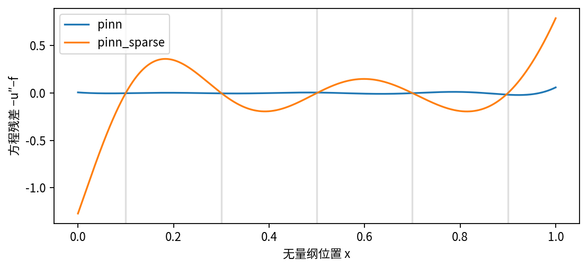

# DL081 习题答案与研究边界

这些答案用于运行后核对，不是替代你自己的误差记录。参考数字来自随课真实NumPy训练；不同平台最后几位和计时可能不同。若偏差达到数量级，先查配置、梯度与代码，不要直接复制这里的数值。

## 1 已知解与边界

u′=πcos(πx)，u″=−π²sin(πx)，所以−u″等于规定热源。sin(0)=sin(π)=0，边界也成立。加3x−2后，二阶导数不变，因此内部残差仍为零；新左端为−2、右端为1，边界不成立。

这个例子说明边界提供了微分方程没有消除的自由度。若只训练内部残差，模型没有理由选择原来的那条曲线。它也解释了为什么“低残差足以恢复解”的论断需要适定性、边界和误差范数等额外前提。

## 2 三节点差分

h=1/4，矩阵主对角是2，上下对角是−1；第一行系数为(2,−1,0)，第二行(−1,2,−1)，第三行(0,−1,2)。右端为(π²/16)(sin(π/4),1,sin(3π/4))。

利用对称性令u₁=u₃=a、u₂=b。得到2a−b=π²√2/32，2b−2a=π²/16。解得b=(π²/16)(1+√2/2)，约1.053，比真解1大约0.053。粗网格中央差分近似曲率，不要求精确复原连续正弦解。

消去第一列时，第二行加第一行的一半，第二个对角元素从2变为1.5，右端也同步更新。Thomas算法把同样的过程推广到所有节点，再从最后一个未知数向前代回。直接调用逆矩阵不仅不必要，也会掩盖三对角结构的效率。

## 3 热流方向

在左端u′(0)=π，热流q(0)=−π，表示沿坐标负方向向外；右端u′(1)=−π，q(1)=π，沿正方向向外。总外流是q(1)−q(0)=2π。若把两个坐标方向的流率直接相加，左端负号会抵消右端，而不是累加两个外流。

因此守恒不是“把边界导数随意求和接近零”。应先定义正方向、法向、源项及单位，再写积分平衡。多维情况同样需要外法向通量积分。

## 4 输入导数不等于参数梯度

field输出u、u′、u″，这些是对输入x的函数及其导数。loss_grad还需要对θ求导并加入端点项。可以保留field完全正确，却漏掉gc的边界梯度；这时输入差分检查全部通过，但c无法按边界损失更新。

另一个常见错误是对w求导时只求h的变化，忘记w²自身的导数2w。二者都会产生“损失在变，但优化的不是声称的精确梯度”的问题。逐参数中央差分提供了直接核查，容差应允许浮点误差，而不是要求逐位相同。

## 5 配点反例的合格结论

参考表述：保持网络与训练步数不变，只把方程配点从65降至5，训练点残差降到浮点零，但1001点空间评价残差RMSE约0.299，解误差也增加。结果表明有限配点拟合不足以证明连续区间求解准确；它不证明所有PINN或采样策略都会失败。

默认65点模型网格残差约0.00904，相对L2约2.37×10⁻⁵；五点模型约0.299与0.00157。残差的比例与解误差的比例不同，正说明微分算子、采样和边界共同决定误差传递。不要从这两个样本拟合一个普遍经验规律。

## 6 网格收敛

相对误差约为3.597×10⁻⁴、8.985×10⁻⁵、2.246×10⁻⁵，相邻比约4.00。步长每次减半，误差约减为四分之一，符合二阶方法在本平滑例子中的预期。

这不能证明任意不光滑源项、复杂边界、变系数或高维实现仍然二阶，也不能证明舍入误差与边界处理永远无影响。本例评价还含分段线性插值误差，所以报告的是完整求解与查询流程，不只是内部节点值。

## 7 离散守恒的相消

将内部式2u_i−u_{i−1}−u_{i+1}=h²f_i求和。中间每个u出现两次正号与两次负号，只留下u₁+u_n−u₀−u_{n+1}。边界为零，再除h，就得到(u₁+u_n)/h=hΣf_i。

右端是离散求和近似连续积分，而不是解析值2π。63未知数时，离散平衡误差约4×10⁻¹⁴，连续通量误差约0.00126。两者同时成立，没有矛盾。前者检查离散求解器内部一致性，后者检查相对于连续物理量的逼近误差。

默认PINN连续平衡误差约1.19×10⁻⁴，比63点差分的连续通量误差小；但这不表示PINN整体更优，因为成本、解误差、其他网格精度和通量近似方式也要考虑。127点差分已达到相近解误差，且求解非常便宜。

## 8 算子实验设计

对热源f=a₁sin(πx)+a₂sin(2πx)，线性性给出：

$$u(x)=\frac{a_1}{\pi^2}\sin(\pi x)+\frac{a_2}{4\pi^2}\sin(2\pi x).$$

它满足零边界。训练样本是不同的(a₁,a₂)组合及整条输出曲线，输入可以是若干固定传感器上的f值。若直接把a₁、a₂输入普通网络，学习的是有限参数化解族，也可作为基线；不要因此假装已覆盖任意函数空间。

可在系数方形区域中预先划分三组互不重复的函数实例，所有同实例坐标只能归入同一划分。测试一是新系数同网格，测试二是新系数新查询网格；更高频热源作为另列分布外挑战。基线至少包含解析公式或同精度差分；数据生成和训练成本应计入摊销分析。

## 9 关于λ、硬约束与真实问题

λ=0时c完全不影响内部二阶导数，梯度为零。这是结构性不受约束，不只是“优化器没调好”。增大λ可能压低边界误差，也可能使内部残差优化更难。不能只挑最好看的一个λ报告而隐去其他实验。

硬约束u=x(1−x)Nθ自动满足零边界，但新的二阶导数包含乘积法则中的三项：x(1−x)Nθ″+2(1−2x)Nθ′−2Nθ。漏掉任何一项都改变方程。硬约束也不自动保证内部精度或全局守恒。

## 10 可接受与不可接受的研究结论

可接受：在给定光滑一维Poisson问题、固定零边界和已披露采样下，NumPy PINN达到列出的误差，稀疏配点暴露泛化风险，传统差分在此任务具有明显成本优势。

不可接受：网络已学会任意PDE；没有标签所以没有训练数据；边界罚项意味着严格满足边界；守恒误差小所以局部解准确；本例运行较慢证明PINN毫无用途。

本讲最重要的习惯是把方法名称换成可检查的计算对象：输入是什么、训练在优化什么、测试改变了什么、指标与物理量怎样对应。只要这些问题清楚，换成更大的框架与更复杂的方程时，你仍能辨认可信证据与过度主张。
