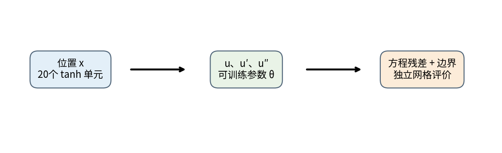
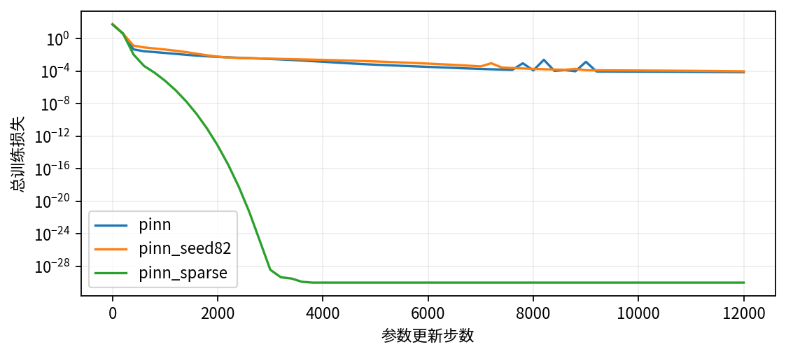
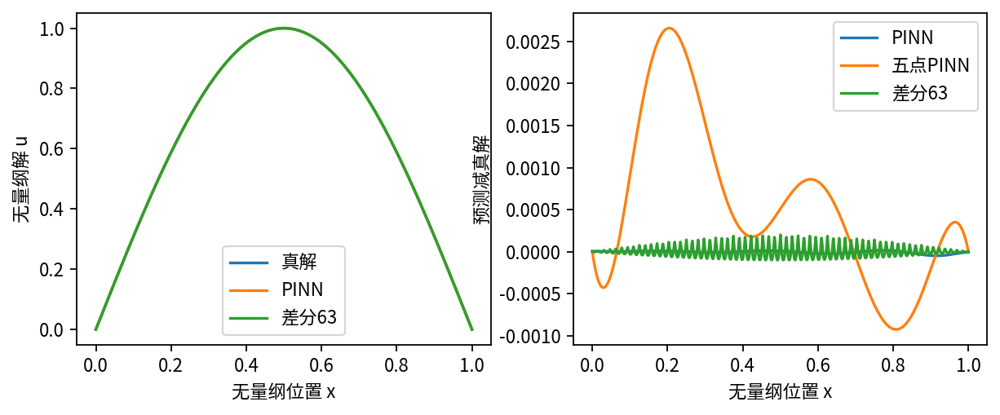
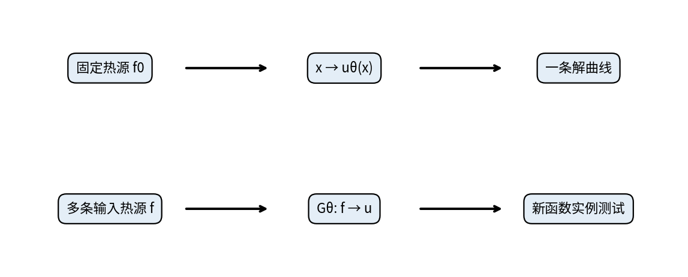

# DL081 物理约束网络与神经算子

**发行序号081，对应原大纲S4。先修：S3、036、040。** 本讲的问题是：从拟合一个解，到学习“输入函数变成解函数”的规则，还缺哪些证据？我们先用一个可手算、可训练、可反驳的例子，建立判断标准，再解释神经算子与它的区别。

本讲采用无量纲的一维稳态扩散问题。全部训练仅用NumPy，所有网络参数都会更新，不用付费API，不下载预训练模型。完整实验有两种随机初始化、一组稀疏采样反例及三个网格尺度的传统数值解。图均由随课代码生成，不是网络截图。

## 1 从温度曲线理解方程

想象一根细棒，左端和右端维持温度零，内部有热源。我们希望知道每个位置的温度。x是位置，u(x)是温度曲线；u′表示沿棒的变化率，u″表示变化率如何继续变化。导数不是相邻数据点的简单差，差分只是近似导数的一种方式。

先把长度除以棒长，把温度除以选定温标。这样的x和u没有单位，区间变成0到1。若实际导热系数、热源或几何不满足本例假设，不能把本课数字直接当工程温度。

取导热系数为1，热流定义为q=−u′。负号表示热由高温流向低温。稳态局部平衡为q′=f，因此：

$$-u''(x)=f(x),\qquad f(x)=\pi^2\sin(\pi x),\qquad 0<x<1.$$

边界条件是u(0)=u(1)=0。它们与微分方程共同定义任务。只给u″，仍可在解上加任意直线ax+b；直线的二阶导数为零，所以方程内部看不见这两个自由度。

本例故意选择已知解u★(x)=sin(πx)。对它连续求两次导数即可核对方程，端点的正弦值也为零。这里使用解析解作为独立评价工具；训练损失只看到热源与边界，不把解值偷偷塞进训练标签。

## 2 PINN究竟训练什么

物理信息神经网络，简称PINN，把未知解写成一个带参数的函数uθ。θ不是位置，而是网络里需要学习的权重与偏置。本例用一个隐藏层、20个tanh单元：

$$u_\theta(x)=\sum_{j=1}^{20}v_j\tanh(w_jx+b_j)+c.$$

每个单元先把x乘w_j、加b_j，再经过平滑弯曲函数tanh；最后由v_j加权求和并加c。因此参数总数为20+20+20+1=61。改变x是在询问曲线另一个位置；改变θ则是在改变整条曲线。两种导数必须分开。

为什么不用最熟悉的ReLU？本例损失直接依赖经典二阶导数。ReLU在折点不可微，其他地方二阶导数为零，直接套本例公式会出现严重问题。弱形式、分片方法或特殊处理另当别论，不宜把本例结论推广为“ReLU永远不能做物理学习”。

为了看清每一步，设h=tanh(z)、s=1−h²，则h对z的一阶导数是s，二阶导数记为q=−2hs。这里q只是推导中的临时符号，与上一节物理热流同名但含义不同；代码只在局部使用它。输入导数为：

$$u'_\theta(x)=\sum_jv_jw_js_j,\qquad u''_\theta(x)=\sum_jv_jw_j^2(-2h_js_j).$$

在完整自动微分框架里可以由程序求这些导数；本课用解析式减少依赖，便于和中央差分核对。解析公式本身不会自动正确，仍需测试。

## 3 把物理要求变成损失

残差是把预测放进方程后剩下的差：rθ(x)=−uθ″(x)−f(x)。如果r为零，表示该位置满足这个方程。训练在N个配点上计算残差的均方，再加两个端点的均方误差：

$$L(\theta)=\frac{1}{N}\sum_{i=1}^{N}r_\theta(x_i)^2+\lambda\frac{u_\theta(0)^2+u_\theta(1)^2}{2}.$$

本例λ=20。这个数控制两类误差在优化中的相对影响。它不是“物理真实性概率”，也不是任意量纲下都能直接复用的常数。若位置和温度的单位改变，导数与残差尺度也会变，应该先无量纲化或合理归一化。

边界可以软约束，也可以硬约束。软约束是本例的罚项：越违反，损失越大，但有限训练后可能还剩一点误差。硬约束可以写uθ(x)=x(1−x)Nθ(x)，因为前面的因子在两端严格为零。硬约束省去该边界罚项，却改变导数表达式和优化几何；复杂边界也未必容易写这样的函数。

如果是随时间演化的问题，还要给初值。例如u_t−u_xx=f需要描述开始时整根棒的状态。初值损失比较uθ(x,0)与已知u₀(x)，边界损失则比较各时刻端点。二者不能因为都叫“约束”就合并忘掉一个。本讲为稳态问题，没有时间变量，所以没有初值数据。

## 4 怎样真正更新参数

链式法则告诉我们，损失如何沿每条计算路径传回参数。以输出权重v_j为例，残差对它的导数为−w_j²q_j，因此内部损失的梯度是每个残差乘这个导数再求平均。端点损失还会贡献另一项，不能漏掉。

$$\frac{\partial L_r}{\partial v_j}=\frac{2}{N}\sum_i r_i(-w_j^2q_{ij}).$$

对w_j求导时，w_j²和h_j都在变化，必须同时使用乘积法则与链式法则。代码中的q′=−2+8h²−6h⁴是q对z的导数。实验测试逐个扰动w、b、v、c，用中央差分检查损失梯度，而不只是检查输入导数。这能捕获“网络会输出，但根本没在优化正确目标”的错误。

训练采用Adam。初始随机种子81，另一组82；前8999步学习率0.003，之后0.0005，总12000步。Adam保存一阶与二阶梯度滑动平均，再对参数做缩放更新。这个课程不把Adam当作保证收敛的定理；损失曲线、独立评价和多次初始化仍是必要证据。

## 5 为什么训练点以外还要检查

默认配点是每个小区间的中点x_i=(i+0.5)/N，N=65，边界另外处理。我们在1001个等距网格点上评价解与残差。这批坐标没有参与训练，但它仍是同一个方程、同一个输入实例的域内评价，不能叫“新物理任务测试集”。

在一个有限坐标集合上残差小，不等于在整个连续区间上残差小。网络可以在点间弯曲，尖峰也可能恰好落在未测位置。提高评价分辨率、使用非均匀采样与自适应加点都能帮助发现风险，但任何有限检查仍不能单独替代误差定理。

我们故意只留5个训练配点，网络结构和训练步数不变。这一次配点残差达到浮点精度下的零，端点也几乎准确，可1001点评价的残差均方根约0.299，明显大于65点模型的0.00904。此反例不是“神经网络一定失败”，而是反驳“训练残差为零就已经求解成功”。

## 6 解误差与残差不是同一个指标

解误差看uθ与真解的距离；残差看预测是否满足微分方程。二阶微分会放大高频、小幅度扰动，所以解误差很小，残差仍可能显眼。反过来，少掉边界条件，即使残差处处为零，也可能得到加了一条直线的错误解。

本课报告网格相对L2误差，也就是预测误差向量长度除以真解向量长度：

$$E_{\mathrm{rel}}=\frac{\sqrt{\sum_k(u_\theta(x_k)-u_\star(x_k))^2}}{\sqrt{\sum_ku_\star(x_k)^2}}.$$

分母为零时这个定义不能直接用；本例真解不为全零，所以没有这个问题。最大绝对误差补充局部最坏情况，端点最大误差补充边界可信度。若工程关注某个积分量、峰值或阈值，则还应直接检查它，而不是只展示一条整体曲线。

在本次参考运行，65点PINN相对L2约2.37×10⁻⁵，最大误差约4.82×10⁻⁵，边界约7.71×10⁻⁶。第二种初始化得到约2.51×10⁻⁵的相对误差。这只是两个种子的稳定性检查，不足以估计可靠失败概率；跨平台最后若干浮点位可能改变。

## 7 守恒要说明哪一种守恒

对q′=f在整个区间积分，得到“右端向右热流减左端向右热流等于总热源”：

$$q(1)-q(0)=-u'(1)+u'(0)=\int_0^1 f(x)\,dx=2\pi.$$

注意两个端点外法向方向不同。若直接把u′(1)+u′(0)相加，会把通量方向搞错。本例PINN用解析网络导数算左右热流，因此整体平衡误差为|−uθ′(1)+uθ′(0)−2π|，参考值约1.19×10⁻⁴。

有限差分则有天然的离散平衡。对内部方程求和，内部通量相消，只剩边界面通量。离散热源总量是hΣ_i f_i，不等于连续积分的精确值。我们分别报告“离散通量减离散热源”和“离散通量减2π”。前者接近浮点零，后者仍有网格误差。把前者与PINN的连续积分误差直接排名，是把不同定义混为一谈。

整体守恒也不是充分条件：局部正残差与负残差可能相互抵消。因此需要同时报告局部残差、解误差、边界和整体平衡。没有一个单指标能替代其余全部指标。

## 8 传统基线为什么很重要

把区间分为n+1段，步长h=1/(n+1)，内部n个未知数u_i。二阶中央差分给出：

$$2u_i-u_{i-1}-u_{i+1}=h^2f(x_i).$$

边界值为零时，两端直接进入右端项。系统矩阵只有主对角及两侧对角非零，称为三对角矩阵。Thomas算法前向消元、后向代回，工作量随n线性增长。本实验明确使用它，避免故意用低效稠密求逆制造神经方法的速度优势。

我们计算n=31、63、127，解误差分别约3.60×10⁻⁴、8.99×10⁻⁵、2.25×10⁻⁵。网格加密一倍，误差约下降四倍，符合本例二阶近似趋势。为了在相同1001点比较，差分解使用分段线性插值；报告误差包含这一插值误差，不只比较网格节点。

在作者运行环境，PINN训练约2.2秒，127未知数差分约0.0001秒。这个微小任务的单次计时会受到调度、缓存和解释器开销影响，不适合作精确速度倍数。两者都不计导入、绘图、文件写出；网络计入全部训练，差分计入组装与求解。合理结论是：此一维单解任务中，传统基线足够准确且便宜，没有证据支持用PINN替换它。

PINN可能在其他任务上提供不同权衡，例如少量观测和方程共同约束、复杂参数反演或某些高维问题。但不能从这一句话推出普遍优越性，每个场景都应重新选择强基线并报告实际成本。

## 9 从单个解到解算子

本例网络的输入只有位置x，输出是某个固定热源f对应的u(x)。换成另一个热源，现有参数一般不再满足方程；重新训练得到另一条曲线仍是“逐实例求解”。给它起一个更宏大的名字不会改变学习对象。

算子把一个函数变成另一个函数。例如在固定边界与系数下，解算子G接收整条热源函数f，输出整条解函数u。有限维数组是函数的一种离散表示，不是算子的全部定义。

$$\mathcal{G}:f(\cdot)\longmapsto u(\cdot),\qquad -u''=f.$$

若要声称学到算子，训练集必须有多条输入函数及相应输出，划分也要按函数实例，不能把同一条曲线的不同坐标随机分到训练和测试后就叫跨方程泛化。还应说明函数族：是有限几个正弦频率组合，还是任意粗糙热源？系数、边界和几何是否允许变化？部署是否只接受与训练相同网格？

DeepONet常用分支网络编码输入函数在传感器上的值，用主干网络编码查询位置；两者的表示组合产生输出。Fourier神经算子在离散场上做频域变换与可学习模式混合，构建函数到函数的映射。这些只是结构直观，本讲没有实现或训练这两类模型，因此也不提供它们的性能结论。[2,3]

“能在更密网格运行”与“更密网格上误差受控”不同。输出尺寸可改变，不等于对网格、频率和物理分布具有无条件泛化能力。通用逼近理论也依赖函数类、范数与紧性等假设，不能简写成“任意PDE通用求解器”。

## 10 读论文时的最低检查清单

先确认学习对象：一个解、多参数族，还是函数到函数算子。再确认数据与物理：方程是否准确、边界是否已知、单位是否一致、观测是否有噪声。随后检查划分：测试是否跨实例、跨参数、跨网格，还是只有同实例坐标插值。

接着核对报告：训练残差之外有没有独立解误差、局部残差、边界、守恒与失败案例；时间是否同时计入数据生成、训练、重复求解和推理；传统方法是否优化过、是否达到相似精度。最后检查适用范围：只在已测试的分布、尺度与边界内下结论。

你现在应该能自己解释五件事：为什么只看残差会误判；为什么边界不只是装饰；为什么守恒有连续与离散两种口径；为什么小任务要先看传统求解器；为什么拟合一个解还不是学到算子。下一讲把未知对象从整条解曲线改成物理参数，研究稀疏噪声观测下究竟能恢复什么。

## 文献与进一步阅读

[1] Raissi, Perdikaris, Karniadakis (2019). Physics-informed neural networks. Journal of Computational Physics 378, 686–707. https://doi.org/10.1016/j.jcp.2018.10.045 。PINN原始论文；本讲实现为教学重建，不复刻其全部实验。

[2] Kovachki et al. (2023). Neural Operator: Learning Maps Between Function Spaces With Applications to PDEs. JMLR 24(89), 1–97. https://jmlr.org/papers/v24/21-1524.html 。用于区分函数空间算子与单实例解。

[3] Lu et al. (2021). Learning nonlinear operators via DeepONet based on the universal approximation theorem of operators. Nature Machine Intelligence 3, 218–229. https://doi.org/10.1038/s42256-021-00302-5 。结构背景，不作为本实验性能证据。
