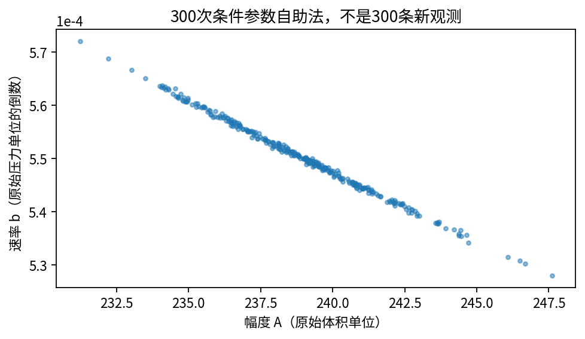

# DL082 答案：哪些结论真的来自数据

本答案使用随课NumPy实验的参考结果。精确数值见outputs/metrics.json，计时随机器变化。分析结论比逐位复现小数更重要，但明显数值偏差仍应先排查代码。

## 1 数据元信息

已知：NIST StRD Misra1a；Misra (1978)牙科单分子层吸附研究；14组Observed Data；x为压力、y为体积；官方给出指数饱和拟合公式、认证参数及残差平方和。原始文件1932字节，哈希见provenance.json，原始下载未修改。

未知：压力与体积的具体计量单位、仪器型号、标定增益、重复测量结构、逐点误差、实验批次与更完整领域条件。不能只凭数值范围把压力猜成Pa，因为改变单位会改变b，且不同实验可有同样的数值范围。

合格图轴应写“原始压力单位”“原始体积单位”。这种写法明确承认缺口，不等于已经做了完整量纲追溯。若要用于后续科学比较，应先查补原始实验元数据。

## 2 增益与幅度的结构等价

模型中g与A总是以gA出现。任意非零比例c，把A换成A/c、g换成cg，乘积不变，全部预测不变。因此即使观测没有噪声也无法只凭这些响应分开二者。

可补独立仪器标定以确定g，或加入另一个已知尺度的观测。增加同一种观测的采样密度和模型复杂度都不会破坏这个代数等价关系。正则化可偏好某组参数，但选择的来源是外部限制，不是新增了数据证据。

## 3 窄范围的近似等价

三组参数的Ab均为1.32。x很小时F≈Abx，第一阶项相同，差别从更高阶项开始。x=0.05时三者预测大约为0.0651、0.0642、0.0655，差异与本实验0.01的噪声相比很小。

x=5时预测分别约2.247、1.195、3.586，差别已很大，因为曲率与饱和幅度明显参与响应。因此扩展设计范围可以增加区分能力。这个判断依赖模型适用及实验可行性，不是未经领域评估就增加真实压力的建议。

## 4 剖面解

固定b，h_i=1−exp(−bx_i)。求导并令0：Σh_i(Ah_i−y_i)=0，得到Â=Σh_i y_i/Σh_i²。若b与x都很小，h近似bx，分母接近0，观测噪声容易被放大，得到很大的A并用很小的b补偿。

用expm1改善小指数的相减精度，但不能解决可辨识性不足。数值稳定函数能减少计算舍入，却不能增加观测信息，这是两个不同层次的问题。

## 5 重复噪声与边界碰撞

窄、中、宽设计的相对灵敏度条件数约735、42.2、7.22。窄范围约47.5%的b估计靠近搜索端点，A的重复估计上尾极大；宽范围A分位数约[2.386,2.415]，b约[0.5423,0.5576]，更接近真值。

这支持在本模型与噪声条件下，扩展覆盖范围改善辨识。它不说明任何现实任务都能无限扩范围，也不说明低条件数能保证模型正确。局部灵敏度与200次重复实验提供互补证据，不是同一件事的两种名字。

减小b下界可能使窄范围A上尾更大，因为沿Ab接近固定的方向，A可以继续增加。这恰好说明边界限制决定了一部分答案。应保留失败和边界样本，报告比例，而不是只保留“收敛漂亮”的结果。

## 6 正则化推导与错误先验

加入λ(A−A₀)²后，导数多出2λ(A−A₀)。因此：

$$\widehat A(b)=\frac{\sum_i h_i y_i+\lambda A_0}{\sum_i h_i^2+\lambda}.$$

默认正确先验A₀=2.4时，A中位数约2.39995；错误先验A₀=1.2时约1.20009，b中位数约1.116。后一组保持相近初始斜率，因此弱数据很难反驳它，虽然参数真值明显错误。

真实研究中的先验应来自外部标定、独立实验或可解释的领域知识，并报告敏感性。不能用未知真实答案选先验，也不能只凭区间变窄就宣布信息变多。合成中故意使用正确先验是教学对照，不能伪装成真实任务可获得的信息。

## 7 缩放与认证结果

原始压力p=1000x，原始体积v=100y。若缩放模型y=a(1−exp(−bx))，则v=100a[1−exp(−(b/1000)p)]。所以A_original=100a，b_original=b/1000。

全数据结果约(238.9421298,0.0005501564300)，SSE约0.12455138894，与NIST认证值吻合。它说明读取、缩放、优化和反变换正确，不能说明自然界参数恰好等于这些小数。认证的是指定数据上的数值优化结果。

## 8 留出比较能说明什么

低10点拟合后，高4点RMSE约为饱和模型0.555、直线3.873，单位是原始体积单位。真实响应在该区间逐渐弯曲，直线继续按低压斜率增长，因此外推误差更大。

可说本次固定高压留出比较支持饱和公式优于简单直线。不可说已验证所有压力或材料；不可说参数机制唯一真实；不可把全14点重拟合后的误差替换成留出误差；不可仅由4个点估计一个非常精确的泛化优势。

## 9 自助法区间的含义

残差标准差用sqrt(SSE/12)，约0.10188。300次条件参数自助法的百分位区间为A约[234.15,244.41]，b约[0.0005357,0.0005633]。这些区间取决于指数模型、固定压力、独立同方差高斯噪声与同一估计过程。

实际残差按压力只有3段同号连续区间（7正、5负、2正），是应该追查的结构信号。它可能涉及模型偏差或相关误差；这里没有正式检验或额外实验，不能确定原因。

区间没有包含未知增益、压力误差、模型错设、批次差异或单位不明。300次模拟也不创造300条新的现实观测。频率学置信区间的覆盖率是重复实验下程序的性质；本课未验证覆盖率，因而只称近似条件百分位区间。

## 10 结构约束、外推与守恒

正参数模型自动满足F(0)=0、导数Ab exp(−bx)>0以及F<A。这些性质来源于公式，而不是额外数据检验。压力2000处预测约159.43，仍然可能因为模型适用范围改变而错误。

本数据是静态压力与吸附体积曲线，没有足以闭合质量收支的流入、流出、初态或时间观测。因此无法检验质量守恒，应该写“不适用/此数据不可验证”。填0会暗示已测且严格守恒，属于虚假证据。若换成动态吸附系统，应另定义守恒方程与所需观测，再检查它。

## 11 一份合格研究摘要

我们在已知真值的指数饱和模型中发现，窄压力设计使A与b弱辨识，搜索边界和先验明显影响估计；扩展设计范围改善恢复。NumPy剖面最小二乘与NIST Misra1a认证数值一致，在预设高压力留出中优于直线基线。真实物理参数、噪声机制、单位和标定仍不完全已知，条件自助法不能覆盖这些缺口，远压力预测仅为模型外推。

最有价值的下一步是补齐单位与仪器标定、获取独立批次和更多有辨识力的观测，并由领域专家判断公式适用范围。只有当前向模型计算真正昂贵、数据规模与任务确有需求时，再研究神经代理或可微求解器，并把代理误差纳入逆问题不确定性。
