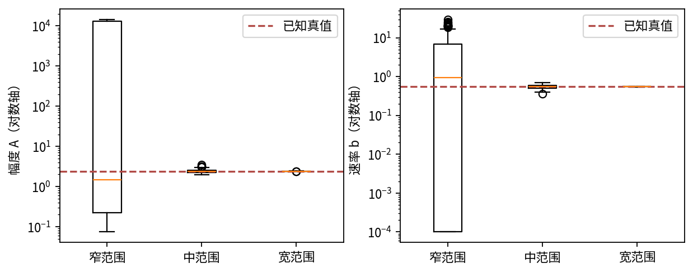

# DL082 实验：从拟合曲线到可信参数

目标不是让优化器输出一组漂亮数字，而是建立一条可核查的证据链：已知真值恢复、观测噪声、不可辨识反例、先验敏感性、真实数据校验与有限外推。建议用90–150分钟完成阅读与操作，默认计算通常数秒至数十秒。

## 1 环境与第一遍运行

在本讲目录中创建Python 3.11或3.12虚拟环境，然后运行：

```bash
python -m venv .venv
source .venv/bin/activate
python -m pip install -r requirements.txt
OPENBLAS_NUM_THREADS=1 python experiment.py
python -m unittest -v test_experiment.py
python make_figures.py
python execute_notebook.py experiment.ipynb
```

requirements.txt包含依赖版本。计算仅依赖NumPy，图使用Matplotlib；Notebook用真实IPython内核逐格执行并保存输出，不需要浏览器或付费服务。数据原始文件已随课保存，默认运行不联网，不发送数据到第三方。

outputs/metrics.json保存主要统计量，outputs/fits_*.csv保存每种设计200次参数估计，outputs/real_bootstrap.csv保存300次真实数据条件自助法结果。data/synthetic_*.csv保存真值曲线与最后一次噪声抽样，仅用于查看数据形态，不代表整个200次样本全部在该文件中。

## 2 先核对数据身份

真实数据文件是data/Misra1a.dat，为NIST原始ASCII下载，1932字节。data/provenance.json包含下载地址、日期、SHA-256与变量信息。先运行测试确认文件未被改写，再打开它看原始说明。不要先用电子表格另存，否则换行符改变也会使哈希变化。

真实数据有14条，原始顺序为体积y、压力x；程序read_real返回时改为压力、体积，这是最容易把列弄反的位置。压力范围77.6到760.0，体积10.07到81.78。官方标为Observed Data，和课程自行生成的synthetic文件属于不同来源。

题1：请列出已知与未知元数据。已知包括变量含义、记录数、来源和数学拟合式；未知至少包括具体单位名称、逐点测量误差和仪器标定。解释为什么不能因为压力像某个常见数量级就直接标成Pa。

## 3 用手算识别等价参数

写出带增益的模型y=gA(1−exp(−bx))。题2：证明(A,g)与(A/2,2g)对任何x给出相同输出，指出需要补测哪个量才能分开它们。

在Notebook中运行gain_equivalence_max_error检查，应为浮点零。这个结果是公式等价，不是训练碰巧得到近似值。把网络加宽、加深或者换优化器不会改变这项信息论限制。

再固定g=1，比较(A,b)=(2.4,0.55)、(1.2,1.10)、(4.8,0.275)。三者初始斜率Ab都等于1.32。题3：在x=0.05和x=5分别算预测并比较，解释窄观测范围为什么难分开它们。

## 4 实现剖面最小二乘

固定b，记h=1−exp(−bx)，损失Σ(Ah−y)²对A求导为2Σh(Ah−y)。令其为0可求出A。题4：独立写出这个解析解，并说明分母太小时为何数值敏感。

读取fit函数。它用log b在[log 10⁻⁴,log 30]粗扫180个点，再在最佳点附近细化65步。用expm1计算exp(z)−1，避免小z时先算指数再相减损失精度。这里是实在的参数优化，不是从认证结果把答案硬编码进模型。

测试包括无噪声真值恢复、灵敏度导数中央差分和NIST认证结果比较。请故意交换真实数据列一次，观察测试如何失败，然后恢复。没有报错只能证明语法可运行，不能证明观测方向正确。

## 5 三种范围，同样24点

合成真值A=2.4、b=0.55，噪声标准差0.01，固定种子82。窄、中、宽压力范围上限分别为0.05、0.8、5，下限0.005。每种范围独立重复200次。

题5：记录每种设计的参数中位数、2.5%与97.5%分位数、相对参数RMSE、灵敏度条件数和b碰到搜索边界的比例。不要只报告预测误差，因为几条预测曲线可能相近而参数完全不同。

默认窄设计条件数约735，b边界碰撞比例约47.5%；宽设计条件数约7.22，参数估计围绕真值紧密分布。边界碰撞说明当前搜索限制正在决定部分答案，应当报告而不是删掉这些“难看”的重复实验。



扩展A：将噪声标准差依次改为0.001与0.03。要把噪声常量也更新到报告，不要只改代码却保留旧图注。预测哪个设计最先失去稳定识别，并解释原因。

扩展B：将b下界从10⁻⁴改为10⁻⁵，观察窄设计的A上尾如何变化。这个敏感性用于展示约束依赖，不能把新的更宽范围自动解释为更科学。

## 6 正则化是否在替数据说话

窄设计中比较三种拟合：无正则；λ=0.002且A₀=2.4；同样λ但A₀=1.2。所有版本在同一次噪声观测上拟合，所以这三种策略是配对比较。

题6：推导带罚项后的A解析解。记录两种先验下估计A的中位数及分位数，解释为什么错误先验也能产生非常稳定的结果。最后回答：如果真实数据没有已知A，应该凭什么选A₀？“让结果更好看”不是合格理由。

若使用交叉验证选择λ，应把选择过程写入报告；弱可辨识时预测验证也未必能正确区分参数，因此还要看先验敏感性与外部标定。不要把合成真值泄露给真实任务的先验选择。

## 7 真实数据：验证计算正确性

全14点拟合之前，先明确缩放x=pressure/1000、y=volume/100。题7：若缩放参数为(a,b)，推导原始参数换算。输出应接近A=238.942129、b=0.000550156432，残差平方和0.124551389。

NIST原始文件含认证参数与目标值。测试比较这些数字，是验证求解器的数值结果；它不把这些参数作为自然界真值，也不把它们当训练标签。你应在报告中分开写“认证最小二乘值”与“物理真实参数未知”。

画原始点、全数据拟合和残差。注意本次残差按压力出现“前7点正、接着5点负、末2点正”的3段同号结构。请把这个信号写入报告：它提示模型偏差或相关误差值得追查，但14点与拟合后的残差不能单独确定原因，不能直接声称已证明噪声独立高斯。

## 8 高压力留出与线性基线

按原始压力排序，低10点训练，高4点保留。饱和模型和带截距直线都只拟合低10点。题8：计算四点RMSE，解释为什么饱和模型约0.555，而直线约3.873；同时给出不能据此作出的两项结论。

数据少，只有一次固定划分，结果不代表跨材料泛化。这里刻意测的是比训练压力更高的范围，所以称为小型外推检查。若随机拆分相邻压力点，你回答的会是不同问题。

程序随后用全14点做最终拟合与自助法，这一步应独立标记。禁止把全数据模型在高4点的误差伪装成先前留出结果。查看real_predictions.csv中的full_fit与low_pressure_fit两列，确认你画的是想报告的那一列。

## 9 条件自助法与模型外推

以全数据估计θ̂和残差σ̂为基准，生成y*=F(x;θ̂)+高斯噪声，再拟合300次。题9：把A与b的百分位区间写出来，解释它覆盖了哪类随机性，又遗漏了哪类不确定性。

不要写“真实A有95%概率在该频率学区间”，更不要把bootstrap抽样次数300误认为真实样本数300。真实观测仍只有14条，新增样本只是模型假设下的模拟。

最后查看压力2000处预测。该值约159.43原始体积单位，超出观测上限760，没有真值用于验证。题10：为什么F(0)=0、单调和饱和都成立，仍不能证明远距离外推可靠？守恒为何报告不适用，而不是填0？

## 10 研究报告模板

报告依次写：科学问题与待估参数；观测模型与单位；已知元数据与缺口；结构/实际辨识诊断；优化与搜索边界；合成恢复及先验敏感性；真实数据来源与数值认证；固定留出基线；条件不确定性；外推与守恒限制。

至少附一张参数恢复图、一张真实残差图、完整指标和可运行命令。最后提出一个信息价值最高的下一步，例如获取单位与标定元数据、增加独立批次或扩大安全可测范围。不要只写“用更大网络”。

评分建议：观测模型与来源20%，推导与测试20%，合成/正则分析25%，真实验证与基线25%，结论边界10%。把合成数据称真实、把认证参数当物理真值或省略单位缺口，都属于关键错误。
