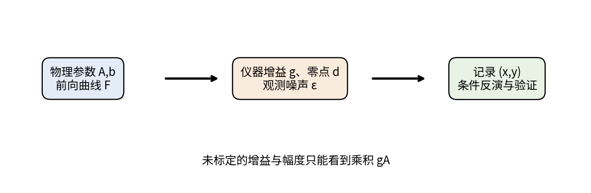
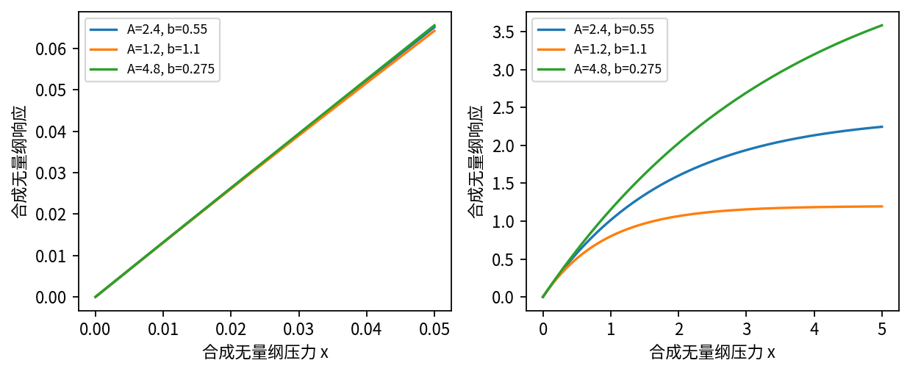
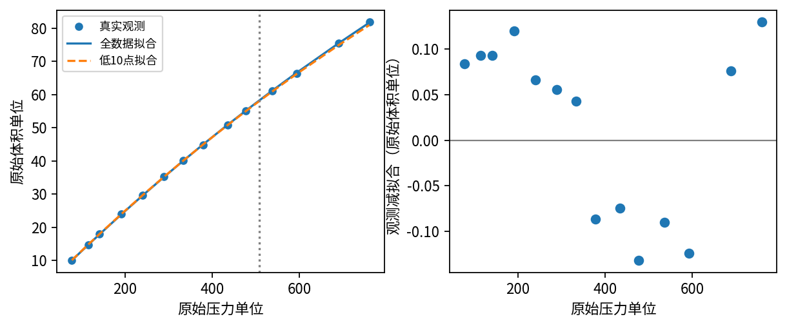

# DL082 科学数据与逆问题研究

**发行序号082，对应原大纲S5。先修：022、071、S3。** 本讲研究一个比“拟合得好不好”更深的问题：观测稀疏、有噪声时，哪些参数真的由数据决定，哪些只是算法或先验替我们选出的答案？

我们先创造有已知真值的合成世界，再验证一组公开真实观测：NIST StRD Misra1a的14组压力与吸附体积记录。两者始终分开。实验只用NumPy做真实数值优化、重复噪声模拟和自助法，不用付费API。传统拟合本身就是必须打牢的科学机器学习基线；本讲不为了“深度学习”标题强加没有必要的网络。

## 1 正向问题与逆向问题

正向问题从机制和参数推到可观测结果。例如给定饱和幅度A与速率系数b，在压力x下预测吸附体积：

$$F(x;A,b)=A(1-\exp(-bx)).$$

当x=0时结果为0；压力增加，曲线先增长，再逐渐接近A。A有体积单位，b有压力单位的倒数，bx必须无量纲。若x是时间而非压力，同一数学形式也可描述某些动力学，但那是不同领域模型，不能只因公式相似就偷换物理含义。

逆向问题从若干(x_i,y_i)反推A与b。我们能测到曲线上的点，却不知道产生这些点的参数。优化程序总能努力给出一组数字，但“返回数字”不等于“信息足够”，更不等于“机制已被证明”。

本例正向模型很简单，足以明确区分三个问题：计算算法是否实现正确，参数能否从给定实验设计恢复，模型是否足以描述真实观测。一个问题通过，不会自动使另外两个也通过。

## 2 观测模型比拟合函数多一层

理想曲线F不是仪器直接交给我们的全部。更完整的观测式可写：

$$y_i=gF(x_i;A,b)+d+\varepsilon_i.$$

g是仪器增益，d是零点偏移，ε是随机误差；压力本身也可能有测量误差。本课默认拟合设g=1、d=0，并把x当作精确已知。这个简化在实验中便于计算，却不是从真实数据自动证实的事实。

若噪声为独立、同方差、零均值高斯，最小二乘相当于最大化相应似然。若不同压力的噪声方差不同，应考虑加权；若x也有误差，普通“只惩罚y方向差”的目标不再完整。若存在批次漂移，独立假设也可能不成立。

因此研究报告应该先写出观测过程，再写损失。否则网络可能把传感器偏差当作物理规律，而较小训练误差会掩盖这个混淆。本课真实数据原始文件没有逐点误差、重复实验、标定记录或具体单位名称，我们会明确保留这些缺口。

## 3 结构不可辨识：无限多数据也救不了

如果g未知，观测中只出现乘积gA。把A减半、g加倍，所有压力的预测完全不变：

$$gA(1-e^{-bx})=(2g)(A/2)(1-e^{-bx}).$$

这叫结构不可辨识。即使没有噪声、即使观测连续整条曲线，仅凭这种数据也无法把仪器增益和真实饱和幅度分开。你可以优化出其中一组，但不存在来自这些观测的理由说明它比等价组更真实。

实验直接比较(A,g)=(2.4,1)和(1.2,2)，在101个位置的最大预测差为0。这个例子不依赖优化器，因而比“换种子拟合结果不稳定”更能直接说明模型结构的问题。

恢复A需要外部信息，例如独立标定g、另一个已知尺度的测量或可信物理约束。把模型换成更深网络或训练更多轮，不能凭空创造缺少的标定信息。先验也可选出某组解，但应说清楚选择来自先验。

## 4 实际不可辨识：有唯一答案却很难分清

现在假定g=1、d=0，A和b原则上可以由足够丰富的曲线识别。但如果只测很小的压力范围，利用指数的一阶近似：

$$1-e^{-bx}\approx bx,\qquad F(x;A,b)\approx Abx.$$

观测主要告诉我们初始斜率Ab，而不是A与b各自的大小。稍微增加A、同时减少b，短区间曲线仍可几乎重合。在无限精度的足够观测下，细小曲率可能区分它们；有实际噪声时，这个信号却可能被淹没。这叫实际不可辨识或弱辨识。

“样本数不够”和“实验设计信息不足”相关，却不是同义词。若始终重复同一压力，再多点也很难分开曲线的不同部分。增加覆盖曲率与接近平台的观测往往更有帮助，但实际压力范围受安全、仪器与领域条件约束，本课不提供真实实验操作建议。

## 5 用灵敏度理解“长而窄的谷底”

灵敏度矩阵J把每个观测对每个参数的导数排成表。一列表示稍微改变A时整组预测怎样动，另一列表示稍微改变b时怎样动。若两列方向几乎相同，就很难判断观测变化由谁造成。

参数有不同单位，直接比较原始列会受单位选择影响。本实验使用对log A、log b的导数，表示相对参数改动：

$$\frac{\partial F}{\partial\log A}=F,\qquad \frac{\partial F}{\partial\log b}=Abx e^{-bx}.$$

两列的单位都与输出相同。奇异值分解能找到预测最敏感和最不敏感的参数组合。最大奇异值除最小奇异值称为这里的条件数；越大意味着某些相对参数方向在观测中越难分辨。它是特定点、特定设计、特定参数化的局部诊断，不是万能的可辨识性证明。

本例同样24个点，压力范围从0.005到0.05、0.8、5时，真值处条件数约735、42.2、7.22。小条件数不保证模型真实，只说明在这个模型和局部区域，参数对预测的影响更容易区分。

## 6 用有真值的世界先校验方法

合成实验真值为A=2.4、b=0.55，所有量无量纲。每个设计都有24个点，添加标准差0.01的独立高斯噪声，重复200次。三种设计使用独立噪声抽样，并非严格配对的同一组噪声；种子固定为82以便复现。

窄范围中，A的2.5%到97.5%重复估计分位数大约从0.087到14165；近一半估计碰到b搜索边界附近。如此夸张的区间不是自然界参数会变这么大，而是数据和约束不足以稳定选定参数。边界限制为b∈[10⁻⁴,30]，上面数字依赖此限制，不能当作无约束估计的完整抽样分布。

中范围中，A的重复分位数约[2.08,2.94]；宽范围中约[2.386,2.415]，围绕2.4更集中。b也随范围扩展恢复得更稳定。这里的分位数描述“已知真值下重复采样的估计分布”，不是从某一个实验自动得到的置信区间。

合成验证能发现优化错误、偏差、约束边界和不确定性行为。但生成与拟合用同一个公式是理想条件，真实世界可能有模型误差、非高斯噪声或隐藏变量。因此合成通过是必要的计算自检，不是现实模型验证的终点。

## 7 不用大型优化库也能诚实求解

固定b时，定义h_i=1−exp(−bx_i)，预测是Ah_i，损失对A是一个二次函数。对A求导并令其为零可得：

$$\widehat A(b)=\frac{\sum_i h_i y_i}{\sum_i h_i^2}.$$

把它代回损失，就只剩一维b搜索，称为变量投影或剖面优化的一个简单例子。代码先在log b上粗扫180个点，找到较好区间，再用黄金分割细化65步。使用log b保证b为正，同时更均匀覆盖多个数量级。

代码限制b为正，但A的解析式没有额外截断；本次数据的估计A均为正。如果另一批噪声数据导出负A，就必须按物理含义重新设定约束并检查边界效应，不能继续把它称为正参数吸附模型。

这不是对任意非线性目标保证全局最优的通用算法。粗扫描可能漏掉非常窄的更好谷底，黄金分割也要求所在区间局部适合单峰搜索。因此我们用已知真值恢复和NIST认证数值核对实现，而不是仅依据“程序没有报错”。

本课把传统非线性最小二乘当主方法，并另设线性外推基线。未来若使用网络近似昂贵前向模型，要先量化代理模型误差如何传到参数；网络更灵活可能进一步扩大等价解释空间，并不天然改善辨识。

## 8 正则化减少波动，也可能稳定地偏错

加入对A的二次先验罚项：

$$L(A,b)=\sum_i(F(x_i;A,b)-y_i)^2+\lambda(A-A_0)^2.$$

A₀是先验中心，λ是强度。固定b的解析解改为(Σh_i y_i+λA₀)/(Σh_i²+λ)。罚项让一条平坦谷底里某些位置更受偏好，能改善数值稳定，但这种偏好包含了数据之外的信息。

窄设计下，本实验λ=0.002；若A₀=2.4恰好等于真值，估计A几乎固定在2.4，看起来非常成功。可是把先验中心改成1.2，估计A也几乎固定在1.2，b约变为1.12来保持相近初始斜率。结果稳定，却偏离真值。

因此不应把“加了正则后方差小”写成“数据证明参数准确”。合格报告需要说明先验来源、参数化、强度选择，以及换一个合理先验是否改变结论。数据弱时，先验敏感性本身就是研究结果。

## 9 真实数据验证：NIST Misra1a

原始资料把Misra1a标为Observed Data，而非Generated Data；它来自Misra (1978)的单分子层吸附牙科研究，包含14组响应体积与预测变量压力。[1] 我们保存下载的原始ASCII字节及SHA-256，课程内可离线运行，不依赖服务继续在线。

必须明确资料缺口：原始文件给出变量含义，但没有标明压力和体积的具体计量单位。因此图轴写“原始压力单位”“原始体积单位”，不擅自标成Pa、mL或其他单位。原始数据也未提供每点误差条和标定过程，所以后面的同方差高斯分析属于条件假设。

为改善数值尺度，代码令x=原始压力/1000、y=原始体积/100。这里1000和100只是公开固定的数值缩放，不代表改换成某个已知SI单位。恢复原始参数时，A_original=100A_scaled，b_original=b_scaled/1000。

全14点拟合得到A约238.94213、b约0.00055015643，残差平方和约0.12455139，与NIST认证数值一致。这个结果首先验证计算程序正确实现了该最小二乘问题；它没有独立证明吸附机制，也没有证明仪器没有系统偏差。

残差图还有一个值得追查的信号：按压力顺序，前7点残差为正，随后5点为负，末2点再为正，共3段同号连续区间。这种形态提示公式偏差或相关误差的可能性，不能只因SSE小就跳过检查；14点和拟合后的残差不足以单独确定原因，也没有在此进行正式显著性检验。

NIST的认证参数是这份数据和指定目标下的高精度数值参考，不是自然界A、b的已知真值。把“匹配认证解”写成“恢复真实物理参数到十位小数”，是本讲要避免的重要错误。

## 10 把外推检查与最终拟合分开

我们事先按压力排序，用最低10点拟合，保留最高4点检验。它是一个小型高压力外推检查，不是随机同分布泛化测试。模型和划分在比较前固定，未把保留点用于选公式或超参数。

饱和模型在4个保留点的RMSE约0.555原始体积单位；含截距直线基线约3.873。两者都只在低压力10点拟合。这支持“在这次预设检查里饱和曲线比简单直线更适合外推”的有限结论，不支持跨所有材料和压力的普遍优越性。

完成这个固定比较后，再用全14点给出最终参数与不确定性分析。因此全数据的拟合残差不应与保留集误差混写；它是重新利用全部已知观测后的描述性结果。若后来根据保留集更改模型，该保留集就不再是独立最终评价。

我们还报告压力2000处预测约159.43，但没有该处观测，不能算准确率。公式在正参数下满足F(0)=0、单调递增且不超过A，这些是模型结构约束，不是独立实验证据。真实数据没有流入流出或时间过程，因此无法检验质量守恒；报告“守恒不适用/无法由该数据验证”比编造一个守恒分数诚实。

## 11 条件不确定性与遗漏的不确定性

真实数据残差标准差估计为sqrt(SSE/(14−2))，约0.10188原始体积单位。参数自助法固定观测压力，围绕全数据拟合曲线加入该高斯噪声，重新拟合300次；分别取参数2.5%和97.5%分位数。

这次条件百分位区间为A约[234.15,244.41]、b约[0.0005357,0.0005633]。它表达在所用噪声、模型、设计及估计程序下的近似不确定性。300次仍有Monte Carlo误差，本课没有验证其频率学覆盖率，不能保证“真实参数有95%概率在里面”。

该区间没有包括未知单位、仪器增益、压力误差、模型误差、批次差异和未观察压力区间的结构改变。区间窄不能证明这些因素不存在。若未来要作科学决策，应优先补足元数据与独立验证，而不是只增加自助法次数。

## 12 把逆问题写成可反驳研究

研究第一步是界定问题：要恢复哪些参数、单位是什么、哪些量真的可观测。第二步是明确假设：前向方程、观测算子、标定、噪声、边界和适用范围。第三步用结构分析和灵敏度判断信息是否足够，再选择优化与正则化。

随后在合成真值中检验恢复、边界碰撞、重复噪声和先验敏感性。再进入真实数据，用独立验证、残差形态与合理基线检查模型。最后把数值精度、参数辨识、模型可信度和领域结论分成四层报告。

领域知识不能由这门课程替代。吸附、成像、天体物理或生物实验各有自己的采样、仪器和机制。深度学习可以提供表示与计算工具，但对于没有测量的信息，仍应说“不知道”。可信科研不只在于给出一个漂亮估计，更在于知道哪些变化会推翻它。

## 文献与数据来源

[1] Misra, D. (1978). Dental Research Monomolecular Adsorption Study. NIST StRD Misra1a： https://www.itl.nist.gov/div898/strd/nls/data/misra1a.shtml 。原始文件： https://www.itl.nist.gov/div898/strd/nls/data/LINKS/DATA/Misra1a.dat 。访问2026-10-10。

[2] NIST. Copyright, Fair Use, and Licensing Statements. https://www.nist.gov/open/license 。本讲保留归属、无担保声明及许可边界，详见DATA_LICENSE.md；不将一般NIST数据与受特别版权保护的SRD产品混同。

[3] Raue et al. (2009). Structural and practical identifiability analysis of partially observed dynamical models by exploiting the profile likelihood. Bioinformatics 25, 1923–1929. https://doi.org/10.1093/bioinformatics/btp358 。帮助理解结构与实际可辨识性的区别，本课静态例子为原创教学实验。

[4] Golub and Pereyra (1973). The Differentiation of Pseudo-Inverses and Nonlinear Least Squares Problems Whose Variables Separate. SIAM Journal on Numerical Analysis 10, 413–432. https://doi.org/10.1137/0710036 。变量分离的数值背景。
