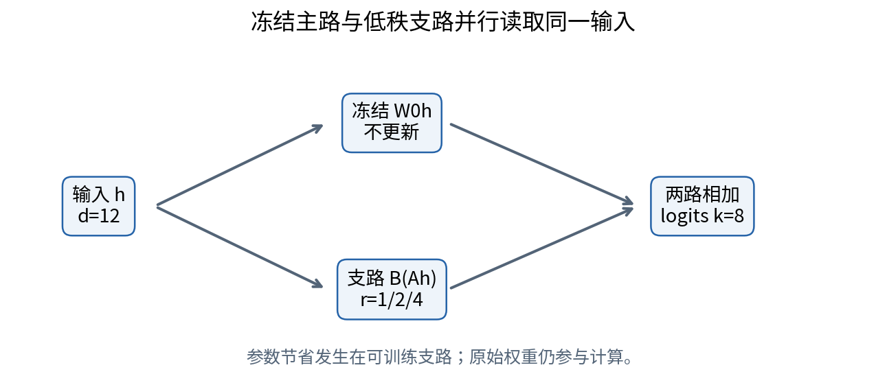
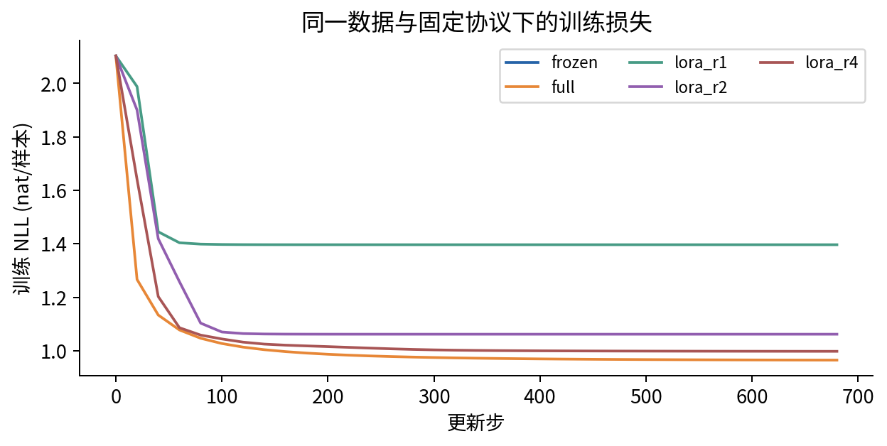
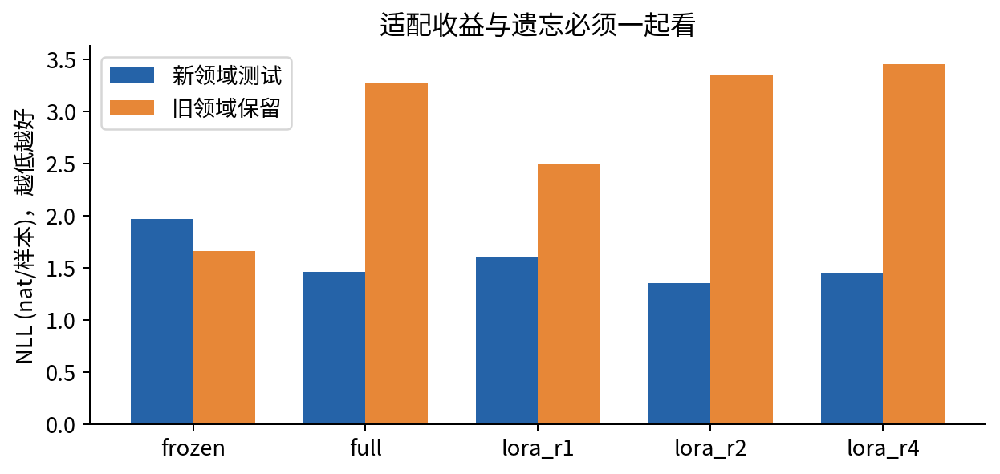

# DL083 语言模型适配与参数高效微调

**对应大纲 L1。先修：013、041、054。** 学习目标：能写出带答案掩码的监督微调目标，手算低秩更新的形状与参数数目，解释冻结、合并与遗忘，并设计不会把测试答案偷偷教给模型的比较。

本讲采用“问题—模型—推导—反例—实验”的顺序。想象你有一个已会写一般文字的模型，希望它按研究组格式输出结构化摘要。你不一定需要重新教它所有语言知识；可能只需要调整一小部分计算。但“小部分”应该由什么来定义？改变哪些参数，保留什么证据，怎样确认原有能力没有受损？这些才是微调研究的起点。

实验不下载第三方权重，不使用商业 API。我们自己生成一个八词输出、十二维上下文的微型条件语言模型。它只完成一次下一词预测，**不是 Transformer、不是预训练大语言模型，也不验证真实摘要质量**。选择它是为了让每个梯度、每次更新和每个失败都能核验。真实模型扩展是独立研究计划，不是已完成的结果。

## 1 先把“适配”说清楚

适配是改变模型在某类输入下的输出行为。它可能涉及术语、输出格式、领域知识、风格或任务策略，但这些目标不能互相替代。模型输出合法 JSON 不代表字段事实正确；语气更像某位作者不代表推理更可靠。应先定义一个能检查的目标，例如“对留出的实验记录，准确提取温度、样本量和结论，并对缺失字段写 null”。

冻结模型指保持原参数不变。冻结基线仍可以使用相同提示和相同解码规则。全量微调允许被选定模型的全部参数更新；在本实验里模型只有一个输出矩阵，因此“全量”明确限于这96个数。参数高效微调只训练一个较小参数集合，例如新增的低秩矩阵。可训练参数少，是一种资源与假设上的约束，不是泛化质量保证。

适配不一定是正确方案。若事实经常变化，检索可能比反复微调更便于更新与追溯；若模型只是没遵守格式，提示或受约束解码值得先做基线；若训练例子本身互相矛盾，扩大模型只会使问题更难解释。研究问题应允许“没有必要微调”这个答案。

## 2 从一句示范到一个损失

一个监督样本由提示 x 和理想回答 y 构成。回答通常含多个 token，即分词后的离散符号。模型依次预测回答第 t 个 token，条件是完整提示和先前回答 token。设参数为 θ，则答案部分的负对数似然是：

$$L=-\frac{1}{M}\sum_{i,t}m_{i,t}\log p_\theta(y_{i,t}\mid x_i,y_{i,<t}).$$

i 是样本编号；t 是答案位置；m 是0或1的损失掩码；M 是所有掩码之和，而不是批次大小。若仅训练回答，提示、填充位置的 m=0，回答 token 的 m=1。概率越接近正确 token，负对数越小。分母决定每个有效 token 平均的含义，必须与实现一致。

这里“忽略提示的损失”不等于“提示不参与计算”。提示仍影响答案预测，答案的梯度仍可沿提示的中间表示传播。应区分 loss mask、attention mask 与冻结参数：前者决定在哪些输出位置计分；attention mask 决定哪些位置可以互相读取；冻结决定哪些参数可被更新。三者名字相近，却改变不同对象。

手算例：两条回答分别有1和3个有效 token，四个 token 的损失为0.2、0.3、0.4、0.5。按 token 平均为0.35；若先把每条回答平均再平均，结果是(0.2+0.4)/2=0.3。二者不是谁天然正确，而是给短回答和长回答分配的权重不同。本实验只预测一个 token，避免长度混淆；扩展时必须显式记录归约。

## 3 用一个小矩阵看懂大模型的局部计算

把输入特征写成列向量 h，有 d 个数。输出向量 z 有 k 个数，称为 logits，即未经归一化的分数。最简单的映射为 z=Wh，其中 W 有 k 行、d 列。softmax 把它变成非负且总和为1的分布：

$$p_j=\frac{\exp(z_j)}{\sum_{q=1}^{k}\exp(z_q)}.$$

j 是候选 token 编号，q 是求和时的遍历编号。每个输入都产生一个 k 类分布。直接算很大的指数会溢出，因此程序先从所有 z 中减去最大值；分子分母同乘一个常数，概率不变。减去最大值是数值稳定手段，不是改变模型温度。

实验使用批次矩阵 X，形状为 n×d，一行一个输入。对应 logits 写成 XW 的转置形式 XWᵀ，形状 n×k。讲义按列向量讲概念，代码按行存样本，两种约定等价，关键是明确转置。请先在纸上写出(240×12)(12×8)=(240×8)，再读训练循环。

## 4 低秩更新：限制的是改动，不是原矩阵

设已有权重为 W₀。LoRA 把新增改动表示为两个小矩阵的乘积：

$$W=W_0+sBA,\qquad s=\alpha/r.$$

A 的形状 r×d，先把输入压到 r 维；B 的形状 k×r，再把它展开到 k 维。r 是用户选定的内部维数，α 是缩放超参数，s 为实际乘数。本实验固定 s=1，即 α=r，便于不混入缩放差异。原矩阵 W₀ 不要求低秩，低秩的是 ΔW=sBA。乘积的秩至多 r，表示所有新增输出变化都由至多 r 个方向组合。

全量矩阵有 kd 个可训练数，低秩分支有 r(d+k) 个。取 d=12、k=8：全量为96，r=1为20，r=2为40，r=4为80。若 r=8，则低秩分支有160个数，反而更多。因此“LoRA 一定省参数”需要 r(d+k)<kd 的条件。大矩阵更容易满足，小矩阵未必。

低秩因子并非唯一：对可逆 r×r 矩阵 C，(BC)(C⁻¹A)=BA。因此因子总数不是相互独立的有效自由度。课程用参数数目估算存储；若讨论统计复杂度，还要考虑这种非唯一性以及优化、正则化和数据分布，不能简单把参数数目当作泛化误差。

## 5 手推梯度，理解零初始化

把损失对有效矩阵 W 的梯度记为 G，形状 k×d。使用矩阵链式法则：

$$\frac{\partial L}{\partial B}=sGA^T,\qquad \frac{\partial L}{\partial A}=sB^TG.$$

先核对维度：G(k×d)乘Aᵀ(d×r)得到k×r，与B一致。Bᵀ(r×k)乘G(k×d)得到r×d，与A一致。代码先计算两个梯度，再同时更新，避免用已经改变的 B 计算 A 的梯度。

通常让 A 为小随机数、B 为0。此时 BA=0，起始模型恰好等于原模型；第一步 A 的梯度为0，但 B 的梯度一般不为0。下一步 B 不再为0，A 也开始学习。若 A、B 同时为0，两个梯度都会为0，优化将卡住。这个反例比记住“初始化要随机”更有用：你能直接从链式法则判断原因。

本实验对完整矩阵和低秩因子的若干坐标做中心差分。对某个参数 w，加减很小的 ε，计算两个损失差再除以2ε，应接近解析梯度。这里 ε=10⁻⁵，检查七位小数左右的一致性。差分太小会受浮点误差影响；太大则不再是局部近似。一次梯度检查不是所有输入都正确的证明，但能捕捉常见转置和符号错误。

## 6 合并、冻结与存储要分别检查

推理时，在纯线性加法条件下，可预先计算 W_merge=W₀+BA。于是 h 的两条路径之和，等于一次合并后的矩阵乘法。本实验逐元素比较两种 logits，误差应在浮点容差内。它验证的是当前实现的代数等价，不是整个真实服务“零额外延迟”的实测证明。

若训练时使用 dropout，合并应针对推理模式，而不是带随机掩码的训练表达式。若原权重以低位整数存储，合并后再量化可能引入新的舍入误差；不同计算内核也有数值差异。不能把精确实数等式直接变成任意硬件上的逐位相同承诺。

“冻结”应通过权重前后相等核验，而不是只看配置写了 frozen。优化器误包含原权重、错误的原地操作或保存加载失配都可能破坏约束。本实验保留输入 W₀ 副本并测试其不变，输出 weights.npz 供复查。训练后的 adapter 也必须和正确版本的底座绑定，不能任意混用。

## 7 量化和训练精度不是一回事

量化把连续权重映射到有限离散数值。例如用比例 c 和整数 q 近似 w≈cq。存储位宽描述保存 q 需要多少位；计算 dtype 描述乘加时使用什么数值格式；优化器状态可能又是第三种精度。把“4位存储”理解为“所有梯度都只有4位”是概念错误。

本讲不实现 QLoRA，不作其显存复现。为了把概念讲清楚，实验统一使用 NumPy float64，每个元素8字节。报告 trainable_float64_bytes 只统计可训练参数数组，不包含梯度、优化器、中间激活、W₀、Python 开销，也不是 GPU 峰值显存。真实扩展应使用065的测量方法报告峰值资源与稳态吞吐。

少参数通常降低某些状态存储，却不保证所有成本同比例下降。主路的前向计算仍要执行；若下游梯度需要经过冻结层，也可能保留或重算中间表示。实践中应把“数学上的参数减少”与“设备上的时间和内存减少”分开列证据。

## 8 一个能够暴露遗忘的实验世界

实验先由固定随机种子83生成 W₀，再构造一个秩至多2的真实领域改动。训练240条新领域样本，用独立120条新领域样本评价；另有360条旧领域样本，其标签仍由 W₀ 生成。标签按概率抽样，故即使知道生成模型，也不能百分之百准确预测每次随机结果。

输入第一维标记领域：新领域为+1，旧领域为−1，其余维度是随机上下文特征。真实新领域改动不使用第0列，但模型并没有一个非线性的领域路由器。它共享同一矩阵，因此在新领域学习可能损害旧领域。这是特意构造的结构性冲突，不应被描述成真实语言模型遗忘幅度的预测。

训练只读取新领域训练集。冻结、全量、秩1、秩2、秩4使用相同拆分、相同步数上限和基础学习率，比较的是这个固定教学协议。相同步数不等于相同 FLOPs，统一学习率也不等于各方法都获得最佳调参。严肃研究应在独立验证集上给各方法可比搜索预算，然后锁定测试。

## 9 怎样阅读结果而不过度解释

冻结模型在本次新领域测试的负对数似然约1.967，全量更新约1.457。单看这两个数，可以说在固定合成测试上全量适配提高了下一词概率质量；不能说它更会科研。旧领域负对数似然却从约1.663变为3.281，说明适配收益伴随明显遗忘。

秩2分支有40个可训练数，少于全量96个，但是否更好要同时看新领域与旧领域。请以 outputs/metrics.json 中的实际数字为准。我们不预设 LoRA 必须赢；若某个秩训练误差低、测试误差高，就应讨论过拟合而非挑选有利指标。

准确率只看最大概率的 token，负对数似然看分配给真实 token 的概率。二者可能不同向变化。一个样本中，正确 token 概率从0.45升到0.49但仍非最大，准确率不变，负对数似然改善；从0.51降到0.01则可能只少一个正确，却使概率损失恶化很大。研究报告应提前决定主指标。

## 10 把实验扩展为真实语言模型研究

若具备资源，选一个许可允许下载和微调的小模型，记录精确版本、分词器、聊天模板和许可证；冻结测试问题，按来源分组拆分，避免同一文档改写后跨越训练与测试。确保 prompt 不含目标答案，也不把正确回答无意拼进模型输入。只在答案位置计算损失，检查结束 token 是否参与。

比较冻结、LoRA 与可承担的全量更新。为各方法设定相同数据与调参预算，报告训练 token 数、训练时间、峰值显存、推理延迟、格式正确率、任务准确率与一组旧任务保留分数。至少重复多个种子，并说明计算预算限制。若全量超出资源，可明确报告“未运行”，不能填一个估计值假装公平对照。

研究假设可以是“在有限标注下，低秩约束减少领域过拟合”，但要有一个能反驳它的结果：例如全量在相同预算下测试表现更好、遗忘不更重。需要保存失败案例，并检查秩、目标层、数据量和标签噪声是否改变结论。一个课程实验是研究能力的练习，不应包装成已经得到可发表新发现。

## 11 常见误区与自检

- 把低秩更新误认为底座低秩：检验的是 W−W₀ 的秩。
- 把 loss mask 当作注意力屏蔽：提示仍可为答案提供上下文。
- 两个因子同时零初始化：链式法则表明梯度也同时为零。
- 把 adapter 文件大小当峰值显存：必须计入底座、激活与状态。
- 只报新领域收益：增加旧领域保留评价，并预先定义允许退化幅度。
- 根据测试集挑秩：另设验证集，最后只对锁定方案使用测试集。
- 把本课模型叫真实 LLM：它是合法原创的微型条件概率模型，证据只限于矩阵适配机制。

## 12 本讲结论

微调研究不是“调用训练器然后看分数”。应从样本格式与损失掩码出发，把参数化、梯度、冻结、数据拆分、资源边界和保留能力连成可核验的链。LoRA 提供一种低秩更新约束；它能减小可训练参数集合，但实际质量、成本与遗忘仍需实验。

延伸阅读见 sources.md：LoRA 原论文用于方法出处，所有教学数据、图与推导示例均为本课程原创。下一讲把监督标签换成环境奖励，建立策略梯度，之后再讨论偏好后训练。
