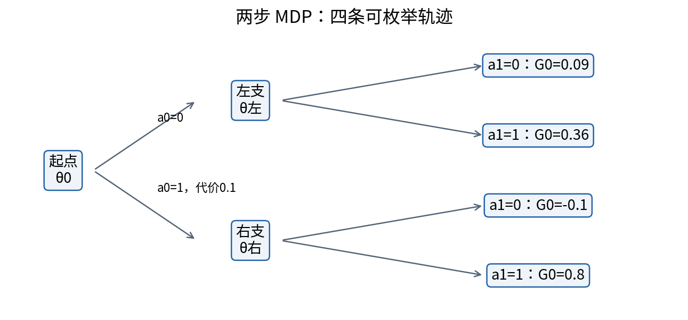
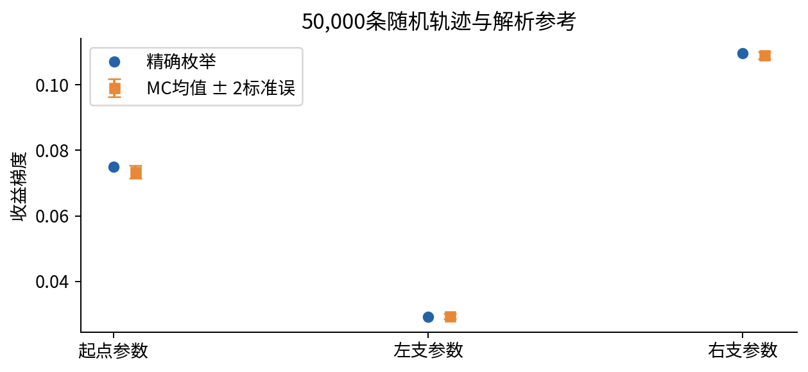
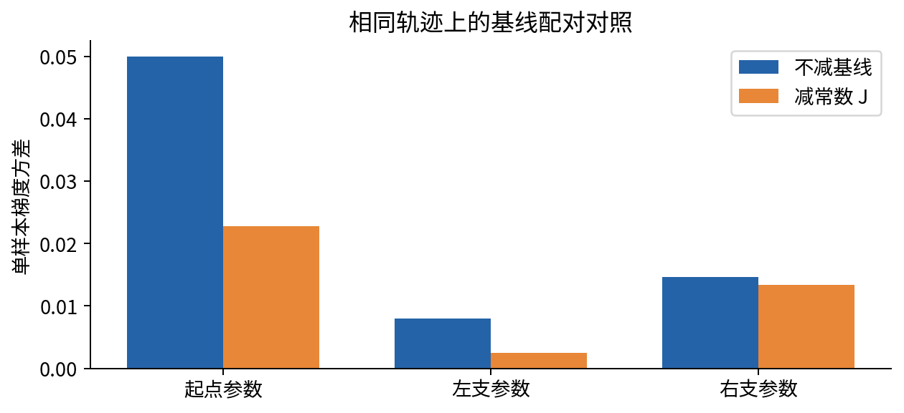
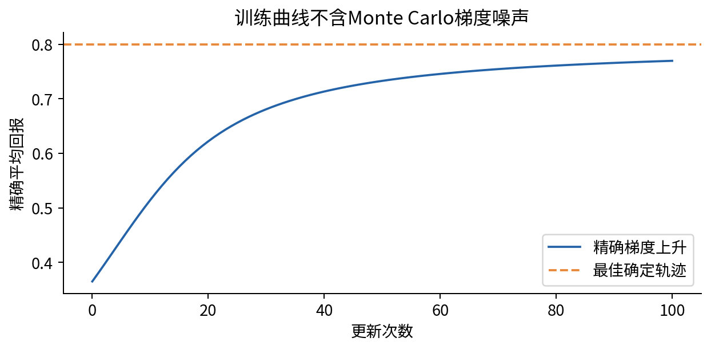

# DL084 序贯决策与策略梯度桥接

**对应大纲 L2。先修：016、018、024、032。** 本讲从只有一次选择的老虎机问题出发，走到两步决策，再推导 REINFORCE。我们先弄清“数据为什么由自己的行为产生”，再接触策略梯度、基线和重要性采样。无需先背 PPO 术语。

本课环境完全由原创代码定义，无外部账号、真实用户或付费 API。所有轨迹只有四种，可以精确枚举。它既足够小，允许手算，又足够丰富，能展示延迟奖励、状态分布变化和梯度估计方差。实验不证明任何大型语言模型经过强化学习后变得安全或聪明。

## 1 从预测转向行动

监督学习通常给定输入及目标标签，优化模型与标签的误差。决策问题则是：选择行动，环境返回结果，而这次行动还可能改变接下来会看到什么。推荐了某个内容之后，用户的后续行为会改变；搜索系统选择一条查询，下一步获得的证据也会改变。固定历史数据未必覆盖新策略会访问的情形。

奖励是设计者用一个数字表达的反馈，不是真实目标本身。研究助手的真实目标可能是可靠且节省时间地完成任务；若只奖励回答长度，系统可能堆字；若只奖励工具调用成功，系统可能不断调用无用工具。训练前应写下奖励和真实目标之间的差距，而不是训练后才解释异常行为。

先想一个单步问题：有两个按钮，按0得到奖励1的概率为0.2，按1为0.8，否则奖励0。你不知道每次随机结果，但知道在长期平均上按钮1更好。策略并不一定每次选择同一个按钮；随机化允许探索，也让我们用可微概率来描述学习。

## 2 两个动作只需要一个可学习数

设 θ 是一个实数，策略选择动作1的概率为 sigmoid：

$$p=\sigma(\theta)=\frac{1}{1+e^{-\theta}}.$$

选择动作0的概率是1−p。θ=0时两个动作等概率；θ增大时动作1更常见。策略不是奖励概率：p 是我们控制的选择概率，0.8 是环境在选择动作1之后给奖励1的概率。把二者混为一谈会错误解释训练结果。

平均奖励记为 J。两种动作按各自概率加权：

$$J(\theta)=(1-p)\mu_0+p\mu_1,\qquad \frac{dJ}{d\theta}=p(1-p)(\mu_1-\mu_0).$$

μ₀、μ₁分别是动作0、1的平均奖励。利用 sigmoid 导数 p(1−p)，上式一步可得。θ=0时梯度为0.25×0.6=0.15；梯度为正，意味着应增加 θ。这里优化的是收益，所以做梯度上升；若写负收益作为损失，才做梯度下降。符号错误是最常见的实现故障之一。

实验 θ=0.3时，精确 J≈0.5447、梯度≈0.14667。100000次真实随机模拟得到的平均梯度约0.14643，接近但不完全相同。有限样本估计会波动，不应为了匹配小数位而修改随机结果。

## 3 为什么能对离散动作求梯度

采样出的动作 a 只有0或1，不能直接对“硬币正反面”求普通导数。但动作出现的概率可微。对有限动作集合：

$$\nabla J=\sum_a R(a)\nabla\pi_\theta(a)=\sum_a\pi_\theta(a)R(a)\nabla\log\pi_\theta(a).$$

πθ(a) 表示动作概率，R(a) 是这里用来说明的收益函数，∇表示对参数求导。第二个等号使用 ∇π=π∇logπ，要求相关动作概率大于0。于是可以采样动作，计算 R(a)∇logπθ(a)，重复后取平均，而不需要把离散采样本身当作可微函数。

对 Bernoulli 策略，log概率的导数恰好是 a−p。若抽到动作1，分数为1−p；抽到动作0，分数为−p。动作获得高收益时，梯度倾向提高它的概率。这个“分数函数”技巧也称 likelihood-ratio 方法。本实验逐项枚举与 Monte Carlo 对照，不依赖自动微分黑箱。

注意，奖励若直接依赖 θ，还可能有额外导数项。本课奖励与环境动力学都不依赖策略参数，参数只改变动作概率。把本课公式用于一个可微模拟器时，必须重新说明你采用的是何种梯度估计，不能漏掉目标的参数依赖。

## 4 从单步到马尔可夫决策过程

一个有限 MDP 包括状态集合、动作集合、转移规律、奖励、初始状态分布和折扣因子。状态 s 是决策所依赖的信息摘要；动作 a 是我们选择的行为；转移概率描述采取行动后下一个状态如何出现。马尔可夫假设意味着给定当前状态和动作后，未来不再额外依赖更早历史。

真实研究任务常不满足简单可观测状态假设。例如工具结果缺失、用户意图不完整或远端服务有隐藏状态。因此把一段对话直接叫“MDP状态”是一项建模选择，不是自然事实。你可以把更多历史纳入状态，但状态空间会增长；也可以采用部分可观测模型，本课不推导其全部理论。

我们的两步环境先在起点选择 a₀。若选0，进入左支；若选1，进入右支并立即付出0.1代价。第二步在所到分支选择 a₁，然后终止。左支终局奖励为0.1或0.4，右支为0或1。右支潜力大，但要先付代价且还要学会后续选择。

## 5 回报、折扣与时间起点

一条轨迹是状态、动作、奖励随时间串成的记录。把从时间0起算的折扣回报定义为：

$$G_0=r_0+\gamma r_1+\gamma^2r_2+\cdots.$$

rₜ为第t步奖励，γ在0到1之间，用于相对折扣较晚奖励。γ不是“真实奖励发生概率”；它可能反映有限视野、建模偏好或数学收敛要求。改变γ会改变目标，不能把不同γ的回报当作同一指标直接比较。本实验γ=0.9，只有两步，因此 G₀=r₀+0.9r₁。

对四种动作组合(0,0)、(0,1)、(1,0)、(1,1)，回报分别为0.09、0.36、−0.1、0.8。最后一种最好，但初始策略未必经常走到它。若只看最终奖励而忘了第一步代价，就把目标改成另一问题。

也可定义从t开始的相对回报 Gₜ=rₜ+γrₜ₊₁+…；若总体目标仍是从0起算的折扣收益，策略梯度中相应项需要γᵗGₜ。很多代码中的“return”采用不同时间约定，抄公式前必须核对。本课直接对所有动作使用同一个 G₀，得到无偏但通常方差较大的完整轨迹估计，避免隐藏折扣因子。

## 6 逐轨迹推导 REINFORCE

设 τ 表示整条轨迹，其概率是初始状态、策略概率和环境转移概率的乘积。环境不依赖θ，因此对轨迹 log概率求导时，只剩每一步策略项：

$$\nabla\log P_\theta(\tau)=\sum_t\nabla\log\pi_\theta(a_t\mid s_t).$$

把上一节的单步技巧用于整条轨迹：

$$\nabla J=E_\tau\left[G_0\sum_t\nabla\log\pi_\theta(a_t\mid s_t)\right].$$

E 表示对由当前策略和环境共同产生的轨迹取平均。不是把历史库随便抽几条轨迹就能得到这个期望。初始参数、采样策略和估计目标必须一致，下一节会看到不一致会让方向都反转。

本课用三个参数 θ₀、θ左、θ右。每条轨迹对θ₀都有一个 a₀−p₀；只对实际访问的第二状态有 a₁−p状态；未访问分支的分数为0。程序把这些数排成长度3的 score 向量，再乘完整回报。枚举四条轨迹，按概率加权，便得到精确梯度。这提供一个比“损失下降”更强的实现参考。

## 7 价值函数和基线为什么有用

状态价值 Vπ(s) 表示从状态s出发，之后按策略π行动的平均未来回报。动作价值 Qπ(s,a) 则固定当前动作为a，再按策略继续。优势 Aπ(s,a)=Qπ(s,a)−Vπ(s)，表达这个动作相对该状态平均表现好多少。它不是绝对奖励高低，而是局部比较。

策略梯度可以减去不依赖当前动作的基线 b(s)，原因是策略概率之和恒为1，故分数函数平均为0：

$$E_{a\sim\pi}[\nabla\log\pi(a\mid s)]=\sum_a\nabla\pi(a\mid s)=0.$$

所以在相应条件下，减去基线不改变期望，却可能降低方差。若基线随动作任意变化，上面的抵消一般不成立。若从同一批样本学习基线，还要认真处理统计依赖与梯度路径；本课用确定常数避免这些额外问题。

本实验一方面在 bandit 使用常数0.5，另一方面在两步MDP使用精确 J 作为整条轨迹的常数基线。它不是已训练的 critic，不冒充最优基线。结果显示本例各坐标方差下降，但任意基线并非都有效。例如减去100会令数值幅度非常大，通常反而增加方差。

## 8 不确定性：均值正确也可能难训练

无偏意味着重复整个采样实验后，估计的平均等于目标；不意味着一次估计一定接近真实值。若梯度样本标准差为s，独立样本数为n，样本均值的标准误约为s/√n。把样本数翻倍，标准误只缩到原来的约0.707；缩小十倍通常需要约百倍样本。

本例精确两步梯度约[0.07500,0.02920,0.10971]。50000条轨迹估计约[0.07340,0.02947,0.10897]。每个坐标都应连同标准误阅读。测试使用与标准误相联系的宽容差，并不是要求每次采样严格落在一个置信区间内。

轨迹之间若相关，例如一个连续环境中没有适当重置，简单独立标准误会过于乐观。多个状态共享参数也会产生梯度坐标间相关性；只画各坐标误差条不能表示完整协方差。零基础阶段先把随机对象和重复单位说清楚，比选择复杂统计工具更重要。

## 9 离策略数据：偏差可能改变方向

采样动作的策略称为行为策略 μ，想优化的策略称为目标策略π。若两者不同，直接把 μ 的样本代入 π 的梯度，平均就不再对应目标期望。重要性权重为π(a)/μ(a)，用来调整动作出现频率：

$$E_{a\sim\pi}[f(a)]=E_{a\sim\mu}\left[\frac{\pi(a)}{\mu(a)}f(a)\right].$$

前提是目标策略赋予正概率的动作，行为策略也有正概率，即支持覆盖。若行为策略从不选择某动作，样本中没有它的信息，不能用除以零的权重补回来。多步轨迹通常涉及概率比乘积，方差可能急剧增大。

实验目标θ=0.3，行为θ=−1.3。未校正估计约−0.0183，连方向都错了；校正后约0.1458，接近精确0.1467。我们同时报告最大权重和有效样本量 ESS=(Σw)²/Σw²。ESS是权重集中度诊断，不是所有问题通用的置信度保证。

PPO 的裁剪并非“把重要性权重修好就获得无偏估计”。裁剪改变目标的局部行为，涉及偏差、方差与稳定性的取舍；其细节需要单独核对旧策略、优势和更新轮次。本课只建立读懂这些术语的桥梁，不声称已实现PPO。

## 10 学习曲线应该和什么比较

本实验最后使用精确梯度上升100步，目的是展示正确方向怎样改善策略。它不是从有限样本训练的REINFORCE性能基准；Monte Carlo部分独立用于核验估计。若混淆这两部分，就会错误声称随机算法有一条完全平滑的学习曲线。

初始平均回报约0.365，训练后约0.770，接近但未到最佳确定策略的0.8。有限θ经sigmoid仍有探索概率；要达到完全确定策略通常需要参数趋于极端。学习率过大可能导致震荡或数值问题，当前平滑结果只对应本例设置。

真正比较随机学习算法，应给相同环境交互预算，重复多个随机种子，画跨运行分布或区间，同时报告每次轨迹长度、终止规则和奖励变化。用更多环境采样换来更高分，不应全部归功于算法公式。

## 11 奖励设计与语言模型的连接

语言生成可以把token选择看成动作，把已有前缀看成状态，把完整回答得分看成终局奖励。这样做能连接策略梯度，但状态维度、动作数、长时信用分配和奖励模型误差都远大于本课玩具环境。一个末端奖励不能精确告诉你究竟哪个token导致好坏，因此方差控制和合理评价很重要。

若奖励模型只喜欢某种语气，优化可能增加这种语气却不增加事实准确率。若奖励器见过测试答案，训练系统可能迎合泄漏。应建立不由同一奖励器独自决定的评价，包括可验证任务、保留数据、人类审查或明确约束。奖励提高不是现实效用或安全性保证。

研究起步可先提出一个小问题：在固定两步环境中，常数基线是否在不改变梯度期望的情况下减少方差？实验包含精确答案、无基线对照、同样样本和明确失败条件。把这种证据习惯带到复杂后训练，比直接追逐算法名更可靠。

## 12 误区与总结

- 把策略概率当环境奖励概率：一个可控，一个由环境决定。
- 最大化收益却做梯度下降：检查一次手算更新方向。
- 用离策略样本直接算在策略梯度：先核对采样分布。
- 把任意动作相关基线都说成无偏：它一般不会抵消。
- 混用G₀、Gₜ和γᵗ：先写清目标时间起点。
- 只因一次曲线变好就宣称算法稳定：需要重复运行与预算对照。

本讲最重要的三个对象是轨迹分布、目标回报和梯度估计。它们必须属于同一问题。下一讲把人们对两条回答的偏好转成概率模型，再研究直接偏好优化，不把偏好、奖励与事实正确性混成一件事。
