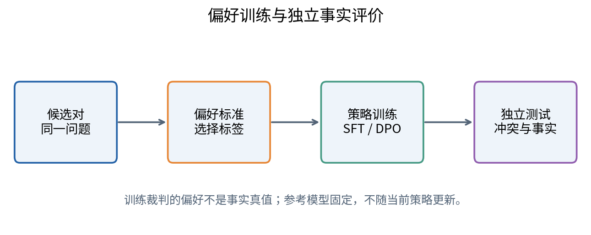
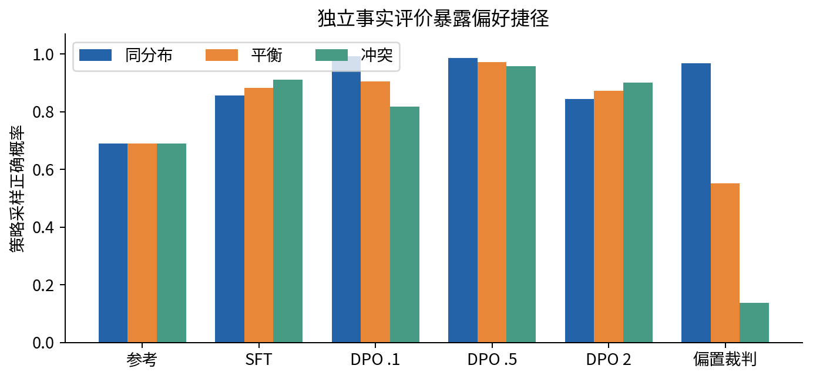
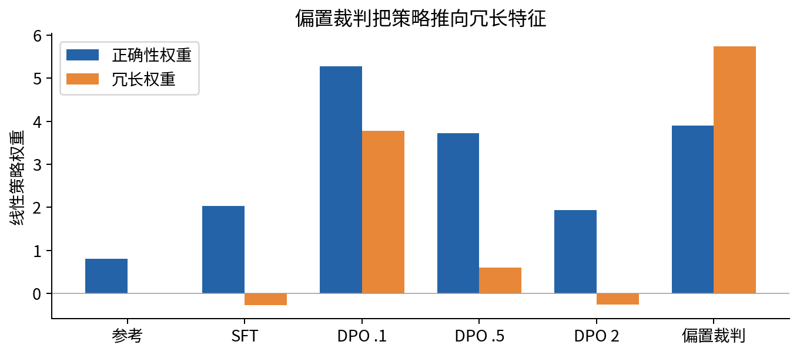
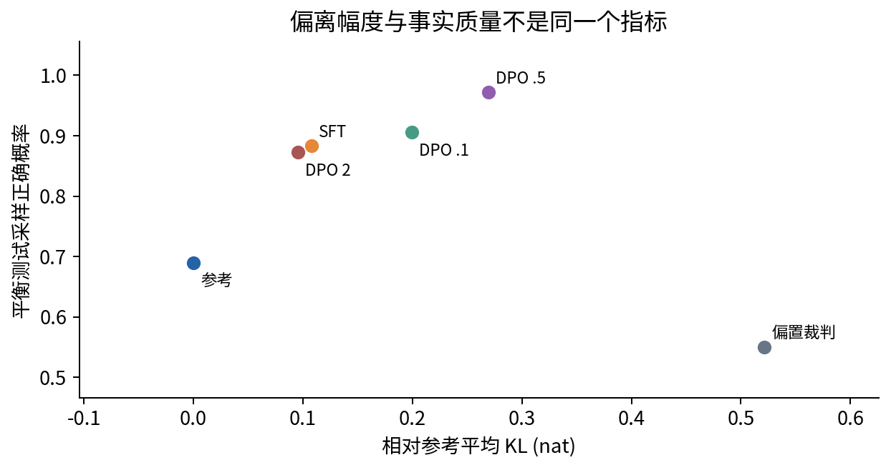

# DL085 偏好学习与语言模型后训练

**对应大纲 L3。先修：019、056、L1；强化学习解释补L2。** 本讲把“这条回答比那条好”变成可计算的训练目标，推导 Bradley–Terry 型偏好概率与 DPO，并把标注偏好、策略概率、事实正确性分开评价。

学习后你应能解释：为什么 DPO 要减去参考模型的 log概率比，为什么 beta 不能只被叫作“学习率”，为什么偏好胜率提高可能反而损害任务正确率。实验只使用原创两候选回答的条件策略，不调用真实LLM，不生成自然语言长回答，也不宣称已复现大型模型的对齐效果。

## 1 示范、偏好与奖励各提供什么信息

监督微调给出一个推荐答案，告诉模型“请提高它的概率”。偏好数据给出同一问题下的两个候选及相对选择，告诉模型“这一条比那一条更符合某项标准”。奖励数据则为候选分配一个数值。三者信息结构不同：只知道甲优于乙，不知道差距是0.1还是10，也不保证甲绝对合格。

例如研究摘要A清晰但遗漏置信区间，摘要B更长却把相关性写成因果。若标注标准是“事实准确优先”，应选A；若只问“哪一条更详细”，可能选B。没有记录评价标准的偏好标签容易被错误地当作统一质量真值。多个标注者还可能有合理而不同的偏好，应保留分歧而非全部视为噪声。

训练数据通常记为(x,y_w,y_l)：x为问题，y_w为被选回答，y_l为未被选回答。w和l表示本次比较中的胜者和败者，不等于事实上的真与假。若两条都错，依然可以有人被迫选一条。数据字典必须写明标签是谁按什么标准产生的。

## 2 把相对判断写成概率

假设每个回答有一个实数效用 r(x,y)。两回答效用差越大，选择前者概率越高。常用形式为：

$$P(y_w\succ y_l\mid x)=\sigma(r(x,y_w)-r(x,y_l)).$$

σ为sigmoid，符号≻表示本次偏好关系。若效用相同，概率0.5；差为2，概率约0.881；差为−2，概率约0.119。这里预测的是标注选择，而不是回答正确的概率。只有标签机制真的对应正确性且经过额外验证时，二者才可能联系。

给所有回答的效用加上同一个只依赖问题的常数，不改变差值，所以偏好无法识别绝对效用零点。比较图若分成互不连接的回答群，群之间的相对位置也可能缺乏信息。无限重复同一对回答，不能替代覆盖更多关键比较。

对于二元标签 y∈{0,1}，设 z 是第一候选与第二候选的效用差，则交叉熵可写成 log(1+exp(z))−yz。程序使用 logaddexp(0,z)，避免大正数指数溢出。不要先把概率截到粗糙范围再求导，否则可能改变优化行为。

## 3 从偏好模型到奖励建模

一种传统路线先训练奖励模型，使人类选中的回答获得更大预测效用，再用强化学习提高策略生成回答的奖励。奖励模型在这里扮演可学习裁判，但它也会犯错。策略不断寻找高奖励区域时，可能进入奖励模型训练数据覆盖很少的区域，利用它的误差。

例如奖励器误把“术语多、篇幅长”当作研究质量，优化会制造听起来专业但没有证据的长答案。奖励器在原始留出集表现不错，也不保证它能正确评判后续专门迎合它的策略输出。这是一种分布变化，不一定需要恶意设计者才会发生。

为限制策略偏离，一种理想目标加入相对参考策略的KL惩罚。参考策略π_ref常是已完成SFT的模型。KL衡量两个完整概率分布的差异，不是两个答案文本的编辑距离。高KL不自动代表坏，低KL也不保证事实安全；它约束的是分布变化。

## 4 KL约束下的理想策略是什么

固定一个问题x，在有限候选集合上考虑：

$$\max_\pi\;\sum_y\pi(y\mid x)r(x,y)-\beta\sum_y\pi(y\mid x)\log\frac{\pi(y\mid x)}{\pi_{ref}(y\mid x)}.$$

π是候选概率且总和为1；r是效用；β>0控制偏离参考的代价。本段假设参考对候选有正概率、效用有限，并把所有分布都视为可自由优化。真实神经网络受参数共享和训练误差限制，不一定能实现这个理想解。

加上概率归一化约束的拉格朗日乘子，对每个π(y|x)求导并令其为0，可得 log(π/π_ref)=r/β+一个只依赖x的常数。归一化后：

$$\pi^*(y\mid x)=\frac{\pi_{ref}(y\mid x)\exp(r(x,y)/\beta)}{Z(x)}.$$

Z(x)是所有候选分子之和，使概率总和为1。β大时，奖励差对概率的影响变弱，理想策略更贴近参考；β小时，奖励差被放大。这是理想目标的关系，不是有限步训练中所有观测指标必然随β单调。

## 5 DPO的代换为何能消去归一化常数

把上式反过来写成 r=βlog(π*/π_ref)+βlogZ。代入偏好概率时，同一问题的两回答都带有相同βlogZ，因此相减消去。用可训练策略πθ代替理想π*，定义：

$$z=\beta\left[\log\frac{\pi_\theta(y_w\mid x)}{\pi_{ref}(y_w\mid x)}-\log\frac{\pi_\theta(y_l\mid x)}{\pi_{ref}(y_l\mid x)}\right],\qquad L=-\log\sigma(z).$$

这就是本讲使用的DPO成对损失。括号第一项衡量被选回答相对参考的概率提升，第二项衡量未选回答相对参考的概率提升，二者相减。不能只提高胜者原始概率就说实现了DPO；参考比率和败者项都不可随意删除。

当策略等于参考时，括号为0，所以每对初始损失都是log2≈0.6931，与参考本来更喜欢哪条无关。它不是说参考对两条回答各有一半生成概率，而是说“相对参考的偏好改动证据”处于中性起点。这个区分是理解DPO最有用的手算检查。

本讲推导采用有限候选和理想偏好模型。它说明目标之间的联系，不证明真实人类偏好一定满足这个概率模型，也不证明有限数据DPO优化能找到全局最优，更不证明训练结果安全。方法的数学动机和现实适用性必须分开。

## 6 一个数字例子

参考模型给胜者概率0.2、败者0.4；当前模型分别为0.3、0.3。胜者相对参考增加到1.5倍，败者变为0.75倍，因此相对比率为2，括号为log2。若β=0.5，z约0.3466，偏好概率约0.5858，损失约0.5348。

注意，当前模型给两者同样概率，仍可以产生正向DPO进步，因为参考本来更偏好败者。若只检查“当前胜者是否大于败者”，会遗漏参考校正的意义。另一方面，DPO损失改善也不必然让所有胜者的绝对概率同时上升，因为不同回答竞争概率质量、共享参数且可能有冲突标签。

对z求导得到 dL/dz=σ(z)−1。z很负时梯度幅度大，模型强烈纠正相对排序；z很正时梯度趋小。实际参数梯度还乘β和序列log概率的导数，因此β既影响目标解释，也影响数值尺度；它不是单纯替换学习率就可以完全抵消。

## 7 长回答、序列概率与掩码

真实语言模型的回答概率通常是各token条件概率的乘积，log概率就是各token log概率之和。DPO中的两回答长度可能不同。若把求和改为平均，会改变目标，并不再是完全相同的标准序列概率形式。长度偏差需要明确方法和独立测试，而不是偷偷改公式后仍声称完全一致。

答案前的提示通常不计入回答log概率，填充token也应排除。两候选必须使用同一问题、相同聊天模板和明确结束符，否则概率比较混入格式差异。参考模型与训练模型应使用相容的分词与模板；缓存参考log概率时，还要绑定数据哈希和参考版本。

离线偏好训练不需要在每次更新时在线生成新回答，但偏好数据来源仍有选择偏差。如果只收集模型常生成的答案，新策略进入少见区域时可能没有比较证据。通过后训练提高已有候选的排序，与扩展到全新复杂任务能力，是两种不同主张。

## 8 本课的两候选策略

每个问题有两个候选。我们不用自然语言，而用两项差分特征表示它们：第一项c∈{−1,+1}表示第一候选相对第二候选的正确性方向；第二项v∈{−1,+1}表示冗长程度方向。策略分数差为 w_c c+w_v v，第一候选概率为其sigmoid。

正确性特征在本玩具世界直接可见，现实通常没有这么理想的输入。它让我们能够精确知道捷径何时发生，不意味着真实LLM可以直接读取正确答案标记。参考权重是[0.8,0]，只弱偏好正确性，不偏好冗长。训练集400对，其中95%的时候正确答案也更长；这使“选长的”看起来很有效。

普通标注者按σ(2c)选择，约有11.9%的随机分歧。独立事实评价则把c所指定的候选当作正确；我们把“与带噪标注一致”和“选择事实正确候选”分别报告。评价包括同分布、50%相关的平衡条件，以及正确答案总是更短的冲突条件，各1000对，使用独立种子。

SFT基线在两候选归一化策略中提升被选候选的概率，等价于一项二元交叉熵。DPO则训练参考校正后的分数差。由于候选只有两条，这个基线不代表长文本SFT的所有机制，优点是目标差异完全可核查。

## 9 实际结果应该怎样读

实验比较参考、SFT以及β为0.1、0.5、2的DPO，固定600次全批次更新。我们额外训练一个偏置裁判版本：标签一律选择更长候选。该版本可以在训练裁判上取得很高一致，却在冲突条件贪心正确率为0。它清楚展示“奖励器满意”与“事实正确”可以朝相反方向变化。

本次冲突条件中，参考采样正确率约0.690，SFT约0.910，β=0.5的DPO约0.958，而偏置裁判DPO约0.138。普通方案的贪心正确率都为1，说明贪心指标掩盖了概率质量差异。我们不是为了让DPO必胜而隐藏SFT；两者对应不同目标、尺度和有限训练状态。

β=0.1版本在有限600步中仍带较强冗长权重，冲突正确率约0.818。不能据此得出“小β普遍更差”。β影响优化尺度和理想偏离程度，固定学习率与步数不是充分调优后的公平排名。研究中应设置验证集和相等调参预算，避免拿一个未收敛方案作陪衬。

## 10 KL、胜率与质量不能互相替代

本课能够对两候选分布精确求KL：p log(p/q)+(1−p)log((1−p)/(1−q))，p为当前第一候选概率，q为参考概率。参考与自身KL为0；一般KL非负，但不对称。对长文本真实模型，采样估计、截断和序列长度会使测量更复杂，不能把本课两项求和直接称为真实完整语言分布KL。

偏好胜率依赖候选来源、比较对手、问题分布和裁判标准。对弱基线胜率高，不保证对强基线也高；同一个裁判同时产生训练偏好和最终评价，容易自证。实际报告应包括裁判盲化、候选顺序随机化、位置偏差测试、独立可验证任务和人工分歧分析。

## 11 建立一个有反证机会的研究计划

可以提出“偏好数据中的表面特征相关会导致后训练依赖捷径”。最少需要四种证据：训练相关性可控；改变相关性而保留任务规则的测试；普通与偏置标注对照；独立事实指标。若模型在冲突测试仍然正确，就不能仅因训练含偏差便断言它一定学了捷径。

把真实任务扩展为科研回答时，应选择可核查的算术、引用定位或证据提取问题，冻结问题和正确性规则，再收集不同风格的候选。对人类偏好收集要说明授权、隐私与使用范围。不要未经许可公开带个人信息的标注文本。本课只有合成特征，无真实个人数据。

保存参考权重、偏好对、标签标准、训练配置、随机种子、输出概率和失败案例。比较时固定候选集合只是第一阶段；若要声称生成能力改善，还要在模型自行生成的回答上重新评价，区分候选排序与开放生成。不能把本课缺失的环节写成已经完成。

## 12 误区与结论

- 偏好不是事实真值，胜者可能只是“两条坏答案中较好的一条”。
- DPO不等于只增加胜者概率；它比较相对参考的成对log概率比。
- 参考相等时log2是偏好目标的中性起点，不是生成概率均匀。
- beta不是只改变学习速度，它也控制理想KL正则权衡。
- 同一裁判训练与验收容易自证，独立事实指标不可省略。
- 玩具候选策略不等于真实LLM后训练；本课仅核验目标、梯度和偏差机制。

后训练的研究价值不在于获得更高一个总分，而在于知道分数由什么信息、什么偏差和什么目标产生。下一讲把模型放入检索与工具系统，继续区分模型能力和系统设计带来的效果。
