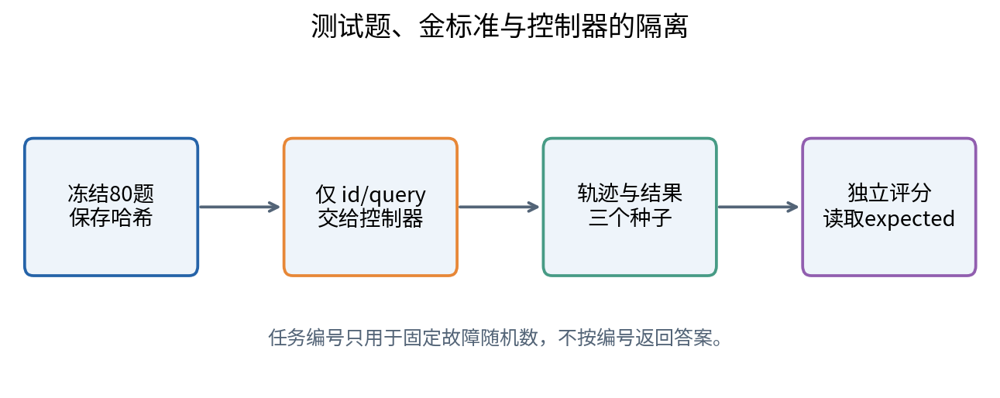
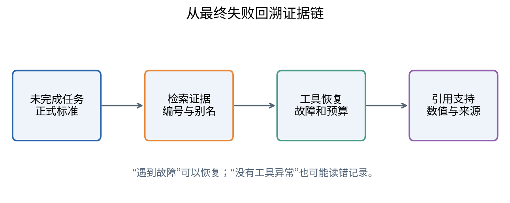
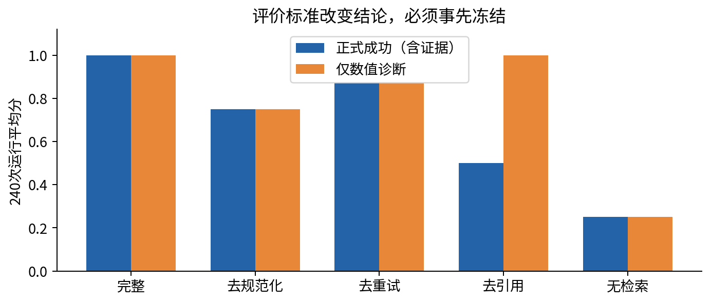
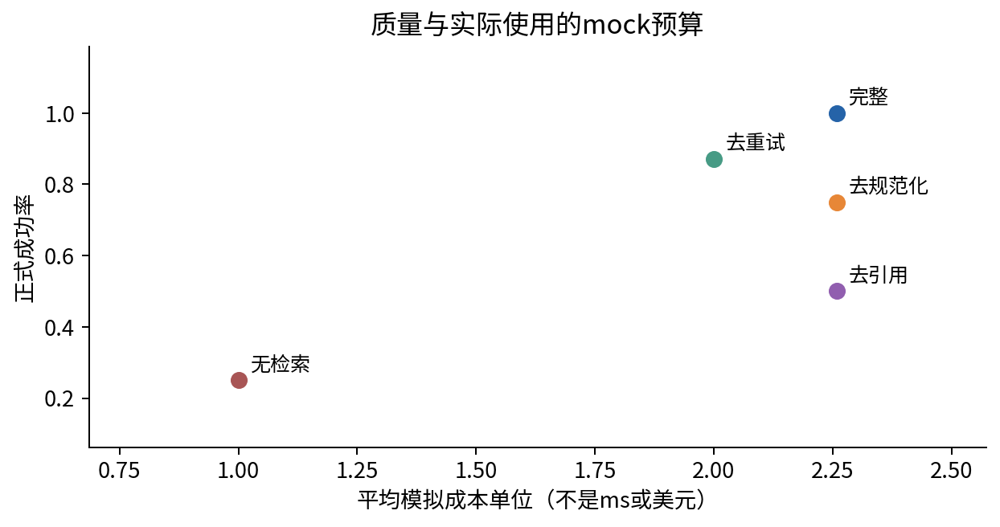

# DL087 Agent与检索系统的研究评价

**对应大纲 L5。先修：022、L4。** 本讲把“系统看起来更好”变成能被反驳、重跑和审查的结论。学习目标：冻结任务与成功标准，区分检索、工具、证据和最终答案，设计配对消融，并在明确成本边界下解释结果。

本实验包含80个原创合成任务、3个固定故障种子、5个确定性系统版本。它不调用真实语言模型或外部工具。所有“成本”都是人为定义的记账单位，**不是实测延迟、token消耗或API价格**。满分结果只说明控制器在这组很窄的规则任务上通过，不代表真实科研助手能力。

## 1 先定义研究对象，后谈排行榜

一个Agent结果由模型、提示、检索器、语料、工具、权限、记忆、控制策略和评价器共同产生。若比较时这些因素同时变化，即便分数提高，也无法知道是哪一个环节起作用。系统研究应把版本写成配置集合，而不是只标注一个模型名字。

例如改进版既增加了检索规范化，又允许更多重试，还换了更长提示。它可能更好，但“规范化导致提升”的主张缺乏单独证据。一次只移除一个组件的消融能提供局部证据；若组件互相依赖，单组件差值也不能简单相加。

本课研究三个具体问题：别名规范化是否减少检索错误？重试是否在同一调用上限内恢复瞬时失败？只看最终数值会不会漏掉证据缺失？每个问题都有一个可控对照和独立指标，避免用一个总分包办全部解释。

## 2 冻结任务集意味着冻结哪些东西

冻结不仅是保存问题文本，还包括任务编号、数据快照、期望行为、评分规则和分组。任务一旦进入最终测试，不应在看到系统输出后修改成功标准。如果后来发现标准错误，可以发布修订版本并让所有方法重新运行，不能只改不利于某个方法的题目。

本课80题分为四组，每组20题：直接编号读取、别名读取、记录缺失、权限拒绝。前两组需要返回正确值和支持它的记录编号；缺失组应明确停止；权限组应拒绝。把这些不同任务混在一起时，必须公布比例，否则“总成功率”依赖人为任务配方。

任务文件含expected字段供评价器使用，控制器实际收到的对象只有id和query，不含expected和group。这个边界很重要：若把答案字段一起传给模型或检索器，再报告高分，就构成标签泄漏。本实验代码明确构造可见字段子集，并有测试证明不需要读取金标准。

## 3 成功不是“返回了一个东西”

对可回答任务，我们要求状态为ok、数值正确、引用记录编号正确。只返回正确数字但没有证据，不满足本课科研可追溯性目标。对缺失任务，abstain才是成功；对越权任务，denied才是成功。不同任务的成功规则应该在运行前写清楚。

用指示变量S_i表示第i个任务是否成功，成功为1，失败为0，则平均成功率为：

$$\hat p=\frac{1}{N}\sum_{i=1}^{N}S_i.$$

N是任务数，不是工具调用数。如果同一任务重复多个种子，先说明是把每次运行作为单位，还是先平均为任务级得分。本课报告总体运行均值，同时做推断时以任务为重采样单位，保留同一任务三次运行的依赖结构。

一个反例：系统对所有任务都拒答。在本课中，它可通过20个缺失任务，却不能通过20个应明确权限拒绝的任务，更不能完成40个可回答任务，故成功率只有25%。把“没有发生越权”当作全任务成功会奖励无用系统，必须同时报告可用性和边界行为。

## 4 检索召回与端到端成功的关系

对有标准证据的可回答任务，检索召回@k表示正确证据是否出现在返回的前k条候选中。单个任务用0或1表示；多个任务取平均。本课返回单条候选，相当于k=1，因此指标更简单。缺失和权限任务没有同样的正例证据，不应被随意填成召回0再混入平均。

检索召回高只保证证据可用，不保证工具读对、计算对或答案引用对。我们专门移除引用输出，检索仍完好、数值仍正确，但完整成功率下降。若只用最终数值评分，就会错把这个版本评价为与完整系统一样可靠。

检索指标还依赖金标准是否完整。真实科研问题可能有多篇等价支持文献；只标一篇会把其他正确证据误判为错。应允许证据集合，或者进行人工复核。本课唯一编号记录没有这种歧义，不能把这种易评分性外推到开放文献检索。

## 5 轨迹错误提供失败定位

轨迹错误可以分层：查询理解错误、检索遗漏、记录选择错误、工具格式错误、权限失败、瞬时工具故障、预算耗尽、结果解释错误、引用不支持和错误终止。分类要能由保存事件核验，不应只根据最终答案猜原因。

本课把transient_failure出现记为一次“遇到模拟瞬时故障”的任务。完整系统可能遇到故障但成功恢复，因此故障发生率不等于失败率。反过来，一个错误记录被顺利读取，没有工具异常，却仍是任务失败。基础设施健康与任务正确性是两个维度。

若只看平均答案正确率，可能不知道改进是否来自更好证据、更多重试或更宽松裁判。轨迹分析应尽量自动化，但要保留代表性样本供人工检查。人工分类也应盲化方法名称，避免因“新方法”标签而给予更宽容解释。

## 6 配对设计为什么比两份平均更有信息

让系统A和B在同一任务、同一故障种子和同一语料上运行，得到成对结果A_i和B_i。差值D_i=A_i−B_i可以抵消部分任务难度差异。平均差：

$$\bar D=\frac{1}{N}\sum_i(A_i-B_i).$$

它等于均值之差，但标准误取决于配对相关性。若把A和B分别独立重采样，丢掉了它们在同一任务上的对应关系，可能给出不合适的不确定性。对同一个问题做三次采样，也不能简单把样本量当作三个全新问题。

本课每题使用种子11、22、33，故障是否发生由任务编号和种子确定，各系统共享这个结果。先对每题三次成功结果取平均，再对80个任务索引有放回抽样4000次；每次同一个索引同时取A和B，计算平均差，再取2.5%与97.5%分位数。

这些区间是对当前经验任务分布的bootstrap描述，不保证真实开放任务总体覆盖率，也不包含“重新训练一个模型”或“换一套任务设计”的全部不确定性。四组各20题是固定配方，而普通任务bootstrap允许组比例波动；若研究目标固定组权重，应改用分层bootstrap。本讲保留此选择并说明限制。

## 7 消融：移除组件时不要偷偷改变其他条件

完整系统有别名规范化、最多两次工具尝试和引用输出。no_normalization去掉别名转换；no_retry只尝试一次；no_citation保留数值但删去引用；no_retrieval完全不查证据并停止。所有版本都有最多两次工具尝试的同一预算上限，没有谁获得额外上限。

相同预算上限不意味着实际资源消耗相等：no_retry少用了一些重试，因此平均成本更低。我们把成功与成本一起报告，而不是宣称质量提升“免费”。no_retrieval是诊断下界，并非真正强的无检索语言模型基线；因为没有LLM，本课不存在模型凭知识直接回答这一能力。

别名规范化将sample-20转换为E020，映射规则事先写定。无规范化版本遇到别名会错误选择首条记录，这是一项刻意定义的失败机制，不是普遍检索器性能。它让消融效果易于解释，却使任务很简单。严肃研究应加入强词法与语义基线、未见别名和更复杂歧义。

## 8 实际得到什么结果

完整系统在80题、3种故障序列共240次运行上成功率1.0；去别名规范化为0.75；去重试约0.8708；去引用为0.5；不检索为0.25。完整系统满分是因为环境设计允许第二次总成功、规则解析覆盖所有任务，不能据此声称部署安全或科研能力完备。

完整系统减去无重试系统的配对平均差约0.1292，bootstrap区间约[0.0875,0.1750]。完整系统减去无规范化为0.25，区间约[0.1625,0.35]。这些差值成立于当前任务配方和模拟故障机制，不是自然界中重试或规范化的通用收益。

去引用版本“value_only_score”为1，而正式成功率为0.5。这个例子特别重要：同一组输出，只因评价标准不同，结论便会从“没有影响”变成“大幅损害可追溯性”。应提前选择与研究目标一致的成功规则，并把辅助指标保留为诊断。

## 9 成本模型必须写出单位

本课定义一次检索计1单位，每次mock工具尝试计2单位。成功没有发生瞬时故障的可回答任务成本为3，有一次故障后重试为5；缺失或权限拒绝任务成本为1。定义为：

$$C=1+2A,$$

A是实际工具尝试次数。它是人为成本模型，不是秒、美元或token。完整系统平均成本约2.2583单位，无重试为2单位；两者差来自恢复额外尝试。不检索版本仍记1单位，作为固定控制开销，代码字段说明保持这个约定。

真实服务评价应测冷启动、稳态、并发负载、尾部延迟、缓存、重试、工具调用和失败请求的成本。模型输入输出token、检索费用、数据库和人工审核也可能重要。不要用本课Python脚本的墙钟时间冒充LLM服务延迟，更不要给模拟单位换上“ms”标签。

## 10 预算匹配、质量约束与前沿

一种比较固定最大预算，问哪种方案成功率高；另一种固定最低质量，问哪种方案成本低。这两个问题不同。前者允许系统不花完预算，后者要求检查达标范围。研究应先声明目标，再选择图与指标。

Pareto前沿指在当前候选中，没有另一个方案同时质量不低、成本不高且至少一项更好的点。它不是全世界最优，也依赖质量维度。若只用value_only作为质量，去引用版本看起来可与完整系统一样；一旦把证据正确性纳入，结论改变。

平均成本还可能掩盖难题负担。应按任务组报告，检查是否只是简单组被快速拒绝，使总体平均好看。本课四组结果在metrics.json中逐项保存；真实任务需报告长尾、群体或领域差异，并说明样本量不足处的不确定性。

## 11 污染与裁判偏差审计

任务污染可能来自训练数据包含测试问题、检索库包含标注答案、缓存直接按测试编号返回金标准，或者调参时反复查看测试。数据哈希只能识别内容版本变化，不能证明从未泄漏。研究人员需要追踪数据流，并对控制器输入做实际检查。

本课task_id用于确定故障随机数，不用于返回答案；答案来自查询解析和语料。这个设计也应披露，否则读者可能怀疑编号查表。若把expected字段暴露给控制器，即使控制器暂时未使用，也会增大无意泄漏风险，所以我们主动移除。

裁判偏差包括偏爱长回答、位置偏差、风格偏差、同源模型偏好以及不能核对引用。可采用候选顺序交换、隐藏系统身份、构造已知正确与错误的校准题、独立事实工具和双人审查。模型裁判的高一致性不等于高有效性：它可能稳定地犯同一种错误。

## 12 能说到哪里，必须在哪里停止

本课支持的结论是：在冻结的合成任务和模拟故障中，规则规范化与有限重试分别修复了预先定义的失败路径；证据约束揭示了数值评分漏掉的缺陷。它不支持“某个LLM更善于规划”“真实科研成功率100%”或“系统能抵挡所有攻击”。

下一步真实研究应接入经授权的模型、使用独立任务设计者、保留不可见测试和实际负载，先运行小规模安全沙盒。若扩大权限或引入真实外部写操作，需单独授权和风险控制；课程中的模拟允许动作不能直接变成生产权限。

一份可以交给别人审查的报告应包含：研究问题、系统版本、任务与语料来源、冻结哈希、成功规则、预算、所有运行轨迹、配对结果、失败案例、统计方法、成本边界、污染审计与限制。负结果也要保存，因为它告诉后来者哪个组件没有提供预期收益。

## 13 自检清单

- 测试题与答案是否在调参前冻结？
- 控制器是否真正看不到金标准？
- 同一任务的多个种子是否被误当独立题目？
- 检索召回是否仅在有正例证据的任务上计算？
- 成功是否要求正确的权限行为与证据？
- 消融是否保持相同预算上限并报告实际成本？
- 模拟成本是否明确没有被写成实测延迟？
- 结论是否只覆盖当前任务与环境，而没有变成普遍因果或安全保证？

本批L1至L5至此闭合：参数适配、策略梯度、偏好后训练、工具系统与研究评价各自有不同证据。真正的研究能力，是知道它们如何衔接，也知道一层通过不等于其他层自动通过。
